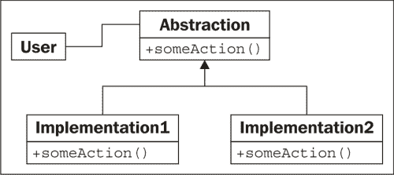
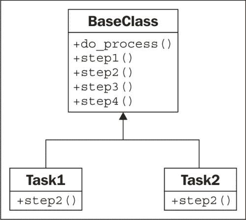

# 十、Python 设计模式一

在最后一章中，我们简要介绍了设计模式，并介绍了迭代器模式，这是一种非常有用和常见的模式，它已被抽象为编程语言本身的核心。在本章中，我们将回顾其他常见模式，以及它们是如何在 Python 中实现的。与迭代一样，Python 通常提供一种替代语法，以简化处理此类问题的工作。我们将介绍这些模式的“传统”设计和 Python 版本。总之，我们将看到：

*   许多特定模式
*   Python 中每个模式的规范实现
*   替换某些模式的 Python 语法

# 装饰图案

装饰器模式允许我们将提供核心功能的对象与改变此功能的其他对象“包装”在一起。任何使用装饰对象的对象都将以与未装饰对象完全相同的方式与其交互（即，装饰对象的接口与核心对象的接口相同）。

装饰图案有两种主要用途：

*   增强组件向第二个组件发送数据时的响应
*   支持多种可选行为

第二种选择通常是多重继承的合适替代方案。我们可以构造一个核心对象，然后围绕该核心创建一个装饰器。由于 decorator 对象与核心对象具有相同的接口，因此我们甚至可以将新对象包装到其他 decorator 中。以下是它在 UML 中的外观：


在这里，**核心**和所有的装饰器都实现了一个特定的**接口**。装饰程序通过组合维护对该**接口**的另一个实例的引用。调用时，装饰器在调用其包装接口之前或之后执行一些附加处理。包装对象可能是另一个装饰器，也可能是核心功能。虽然多个 decorator 可以相互包装，但所有这些 decorator 的“中心”中的对象提供了核心功能。

## 一个装饰师的例子

我们来看一个网络编程的例子。我们将使用 TCP 套接字。`socket.send()`方法获取一串输入字节，并将它们输出到另一端的接收套接字。有很多库接受套接字并访问此函数以在流上发送数据。让我们创建这样一个对象；它将是一个交互式 shell，等待来自客户端的连接，然后提示用户输入字符串响应：

```py
import socket

def respond(client):
    response = input("Enter a value: ")
    client.send(bytes(response, 'utf8'))
    client.close()

server = socket.socket(socket.AF_INET, socket.SOCK_STREAM)
server.bind(('localhost',2401))
server.listen(1)
try:
    while True:
        client, addr = server.accept()
        respond(client)
finally:
    server.close()
```

`respond`函数接受套接字参数，并提示将数据作为应答发送，然后发送。为了使用它，我们构造了一个服务器套接字，并告诉它在本地计算机上监听端口`2401`（我随机选择了端口）。当客户端连接时，它调用`respond`函数，该函数以交互方式请求数据并做出相应响应。需要注意的是，`respond`函数只关心套接字接口的两种方法：`send`和`close`。为了测试这一点，我们可以编写一个非常简单的客户端，它连接到同一个端口，并在退出之前输出响应：

```py
import socket

client = socket.socket(socket.AF_INET, socket.SOCK_STREAM)
client.connect(('localhost', 2401))
print("Received: {0}".format(client.recv(1024)))
client.close()
```

要使用这些程序，请执行以下操作：

1.  在一个终端中启动服务器。
2.  打开第二个终端窗口并运行客户端。
3.  在服务器窗口中的**输入值：**提示下，键入值并按 Enter 键。
4.  客户端将接收您键入的内容，将其打印到控制台，然后退出。再次运行客户端；服务器将提示输入第二个值。

现在，再看看我们的服务器代码，我们看到两个部分。`respond`函数将数据发送到套接字对象。剩下的脚本负责创建该套接字对象。我们将创建一对装饰器来定制套接字行为，而无需扩展或修改套接字本身。

让我们从一个“日志”装饰器开始。此对象在将数据发送到客户端之前，会输出发送到服务器控制台的任何数据：

```py
class LogSocket:
    def __init__(self, socket):
        self.socket = socket

 def send(self, data):
 print("Sending {0} to {1}".format(
 data, self.socket.getpeername()[0]))
 self.socket.send(data)

 def close(self):
 self.socket.close()

```

这个类装饰一个套接字对象，并向客户端套接字提供`send`和`close`接口。更好的装饰器还可以实现（并可能定制）所有剩余的套接字方法。它还应该正确地实现`send`的所有参数（实际上它接受一个可选的 flags 参数），但是让我们保持简单的示例！每当在此对象上调用`send`时，它都会将输出记录到屏幕上，然后使用原始套接字将数据发送到客户端。

我们只需更改原始代码中的一行即可使用此装饰器。我们不是用插座调用`respond`，而是用装饰插座调用它：

```py
respond(LogSocket(client))
```

虽然这很简单，但我们必须问问自己为什么不扩展 socket 类并重写`send`方法。在我们登录之后，我们可以调用`super().send`进行实际发送。这种设计也没有什么问题。

在面临装饰器和继承之间的选择时，只有在需要根据某些条件动态修改对象时，才应该使用装饰器。例如，我们可能只希望在服务器当前处于调试模式时启用日志装饰器。当我们有多个可选行为时，decorator 也会击败多重继承。例如，我们可以编写第二个 decorator，在调用`send`时使用`gzip`压缩来压缩数据：

```py
import gzip
from io import BytesIO

class GzipSocket:
    def __init__(self, socket):
        self.socket = socket

    def send(self, data):
        buf = BytesIO()
        zipfile = gzip.GzipFile(fileobj=buf, mode="w")
        zipfile.write(data)
        zipfile.close()
 self.socket.send(buf.getvalue())

    def close(self):
        self.socket.close()
```

此版本中的`send`方法在将传入数据发送到客户端之前对其进行压缩。

现在我们有了这两个装饰器，我们可以编写代码，在响应时在它们之间动态切换。此示例并不完整，但它说明了我们可能遵循的混合和匹配装饰器的逻辑：

```py
        client, addr = server.accept()
        if log_send:
            client = LoggingSocket(client)
        if client.getpeername()[0] in compress_hosts:
            client = GzipSocket(client)
        respond(client)
```

此代码检查名为`log_send`的假设配置变量。如果启用，它会将套接字包装在一个`LoggingSocket`装饰器中。类似地，它检查已连接的客户端是否位于已知可接受压缩内容的地址列表中。如果是这样，它将客户机包装在一个`GzipSocket`装饰器中。请注意，根据配置和连接客户机的不同，可能不启用任何装饰程序，也可能同时启用两个装饰程序。试着用多重继承写这篇文章，看看你有多困惑！

## Python 中的修饰符

装饰器模式在 Python 中很有用，但还有其他选项。例如，我们可以使用 monkey 补丁，我们在[第 7 章](07.html "Chapter 7. Python Object-oriented Shortcuts")、*Python 面向对象快捷方式*中讨论过，以获得类似的效果。单一继承，其中“可选”计算是在一个大方法中完成的，这是一个选项，而多重继承不应该因为不适合前面看到的特定示例而被注销！

在 Python 中，在函数上使用此模式非常常见。正如我们在前一章中所看到的，函数也是对象。事实上，函数修饰非常常见，Python 提供了一种特殊的语法，使得将这种修饰应用于函数变得非常容易。

例如，我们可以以更一般的方式查看日志记录示例。与只在套接字上发送调用的日志记录不同，我们可能会发现记录对某些函数或方法的所有调用很有帮助。以下示例实现了一个 decorator，该 decorator 只执行以下操作：

```py
import time

def log_calls(func):
 def wrapper(*args, **kwargs):
        now = time.time()
        print("Calling {0} with {1} and {2}".format(
            func.__name__, args, kwargs))
 return_value = func(*args, **kwargs)
        print("Executed {0} in {1}ms".format(
            func.__name__, time.time() - now))
        return return_value
 return wrapper

def test1(a,b,c):
    print("\ttest1 called")

def test2(a,b):
    print("\ttest2 called")

def test3(a,b):
    print("\ttest3 called")
    time.sleep(1)

test1 = log_calls(test1)
test2 = log_calls(test2)
test3 = log_calls(test3)

test1(1,2,3)
test2(4,b=5)
test3(6,7)
```

这个装饰函数与我们前面探讨的示例非常相似；在这些情况下，装饰者获取了一个类似套接字的对象并创建了一个类似套接字的对象。这一次，我们的装饰器接受一个函数对象并返回一个新的函数对象。此代码由三个单独的任务组成：

*   接受另一个函数的函数`log_calls`
*   此函数（在内部）定义了一个名为`wrapper`的新函数，该函数在调用原始函数之前执行一些额外的工作
*   返回此新函数

三个示例函数演示了正在使用的 decorator。第三个包括一个睡眠呼叫，以演示计时测试。我们将每个函数传递给 decorator，decorator 返回一个新函数。我们将这个新函数分配给原始变量名，有效地用修饰的函数替换了原始函数。

这种语法允许我们动态构建修饰的函数对象，就像我们对套接字示例所做的那样；如果我们不替换名称，我们甚至可以为不同的情况保留装饰版本和非装饰版本。

通常这些修饰符是永久应用于不同功能的一般修改。在这种情况下，Python 支持在定义函数时应用 decorator 的特殊语法。我们在讨论`property`装饰器时已经看到了这种语法；现在，让我们了解它是如何工作的。

我们可以使用`@decorator`语法一次性完成，而不是在方法定义之后应用 decorator 函数：

```py
@log_calls
def test1(a,b,c):
    print("\ttest1 called")
```

这种语法的主要好处是，我们可以很容易地看到函数在定义时已被修饰。如果稍后应用了 decorator，那么阅读代码的人可能会忽略函数已经被修改过的事实。回答像“为什么我的程序记录功能调用控制台？”这样的问题会变得更加困难！但是，语法只能应用于我们定义的函数，因为我们无法访问其他模块的源代码。如果我们需要修饰其他人的第三方库中的函数，我们必须使用前面的语法。

decorator 语法比我们在这里看到的更多。我们没有足够的空间来讨论这里的高级主题，所以请查看 Python 参考手册或其他教程以了解更多信息。装饰器可以创建为可调用对象，而不仅仅是返回函数的函数。班级也可以装饰；在这种情况下，decorator 返回一个新类而不是一个新函数。最后，decorator 可以获取参数，以便在每个函数的基础上对其进行自定义。

# 观察者模式

观察者模式对于状态监视和事件处理情况非常有用。此模式允许一组未知的动态“观察者”对象监视给定对象。

每当核心对象上的值发生变化时，它通过调用`update()`方法让所有观察者对象知道发生了变化。每当核心对象发生变化时，每个观察者可能负责不同的任务；核心对象不知道或不关心这些任务是什么，观察者通常不知道或不关心其他观察者在做什么。

在这里，它是在 UML 中：


## 观察者示例

观察者模式在冗余备份系统中可能很有用。我们可以编写一个维护特定值的核心对象，然后让一个或多个观察者创建该对象的序列化副本。例如，这些副本可能存储在数据库、远程主机或本地文件中。让我们使用属性实现核心对象：

```py
class Inventory:
    def __init__(self):
        self.observers = []
        self._product = None
        self._quantity = 0

    def attach(self, observer):
        self.observers.append(observer)

    @property
    def product(self):
        return self._product
    @product.setter
    def product(self, value):
        self._product = value
        self._update_observers()

    @property
    def quantity(self):
        return self._quantity
    @quantity.setter
    def quantity(self, value):
        self._quantity = value
        self._update_observers()

    def _update_observers(self):
        for observer in self.observers:
            observer()
```

这个对象有两个属性，当设置它们时，会调用自身的`_update_observers`方法。这种方法所做的就是循环使用可用的观察者，让每个观察者都知道发生了变化。在这种情况下，我们直接调用观察者对象；对象必须实现`__call__`才能处理更新。这在许多面向对象编程语言中是不可能的，但它是 Python 中一个有用的快捷方式，可以帮助我们提高代码的可读性。

现在让我们实现一个简单的观察者对象；这一个将只向控制台打印一些状态：

```py
class ConsoleObserver:
    def __init__(self, inventory):
        self.inventory = inventory

 def __call__(self):
        print(self.inventory.product)
        print(self.inventory.quantity)
```

这里没有什么特别令人兴奋的事；观察到的对象在初始值设定项中设置，当调用观察者时，我们执行“操作”。我们可以在交互式控制台中测试观察者：

```py
>>> i = Inventory()
>>> c = ConsoleObserver(i)
>>> i.attach(c)
>>> i.product = "Widget"
Widget
0
>>> i.quantity = 5
Widget
5

```

将观察者附加到 inventory 对象之后，每当我们更改两个观察到的属性之一时，就会调用观察者并调用其操作。我们甚至可以添加两个不同的观察者实例：

```py
>>> i = Inventory()
>>> c1 = ConsoleObserver(i)
>>> c2 = ConsoleObserver(i)
>>> i.attach(c1)
>>> i.attach(c2)
>>> i.product = "Gadget"
Gadget
0
Gadget
0

```

这次当我们更换产品时，有两组输出，每个观察者一组。这里的关键思想是，我们可以轻松地添加完全不同类型的观察者，同时在文件、数据库或 Internet 应用程序中备份数据。

观察者模式将被观察的代码与进行观察的代码分离。如果我们没有使用这种模式，我们将不得不在每个属性中放置代码来处理可能出现的不同情况；登录到控制台，更新数据库或文件，等等。每个任务的代码都将与观察到的对象混合在一起。维护它将是一场噩梦，在以后添加新的监控功能将是痛苦的。

# 战略模式

策略模式是面向对象编程中抽象的常见演示。该模式针对单个问题实现了不同的解决方案，每个解决方案位于不同的对象中。然后，客户机代码可以在运行时动态选择最合适的实现。

通常，不同的算法有不同的权衡；一种算法可能比另一种算法更快，但会占用更多的内存，而第三种算法可能最适合存在多个 CPU 或提供分布式系统的情况。以下是 UML 中的策略模式：



连接到策略模式的**用户**代码只需要知道它正在处理**抽象**接口。选择的实际实现执行相同的任务，但方式不同；无论哪种方式，接口都是相同的。

## 战略示例

策略模式的典型示例是排序例程；多年来，人们发明了许多算法来对一组对象进行排序；快速排序、合并排序和堆排序都是具有不同功能的快速排序算法，根据输入的大小和类型、顺序的混乱程度以及系统的要求，每种算法都有各自的用途。

如果我们有需要对集合进行排序的客户端代码，我们可以使用`sort()`方法将其传递给对象。此对象可以是`QuickSorter`或`MergeSorter`对象，但结果在任何情况下都是相同的：排序列表。用于排序的策略是从调用代码中抽象出来的，使其模块化和可替换。

当然，在 Python 中，我们通常只调用`sorted`函数或`list.sort`方法，并相信它将以接近最佳的方式进行排序。所以，我们真的需要看一个更好的例子。

让我们考虑桌面壁纸管理器。当图像显示在桌面背景上时，可以通过不同的方式调整屏幕大小。例如，假设图像比屏幕小，可以在屏幕上平铺、居中或缩放以适应。也可以使用其他更复杂的策略，例如缩放到最大高度或宽度，将其与实心、半透明或渐变背景色相结合，或进行其他操作。虽然我们以后可能想添加这些策略，但让我们从基本策略开始。

我们的战略目标有两个输入；要显示的图像，以及屏幕宽度和高度的元组。它们各自返回一个屏幕大小的新图像，并根据给定的策略对图像进行处理以适应。您需要安装带有`pip3 install pillow`的`pillow`模块，此示例才能运行：

```py
from PIL import Image

class TiledStrategy:
    def make_background(self, img_file, desktop_size):
        in_img = Image.open(img_file)
        out_img = Image.new('RGB', desktop_size)
        num_tiles = [
            o // i + 1 for o, i in
            zip(out_img.size, in_img.size)
        ]
        for x in range(num_tiles[0]):
            for y in range(num_tiles[1]):
                out_img.paste(
                    in_img,
                    (
                        in_img.size[0] * x,
                        in_img.size[1] * y,
                        in_img.size[0] * (x+1),
                        in_img.size[1] * (y+1)
                    )
                )
        return out_img

class CenteredStrategy:
    def make_background(self, img_file, desktop_size):
        in_img = Image.open(img_file)
        out_img = Image.new('RGB', desktop_size)
        left = (out_img.size[0] - in_img.size[0]) // 2
        top = (out_img.size[1] - in_img.size[1]) // 2
        out_img.paste(
            in_img,
            (
                left,
                top,
                left+in_img.size[0],
                top + in_img.size[1]
            )
        )
        return out_img

class ScaledStrategy:
    def make_background(self, img_file, desktop_size):
        in_img = Image.open(img_file)
        out_img = in_img.resize(desktop_size)
        return out_img
```

这里我们有三种策略，每种都使用`PIL`来执行任务。个别策略有一个`make_background`方法，该方法接受相同的参数集。选择后，可以调用适当的策略来创建大小正确的桌面映像版本。`TiledStrategy`循环输入符合图像宽度和高度的图像数量，并重复将其复制到每个位置。`CenteredStrategy`计算出图像的四个边缘需要多少空间才能居中。`ScaledStrategy`将图像强制为输出大小（忽略纵横比）。

考虑一下如何在没有策略模式的情况下实现这些选项之间的切换。我们需要将所有代码放在一个大方法中，并使用一个笨拙的`if`语句来选择期望的方法。每次我们想增加一个新的策略，我们就必须使这个方法更加笨拙。

## Python 中的策略

前面提到的策略模式的规范化实现虽然在大多数面向对象库中非常常见，但在 Python 编程中却很少见到。

这些类各自表示只提供一个函数的对象。我们可以很容易地调用该函数`__call__`，并直接调用该对象。由于没有其他与对象相关的数据，我们只需要创建一组顶级函数，并将它们作为策略传递。

因此，设计模式哲学的反对者会说，“因为 Python 具有一流的功能，所以策略模式是不必要的”。事实上，Python 的一流函数允许我们以更直接的方式实现策略模式。了解模式的存在仍然可以帮助我们为程序选择正确的设计，但要使用更可读的语法来实现它。当我们需要允许客户机代码或最终用户从同一接口的多个实现中进行选择时，应该使用策略模式或其顶级功能实现。

# 国家模式

状态模式在结构上与战略模式相似，但其意图和目的却大不相同。状态模式的目标是表示状态转换系统：对象可以处于特定状态，并且某些活动可以将其驱动到不同状态的系统。

为了实现这一点，我们需要一个管理器或上下文类，它提供了一个切换状态的接口。在内部，该类包含一个指向当前状态的指针；每个国家都知道它被允许进入哪些其他国家，并将根据对其调用的操作过渡到这些国家。

所以我们有两种类型的类，上下文类和多状态类。上下文类维护当前状态，并将操作转发给状态类。状态类通常对调用上下文的任何其他对象隐藏；它就像一个黑匣子，碰巧在内部执行状态管理。以下是它在 UML 中的外观：


## 一个州的例子

为了说明状态模式，让我们构建一个 XML 解析工具。上下文类将是解析器本身。它将接受一个字符串作为输入，并将工具置于初始解析状态。不同的解析状态将吃掉字符，寻找特定的值，当找到该值时，将更改为不同的状态。目标是为每个标记及其内容创建节点对象树。为了便于管理，我们将只解析 XML 标记和标记名的子集。我们将无法处理标记上的属性。它将解析标记的文本内容，但不会尝试解析“混合”内容，因为文本中有标记。下面是一个示例“简化 XML”文件，我们可以对其进行解析：

```py
<book>
    <author>Dusty Phillips</author>
    <publisher>Packt Publishing</publisher>
    <title>Python 3 Object Oriented Programming</title>
    <content>
        <chapter>
            <number>1</number>
            <title>Object Oriented Design</title>
        </chapter>
        <chapter>
            <number>2</number>
            <title>Objects In Python</title>
        </chapter>
    </content>
</book>
```

在查看状态和解析器之前，让我们考虑这个程序的输出。我们知道我们想要一棵由`Node`对象组成的树，但是`Node`看起来像什么？很明显，它需要知道它正在解析的标记的名称，并且由于它是一个树，它可能需要按顺序维护一个指向父节点的指针和一个节点的子节点列表。某些节点具有文本值，但并非所有节点都具有文本值。我们先来看看这个`Node`类：

```py
class Node:
    def __init__(self, tag_name, parent=None):
        self.parent = parent
        self.tag_name = tag_name
        self.children = []
        self.text=""

    def __str__(self):
        if self.text:
            return self.tag_name + ": " + self.text
        else:
            return self.tag_name
```

此类在初始化时设置默认属性值。提供了`__str__`方法来帮助我们在完成时可视化树结构。

现在，看看示例文档，我们需要考虑解析器的状态。显然，它将在一个尚未处理任何节点的状态下启动。我们需要一个状态来处理开始标记和结束标记。当我们在一个包含文本内容的标记中时，我们也必须将其作为一个单独的状态进行处理。

切换状态可能很棘手；我们如何知道下一个节点是开始标记、结束标记还是文本节点？我们可以在每个状态中加入一点逻辑来解决这个问题，但实际上创建一个新状态更有意义，它的唯一目的是确定我们将切换到下一个状态。如果我们将此过渡状态称为**ChildNode**，我们将得到以下状态：

*   **第一标签**
*   **子节点**
*   **OpenTag**
*   **关闭标签**
*   **文本**

**FirstTag**状态切换到**ChildNode**，负责决定切换到其他三种状态中的哪一种；当这些状态结束时，它们将切换回**子节点**。下面的状态转换图显示了可用的状态更改：


状态负责获取“字符串的剩余部分”，处理尽可能多的字符串，然后告诉解析器处理其余部分。让我们先构造`Parser`类：

```py
class Parser:
    def __init__(self, parse_string):
        self.parse_string = parse_string
        self.root = None
        self.current_node = None

        self.state = FirstTag()

    def process(self, remaining_string):
        remaining = self.state.process(remaining_string, self)
        if remaining:
            self.process(remaining)

    def start(self):
        self.process(self.parse_string)
```

初始值设定项在类上设置几个变量，各个状态将访问这些变量。`parse_string`实例变量是我们试图解析的文本。`root`节点是 XML 结构中的“顶部”节点。`current_node`实例变量是我们当前正在添加子项的变量。

这个解析器的重要特性是`process`方法，它接受剩余的字符串，并将其传递到当前状态。解析器（`self`参数）也被传递到状态的进程方法中，以便状态可以对其进行操作。处理完成后，该状态将返回未解析字符串的其余部分。然后，解析器递归地调用剩余字符串上的`process`方法来构造树的其余部分。

现在我们来看看`FirstTag`状态：

```py
class FirstTag:
    def process(self, remaining_string, parser):
        i_start_tag = remaining_string.find('<')
        i_end_tag = remaining_string.find('>')
        tag_name = remaining_string[i_start_tag+1:i_end_tag]
        root = Node(tag_name)
        parser.root = parser.current_node = root
 parser.state = ChildNode()
        return remaining_string[i_end_tag+1:]

```

此状态查找第一个标签上的打开和关闭尖括号的索引（`i_`表示索引）。您可能认为这种状态是不必要的，因为 XML 要求在开始标记之前没有文本。但是，可能需要使用空格；这就是为什么我们搜索开头角括号，而不是假设它是文档中的第一个字符。请注意，此代码假定输入文件有效。正确的实现是严格测试无效的输入，并尝试恢复或显示一条描述性极强的错误消息。

该方法提取标记的名称并将其分配给解析器的根节点。它还将其分配给`current_node`，因为我们将在下一个中添加子对象。

然后是重要的部分：该方法将解析器对象上的当前状态更改为`ChildNode`状态。然后它返回字符串的剩余部分（在开始标记之后），以允许对其进行处理。

`ChildNode`状态看起来相当复杂，结果只需要一个简单的条件：

```py
class ChildNode:
    def process(self, remaining_string, parser):
        stripped = remaining_string.strip()
        if stripped.startswith("</"):
            parser.state = CloseTag()
        elif stripped.startswith("<"):
            parser.state = OpenTag()
        else:
            parser.state = TextNode()
        return stripped
```

`strip()`调用从字符串中删除空格。然后解析器确定下一项是开始标记还是结束标记，还是文本字符串。根据发生的可能性，它将解析器设置为特定状态，然后告诉它解析字符串的其余部分。

`OpenTag`状态与`FirstTag`状态类似，只是它将新创建的节点添加到先前`current_node`对象的`children`中，并将其设置为新的`current_node`。在继续之前，它将处理器置于`ChildNode`状态：

```py
class OpenTag:
    def process(self, remaining_string, parser):
        i_start_tag = remaining_string.find('<')
        i_end_tag = remaining_string.find('>')
        tag_name = remaining_string[i_start_tag+1:i_end_tag]
        node = Node(tag_name, parser.current_node)
        parser.current_node.children.append(node)
        parser.current_node = node
        parser.state = ChildNode()
        return remaining_string[i_end_tag+1:]
```

`CloseTag`状态基本相反；它将解析器的`current_node`设置回父节点，以便可以向其添加外部标记中的任何其他子节点：

```py
class CloseTag:
    def process(self, remaining_string, parser):
        i_start_tag = remaining_string.find('<')
        i_end_tag = remaining_string.find('>')
        assert remaining_string[i_start_tag+1] == "/"
        tag_name = remaining_string[i_start_tag+2:i_end_tag]
        assert tag_name == parser.current_node.tag_name
        parser.current_node = parser.current_node.parent
        parser.state = ChildNode()
        return remaining_string[i_end_tag+1:].strip()
```

这两条`assert`语句有助于确保解析字符串的一致性。方法末尾的`if`语句确保处理器在完成时终止。如果节点的父节点是`None`，则表示我们正在根节点上工作。

最后，`TextNode`状态非常简单地提取下一个 close 标记之前的文本，并将其设置为当前节点上的值：

```py
class TextNode:
    def process(self, remaining_string, parser):
        i_start_tag = remaining_string.find('<')
        text = remaining_string[:i_start_tag]
        parser.current_node.text = text
        parser.state = ChildNode()
        return remaining_string[i_start_tag:]
```

现在我们只需要在我们创建的解析器对象上设置初始状态。初始状态是一个`FirstTag`对象，所以只需在`__init__`方法中添加以下内容：

```py
        self.state = FirstTag()
```

为了测试该类，让我们添加一个主脚本，该脚本从命令行打开一个文件，对其进行解析并打印节点：

```py
if __name__ == "__main__":
    import sys
    with open(sys.argv[1]) as file:
        contents = file.read()
        p = Parser(contents)
        p.start()

        nodes = [p.root]
        while nodes:
            node = nodes.pop(0)
            print(node)
            nodes = node.children + nodes
```

这段代码打开文件，加载内容，并解析结果。然后按顺序打印每个节点及其子节点。我们最初在 node 类上添加的`__str__`方法负责格式化要打印的节点。如果我们在前面的示例中运行脚本，它将输出树，如下所示：

```py
book
author: Dusty Phillips
publisher: Packt Publishing
title: Python 3 Object Oriented Programming
content
chapter
number: 1
title: Object Oriented Design
chapter
number: 2
title: Objects In Python

```

将其与原始简化的 XML 文档进行比较，可以告诉我们解析器正在工作。

## 国家对战略

状态模式看起来与策略模式非常相似；事实上，两者的 UML 图是相同的。实施也是一样的；我们甚至可以将状态编写为一级函数，而不是像策略建议的那样将它们包装在对象中。

虽然这两种模式具有相同的结构，但它们解决的问题完全不同。策略模式用于在运行时选择算法；通常，对于特定的用例，只会选择其中一种算法。另一方面，状态模式的设计允许随着某些进程的发展在不同状态之间动态切换。在代码中，主要区别在于策略模式通常不知道其他策略对象。在状态模式中，状态或上下文都需要知道它可以切换到哪些其他状态。

## 作为协程的状态转换

状态模式是状态转换问题的典型面向对象解决方案。但是，此模式的语法相当冗长。通过将对象构造为协程，可以获得类似的效果。还记得我们在[第 9 章](09.html "Chapter 9. The Iterator Pattern")、*迭代器模式*中构建的正则表达式日志文件解析器吗？这是变相的国家过渡问题。该实现与定义状态模式中使用的所有对象（或函数）的实现之间的主要区别在于，协同程序解决方案允许我们在语言构造中编码更多的样板文件。有两种实现，但这两种实现本质上都不比另一种好，但您可能会发现，对于给定的“可读”定义，协同路由更具可读性（首先，您必须理解协同路由的语法！）。

# 独生子女模式

单身模式是最具争议的模式之一；许多人指责它是一种“反模式”，一种应该避免而不是促进的模式。在 Python 中，如果有人使用单例模式，他们几乎肯定是做错了什么，可能是因为他们来自一种限制性更强的编程语言。

那么，为什么要讨论它呢？Singleton 是所有设计模式中最著名的模式之一。它在过度面向对象的语言中非常有用，是传统面向对象编程的重要组成部分。更相关的是，singleton 背后的思想是有用的，即使我们在 Python 中以完全不同的方式实现该思想。

singleton 模式背后的基本思想是允许某个对象只存在一个实例。通常，这个对象是一种类似于我们在[第 5 章](05.html "Chapter 5. When to Use Object-oriented Programming")、*使用面向对象编程*中讨论的管理器类。这类对象通常需要被各种各样的其他对象引用，将对管理器对象的引用传递给需要它们的方法和构造函数会使代码难以读取。

相反，当使用单例时，单独的对象从类请求管理器对象的单个实例，因此不需要传递对它的引用。UML 图没有完全描述它，但为了完整起见：


在大多数编程环境中，通过使构造函数私有（因此没有人可以创建它的其他实例），然后提供一个静态方法来检索单个实例，从而强制执行单例。此方法在第一次调用时创建一个新实例，然后在每次再次调用时返回该实例。

## 单例实现

Python 没有私有构造函数，但出于这个目的，它有更好的东西。我们可以使用`__new__`类方法来确保只创建一个实例：

```py
class OneOnly:
    _singleton = None
    def __new__(cls, *args, **kwargs):
        if not cls._singleton:
            cls._singleton = super(OneOnly, cls
                ).__new__(cls, *args, **kwargs)
        return cls._singleton
```

调用`__new__`时，它通常会构造该类的新实例。当我们重写它时，我们首先检查是否已经创建了单例实例；如果没有，我们使用`super`调用创建它。因此，每当我们在`OneOnly`上调用构造函数时，我们总是得到完全相同的实例：

```py
>>> o1 = OneOnly()
>>> o2 = OneOnly()
>>> o1 == o2
True
>>> o1
<__main__.OneOnly object at 0xb71c008c>
>>> o2
<__main__.OneOnly object at 0xb71c008c>

```

两个对象相等且位于同一地址；因此，它们是同一个对象。这个特定的实现不是很透明，因为不清楚是否创建了单例对象。无论何时调用构造函数，我们都希望该对象有一个新实例；在这种情况下，违反了该合同。如果我们真的认为我们需要一个单例，那么类上好的 docstring 可能会缓解这个问题。

但我们不需要它。Python 程序员不赞成强迫代码的用户进入特定的思维模式。我们可能认为一个类只需要一个实例，但其他程序员可能有不同的想法。例如，单例可以干扰分布式计算、并行编程和自动测试。在所有这些情况下，拥有一个特定对象的多个或替代实例非常有用，即使“正常”操作可能永远不需要一个实例。

模块变量可以模拟单例

通常，在 Python 中，可以使用模块级变量充分模拟单例模式。它不像单例那样“安全”，因为人们可以随时重新分配这些变量，但就像我们在[第 2 章](02.html "Chapter 2. Objects in Python")中讨论的私有变量一样，Python 中的*对象，这在 Python 中是可以接受的。如果有人有正当理由改变这些变量，我们为什么要阻止他们？它也不能阻止人们实例化对象的多个实例，但同样，如果他们有这样做的正当理由，为什么要干预呢？*

理想情况下，我们应该为他们提供一种访问“默认单例”值的机制，同时允许他们在需要时创建其他实例。虽然从技术上讲根本不是一个单例，但它为类似单例的行为提供了最具 python 风格的机制。

为了使用模块级变量而不是单例变量，我们在定义了类的一个实例之后实例化它。我们可以改进我们的状态模式以使用单例。我们可以创建一个始终可访问的模块级变量，而不是每次更改状态时都创建一个新对象：

```py
class FirstTag:
    def process(self, remaining_string, parser):
        i_start_tag = remaining_string.find('<')
        i_end_tag = remaining_string.find('>')
        tag_name = remaining_string[i_start_tag+1:i_end_tag]
        root = Node(tag_name)
        parser.root = parser.current_node = root
 parser.state = child_node
        return remaining_string[i_end_tag+1:]

class ChildNode:
    def process(self, remaining_string, parser):
        stripped = remaining_string.strip()
        if stripped.startswith("</"):
 parser.state = close_tag
        elif stripped.startswith("<"):
 parser.state = open_tag
        else:
 parser.state = text_node
        return stripped

class OpenTag:
    def process(self, remaining_string, parser):
        i_start_tag = remaining_string.find('<')
        i_end_tag = remaining_string.find('>')
        tag_name = remaining_string[i_start_tag+1:i_end_tag]
        node = Node(tag_name, parser.current_node)
        parser.current_node.children.append(node)
        parser.current_node = node
 parser.state = child_node
        return remaining_string[i_end_tag+1:]
class TextNode:
    def process(self, remaining_string, parser):
        i_start_tag = remaining_string.find('<')
        text = remaining_string[:i_start_tag]
        parser.current_node.text = text
 parser.state = child_node
        return remaining_string[i_start_tag:]

class CloseTag:
    def process(self, remaining_string, parser):
        i_start_tag = remaining_string.find('<')
        i_end_tag = remaining_string.find('>')
        assert remaining_string[i_start_tag+1] == "/"
        tag_name = remaining_string[i_start_tag+2:i_end_tag]
        assert tag_name == parser.current_node.tag_name
        parser.current_node = parser.current_node.parent
 parser.state = child_node
        return remaining_string[i_end_tag+1:].strip()

first_tag = FirstTag()
child_node = ChildNode()
text_node = TextNode()
open_tag = OpenTag()
close_tag = CloseTag()

```

我们所做的就是创建可以重用的各种状态类的实例。注意我们如何在类中访问这些模块变量，甚至在定义变量之前？这是因为类中的代码在调用方法之前不会执行，此时，整个模块都已定义。

本例中的不同之处在于，我们不是浪费内存创建一堆必须进行垃圾收集的新实例，而是为每个状态重用单个状态对象。即使同时运行多个解析器，也只需要使用这些状态类。

当我们最初创建基于状态的解析器时，您可能想知道为什么我们没有在每个单独的状态上将解析器对象传递给`__init__`，而不是像我们那样将其传递给 process 方法。然后，该状态可能被引用为`self.parser`。这是状态模式的一个完全有效的实现，但它不允许利用单例模式。如果状态对象保持对解析器的引用，那么它们不能同时用于引用其他解析器。

### 提示

记住，这是两种不同的模式，目的不同；singleton 的目的可能有助于实现状态模式这一事实并不意味着这两种模式是相关的。

# 模板模式

模板模式用于删除重复代码；这是一个支持[第 5 章](05.html "Chapter 5. When to Use Object-oriented Programming")*中讨论的**不要重复自己**原则的实现，当使用面向对象编程*时。它是为我们有几个不同的任务需要完成的情况而设计的，这些任务有一些但不是全部的共同步骤。公共步骤在基类中实现，不同步骤在子类中重写以提供自定义行为。在某些方面，它就像一个广义的策略模式，不同的是算法的类似部分是使用基类共享的。此处为 UML 格式：



## 模板示例

让我们创建一个汽车销售记者作为示例。我们可以将销售记录存储在 SQLite 数据库表中。SQLite 是一个简单的基于文件的数据库引擎，它允许我们使用 SQL 语法存储记录。Python3 在其标准库中包含 SQLite，因此不需要额外的模块。

我们需要执行两项常见任务：

*   选择所有新车销售，并以逗号分隔的格式将其输出到屏幕
*   输出所有销售人员及其总销售额的逗号分隔列表，并将其保存到可导入电子表格的文件中

这些任务看起来完全不同，但它们有一些共同的特点。在这两种情况下，我们都需要执行以下步骤：

1.  连接到数据库。
2.  构造新车或总销售额的查询。
3.  发出查询。
4.  将结果格式化为逗号分隔的字符串。
5.  将数据输出到文件或电子邮件。

两个任务的查询构造和输出步骤不同，但其余步骤相同。我们可以使用模板模式将公共步骤放在基类中，将不同的步骤放在两个子类中。

在开始之前，让我们创建一个数据库，并使用几行 SQL 将一些示例数据放入其中：

```py
import sqlite3

conn = sqlite3.connect("sales.db")

conn.execute("CREATE TABLE Sales (salesperson text, "
        "amt currency, year integer, model text, new boolean)")
conn.execute("INSERT INTO Sales values"
        " ('Tim', 16000, 2010, 'Honda Fit', 'true')")
conn.execute("INSERT INTO Sales values"
        " ('Tim', 9000, 2006, 'Ford Focus', 'false')")
conn.execute("INSERT INTO Sales values"
        " ('Gayle', 8000, 2004, 'Dodge Neon', 'false')")
conn.execute("INSERT INTO Sales values"
        " ('Gayle', 28000, 2009, 'Ford Mustang', 'true')")
conn.execute("INSERT INTO Sales values"
        " ('Gayle', 50000, 2010, 'Lincoln Navigator', 'true')")
conn.execute("INSERT INTO Sales values"
        " ('Don', 20000, 2008, 'Toyota Prius', 'false')")
conn.commit()
conn.close()
```

希望您能看到这里发生了什么，即使您不懂 SQL；我们创建了一个表来保存数据，并使用了六条 insert 语句来添加销售记录。数据存储在名为`sales.db`的文件中。现在我们有了一个示例，可以用来开发模板模式。

由于我们已经概述了模板必须执行的步骤，我们可以从定义包含这些步骤的基类开始。每一个步骤都有自己的方法（以便有选择地覆盖任何一个步骤），我们还有一个管理方法依次调用这些步骤。如果没有任何方法内容，下面是它的外观：

```py
class QueryTemplate:
    def connect(self):
        pass
    def construct_query(self):
        pass
    def do_query(self):
        pass
    def format_results(self):
        pass
    def output_results(self):
        pass

 def process_format(self):
        self.connect()
        self.construct_query()
        self.do_query()
        self.format_results()
        self.output_results()
```

`process_format`方法是外部客户端调用的主要方法。它确保每个步骤按顺序执行，但它不关心该步骤是在该类中还是在子类中实现的。对于我们的示例，我们知道两个类之间有三种方法是相同的：

```py
import sqlite3

class QueryTemplate:
    def connect(self):
 self.conn = sqlite3.connect("sales.db")

    def construct_query(self):
 raise NotImplementedError()

    def do_query(self):
 results = self.conn.execute(self.query)
 self.results = results.fetchall()

    def format_results(self):
 output = []
 for row in self.results:
 row =[str(i) for i in row]
 output.append(", ".join(row))
 self.formatted_results = "\n".join(output)

    def output_results(self):
 raise NotImplementedError()

```

为了帮助实现子类，未指定的两个方法将提高`NotImplementedError`。当抽象基类看起来太重时，这是在 Python 中指定抽象接口的常用方法。这些方法可以有空的实现（带有`pass`），也可以完全未指定。但是，提高`NotImplementedError`有助于程序员理解类是子类的，并且这些方法被重写；空方法或不存在的方法很难识别为需要实现，如果我们忘记实现它们，则很难进行调试。

现在我们有了一个模板类，它负责处理枯燥的细节，但足够灵活，允许执行和格式化各种查询。最好的部分是，如果我们想将我们的数据库引擎从 SQLite 更改为另一个数据库引擎（如 py postgresql），我们只需要在这里，在这个模板类中进行更改，而不必涉及我们可能编写的两个（或两百个）子类。

现在让我们来看看具体的类：

```py
import datetime
class NewVehiclesQuery(QueryTemplate):
 def construct_query(self):
        self.query = "select * from Sales where new='true'"

 def output_results(self):
        print(self.formatted_results)

class UserGrossQuery(QueryTemplate):
 def construct_query(self):
        self.query = ("select salesperson, sum(amt) " +
        " from Sales group by salesperson")

 def output_results(self):
        filename = "gross_sales_{0}".format(
                datetime.date.today().strftime("%Y%m%d")
                )
        with open(filename, 'w') as outfile:
            outfile.write(self.formatted_results)
```

考虑到它们所做的工作，这两个类实际上相当短：连接到数据库、执行查询、格式化结果以及输出结果。超类负责重复性工作，但允许我们轻松指定任务之间不同的步骤。此外，我们还可以轻松地更改基类中提供的步骤。例如，如果我们想要输出逗号分隔字符串以外的内容（例如：要上传到网站的 HTML 报告），我们仍然可以覆盖`format_results`。

# 练习

在写这一章的时候，我发现要想出好的例子来使用特定的设计模式是非常困难的，也是非常有教育意义的。正如我在前几章中所建议的，不要回顾当前或旧的项目，看看您可以在哪里应用这些模式，而是思考这些模式以及它们可能出现的不同情况。试着在自己的经历之外思考。如果您当前的项目在银行业务中，请考虑如何将这些设计模式应用于零售或销售点应用程序。如果您通常编写 web 应用程序，请考虑在编写编译器时使用设计模式。

看看 decorator 模式，并给出一些好的例子来说明何时应用它。关注模式本身，而不是我们讨论的 Python 语法；它比实际的模式更一般。然而，decorator 的特殊语法可能也需要在现有项目中寻找应用的地方。

使用观察者模式有哪些好的方面？为什么？不仅要考虑如何应用该模式，还要考虑如何在不使用 observer 的情况下实现相同的任务？选择使用它，你会得到什么或失去什么？

考虑策略和状态模式之间的差异。在实现方面，它们看起来非常相似，但目的不同。你能想到模式可以互换的情况吗？重新设计以国家为基础的系统以使用战略是否合理，反之亦然？设计会有多大的不同？

模板模式是继承的一个明显应用，它可以减少重复代码，您以前可能使用过它，而不知道它的名称。试着想出至少六种不同的场景，在这些场景中，它是有用的。如果你能做到这一点，你将在你的日常编码中找到它的位置。

# 总结

本章详细讨论了几种常见的设计模式，包括示例、UML 图以及 Python 和静态类型的面向对象语言之间的差异。decorator 模式通常使用 Python 更通用的 decorator 语法实现。观察者模式是将事件与对这些事件执行的操作解耦的有用方法。策略模式允许选择不同的算法来完成相同的任务。状态模式看起来很相似，但用于表示系统可以使用定义良好的操作在不同状态之间移动。在一些静态类型语言中流行的单例模式在 Python 中几乎总是一种反模式。

在下一章中，我们将结束对设计模式的讨论。