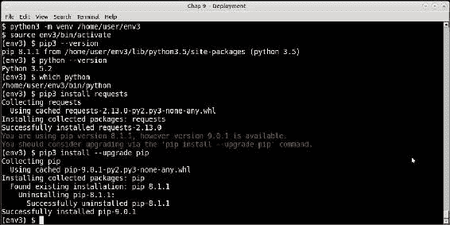
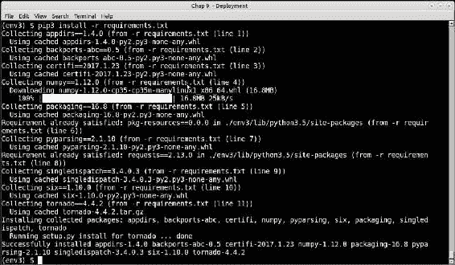
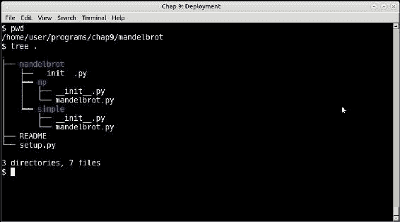
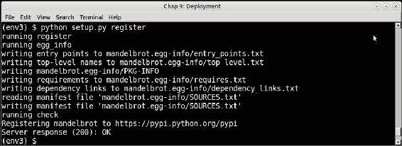
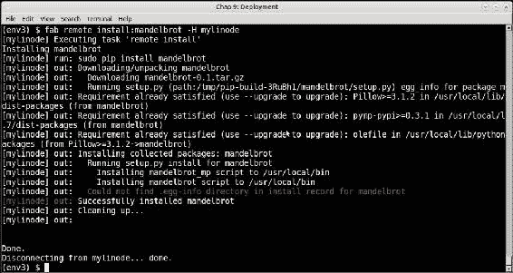

# 九、部署 Python 应用

将代码推向生产通常是将应用从开发阶段交付给客户的最后一步。尽管这是一项重要的活动，但在软件架构师的清单中，它经常被忽略。

假设一个系统在开发环境中工作，那么它在生产环境中也会尽职尽责地工作，这是一个非常常见和致命的错误。首先，生产系统的配置通常与开发环境的配置非常不同。许多在开发人员眼中是理所当然的优化和调试在生产设置中通常不可用。

生产部署是一门艺术，而不是一门精确的科学。系统部署的复杂性取决于多个因素，如系统开发语言、运行时可移植性和性能、配置参数的数量、系统是部署在同质环境还是异构环境中、二进制依赖关系、部署的地理分布、，部署自动化工具，以及许多其他因素。

近年来，Python 作为一种开放源代码语言，在自动化和支持将包部署到生产系统方面已经成熟。凭借其内置和第三方支持工具的丰富可用性，生产部署和维护部署系统最新的痛苦和麻烦已经减少。

在本章中，我们将简要讨论可部署系统和可部署性的概念。我们将花一些时间来了解 Python 应用的部署，以及架构师可以添加到其指令库中的工具和流程，以简化使用 Python 编写的生产系统运行应用的部署和维护。我们还将研究架构师可以采用的技术和最佳实践，以保持其生产系统健康、安全地运行，而不会频繁停机。

以下是我们将在本章中讨论的主题列表。

*   可部署性
    *   影响可部署性的因素
    *   软件部署架构的层次
*   Python 中的软件部署
    *   Packaging Python Code

        皮普

        虚拟的

        Virtualenv 与 Pip

        PyPI–Python 包索引

        申请的包装和提交

        皮帕

    *   使用结构的远程部署
    *   使用 Ansible 的远程部署
    *   使用 Supervisor 管理远程守护程序
*   部署—模式和最佳实践

# 可展开性

软件系统的可部署性是指它从开发到生产的容易程度。它可以用工作量（工时或复杂性）来衡量，也可以用将代码从开发环境部署到生产环境所需的不同步骤的数量来衡量。

假设在开发或登台系统中运行良好的代码在生产系统中的行为类似，这是一个常见的错误。这种情况并不常见，因为生产系统的需求与开发系统的需求大不相同。

## 影响可展开性的因素

以下简要介绍生产系统与开发系统的一些区别因素，这些因素通常会导致部署中出现意外问题，从而导致*生产问题*：

*   **Optimizations and debugging**: It is very common for development systems to turn off optimizations in code.

    如果您的代码在 Python 这样的解释运行时中运行，那么打开调试配置是很常见的，这允许程序员在发生异常时生成大量的回溯。此外，任何 Python 解释器优化通常都是关闭的。

    另一方面，在生产系统中，情况正好相反——因为优化被打开，调试被关闭。这通常需要启用额外的配置，以便代码以类似的方式工作。在某些情况下，与未优化运行时相比，程序在优化时给出不同的行为也是可能的（尽管很少）。

*   **Dependencies and versions**: A development environment, usually, has a rich installation of development and support libraries for running multiple applications that a developer may be working on. Quite often, these may be dependencies which are themselves not stale, since developers often work on bleeding edge code.

    另一方面，生产系统需要使用预编译的依赖项列表及其版本仔细准备。在生产系统上部署时，通常只指定成熟或稳定的版本。因此，如果开发人员依赖于下游依赖项的不稳定（alpha、beta 或候选发行版）版本上可用的功能或 bug 修复，人们可能会发现该功能在生产中无法按预期工作，这为时已晚。

    另一个常见问题是未记录的依赖项或需要从源代码编译的依赖项。这通常是首次部署的问题。

*   **资源配置和访问权限**：开发系统和生产系统通常在本地和网络中访问资源的级别、权限和细节上有所不同。开发系统可能有一个本地数据库，而生产系统倾向于为应用和数据库系统使用单独的主机。开发系统可能使用标准配置文件，而在生产中，可能必须使用特定脚本专门为主机或环境生成配置。类似地，在生产环境中，应用可能需要以较低的权限作为特定用户/组运行，而在开发环境中，以 root 用户或超级用户的身份运行程序可能很常见。用户权限和配置的这种差异可能会影响资源访问，并可能导致软件在开发环境中正常运行时在生产中失败。
*   **Heterogeneous production environments**: Code is usually developed in development environments, which are usually homogeneous. But it may often be required to be deployed on heterogeneous systems in production. For example, software may be developed on Linux, but there may be a requirement for a customer deployment on Windows.

    部署的复杂性随着环境中的异构性成比例地增加。在这些代码投入生产之前，需要管理良好的登台和测试环境。此外，异构系统使依赖关系管理更加复杂，因为需要为每个目标系统架构维护独立的依赖关系列表。

*   **Security**: In development and testing environments, it is somewhat common to give a wide berth to security aspects to save time and to reduce the configuration complexity for testing. For example, in a web application, routes which need logins may be disabled by using special development environment flags to facilitate quick programming and testing.

    类似地，开发环境中使用的系统可能经常使用容易猜测的密码，例如数据库系统、web 应用登录等，以使日常调用和使用变得容易。此外，可以忽略基于角色的授权以方便测试。

    然而，安全性在生产中至关重要，因此这些方面需要相反的处理。需要登录的路线应按此执行。应使用强密码。需要强制实施基于角色的身份验证。当在开发环境中工作的特性在生产中失败时，这些通常会在生产中导致微妙的错误。

由于这些和其他类似的问题是在生产环境中部署代码的祸根，因此已经定义了标准实践，以使 devops 从业者的生活更加轻松。大多数公司在将代码和应用推向生产之前，都遵循使用隔离环境来开发、测试和验证代码和应用的做法。让我们看看这个。

# 软件部署架构的层次

为了避免代码从开发到测试再到生产的复杂性，在部署到生产之前，通常在应用生命周期的每个阶段使用多层架构。

让我们来看一下下面的常见部署层：

*   **开发/测试/阶段/生产**：这是传统的四层架构。
    *   开发人员将他们的代码推送到开发环境中，在那里运行单元测试和开发人员测试。此环境将始终位于最新主干或最前沿的代码上。很多时候，该环境会被跳过并替换为开发人员笔记本电脑上的本地设置。
    *   然后，QA 或测试工程师使用黑盒技术在测试环境中对软件进行测试。他们还可以在此环境中运行性能测试。就代码更新而言，此环境始终落后于开发环境。通常，内部版本、标记或**代码转储**用于将 QA 环境与开发环境同步。
    *   暂存环境尝试尽可能地镜像生产环境。这是*预生产*阶段，在尽可能靠近部署环境的环境中测试软件，以提前发现生产中可能出现的问题。这是通常运行压力或负载测试的环境。它还允许 devops 工程师测试部署自动化脚本、cron 作业和验证系统配置。
    *   当然，生产是推送和部署从登台测试的软件的最后一层。许多部署通常使用相同的暂存/生产层，并简单地从一个层切换到另一个层。
*   **开发和测试/阶段/生产**：这是前一层的变体，其中开发环境也执行测试环境的双重职责。该系统用于具有敏捷软件开发实践的公司，在这些公司中，代码每周至少被推送到生产中一次，并且没有空间或时间来保存和管理单独的测试环境。当没有单独的开发环境时——即开发人员使用笔记本电脑进行编程时——测试环境也是本地环境。
*   **开发和测试/阶段和生产**：在此设置中，阶段和生产环境完全相同，使用了多台服务器。一旦系统在暂存中进行了测试和验证，只需将当前生产系统切换到暂存的主机和暂存切换到生产，即可将系统*推送到*生产。

除此之外，还可能有更复杂的架构，其中使用单独的**集成**环境进行集成测试，使用**沙箱**环境测试实验特性，等等。

在将代码推送到生产环境之前，使用登台系统对于确保软件在类似于生产环境的环境中经过良好的测试和编排非常重要。

# Python 中的软件部署

正如前面提到的一样，Python 开发人员在 Python 提供的各种工具以及第三方生态系统中得到了极大的赞誉，这些工具可以简化和自动化使用 Python 编写的应用和代码的部署。

在本节中，我们将简要介绍其中的一些工具。

## 打包 Python 代码

Python 内置了对打包应用的支持，可用于各种发行版源代码、二进制代码和特定操作系统级别的打包。

用 Python 打包源代码的主要方式是编写`setup.py`文件。然后，可以借助内置的`distutils`库或更复杂、更丰富的`setuptools`框架对源代码进行打包。

在介绍 Python 打包的精髓之前，让我们先熟悉两个密切相关的工具，即`pip`和`virtualenv`。

## 皮普

Pip 代表递归首字母缩写**Pip 安装软件包**。Pip 是在 Python 中安装软件包的标准和推荐工具。

在这本书中，我们看到了 pip 的动作，但到目前为止，我们还没有看到 pip 本身被安装，是吗？

让我们在下面的屏幕截图中看到这一点：


下载和安装 Python3 的 pip

pip 安装脚本可在[上找到 https://bootstrap.pypa.io/get-pip.py](https://bootstrap.pypa.io/get-pip.py) 。

步骤应该是不言自明的。

### 注

在前面的示例中，已经有一个 pip 版本，因此操作升级了现有版本，而不是重新安装。我们可以通过使用`–version`选项尝试程序来查看版本详细信息，如下所示：

请看以下屏幕截图：


打印当前版本的 pip（pip3）

查看 pip 如何清楚地打印其版本号以及安装的目录位置，以及安装它的 Python 版本。

### 注

要区分 Python2 和 Python3 版本的 pip，请记住为 Python3 安装的版本始终命名为`pip3`。Python2 版本是`pip2`，或者只是`pip`。

要使用 pip 安装软件包，只需通过命令`install`提供软件包名称。例如，下面的屏幕截图显示使用`pip`安装`numpy`包：


这里我们将不深入讨论使用 pip 的更多细节。相反，让我们来看看另一个与 PIP 紧密结合的工具，安装 Python 软件。

## 虚拟人

Virtualenv 是一种工具，允许开发人员为本地开发创建沙盒 Python 环境。假设您希望为正在并行开发的两个不同应用维护特定库或框架的两个不同版本。

如果您打算将所有内容安装到系统 Python 中，那么您在给定时间只能保留一个版本。另一个选项是在不同的根文件夹中创建不同的系统 Python 安装，比如说，`/opt`而不是`/usr`。但是，这会造成额外的开销和路径管理问题。此外，如果希望在没有超级用户权限的共享主机上维护版本依赖关系，则无法获得对这些文件夹的写入权限。

Virtualenv 一次性解决了权限和版本问题。它使用自己的 Python 可执行标准库和安装程序（默认为 pip）创建本地安装目录。

一旦开发人员激活了由此创建的虚拟环境，任何进一步的安装都将转到该环境，而不是系统 Python 环境。

可以使用 pip 安装 Virtualenv。

下面的屏幕截图显示了使用`virtualenv`命令创建名为`appvenv`的 virtualenv，并在环境中安装软件包的同时激活环境。

### 注

安装还将安装 pip、setuptools 和其他依赖项。


### 注

查看`python`和`pip`命令如何指向虚拟环境中的命令。`pip –version`命令清楚地显示了虚拟环境文件夹中`pip`的路径。

从 Python 3.3 开始，对虚拟环境的支持通过新的`venv`库内置到 Python 安装中。

下面的屏幕截图显示了使用此库在 Python3.5 中安装虚拟环境，以及在其中安装一些软件包。像往常一样，看看 Python 和 pip 可执行文件路径：



### 注

前面的屏幕截图还显示了如何通过`pip`命令升级 pip 本身。

## Virtualenv 和 pip

一旦为应用设置了虚拟环境并安装了所需的软件包，最好生成依赖项及其版本。这可以通过使用 pip 的以下命令轻松完成：

```py
$ pip freeze

```

此命令要求 pip 输出所有已安装 Python 包及其版本的列表。可以将其保存到需求文件中，并在服务器上复制设置以进行镜像部署：


下面的屏幕截图显示了通过 pip install 命令的`-r`选项在另一个虚拟环境中重新创建相同的设置，该命令接受这样一个文件作为输入：



### 注

我们的源虚拟环境在 Python2 中，目标虚拟环境在 Python3 中。然而，pip 能够从`requirements.txt`文件中安装依赖项，没有任何问题。

## 可重定位虚拟环境

建议的将包依赖项从一个虚拟环境复制到另一个虚拟环境的方法是执行冻结，并通过 pip 进行安装，如前一节所示。例如，这是从开发环境中冻结 Python 包需求并在生产服务器上成功重新创建它的最常用方法。

还可以尝试重新定位虚拟环境，以便将其归档并移动到兼容系统。


创建可重新定位的虚拟环境

以下是它的工作原理：

1.  首先，像往常一样创建虚拟环境。
2.  然后通过在其上运行`virtualenv –relocatable lenv`使其可重新定位。
3.  这将更改 setuptools 用作相对路径的某些路径，并将系统设置为可重新定位。
4.  这样的虚拟环境可以重新定位到同一台机器中的另一个文件夹，或者定位到*远程和类似机器*中的文件夹。

### 注

如果远程环境与机器环境不同，可重新定位的虚拟环境不能保证它能够工作。例如，如果您的远程计算机是不同的架构，或者甚至使用不同的 Linux 发行版和其他类型的打包，那么重新定位将无法工作。这就是单词*类似机器*的意思。

## PyPI

我们了解到，Pip 是用 Python 进行包安装的标准化工具。只要包存在，它就可以按名称提取任何包。它还可以按版本安装软件包，正如我们在需求文件示例中看到的那样。

但是 Pip 从哪里获取其包呢？

为了回答这个问题，我们转向 Python 包索引，更常见的称为 PyPI。

**Python 包索引（PyPI）**是在 Web 上托管第三方 Python 包元数据的官方存储库。顾名思义，它是 Web 上 Python 包的索引，其元数据在服务器上发布和索引。PyPI 托管在 URL[上 http://pypi.python.org](http://pypi.python.org) 。

PyPI 目前拥有近一百万个包。使用 Python 的打包和分发工具、distutils 和 setuptools 将包提交给 PyPI，这些工具具有将包元数据发布到 PyPI 的挂钩。许多包也在 PyPI 中承载实际的包数据，尽管 PyPI 可用于指向位于另一台服务器上的 URL 中的包数据。

当您使用 pip 安装包时，它实际上会在 PyPI 上搜索包，并下载元数据。它使用元数据查找包的下载 URL 和其他信息，如进一步的下游依赖项，它使用这些信息为您获取和安装包。

以下是 PyPI 的屏幕截图，显示了撰写本文时的实际包数：


开发人员可以直接在 PyPI 站点上做很多事情：

1.  使用电子邮件地址注册并登录网站。
2.  登录后，直接在站点上提交包。
3.  通过关键字搜索包。
4.  通过许多顶级的*trove*分类器浏览软件包，如主题、平台/操作系统、开发状态、许可证等。

现在，我们已经熟悉了所有 Python 打包和安装工具套件及其关系，让我们尝试一个打包一个简单 Python 模块并将其提交给 PyPI 的小示例。

## 申请的包装和提交

请记住我们在[第 5 章](05.html#aid-164MG1 "Chapter 5. Writing Applications That Scale")中开发了一个 mandelbrot 程序，它使用 pymp 进行缩放，*编写了缩放*的应用。我们将使用它作为开发包的程序示例，并使用 setup.py 文件将应用提交给 PyPI。

我们将 mandelbrot 应用打包在主包中，主包由以下两个子包组成：

*   `mandelbrot.simple`：由 mandelbrot 的基本实现组成的子包（子模块）
*   `mandelbrot`.mp：具有 mandelbrot 的 PyMP 实现的子包（子模块）

以下是该软件包的文件夹结构：



mandelbrot 包的文件夹布局

让我们快速分析要打包的应用的文件夹结构：

*   顶部目录名为`mandelbrot`。它有一个`__init__.py`、一个`README`和一个`setup.py`文件。
*   此目录有两个子目录-`mp`和`simple`。
*   每个子文件夹由两个文件组成，即`__init__.py`和`mandelbrot.py`。这些子文件夹将构成我们的子模块，每个子模块分别包含 mandelbrot 集合的实现。

### 注

为了将 mandelbrot 模块作为可执行脚本安装，代码已更改为向每个`mandelbrot.py`模块添加`main`方法。

### 初始化文件

`__init__.py`文件允许将 Python 应用中的文件夹转换为包。我们的文件夹结构有三个：第一个用于顶级包`mandelbrot`，其余两个用于每个子包，即`mandelbrot.simple`和`mandelbrot.mp`。

顶层`__init__.py`为空。另外两个具有以下单线：

```py
from . import mandelbrot
```

### 注

相对导入是为了确保子包导入本地`mandelbrot.py`模块，而不是顶级`mandelbrot`包。

### setup.py 文件

`setup.py`文件是整个包的中心点。让我们看一看:

```py
from setuptools import setup, find_packages
setup(
    name = "mandelbrot",
    version = "0.1",
    author = "Anand B Pillai",
    author_email = "abpillai@gmail.com",
    description = ("A program for generating Mandelbrot fractal images"),
    license = "BSD",
    keywords = "fractal mandelbrot example chaos",
    url = "http://packages.python.org/mandelbrot",
    packages = find_packages(),
    long_description=open('README').read(),
    classifiers=[
        "Development Status :: 4 - Beta",
        "Topic :: Scientific/Engineering :: Visualization",
        "License :: OSI Approved :: BSD License",
    ],
    install_requires = [
        'Pillow>=3.1.2',
        'pymp-pypi>=0.3.1'
        ],
    entry_points = {
        'console_scripts': [
            'mandelbrot = mandelbrot.simple.mandelbrot:main',
            'mandelbrot_mp = mandelbrot.mp.mandelbrot:main'
            ]
        }
)
```

对`setup.py`文件的全面讨论超出了本章的范围，但请注意以下几点：

*   `setup.py`文件允许作者创建大量包元数据，如名称、作者姓名、电子邮件、包关键字等。这些在创建包元信息时很有用，这有助于人们在提交包后在 PyPI 中搜索包。
*   该文件中的一个主要字段是 packages，它是由该`setup.py`文件创建的包（和子包）列表。我们利用 setuptools 模块提供的`find_packages`辅助函数来实现这一点。
*   我们在`install-requires`键中提供分期付款需求，它以类似 PIP 的格式逐个列出依赖项。
*   The `entry_points` key is used to configure the console scripts (executable programs) that this package installs. Let us look at one of them:

    ```py
    mandelbrot = mandelbrot.simple.mandelbrot:main
    ```

    这告诉包资源加载器加载名为`mandelbrot.simple.mandelbrot`的模块，并在调用脚本`mandelbrot`时执行其功能`main`。

### 安装包装

现在可以使用以下命令安装软件包：

```py
$ python setup.py install

```

以下安装屏幕截图显示了几个初始步骤：


### 注

我们已将此软件包安装到名为`env3`的虚拟环境中。

### 将包提交给 PyPI

Python 中的`setup.py`文件和 setuptools/distutils 生态系统不仅对安装和打包代码非常有用，而且还可以将代码提交到 Python 包索引。

将包注册到 PyPI 非常容易。只有以下两个要求：

*   包含正确 setup.py 文件的包。
*   PyPI 网站上的帐户。

现在，我们将通过执行以下步骤向 PyPI 提交新的 mandelbrot 包：

1.  First, one needs to create a `.pypirc` file in one's home directory containing some details—mainly the authentication details for the PyPI account.

    这是作者的`.pypirc`文件，密码不清楚：

    

2.  Once this is done, registration is as simple as running `setup.py` with the `register` command:

    ```py
    $ python setup.py register

    ```

    下一个屏幕截图显示了控制台上实际执行的命令：

    

    但是，最后一步仅通过提交其元数据来注册包。作为此步骤的一部分，未提交任何程序包数据（如源代码数据中的数据）。

3.  To submit the source code also to PyPI, the following command should be run:

    ```py
    $ python setup.py sdist upload

    ```

    

    以下是 PyPI 服务器上新软件包的视图：

    

    现在包可以通过 pip 安装，完成了软件开发的循环：即首先打包、部署，然后安装。

## PyPA

**Python 打包管理局**（**PyPA**是一个 Python 开发人员工作组，他们维护标准，并且与 Python 打包相关的应用。yPA 有他们的网站[https://www.pypa.io/](https://www.pypa.io/) ，并且他们在 GitHub 上维护应用 [https://github.com/pypa/](https://github.com/pypa/) 。

下表列出了由 PyPA 维护的项目。您已经看到了其中的一些工具，例如 pip、virtualenv 和 setuptools；其他可能是新的：

<colgroup class="calibre18"><col class="calibre19"> <col class="calibre19"></colgroup> 
| 

项目

 | 

描述

 |
| --- | --- |
| 设置工具 | Python distutils 的一系列增强功能 |
| 虚拟的 | 用于创建沙盒 Python 环境的工具 |
| 皮普 | 用于安装 Python 包的工具 |
| 包装材料 | pip 和 setuptools 使用的用于打包的核心 Python 实用程序 |
| 轮 | setuptools 的一个扩展，用于创建控制盘发行版，它是 Python 鸡蛋（ZIP 文件）的替代品，并在 PEP 427 中指定 |
| 绳线 | `setup.py`上传的安全替代品 |
| 仓库 | 新的 PyPI 应用，可在[中看到 https://pypi.org](https://pypi.org) |
| 自激 | 实现与 Python 代码的打包和分发相关的函数的低级库 |
| 班德斯纳奇 | 用于镜像 PyPI 内容的 PyPI 镜像客户端 |

感兴趣的开发人员可以访问 PyPA 站点并注册其中一个项目，并通过访问 PyPA 的 github 存储库，在测试、提交补丁等方面为他们做出贡献。

## 使用结构的远程部署

Fabric 是一个用 Python 编写的命令行工具和库，它通过一组定义良好的 SSH 协议包装器，帮助服务器上的远程部署实现自动化。它在幕后使用`ssh-wrapper`库`paramiko`。

Fabric 仅适用于 Python2.x 版本。但是，有一个 fork Fabric3 可以同时适用于 Python2.x 和 3.x 版本。

当使用 fabric 时，devops 用户通常将其远程系统管理员命令部署为名为`fabfile.py`的`fabfile`中的 Python 函数。

当远程系统已经配置了用户执行部署的机器的 ssh 公钥时，Fabric 工作得最好，因此不需要提供用户名和密码。

下面是服务器上远程部署的示例。在本例中，我们将在远程服务器上安装 mandelbrot 应用。

该文件如下所示。请确保它是为 Python3 编写的：

```py
from fabric.api import run

def remote_install(application):

    print ('Installing',application)
    run('sudo pip install ' + application)
```

下面是一个运行 this 的示例，将其安装在远程服务器上：



Devops 工程师和系统管理员可以使用一组预定义的文件来跨多个服务器自动化不同的系统和应用部署任务。

### 注

尽管 Fabric 是用 Python 编写的，但它可以用于自动部署任何类型的远程服务器管理和配置任务。

## 使用 Ansible 进行远程部署

Ansible 是一个用 Python 编写的配置管理和部署工具。Ansible 可以被认为是 SSH 上的包装器，脚本通过任务支持编排，这些任务可以组装在称为*剧本*的易于管理的单元中，这些单元将一组主机映射到一组角色。

Ansible 使用“事实”，即在运行任务之前收集的系统和环境信息。它使用事实来检查在运行任务以获得所需结果之前是否需要更改任何状态。

这使得 Ansible 任务在服务器上以重复方式运行是安全的。写得好的 ansible 任务是*幂等的*，因为它们对远程系统的副作用为零到很少。

Ansible 是用 Python 编写的，可以使用 pip 安装。

它使用自己的 hosts 文件即`/etc/ansible/hosts`来保存运行任务所依据的主机信息。

典型的 ansible 主机文件可能如下所示：，

```py
[local]
127.0.0.1

[webkaffe]
139.162.58.8
```

以下是一个名为`dependencies.yaml`的 Ansible playbook 的片段，它通过 pip 在名为*webkaffe 的远程主机上安装了一些 Python 包。*

```py
---
- hosts: webkaffe
  tasks:
    - name: Pip - Install Python Dependencies
      pip:
          name="{{ python_packages_to_install | join(' ') }}"

      vars:
          python_packages_to_install:
          - Flask
          - Bottle
          - bokeh
```

下面是使用 ansible playbook 在命令行上运行此 playbook 的图像。


Ansible 是管理远程依赖关系的一种简单而有效的方法，并且由于其幂等剧本，在任务方面比 Fabric 要好得多。

## 使用 Supervisor 管理远程守护程序

Supervisor 是一个客户机/服务器系统，用于控制 Unix 和类 Unix 系统上的进程。它主要由一个名为**supervisord**的服务器守护进程和一个与名为**supervisorctl**的服务器交互的命令行客户端组成。

Supervisor 还附带了一个基本的 Web 服务器，可以通过端口 9001 访问。可以查看正在运行的进程的状态，也可以通过此接口启动/停止它们。Supervisor 不在任何版本的 Windows 上运行。

Supervisor 是使用 Python 编写的应用，因此可以通过 pip 安装。它只在 Python2.x 版本上运行。

要通过 supervisor 管理的应用应通过 supervisor 守护程序配置文件进行配置。默认情况下，这些文件位于`/etc/supervisor.d/conf`文件夹中。

但是，通过将 Supervisor 安装到虚拟环境中，并将配置保持在虚拟环境的本地，可以在本地运行 Supervisor。事实上，这是运行多个监控器守护进程的常见方法，每个守护进程管理特定于虚拟环境的进程。

我们将不深入讨论使用 Supervisor 的细节或示例，但与传统方法（如系统`rc.d`脚本）相比，使用 Supervisor 有一些好处：

*   通过使用客户机/服务器系统来解耦流程创建/管理和流程控制。`supervisor.d`文件通过子流程管理流程。用户可以通过客户机 supervisorctl 获取进程状态信息。另外，尽管大多数传统的 rc.d 进程需要 root 或 sudo 访问，但是系统的普通用户可以通过客户端或 Web UI 来控制监控进程。
*   由于 supervisord 通过子进程启动进程，因此可以将其配置为在崩溃时自动重新启动。与依赖 PID 文件相比，更容易获得子流程的更准确状态。
*   主管支持流程组，允许用户按优先级顺序定义流程。进程可以作为一个组按特定顺序启动和停止。这允许在应用中创建流程之间存在时间依赖关系时实现细粒度流程控制。（进程 B 要求 A 运行，C 要求 B 运行，诸如此类。）

我们将通过对常见部署模式的概述来完成本章中的讨论，架构师可以选择这些模式来解决具有可部署性的常见问题。

# 部署-模式和最佳实践

有不同的部署方法或模式可用于解决停机时间等问题，降低部署风险，并实现软件的无缝开发和部署。

*   **持续部署**：持续部署是软件随时可以上线的部署模式。只有在不断集成各个层次（包括开发、测试和阶段）的情况下，才能实现连续交付。在连续部署模型中，可以通过部署管道在一天内自动进行多个生产部署。由于不断部署增量更改，连续部署模式将部署风险降至最低。在敏捷软件开发公司中，它还可以帮助客户在离开开发和测试时立即看到生产中的实时代码，从而直接跟踪进度。另外还有一个额外的优势，即更快地获得用户反馈，从而更快地迭代代码和功能。
*   **蓝绿部署**：我们已经在[第 5 章](05.html#aid-164MG1 "Chapter 5. Writing Applications That Scale")中讨论过了。蓝绿色部署保持两个生产环境彼此完全相同。在给定实例中，一个环境是活动的（蓝色）。您准备对其他环境进行新的部署更改（绿色），一旦测试并准备好投入使用，切换系统绿色变为活动状态，蓝色变为备份状态。BlueGreen 部署大大降低了部署风险，因为对于新部署中出现的任何问题，您只需要将路由器或负载平衡器切换到新环境。通常，在典型的 BlueGreen 系统中，一个系统是生产（实时）系统，另一个是暂存系统，您可以在它们之间切换角色。
*   **金丝雀发布**：如果您想在为所有客户部署软件之前，在一部分用户上测试软件的更改，您可以使用这种方法。在金丝雀版本中，这些更改首先被发布到一小部分用户。一种简单的方法是 dogfooding，即首先在内部向员工推出更改。另一种方法是 beta 测试，邀请一组精选的观众测试您的早期功能。其他涉及的方法包括根据用户的地理位置、人口统计和个人资料选择用户。金丝雀版本，除了使公司免受用户对管理不善的功能的突然反应之外，还允许以增量方式管理负载和容量扩展。例如，如果某个特定功能变得流行，并开始驱动（例如）100 倍的用户访问您的服务器，则传统部署可能会导致服务器故障和可用性问题，而不是使用金丝雀版本的渐进部署。如果您不想进行复杂的用户配置和分析，则可以使用地理路由选择用户子集。与其他节点相比，负载更多地发送到部署在特定地理位置或数据中心的节点。金丝雀发布还与增量推出或分阶段推出的概念相关。
*   **Bucket testing（A/B testing）**：这是将一个应用或网页的两个不同版本部署到生产环境中，以测试哪个版本更受欢迎和/或参与度更高的技术。在制作中，一部分观众看到应用（或页面）的 a 版本-控件或基本版本，另一部分观众看到 B 版本或修改（变体）版本。通常情况下，这是一个 50 对 50 的划分，尽管与金丝雀版本一样，可以使用用户配置文件、地理位置或其他复杂模型。使用分析仪表板收集用户体验和参与度，然后确定更改是否有积极、消极或中立的响应。
*   **诱导混乱**：这是一种故意引入错误或禁用生产部署系统部分的技术，以测试其故障恢复能力和/或可用性水平。

生产服务器存在漂移问题，除非您对同步使用连续部署或类似方法，否则生产服务器通常会偏离标准配置。测试系统的一种方法是故意禁用生产系统的一部分，例如，禁用负载平衡器配置中随机 50%的节点，然后查看系统其余部分的性能。

查找和剔除代码中未使用部分的类似方法是，使用（比如）您怀疑是冗余的且不再需要的 API，在配置的部分中注入随机秘密。然后观察应用在生产中的执行情况。由于随机密码将使 API 失败，因此如果应用的某个活动部分仍然使用依赖代码，则它将在生产中失败。否则，这表示代码可以安全删除。

Netflix 有一个名为**混沌猴子**的工具，自动注入生产系统中的故障，然后测量影响。

诱导的混乱使 devops 工程师和架构师能够理解系统中的弱点，了解正在经历配置漂移的系统，并发现和清除应用中不必要或未使用的部分。

# 总结

本章是关于将 Python 代码部署到生产环境的。我们研究了影响系统可部署性的不同因素。我们接着讨论了部署架构中的层，例如传统的四层、三层和两层架构，包括开发、测试、阶段/QA 和生产层的组合。

然后我们继续讨论打包 Python 代码的细节。我们详细讨论了 pip 和 virtualenv 的工具。我们研究了 pip 和 virtualenv 如何协同工作，以及如何使用 pip 安装一组需求，并使用它设置类似的虚拟环境。我们还简要介绍了可重新定位的虚拟环境。

然后，我们讨论了 PyPI，即在 web 上承载 Python 第三方包的 Python 包索引。然后，我们介绍了一个使用 setuptools 和`setup.py`文件设置 Python 包的详细示例。在本例中，我们使用 mandelbrot 应用作为示例。

我们通过展示如何使用其元数据将包注册到 PyPI，以及如何上载包数据（包括其代码）来结束讨论。我们还简要介绍了 PyPA、Python 打包管理局及其项目。

在此之后，讨论了两个都是用 Python 开发的工具——用于远程自动化部署的 Fabric 和用于在 Unix 系统上远程管理进程的 Supervisor。在本章结束时，我们概述了可以用来解决部署问题的常见部署模式。

在本书的最后一章中，我们将讨论调试代码以找出潜在问题的各种技术。