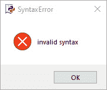
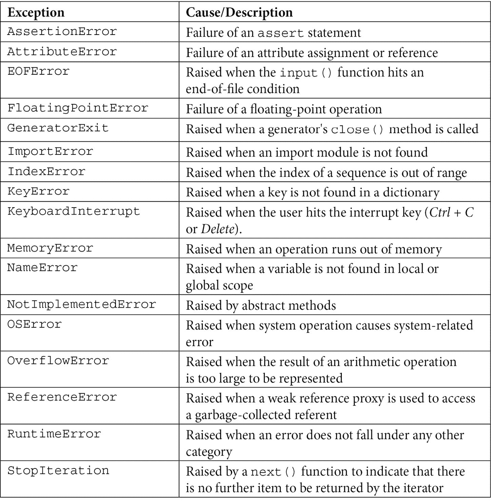

# *第 7 章*：识别解决方案中的挑战

在本章中，我们将评估算法和图表，以了解如何通过一些常见错误进行导航，并确定是否可以对现有算法进行可能的调整以简化它。我们将根据问题描述评估解决方案，以验证解决方案是否与问题一致。我们将学习如何识别解决方案设计过程中的陷阱。值得注意的是，我们将在本书后面的*第 2 节*、*应用 Python 和计算思维*和*第 3 节*、*使用计算思维和 Python 进行数据处理、分析和应用*，随着我们对**Python**编程语言的深入了解，我们将阅读本书。

为了了解调试，让我们提醒自己，计算思维过程不是线性的。即使我们从原始问题开始工作，我们有时也会重新定义问题，或者需要调整泛化，因为我们的算法所针对的群体发生了变化，或者如果我们想调整算法的设计。但有时，我们在设计和使用算法后会遇到问题。根据我们的角色，我们将评估算法的错误、需要的更改等。了解如何发现和分析错误可以帮助我们，无论我们是 Python 的绝对初学者还是深入职业生涯。

在本章中，您将学习如何识别和修复程序中的错误，以及如何避免算法设计中的陷阱。

在本章中，我们将介绍以下主题：

*   算法设计中的错误识别
*   调试算法
*   比较解决方案
*   精炼和重新定义解决方案

# 技术要求

您将需要最新版本的 Python 来运行本章中的代码。您可以在此处找到本章中使用的完整源代码：[https://github.com/PacktPublishing/Applied-Computational-Thinking-with-Python/tree/master/Chapter07](https://github.com/PacktPublishing/Applied-Computational-Thinking-with-Python/tree/master/Chapter07)

# 识别算法设计中的错误

算法中的错误对于任何编码器来说都是一个事实。对犯错误感到舒服是很重要的。正如[*第 5 章*](05.html#_idTextAnchor082)、*探索性问题分析*和[*第 6 章*](06.html#_idTextAnchor091)、*解决方案流程和设计*中提到的，经常测试算法是一种很好的做法。等到你完成了成百上千行的代码之后再去测试某些东西是一个灾难。是的，我曾经在复制一个游戏，根本没有测试。直到我把所有 4585 行都拷贝了。我很年轻。说实话，我从来没有发现我犯的错误。我重新开始，开始在每个角落测试。第二次是成功的，但我浪费了数周的时间复制所有东西（它来自一本 GitHub 还不是什么东西的书），然后试图找出错误。所以请不要做我。请测试你的算法。

现在，在着手调试和使用代码之前，让我们来看看解决问题时可能遇到的错误。

在本节中，我们将重点关注以下两大类错误：语法错误和逻辑错误。

## 语法错误

语法错误有时被称为解析错误。它们是当我们忘记缩进、添加冒号、为字符串添加引号等操作时产生的错误。让我们在下面几节中看看不同类型的语法错误。

### 使用冒号

冒号在 Python 中用于分隔条件、创建循环等。冒号是告诉算法下一件事是这个特定代码块的一部分的一种方式。当我们在 Python 中引入冒号时，它会自动缩进代码中的下一行。但是如果我们忘记在需要的地方包含冒号，程序将无法成功运行。让我们来看一个语法错误：

```py
for i in range(1, 10)
    print(i)
```

如果我们运行这段代码，我们会收到一条错误消息，上面写着*无效语法*。以下屏幕截图显示了我们尝试运行此程序时出现的弹出窗口：



图 7.1–错误弹出窗口

如果改为从 Python shell 运行此命令，则会出现以下错误：

```py
SyntaxError: invalid syntax
```

正如您所看到的，Python 程序在我们有包含错误的代码时会提醒我们。

请注意，代码中的范围后缺少冒号。现在，看看下面代码中的固定语法：

ch7_syntaxerror1.py

```py
for i in range(1, 10):
    print(i)
```

当我们运行固定代码时，程序运行并打印数字 1 到 9，如下所示：

```py
1
2
3
4
5
6
7
8
9
```

您可能还记得范围函数不包括上端点。如果我们想打印数字 10，我们的范围应该是`range(1, 11)`。

现在，让我们来看看 Python 中使用的其他标点符号，这些标点可能会导致一些错误，即括号、嵌套括号和括号。

### 使用嵌套的括号和方括号

除了涉及冒号的语法错误（这是我最常见的错误）之外，还有嵌套括号的错误。我们必须始终检查每个开括号是否都有一个右括号。括号也是如此。让我们看看下面的代码，其中包含一个带括号的错误：

```py
name = str(input('What is your name? ')
print(name)
```

如您所见，名称定义中有两个开括号，但只有一个右括号。当我们运行该程序时，我们从 Python 中得到一个无效的语法错误。下面是在 Python shell 或解释器中运行该程序时发生的情况：

```py
SyntaxError: invalid syntax
```

现在这里是没有错误的相同代码，注意我们甚至去掉了`str()`，因为它不需要，这导致简化了代码，同时消除了错误

ch7_syntaxerror2.py

```py
name = input('What is your name? ')
print(name)
```

现在，当我们运行代码时，程序要求输入名称，然后打印它。输出如下所示：

```py
What is your name? Monique
Monique
```

如您所见，程序现在运行没有问题。

在[*第 3 章*](03.html#_idTextAnchor056)*理解算法和算法思维*中，我们使用字典创建了一个包含每个菜单项定价的菜单。词典包含括号，表示词典开始和结束的时间。让我们看几行代码：

```py
cars = {
    "Hyundai": "Kona",
    "Honda": "CR-V",
    "Toyota": "Camry"

print(cars)
```

如果我们查看程序，字典缺少结束括号`}`，因此我们得到一个语法错误，与前面的示例相同。以下代码段显示了已更正的程序：

ch7_syntaxerror3.py

```py
cars = {
    "Hyundai": "Kona",
    "Honda": "CR-V",
    "Toyota": "Camry"
    }
print(cars)
```

如您所见，添加括号后，程序将运行并打印以下输出：

```py
{'Hyundai': 'Kona', 'Honda': 'CR-V', 'Toyota': 'Camry'}
```

词典中的每个条目都打印在一行中，用逗号分隔。在编写算法时添加`print`语句是有帮助的，以确保没有任何错误。我通常在测试过不必要的打印函数后会删除它们，但当我们编写长算法并需要测试它们以避免问题时，它们确实会派上用场。

在用 Python 编写算法时，我们还可以合并许多其他错误。让我们来看看更多的语法错误。

### 其他语法错误

在语法上还有许多其他的错误，特别是在较长的程序中。例如，如果您查看我们刚才使用的词典，忘记逗号也会产生语法错误。通常，当我们试图运行一个程序时，这些语法错误会很快被识别出来。Python 将突出显示预期缩进的位置或缺少括号的位置。语法错误通常很容易识别，但还有许多其他类型的错误。

## 逻辑错误

在[*第 4 章*](04.html#_idTextAnchor071)*理解逻辑推理*中，我们讨论了我们可能遇到的逻辑错误：

*   在等式或语句中使用错误的变量
*   使用错误的操作员测试条件
*   检查条件时使用错误的缩进

现在，我们将看一看逻辑中的其他错误，这些错误具有来自 Python 的特定调用，以及每个错误所代表的内容。

逻辑错误也称为运行时错误。下表显示了 Python 中的一些内置错误及其代表的内容：




表 7.1-例外情况和原因/说明表

如您所见，在 Python 中有许多不同类型的错误被标记为异常。通过运行以下代码，可以获得 Python 异常列表：

ch7_errors.py

```py
print(dir(locals()['__builtins__']))
```

当我们运行该代码时，输出提供如下错误值：

```py
['ArithmeticError', 'AssertionError', 'AttributeError', 'BaseException', 'BlockingIOError', 'BrokenPipeError', 'BufferError', 'BytesWarning', 'ChildProcessError', 'ConnectionAbortedError', 'ConnectionError', 'ConnectionRefusedError', 'ConnectionResetError', 'DeprecationWarning', 'EOFError', 'Ellipsis', 'EnvironmentError', 'Exception', 'False', 'FileExistsError', 'FileNotFoundError', 'FloatingPointError', 'FutureWarning', 'GeneratorExit', 'IOError', 'ImportError', 'ImportWarning', 'IndentationError', 'IndexError', 'InterruptedError', 'IsADirectoryError', 'KeyError', 'KeyboardInterrupt', 'LookupError', 'MemoryError', 'ModuleNotFoundError', 'NameError', 'None', 'NotADirectoryError', 'NotImplemented', 'NotImplementedError', 'OSError', 'OverflowError', 'PendingDeprecationWarning', 'PermissionError', 'ProcessLookupError', 'RecursionError', 'ReferenceError', 'ResourceWarning', 'RuntimeError', 'RuntimeWarning', 'StopAsyncIteration', 'StopIteration', 'SyntaxError', 'SyntaxWarning', 'SystemError', 'SystemExit', 'TabError', 'TimeoutError', 'True', 'TypeError', 'UnboundLocalError', 'UnicodeDecodeError', 'UnicodeEncodeError', 'UnicodeError', 'UnicodeTranslateError', 'UnicodeWarning', 'UserWarning', 'ValueError', 'Warning', 'ZeroDivisionError', '__build_class__', '__debug__', '__doc__', '__import__', '__loader__', '__name__', '__package__', '__spec__', 'abs', 'all', 'any', 'ascii', 'bin', 'bool', 'breakpoint', 'bytearray', 'bytes', 'callable', 'chr', 'classmethod', 'compile', 'complex', 'copyright', 'credits', 'delattr', 'dict', 'dir', 'divmod', 'enumerate', 'eval', 'exec', 'exit', 'filter', 'float', 'format', 'frozenset', 'getattr', 'globals', 'hasattr', 'hash', 'help', 'hex', 'id', 'input', 'int', 'isinstance', 'issubclass', 'iter', 'len', 'license', 'list', 'locals', 'map', 'max', 'memoryview', 'min', 'next', 'object', 'oct', 'open', 'ord', 'pow', 'print', 'property', 'quit', 'range', 'repr', 'reversed', 'round', 'set', 'setattr', 'slice', 'sorted', 'staticmethod', 'str', 'sum', 'super', 'tuple', 'type', 'vars', 'zip']
```

如前所述，这些是 Python 中的内置异常。有一种方法可以定义我们自己的异常，但我们不会在这本书中讨论它们。

请注意，这些不是我们编程时遇到的唯一错误。正如我们在[*第 4 章*](04.html#_idTextAnchor071)*理解逻辑推理*中所讨论的，我们可能会因为自己的计算错误而产生错误。我们可以在*布尔*逻辑中引入错误。我们的目标是尽可能多地避免，这样我们的程序运行时就不会出现问题。记住，要经常测试你的算法。

现在，让我们看一些有错误的算法，并尝试识别错误，以便我们能够纠正它们。

# 调试算法

我们可以使用内置的`breakpoint()`函数在 Python 中运行调试器。我们可以将此代码引入我们的程序，并在我们不确定代码的地方插入它。然后添加`breakpoint()`将检查 bug 和错误。当我们运行一个`breakpoint()`函数时，我们会得到一个`pdb`输出，它代表**Python 调试器**。值得注意的是，这个内置函数出现在**Python 3.7**和更新版本中。之前的**Python 3.6**和旧版本的调试器是`pdb.set_trace()`。

运行调试器时，可以使用四个命令：

*   `c`：继续执行
*   `q`：退出调试器/执行
*   `n`：进入函数中的下一行
*   `s`：此函数或调用的**函数**中的下一行的步骤

让我们看一看代码并运行每一个概述的命令：

ch7_debugger.py

```py
number = 5
number2 = 'five'
print(number)
breakpoint()
print(number2)
```

查看此代码，可以在`print(number)`之后看到`breakpoint()`命令。代码将正常运行，直到到达`breakpoint()`命令。在此阶段，执行将停止。如果我们点击*c*键，它将继续运行程序。看看输出是什么样子的。

请注意，代码中两个斜杠之间有三个点，`/…/`。这样做是因为从您的计算机到我的计算机的路径可能不同。您将包括程序所在的完整路径：

```py
5
> /Users/.../Python/ch7_debugger.py(8)<module>()
-> print(number2)
(Pdb) c
five
```

如您所见，它继续打印字符串`five`，因为它只是继续程序。现在让我们看看运行退出程序的`q`命令时的输出：

```py
5
> /Users/.../Python/ch7_debugger.py(8)<module>()
-> print(number2)
(Pdb) q
Traceback (most recent call last):
  File "/Users/.../Python/ch7_debugger.py", line 8, in <module>
    print(number2)
  File "/Users/.../Python/ch7_debugger.py", line 8, in <module>
    print(number2)
bdb.BdbQuit
```

如您所见，一旦我们使用`q`命令，我们就会得到一个**回溯错误**，因为程序退出。它在`breakpoint()`代码上方打印行，但不打印第二条`print(number2)`命令。现在，让我们看看当我们键入`n`时会发生什么，这将引导我们进入下一行：

```py
5
> /Users/.../Python/ch7_debugger.py(8)<module>()
-> print(number2)
(Pdb) n
five
--Return--
> /Users/.../Python/ch7_debugger.py(8)<module>()->None
-> print(number2)
(Pdb)
```

如您所见，当我们键入`n`时，程序继续运行并打印第二个命令行。当它这样做时，您可以看到`-> None`输出和运行的代码：`print(number2)`。最后，让我们看看稍微修改的代码，看看在运行调试器时使用`s`会发生什么：

ch7_debugger2.py

```py
number = 5
number2 = 'five'
print(number)
breakpoint()
print(str(number) + number2)
```

当我们运行这个程序和调试器时，如果我们使用`s`，我们会得到以下输出：

```py
5
> /Users/.../Python/ch7_debugger2.py(8)<module>()
-> print(number + " " + number2)
(Pdb) s
TypeError: unsupported operand type(s) for +: 'int' and 'str'
> /Users/.../Python/ch7_debugger2.py(8)<module>()
-> print(number + " " + number2)
(Pdb)
```

如您所见，程序遇到了`TypeError`并提供了更多信息。我尝试将整数和字符串组合起来。因此，我们需要修复该代码以正确运行它。在我这样做之前，让我们看看当我尝试继续使用`c`代码时会发生什么：

```py
5
> /Users/.../Python/ch7_debugger2.py(8)<module>()
-> print(number + " " + number2)
(Pdb) c
Traceback (most recent call last):
  File "/Users/.../Python/ch7_debugger2.py", line 8, in <module>
    print(number + " " + number2)
TypeError: unsupported operand type(s) for +: 'int' and 'str'
```

如你所见，我可以从两个命令中获得相同的信息，但程序的响应略有不同。为了解决这个问题，我必须将数字转换成字符串，我可以在`print`行中使用以下代码执行此操作：

ch7_debugger3.py

```py
number = 5
number2 = 'five'
print(number)
breakpoint()
print(str(number) + " " + number2)
```

现在我已经修复了代码，使得打印行中的项目都是字符串，当我使用`c`继续时，输出如下所示：

```py
5
> /Users/.../Python/ch7_debugger3.py(8)<module>()
-> print(str(number) + " " + number2)
(Pdb) c
5 five 
```

如您所见，程序现在打印了正确的信息，将数字作为字符串与`five`字符串组合。双引号在它们之间添加了一个空格，我们之前已经看到过，但当我们在[*第 8 章*](08.html#_idTextAnchor114)*Python 简介*中查看 Python 基础知识时，将再次讨论。

现在，让我们来看一看同一问题的一些解决方案，以便我们可以分析它们。

# 比较解决方案

在我们研究问题时，我已经提到，我们有多种方法在 Python 中完成相同的事情。根据我们试图完成的任务，在我们的算法中，某些命令可能比其他命令更好。让我们先来看看 one 问题的几种解决方案。

## 问题 1-打印偶数

您被要求编写一个算法，根据用户提供的范围打印偶数。也就是说，如果用户输入范围 2 到 20，那么程序将打印 2、4、6、8、10、12、14、16、18 和 20。假设我们想要包括端点，如果它们是偶数。

让我们来看看两个可能的解决方案中的第一个。记住，一个解决方案可能并不比另一个好。很大程度上取决于完整算法的目标是什么。*列表是否更合适？字典？函数？*当我们设计解决方案时，这些问题很重要。

### 算法解决方案 1-打印偶数

回想一下，我们将使用用户输入创建给定范围的偶数列表。请看以下代码，该代码要求用户输入，然后打印出数字：

ch7_ 均匀算法 1.py

```py
print("This program will print the even numbers for any range of numbers provided.")
endpoint1 = int(input("What is the lower endpoint of your range? "))
endpoint2 = int(input("What is the upper endpoint of your range? "))
endpoint2 = endpoint2 + 1
for i in range(endpoint1, endpoint2):
    if i % 2 == 0:
        print(i)

```

请注意，`endpoint2`已转换为`endpoint2 + 1`。这是因为如果我们不添加`1`，那么如果它是偶数，则不包括上端点。该程序还以一条打印的消息开始，向用户说明程序的功能。

当我用端点`2`和`6`运行这个程序时，我得到以下输出：

```py
This program will print the even numbers for any range of numbers provided.
What is the lower endpoint of your range? 2
What is the upper endpoint of your range? 6
2
4
6
```

正如您所看到的，两个端点都是偶数并且都包含在内。如果我们使用端点`3`和`9`运行程序，我们会得到以下输出：

```py
This program will print the even numbers for any range of numbers provided.
What is the lower endpoint of your range? 3
What is the upper endpoint of your range? 9
4
6
8
```

虽然现在端点在技术上是`10`，但不包括范围的上限，所以`10`以下的最大偶数是`8`。现在，我可以在更大的范围内运行这个程序，但是范围越大，滚动获取所有数字就越困难。所以，让我们来看一个不同的方法来获得偶数。

### 算法解决方案 2-打印偶数

正如我们在前面的示例中看到的，每个偶数都被打印到不同的行。让我们看看是否可以改变这一点，而是创建一个列表。Python 中的列表可以为空。我们为它们使用任何名称，然后将它们与大括号内的项目相等，或者仅将它们与空大括号相等。

例如，我可以创建一个名为`evenNumbers = []`的空列表。让我们看看下面的算法是什么样的：

ch7_ 算法 2.py

```py
print("This program will print the even numbers for any range of numbers provided.")
endpoint1 = int(input("What is the lower endpoint of your range? "))
endpoint2 = int(input("What is the upper endpoint of your range? "))
endpoint2 = endpoint2 + 1
evenNumbers = []
for i in range(endpoint1, endpoint2):
    if i % 2 == 0:
        evenNumbers.append(i)

print(evenNumbers)
```

您可以看到前几行代码是相同的。这个特殊代码的唯一区别是数字的打印方式。列表在`for`循环之前创建。然后，使用`evenNumbers.append(i)`代码将每个数字追加到列表中。最后，我们打印列表以获得以下输出：

```py
This program will print the even numbers for any range of numbers provided.
What is the lower endpoint of your range? 2
What is the upper endpoint of your range? 10
[2, 4, 6, 8, 10]
```

如您所见，偶数都包含在一个列表中，这比一次打印一个、一次打印一行更容易阅读。*想象一下，如果您必须打印 300–1000*范围内的偶数。当我们运行该程序时，一个列表将使其更易于阅读。第二个算法的输出如下所示：

```py
This program will print the even numbers for any range of numbers provided.
What is the lower endpoint of your range? 300
What is the upper endpoint of your range? 1000
[300, 302, 304, 306, 308, 310, 312, 314, 316, 318, 320, 322, 324, 326, 328, 330, 332, 334, 336, 338, 340, 342, 344, 346, 348, 350, 352, 354, 356, 358, 360, 362, 364, 366, 368, 370, 372, 374, 376, 378, 380, 382, 384, 386, 388, 390, 392, 394, 396, 398, 400, 402, 404, 406, 408, 410, 412, 414, 416, 418, 420, 422, 424, 426, 428, 430, 432, 434, 436, 438, 440, 442, 444, 446, 448, 450, 452, 454, 456, 458, 460, 462, 464, 466, 468, 470, 472, 474, 476, 478, 480, 482, 484, 486, 488, 490, 492, 494, 496, 498, 500, 502, 504, 506, 508, 510, 512, 514, 516, 518, 520, 522, 524, 526, 528, 530, 532, 534, 536, 538, 540, 542, 544, 546, 548, 550, 552, 554, 556, 558, 560, 562, 564, 566, 568, 570, 572, 574, 576, 578, 580, 582, 584, 586, 588, 590, 592, 594, 596, 598, 600, 602, 604, 606, 608, 610, 612, 614, 616, 618, 620, 622, 624, 626, 628, 630, 632, 634, 636, 638, 640, 642, 644, 646, 648, 650, 652, 654, 656, 658, 660, 662, 664, 666, 668, 670, 672, 674, 676, 678, 680, 682, 684, 686, 688, 690, 692, 694, 696, 698, 700, 702, 704, 706, 708, 710, 712, 714, 716, 718, 720, 722, 724, 726, 728, 730, 732, 734, 736, 738, 740, 742, 744, 746, 748, 750, 752, 754, 756, 758, 760, 762, 764, 766, 768, 770, 772, 774, 776, 778, 780, 782, 784, 786, 788, 790, 792, 794, 796, 798, 800, 802, 804, 806, 808, 810, 812, 814, 816, 818, 820, 822, 824, 826, 828, 830, 832, 834, 836, 838, 840, 842, 844, 846, 848, 850, 852, 854, 856, 858, 860, 862, 864, 866, 868, 870, 872, 874, 876, 878, 880, 882, 884, 886, 888, 890, 892, 894, 896, 898, 900, 902, 904, 906, 908, 910, 912, 914, 916, 918, 920, 922, 924, 926, 928, 930, 932, 934, 936, 938, 940, 942, 944, 946, 948, 950, 952, 954, 956, 958, 960, 962, 964, 966, 968, 970, 972, 974, 976, 978, 980, 982, 984, 986, 988, 990, 992, 994, 996, 998, 1000]
```

我之所以只打印这一个算法而不是第一个算法，是因为第一个算法会占用页面，我们不想在这本书中浪费打印页面。你可以看到其中一个更容易使用，而且比另一个更合适，因为它更容易读取更大的数字组。

这就是为什么我们需要研究我们所有的算法，并确定它们是否是表达我们需要的最佳方式。虽然有些算法可行，但它们可能不是最佳解决方案，有时也没关系。但其他时候，做一些改变，有时像添加几行代码一样微妙，就像我们对*算法 2*所做的那样，可以相当显著地改变我们的输出，对我们更有帮助。

当我们比较这两种算法时，我们也在细化和重新定义我们的解决方案，我们将在下一节中做更多的工作。

# 精制和重新定义溶液

如果我们观察算法足够长的时间，我们总能找到方法来改进并重新定义它们。想想我们手机上的应用程序更新了多少次。有人总是在玩这些应用程序，使它们更安全，为游戏添加关卡，更新艺术文件，等等。作为程序员/程序员，我们一直在努力使我们的工作更好。

我们将从一个算法开始这一部分。以下程序打印出三只宠物的名字：

ch7_pets1.py

```py
cat = "Whiskers"
dog = "King Kong"
bird = "Pirate"
print("The cat's name is " + cat + ", the dog's name is " + dog + \
      ", and the bird's name is " + bird + ".")
```

这个简单的代码包含了所有内容，所以这次没有用户输入。您可以在`print()`命令中看到`dog +`之后使用的`\`字符。这个反斜杠允许我们在下一行添加剩余的代码，这样我们可以更容易地阅读它。

代码的输出如下所示：

```py
The cat's name is Whiskers, the dog's name is King Kong, and the bird's name is Pirate.
```

正如你们所看到的，这是一个带有宠物名字的简单句子。

现在，假设我们有一只猫、狗和鸟，但它们的名字不一样。我们可以使用一个包含三个参数的函数。请记住，我们将在[*第 8 章*](08.html#_idTextAnchor114)、*Python 简介*中介绍函数的所有定义和信息。现在，让我们看看这个算法在函数中会是什么样子。我们将把函数命名为`myPets()`。看看下面的算法：

ch7_pets2.py

```py
def myPets(cat, dog, bird):
    print("The cat's name is " + cat + ", the dog's name is " + dog +\
          ", and the bird's name is " + bird + ".")
myPets(cat = "Whiskers", dog = "King Kong", bird = "Pirate")
```

该算法看起来与前一个算法非常相似，只是名称的定义在代码的最后一行。调用该函数，使用该行中的信息填充其上方算法行中定义的空格。输出看起来与前面的代码相同：

```py
The cat's name is Whiskers, the dog's name is King Kong, and the bird's name is Pirate.
```

现在，正如您所看到的，这个只打印了一个函数，因为我们只为一个函数提供了信息，但是我们可以使用任意多的值调用函数任意多次。看看这个算法：

ch7_pets3.py

```py
def myPets(cat, dog, bird):
    print("The cat's name is " + cat + ", the dog's name is " + dog +\
          ", and the bird's name is " + bird + ".")
myPets(cat = "Whiskers", dog = "King Kong", bird = "Pirate")
myPets(cat = "Mimi", dog = "Jack", bird = "Peyo")
myPets(cat = "Softy", dog = "Leila", bird = "Oliver")
```

如您所见，函数现在将被调用三次。我们只有一个`print()` 命令，但是函数定义意味着`print()`命令将在调用函数的任何时候使用。看看输出是什么样子的：

```py
The cat's name is Whiskers, the dog's name is King Kong, and the bird's name is Pirate.
The cat's name is Mimi, the dog's name is Jack, and the bird's name is Peyo.
The cat's name is Softy, the dog's name is Leila, and the bird's name is Oliver.
```

请注意，在调用函数时，我们使用提供的三组宠物名打印了三个不同的句子。

当我们编写算法时，重要的是要考虑到我们现在需要什么以及以后可能需要什么。举例来说，使用第一种算法很好，但如果我们想为社区中的每个人或教室中的每个学生运行该算法，那么第二种算法更有用。重新定义我们需要的东西并改进我们的算法有助于我们改进我们从程序中得到的东西。

请注意，如前所述，我们将在[*第 8 章*](08.html#_idTextAnchor114)、*Python 简介*中详细介绍函数。我们要解决的问题之一是为未知数量的参数创建一个函数。*例如，如果我只有一只狗和一只鸟呢？*我们可以通过对算法进行一些更改来解决这个问题。我们将很快调查此事。现在，我们只知道多一点，为什么我们有时需要比较算法，重新定义和重新设计它们，以更好地满足我们的需要。

# 总结

在本章中，我们讨论了算法设计中的错误以及如何调试解决方案。我们还学习了如何比较解决方案，并在需要时优化和重新设计解决方案。阅读本章后，您应该了解更多关于算法中的语法错误，以及如何使用**Python 3.7**及更高版本中的`breakpoint()`命令使用调试器。内置调试器为您提供四个操作过程：`c`=*继续*、`q`=*退出*、`n`=*下一步**行*、`s`=*步*。

使用调试器可以识别可能出错的代码片段。我们可以将这一行添加到代码中的任何位置来确定问题。

我们还研究了提供相同输出但使用不同代码的算法。通过比较算法解决方案，我们可以确定哪一个更有用，哪一个更适合我们的问题或情况，以及为什么我们应该使用一个而不是另一个。记住，算法是指令列表。考虑到算法的广泛使用，了解要使用哪些指令至关重要。某些解决方案可能比其他解决方案更适合您的问题。考虑算法的用途、算法中的片段以及它们在更大的算法中的使用方式，并做出相应的决定。每个问题和每个解决方案都是独一无二的。

当我们完成本书*第 1 节**计算思维导论*时，我们了解了计算思维过程，始终关注可能的场景，以帮助我们理解该过程的有用性，如何集思广益并创建决策流程图，以及如何设计我们的算法。在*第 2*节*应用 Python 和计算思维*中，我们将开始更深入地研究 Python 语言，以便我们能够处理更复杂的问题，例如处理数据和函数的问题。我们还将更深入地了解 Python 编程语言，并在后面的章节中将知识应用于多种类型的问题。