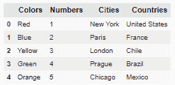
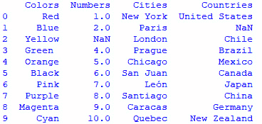
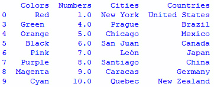
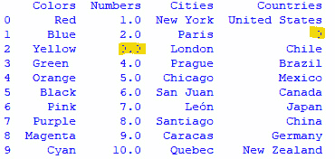
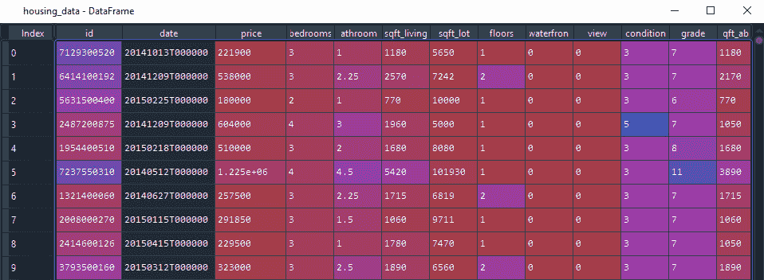
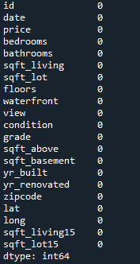
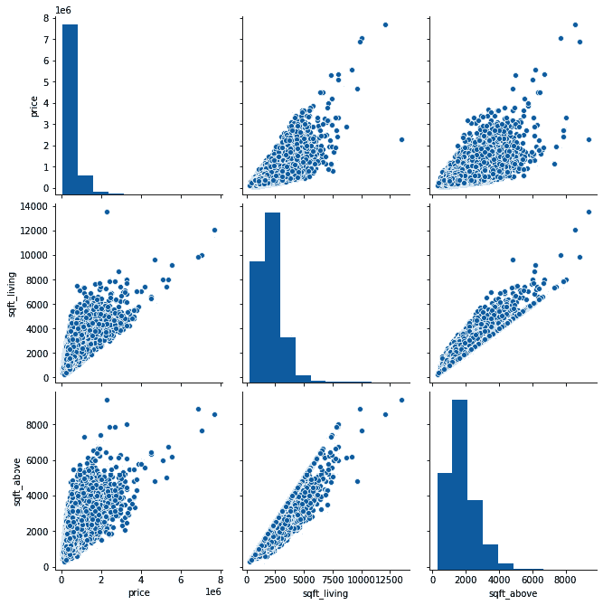
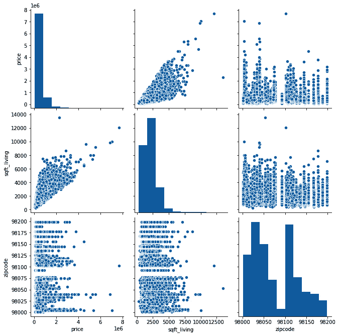

# 十四、在统计分析中使用计算思维和 Python

在本章中，我们将使用 Python 和计算思维的元素来解决需要统计分析算法的问题。我们将使用**熊猫数据帧**在 Python 环境中创建统计分析算法。创建统计分析还需要其他 Python 包，如**NumPy**、**pytz**等。我们将在需要使用这些包来编写我们将要使用的代码时，以及在学习库帮助我们做什么时（例如，使用 pandas 组织数据）使用这些包。

在本章中，我们将介绍以下主题：

*   定义问题和 Python 数据选择
*   数据预处理
*   使用可视化处理、分析和汇总数据

在本章结束时，您将能够设计出最适合所呈现场景的算法。您还将能够识别与所呈现的问题最匹配的 Python 函数，并概括您的解决方案。

# 技术要求

运行本章中的代码需要最新版本的 Python。

针对本章中的问题，您需要安装**熊猫**、**小熊猫**、**小熊猫**和**小熊猫学习**软件包。

您可以在此处找到本章中使用的完整来源：[https://github.com/PacktPublishing/Applied-Computational-Thinking-with-Python/tree/master/Chapter14](https://github.com/PacktPublishing/Applied-Computational-Thinking-with-Python/tree/master/Chapter14)

# 定义问题和 Python 数据选择

在我们查看 pandas 库之前，让我们先定义什么是数据分析。当我们谈论数据分析时，我们谈论的是检查、清理、转换和建模数据的过程，目的是发现有用的数据、通知结论和支持决策。决策至关重要。我们不只是想看到数据显示过去发生了什么。我们希望利用数据为未来做出明智的决策。

看看数据分析的一些用途：

*   **业务**：根据客户趋势和行为预测进行决策时，它有助于提高业务生产率，并推动有效决策。
*   **天气预报**：收集和分析有关大气（温度、湿度、风等）的数据，以了解大气过程（气象学），确定未来大气将如何演变。
*   **交通**：数据可以用来确定趋势，包括交通、事故等，帮助我们对交通模式、红绿灯持续时间等做出决策。

当然，上述用途只是一些可能的应用。数据分析被用于非常广泛的领域，被企业和教育组织用于做出关键决策、为社区提供资源、为学校和学院提供资金等等。

那么，让我们来看看我们有哪些工具来分析这些数据。Python 中用于数据分析的主要库之一是 pandas 包。熊猫的伟大之处在于它的易用性、简单的数据结构和高性能。使用熊猫简化了我们的数据分析工作。

## 定义熊猫

需要注意的一件重要的事情是，熊猫是建在 NumPy 之上的。**NumPy**是一个帮助我们使用阵列的软件包。Python 本身没有数组，因此包允许我们创建、使用它们，然后在该功能的基础上构建。

Pandas 提供了一种灵活、简单的数据结构，以简化您的数据分析工作。是**大数据**的绝佳工具。当我们谈论大数据时，我们谈论的是结构化和非结构化数据集，这些数据集经过分析，以便我们能够获得更好的见解，并帮助企业和组织制定决策或战略。pandas 可以处理导入不同格式，如`.csv`文件、**SQL**和**JSON**等，以及选择数据、合并、重塑和清理数据等各种操作。

在熊猫系列和数据帧中存储数据有两种不同的方式：

*   **系列**是一维数组，包含任何数据类型（整数、字符串或浮点）；序列表示一列数据。
*   **数据帧**是可以有多个列和数据类型的二维对象。它们接受字典、系列、列表和其他数据帧等输入。

现在让我们学习何时使用熊猫。

## 确定何时使用熊猫

Pandas 通常非常有用，但当我们查看大数据和处理**逗号分隔值**（**CSV**文件时，它确实是一个很棒的工具。这些文件存储为表格，如电子表格。另一件事是我们可以在熊猫身上建立*块*。是的，熊猫中有一个`chunksize`参数可以帮助我们分解数据。假设我们有 5000000 行。我们可以决定使用`chunksize`将其分解为 1000000 行。

此外，我们有时有大量的数据文件，但只想查看一些组件。Pandas 允许我们识别要包含的列和要忽略的列。

### 熊猫系列作品

如前一节所述——*定义熊猫*——系列是一维的。我们可以使用一些简单的代码创建一个空的熊猫系列。请注意，我们首先导入 pandas 库，这与处理包和库时的通常情况相同，如下所示：

```py
import pandas as pd
demo_series = pd.Series()
print(demo_series)
```

创建的默认序列的类型为`float`，因为我们在算法中没有建立任何其他类型。但是，控制台会打印一条警告，表示将来会将空系列**数据类型**设置为对象，而不是`float`。`dtype`表示数据类型；在这种情况下，它是一个浮动。请看下面的屏幕截图，它显示了我们运行算法时的输出：


图 14.1–在 pandas 中创建空序列时不标识数据类型的输出

如您所见，实际上没有错误，只是关于数据存储方式的警告。

现在，让我们创建一个包含已定义元素的系列。要做到这一点，我们需要同时导入 pandas 和`numpy`，以便创建阵列，然后创建系列。请看以下代码片段：

```py
ch14_seriesDemo.py
import pandas as pd
import numpy as np
dataset = np.array(['yellow', 'green', 'blue', 'violet', 'red'])
data_series = pd.Series(dataset)
print(data_series)
```

从前面的代码中可以看到，我们使用`numpy`存储了数组，然后使用该数组创建了一个系列。最后，我们印刷了这个系列。输出是一个表，如下所示：

```py
0    yellow
1     green
2      blue
3    violet
4       red
dtype: object
```

如果我们先创建一个列表，我们也可以得到完全相同的结果。请看这段代码：

ch14_ 系列演示 2.py

```py
import pandas as pd
import numpy as np
myList = ['yellow', 'green', 'blue', 'violet', 'red']
data_series = pd.Series(myList)
print(data_series)
```

请注意，我们直接从列表中创建了系列。我们不会显示这个特定代码段的输出，因为它与前面代码段的输出完全相同。

我们还可以从字典里找到一个系列。让我们看看下面代码中的代码：

ch14_ 系列演示 3.py

```py
import pandas as pd
myDictionary = {
    'Name' : 'Miguel',
    'Number' : 42,
    'Age' : 'unknown'
    }
mySeries = pd.Series(myDictionary)
print(mySeries)
```

前面的代码只是一个演示，但是当我们运行算法时，我们得到了一个包含字典值的表序列。让我们看看这个输出：

```py
Name       Miguel
Number         42
Age       unknown
dtype: object
```

如您所见，我们有两个基于键值对的列和类型`object`。重要的一点是，该系列没有专栏标题。为此，我们需要使用数据帧。

*如果我们想访问系列中的特定元素，该怎么办？*为了访问第一个元素，我们使用以下代码片段：

ch14_demo4.py

```py
import pandas as pd
myDictionary = {
    'Name' : 'Miguel',
    'Number' : 42,
    'Age' : 'unknown'
    }
mySeries = pd.Series(myDictionary)
print(mySeries[0])
```

前面代码的输出只是`Miguel`。这是因为我们使用索引 0 来标识我们想要从该字典中得到什么，所以它将为我们提供第一个键值对的值。如果我们想要前两个键值对元素的值对，我们会将`(mySeries[0])`替换为`(mySeries[:2])`。然后，输出将如下所示：

```py
Name      Miguel
Number        42
dtype: object
```

还有很多其他的事情可以用 series 来完成，所以可以使用索引，使用列表、字典或 NumPy 数组创建不同类型的 series。现在，让我们转到数据帧。

### 使用数据帧

现在，让我们来看看我们如何用数据文件工作。首先，让我们看一个与熊猫相关的文件。我们将在下面的代码片段中使用`demo.csv`文件。请替换文件的位置以匹配您保存文件的位置，该位置可在 GitHub 存储库中找到：

ch14_csvDemo.py

```py
import pandas as pd
data_set = pd.read_csv('C:\\...\\demo.csv')
data_set.head()
```

前面的代码做三件事。它导入 pandas 包以便我们可以使用我们需要的数据功能，它告诉程序打开我们将使用的数据文件，然后它给我们文件中的前几行数据，以便我们可以看到我们正在使用的数据。以下屏幕截图显示了上述代码的结果或输出：



图 14.2–显示数据集前几行的输出

正如您从前面的屏幕截图中看到的，该表并没有显示文件中包含的所有值。虽然我们的文件中没有大数据，但它确实包含了更多的信息行。这只是我们获取数据预览的一种方式。

但这是一个*干净的*数据集。*如果数据集的行或列缺少信息，会发生什么情况？*好吧，熊猫允许我们使用文件为我们准备。数据帧还准备我们的数据，以便我们可以创建可视化表示。这些视觉效果或情节将使我们能够看到趋势，做出预测，确定我们可以用于培训的值，等等。数据帧实际上只是我们可以使用数据集执行的所有其他操作的主干。

在本节中，我们了解了问题、如何使用熊猫，以及熊猫系列和数据帧的一些功能。

值得注意的是，在本章的其余部分中，我们将更加关注数据帧而不是系列。但是在我们进入一个应用程序之前，让我们来看看如何通过预处理我们的 DataFrame 来避免错误和陷阱。

# 预处理数据

**预处理数据**是一种将原始数据转换为可用且高效格式的技术。事实上，这是数据挖掘和机器学习过程中最重要的一步。

当我们对数据进行预处理时，我们实际上是在清理、转换数据或进行数据缩减。在本节中，我们将了解这些都意味着什么。

## 数据清理

**数据清理**是指提高数据集效率的过程。如果我们在非常大的数据集中进行数据清理，我们可以加快算法，避免错误，并获得更好的结果。在清理数据时，我们要处理两件事：

*   **缺失数据**：可通过忽略数据或手动输入缺失数据的值进行修复。
*   **噪声数据**：这可以通过装箱、回归或聚类等过程进行修复/改进。

我们将更详细地研究每一件事情。

### 处理丢失的数据

让我们来看看我们处理缺失数据的方式。首先，我们将学习如何忽略丢失的数据。我们可以使用 pandas 查找缺少值的行。当我们这样做时，我们正在清理数据集。现在，我们将不讨论我们可以使用的每一种方法，只讨论一种方法，其中我们去掉了缺少值的行。一如既往，所使用的数据集在我们的 GitHub 存储库中可用，您需要更新文件位置。让我们看一下以下代码片段：

ch14_ 清洁演示 1.py

```py
import pandas as pd
myData = pd.read_csv('C:\\...\\demo_missing.csv')
print(myData)
cleanData = myData.dropna(axis = 0, how = 'any')
print(cleanData)  
```

在前面的代码中，第一个`print`语句是为了我们自己，以便我们可以看到数据集的样子。*你永远不会想用大文件来做这件事！*以下屏幕截图显示了第一个`print`输出：



图 14.3–第一个打印语句，原始数据集

请注意，**1**、**蓝色**列在**国家**下的值为**南**，下一列（**2**、**黄色**列在**编号**下的值缺失。当我们使用`dropna()`时，算法会删除缺失值的行。以下屏幕截图显示了打印的语句和修改后的数据集：



图 14.4–打印的干净数据集

从前面的屏幕截图中可以看到，在我们的新数据集中，缺失值的两行被删除。现在，我们可以对这些数据进行任何分析。

如果只想检查一列以验证是否存在缺少的值，可以使用以下代码段：

ch14_ 清洁演示 2.py

```py
import pandas as pd
myData = pd.read_csv('C:\\...\\demo_missing.csv')
print(pd.isna(myData['Countries']))
```

请注意，在前面的算法中，我们使用了`Countries`列标题来验证该特定列。当我们运行算法时，我们的输出如下所示：

```py
0    False
1     True
2    False
3    False
4    False
5    False
6    False
7    False
8    False
9    False
Name: Countries, dtype: bool
```

如您所见，数据集中的第二行在`Countries`列中缺少一个值。

虽然我们不会讨论每种方法，但您也可以删除列。您可以选择删除具有一定数量缺失值的行和/或列。例如，您可以选择仅删除缺少两个以上值的行或列。如果这样做了，您仍然需要担心未删除的列或行中可能仍然缺少的值，因为只有一个缺少的值。对于这些，您可以选择用某些内容替换缺少的值。

假设要替换给定列的值。要做到这一点，让我们看看下面的代码片段：

ch14_ 清洁演示 3.py

```py
import pandas as pd
myData = pd.read_csv('C:\\...\\demo_missing.csv')
print(myData.fillna(0))
```

从前面的代码中，请注意，我们正在用值`0`填充每个空单元格。当我们运行该算法时，我们得到以下输出：



图 14.5–替换掉的缺失值

注意前面屏幕截图中突出显示的值。这些是我们的算法替换的值。现在，让我们来看看我们如何处理有噪声的数据。

### 处理有噪声的数据

首先，让我们定义我们所说的**噪声数据**的含义。当我们有大量的数据，而其中一些数据对我们的分析没有用处时，我们就说它是有噪声的数据。噪声数据也用于指数据损坏。*真的，这只是无用的数据*。

我们处理噪声数据的三种方法是组合、回归和聚类：

*   **装箱**使用相邻数据平滑排序后的数据值。排序后的值放入箱子中，箱子是在算法中创建的组。
*   **聚类**方法识别并删除数据集中的异常值。
*   **回归**方法通过将数据拟合成回归函数来平滑数据。

装箱的目的是减少一些错误。在装箱中，数据被分成小的桶或箱子。然后用计算出的 bin 值替换数据。当我们完成装箱过程时，我们正在平滑数据。

下面是一个在算法中使用简单数值数据集的示例。以下代码片段将以相同的频率创建 BIN：

ch14_binning1.py

```py
#Binning with equal frequency
def equal_frequency(array1, m): 
	l = len(array1) 
	n = int(l / m) 
	for i in range(0, m): 
		array = [] 
		for j in range(i * n, (i + 1) * n): 
			if j >= l: 
				break
			array = array + [array1[j]] 
		print(array) 
#Input dataset 
dataset = [3, 6, 7, 9, 11, 14, 10, 15, 19, 35, 38, 45, 48, 49, 76] 
#Input number of bins
m = 5
print("Equal Frequency Binning: ") 
equal_frequency(dataset, m) 
```

当查看前面的代码时，您可以看到箱子的数量被定义为`5`，所以数据将被分为五个列表。Binning 实际上是一种对信息进行分组的方法。我们告诉算法我们想要做它，我们想要多少个箱子，它提供这些箱子或组中的数据。在本例中，我们得到这五个列表。请看一下输出：

```py
Equal Frequency Binning: 
[3, 6, 7]
[9, 11, 14]
[10, 15, 19]
[35, 38, 45]
[48, 49, 76]
```

如您所见，算法创建了五个箱子，每个箱子中有三个值。

重要提示：

请注意，装箱过程不会为我们组织数据。因此，如果我们对值重新排序，它们仍然会按照数据输入的顺序进行装箱。

现在，让我们来看一个使用相等宽度的装箱算法：

ch14_binning2.py

```py
#Binning with equal width 
def equal_width(array1, m): 
	w = int((max(array1) - min(array1)) / m) 
	min1 = min(array1) 
	array = [] 
	for i in range(0, m + 1): 
		array = array + [min1 + w * i] 
	arrayi=[] 
	for i in range(0, m): 
		result = [] 
		for j in array1: 
			if j >= array[i] and j <= array[i+1]: 
				result += [j] 
		arrayi += [result] 
	print(arrayi) 
#Input dataset 
dataset = [3, 6, 7, 9, 11, 14, 10, 15, 19, 35, 38, 45, 48, 49, 76, 81, 208, 221] 
#Input number of bins
m = 3
print("\nEqual Width Binning:") 
equal_width(dataset, m)
```

前面的代码片段将我们的数据分解为三个箱子。等宽分块的目标是将数据集划分为大小相等的分块，在等宽分块的情况下，这意味着范围相等。数据将被分割，但需要注意的是，我们在这里讨论的是范围，因此对于这个特定的数据集，每个容器中的元素数量不会相同。前面代码片段的输出如下所示：

```py
Equal Width Binning:
[[3, 6, 7, 9, 11, 14, 10, 15, 19, 35, 38, 45, 48, 49], [76, 81], [208]]
```

如您所见，binning 生成的输出看起来不像等频率输出那么干净，但实际上更受欢迎。

现在，让我们谈谈转换数据。

## 转换数据

熊猫允许我们转换数据。以下是我们可以改变它的一些方法：

*   **Normalization** transforms values into new range; the most popular is **min-max normalization**, given as follows:

    

*   **属性选择**是通过用不同的属性替换一个或多个属性来转换数据的过程。
*   **概念层次**实际上是通过减少数据进行的转换。通过使用更高级的概念（如限定符（*短*、*长*、*极长*）替换数字（*10*、*15*、*40*）等概念来完成。

在下一节中，我们将浏览数据的简化。

## 减少数据量

**数据缩减**是指允许我们从数据集中获得类似或甚至相同结果的过程，但前提是减少了数据的体积表示。

在这里，我们不会对所有概念进行太多深入的讨论，因为它们在示例中更容易查看，但以下是一些数据简化的方法：

*   从数据集中删除无效数据
*   为不同级别的数据创建摘要

将删除无效数据视为处理任何异常值。数据输入可能不正确，条件可能不理想或类似。当我们有一个不适合整个数据集的数据点时，特别是当我们有大量数据点与之进行比较时，我们可以将该数据点作为无效数据点或异常数据点删除。

在创建不同级别的摘要时，我们正在聚合数据集，并在每个级别测试和生成摘要。假设您有 100 个数据点（数据集通常有数千个，但用较小的数字更容易解释）。我们可以为前 20 个数据点创建摘要。然后，我们可以对前 40 个，然后是前 60 个，依此类推。当进行比较时，我们可以看到趋势，并使用数据集中较小的子部分进行预测，如果趋势成立的话。这就是数据缩减的帮助所在，简化了数据集，同时仍能得到准确的结果。

在本节中，我们学习了如何处理需要清理的数据。我们学习了一些清理数据的方法，例如消除丢失的数据或替换丢失的点。我们还学习了关于噪声数据以及如何解决数据集中噪声数据的问题。最后，我们学习了数据缩减，以及如何通过删除无效数据和创建数据汇总来获得准确的结果。

这只是对我们处理数据时所做的事情类型的介绍。那么，让我们看一个例子，这样我们就可以将其中的一些内容放到上下文中。

# 使用可视化处理、分析和总结数据

我们现在在房地产领域工作，既然我们想做得好，我们真的想建立一个算法来帮助我们分析数据和预测房价。但是让我们考虑一下。我们可以非常宽泛地或狭义地定义这个问题。我们可以对一个州的所有房屋或一个街区内有三间卧室或更多卧室的房屋进行定价分析。*执行分析是否重要？可能是*。*但这不是我们想研究这个问题的原因吗？*

让我们先看看如何处理数据。

## 处理数据

让我们先收集一些数据。对于这个问题，我们使用的是`kv_house_data.csv`数据集，它可以在我们的 GitHub 存储库中找到。要查看此数据集，我们需要相当多的库。我们一直在谈论熊猫，是的，但我们也想进行可视化和分析，所以我们需要**Seaborn**、**SciPy**和**Scikit Learn**。完整的算法可以在`ch14_housePrice_prediction.py`文件中找到。我们将以片段的形式讨论我们正在做的事情：

ch14_ 房价 _ 预测.py

```py
import pandas as pd
import numpy as np
import seaborn as sns
import matplotlib.pyplot as plt
```

*那么，这些图书馆是什么？*我们知道的熊猫。我们用它来组织数据。NumPy 帮助我们处理阵列。Seaborn 和 Matplotlib 都用于可视化。如果我们通过使用数据集进行训练来进一步创建模型，我们还需要学习 Scikit。在这个例子中，我们将继续使用一些我们在训练前可以得到的情节。

现在，让我们导入我们的数据集。记住[*第 12 章*](12.html#_idTextAnchor159)*在实验和数据分析问题*中使用 Python，您可以直接设置文件的目录。您还可以提供数据文件的完整路径，正如我们在本章前面所做的那样，例如清洗演示中的。您可以使用`os.chdir()`建立目录，在括号中添加文件的位置，然后使用以下代码段读取`.csv`文件：

```py
housing_data= pd.read_csv("kc_house_data.csv")
```

我们在这里使用一个函数。*看到*`pd.read_csv()`*了吗？*那`pd`是熊猫，因为我们把熊猫作为`pd`导入，`read_csv()`是算法获取文件信息的函数。

如果您忘记输入目录或包含错误的目录位置，您将收到一个错误代码，如以下屏幕截图所示：


图 14.6–文件路径错误

如您所见，Python 将确保您知道自己犯了错误。*这有时会让人恼火，但肯定是有帮助的。*

现在我们有了数据，我们需要检查并清理它。这就是我们在本章前面分享的所有内容发挥作用的地方。让我们看看在实践中会是什么样子。

## 分析总结数据

现在，有一件事我们并没有谈论太多，那就是 Python 的变量资源管理器。更具体地说，它是**Spyder 的 Python 变量资源管理器**。Spyder 是一个集成环境并且是免费的。它与 Python 一起工作，像往常一样运行 Python，但也为我们提供了更好的编辑工具。下面的屏幕截图显示了在 Python 中从变量资源管理器导入数据集时的外观。当我们在 Spyder 中运行`ch14_housePrice_prediction.py`Python 算法时，我们可以在变量浏览器中看到我们的变量。以下屏幕截图显示了运行此算法时从变量资源管理器获得的数据：


图 14.7–Spyder 中的变量浏览器视图

当我们处理大量数据和更大的算法时，这个工具变得非常关键。我们可以从这个工具中获得很多信息。例如，让我们看看`housing_data`变量。在*图 14.7*中可以看到我们算法中该变量的类型为**数据帧**，大小为**（21613，21）**。

如果您双击变量浏览器中的变量，您将看到以下屏幕截图所示内容（请请注意，屏幕截图的外观可能会因您使用的环境而异。当使用 Spyder 或 Jupyter 等环境运行此代码时，根据您的主题设置和选择，表格的外观可能会有所不同，包括不同的配色方案或无配色方案）：



图 14.8–Spyder 中的 DataFrame 变量视图

这只是获取数据帧部分信息的一种方法。Spyder 还允许我们调整窗口的大小，这样我们可以查看更多的列，滚动以查找值，等等。如果我们在 Python 控制台中，就没有那么容易了。你可以得到信息，只是不那么容易。

下面的代码可以给我们一些信息：

```py
housing_data.head()
```

前面的代码将显示数据集的前五行。请看下面的屏幕截图；我们在**价格**和**长**之间有省略号（**…**）。这是因为 Python 想让我们知道在这两个列之间还有其他列：


图 14.9–数据帧的前几行

如您所见，这些行可以帮助我们查看数据集的外观，但没有其他帮助。因此，我们还可以使用以下代码查看数据帧的大小：

```py
housing_data.shape
```

当我们运行前面的代码时，我们得到以下输出：

```py
(21613, 21)
```

如您所见，现在我们有了数据帧的形状或大小。*这是什么意思？*表示我们在`21`列中有`21,613`行数据。无论您是在 Spyder、Python 控制台还是您选择的其他环境中，都可以看到数据已成功导入。

现在我们已经导入了原始数据，让我们看看是否可以获得更多信息。我们可以使用以下代码获得摘要：

```py
housing_data.describe()
```

`describe()`函数生成一个摘要，其中包括平均值、标准偏差和百分位数等详细信息。此百分位数是您的五位数数据集摘要的一部分，用于创建**箱线图**。虽然我们不会在这个问题上创建一个箱线图，但是视觉表示可能会有所帮助，这取决于我们算法的目标。查看使用`describe()`功能的结果截图如下：


图 14.10–使用 descripe（）函数

现在，我们应该注意，该函数分析数据帧中的数值。它不包括`NaN`值。`NaN`在 Python 中表示**不是数字**值，表示任何未定义或不可表示的值。`NaN`也可以表示缺失的数字。我们在前面的*处理缺失数据*一节中讨论了这些缺失的数字，以及我们可以解决它们的一些方法。现在让我们从上下文的角度来看这一点。我们希望找到丢失的值。为此，我们可以运行以下代码段：

```py
housing_data.isnull().sum()
```

前面的代码片段将告诉我们数据集中的每一列中是否缺少数据点。然后，它将这些值聚合为总和。因此，如果我们在`date`列下缺少两个值，我们希望在那里看到`2`。我们的结果可以在以下屏幕截图中看到：



图 14.11–运行 isnull（）和.sum（）函数的结果

*我们不必清理此数据集！**这是一个干净的数据集*。然而，学习如何识别我们是否需要这样做是非常重要的。现在我们知道我们有了一个干净的数据集，我们可以开始构建一些可视化。

## 使用数据可视化

记住，这仍然是我们初始算法文件`ch15_housePrice_prediction.py`的部分。如果打开该文件，下面的代码从*第 25 行*开始。我们在代码行之间增加了注释：

```py
names=['price','bedrooms','bathrooms','sqft_living','sqft_lot','floors','waterfront','view','condition','grade','sqft_above','sqft_basement','zipcode','lat','long']
df=housing_data[names]
```

我们要做的第一件事是确定我们将用于绘图的列。完成后，我们将创建一个数据帧并将其保存为`df`：

```py
correlations= df.corr()
```

前面的代码片段为我们的数据帧创建关联。在文件的下一个代码片段中，我们将创建我们的图形；也就是说，我们将致力于数据可视化：

```py
fig=plt.figure()
ax=fig.add_subplot(111)
cax=ax.matshow(correlations,vmin=-1,vmax=1)
fig.colorbar(cax)
```

在前面的代码中，我们命名了我们的图形，添加了子图，并确定了我们的颜色。接下来，我们必须设置一些属性，例如记号、记号之间的距离以及轴和记号的标签：

```py
ticks=np.arange(0,15,1)
ax.set_xticks(ticks)
ax.set_yticks(ticks)
ax.set_xticklabels(names, rotation =' 90')
ax.set_yticklabels(names)
```

在我们设置了一些属性之后，我们可以要求绘图使用`tight_layout()`。这将帮助我们查看绘图和标签的所有详细信息。如果我们不使用`tight_layout()`，我们有时会有一些在图形中看不到的标签：

```py
plt.tight_layout()
plt.savefig('Correlation_graph.png',dpi = 300)
plt.show()
```

在前面的片段中，我们还创建了一个保存文件并定义了图形的大小。最后，我们要求算法显示相关性。下面的屏幕截图显示了前面代码的结果：


图 14.12–住房数据的相关性图

如您所见，我们刚刚使用 Python 创建了一个**相关矩阵**。这是一个非常棒的矩阵。*但什么是相关矩阵？*相关性矩阵查看数据帧中的所有值，然后计算它们之间的相关性，给出一个介于**-1**和**1**之间的值。值越接近**1**，相关度越高。每个值都与自身进行比较，这当然是一个完美的相关性，在我们的矩阵中被视为对角线。

在图的其余部分，所有的值相互比较，必须更仔细地观察。越接近黄色，值之间的关联就越紧密。那么，看看值上方的*y*-轴**sqft_ 和*x*轴上**sqft_ 居住**的对应值。该值接近**1**的黄色值，但不完全相同。我们在以下屏幕截图中突出显示了这些值：**


图 14.13–突出显示了上述 sqft_ 和生活 sqft_ 的相关性

还有其他一些值显示出一定的相关性，但还不够强。这个图可以帮助我们做出决定，也许可以更仔细地观察这种相关性，找到更多关于它的信息，等等。

现在，我们还可以看看一个非常密集的绘图矩阵，称为*对绘图*。**配对图**向我们展示了单变量的分布以及两个变量之间的关系。如果我们对算法中包含的数据进行成对绘图，我们会得到一个巨大的图形，如下面的屏幕截图所示（请注意，由于分析和绘图的数据量，此绘图可能需要几分钟时间生成）：


图 14.14–完整数据帧对图

正如你们所看到的，这是一个相当紧张、难以阅读、几乎不可能分析的图表。你必须放大每一对数字才能做出一些决定。还应该提到的是算法运行和生成此图形需要时间。*从如此大的数据集创建如此复杂的东西需要一些处理能力！*

*我们有没有想过要看到像这样的一大片图形？**事实上，是*。*如果我们有一个变量更少的数据集，那绝对是！*例如，我们也可以使用其他配色方案使其更友好。这可能使识别趋势变得更容易。但是让我们澄清一下；这不是很有帮助。我们所能做的就是创建一个我们可能感兴趣的一些变量的成对图。还记得我们说过的`sqft_living`和*`sqft_above`可能有很强的正相关性吗？我们还真的想把东西和定价进行比较，对吗？那么，让我们仅使用`sqft_living`、`pricing`和`sqft_above`创建一个配对图。请查看我们文件中的相关代码片段：*

 *```py
coln = ['price','sqft_living','sqft_lot']
sns.pairplot(housing_data[coln], height = 3);
plt.savefig('pairplotting.png',dpi =300)
plt.show()
```

现在，当我们运行算法的这一部分时，我们得到如下屏幕截图所示的图形。该图提供了这三个值的相关性，我们可以肯定地看到出现了一些正相关性：



图 14.15–上述价格、居住面积和居住面积的成对图

特别要注意的是，**sqft_living**和**sqft_ 对在**之上的图形。这两者之间的关系是相当线性和积极的。这证实了我们从*图 14.13*观察到的情况，其中相关性比其他变量更接近**1**。

但这也有助于分析另外三个变量，这样我们就可以看到当相关性不强时会发生什么。我们将保留`price`和`sqft_living`，以便我们仅更改其中一个变量以进行比较。查看*图 14.12*，**sqft_living**和**zipcode**似乎根本没有强正相关。那么，让我们再次运行该算法，将`zipcode`与`sqft_above`交换。让我们看看下面截图中显示的结果：



图 14.16–价格、生活质量和 zipcode 的成对图

正如你所看到的，**sqft_living**和**zipcode**完全没有相关性。它们看起来更像条形图，看不到对角线。在我们从这些图中继续之前，值得一提的是，这些成对图仅提供比较变量的散点图，以及图中每个变量的直方图。如果我们想更深入，我们可以看看其他可视化工具，比如**Seaborn**中的工具。

我们在这里暂停分析。我们已经使用可视化来理解数据的相关性。如果我们进一步研究这个问题，我们可以利用这些数据建立训练模型，并帮助我们进行预测。即使有我们从图表中得到的数据，我们也可以看到我们的相关性，并利用这些数据进行预测。例如，如果我们有`sqft_living`，我们可以预测`sqft_above`，因为它们有很强的相关性。

Python 允许我们以多种方式查看数据。这是像这样一个工具的巨大资产之一。

# 总结

在本章中，我们学习了如何使用 Python 处理数据，并使用本章中学习的一些概念处理了一个房屋数据集。我们了解了熊猫套餐以及它如何帮助我们组织和准备数据。我们还了解了预处理数据集的必要性，特别是在非常大的数据集中。我们处理了丢失和嘈杂的数据，以及数据转换和数据缩减。我们还学习了如何使用可视化，为数据集创建图表，帮助我们识别相关性和趋势。

这一章的主题相当广泛，整本书都是关于它们的。但是，在继续本书的下两章之前，我们觉得分享 Python 编程语言的一些功能很重要。

在接下来的章节中，我们将完全关注应用程序，使用问题场景和主题来分享 Python 的一些激动人心的应用程序以及设计算法时的计算思维。*