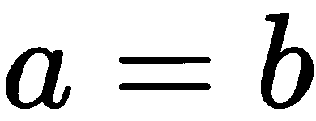

# 二、基本函数概念介绍

函数式编程的大多数特性已经是 Python 的一流部分。我们编写函数式 Python 的目标是将我们的重点从命令式（过程式或面向对象的）技术转移到尽可能大的程度。

我们将研究以下每个函数式编程主题：

*   一类函数和高阶函数，有时称为纯函数。
*   不变的数据。
*   严格和不严格的评价。我们也可以称之为渴望与懒惰的评估。
*   递归而不是显式循环状态。
*   功能型系统。

这应该重申第一章中的一些概念：首先，纯函数编程避免了通过变量赋值维护显式状态的复杂性；其次，Python 不是一种纯粹的函数式语言。

这本书并没有试图提供函数式编程的严格定义：Python 不是一种纯粹的函数式语言，严格的定义是没有帮助的。相反，我们将确定一些在函数式编程中无疑很重要的通用特性。我们将避开模糊的边缘，重点关注明显的功能特性。

在本章中，我们将在示例中包括一些 Python3 类型提示。类型提示可以帮助您可视化函数定义背后的基本用途。使用**mypy**工具分析类型提示。与**pylint**的单元测试和静态分析一样，**mypy**可以是用于生产高质量软件的工具链的一部分。

# 一类函数

函数式编程通常简洁而富有表现力。实现它的一种方法是提供函数作为参数，并为其他函数返回值。我们将看很多操作函数的例子。

要使其工作，函数必须是运行时环境中的一流对象。在 C 等编程语言中，函数不是运行时对象。然而，在 Python 中，函数是（通常）由`def`语句创建的对象，可以由其他 Python 函数操作。我们也可以创建一个函数作为一个可调用对象，或者通过将`lambda`赋值给一个变量。

以下是函数定义如何创建具有属性的对象：

```py
>>> def example(a, b, **kw):
...    return a*b
...
>>> type(example)
<class 'function'>
>>> example.__code__.co_varnames
('a', 'b', 'kw')
>>> example.__code__.co_argcount
2
```

我们已经创建了一个对象`example`，它属于`function()`类。此对象具有许多属性。与函数对象关联的`__code__`对象有自己的属性。实施细节并不重要。重要的是函数是一级对象，可以像所有其他对象一样进行操作。我们之前显示了函数对象的多个属性中的两个属性的值。

# 纯函数

为了便于表达，函数应该没有副作用造成的混乱。使用纯函数还可以通过更改求值顺序进行一些优化。然而，最大的成功来自于纯函数在概念上更简单，更容易测试。

要用 Python 编写纯函数，我们必须只编写本地代码。这意味着我们必须避免`global`陈述。我们需要仔细研究`nonlocal`的任何用法；虽然它在某些方面是一种副作用，但它仅限于嵌套函数定义。这是一个容易达到的标准。纯函数是 Python 程序的一个常见特性。

没有一种简单的方法可以保证 Python 函数没有副作用。很容易不小心打破纯函数规则。如果我们想担心自己是否有能力遵循这条规则，我们可以编写一个函数，使用`dis`模块扫描给定函数的`__code__.co_code`编译代码以获取全局引用。它可以报告内部封闭的使用，以及`__code__.co_freevarstuple`方法。对于一个罕见的问题，这是一个相当复杂的解决方案；我们不会再追查下去了。

Python`lambda`是一个纯函数。虽然这不是一种强烈推荐的样式，但通过`lambda`对象始终可以创建纯函数。

下面是通过将`lambda`赋值给变量创建的函数：

```py
>>> mersenne = lambda x: 2**x-1
>>> mersenne(17)
131071
```

我们使用`lambda`创建了一个纯函数，并将其分配给变量`mersenne`。这是一个可调用的对象，只有一个参数*x*，返回一个值。因为 lambda 不能有赋值语句，所以它们总是纯函数，适合函数编程。

# 高阶函数

我们可以使用高阶函数实现表达简洁的程序。这些函数接受函数作为参数或返回函数作为值。我们可以使用高阶函数作为从简单函数创建复合函数的方法。

考虑 Python PosiT0.函数。我们可以提供一个函数作为参数，并修改`max()`函数的行为。

以下是我们可能需要处理的一些数据：

```py
>>> year_cheese = [(2000, 29.87), (2001, 30.12), (2002, 30.6), (2003, 
30.66),(2004, 31.33), (2005, 32.62), (2006, 32.73), (2007, 33.5), 
(2008, 32.84), (2009, 33.02), (2010, 32.92)]
```

我们可以应用`max()`功能，如下所示：

```py
>>> max(year_cheese)
(2010, 32.92)
```

默认行为是简单地比较序列中的每个`tuple`。这将返回位置 0 上具有最大值的`tuple`。

由于`max()`函数是一个高阶函数，我们可以提供另一个函数作为参数。在这种情况下，我们将使用`lambda`作为函数；`max()`功能使用此选项，如下所示：

```py
>>> max(year_cheese, key=lambda yc: yc[1])
(2007, 33.5)  
```

在本例中，`max()`函数应用提供的`lambda`并返回位置 1 中具有最大值的元组。

Python 提供了丰富的高阶函数集合。我们将在后面的章节中看到 Python 的每个高阶函数的示例，主要是在[第 5 章](05.html)、*高阶函数中。*我们还将了解如何轻松编写自己的高阶函数。

# 不变数据

因为我们不使用变量来跟踪计算的状态，所以我们需要关注不可变的对象。我们可以广泛使用`tuples`和`namedtuples`来提供更复杂的不可变数据结构。

不可变对象的概念对 Python 来说并不陌生。使用不可变的`tuples`而不是更复杂的可变对象可能有性能优势。在某些情况下，重新考虑算法以避免对象变异的代价会带来好处。

我们将几乎完全避免类定义。在一种面向**对象**-**的****编程**（**OOP**语言中避免对象似乎是一种诅咒。函数式编程不需要有状态的对象。我们将在本书中看到这一点。定义`callable`对象是有原因的；这是一种为密切相关的函数提供名称空间的整洁方式，并且支持令人愉快的可配置性。此外，使用可调用对象创建缓存也很容易，这将导致重要的性能优化。

举个例子，这里有一个通用的设计模式，可以很好地处理不可变对象：`wrapper()`函数。元组列表是一种相当常见的数据结构。我们通常采用以下两种方法之一处理此元组列表：

*   **使用高阶函数**：如前所示，我们提供了`lambda`作为`max()`函数的参数：`max(year_cheese, key=lambda yc: yc[1])`
*   **使用包裹过程展开模式**：在功能上下文中，我们应该称其为`unwrap(process(wrap(structure)))`模式

例如，请查看以下命令片段：

```py
>>> max(map(lambda yc: (yc[1], yc), year_cheese))[1]
(2007, 33.5)  
```

这符合包装数据结构的三部分模式，即找到包装结构的最大值，然后展开结构。

`map(lambda yc: (yc[1], yc), year_cheese)`将每个项目转换为两个元组，其中一个键后跟原始项目。在本例中，比较键仅为`yc[1]`。

使用`max()`功能完成处理。由于每段数据都简化为两个元组，位置为零用于比较，因此不需要`max()`函数的高阶函数特性。`max()`函数的默认行为使用每两个元组中的第一项来定位最大值。

最后，我们使用下标`[1]`展开。这将拾取由`max()`函数选择的两个元组的第二个元素。

这种类型的`wrap`和`unwrap`非常常见，以至于有些语言有特殊的函数，比如`fst()`和`snd()`，我们可以使用它们作为函数前缀，而不是作为`[0]`或`[1]`的语法后缀。我们可以使用此想法修改包裹过程展开示例，如下所示：

```py
>>> snd = lambda x: x[1]
>>> snd(max(map(lambda yc: (yc[1], yc), year_cheese)))
(2007, 33.5) 
```

这里，lambda 用于定义从`tuple`中拾取第二项的`snd()`函数。这提供了一个更易于阅读的版本`unwrap(process(wrap()))`。与前面的示例一样，`map(lambda... , year_cheese)`表达式用于`wrap`我们的原始数据项，`max()`函数进行处理。最后，`snd()`函数从元组中提取第二项。

在[第 13 章](13.html)、*条件表达式和运算符模块*中，我们将了解`lambda`函数的一些替代方案，例如`fst()`和`snd()`。

# 严格与非严格评价

函数式编程的效率部分源于能够将计算推迟到需要时。懒惰或不严格评估的想法非常有用。在某种程度上，Python 提供了这个特性。

在 Python 中，逻辑表达式运算符`and`、`or`和`if-then-else`都是非严格的。我们有时称它们为*短路*运算符，因为它们不需要计算所有参数来确定结果值。

下面的命令片段显示了`and`操作符的非严格特性：

```py
>>> 0 and print("right")
0
>>> True and print("right")
right
```

当我们执行前面的第一个命令片段时，`and`操作符的左侧相当于`False`；不计算右侧。在第二个示例中，当左侧等同于`True`时，对右侧进行评估。

Python 的其他部分是严格的。在逻辑运算符之外，表达式需要从左到右进行求值。语句行序列也严格按顺序计算。文字列表和`tuples`需要急切的评估。

创建类时，方法函数按严格的顺序定义。在类定义的情况下，方法函数被收集到一个字典中（默认情况下），并且在它们被创建之后，顺序不会得到维护。如果我们提供两个名称相同的方法，由于严格的评估顺序，第二个方法将被保留。

然而，Python 的生成器表达式和生成器函数是懒惰的。这些表达式不会立即创建所有可能的结果。如果不明确记录计算的详细信息，就很难看到这一点。以下是`range()`函数版本的一个示例，其副作用是显示它创建的数字：

```py
def numbers():
    for i in range(1024):
        print(f"= {i}")
        yield i
```

为了提供一些调试提示，此函数在生成值时打印每个值。如果这个函数是渴望的，它将创建所有 1024 个数字。因为它是懒惰的，所以它只根据请求创建数字。

The older Python 2 `range()` function was eager and created an actual list object with all of the requested numbers. The Python 3 `range()` object is lazy, and will not create a large data structure.

我们可以使用这个嘈杂的`numbers()`函数来显示懒惰的评估。我们将编写一个函数，用于计算此迭代器中的一些（但不是全部）值：

```py
def sum_to(n: int) -> int:
    sum: int = 0
    for i in numbers():
        if i == n: break
        sum += i
    return sum
```

`sum_to()`函数有类型提示，表明它应该接受`n`参数的整数值，并返回整数结果。`sum`变量还包括 Python3 语法`: int`，提示应将其视为整数。此函数不会评估`numbers()`函数的整个结果。仅消耗`numbers()`函数中的几个值后，它就会断开。我们可以在以下日志中看到这些值的消耗：

```py
>>> sum_to(5)
= 0
= 1
= 2
= 3
= 4
= 5
10
```

正如我们稍后将看到的，Python 生成器函数具有一些属性，这使得它们对于简单的函数编程来说有点笨拙。具体来说，生成器在 Python 中只能使用一次。我们必须谨慎使用懒惰的 Python 生成器表达式。

# 递归而不是显式循环状态

功能程序不依赖循环和跟踪循环状态的相关开销。相反，函数式程序试图依赖更简单的递归函数方法。在某些语言中，程序是以递归形式编写的，但编译器中的**Tail**-**Call****Optimization**（**TCO**）将其更改为循环。我们将在这里介绍一些递归，并在[第 6 章](06.html)、*递归和归约*中仔细研究它。

我们将看一个简单的迭代来测试一个数是否为素数。素数是一个自然数，只能被 1 和它本身整除。我们可以创建一个幼稚且性能差的算法来确定一个数字是否有任何介于 2 和该数字之间的因子。该算法具有简单的优点；对于解决**欧拉**项目的问题，其效果是可以接受的。阅读**米勒**-**拉宾**素性测试，寻找更好的算法。

我们将使用术语`coprime`来表示两个数字只有一个作为它们的公因子。例如，数字 2 和 3 是`coprime`。然而，数字 6 和 9 不是`coprime`，因为它们有三个共同因素。

如果我们想知道一个数字*n*是否是素数，我们实际上会问：这个数字*n*`coprime`是否是所有素数的*p*，这样*p*<sup>2</sup>*n*？我们可以使用所有整数*p*来简化这个过程，这样 2≤ *p*<sup>2</sup><*n*。

有时，它有助于将其形式化，如下所示：


在 Python 中，表达式可以如下所示：

```py
not any(n%p==0 for p in range(2,int(math.sqrt(n))+1))
```

从数学形式主义到 Python 的更直接的转换将使用`all(n%p != 0... )`，但这需要严格评估*p*的所有值。如果发现`True`值，*没有任何*版本可以提前终止。

这个简单的表达式中有一个`for`循环：它不是一个纯粹的无状态函数编程示例。我们可以将其重新构造为一个与一组值一起工作的函数。我们可以询问数字*n*是否在半开区间的任意值内`coprime`。这使用符号`[)`来表示半开间隔：包括较低的值，不包括较高的值。这是 Python`range()`函数的典型行为。我们还将把自己限制在自然数的范围内。例如，平方根值被隐式截断为整数。

我们可以将素数的定义如下：

，给定`n > 1`。

在简单的值范围内定义递归函数时，基本情况可以是空范围。非空范围通过处理一个值和一个窄一个值的范围来递归处理。我们可以将其正式化如下：


通过检查两个案例，该版本相对容易确认，如下所示：

*   如果范围为空，，我们的评估结果类似于：。该范围不包含任何值，因此返回值是一个微不足道的`True`。
*   如果该范围不是空的，我们会计算如下内容：。这会分解成。对于这个例子，我们可以看到第一个子句是`True`，我们将递归地计算第二个子句。

作为读者的练习，可以在第二种情况下使用`[a,b-1)`将此递归重新定义为倒计时而不是倒计时。尝试此修订以查看需要进行哪些更改（如果有）。

作为旁注，有些人喜欢将空间隔视为*a*≥ *b*代替*a*=*b*。额外的条件是不必要的，因为*a*增加了 1，我们可以很容易地保证*a*≤ *b*，最初。*a*无法通过函数中的某个错误以某种方式跳过*b*；我们不需要过度指定空间隔的规则。

以下是实现 prime 定义的 Python 代码段：

```py
def isprimer(n: int) -> bool:
    def isprime(k: int, coprime: int) -> bool:
        """Is k relatively prime to the value coprime?""" 
        if k < coprime*coprime: return True 
        if k % coprime == 0: return False 
        return isprime(k, coprime+2) 
    if n < 2: return False 
    if n == 2: return True 
    if n % 2 == 0: return False 
    return isprime(n, 3)
```

这显示了`isprimer()`函数的递归定义。函数需要为`n`参数设置`int`值。类型提示提示将返回一个`bool`结果。

半开区间被缩减为低端参数*a*，重命名为`coprime`参数，以明确其用途。基本情况实现为`n < coprime*coprime`；从`coprime`到`1+math.sqrt(n)`的值范围将为空。

本例不使用非严格的`and`操作，而是将决策拆分为单独的`if`语句`if n % coprime == 0`。最后的`return`语句是具有不同`coprime`测试值的递归调用。

因为递归是函数的尾部，所以这是**尾部递归**的一个例子。

此`isprime()`函数嵌入在`isprimer()`函数中。外部函数用于建立*n*是大于 2 的奇数的边界条件。测试偶数是否为素数没有意义，因为 2 是唯一的偶数素数。

在这个例子中，重要的是这个递归函数的两种情况非常容易设计。将值的范围作为内部`isprime()`函数的显式参数，允许我们使用反映稳定收缩间隔的参数值递归调用函数。

虽然递归通常简洁且富有表现力，但在 Python 中使用它时必须谨慎。可能会出现两个问题：

*   Python 强制使用递归限制来检测具有不正确定义的基本情况的递归函数
*   Python 没有一个可以实现 TCO 的编译器

默认递归限制为 1000，这对于许多算法来说都是足够的。可以使用`sys.setrecursionlimit()`功能更改此设置。武断地提出这一点是不明智的，因为这可能会导致超过操作系统内存限制并导致 Python 解释器崩溃。

如果我们尝试对超过 1000000 的*n*值执行递归`isprimer()`函数，我们将与递归限制发生冲突。即使我们修改了`isprimer()`函数，只检查素数因子而不是所有因子，我们也会在第 1000 个素数 7919 处停止，将素数测试限制在 62710561 以下。

一些函数式编程语言可以优化简单的递归函数。优化编译器会将`isprimer(n, coprime+1)`方法的递归求值转换为低开销`loop`。优化往往会使调试优化的程序更加困难。Python 不执行这种优化。为了清晰和简单，牺牲了性能和内存。这也意味着我们不得不手动进行优化。

在 Python 中，当我们使用生成器表达式而不是递归函数时，本质上是手动执行 TCO。我们不依赖编译器来进行优化。

以下是作为生成器表达式完成的 TCO：

```py
def isprimei(n: int) -> bool:
    """Is n prime?

    >>> isprimei(2)
 True
 >>> tuple( isprimei(x) for x in range(3,11) )
 (True, False, True, False, True, False, False, False)
    """
    if n < 2:
        return False
    if n == 2:
        return True
    if n % 2 == 0:
        return False
    for i in range(3, 1+int(math.sqrt(n)), 2):
        if n % i == 0:
            return False
    return True
```

此函数包含许多函数编程原则，但它使用生成器表达式而不是纯递归。

We'll often optimize a purely recursive function to use an explicit `for` loop in a generator expression.

对于大素数，该算法速度较慢。对于复合数字，函数通常会快速返回值。如果在诸如之类的值上使用，则需要几分钟时间来显示这是素数。显然，这种缓慢来自于对 1518500249 个候选人因素的检查。

# 功能型系统

一些函数式编程语言，如**Haskell**和**Scala**是静态编译的，并且依赖于函数及其参数的声明类型。为了提供 Python 已经具备的灵活性，这些语言具有复杂的类型匹配规则，因此可以编写泛型函数，该函数适用于各种相关类型。

在面向对象的 Python 中，我们经常使用类继承层次结构，而不是复杂的函数类型匹配。我们依靠 Python 根据简单的名称匹配规则向适当的方法分派运算符。

由于 Python 已经具备了所需的灵活性，因此编译函数式语言的类型匹配规则并不相关。事实上，我们可以说，复杂的类型匹配是静态编译强加的一种变通方法。Python 不需要这种变通方法，因为它是一种动态语言。

Python3 引入了类型提示。像**mypy**这样的程序可以使用这些数据来识别类型不匹配的潜在问题。使用类型提示优于使用测试（如 ase`assert isinstance(a, int)`来检测 a 参数的参数值是否为`int`。`assert`语句是运行时的负担。运行**mypy**验证提示通常是普通质量保证的一部分。通常的做法是在单元测试的同时运行**mypy**和**pylint**，以确认软件是正确的。

# 熟悉的领域

从前面的主题列表中产生的一个想法是，大多数函数式编程已经出现在 Python 中。事实上，大多数函数式编程已经是 OOP 中非常典型和常见的部分。

作为一个非常具体的例子，fluent**应用程序接口**（**API**）是一个非常清晰的函数编程示例。如果我们花时间在每个方法函数中创建一个带有`return self()`的类，我们可以如下使用它：

```py
some_object.foo().bar().yet_more()
```

我们可以很容易地编写几个密切相关的函数，如下所示：

```py
yet_more(bar(foo(some_object)))
```

我们已经将语法从传统的面向对象后缀表示法转换为功能更强大的前缀表示法。Python 自由地使用这两种符号，通常使用特殊方法名的前缀版本。例如，`len()`函数一般通过`__len__()`类特殊方法实现。

当然，前面类的实现可能涉及高度有状态的对象。即使如此，视点上的一个小变化可能会揭示一种功能性方法，它可以导致更简洁或更具表现力的编程。

关键不是命令式编程在某种程度上被打破了，或者函数式编程提供了一种非常优越的技术。关键是函数式编程会导致观点的改变，在许多情况下，这有助于设计简洁、表达性强的程序。

# 学习一些先进的概念

我们将把一些更高级的概念留到后面的章节中考虑。这些概念是纯函数式语言实现的一部分。由于 Python 不是纯功能性的，因此我们的混合方法不需要深入考虑这些主题。

我们将提前识别这些代码，以使那些已经了解 Haskell 等函数式语言并正在学习 Python 的人受益。所有编程语言都存在潜在的问题，但我们将在 Python 中以不同的方式处理它们。在许多情况下，我们可以也将采用命令式编程，而不是使用严格的函数式方法。

主题如下：

*   **参考****透明度**：当考虑到惰性评估和编译语言中可能出现的各种优化时，多条路由到同一个对象的想法很重要。在 Python 中，这并不重要，因为没有任何相关的编译时优化。
*   **Currying**：类型系统将采用 Currying 将多参数函数简化为单参数函数。我们将在[第 11 章](11.html)、*装饰设计技巧*中深入探讨咖喱。
*   **单子**：这些都是纯功能结构，允许我们以灵活的方式构建处理的顺序管道。在某些情况下，我们将使用命令式 Python 来实现相同的目的。我们还将利用优雅的`PyMonad`库来实现这一点。我们将推迟到[第 14 章](14.html)、*Pydmonad Library*之后。

# 总结

在本章中，我们确定了函数式编程范例的一些特征。我们从一级和高阶函数开始。其思想是，函数可以是函数的参数，也可以是函数的结果。当函数成为附加编程的对象时，我们可以编写一些非常灵活的通用算法。

在命令式和面向对象编程语言（如 Python）中，不可变数据的概念有时很奇怪。然而，当我们开始关注函数式编程时，我们看到了一些状态更改可能令人困惑或无益的方式。使用不可变对象可以是一种有益的简化。

Python 侧重于严格的求值：通过语句从左到右求值所有子表达式。然而，Python 确实执行一些非严格的计算。`or`、`and`和`if-else`逻辑运算符是非严格的：不一定对所有子表达式求值。同样，生成函数也是非严格的。我们也可以称之为渴望与懒惰。Python 通常很热心，但我们可以利用生成器函数来创建延迟求值。

虽然函数式编程依赖于递归而不是显式循环状态，但 Python 在这里施加了一些限制。由于堆栈限制和缺少优化编译器，我们被迫手动优化递归函数。我们将在[第 6 章](06.html)、*递归和归约*中回到这个主题。

尽管许多函数式语言都有复杂的类型系统，但我们将依赖 Python 的动态类型解析。在某些情况下，这意味着我们必须为各种类型编写手动强制。这也可能意味着我们必须创建类定义来处理非常复杂的情况。然而，在大多数情况下，Python 的内置规则将非常优雅地工作。

在下一章中，我们将介绍纯函数的核心概念，以及这些概念如何与 Python 的内置数据结构相适应。在这个基础上，我们可以研究 Python 中的高阶函数以及如何定义我们自己的高阶函数。