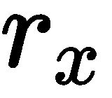

# 七、额外的元组技术

我们看到的许多示例要么是使用原子（或标量）对象的函数，要么是从小元组构建的相对简单的结构。我们经常可以利用 Python 的不可变`typing.NamedTuple`来构建复杂的数据结构。

面向对象编程的一个有益特性是能够以增量方式创建复杂的数据结构。在某些方面，对象可以被视为函数结果的缓存；这通常非常适合功能设计模式。在其他情况下，对象范例提供了属性方法，这些方法包括复杂的计算，以从对象的属性派生数据。这也很适合功能设计思想。

但是，在某些情况下，对象类定义被有状态地用于创建复杂对象。我们将研究一些替代方案，它们提供类似的特性，而不需要复杂的状态变化对象。我们可以识别有状态类定义，然后为方法函数调用的有效或必需顺序包含元属性。例如，*如果在`X.q()`之前调用`X.p()`，则结果是未定义的*不属于语言的形式主义，是类的元属性。有时，有状态类包括显式断言和错误检查的开销，以确保方法的使用顺序正确。如果我们避免使用有状态类，就可以消除这些开销。

在本章中，我们将了解以下内容：

*   我们如何使用和创造`NamedTuple`。
*   可以使用不可变`NamedTuple`代替有状态对象类的方法。
*   在任何多态类定义之外编写泛型函数的一些技术。显然，我们可以依赖`Callable`类来创建多态类层次结构。在某些情况下，这可能是功能设计中不必要的开销。

# 使用元组收集数据

在[第 3 章](03.html)、*函数、迭代器和生成器*中，我们展示了处理元组的两种常用技术。我们还暗示了第三种处理复杂结构的方法。根据具体情况，我们可以采用以下任何技术：

*   使用 lambdas（或函数）使用索引选择命名项
*   将 lambdas（或函数）与参数一起使用，将元组项分配给参数名
*   使用命名元组按属性名或索引选择项

我们在[第 4 章](04.html)*中介绍的行程数据与集合*一起使用，其结构相当复杂。数据以位置报告的普通时间序列开始。为了计算覆盖的距离，我们将数据转换成一系列腿，腿的起始位置、结束位置和距离作为嵌套的三元组。

腿序列中的每个项看起来都是三元组：

```py
first_leg = (
    (37.549016, -76.330295), 
    (37.840832, -76.273834), 
    17.7246)
```

前两项是起点和终点。第三项是点之间的距离。这是切萨皮克湾两点之间的短途旅行。

嵌套的元组可能很难读取；例如，像`first_leg[0][0]`这样的表达并不是很有信息性。

让我们看看`tuple`中选定值的三个备选方案。第一种技术涉及定义一些简单的选择函数，这些函数可以通过索引位置从`tuple`中选择项目：

```py
start = lambda leg: leg[0]
end = lambda leg: leg[1]
distance = lambda leg: leg[2]
latitude = lambda pt: pt[0]
longitude = lambda pt: pt[1]  
```

有了这些定义，我们可以使用`latitude(start(first_leg))`来引用特定的数据。它看起来像下面的代码示例：

```py
>>> latitude(start(first_leg))
29.050501
```

这些定义对涉及的数据类型没有提供太多指导。我们可以使用一个简单的命名约定来让这一点更加清楚。以下是使用后缀的选择函数的一些示例：

```py
start_point = lambda leg: leg[0]
distance_nm = lambda leg: leg[2]
latitude_value = lambda point: point[0]  
```

如果使用得当，这可能会有所帮助。它还可以退化为一个复杂的匈牙利符号，作为每个变量的前缀（或后缀）。

为 lambdas 提供类型提示很尴尬。以下说明了如何实现这一点：

```py
>>> from typing import Tuple, Callable
>>> Point = Tuple[float, float]
>>> Leg = Tuple[Point, Point, float]
>>> start: Callable[[Leg], Point] = lambda leg: leg[0]
```

类型提示作为赋值语句的一部分提供。这告诉**mypy**名为`start`的对象是一个可调用函数，它接受名为`Leg`类型的单个参数并返回`Point`类型的结果。

第二种技术使用`*parameter`符号隐藏索引位置的一些细节。以下是一些使用`*`符号的选择函数：

```py
start = lambda start, end, distance: start
end = lambda start, end, distance: end
distance = lambda start, end, distance: distance
latitude = lambda lat, lon: lat
longitude = lambda lat, lon: lon  
```

有了这些定义，我们可以使用`latitude(*start(*first_leg))`来引用特定的数据。它看起来像下面的代码示例：

```py
>>> latitude(*start(*first_leg)) 
29.050501
```

这具有函数定义清晰的优点。位置和名称之间的关联由参数名称列表给出。在这些选择函数的`tuple`参数前面看到`*`运算符可能有点奇怪。此运算符很有用，因为它将元组中的每个项映射到函数的一个参数。

虽然这些功能非常强大，但选择单个属性的语法可能会令人困惑。Python 提供了一种面向对象的替代方法，命名元组。

# 使用命名元组收集数据

将数据收集到复杂结构中的第三种技术是命名元组。其思想是创建一个元组对象以及具有命名属性的结构。有两种变体可供选择：

*   `collections`模块中的`namedtuple`功能。
*   `typing`模块中的`NamedTuple`基类。我们将只使用它，因为它允许显式类型暗示。

在上一节的示例中，我们嵌套了 namedtuple 类，如下所示：

```py
from typing import NamedTuple

class Point(NamedTuple):
    latitude: float
    longitude: float

class Leg(NamedTuple):
    start: Point
    end: Point
    distance: float
```

这会将数据结构从简单匿名元组更改为命名元组，并为每个属性提供类型提示。下面是一个例子：

```py
>>> first_leg = Leg(
... Point(29.050501, -80.651169),
... Point(27.186001, -80.139503),
... 115.1751)
>>> first_leg.start.latitude
29.050501
```

`first_leg`对象被构建为`NamedTuple`类的`Leg`子类，该类包含另外两个命名的 tuple 对象和一个 float 值。使用`first_leg.start.latitude`将从元组结构内部获取特定数据段。从前缀函数名到后缀属性名的更改可以看作是一个有用的重点。这也可以被看作是语法上令人困惑的转变。

用适当的`Leg()`或`Point()`函数调用替换简单的`tuple()`函数很重要。这将更改构建数据结构的处理。它提供了一个带有类型提示的显式命名结构，可以通过**mypy**工具进行检查。

例如，请查看以下代码片段以从源数据创建点对：

```py
from typing import Tuple, Iterator, List

def float_lat_lon_tuple(
        row_iter: Iterator[List[str]]
    ) -> Iterator[Tuple]:
    return (
        tuple(*map(float, pick_lat_lon(*row)))
        for row in row_iter
    )
```

这将在生成字符串列表的迭代器对象中进行答复。CSV 阅读器或 KML 阅读器可以实现这一点。`pick_lat_lon()`函数从行中选取两个值。`map()`函数将`float()`函数应用于拾取的值。结果变成了一个简单的元组。

前面的代码将更改为以下代码段以创建`Point`对象：

```py
def float_lat_lon(
        row_iter: Iterator[List[str]]
    ) -> Iterator[Point]:
    return (
        Point(*map(float, pick_lat_lon(*row)))
        for row in row_iter
    )
```

`tuple()`函数已替换为`Point()`构造函数。返回的数据类型修改为`Iterator[Point]`。很明显，这个函数构建的是`Point`对象，而不是浮点坐标的匿名元组。

同样，我们可以引入以下内容来构建`Leg`对象的完整行程：

```py
from typing import cast, TextIO, Tuple, Iterator, List
from Chapter_6.ch06_ex3 import row_iter_kml
from Chapter_4.ch04_ex1 import legs, haversine

source = "file:./Winter%202012-2013.kml"
def get_trip(url: str=source) -> List[Leg]:
    with urllib.request.urlopen(url) as source:
        path_iter = float_lat_lon(row_iter_kml(
            cast(TextIO, source)
        ))
        pair_iter = legs(path_iter)
        trip_iter = (
            Leg(start, end, round(haversine(start, end), 4))
            for start, end in pair_iter
        )
        trip = list(trip_iter)
    return trip
```

处理是一系列生成器表达式。`path_iter`对象使用两个生成器函数`row_iter_kml()`和`float_lat_lon()`从 KML 文件中读取行，拾取字段，并将其转换为`Point`对象。`pair_iter()`对象使用`legs()`生成器函数生成一对`Point`对象，显示每条支腿的起点和终点。

`trip_iter`生成器表达式从`Point`对象对中创建最终的`Leg`对象。`list()`函数使用这些生成的对象创建`Legs`的单个列表。使用[第 4 章](04.html)中的`haversine()`函数*处理集合*来计算距离。

 *这里使用`cast()`函数通知**mypy**工具`source`对象应该是`TextIO`实例。`cast()`功能为类型提示；它没有运行时效果。因为`urlopen()`函数被定义为`Union[HTTPResponse, addinfourl]`，所以它是必需的。`addinfourl`对象是`BinaryIO`。`csv.reader()`需要一个`List[str]`作为输入，它需要文本而不是`urlopen()`提供的字节。对于简单的 CSV 文件，字节和 UTF-8 编码文本之间的区别很小，`cast()`权宜之计起作用。

要正确处理字节，必须使用`codecs`模块将字节翻译成正确的文本。可以使用以下代码：

```py
cast(TextIO, codecs.getreader('utf-8')(cast(BinaryIO, source)))
```

最里面的表达式是一个`cast()`类型的提示，用于使`source`对象在**mypy**工具中显示为`BinaryIO`类型。`codecs.getreader()`函数定位适当的读卡器类别以处理`utf-8`编码。这个类的一个实例是使用`source`对象来创建读取器的。

结果对象是一个`StreamReader`。最外层的`cast()`函数提示**mypy**工具将`StreamReader`视为`TextIO`实例。由`codecs.getreader()`创建的读取器是将字节文件解码为正确文本的重要组成部分。其他类型为**mypy**工具的类型提示。

`trip`对象是一系列`Leg`实例。当我们尝试打印它时，它将如下所示：

```py
(Leg(start=Point(latitude=37.549016, longitude=
 -76.330295), end=Point(latitude=37.840832, longitude=
 -76.273834), distance=17.7246), 
 Leg(start=Point(latitude=37.840832, longitude=-76.273834), 
 end=Point(latitude=38.331501, longitude=-76.459503), 
 distance=30.7382),
 ...
 Leg(start=Point(latitude=38.330166, longitude=-76.458504), 
 end=Point(latitude=38.976334, longitude=-76.473503), 
 distance=38.8019))
```

It's important to note that the `haversine()` function was written to use simple tuples. We've reused this function with a `NamedTuples` class. As we carefully preserved the order of the arguments, this small change in representation was handled gracefully by Python.

在大多数情况下，`NamedTuple`功能增加了清晰度。`NamedTuple`的使用将导致从类似函数的前缀语法更改为类似对象的后缀语法。

# 使用函数构造函数构建命名元组

有三种方法可以构建`NamedTuple`实例。我们使用的技术的选择通常基于在对象构造时有多少附加信息可用。

在上一节的示例中，我们已经展示了这三种技术中的两种。我们将在这里强调设计注意事项。它包括以下选择：

*   我们可以根据其位置提供参数值。当有一个或多个我们正在计算的表达式时，这种方法效果很好。我们在将`haversine()`函数应用于`start`和`end`点以创建`Leg`对象时使用了它：

```py
Leg(start, end, round(haversine(start, end), 4))
```

*   我们可以使用`*`参数表示法根据参数在元组中的位置分配参数。当我们从另一个 iterable 或现有的元组中获取参数时，这种方法效果很好。我们在使用`map()`将`float()`函数应用于`latitude`和`longitude`值时使用了它：

```py
Point(*map(float, pick_lat_lon(*row)))  
```

*   我们可以使用显式关键字分配。虽然在上一个示例中没有使用，但我们可能会将这样的内容视为使关系更加明显的一种方式：

```py
Point(longitude=float(row[0]), latitude=float(row[1]))  
```

具有创建命名元组实例的各种方法的灵活性是很有帮助的。这使我们能够更容易地转换数据结构。我们可以强调与阅读和理解应用程序相关的数据结构特征。有时，索引编号 0 或 1 是需要强调的重要事项。其他时间，`start`、`end`和`distance`的顺序很重要。

# 使用元组族避免有状态类

在前面的几个例子中，我们展示了**包装展开**设计模式的思想，它允许我们使用匿名和命名元组。这种设计的要点是使用封装其他不可变对象的不可变对象，而不是可变实例变量。

两组数据之间相关性的常用统计度量是斯皮尔曼秩相关性。这比较了两个变量的排名。我们将比较相对顺序，而不是尝试比较可能具有不同比例的值。欲了解更多信息，请访问：[http://en.wikipedia.org/wiki/Spearman%27s_rank_correlation_coefficient](http://en.wikipedia.org/wiki/Spearman%27s_rank_correlation_coefficient) 。

计算斯皮尔曼秩相关性需要为每个观测值分配秩值。看来我们应该可以用`enumerate(sorted())`来做这件事。给定两组可能相关的数据，我们可以将每组数据转换为一系列秩值，并计算相关性度量。

我们将应用“包裹-展开”设计模式来执行此操作。为了计算相关系数，我们将`wrap`数据项及其排名。

在[第 3 章](03.html)、*函数、迭代器和生成器*中，我们展示了如何解析一个简单的数据集。我们将从该数据集中提取四个样本，如下所示：

```py
>>> from Chapter_3.ch03_ex5 import (
...     series, head_map_filter, row_iter)
>>> with open("Anscombe.txt") as source:
...     data = list(head_map_filter(row_iter(source)))
```

由此产生的数据集合在每一行中组合了四个不同的数据系列。`series()`函数将从整行中提取给定序列的对。此函数的结果是一个两元组。这是一个命名的元组更好。

以下是每对的命名元组：

```py
from typing import NamedTuple

class Pair(NamedTuple):
    x: float
    y: float
```

我们将介绍一种转换，将匿名元组转换为命名元组：

```py
from typing import Callable, List, Tuple, Iterable
RawPairIter = Iterable[Tuple[float, float]]

pairs: Callable[[RawPairIter], List[Pair]] \
    = lambda source: list(Pair(*row) for row in source)

```

`RawPairIter`类型定义描述了`series()`函数的中间输出。此函数发出两个元组的 iterable 序列。`pairs`lambda 对象是一个可调用对象，它需要一个 iterable，并将生成一个`Pair`命名元组的列表。

下面显示了如何使用`pairs()`函数和`series()`函数从原始数据创建对：

```py
>>> series_I = pairs(series(0, data))
>>> series_II = pairs(series(1, data))
>>> series_III = pairs(series(2, data))
>>> series_IV = pairs(series(3, data))
```

这些系列中的每一个都是`Pair`对象的`list`。每个`Pair`对象都有`x`和`y`属性。数据如下：

```py
[Pair(x=10.0, y=8.04), 
 Pair(x=8.0, y=6.95), 
 ..., 
 Pair(x=5.0, y=5.68)]
```

对于排名，有助于使用排名和原始`Pair`定义一个复合对象。此两元组的类型定义如下所示：

```py
from typing import Tuple
RankedPair = Tuple[int, Pair]
```

`Pair`定义是前面定义的命名元组。`RankedPair`是由整数和`Pair`对象组成的两元组的类型别名。

下面是一个生成器函数，它将`Pairs`的一个 iterable 集合转换为`RankedPairs`：

```py
from typing import Iterable, Iterator
def rank_y(pairs: Iterable[Pair]) -> Iterator[RankedPair]:
    return enumerate(sorted(pairs, key=lambda p: p.y))
```

这将应用`enumerate()`函数在`RankedPair`对象上创建迭代器。顺序基于`Pair`对象的 y 属性。每个`Pair`都被包装在一个两元组中，包含秩和原始对象。

在下面的例子中，这个想法有一个更复杂的变化：

```py
Rank2Pair = Tuple[int, RankedPair]
def rank_x(
        ranked_pairs: Iterable[RankedPair]
    ) -> Iterator[Rank2Pair]:
    return enumerate(
        sorted(ranked_pairs, key=lambda rank: rank[1].x)
    )
```

这将包装每个`RankedPair`对象以创建一个新的`Rank2Pair`对象。这个二次包装创建了包含两个元组的两个元组。这个复杂的结构说明了为什么使用类型别名提供有关正在处理的数据类型的提示会很有帮助。

`y_rank = list(rank_y(series_I))`的结果如下：

```py
[(0, Pair(x=8.0, y=5.25)), 
 (1, Pair(x=8.0, y=5.56)), 
 ..., 
 (10, Pair(x=19.0, y=12.5))
] 
```

为了执行关联，有必要应用`rank_x()`函数和`rank_y()`函数。`xy_rank = list(rank_x(y_rank))`的值将是深度嵌套对象的列表，例如：

```py
[(0, (0, Pair(x=4.0, y=4.26))), 
 (1, (2, Pair(x=5.0, y=5.68))), 
 ..., 
 (10, (9, Pair(x=14.0, y=9.96)))
] 
```

现在可以使用*x*和*y*排名，而不是`Pair`对象中的原始值来计算两个变量之间的排名顺序相关性。

提取这两个排名需要两个复杂的表达式。对于数据集中的每个排名样本`r`，我们必须将`r[0]`与`r[1][0]`进行比较。这些是“展开”函数，用于撤消以前完成的包装。这些有时被称为**选择器函数**，因为它们从复杂结构的中间选择项目。

为了克服对`r[0]`和`r[1][0]`的笨拙引用，我们可以编写如下选择器函数：

```py
x_rank = lambda ranked: ranked[0]
y_rank = lambda ranked: ranked[1][0]
raw = lambda ranked: ranked[1][1]
```

这使得我们可以使用`x_rank(r)`和`y_rank(r)`计算相关性，从而减少对值的引用。

总体策略包括两个操作：包装和展开。`rank_x()`和`rank_y()`函数包装`Pair`对象，创建具有排名和原始值的新元组。我们避免了使用有状态类定义来增量创建复杂的数据结构。

为什么要创建深度嵌套的元组？答案很简单：懒惰。打开`tuple`包并构建新的平面`tuple`所需的处理非常耗时。现有的`tuple`中`wrapping`涉及的处理较少。使用更平坦的结构可以使后续处理更加清晰。这导致了我们想要做的两个改进；详情如下:

*   我们想要一个更平坦的数据结构。对`rank_x()`和`rank_y()`使用类型提示显示了这种复杂性。一个迭代`Tuple[int, Pair]`，另一个迭代`Tuple[int, RankedPair]`。
*   `enumerate()`函数不能正确处理领带。如果两个观测值相同，它们应该得到相同的秩。一般规则是平均相等观测的位置。序列`[0.8, 1.2, 1.2, 2.3, 18]`的秩值应为`1, 2.5, 2.5, 4`。位置 2 和位置 3 的两条领带的中点值为`2.5`作为其共同等级。

我们将通过编写一个更智能的秩函数来仔细研究这两种优化。

# 分配统计等级

我们将把秩排序问题分成两部分。首先，我们将研究一个通用的高阶函数，我们可以使用它为`Pair`对象的*x*或*y*值分配列组。然后，我们将使用它在`Pair`对象周围创建一个`wrapper`，其中包括*x*和*y*排名。这将避免深层嵌套结构。

以下函数将为数据集中的每个观测值创建排名顺序：

```py
from typing import Callable, Tuple, List, TypeVar, cast, Dict
D_ = TypeVar("D_")
K_ = TypeVar("K_")
def rank(
        data: Iterable[D_],
        key: Callable[[D_], K_]=lambda obj: cast(K_, obj)
    ) -> Iterator[Tuple[float, D_]]:

    def build_duplicates(
            duplicates: Dict[K_, List[D_]],
            data_iter: Iterator[D_],
            key: Callable[[D_], K_]
        ) -> Dict[K_, List[D_]]:
        for item in data_iter:
            duplicates[key(item)].append(item)
        return duplicates

    def rank_output(
            duplicates: Dict[K_, List[D_]],
            key_iter: Iterator[K_],
            base: int=0
        ) -> Iterator[Tuple[float, D_]]:
        for k in key_iter:
            dups = len(duplicates[k])
            for value in duplicates[k]:
                yield (base+1+base+dups)/2, value
            base += dups

    duplicates = build_duplicates(
        defaultdict(list), iter(data), key)
    return rank_output(duplicates, iter(sorted(duplicates)), 0)
```

此秩排序函数有两个内部函数，用于将项目列表转换为具有秩和原始项目的两个元组的列表。第一步是`build_duplicates()`函数，它创建一个字典`duplicates`，将每个键值映射到共享该值的项目序列。第二步是`rank_output()`函数，它根据 duplicates 字典发出两个元组的序列。

为了澄清这些关系，使用了两种类型变量。`D_`类型变量表示原始数据类型。例如，这可能是一个`Leg`对象，或任何其他复杂对象。`K_`类型变量是用于排序的键。这可以是一种不同的类型，例如，从给定的名为“T4”的元组中提取的“T3”距离值。给定的键函数执行从数据项到键项的转换，类型提示为`Callable[[D_], K_]`。

`build_duplicates()`函数使用有状态对象来构建将键映射到值的字典。这种实现依赖于递归算法的尾部调用优化。`build_duplicates()`的参数将内部状态作为参数值公开。递归的基本情况是当`data_iter`为空，而`base`为零时。这些变量对于迭代版本不是必需的，但它们有助于可视化递归的外观。

类似地，`rank_output()`函数可以递归定义，以将原始值集合作为具有指定秩值的两个元组发出。这里显示的是一个优化版本，有两个嵌套的`for`循环。为了使秩值计算明确，它包括范围的低端（`base+1`），范围的高端（`base+dups`），并计算这两个值的中点。如果只有一个`duplicate`，则秩值为`(2*base+2)/2`，这具有作为一般解决方案的优点。

重复项字典具有类型提示`Dict[K_, List[D_]]`，因为它将计算出的密钥类型`K_`映射到原始数据项类型`List[D_]`的列表。这会出现几次，适当的类型变量将适合强调公共类型的重用。

下面是我们如何测试它以确保它工作的。第一个示例对各个值进行排序。第二个示例对一个对列表进行排序，使用 lambda 从每个对中拾取键值：

```py
>>> list(rank([0.8, 1.2, 1.2, 2.3, 18]))
[(1.0, 0.8), (2.5, 1.2), (2.5, 1.2), (4.0, 2.3), (5.0, 18)]
>>> data= [(2, 0.8), (3, 1.2), (5, 1.2), (7, 2.3), (11, 18)]
>>> list(rank(data, key=lambda x:x[1]))
[(1.0, (2, 0.8)), 
 (2.5, (3, 1.2)), 
 (2.5, (5, 1.2)), 
 (4.0, (7, 2.3)), 
 (5.0, (11, 18))]
```

样本数据包括两个相同的值。结果将拆分位置 2 和 3 进行排序，以将位置`2.5`分配给这两个值。这是计算两组值之间斯皮尔曼秩序相关性的常用统计方法。

The `rank()` function involves rearranging the input data as part of discovering duplicated values. If we want to rank on both the `x` and `y` values in each pair, we need to reorder the data twice.

# 包装而不是状态更改

我们有两种一般的包装策略；详情如下:

*   **并行**：我们可以创建数据的两个副本，并对每个副本进行排序。然后，我们需要将这两个副本重新组合成包含两个排名的最终结果。这可能有点尴尬，因为我们需要以某种方式合并两个可能顺序不同的序列。
*   **Serialism**：我们可以计算一个变量的秩，并将结果保存为包含原始数据的包装器。然后，我们可以在另一个变量上对包装好的数据进行排序。虽然这可以创建一个复杂的结构，但我们可以稍微优化它，为最终结果创建一个更平坦的包装。

下面是我们如何创建一个对象，该对象根据`y`值以秩顺序包装一对：

```py
from typing import NamedTuple
class Ranked_Y(NamedTuple):
    r_y: float
    raw: Pair

def rank_y(pairs: Iterable[Pair]) -> Iterable[Ranked_Y]:
    return (
        Ranked_Y(rank, data) 
        for rank, data in rank(pairs, lambda pair: pair.y)
    )
```

我们定义了一个`NamedTuple`子类`Rank_Y`，它包含`y`排名加上原始的`raw`值。我们的`rank_y()`函数将通过使用 lambda 应用`rank()`函数来创建该元组的实例，lambda 选择每个`pairs`对象的`y`值。然后，我们创建了结果两个元组的实例。

我们的想法是，我们可以提供以下输入：

```py
>>> data = (Pair(x=10.0, y=8.04), 
...   Pair(x=8.0, y=6.95),
...   Pair(x=13.0, y=7.58), 
etc.
...    Pair(x=5.0, y=5.68))
```

我们可以得到以下输出：

```py
>>> list(rank_y(data))
[Ranked_Y(r_y=1.0, raw=Pair(x=4.0, y=4.26)),
 Ranked_Y(r_y=2.0, raw=Pair(x=7.0, y=4.82)),
 Ranked_Y(r_y=3.0, raw=Pair(x=5.0, y=5.68)),
etc.
 Ranked_Y(r_y=11.0, raw=Pair(x=12.0, y=10.84))]
```

原始的`Pair`对象已被包装，以创建一个新的`Ranked_Y`对象，该对象包含等级。这不是我们所需要的全部；我们需要再包装一次，以创建一个同时具有`x`和`y`等级信息的对象。

# 重写而不是状态更改

我们可以使用名为`Ranked_XY`的`NamedTuple`子类，它包含两个属性：`r_x`和`ranked_y`。`ranked_y`属性是`Ranked_Y`的一个实例，它有两个属性：`r_y`和`raw`。虽然这很容易构建，但是生成的对象很烦人，因为`r_x`和`r_y`值不是平面结构中的简单对等点。我们将介绍一个稍微复杂一点的包装过程，它会产生稍微简单一点的结果。

我们希望输出是这样定义的类的实例：

```py
class Ranked_XY(NamedTuple):
    r_x: float
    r_y: float
    raw: Pair
```

我们将创建一个具有多个对等属性的平面`NamedTuple`。这种扩展通常比深层嵌套结构更容易使用。在某些应用程序中，我们可能有许多转换。对于这个应用程序，我们只有两个转换-**x 排名**和**y 排名**。我们将把它分成两个步骤。首先，我们将看到一个简单的包装，如前面所示，然后是一个更通用的展开-重写。

以下是`x-y`排名如何建立在 y 排名的基础上：

```py
def rank_xy(pairs: Sequence[Pair]) -> Iterator[Ranked_XY]:
    return (
        Ranked_XY(
            r_x=r_x, r_y=rank_y_raw[0], raw=rank_y_raw[1])
        for r_x, rank_y_raw in 
            rank(rank_y(pairs), lambda r: r.raw.x)
    )
```

我们已经使用了`rank_y()`函数来构建`Rank_Y`对象。然后，我们将`rank()`函数应用于这些对象，按照原始`x`值对它们进行排序。第二个秩函数的结果将是两个元组，分别具有`(0)`和`x`秩，`(1)`和`Rank_Y`对象。我们从`x`排名（`r_x)`、`y`排名（`rank_y_raw[0]`）和原始对象（`rank_y_raw[1]`）构建一个`Ranked_XY`对象。

我们在第二个函数中展示的是一种向`tuple`添加数据的更通用方法。`Ranked_XY`对象的构造展示了如何从数据中展开值并重新包装以创建第二个更完整的结构。这种方法通常可用于向`tuple`引入新变量。

以下是一些示例数据：

```py
>>> data = (Pair(x=10.0, y=8.04), Pair(x=8.0, y=6.95),
... Pair(x=13.0, y=7.58), Pair(x=9.0, y=8.81),
*etc.*
... Pair(x=5.0, y=5.68))
```

这允许我们按如下方式创建排名对象：

```py
>>> list(rank_xy(data))
[Ranked_XY(r_x=1.0, r_y=1.0, raw=Pair(x=4.0, y=4.26)),
 Ranked_XY(r_x=2.0, r_y=3.0, raw=Pair(x=5.0, y=5.68)),
 Ranked_XY(r_x=3.0, r_y=5.0, raw=Pair(x=6.0, y=7.24)),
*etc.*
 Ranked_XY(r_x=11.0, r_y=10.0, raw=Pair(x=14.0, y=9.96))]
```

一旦我们获得了具有适当的`x`和`y`排名的数据，我们就可以计算斯皮尔曼排名顺序相关值。我们可以根据原始数据计算皮尔逊相关性。

我们的多重排序方法包括分解一个`tuple`并使用我们需要的附加属性构建一个新的、扁平的`tuple`。当从源数据计算多个派生值时，我们通常需要这种设计。

# 计算斯皮尔曼秩序相关

斯皮尔曼排名顺序相关性是两个变量排名之间的比较。它巧妙地绕过了值的大小，并且它通常可以找到相关性，即使关系不是线性的。公式如下：


这个公式告诉我们，我们将对所有观测值对的秩和的差异求和。Python 版本取决于`sum()`和`len()`函数，如下所示：

```py
def rank_corr(pairs: Sequence[Pair]) -> float:
    ranked = rank_xy(pairs)
    sum_d_2 = sum((r.r_x - r.r_y)**2 for r in ranked)
    n = len(pairs)
    return 1-6*sum_d_2/(n*(n**2-1))
```

我们已经为每个`Pair`对象创建了`Rank_XY`对象。鉴于此，我们可以从这些对中减去`r_x`和`r_y`值来比较它们的差异。然后，我们可以对差异进行平方和运算。

一篇关于统计的好文章将为系数的含义提供详细的指导。`0`附近的值表示两个系列数据点的数据秩之间没有相关性。散点图显示点的随机散射。`+1`或`-1`附近的值表示这两个值之间存在很强的关系。成对的图形将显示一条清晰的直线或简单的曲线。

以下是基于 Anscombe 的四重奏系列的示例：

```py
>>> data = (Pair(x=10.0, y=8.04), Pair(x=8.0, y=6.95),
... Pair(x=13.0, y=7.58), Pair(x=9.0, y=8.81),
... Pair(x=11.0, y=8.33), Pair(x=14.0, y=9.96),
... Pair(x=6.0, y=7.24), Pair(x=4.0, y=4.26),
... Pair(x=12.0, y=10.84), Pair(x=7.0, y=4.82),
... Pair(x=5.0, y=5.68))
>>> round(pearson_corr( data ), 3)
0.816
```

对于这个特定的数据集，相关性很强。

在[第 4 章](04.html)*与集合*的合作中，我们展示了如何计算皮尔逊相关系数。我们展示的函数`corr()`处理两个独立的值序列。我们可以将其用于我们的`Pair`对象序列，如下所示：

```py
import Chapter_4.ch04_ex4
def pearson_corr(pairs: Sequence[Pair]) -> float:
    X = tuple(p.x for p in pairs)
    Y = tuple(p.y for p in pairs)
    return ch04_ex4.corr(X, Y)
```

我们已经展开了`Pair`对象，以获得可用于现有`corr()`函数的原始值。这提供了不同的相关系数。皮尔逊值基于两个序列之间标准化值的比较情况。对于许多数据集，皮尔逊和斯皮尔曼相关性之间的差异相对较小。然而，对于某些数据集，差异可能相当大。

为了了解使用多种统计工具进行探索性数据分析的重要性，比较 Anscombe 四重奏中四组数据的 Spearman 和 Pearson 相关性。

# 多态性与类型模式匹配

一些函数式编程语言提供了一些巧妙的方法来解决使用静态类型函数定义的问题。问题是，我们想要编写的许多函数在数据类型方面是完全通用的。例如，我们的大多数统计函数对于`int`或`float`数字是相同的，只要除法返回的值是`numbers.Real`的子类（例如`Decimal`、`Fraction`或`float`）。在许多函数式语言中，编译器使用复杂的类型或类型模式匹配规则使单个泛型定义适用于多个数据类型。Python 没有这个问题，也不需要模式匹配。

Python 极大地改变了这种方法，而不是（可能）静态类型函数语言的复杂特性。Python 根据所使用的数据类型动态选择操作符的最终实现。在 Python 中，我们总是编写泛型定义。代码没有绑定到任何特定的数据类型。Python 运行时将根据实际使用对象的类型定位适当的操作。语言参考手册的*3.3.7 强制规则*部分和库中的`numbers`模块提供了从操作到特殊方法名称映射的详细信息。

这意味着编译器不会证明我们的函数期望并生成正确的数据类型。我们通常依靠单元测试和**mypy**工具进行此类类型检查。

在极少数情况下，我们可能需要根据数据元素的类型有不同的行为。我们有两种方法来解决这个问题：

*   我们可以使用`isinstance()`功能来区分不同的情况
*   我们可以创建自己的子类`numbers.Number`或`NamedTuple`，并实现适当的多态特殊方法名。

在某些情况下，我们实际上需要同时执行这两种操作，以便为每个操作包含适当的数据类型转换。此外，我们还需要使用`cast()`函数将类型显式化为**mypy**工具。

上一节中的排名示例与将排名顺序应用于简单对的思想紧密相连。虽然这是斯皮尔曼相关性的定义方式，但多元数据集需要在所有变量之间进行秩序相关性。

我们需要做的第一件事是推广秩序信息的概念。以下是处理列组的`tuple`和`raw`数据对象的`NamedTuple`值：

```py
from typing import NamedTuple, Tuple, Any
class Rank_Data(NamedTuple):
    rank_seq: Tuple[float]
    raw: Any
```

此类类定义的典型用法如下例所示：

```py
 >>> data = {'key1': 1, 'key2': 2}
 >>> r = Rank_Data((2, 7), data)
 >>> r.rank_seq[0]
 2
 >>> r.raw
 {'key1': 1, 'key2': 2}
```

本例中的原始数据行是一个字典。在整个列表中，这个特定项目有两个排名。应用程序可以获得排名顺序以及原始数据项。

我们将在排名函数中添加一些语法糖。在前面的许多示例中，我们需要一个 iterable 或具体的集合。`for`这句话对于与任何一方合作都很优雅。但是，我们并不总是使用`for`语句，对于某些函数，我们必须显式地使用`iter()`从集合中生成`iterable`。我们可以通过一个简单的`isinstance()`检查来处理这种情况，如下代码片段所示：

```py
def some_function(seq_or_iter: Union[Sequence, Iterator]):
    if isinstance(seq_or_iter, Sequence):
        yield from some_function(iter(seq_or_iter), key)
        return
    # Do the real work of the function using the Iterator
```

此示例包括一个类型检查，用于处理`Sequence`对象和`Iterator`对象之间的微小差异。具体来说，函数使用`iter()`从`Sequence`创建`Iterator`，并使用派生值递归调用自身。

对于排名排序，支持`Union[Sequence, Iterator]`。因为源数据必须进行排序，所以更容易使用`list()`将给定的迭代器转换为具体的序列。将使用基本的`isinstance()`检查，但以下示例将从迭代器创建序列对象，而不是从序列创建迭代器（如前所示）。

在我们的秩排序函数的上下文中，我们可以使该函数更加通用。以下两个表达式定义了输入：

```py
Source = Union[Rank_Data, Any]
Union[Sequence[Source], Iterator[Source]]
```

这两种类型定义了四种组合：

*   `Sequence[Rank_Data]`
*   `Sequence[Any]`
*   `Iterator[Rank_Data]`
*   `Iterator[Any]`

以下是处理四种数据类型组合的三种情况的`rank_data()`函数：

```py
from typing import (
    Callable, Sequence, Iterator, Union, Iterable, 
    TypeVar, cast, Union
)
K_ = TypeVar("K_") # Some comparable key type used for ranking.
Source = Union[Rank_Data, Any] 
def rank_data(
        seq_or_iter: Union[Sequence[Source], Iterator[Source]],
        key: Callable[[Rank_Data], K_] = lambda obj: cast(K_, obj)
    ) -> Iterable[Rank_Data]:

    if isinstance(seq_or_iter, Iterator):
        # Iterator? Materialize a sequence object
        yield from rank_data(list(seq_or_iter), key)
        return

    data: Sequence[Rank_Data]
    if isinstance(seq_or_iter[0], Rank_Data):
        # Collection of Rank_Data is what we prefer.
        data = seq_or_iter
    else:
        # Convert to Rank_Data and process.
        empty_ranks: Tuple[float] = cast(Tuple[float], ())
        data = list(
            Rank_Data(empty_ranks, raw_data)
            for raw_data in cast(Sequence[Source], seq_or_iter)
        )

    for r, rd in rerank(data, key):
        new_ranks = cast(
            Tuple[float], 
            rd.rank_seq + cast(Tuple[float], (r,)))
        yield Rank_Data(new_ranks, rd.raw)
```

我们将排名分解为三种情况，以涵盖四种不同类型的数据。以下是工会联盟定义的情况：

*   给定一个`Iterator`（一个没有可用`__getitem__()`方法的对象），我们将具体化一个要处理的`list`对象。这将适用于`Rank_Data`以及任何其他原始数据类型。本案例涵盖了`Iterator[Rank_Data]`和`Iterator[Any]`对象。
*   给定一个`Sequence[Any]`，我们将未知对象包装成`Rank_Data`元组，其中包含一个空的排名集合，以创建一个`Sequence[Rank_Data]`。
*   最后，给定一个`Sequence[Rank_Data]`，在每个`Rank_Data`容器内的列组元组中添加另一个列组。

第一个案例递归调用`rank_data()`。另外两种情况都依赖于一个`rerank()`函数，该函数构建了一个新的`Rank_Data`元组，其中包含额外的排名值。这包含了一些原始数据值复杂记录的排名。

请注意，需要一个相对复杂的`cast()`表达式来消除使用泛型元组进行排名的歧义。**mypy**工具提供了一个`reveal_type()`函数，可以合并该函数来调试推断的类型。

`rerank()`功能的设计与前面显示的`rank()`功能的示例略有不同。它生成两个具有秩和原始数据对象的元组：

```py
def rerank(
        rank_data_iter: Iterable[Rank_Data],
        key: Callable[[Rank_Data], K_]
    ) -> Iterator[Tuple[float, Rank_Data]]:
    sorted_iter = iter(
        sorted(
            rank_data_iter, key=lambda obj: key(obj.raw)
        )
    )
    # Apply ranker to head, *tail = sorted(rank_data_iter)
    head = next(sorted_iter)
    yield from ranker(sorted_iter, 0, [head], key)
```

`rerank()`背后的思想是对`Rank_Data`对象集合进行排序。第一项`head`用于向`ranker()`函数提供种子值。`ranker()`函数可以检查 iterable 中的剩余项，查看它们是否匹配此初始值，这允许为一批匹配项计算适当的排名。

`ranker()`函数接受已排序的数据、基本秩编号和最小秩项的初始集合。结果是一个由两个元组组成的 iterable 序列，具有一个秩编号和一个相关的`Rank_Data`对象：

```py
def ranker(
        sorted_iter: Iterator[Rank_Data],
        base: float,
        same_rank_seq: List[Rank_Data],
        key: Callable[[Rank_Data], K_]
    ) -> Iterator[Tuple[float, Rank_Data]]:
    try:
        value = next(sorted_iter)
    except StopIteration:
        dups = len(same_rank_seq)
        yield from yield_sequence(
           (base+1+base+dups)/2, iter(same_rank_seq))
        return
    if key(value.raw) == key(same_rank_seq[0].raw):
        yield from ranker(
            sorted_iter, base, same_rank_seq+[value], key)
    else:
        dups = len(same_rank_seq)
        yield from yield_sequence(
            (base+1+base+dups)/2, iter(same_rank_seq))
        yield from ranker(
            sorted_iter, base+dups, [value], key)  
```

首先，尝试从已排序的`Rank_Data`项的`sorted_iter`集合中提取下一项。如果此操作失败并出现`StopIteration`异常，则没有下一项，源已耗尽。最终输出是`same_rank_seq`序列中的最后一批等值项。

如果序列有下一项，`key()`函数提取键值。如果此新值与`same_rank_seq`集合中的键匹配，则累积到当前一批相同值的键中。最终结果基于`sorted_iter`中的其余项目、排名的当前值、更大一批`same_rank`项目（现在包括`head`值）和原始`key()`功能。

如果下一个项的键与当前一批等值项不匹配，则最终结果有两部分。第一部分为`same_rank_seq`累计的等额项目批次。这之后是对其余已排序项目的重新排序。这些项的基值按等值项的数量递增，用 distinct 键初始化一批新的等额项，并提供原始的`key()`提取功能。

`ranker()`的输出取决于`yield_sequence()`功能，如下所示：

```py
def yield_sequence(
        rank: float,
        same_rank_iter: Iterator[Rank_Data]
    ) -> Iterator[Tuple[float, Rank_Data]]:
    head = next(same_rank_iter)
    yield rank, head
    yield from yield_sequence(rank, same_rank_iter)
```

我们以一种强调递归定义的方式编写了本文。对于任何实际工作，都应该将其优化为一个`for`语句。

When doing Tail-Call Optimization to transform a recursion into a loop define unit test cases first. Be sure the recursion passes the unit test cases before optimizing.

以下是使用此函数对数据进行排序（和重新排序）的一些示例。我们将从一个简单的标量值集合开始：

```py
>>> scalars= [0.8, 1.2, 1.2, 2.3, 18]
>>> list(rank_data(scalars))
[Rank_Data(rank_seq=(1.0,), raw=0.8), 
 Rank_Data(rank_seq=(2.5,), raw=1.2),
 Rank_Data(rank_seq=(2.5,), raw=1.2), 
 Rank_Data(rank_seq=(4.0,), raw=2.3),
 Rank_Data(rank_seq=(5.0,), raw=18)]
```

每个值都成为`Rank_Data`对象的`raw`属性。

当我们处理稍微复杂一点的对象时，我们也可以有多个排名。以下是两个元组的序列：

```py
 >>> pairs = ((2, 0.8), (3, 1.2), (5, 1.2), (7, 2.3), (11, 18))
 >>> rank_x = list(rank_data(pairs, key=lambda x:x[0]))
 >>> rank_x
 [Rank_Data(rank_seq=(1.0,), raw=(2, 0.8)),
 Rank_Data(rank_seq=(2.0,), raw=(3, 1.2)),
 Rank_Data(rank_seq=(3.0,), raw=(5, 1.2)),
 Rank_Data(rank_seq=(4.0,), raw=(7, 2.3)),
 Rank_Data(rank_seq=(5.0,), raw=(11, 18))]

 >>> rank_xy = list(rank_data(rank_x, key=lambda x:x[1] ))
 >>> rank_xy
 [Rank_Data(rank_seq=(1.0, 1.0), raw=(2, 0.8)),
 Rank_Data(rank_seq=(2.0, 2.5), raw=(3, 1.2)),
 Rank_Data(rank_seq=(3.0, 2.5), raw=(5, 1.2)),
 Rank_Data(rank_seq=(4.0, 4.0), raw=(7, 2.3)),
 Rank_Data(rank_seq=(5.0, 5.0), raw=(11, 18))]
```

在这里，我们定义了一组对。然后，我们对两个元组进行排序，将`Rank_Data`对象的序列分配给`rank_x`变量。然后，我们对`Rank_Data`对象集合进行排序，创建第二个排序值，并将结果分配给`rank_xy`变量。

结果序列可用于稍微修改的`rank_corr()`函数，以计算`Rank_Data`对象的`rank_seq`属性中任何可用值的秩相关性。我们将此修改留给读者作为练习。

# 总结

在本章中，我们研究了使用`NamedTuple`对象实现更复杂数据结构的不同方法。`NamedTuple`的基本特征与功能设计非常匹配。它们可以通过创建功能创建，并通过位置和名称访问。

我们研究了如何使用不可变的`NamedTuple`对象而不是有状态的对象定义。替换状态更改的核心技术是将对象包装成更大的`tuple`对象。

我们还研究了在 Python 中处理多种数据类型的方法。对于大多数算术运算，Python 的内部方法分派会找到正确的实现。然而，要处理集合，我们可能需要稍微不同地处理迭代器和序列。

在接下来的两章中，我们将介绍`itertools`模块。这个库模块提供了许多函数，帮助我们以复杂的方式使用迭代器。其中许多工具都是高阶函数的示例。它们有助于使功能设计保持简洁和富有表现力。*