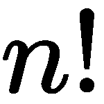
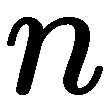

# 九、更多`itertools`技术

函数式编程强调无状态编程。在 Python 中，这将引导我们使用生成器表达式、生成器函数和 iterables。在本章中，我们将继续研究 itertools 库，它具有许多功能来帮助我们处理 iterable 集合。

在前一章中，我们研究了三大类迭代器函数。详情如下:

*   使用无限迭代器的函数，可以应用于任何 iterable 或任何集合上的迭代器；它们将消耗整个资源
*   使用有限迭代器的函数，该迭代器可以多次累加源，也可以减少源
*   `tee()`迭代器函数，它将迭代器克隆为多个副本，每个副本都可以独立使用

在本章中，我们将介绍使用置换和组合的 itertools 函数。其中包括一些函数和基于这些函数的一些配方。功能如下：

*   `product()`：此函数形成一个笛卡尔积，相当于嵌套的`for`循环
*   `permutations()`：此函数以所有可能的顺序从宇宙*p*发出长度为*r*的元组；没有重复的元素
*   `combinations()`：此函数从宇宙*p*中按排序顺序发出长度为*r*的元组；没有重复的元素
*   `combinations_with_replacement()`：此函数从*p*按排序顺序发出长度为*r*的元组，元素重复

这些函数包含了迭代来自小输入数据集合的潜在大结果集的算法。有些问题的精确解是基于穷尽地列举一个可能巨大的置换宇宙。这些函数使得发出大量排列变得简单；在某些情况下，简单性实际上并不是最优的。

# 笛卡尔积的计数

术语**笛卡尔积**指的是枚举从多个集合中提取的元素的所有可能组合的想法。

从数学上讲，我们可以说两组的乘积有 52 对，如下所示：

```py
{(1, C), (1, D), (1, H), (1, S), 
 (2, C), (2, D), (2, H), (2, S), 
..., 
 (13, C), (13, D), (13, H), (13, S)}
```

我们可以通过执行以下命令来产生上述结果：

```py
>>> list(product(range(1, 14), '♣♦♥♠'))
[(1, '♣'), (1, '♦'), (1, '♥'), (1, '♠'), 
 (2, '♣'), (2, '♦'), (2, '♥'), (2, '♠'),
... 
 (13, '♣'), (13, '♦'), (13, '♥'), (13, '♠')]
```

乘积的计算可以扩展到任意数量的 iterable 集合。使用大量集合可能导致非常大的结果集。

# 减少产品

在关系数据库理论中，表之间的连接可以看作是一种过滤产品。SQL`SELECT`语句连接没有`WHERE`子句的表，将生成表中行的笛卡尔乘积。这可以被认为是最坏情况下的算法——一种不需要任何筛选来选择正确结果的产品。我们可以使用 itertools`product()`函数来实现这一点，以枚举所有可能的组合，并过滤这些组合，以保持少数正确匹配的组合。

我们可以定义一个`join()`函数来连接两个 iterable 集合或生成器，如下命令所示：

```py
JT_ = TypeVar("JT_")
def join(
        t1: Iterable[JT_],
        t2: Iterable[JT_],
        where: Callable[[Tuple[JT_, JT_]], bool]
    ) -> Iterable[Tuple[JT_, JT_]]:
    return filter(where, product(t1, t2))
```

计算两个可比项`t1`和`t2`的所有组合。`filter()`函数将应用给定的`where()`函数传递或拒绝两个正确匹配的元组，提示为`Tuple[JT_, JT_]`。`where()`函数具有提示`Callable[[Tuple[JT_, JT_]], bool]`以显示它返回布尔结果。这是 SQL 数据库查询在最坏情况下的典型工作方式，在这种情况下，没有有用的索引或基数统计信息来建议更好的算法。

虽然这种算法总是有效的，但它的效率非常低。我们经常需要仔细研究问题和可用数据，以找到更有效的算法。

首先，我们将通过替换简单的布尔匹配函数来稍微概括这个问题。与二进制结果不同，通常是在项目之间寻找最小或最大距离。在这种情况下，比较将产生一个浮点值。

假设我们有一个`Color`对象表，如下所示：

```py
from typing import NamedTuple
class Color(NamedTuple):
    rgb: Tuple[int, int, int]
    name: str

[Color(rgb=(239, 222, 205), name='Almond'), 
 Color(rgb=(255, 255, 153), name='Canary'), 
 Color(rgb=(28, 172, 120), name='Green'),...
 Color(rgb=(255, 174, 66), name='Yellow Orange')]
```

有关更多信息，请参见[第 6 章](06.html)、*递归和归约*，其中我们向您展示了如何解析颜色文件以创建`NamedTuple`对象。在本例中，我们将 RGB 保留为`Tuple[int, int, int]`，而不是分解每个字段。

图像将具有像素集合：

```py
pixels = [(r, g, b), (r, g, b), (r, g, b), ...]
```

实际上，**Python 图像库**（**PIL**包）以多种形式呈现像素。其中之一是从（*x*、*y*坐标到 RGB 三元组的映射。有关枕头项目文件，请访问[https://pypi.python.org/pypi/Pillow](https://pypi.python.org/pypi/Pillow) 。

给定一个`PIL.Image`对象，我们可以使用如下命令迭代像素集合：

```py
from PIL import Image
from typing import Iterator, Tuple
Point = Tuple[int, int]
RGB = Tuple[int, int, int]
Pixel = Tuple[Point, RGB]
def pixel_iter(img: Image) -> Iterator[Pixel]:
    w, h = img.size
    return (
        (c, img.getpixel(c))
        for c in product(range(w), range(h))
    )
```

我们已经根据图像大小`img.size`确定了每个坐标的范围。`product(range(w), range(h))`方法的计算创建了所有可能的坐标组合。实际上，它是两个嵌套的`for`循环。

这样做的优点是可以枚举每个像素及其坐标。然后，我们可以不按特定顺序处理像素，仍然可以重建图像。当使用多处理或多线程在多个内核或处理器之间分配工作负载时，这尤其方便。`concurrent.futures`模块提供了一种在内核或处理器之间分配工作的简单方法。

# 计算距离

许多决策问题要求我们找到一个足够接近的匹配项。我们可能无法使用简单的平等性测试。相反，我们必须使用距离度量，并找到距离目标最短的项目。对于文本，我们可以使用*Levenshtein 距离*；这显示了从给定的文本块到我们的目标需要进行多少更改。

我们将使用一个稍微简单的示例。这将涉及非常简单的数学。然而，即使它很简单，如果我们天真地处理它，它也不会很好地工作。

在进行颜色匹配时，我们不会进行简单的相等性测试。我们很少能够检查像素颜色是否完全相等。我们经常被迫定义一个最小距离函数来确定两种颜色是否足够接近，而不是相同的三个值**R**、**G**和**B**。有几种常见的方法，包括欧几里德距离、曼哈顿距离和其他基于视觉偏好的复杂权重。

以下是欧几里德距离函数和曼哈顿距离函数：

```py
import math
def euclidean(pixel: RGB, color: Color) -> float:
    return math.sqrt(
        sum(map(
            lambda x, y: (x-y)**2,
            pixel,
            color.rgb)
        )
    )

def manhattan(pixel: RGB, color: Color) -> float:
    return sum(map(
        lambda x, y: abs(x-y),
        pixel,
        color.rgb)
    )
```

**欧几里德距离**测量 RGB 空间中三个点之间直角三角形的斜边。**曼哈顿距离**将三个点之间直角三角形的每条边相加。欧几里德距离提供了精确性，而曼哈顿距离提供了计算速度。

展望未来，我们的目标是一个这样的结构。对于每个单独的像素，我们可以计算从该像素的颜色到有限颜色集中可用颜色的距离。单个像素的计算结果可能如下所示：

```py
(
 ((0, 0), (92, 139, 195), Color(rgb=(239, 222, 205), name='Almond'), 169.10943202553784), 
 ((0, 0), (92, 139, 195), Color(rgb=(255, 255, 153), name='Canary'), 204.42357985320578), 
 ((0, 0), (92, 139, 195), Color(rgb=(28, 172, 120), name='Green'),  103.97114984456024), 
 ((0, 0), (92, 139, 195), Color(rgb=(48, 186, 143), name='Mountain Meadow'), 82.75868534480233), 
 ((0, 0), (92, 139, 195), Color(rgb=(255, 73, 108), name='Radical Red'), 196.19887869200477), 
 ((0, 0), (92, 139, 195), Color(rgb=(253, 94, 83), 
 name='Sunset Orange'), 201.2212712413874), 
 ((0, 0), (92, 139, 195), Color(rgb=(255, 174, 66), name='Yellow Orange'), 210.7961100210343)
)
```

我们展示了一个总体元组，它总共由四个元组组成。四个元组中的每个元组都包含以下内容：

*   像素的坐标；例如，`(0,0)`
*   像素的原始颜色；例如，`(92, 139, 195)`
*   我们七种颜色中的一个`Color`对象；例如，`Color(rgb=(239, 222, 205),name='Almond')`
*   原始颜色与给定`Color`对象之间的欧几里德距离

我们可以看到，最小的欧几里德距离是最接近的匹配颜色。使用`min()`功能可以轻松完成这种还原。如果将整个元组分配给一个变量名`choices`，则像素级的缩减如下所示：

```py
min(choices, key=lambda xypcd: xypcd[3])
```

我们将四个元组中的每一个称为`xypcd`值；即，一个*x*-*y*坐标、像素、颜色和距离。然后，最小距离计算将选取单个元组作为像素和颜色之间的最佳匹配。

# 获取所有像素和所有颜色

我们如何获得包含所有像素和所有颜色的结构？答案很简单，但正如我们将看到的那样，不是最优的。

将像素映射到颜色的一种方法是使用`product()`函数枚举所有像素和所有颜色：

```py
xy = lambda xyp_c: xyp_c[0][0]
p = lambda xyp_c: xyp_c[0][1]
c = lambda xyp_c: xyp_c[1]

distances = (
    (xy(item), p(item), c(item), euclidean(p(item), c(item)))
    for item in product(pixels, colors)
)
```

其核心是`product(pixel_iter(img), colors)`函数，该函数创建一个由所有像素和所有颜色组合而成的序列。然后，整体表达式应用`euclidean()`函数计算像素和`Color`对象之间的距离。结果是一个四元组序列，包含原始*x*-*y*坐标、原始像素、可用颜色以及原始像素颜色和可用颜色之间的距离。

最终的颜色选择使用`groupby()`函数和`min(choices,...)`表达式，如以下命令片段所示：

```py
for _, choices in groupby(
        distances, key=lambda xy_p_c_d: xy_p_c_d[0]):
    yield min(choices, key=lambda xypcd: xypcd[3])
```

应用于像素和颜色的`product()`函数创建了一个长而平的 iterable。我们将 iterable 分组到坐标匹配的较小集合中。这将把大的 iterable 分解成更小的 iterable，这些 iterable 只是与单个像素相关联的颜色池。然后，我们可以为像素的每种可用颜色选择最小颜色距离。

在一张 3648×2736、133 种 Crayola 颜色的图片中，我们有一个包含 1,32,74,63424 个待评估项目的 iterable。这是由这个`distances`表达式创建的十亿个组合。这个数字并不一定不切实际。这完全在 Python 的能力范围之内。然而，它揭示了一个重要的缺陷，即单纯地使用`product()`函数。

如果不先进行一些分析，看看中间数据有多大，我们就不能简单地进行这种大规模的处理。下面是这两个距离函数的一些`timeit`数字。这是每次计算的总时间，仅 1000000 次：

*   欧几里得 2.8
*   曼哈顿 1.8

从 100 万个组合到 10 亿个组合按 1000 倍放大意味着处理至少需要 1800 秒；也就是说，计算曼哈顿距离大约需要半小时，计算欧几里德距离需要 46 分钟。似乎这种简单的批量处理对于大型数据集是无效的。

更重要的是，我们做错了。这种*宽度*×*高度*×颜色处理简直是一种糟糕的设计。在许多情况下，我们可以做得更好。

# 性能分析

任何大数据算法的关键特征都是找到一种执行某种分而治之策略的方法。函数式编程设计和命令式设计都是如此。

我们有三种选择来加快这一进程；详情如下:

*   我们可以尝试使用并行来同时进行更多的计算。在四核处理器上，时间可以减少到大约 25%。这将曼哈顿距离缩短到 8 分钟。
*   我们可以看到缓存中间结果是否会减少冗余计算量。问题是有多少种颜色是相同的，有多少种颜色是独特的。
*   我们可以在算法中寻找根本性的改变。

我们将通过计算源颜色和目标颜色之间所有可能的比较来结合最后两点。在这种情况下，就像在许多其他上下文中一样，我们可以轻松地枚举整个映射，并在逐像素执行时避免冗余计算。我们还将把算法从一系列比较更改为映射对象中的一系列简单查找。

当考虑到预先计算源颜色到目标颜色的所有变换时，我们需要对任意图像进行一些总体统计。与本书关联的代码包括`IMG_2705.jpg`。以下是从指定图像收集所有不同颜色元组的基本算法：

```py
from collections import defaultdict, Counter
palette = defaultdict(list)
for xy, rgb in pixel_iter(img):
    palette[rgb].append(xy)

w, h = img.size
print("Total pixels", w*h)
print("Total colors", len(palette))  
```

我们将给定颜色的所有像素收集到一个按颜色组织的列表中。从中，我们将了解以下事实中的第一个：

*   像素总数为 9980928。这符合 1000 万像素图像的预期。
*   颜色总数为 210303。如果我们试图计算实际颜色和 133 种目标颜色之间的欧氏距离，我们将进行 27970299 次计算，这可能需要 76 秒。
*   使用 3 位掩码`0b11100000`，实际使用的颜色总数在可能颜色的域中减少到 214。
*   使用 4 位掩码，`0b11110000`，实际使用 1150 种颜色。
*   使用 5 位掩码，`0b11111000`，实际使用了 5845 种颜色。
*   使用 6 位掩码，`0b11111100`，实际使用 27726 种颜色。可能颜色的范围扩大到。

这让我们了解了如何重新排列数据结构，快速计算匹配的颜色，然后在不进行 10 亿次比较的情况下重建图像。

掩蔽背后的核心思想是保留值的最高有效位并消除最低有效位。考虑一个红色值为 200 的颜色。我们可以使用 Python`bin()`函数查看该值的二进制表示：

```py
>>> bin(200)
'0b11001000'
>>> 200 & 0b11100000
192
>>> bin(192)
'0b11000000'
```

`200 & 0b11100000`的计算应用了一个掩码来隐藏最低有效的 5 位，并保留最高有效的 3 位。应用遮罩后剩余的部分作为红色值`192`。

我们可以使用以下命令将掩码值应用于 RGB 三元组：

```py
masked_color = tuple(map(lambda x: x&0b11100000, c))
```

这将通过使用`&`运算符从整数值中选择特定位，来挑选红色、绿色和蓝色值的最高有效 3 位。如果我们使用此颜色而不是原始颜色来创建一个`Counter`对象，我们将看到在应用遮罩后，图像仅使用 214 个不同的值。这还不到理论颜色数的一半。

# 重新安排问题

天真地使用`product()`函数来比较所有像素和所有颜色是个坏主意。有 1000 万像素，但只有 20 万种独特的颜色。当将源颜色映射到目标颜色时，我们只需在一个简单的映射中保存 200000 个值。

我们将按以下方式进行处理：

1.  计算源到目标的颜色映射。在本例中，让我们使用 3 位颜色值作为输出。每个 R、G 和 B 值来自`range(0,256,32)`方法中的八个值。我们可以使用此表达式枚举所有输出颜色：

```py
product(range(0,256,32), range(0,256,32), range(0,256,32))  
```

2.  然后，我们可以计算到源调色板中最近颜色的欧几里德距离，只需进行 68096 次计算。这大约需要 0.14 秒。它只执行了一次，并计算了 200000 个映射。
3.  在通过图像的一次过程中，使用修改后的颜色表构建新图像。在某些情况下，我们可以利用整数值的截断。我们可以使用表达式，例如（`0b11100000&r`、`0b11100000&g`、`0b11100000&b`）来去除图像颜色的最低有效位。我们将在后面讨论计算中的额外减少。

这将用 1000 万次字典查找取代 10 亿次欧几里德距离计算。这将用大约 30 秒的计算取代 30 分钟的计算。

我们将创建从输入值到输出值的静态映射，而不是对所有像素进行颜色映射。我们可以使用从原始颜色到新颜色的简单查找映射来构建图像。

一旦我们拥有了所有 200000 种颜色的调色板，我们就可以应用快速曼哈顿距离来定位输出中最近的颜色，例如 Crayola 颜色。这将使用前面显示的颜色匹配算法来计算映射，而不是结果图像。差异将集中在使用`palette.keys()`函数而不是`pixel_iter()`函数。

我们将加入另一个优化截断。这将给我们一个更快的算法。

# 结合两种变换

当组合多个转换时，我们可以构建从源到中间目标到结果的更复杂的映射。为了说明这一点，我们将截断颜色并应用贴图。

在某些问题上下文中，截断可能很困难。在其他情况下，它通常非常简单。例如，将美国邮政邮编从 9 个字符截断为 5 个字符是很常见的。邮政编码可以进一步截断为三个字符，以确定代表更大地理区域的区域设施。

对于颜色，我们可以使用前面显示的位掩码将颜色从三个 8 位值（24 位，1600 万种颜色）截断为三个 3 位值（9 位，512 种颜色）。

以下是一种构建颜色贴图的方法，该颜色贴图结合了到给定颜色集的距离和源颜色的截断：

```py
bit3 = range(0, 256, 0b100000)
best = (min((euclidean(rgb, c), rgb, c) for c in colors)
for rgb in product(bit3, bit3, bit3):
    color_map = dict(((b[1], b[2].rgb) for b in best))
```

我们创建了一个`range`对象`bit3`，它将遍历所有 8 个 3 位颜色值。二进制值`0b100000`的使用有助于可视化位的使用方式。最低有效 5 位将被忽略；仅使用上面的 3 位。

The `range` objects aren't like ordinary iterators; they can be used multiple times. As a result of this, the `product(bit3, bit3, bit3)` expression will produce all 512 color combinations that we'll use as the output colors.

对于每个被截断的 RGB 颜色，我们创建了一个三元组，其中包含（`0`）与所有蜡笔颜色的距离、（`1`）RGB 颜色和（`2`）蜡笔`Color`对象。当我们询问此集合的最小值时，我们将获得最接近截断 RGB 颜色的蜡笔`Color`对象。

我们构建了一个字典，可以将截断的 RGB 颜色映射到最近的蜡笔。为了使用此映射，我们将在映射中查找最近的蜡笔之前截断源颜色。截断与预计算映射的结合使用说明了我们可能需要如何结合映射技术。

以下是用于图像替换的命令：

```py
mask = 0b11100000
clone = img.copy()
for xy, rgb in pixel_iter(img):
    r, g, b = rgb
    repl = color_map[(mask&r, mask&g, mask&b)]
    clone.putpixel(xy, repl.rgb)
clone.show()
```

这使用 PIL`putpixel()`功能将图片中的所有像素替换为其他像素。遮罩值保留每种颜色的最上面三位，将颜色数减少到一个子集。

我们所看到的是，一些函数式编程工具的简单使用会导致算法表达简洁，但效率低下。计算计算复杂性的基本工具（有时称为**Big-O 分析**）对于函数式编程和命令式编程同样重要。

问题不在于`product()`功能效率低下。问题是我们可以使用`product()`函数来创建一个低效的算法。

# 排列一组值

当我们排列一组值时，我们将详细说明项目的所有可能顺序。有种方式来排列项。我们可以使用排列序列作为各种优化问题的蛮力解决方案。

通过访问[http://en.wikipedia.org/wiki/Combinatorial_optimization](http://en.wikipedia.org/wiki/Combinatorial_optimization) 我们可以看到，所有置换的穷举枚举不适用于更大的问题。`itertools.permutations()`函数的使用仅适用于探索非常小的问题。

这些组合优化问题的一个流行例子是分配问题。我们有*n*个代理和*n*个任务，但每个代理执行给定任务的成本并不相等。想象一下，一些代理在某些细节方面有问题，而其他代理则擅长于这些细节。如果我们能够正确地将任务分配给代理，我们可以将成本降到最低。

我们可以创建一个简单的网格，显示给定代理执行给定任务的能力。对于一个只有六个代理和任务的小问题，将有一个 36 个成本的网格。网格中的每个单元格显示执行任务 A 到 F 的代理 0 到 5。

我们可以很容易地列举所有可能的排列。然而，这种方法不能很好地扩展。10! 是 3628800。我们可以通过`list(permutations(range(10)))`方法看到这个 300 万项的序列。

我们希望在几秒钟内解决这种规模的问题。如果我们把问题的规模扩大到 20！，我们会有一点可伸缩性问题：将有 24,32,90,20,08,17,66,40000 个排列。如果大约需要 0.56 秒来生成 10！排列，所以生成 20 个！排列，大约需要 12000 年。

假设我们有一个成本矩阵，其中有 36 个值，显示了六个代理和六个任务的成本。我们可以将问题表述如下：

```py
perms = permutations(range(6))
alternatives = [
    (
        sum(
            cost[x][y] for y, x in enumerate(perm)
        ),
        perm
    )
    for perm in perms
]
m = min(alternatives)[0]
print([ans for s, ans in alternatives if s == m])
```

我们已经为我们的六个代理创建了所有任务排列，并将其分配给`perms`。由此，我们创建了成本矩阵和置换中所有成本之和的两个元组。为了定位相关成本，将枚举特定排列以创建两个元组，显示代理和该代理的分配。例如，其中一个置换是（1，3，4，2，0，5）。对于特定的代理和任务分配，`list(enumerate((1, 3, 4, 2, 0, 5)))`的值为[（0,1）、（1,3）、（2,4）、（3,2）、（4,0）、（5,5）]。`cost`矩阵中的值之和告诉我们这个工作场所设置的成本有多高。

最小成本是最优解。在许多情况下，可能存在多个最优解；该算法将定位所有这些目标。表达式`min(alternatives)[0]`选择最小值集合中的第一个。

对于小教科书的例子，这是非常快的。对于较大的示例，近似算法更合适。

# 生成所有组合

`itertools`模块还支持计算一组值的所有组合。当观察组合时，顺序并不重要，因此组合比排列少得多。组合的数量通常表示为。这是我们可以从一个总体上由`p`项组成的宇宙中一次获取`r`项组合的方法的数量。

例如，有 2598960 个五张牌扑克手。我们实际上可以通过执行以下命令来枚举所有 200 万只手：

```py
hands = list(
    combinations(tuple(product(range(13), '♠♥♦♣')), 5))
```

更实际地说，假设我们有一个包含多个变量的数据集。一种常见的探索性技术是确定一组数据中所有变量对之间的相关性。如果存在*v*变量，那么我们将通过执行以下命令枚举所有必须进行比较的变量：

```py
combinations(range(v), 2)
```

让我们从[获取一些样本数据 http://www.tylervigen.com](http://www.tylervigen.com) 展示这将如何工作。我们将选取三个时间范围相同的数据集：编号为 7、43 和 3890 的数据集。我们将简单地将数据分层到一个网格中，重复年份列。

这是年度数据的第一行和剩余行的外观：

```py
[('year', 'Per capita consumption of cheese (US)Pounds (USDA)', 
 'Number of people who died by becoming tangled in their 
 bedsheetsDeaths (US) (CDC)', 
 'year', 'Per capita consumption of mozzarella cheese (US)Pounds 
 (USDA)', 'Civil engineering doctorates awarded (US)Degrees awarded 
 (National Science Foundation)', 
 'year', 'US crude oil imports from VenezuelaMillions of barrels 
 (Dept. of Energy)', 'Per capita consumption of high fructose corn 
 syrup (US)Pounds (USDA)'),
    (2000, 29.8, 327, 2000, 9.3, 480, 2000, 446, 62.6),
 (2001, 30.1, 456, 2001, 9.7, 501, 2001, 471, 62.5),
 (2002, 30.5, 509, 2002, 9.7, 540, 2002, 438, 62.8),
 (2003, 30.6, 497, 2003, 9.7, 552, 2003, 436, 60.9),
 (2004, 31.3, 596, 2004, 9.9, 547, 2004, 473, 59.8),
 (2005, 31.7, 573, 2005, 10.2, 622, 2005, 449, 59.1),
 (2006, 32.6, 661, 2006, 10.5, 655, 2006, 416, 58.2),
 (2007, 33.1, 741, 2007, 11, 701, 2007, 420, 56.1),
 (2008, 32.7, 809, 2008, 10.6, 712, 2008, 381, 53),
 (2009, 32.8, 717, 2009, 10.6, 708, 2009, 352, 50.1)]
```

这就是我们如何使用`combinations()`函数来发出此数据集中九个变量的所有组合，每次取两个：

```py
combinations(range(9), 2)
```

有 36 种可能的组合。我们必须拒绝包含匹配列`year`和`year`的组合。这些值与值 1.00 的相关性很小。

下面是一个从数据集中选取一列数据的函数：

```py
from typing import TypeVar, Iterator, Iterable
T_ = TypeVar("T_")
def column(source: Iterable[List[T_]], x: int) -> Iterator[T_]:
    for row in source:
        yield row[x]
```

这允许我们使用[第 4 章](04.html)中的`corr()`功能*处理集合*来比较两列数据。

这就是我们计算所有相关性组合的方法：

```py
from itertools import *
from Chapter_4.ch04_ex4 import corr
for p, q in combinations(range(9), 2):
    header_p, *data_p = list(column(source, p))
    header_q, *data_q = list(column(source, q))
    if header_p == header_q:
        continue
    r_pq = corr(data_p, data_q)
    print("{2: 4.2f}: {0} vs {1}".format(header_p, header_q, r_pq))
```

对于每一列的组合，我们都从数据集中提取了两列数据。`header_p, *data_p =`语句使用多个赋值将序列中的第一项（标题）与剩余的数据行分开。如果标题匹配，我们就将变量与自身进行比较。对于源自冗余年份列的`year`和`year`的三种组合，这将是`True`。

给定列的组合，我们将计算相关函数，然后打印两个标题以及列的相关性。我们特意选择了一些数据集，这些数据集显示出与不遵循相同模式的数据集的虚假相关性。尽管如此，相关性还是非常高。

结果如下所示：

```py
0.96: year vs Per capita consumption of cheese (US)Pounds (USDA)
0.95: year vs Number of people who died by becoming tangled in their bedsheetsDeaths (US) (CDC)
0.92: year vs Per capita consumption of mozzarella cheese (US)Pounds (USDA)
0.98: year vs Civil engineering doctorates awarded (US) Degrees awarded (National Science Foundation)
-0.80: year vs US crude oil imports from Venezuela Millions of barrels (Dept. of Energy)
-0.95: year vs Per capita consumption of high fructose corn syrup (US) Pounds (USDA)
0.95: Per capita consumption of cheese (US) Pounds (USDA) vs Number of people who died by becoming tangled in their bedsheets Deaths (US) (CDC)
0.96: Per capita consumption of cheese (US)Pounds (USDA) vs year
0.98: Per capita consumption of cheese (US)Pounds (USDA) vs Per capita consumption of mozzarella cheese (US)Pounds (USDA)
...
0.88: US crude oil imports from VenezuelaMillions of barrels (Dept. of Energy) vs Per capita consumption of high fructose corn syrup (US)Pounds (USDA)
```

这一模式的含义一点也不清楚。为什么这些值相互关联？没有显著性的虚假相关性的存在会影响统计分析。我们找到了一些数据，这些数据有着异常高的相关性，没有明显的因果关系。

重要的是，一个简单的表达式`combinations(range(9), 2)`列举了所有可能的数据组合。这种简洁、富有表现力的技术使我们更容易关注数据分析问题，而不是组合算法。

# 食谱

Python 库文档中的 itertools 一章非常出色。基本定义之后是一系列非常清楚和有用的食谱。因为没有理由复制这些，我们将在这里引用它们。它们是 Python 函数式编程的必读材料。

*Python 标准库*中的*10.1.2*、*Itertools Recipes*部分是一个很好的资源。访问[https://docs.python.org/3/library/itertools.html#itertools-食谱](https://docs.python.org/3/library/itertools.html#itertools-recipes)了解更多详情。

这些函数定义不是 itertools 模块中的可导入函数。这些想法需要阅读和理解，然后可能需要在将其包含在应用程序中之前进行复制或修改。

下表总结了一些展示基于 itertools 基础构建的函数式编程算法的方法：

| **功能名称** | **参数** | **结果** |
| --- | --- | --- |
| `powerset` | （`iterable` | 这将生成 iterable 的所有子集。每个子集实际上是一个`tuple`对象，而不是一个集合实例。 |
| `random_product` | （`*args, repeat=1` | 从`itertools.product(*args, **kwds)`中随机选择。 |
| `random_permutation` | （`iterable, r=None` | 从`itertools.permutations(iterable, r)`中随机选择。 |
| `random_combination` | （`iterable, r` | 从`itertools.combinations(iterable, r)`中随机选择。 |

# 总结

在本章中，我们研究了`itertools`模块中的一些函数。这个库模块提供了许多函数，帮助我们以复杂的方式使用迭代器。

我们查看了`product()`函数，该函数将计算从两个或多个集合中选择的元素的所有可能组合。`permutations()`函数为我们提供了对给定值集重新排序的不同方法。`combinations()`函数返回原始集合的所有可能子集。

我们还研究了如何天真地使用`product()`和`permutations()`函数来创建非常大的结果集。这是一个重要的警告。一个简洁而富有表现力的算法也可能涉及大量的计算。我们必须执行基本的复杂性分析，以确保代码能够在合理的时间内完成。

在下一章中，我们将介绍`functools`模块。本模块包括一些将函数用作一级对象的工具。这是基于[第 2 章](02.html)、*介绍基本功能概念*和[第 5 章](05.html)、*高阶功能*中所示的一些材料。