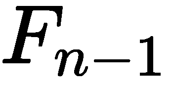
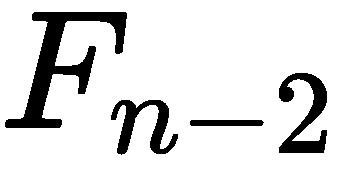
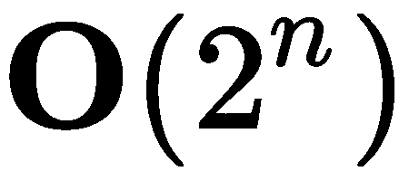
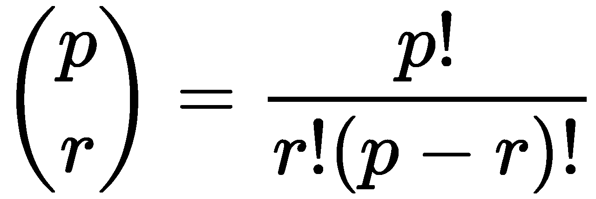
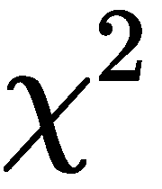

# Functools 模块

函数式编程强调函数是一类对象。我们已经看到了几个高阶函数，它们接受函数作为参数或返回函数作为结果。在本章中，我们将使用一些工具来查看`functools`库，以帮助我们实现一些常见的功能设计模式。

我们来看看一些高阶函数。这扩展了[第 5 章](05.html)、*高阶函数*的内容。我们将继续关注[第 11 章](11.html)、*装饰设计技术*中的高阶功能技术。

我们将在本模块中介绍以下功能：

*   `@lru_cache`：对于某些类型的应用程序，此装饰器可以极大地提高性能。
*   `@total_ordering`：这个修饰符可以帮助创建丰富的比较运算符。此外，它还让我们了解面向对象设计与函数式编程相结合的更一般的问题。
*   `partial()`：此函数通过函数和一些参数值绑定创建一个新函数。
*   `reduce()`：这是一个高阶函数，概括了`sum()`等约化。

我们将推迟该库的另外两名成员加入[第 11 章](11.html)、*装饰设计技术—*的`update_wrapper()`和`wraps()`功能。在下一章中，我们还将更仔细地研究如何编写自己的装饰程序。

我们将完全忽略`cmp_to_key()`函数。其目的是帮助将使用比较对象的 Python 2 代码转换为在使用键提取的 Python 3 下运行。我们只对 Python 3 感兴趣；我们将编写适当的键函数。

# 功能工具

我们在[第 5 章](05.html)、*高阶函数*中查看了一些高阶函数。这些函数要么接受函数作为参数，要么返回函数（或生成器表达式）。所有这些高阶函数都有一个通过注入另一个函数定制的基本算法。像`max()`、`min()`和`sorted()`这样的函数接受了一个`key=`函数来定制它们的行为。`map()`和`filter()`等函数接受函数和 iterable，并将此函数应用于参数。在`map()`函数的情况下，函数的结果被简单地产生。对于`filter()`函数，该函数的布尔结果用于传递或拒绝来自 iterable 源的值。

[第 5 章](05.html)、*高阶函数*中的所有函数都是 Python`__builtins__`包的一部分，无需进行`import`即可使用。它们无处不在，因为它们是如此普遍有用。本章中的函数必须以`import`来介绍，因为它们不是那么通用。

`reduce()`功能跨越了这一界限。它最初建于年。经过一番讨论后，由于可能被滥用，它被从`__builtins__`包中删除。一些看似简单的操作可能表现得非常糟糕。

# 使用 lru_ 缓存记录以前的结果

`lru_cache`装饰器将给定函数转换为可能执行得更快的函数。**LRU**表示**最近使用最少的**——保留有限的最近使用的物品池。不经常使用的项目将被丢弃，以将池保持在有限制的大小。

由于这是一个 decorator，我们可以将其应用于任何可能从缓存以前的结果中获益的函数。我们可以按如下方式使用它：

```py
from functools import lru_cache
@lru_cache(128)
def fibc(n: int) -> int:
    if n == 0: return 0
    if n == 1: return 1
    return fibc(n-1) + fibc(n-2)
```

这是一个基于[第 6 章](06.html)、*递归和归约*的示例。我们已经将`@lru_cache`装饰器应用于朴素的斐波那契数计算。由于这种装饰，现在将根据装饰程序维护的缓存检查对`fibc(n)`函数的每次调用。如果参数`n`在缓存中，则使用先前计算的结果，而不是进行可能代价高昂的重新计算。每个返回值都添加到缓存中。

我们之所以强调这个例子，是因为在这种情况下，朴素递归的代价相当高。计算任何给定斐波那契数的复杂性不仅包括计算，还包括计算。这棵价值树导致的复杂性顺序为。

参数值`128`是缓存的大小。这用于限制用于缓存的内存量。缓存已满时，将替换 LRU 项。

我们可以尝试使用`timeit`模块以实证的方式确认这些好处。我们可以分别执行这两个实现一千次，以查看时间的比较情况。使用`fib(20)`和`fibc(20)`方法可以看出，如果没有缓存的好处，这种计算是多么昂贵。因为朴素的版本速度太慢，重复的次数减少到只有 1000 次。结果如下：

*   天真 3.23
*   缓存 0.0779

请注意，我们不能在`fibc()`函数上简单地使用`timeit`模块。缓存的值将保持不变，我们只计算一次`fibc(20)`函数，它将在缓存中填充此值。剩余的 999 次迭代中的每一次都将从缓存中获取值。我们需要在使用`fibc()`函数之间清除缓存，否则时间几乎为零。这是通过装饰师构建的`fibc.cache_clear()`方法完成的。

记忆化的概念很强大。有许多算法可以从结果的记忆中获益。

以`r`为一组的`p`事物组合的数量通常如下所述：



这个二项式函数包括计算三个阶乘值。在阶乘函数上使用`@lru_cache`修饰符可能是有意义的。计算大量二项式值的程序不需要重新计算所有这些因子。对于重复计算类似值的情况，加速比可能令人印象深刻。对于很少重用缓存值的情况，维护缓存值的开销大于任何加速。

重复计算类似值时，我们会看到以下情况：

*   朴素因子 0.174
*   缓存阶乘 0.046

必须认识到缓存是一个有状态对象。这种设计突破了纯函数式编程的界限。一个功能理想是避免状态变化。这种避免有状态变量的概念以递归函数为例，当前状态包含在参数值中，而不是变量的变化值中。我们已经了解了尾部调用优化是如何提高性能的，以确保这种理想化的递归在可用处理器硬件和有限内存预算的情况下能够很好地工作。在 Python 中，我们通过用`for`循环替换尾部递归来手动执行尾部调用优化。缓存是一种类似的优化，我们将根据需要手动实现它，因为我们知道它不是纯粹的函数式编程。

原则上，对具有 LRU 缓存的函数的每次调用都有两个结果，一个是预期结果，另一个是新的缓存对象，可用于函数的未来评估。实际上，缓存对象封装在修饰版的`fibc()`函数中，不可用于检查或操作。

缓存不是万灵药。使用浮点值的应用程序可能不会从记忆中受益很多，因为浮点值通常是近似值。浮点值的最低有效位应视为随机噪声，可阻止`lru_cache`装饰器中的精确相等性测试工作。

我们将在[第 16 章](16.html)、*优化和改进*中重新讨论这一点。我们将研究一些实现此功能的其他方法。

# 用全序定义类

`total_ordering`装饰器有助于创建实现丰富的比较运算符集的新类定义。这可能适用于子类`numbers.Number`的数值类。它也适用于半数值类。

作为一个半数字类的例子，考虑一张扑克牌。它有一个数字等级和一个符号套装。只有在模拟某些游戏时，排名才起作用。这在模拟赌场**二十一点**时尤为重要。和数字一样，卡片也有顺序。我们经常对每张卡的分值求和，使它们像数字一样。然而，*卡*×*卡*的乘法实际上没有任何意义；一张卡片不像一个数字。

我们几乎可以模拟具有`NamedTuple`基类的扑克牌，如下所示：

```py
from typing import NamedTuple
class Card1(NamedTuple):
    rank: int
    suit: str
```

这几乎是一个很好的模仿。它有一个深刻的局限性：默认情况下，所有的比较都包括等级和诉讼。当我们比较黑桃和梅花时，这会导致以下尴尬行为：

```py
>>> c2s= Card1(2, '\u2660')
>>> c2h= Card1(2, '\u2665')
>>> c2s
Card1(rank=2, suit='♠')
>>> c2h= Card1(2, '\u2665')
>>> c2h
Card1(rank=2, suit='♥')
>>> c2h == c2s
False  
```

默认的比较规则对 21 点不起作用。它也不适用于某些扑克模拟。

对于这些游戏，最好只根据它们的等级来进行卡片之间的默认比较。下面是一个更有用的类定义：

```py
from functools import total_ordering
from numbers import Number
from typing import NamedTuple

@total_ordering
class Card2(NamedTuple):
    rank: int
    suit: str
    def __eq__(self, other: Any) -> bool:
        if isinstance(other, Card2):
            return self.rank == other.rank
        elif isinstance(other, int):
            return self.rank == other
        return NotImplemented
    def __lt__(self, other: Any) -> bool:
        if isinstance(other, Card2):
            return self.rank < other.rank
        elif isinstance(other, int):
            return self.rank < other
        return NotImplemented

```

这个类扩展了`NamedTuple`类。我们提供了一个`__str__()`方法来打印`Card2`对象的字符串表示。

定义了两种比较：一种是相等比较，另一种是排序比较。可以定义各种各样的比较，`@total_ordering`装饰器处理其余比较的构造。在本例中，装饰者根据这两个定义创建了`__le__()`、`__gt__()`和`__ge__()`。`__ne__()`的默认实现使用`__eq__()`；这在不使用装饰器的情况下工作。

提供的两种方法都允许在`Card2`对象之间以及`Card2`对象与整数之间进行两种比较。类型提示必须是`Any`才能与`__eq__()`和`__lt__()`的超类定义保持兼容。很明显，它可以缩小到`Union[Card2, int]`，但这与继承自超类的定义相冲突。

首先，本课程仅提供以下等级的适当比较：

```py
>>> c2s= Card2(2, '\u2660')
>>> c2h= Card2(2, '\u2665')
>>> c2h == c2s
True
>>> c2h == 2
True
>>> 2 == c2h
True
```

我们可以使用这个类进行大量的模拟，并使用简化的语法来比较卡片的等级。此外，decorator 构建了一组丰富的比较运算符，如下所示：

```py
>>> c2s= Card2(2, '\u2660')
>>> c3h= Card2(3, '\u2665')
>>> c4c= Card2(4, '\u2663')
>>> c2s <= c3h < c4c
True
>>> c3h >= c3h
True
>>> c3h > c2s
True
>>> c4c != c2s
True  
```

我们不需要编写所有的比较方法函数；它们是由装饰师生成的。装饰师创建的操作符并不完美。在我们的例子中，我们要求与整数以及`Card`实例之间进行比较。这暴露了一些问题。

像`c4c > 3`和`3 < c4c`比较这样的操作会引发`TypeError`异常，因为运算符的解决方式不同。这是对`total_ordering`装饰师所能做的限制。这一问题在实践中很少出现，因为这种混合阶级胁迫相对少见。在极少数情况下，它是必需的，那么必须完全定义操作符，并且不使用`@total_ordering`修饰符。

面向对象编程与函数式编程并不是对立的。有一个领域，这两种技术是互补的。Python 创建不可变对象的能力在函数式编程技术中尤其有效。我们可以很容易地避免有状态对象的复杂性，但仍然可以从封装中获益，从而将相关的方法函数保持在一起。定义涉及复杂计算的类属性尤其有用；这将计算绑定到类定义，使应用程序更易于理解。

# 定义数字类

在某些情况下，我们可能希望扩展 Python 中可用的数字塔。`numbers.Number`的子类可以简化功能程序。例如，我们可以将复杂算法的部分分离到`Number`子类定义中，使应用程序的其他部分更简单或更清晰。

Python 已经提供了丰富的数字类型。`int`和`float`变量的内置类型涵盖了各种各样的问题领域。当使用货币时，`decimal.Decimal`软件包优雅地处理了这个问题。在某些情况下，我们可能会发现`fractions.Fraction`类比`float`变量更合适。

例如，当我们使用地理数据时，我们可能会考虑创建一个子类，该变量引入了附加属性，用于在纬度（或经度）和弧度之间转换。这个子类中的算术运算可以来简化穿越赤道或格林威治子午线的计算。

因为 Python`Numbers`类是不可变的，所以普通的函数设计可以应用于所有不同的方法函数。可以简单地忽略异常、Python、就地、特殊方法（例如，`__iadd__()`函数）。

在处理`Number`的子类时，我们有大量的设计考虑，如下所示：

*   相等性测试和哈希值计算。Python 标准库的*9.1.2 类型实现者注释*部分记录了数字哈希计算的核心特性。
*   其他比较运算符（通常通过`@total_ordering`修饰符定义）。
*   算术运算符-`+`、`-`、`*`、`/`、`//`、`%`和`**`。正向操作有特殊方法，反向类型匹配也有其他方法。给定一个表达式，例如`a-b`，Python 使用`a`类型尝试定位`__sub__()`方法函数的实现，实际上是`a.__sub__(b)`方法。如果左侧值的类`a`在本例中没有方法或返回`NotImplemented`异常，则检查右侧值以查看`b.__rsub__(a)`方法是否提供结果。当类`b`是类`a`的子类时，还有一个特殊情况适用，这允许子类重写左侧操作选择。
*   位操纵操作符-`&`、`|`、`**^**`、`>>`、`<<`和`~`。这些可能对浮点值没有意义；省略这些特殊方法可能是最好的设计。
*   一些附加功能，如`round()`、`pow(),`和`divmod()`是通过数字特殊方法名实现的。这些可能对这类数字有意义。

[第 7 章](07.html)*附加元组技术*提供了创建新类型数字的详细示例。有关更多详细信息，请访问链接：[https://www.packtpub.com/application-development/mastering-object-oriented-python](https://www.packtpub.com/application-development/mastering-object-oriented-python) 。

如前所述，函数式编程和面向对象编程可以是互补的。我们可以很容易地定义遵循函数式编程设计模式的类。添加新类型的数字是利用 Python 的面向对象特性创建更可读的函数程序的一个例子。

# 使用 partial（）应用部分参数

`partial()`函数会导致一个称为**部分应用程序**的东西。部分应用的函数是从旧函数和所需参数的子集构建的新函数。这与咖喱的概念密切相关。很多理论背景与此无关，因为 curry 不适用于 Python 函数的实现方式。然而，这个概念可以引导我们进行一些方便的简化。

我们可以看以下几个简单的例子：

```py
>>> exp2 = partial(pow, 2)
>>> exp2(12)
4096
>>> exp2(17)-1
131071
```

我们已经创建了函数`exp2(y)`，这就是`pow(2, y)`函数。`partial()`函数将第一个位置参数限制为`pow()`函数。当我们计算新创建的`exp2()`函数时，我们会从`partial()`函数绑定的参数中计算出值，再加上提供给`exp2()`函数的附加参数。

位置参数的绑定严格按照从左到右的顺序处理。对于接受关键字参数的函数，在构建部分应用的函数时也可以提供这些参数。

我们还可以使用 lambda 形式创建此类部分应用函数，如下所示：

```py
exp2 = lambda y: pow(2, y)
```

两者都没有明显的优势。测量性能表明，`partial()`函数比 lambda 形式稍快，方式如下：

*   部分 0.37
*   λ0.42

这是 100 万次迭代中的 0.05 秒，不是一个显著的节省。

由于 lambda 表单具有`partial()`函数的所有功能，因此我们可以放心地将此函数放在一边，因为它没有太大的用处。我们将在[第 14 章](14.html)*PyMonad Library*中返回到它，并看看我们如何通过咖喱来实现这一点。

# 使用 reduce（）函数减少数据集

`sum()`、`len()`、`max()`和`min()`函数在某种程度上都是由`reduce()`函数表示的更通用算法的专门化。`reduce()`函数是一个高阶函数，它将一个函数折叠到 iterable 中的每对项中。

序列对象如下所示：

```py
d = [2, 4, 4, 4, 5, 5, 7, 9]
```

功能`reduce(lambda x, y: x+y, d)`将`+`操作符折叠到列表中，如下所示：

```py
2+4+4+4+5+5+7+9
```

包括`()`有助于显示从左到右的有效分组，如下所示：

```py
((((((2+4)+4)+4)+5)+5)+7)+9
```

Python 对表达式的标准解释涉及从左到右的运算符求值。因此，向左折叠并不是意义上的改变。一些函数式编程语言提供了一种折叠式的选择。当与递归结合使用时，另一种语言的编译器可以进行许多巧妙的优化。这在 Python 中不可用：缩减总是从左到右。

我们还可以提供如下初始值：

```py
reduce(lambda x, y: x+y**2, iterable, 0)  
```

如果没有，则序列中的初始值将用作初始化。当存在`map()`函数和`reduce()`函数时，提供初始值非常重要。下面是如何使用显式的`0`初始值设定项计算正确答案：

```py
0 + 2**2 + 4**2 + 4**2 + 4**2 + 5**2 + 5**2 + 7**2 + 9**2
```

如果省略 0 的初始化，`reduce()`函数使用第一项作为初始值。此值未应用转换函数，这将导致错误答案。实际上，没有适当初始值的`reduce()`正在计算：

```py
2 + 4**2 + 4**2 + 4**2 + 5**2 + 5**2 + 7**2 + 9**2
```

这种错误是`reduce()`必须小心使用的部分原因。

我们可以使用`reduce()`高阶函数定义许多内置约化，如下所示：

```py
sum2 = lambda data: reduce(lambda x, y: x+y**2, data, 0)
sum = lambda data: reduce(lambda x, y: x+y, data, 0)
count = lambda data: reduce(lambda x, y: x+1, data, 0)
min = lambda data: reduce(lambda x, y: x if x < y else y, data)
max = lambda data: reduce(lambda x, y: x if x > y else y, data)
```

`sum2()`缩减函数是平方和，用于计算一组样本的标准偏差。此`sum()`还原功能模仿内置`sum()`功能。`count()`归约函数与`len()`函数类似，但它可以处理 iterable，而`len()`函数只能处理物化的`collection`对象。

`min()`和`max()`函数模拟内置的缩减。由于 iterable 的第一项用于初始化，因此这两个函数将正常工作。如果我们为这些`reduce()`函数提供任何初始值，我们可能会错误地使用原始 iterable 中从未出现过的值。

# 将 map（）和 reduce（）组合在一起

我们可以看到如何围绕这些简单的定义构建高阶函数。我们将展示一个简单的 map reduce 函数，它将`map()`和`reduce()`函数组合在一起，如下所示：

```py
from typing import Callable, Iterable, Any
def map_reduce(
        map_fun: Callable,
        reduce_fun: Callable,
        source: Iterable) -> Any:
    return reduce(reduce_fun, map(map_fun, source))
```

我们从`map()`和`reduce()`函数中创建了一个复合函数，该函数包含三个参数：映射转换、约简操作和要处理的项的 iterable 或 sequence 源。

如前所示，在其最通用的形式中，很难对所涉及的数据类型做出任何更正式的断言。map 和 reduce 函数可以是非常复杂的转换。在下面的例子中，我们将对`map_reduce()`使用稍微狭窄的定义，如下所示：

```py
from typing import Callable, Iterable, TypeVar
T_ = TypeVar("T_")
def map_reduce(
        map_fun: Callable[[T_], T_],
        reduce_fun: Callable[[T_, T_], T_],
        source: Iterable[T_]) -> T_:
    return reduce(reduce_fun, map(map_fun, source))
```

此定义引入了许多约束。首先，迭代器生成一些类型一致的数据。我们将该类型绑定到`T_`类型变量。其次，map 函数接受绑定到`T_`类型的一个参数，并生成相同类型的结果。第三，reduce 函数将接受此类型的两个参数，并返回相同类型的结果。对于一个简单的、本质上是数字的应用程序，使用一致的类型变量`T_`效果很好。

然而，更常见的是，需要对`map_fun()`函数进行更狭义的定义。使用诸如`Callable[[T1_], T2_]`之类的类型将捕获从源类型`T1_`到可能不同的结果类型`T2_`的转换的本质。然后，`reduce_fun()`函数将是`Callable[[T2_, T2_], T2_]`，因为它们倾向于保留数据的类型。

我们可以分别使用`map()`和`reduce()`函数构建平方和约化，如下所示：

```py
def sum2_mr(source: Iterable[float]) -> float:
    return map_reduce(
        lambda y: y**2, lambda x, y: x+y, source)
```

在本例中，我们使用了`lambda y: y**2`参数作为每个值的平方映射。还原为`lambda x, y: x+y`参数。我们不需要显式地提供初始值，因为初始值将是在`map()`函数对其求平方后 iterable 中的第一项。

`lambda x, y: x+y`参数为`+`运算符。Python 在`operator`模块中将所有算术运算符作为短函数提供。下面是我们如何稍微简化 map reduce 操作的：

```py
from operator import add
def sum2_mr2(source: Iterable[float]) -> float:
    return map_reduce(lambda y: y**2, add, iterable)  
```

我们使用了`operator.add`方法来求和，而不是较长的 lambda 形式。

下面是我们如何计算 iterable 中的值：

```py
def count_mr(source: Iterable[float]) -> float:
    return map_reduce(lambda y: 1, lambda x, y: x+y, source)
```

我们已经使用`lambda y: 1`参数将每个值映射到值 1。然后，计数是一个使用 lambda 或`operator.add`函数的`reduce()`函数。

通用`reduce()`函数允许我们创建从大型数据集到单个值的任何种类的约简。然而，对于我们应该如何使用`reduce()`函数，存在一些限制。

我们必须避免执行以下命令：

```py
reduce(operator.add, list_of_strings, "")
```

是的，这个有效。Python 将在字符串项之间应用 add 运算符。然而，`"".join(list_of_strings)`方法的效率要高得多。一项关于`timeit`的小研究表明，使用`reduce()`组合字符串是复杂且非常非常缓慢的。如果不仔细研究如何为复杂的数据结构实现操作符，就很难发现这些情况。

# 使用 reduce（）和 partial（）函数

可以使用`partial(reduce, operator.add)`函数定义`sum()`函数。这也给了我们一个关于如何创建其他映射和其他缩减的提示。我们可以将所有常用的约化定义为部分约化，而不是 lambda：

```py
sum2 = partial(reduce, lambda x, y: x+y**2)
count = partial(reduce, lambda x, y: x+1)
```

我们现在可以通过`sum2(some_data)`或`count(some_iter)`方法使用这些函数。正如我们之前提到的，目前还不清楚这有多大好处。这是一项重要的技术，因为使用这样的部分函数可以简化特别复杂的计算。

# 使用 map（）和 reduce（）函数清理原始数据

在进行数据清理时，我们通常会引入各种复杂度的过滤器来排除无效值。我们还可以包括一个映射，用于在有效但格式不正确的值可以替换为有效但正确的值的情况下清理值。

我们可能会产生以下输出：

```py
def comma_fix(data: str) -> float:
    try:
        return float(data)
    except ValueError:
        return float(data.replace(",", ""))

def clean_sum(
        cleaner: Callable[[str], float],
        data: Iterable[str]
    ) -> float:
    return reduce(operator.add, map(cleaner, data))
```

我们定义了一个简单的映射，`comma_fix()`类，它将数据从几乎正确的字符串格式转换为可用的浮点值。这将删除逗号字符。另一个常见的变体将删除美元符号并转换为`decimal.Decimal`。

我们还定义了一个 map reduce 操作，该操作在使用`operator.add`方法执行`reduce()`函数之前，将给定的 cleaner 函数（本例中为`comma_fix()`类）应用于数据。

我们可以应用前面描述的函数，如下所示：

```py
>>> d = ('1,196', '1,176', '1,269', '1,240', '1,307', 
... '1,435', '1,601', '1,654', '1,803', '1,734')
>>> clean_sum(comma_fix, d)
14415.0
```

我们已经通过修正逗号清理了数据，并计算了一个和。语法对于组合这两个操作非常方便。

但是，我们必须小心多次使用清洁功能。如果我们还要计算平方和，我们真的不应该执行以下命令：

```py
comma_fix_squared = lambda x: comma_fix(x)**2  
```

如果我们使用`clean_sum(comma_fix_squared, d)`方法作为计算标准偏差的一部分，我们将对数据执行两次逗号固定操作，一次计算总和，一次计算平方和。这是一个糟糕的设计；使用`lru_cache`装饰器缓存结果会有所帮助。将经过消毒的中间值具体化为临时`tuple`对象更好。

# 使用 groupby（）和 reduce（）函数

一个常见的要求是在将数据划分为多个组后对其进行汇总。我们可以使用`defaultdict(list)`方法对数据进行分区。然后我们可以分别分析每个分区。在[第 4 章](04.html)中*与集合*一起工作，我们研究了一些分组和划分的方法。在[第 8 章](08.html)中*Itertools 模块*中，我们查看了其他模块。

以下是我们需要分析的一些样本数据：

```py
>>> data = [('4', 6.1), ('1', 4.0), ('2', 8.3), ('2', 6.5),
... ('1', 4.6), ('2', 6.8), ('3', 9.3), ('2', 7.8),
... ('2', 9.2), ('4', 5.6), ('3', 10.5), ('1', 5.8),
... ('4', 3.8), ('3', 8.1), ('3', 8.0), ('1', 6.9),
... ('3', 6.9), ('4', 6.2), ('1', 5.4), ('4', 5.8)]
```

我们得到了一系列原始数据值，每个值都有一个键和一个度量值。

从该数据生成可用组的一种方法是构建一个字典，将键映射到该组中的成员列表，如下所示：

```py
from collections import defaultdict
from typing import (
    Iterable, Callable, Dict, List, TypeVar,
    Iterator, Tuple, cast)
D_ = TypeVar("D_")
K_ = TypeVar("K_")

def partition(
        source: Iterable[D_],
        key: Callable[[D_], K_] = lambda x: cast(K_, x)
    ) -> Iterable[Tuple[K_, Iterator[D_]]]:
    pd: Dict[K_, List[D_]] = defaultdict(list)
    for item in source:
        pd[key(item)].append(item)
    for k in sorted(pd):
        yield k, iter(pd[k])
```

这将根据键将 iterable 中的每个项分成一个组。iterable 数据源使用类型变量`D_`进行描述，表示每个数据项的类型。`key()`函数用于从每个项目中提取键值。此函数生成某种类型的对象`K_`，它通常不同于原始数据项类型`D_`。查看样本数据时，每个数据项的类型为`tuple`。钥匙类型为`str`。用于提取密钥的可调用函数将`tuple`转换为`string`。

从每个数据项中提取的`key()`值用于将每个项附加到`pd`字典中的列表中。`defaultdict`对象定义为将每个键`K_`映射到数据项列表`List[D_]`。

此函数的结果值与`itertools.groupby()`函数的结果相匹配。这是`(group key, iterator)`元组的一个可匹配序列。这些组密钥将是密钥函数生成的类型。迭代器将提供原始数据项的序列。

以下是与`itertools.groupby()`功能定义的相同功能：

```py
from itertools import groupby

def partition_s(
        source: Iterable[D_],
        key: Callable[[D_], K_] = lambda x: cast(K_, x)
    ) -> Iterable[Tuple[K_, Iterator[D_]]]:
    return groupby(sorted(source, key=key), key)
```

The important difference in the inputs to each function is that the `groupby()` function version requires data to be sorted by the key, whereas the `defaultdict` version doesn't require sorting. For very large sets of data, the sort can be expensive, measured in both time and storage.

下面是核心分区操作。这可能在筛选出组之前使用，也可能在计算每个组的统计数据之前使用：

```py
>>> for key, group_iter in partition(data, key=lambda x:x[0] ):
... print(key, tuple(group_iter))
1 (('1', 4.0), ('1', 4.6), ('1', 5.8), ('1', 6.9), ('1', 5.4))
2 (('2', 8.3), ('2', 6.5), ('2', 6.8), ('2', 7.8), ('2', 9.2))
3 (('3', 9.3), ('3', 10.5), ('3', 8.1), ('3', 8.0), ('3', 6.9))
4 (('4', 6.1), ('4', 5.6), ('4', 3.8), ('4', 6.2), ('4', 5.8))
```

我们可以将分组数据总结如下：

```py
mean = lambda seq: sum(seq)/len(seq)
var = lambda mean, seq: sum((x-mean)**2/mean for x in seq)

Item = Tuple[K_, float]
def summarize(
        key_iter: Tuple[K_, Iterable[Item]]
    ) -> Tuple[K_, float, float]:
    key, item_iter = key_iter
    values = tuple(v for k, v in item_iter)
    m = mean(values)
    return key, m, var(m, values)
```

`partition()`函数的结果将是`(key, iterator)`两个元组的序列。`summarize()`函数接受两个元组，并将其分解为键和原始数据项上的迭代器。在该函数中，数据项定义为`Item`、某种类型的键`K_`和可强制为`float`的数值。从`item_iter`迭代器中的每两个元组中，我们需要值部分，并使用生成器表达式仅创建值的元组。

我们还可以使用表达式`map(snd, item_iter)`从两个元组中的每个元组中选取第二项。这需要对`snd = lambda x: x[1]`进行定义。名称`snd`是 second 的缩写形式，用于拾取元组的第二项。

我们可以使用以下命令将`summarize()`函数应用于每个分区：

```py
>>> partition1 = partition(data, key=lambda x: x[0])
>>> groups1 = map(summarize, partition1)
```

替代命令如下所示：

```py
>>> partition2 = partition_s(data, key=lambda x: x[0])
>>> groups2 = map(summarize, partition2)
```

两者都将为我们提供每组的汇总值。由此产生的组统计信息如下所示：

```py
1 5.34 0.93
2 7.72 0.63
3 8.56 0.89
4 5.5 0.7
```

方差可作为检验的一部分，以确定该数据是否存在无效假设。零假设断言没有什么可看的：数据中的方差本质上是随机的。我们还可以比较四组之间的数据，看看各种方法是否与无效假设一致，或者是否存在一些统计上显著的变化。

# 总结

在本章中，我们已经了解了`functools`模块中的一些函数。这个库模块提供了许多函数，帮助我们创建复杂的函数和类。

我们已经将`@lru_cache`函数看作是一种通过频繁地重新计算相同值来提升某些类型应用程序的方法。此修饰符对于采用`integer`或`string`参数值的某些类型的函数具有巨大的价值。它可以通过简单地实现记忆来减少处理。

我们将`@total_ordering`函数作为装饰器来帮助我们构建支持丰富排序比较的对象。这是函数式编程的边缘，但在创建新类型的数字时非常有用。

`partial()`函数通过部分应用参数值创建一个新函数。作为替代方案，我们可以构建具有类似功能的`lambda`。这个用例是不明确的。

我们还将`reduce()`函数视为一个高阶函数。这推广了类似于`sum()`函数的约化。在后面的章节中，我们将在几个示例中使用此函数。这与作为一个重要的高阶函数的`filter()`和`map()`函数在逻辑上是一致的。

在接下来的章节中，我们将了解如何使用装饰器构建高阶函数。这些高阶函数可以使语法稍微简单明了。我们可以使用装饰器来定义一个独立的方面，我们需要将它合并到许多其他函数或类中。