# 十、IPFS——一个勇敢的新文件系统

在本章中，我们将学习**行星际文件系统**（**IPFS**）。IPFS 实际上不是区块链技术的一部分；相反，它是对它的补充。IPFS 与区块链是天作之合。正如您在前几章中所了解的，区块链中的存储是昂贵的。通常，人们将指向文件的链接保存在区块链中，并将实际文件保存在普通存储中，如云存储。但这一战略面临着中央集权的命运。IPFS 为区块链开发者提供了一种避免这种情况的方法。

在本章中，您将了解以下内容：

*   知识产权背后的动机
*   梅克尔达格
*   点对点网络

# 知识产权背后的动机

IPFS 不是一个普通的文件系统，例如`fat32`、`ntfs`或`ext3`。它更类似于 Dropbox。它是一个跨设备的文件系统。您可以将文件保存在此文件系统中，世界各地的人都可以像访问自己计算机上的文件一样轻松地访问它。如果以太坊可以被认为是世界上的单例操作系统，那么 IPFS 可以被认为是世界上的单例存储！

IPFS 网站的口号是*IPFS 是分布式网站*。IPFS 试图取代或至少补充 HTTP。HTTP 协议已经为我们服务了 20 多年，但它被认为不足以应对即将到来的挑战，如不断增加的带宽需求或文件冗余。HTTP 使用客户机-服务器模型。您只能选择这两个角色中的一个：作为服务器或客户端。

此体系结构存在两个问题：

*   第一个问题是，要获得服务器角色，我们必须有足够的资源。如果不是，如果服务器被大量请求淹没，它可能会迅速崩溃。对于许多普通人来说，每分钟处理一百万个请求所需的资源是遥不可及的。
*   第二个问题是服务器和客户机体系结构在某些情况下效率不高。想象一下，你坐在公园里的一位奶奶旁边，两人正在观看来自同一 URL 的一只可爱熊猫的相同视频（类似于[https://example.com/cute_panda.mp4](https://example.com/cute_panda.mp4) ）。假设这个视频的大小是 20MB。这意味着服务器必须向两个不同的位置发送两次 20MB 的文件，即使这两个不同的位置靠近一米。换句话说，服务器使用 40 MB 的带宽。但是，想象一下，如果你可以从坐在你旁边的奶奶那里而不是从服务器上提取文件（在这种情况下，假设奶奶在你之前两分钟就看过可爱的熊猫视频）。这不是更有效率吗？

2013 年末，胡安·贝内特（Juan Benet）受到了构建 IPF 的启发。当时，他使用的是知识工具，这个术语指的是能够有效地从论文中收集知识的软件。比如说，一位科学家读了很多论文。如果这位科学家能更快地获得这些知识，那就更好了。贝内特遇到了一个问题，即数据集需要花费太多的精力才能分发。没有简单的方法来处理数据集的版本控制。他研究了各种工具，如 Git 和 BitTorrent，并想知道它们是否可以结合起来解决这个问题。因此，知识产权基金诞生了。BitTorrent 在分发文件和在节点之间查找文件方面启发了 IPF。Git 在保持文件完整性和将保存的文件转换为存储方面启发了 IPF。

IPFS 是一种点对点超媒体协议，它使网络更快、更安全、更开放。IPFS 的目标是务实和理想化的。除了节省带宽外，它的另一个目的是延长文件的寿命。将文件在服务器中保存很长时间（例如十年）需要大量资源。我们希望文件保持活动状态的原因通常是因为它对服务器所有者有某种经济利益；例如，如果它是一篇博客文章，就可以通过广告赚钱。否则，文件可能会被存储服务器的所有者销毁。这发生在 Geocities 关闭时。

Geocities was a website that allowed people to create their own personal website. It was similar to [wordpress.com](http://wordpress.com) and [medium.com](http://medium.com). Some owners of servers would keep files alive even without ads, like Wikipedia, which works thanks to donations. Other than that, however, the files are not so lucky.

IPF 的其他目标更加理想化，涉及到如何民主化我们提供的内容。目前，内容高度集中。我们通常只访问几个网站，如 Facebook、Instagram、Reddit、Medium、Netflix、亚马逊、谷歌、维基百科等。这种信息寡头垄断阻碍了互联网的创新，因为信息实际上是由少数几家公司控制的。除了维基百科，大多数（如果不是全部的话）公司都受制于富有的股东。这种情况与 10 年前形成了鲜明对比，当时互联网被认为是财富和信息的巨大均衡器，类似于印刷技术。

这种高度集中的另一个缺点是，所提供的信息容易受到审查。例如，谷歌是一家总部位于加利福尼亚州山景城的公司，因此受美国法律管辖。大多数有决策权的人（高级管理人员和高级管理人员）都是美国人，因此他们对世界的看法有美国人的偏见。在欧洲大多数国家，一切正常的事情都可以以美国道德的名义进行审查。这可能包括国家不喜欢的内容，因为它被认为是亵渎神明或危险的。IPFS 项目的创始人将这种情况比作焚烧国家或强大机构认为危险的书籍。IPFS 项目的目标之一是增加文件对审查的抵抗力。IPFS 使人们更容易镜像和提供危险文档。我们将在本章后面的部分讨论 IPFS 如何实现这一目标。

IPFS 的最终目标更加务实，涉及到我们脆弱的互联网基础设施，它由计算机网络和通过光缆连接的核心路由器组成。如果连接电缆意外或故意损坏，则块或区域可能脱机。2011 年，一名妇女在挖掘金属出售时，用铲子损坏了将互联网连接到亚美尼亚的电缆。IPFS 项目并不能完全解决这个问题，但它可以在一定程度上减轻损害。

You can find the incident about the woman and her shovel here: [https://web.archive.org/web/20141225063937/http://www.wsj.com/articles/SB10001424052748704630004576249013084603344.](https://web.archive.org/web/20141225063937/http://www.wsj.com/articles/SB10001424052748704630004576249013084603344)

# 梅克尔达格

如果您已经了解了 Git 的内部结构，Merkle**有向无环图**（**DAG**）应该不会太陌生。作为一种版本控制系统软件，Git 需要保存一个文件的多个版本，并方便地分发给其他人。它还需要能够非常快速地检查文件的完整性。

梅克尔·达格由两个词组成：梅克尔和达格。让我们先讨论一下梅克尔。实际上，在这个上下文中，Merkle 的全称是 Merkle 树。Merkle 树是检查部分数据是否被篡改的快速方法。

# 梅克尔树

让我们看一个梅克尔树的例子来理解它。假设您有八条数据。在本例中，我们将使用动物的名称作为数据，但在使用 Merkle 树的比特币中，数据片段通常是交易。回到 Merkle 树：将数据按顺序排列，因此在本例中，猫是第一条数据，狗是第二条，蚂蚁是第三条，依此类推：

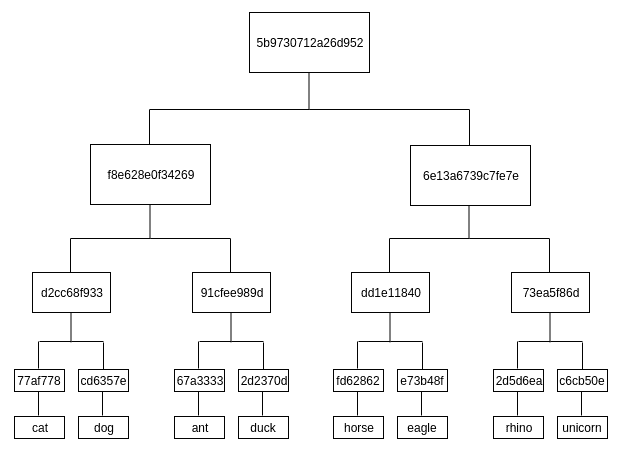

我们对每条数据进行散列，在本例中为猫、狗、蚂蚁等。对于本演示，我们使用哈希函数 SHA256。由于空间有限，我们截断了图中的完整哈希结果。现在，我们将数据从左到右排序，“猫”字符串的散列为`Data 1`，“狗”字符串的散列为`Data 2`，“蚂蚁”字符串的散列为`Data 3`等等。

有趣的部分来了。对于`Data 1`和`Data 2`，我们将哈希和哈希结果相结合。合并散列意味着将其连接起来。对`Data 3`和`Data 4`、`Data 5`和`Data 6`、`Data 7`和`Data 8`也要这样做。

这可能会让你想起淘汰赛。我们现在处于半决赛阶段。我们现在有`Hash 1`（来自`Data 1`和`Data 2`）`Hash 2`（来自`Data 3`和`Data 4`）`Hash 3`（来自`Data 5`和`Data 6`）和`Hash 4`（来自`Data 7`和`Data 8`）。

然后我们将`Hash 1`和`Hash 2`连接起来，散列结果，并将其命名为`Hash 5`。然后我们对`Hash 3`和`Hash 4`做同样的事情。将结果命名为`Hash 6`。

我们现在处于最后阶段。将`Hash 5`和`Hash 6`组合，然后散列结果。结果是`Root Hash`。此`Root Hash`可以保证所有数据的完整性（从`Data 1`到`Data 8`。如果您更改任何数据，`Root Hash`将不同。

您可能会问，为什么我们不从一开始就连接所有数据（从`Data 1`到`Data 8`），然后散列结果。然而，事实证明，Merkle 树比将所有数据连接在一起然后对其进行散列有一些好处（这种技术称为**散列列表**，在某些情况下使用）。好处之一是，当我们使用 Merkel 树时，检查部分数据的完整性更容易、更便宜。

在 Merkle 树中，要检查`Data 5`的完整性，只需下载`Data 5`、`Data 6`、`Hash 4`、`Hash 5`和`Root Hash`，如下图所示。您不需要下载所有数据：


如果使用简单的方法，则需要下载数据的所有散列（`Data 1`到`Data 8`和`Root Hash`。在本例中，我们只有八条数据。想象一下，如果我们有 100 个，你必须下载整个数据集。Merkle 树使这个过程更加高效，因为我们不需要下载完整的数据集。

如果我们有奇数个节点，比如 7 个，一般规则（比特币实现的规则）是克隆最后一个节点，因此`Data 8`是`Data 7`的副本。然而，你可以使用另一条规则；我看到了一个 Merkle 树的实现，其中一条数据（【在我们的示例中为 T2）】被简单地提升到顶部。在这种情况下，`Hash 4`只是`Data 7`。

当人们使用简化的支付验证时，比特币就是这样做的。使用移动应用，很难下载完整的节点。为了发送比特币交易，用户只下载节点的重要部分，而不是完整节点。Merkle 树支持此过程。

在下一节中，我们将继续学习 DAG。

# 定向丙烯酸图（DAG）

**定向丙烯酸图**（**DAGs**）顾名思义，是指每个顶点（或节点）都可以有指向其他顶点的边的图，如下图所示：

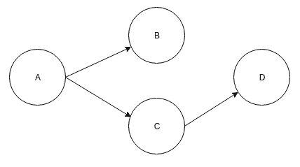

箭头的方向无关紧要，只要保持一致：

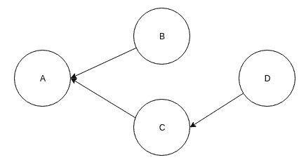

规则是这些边不应该循环。在下图中，我们可以看到顶点 A、C 和 D 构成一个循环，这违反了 DAG 的规则：


现在，如果你把 Merkle 树和 DAG 结合起来，你就得到了 Merkle DAG。这是 Git 和 IPFS 使用的数据结构。

在 Merkle 树中，只有叶节点保存数据。然而，在 Merkle DAG 中，任何节点都可以保存数据。在 Merkle 树中，树必须是平衡的，但是 Merkle DAG 中没有这样的限制。

在进入 Merkle DAG 之前，让我们先了解一下内容寻址，因为 Merkle DAG 依赖于此功能。

# 内容寻址

在链表中，使用指针将节点（或块）链接在一起。指针是指向内存的数据类型。例如，假设我们有两个节点，节点 A 和节点 B。节点 A 是头部，节点 B 是尾部。节点的结构有两个重要组成部分。第一个组件是存储数据的数据组件。在 Git 中，这些数据可以是文件的内容。第二个组件是到另一个节点的链接。在链表中，这是指向节点地址的指针。

但是对于内容寻址，而不仅仅是指针，我们还添加了目标（在本例中为节点 B）的哈希。你可能认识到这个概念；这正是区块链中发生的事情。然而，Merkle DAG 并不是在一条直线上线性跨越的链表。Merkle DAG 是一种可以有分支的树。

这是一个链表。在区块链的数据结构中使用：


现在，考虑一下这个例子。我们有三个节点：节点 A1 和 A2 都是指向节点 B 的头。我们没有将指针放在节点 A1 和节点 A2 上，而是将指针放在节点 B 上。节点 B 现在有两个指针。节点 B 散列节点 A1 和 A2，然后在再次散列结果之前连接这两个散列。这样，节点 B 可以保持节点 A1 和节点 A2 的内容的完整性。如果有人更改节点 A1 或节点 A2 的内容，则节点 B 保留的哈希将无效：

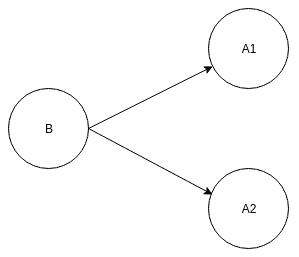

IPFS 在获取文档的方式上不同于 HTTP。HTTP 使用像指针一样工作的链接。例如，假设我们有以下链接：[https://example.com/cute_panda.png](https://example.com/cute_panda.png) 。它使用一个位置来获取名为`cute_panda.png`的文档。只有一家供应商可以提供此文件，即`example.com`。但是，IPFS 不使用 URL 链接。相反，它使用散列链接，如`ipfs://QmYeAiiK1UfB8MGLRefok1N7vBTyX8hGPuMXZ4Xq1DPyt7`。当您访问此散列链接时，IPFS 软件将找到经过散列处理后将提供相同散列输出的文档。因为散列是一个单向函数，所以 IPFS 必须有一些其他信息来定位文档。基本上，它将请求广播到具有此哈希输出的文档附近的节点。如果附近的节点没有这些文件，它们会将请求转发到附近的节点。这个对等查找请求相当复杂。IPFS 使用 S/Kademlia 分布式哈希表，我们将在本章后面的章节中讨论。

有趣的是，当您使用内容寻址时，可能有多个提供者可以为该文档提供服务。对于`cute_panda.png`文档，可以有四个以上的节点为该文档提供服务。我们可以选择最近的节点以提高下载过程的效率。这种特性也使得审查变得更加困难。在 HTTP 的情况下，参与者可以禁止服务器[https://example.com](https://example.com) 。然而，对于 IPFS，任何人都可以启动一个新节点并提供文档。目前，IPF 是透明的，也许太透明了。请求文档的节点可以看到为文档提供服务的节点的 IP 地址，反之亦然。参与者可以禁止 IP 地址，以禁止传播此文档。然而，使 IPFS 与 Tor（允许用户匿名浏览网站的软件）协同工作的开发仍处于早期阶段。

如果您从[下载文档 https://example.com/cute_panda.png](https://example.com/cute_panda.png) ，您当时得到的文档可能与您朋友昨天从同一 URL 下载的文档不同。可能是服务器管理员在您今天下载文档之前更改了文档。

然而，在内容寻址系统中，无论何时何地下载，您从 IPFS 散列链接`ipfs://QmYeAiiK1UfB8MGLRefok1N7vBTyX8hGPuMXZ4Xq1DPyt7`获得的文档始终是相同的。此哈希链接保证任何人都不能篡改文档。如果更改文档并将其上载到 IPFS，IPFS URL 或哈希将不同。

我们可以创建一个简单的 Python 脚本来说明这种情况。创建一个名为`ipfs_tutorial`的目录。在此目录中创建三个示例文件。第一个示例文件为`hello.txt`，其内容为`I am a good boy.\n`。第二个示例文件为`hello2.txt`，其内容为`I am a good girl.\n`。第三个示例文件为`hello3.txt`，其内容为`I am a good horse.\n`。第四个示例文件为`hello4.txt`，其内容为`I am a good girl.\n`。第二个和第四个文件具有相同内容的事实是故意的。如果愿意，您可以创建不同的文件，但请确保其中至少有两个文件具有相同的内容。

创建一个 Python 脚本，如以下代码块所示，并将其命名为`create_hash_from_content.py`：

```py
from os import listdir
from hashlib import sha256

files = [f for f in listdir('.') if 'hello' in f]

hashes = {}

for file in files:
    with open(file) as f:
        content = f.read().encode('utf-8')
        hash_of_content = sha256(content).hexdigest()
        hashes[hash_of_content] = content

content = hashes['20c38a7a55fc8a8e7f45fde7247a0436d97826c20c5e7f8c978e6d59fa895fd2']
print(content.decode('utf-8'))

print(len(hashes))
```

此脚本列出同一目录中名称以`hello`开头的所有文件。如果示例文件不是以`hello`开头，则可以修改此部分。长哈希是`hello2.txt`内容的哈希。

运行脚本时，将得到以下结果：

```py
I am a good girl.

3
```

如您所见，有四个文件，但最终输出是三个，而不是四个。这是因为有三个文件具有唯一的内容，而不是四个。这就是内容寻址的工作原理。它不关心文件名，只关心内容。文件名为`hello1.txt`或`hello2.txt`或`hello4.txt`并不重要，重要的是内容`I am a good girl.\n`是相同的。从技术上讲，这是一个**善意谎言**；当 IPFS 必须考虑文件名时，不能忽略它。我将在本章后面解释这件事的真相。

我们在前面的示例中看到的是普通散列。没有 Markle DAG 甚至 Merkle 树。现在让我们用一个大文件创建一个更复杂的场景。散列一个大文件是没有效率的。通常，我们将文件拆分为多个大小相同的较小部分。例如，一个 900 KB 的文件将变成四个文件。第一个、第二个和第三个文件的大小为 250 KB。第四个文件的大小为 150KB。然后，我们散列每个较小的文件，并将其与 Merkle 树相结合。

为了便于说明，我们将不使用大文件，但会进行一些想象中的限制。我们不希望散列跨越多行的内容。如果文本文件有四行，我们会将它们分成四个较小的文件。

在项目目录中，创建一个名为`hello_big.txt`的文件，并输入以下行：

```py
I am a big boy.
I am a tall girl.
I am a fast horse.
I am a slow dragon.
```

在创建散列这个大文件的脚本之前，让我们创建一个非常简单的 Merkle 树库，并将其命名为`merkle_tree.py`。请参阅 GitLab 链接以获取完整的代码文件：[https://gitlab.com/arjunaskykok/hands-on-blockchain-for-python-developers/tree/master/chapter_10](https://gitlab.com/arjunaskykok/hands-on-blockchain-for-python-developers/tree/master/chapter_10) 。

让我们从 Merkle 树库的初始化开始讨论它：

```py
    def __init__(self, leaf_nodes : List[str]):
        self.hash_nodes : List[str] = []
        self.leaf_nodes : List[str] = leaf_nodes
        self._turn_leaf_nodes_to_hash_nodes()
        if len(leaf_nodes) < 4:
            self.root_hash = self._hash_list()
        else:
            self.root_hash = self._build_root_hash()
```

我们确保至少有四个节点。如果不是，我们也可以使用哈希表技术。`leaf_nodes`为原始数据节点。它们是字符串列表，例如`['cat', 'dog', 'unicorn', 'elephant']`。`hash_nodes`是数据节点的哈希列表，如`[hash of 'cat', hash of 'dog', hash of 'unicorn', hash of 'elephant']`或`['77af778...', 'cd6357e...', 'c6cb50e...', 'cd08c4c...']`

如果少于四个节点，我们使用`_hash_list()`方法散列数据。在散列数据之前，我们将连接所有数据片段：

```py
    def _hash_list(self):
        long_node = "".join(self.hash_nodes)
        return self._hash(long_node.encode('utf-8'))
```

在`_turn_leaf_nodes_to_hash_nodes()`方法中，我们在`leaf_nodes`的基础上填充`hash_nodes`。这是一对一映射：

```py
    def _turn_leaf_nodes_to_hash_nodes(self):
        for node in self.leaf_nodes:
            self.hash_nodes.append(self._hash(node.encode('utf-8')))
```

在`_hash()`方法中，我们包装了`sha256`散列函数。这是为了简化类的自定义，因为我们可能希望使用不同的哈希函数：

```py
    def _hash(self, data : bytes) > bytes:
        return sha256(data).hexdigest()
```

下面的代码块显示了如何从哈希节点获取根节点：

```py

    def _build_root_hash(self) > bytes:
        parent_amount = ceil(len(self.hash_nodes) / 2)
        nodes : List[str] = self.hash_nodes

        while parent_amount > 1:
            parents : List[bytes] = []
            i = 0
            while i < len(nodes):
                node1 = nodes[i]
                if i + 1 >= len(nodes):
                    node2 = None
                else:
                    node2 = nodes[i+1]
                parents.append(self._convert_parent_from_two_nodes(node1, node2))
                i += 2
            parent_amount = len(parents)
            nodes = parents

        return parents[0]
```

这里，我们在散列节点上执行多个迭代。它在每次迭代中跳两步。对于每个迭代，它在两个节点上工作。它连接这两个节点的散列，然后散列结果。结果哈希是这两个节点的父节点。此父节点将成为将再次迭代的哈希节点的一部分。此父级及其邻居将在散列之前再次连接，以此类推。如果散列节点数为奇数，则最后一个节点将在散列之前与其自身连接。如果只有一个父级，则返回该父级的哈希，即**根哈希**：

```py
    def _convert_parent_from_two_nodes(self, node1 : bytes, node2) -> bytes:
        if node2 == None:
            return self._hash((node1 + node1).encode('utf-8'))
        return self._hash((node1 + node2).encode('utf-8'))
```

`_convert_parent_from_two_nodes()`方法允许我们从两个子节点获取父散列。我们将两个节点连接起来并对它们进行散列。如果第二个节点是`None`，这意味着有奇数个节点，或者我们正在处理最后一个节点，我们只需在散列之前将节点与自身连接起来。

现在 Merkle 树库已经准备好了，我们将创建一个 Python 脚本来散列`hello_big.txt`文件并将其命名为`hash_big_file.py`：

```py
from os import listdir
from hashlib import sha256
from merkle_tree import MerkleTree

hashes = {}

file = 'hello_big.txt'
with open(file) as f:
    lines = f.read().split('\n')
    hash = []
    hash_of_hash = []
    merkle_tree = MerkleTree(lines)
    root_hash = merkle_tree.root_hash

hashes[root_hash] = []
for line in lines:
    hashes[root_hash].append(line)

print(hashes)
```

如果执行此 Python 脚本，将获得以下输出：

```py
{'ba7a7738a34a0e60ef9663c669a7fac406ae9f84441df2b5ade3de1067c41808': ['I am a big boy.', 'I am a tall girl.', 'I am a fast horse.', 'I am a slow dragon.', '']}
```

如果文件很大，则不会直接对其进行哈希，因为这可能会导致内存不足。而是拆分文件。这里，我们根据新行拆分文本文件。如果处理二进制文件，则逐块读取文件并将该块保存到较小的文件中。当然，在将它们输入 Merkle 树之前，您需要将二进制数据序列化为文本数据。完成后，就可以将数据片段输入 Merkle 树。您将获得根哈希，它将保护原始文件的完整性。如果在一段数据中更改一个位，则根哈希将不同。

# Merkle-DAG 数据结构

我们使用内容寻址来处理文件。如果文件很大，我们可以将其拆分并使用 Merkle 树获取根哈希。在这种情况下，我们只关心文件的内容；我们甚至都不保存它的名字。

但是，在某些情况下，文件名确实很重要。例如，假设您想要保存一个包含 100 张可爱熊猫图片的文件目录。在这种情况下，文件的名称无关紧要；我们关心的是内容，可爱熊猫的照片！但是，如果这是一个编程项目的目录，那么文件名就很重要。如果一个 Python 文件试图导入另一个包含在不同文件中的 Python 库，我们必须保留该文件的名称。假设我们有一个名为`main.py`的 Python 文件，它有以下内容：

```py
from secret_algorithm import SuperSecretAlgorithm

# execute it
SuperSecretAlgorithm()
```

`main.py`文件依赖于同一目录中名为`secret_algorithm.py`的另一个文件。重要的不仅仅是`secret_algorithm.py`文件的内容，还有它的名称。如果文件名更改，`main.py`将无法导入库。

为了保存内容和文件名，我们需要使用 Merkle DAG 数据结构。如前所述，Merkle DAG 和 Merkle 树之间的区别之一是 Merkle DAG 中的任何节点都可以保存数据，而不仅仅是叶子节点，就像 Merkle 树中的情况一样。

让我们创建一个包含示例文件的示例目录和一个也包含文件的嵌套目录：

```py
$ mkdir sample_directory
$ cd sample_directory
$ // Create some files
$ mkdir inner_directory
$ cd inner_directory
$ // Create some files
```

然后，创建一个 Python 脚本来解释这个新的数据结构。在项目目录中创建一个名为`merkle_dag.py`的文件。请参阅 GitLab 链接以获取完整的代码文件：[https://gitlab.com/arjunaskykok/hands-on-blockchain-for-python-developers/tree/master/chapter_10](https://gitlab.com/arjunaskykok/hands-on-blockchain-for-python-developers/tree/master/chapter_10) 。

让我们讨论一下`MerkleDAGNode`类，从它的初始化方法开始：

```py
    def __init__(self, filepath : str):
        self.pointers = {}
        self.dirtype = isdir(filepath)
        self.filename = Path(filepath).name
        if not self.dirtype:
            with open(filepath) as f:
                self.content = f.read()
            self.hash = self._hash((self.filename + self.content).encode('utf-8'))
        else:
            self.content = self._iterate_directory_contents(filepath)
            nodes_in_str_array = list(map(lambda x: str(x), self.content))
            if nodes_in_str_array:
                self.hash = self._hash((self.filename + MerkleTree(nodes_in_str_array).root_hash).encode('utf-8'))
            else:
                self.hash = self._hash(self.filename.encode('utf-8'))
```

`_init_()`方法接受文件路径作为参数。这可能是文件或目录的路径。我们假设这是一条有效路径，而不是符号链接。`self.pointers`将在后面的章节中使用`_iterate_directory_contents()`方法进行解释。`self.dirtype`用于区分目录或文件。`self.filename`用于保存文件名或目录名。

如果参数是文件的路径（而不是目录），则将内容读入`self.content`。出于演示目的，我们假设文件的内容很小，并且不像以前那样尝试拆分文件。然后，我们根据文件名和内容计算哈希值。

如果参数是目录的路径，则内容将是该目录内内部文件的`MerkleDAGNode`对象数组。为了计算散列，我们使用一个 Merkle 树来获取其子级的根散列。但是，在再次散列之前，我们需要将其与目录名连接起来：

```py
    def _hash(self, data : bytes) -> bytes:
        return sha256(data).hexdigest()
```

`_hash()`是`sha256`散列函数的包装方法

`_iterate_directory_contents()`方法用于迭代目录的内部子级。我们将此目录中的每个文件或目录转换为一个`MerkleDAGNode`对象。`self.pointers`对象用于根据文件名更容易地访问`MerkleDAGNode`。基本上，它就像一个递归函数，特别是当我们访问目录时：

```py
    def _iterate_directory_contents(self, directory : str):
        nodes = []
        for f in listdir(directory):
            merkle_dag_node = MerkleDAGNode(directory + '/' + f)
            nodes.append(merkle_dag_node)
            self.pointers[f] = merkle_dag_node
        return nodes
```

采用`_repr_()`方式，方便打印调试对象：

```py
    def __repr__(self):
        return 'MerkleDAGNode: ' + self.hash + ' || ' + self.filename
```

需要使用`_eq_()`方法，以便我们可以将`MerkleDAGNode`对象与其他`MerkleDAGNode`对象进行比较。这在测试过程中非常有用：

```py
    def __eq__(self, other):
        if isinstance(other, MerkleDAGNode):
            return self.hash == other.hash
        return False
```

让我们创建一个`hash_directory.py`文件来演示此数据结构的威力：

```py
from merkle_dag import MerkleDAGNode

outer_directory = 'sample_directory'

node = MerkleDAGNode(outer_directory)
print(node)
print(node.content)
```

如果执行脚本，将得到以下结果：

```py
MerkleDAGNode: ec618189b9de0dae250ab5fa0fd9bf1abc158935c66ff8595446f5f9b929e037 || sample_directory
[MerkleDAGNode: 97b97507c37bd205aa15073fb65367b45eb11a975fe78cd548916f5a3da9692a || hello2.txt, MerkleDAGNode: 8ced218a323755a7d4969187449177bb2338658c354c7174e21285b579ae2bca || hello.txt, MerkleDAGNode: c075280aef64223bd38b1bed1017599852180a37baa0eacce28bb92ac5492eb9 || inner_directory, MerkleDAGNode: bc908dfb86941536321338ff8dab1698db0e65f6b967a89bb79f5101d56e1d51 || hello3.txt]
```

输出是 Merkle DAG 节点的模式。

这就是 Git 保存文件的方式。我们的实施仅用于教育目的，不适合生产目的。在现实世界中，您应该有许多优化。可以实现的优化之一是使用数据引用，就像 Git 一样。如果有两个不同的文件具有相同的内容（但文件名不同），则只保存一次内容。另一个优化是 Git 使用压缩。下图说明了 Git 的概念，其中我们有两个文件，**文件 B**和**文件 D***。*两者内容相同，**内容 xxx**。****文件 B**在**目录 A***中只保存一次。***文件 D**与**文件 E***保存在**目录 C**中，其中**内容 yyy****目录 C**也保存在**目录 a**中。但**文件 B**和**文件 D**的内容**内容 xxx**只保存一次：***

 ***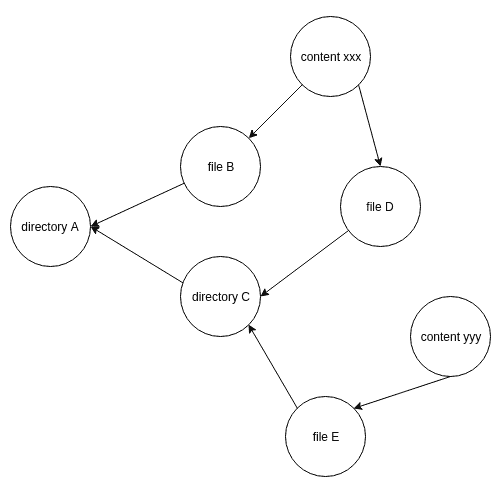

既然我们知道了如何使用 Merkle DAG 保存文件目录，那么如果我们想更改文件的内容呢？我们应该放弃这个 Merkle DAG 节点，创建一个全新的节点吗？解决此问题的更有效方法是使用版本控制系统。文件可以有版本 1、版本 2、版本 3 等。实现版本控制的最简单方法是使用链表，如下图所示：


# 点对点网络

我们了解如何在 IPFS 中保存文件。密钥是**散列**。该值是文件或目录的名称以及文件或目录的内容。如果我们建立一个集中的系统，我们的故事就结束了。我们只需要添加一些其他的东西来创建一个软件来保存文件并根据散列搜索它们。该软件类似于数据库，如 SQLite 或 LevelDB。知识产权基金不是这两种基金；它是一个点对点文件系统，类似于数据库，但分布在各地。换句话说，它是一个分布式哈希表。

IPFS 使用 S/Kademlia（Kademlia 的扩展版本）作为分布式哈希表。在讨论 Kademlia 之前，让我们先讨论一下它的前身。

首先，想象一个哈希表，它类似于 Python 中的字典，如下表所示：

| **键** | **值** |
| 2. | 猫 |
| 5. | 独角兽 |
| 9 | 大象 |
| 11 | 马 |
| 4. | 犀牛 |
| 101 | 蓝鹦鹉 |
| 33 | 龙 |

在 IPFS 中，密钥是散列，而不是数字。但出于演示目的，让我们将其设为一个简单的整数。该值只是动物的简单名称，而不是文件的内容或目录中文件的内容。

现在，假设您有四个节点。节点可以是位于与其他节点不同大陆的计算机。

让我们定义哪个节点包含哪些键：

| **节点** | **键** |
| A. | 2, 9, 11 |
| B | 5. |
| C | 4, 33 |
| D | 101 |

您将此表保存在中央服务器中。其中一个节点将是中心节点。这意味着，如果有人想要访问密钥 5，他们必须在接收到答案（节点 B）之前询问中央服务器。之后，可以将请求定向到节点 B。节点 B 将向数据请求者返回“Unicorn”。

这种方法非常有效；不浪费时间。点对点音乐共享系统 Napster 使用这种方法。缺点是中央服务器是单点故障。对手（不喜欢此信息被传播的人；在 Napster 的案例中，这可能是一家大型音乐公司）可能会攻击中央服务器。

一种解决方案是询问所有节点哪个节点持有密钥，而不是将此信息保留在中心节点中。这就是 Gnutella 所做的。这种设置对审查和来自对手的攻击具有弹性，但它使节点和请求数据的人的生活变得艰难。当接收到许多请求时，节点必须努力工作。此设置称为**泛洪**。它适用于比特币，但不适用于 IPF。

这就是创建分布式哈希表技术的原因。有两种分布式哈希表算法，其中一种是 Kademlia。该算法是由 Petar Maymounkov 和 David Mazières 于 2002 年创建的。它后来被 eDonkey 文件共享平台使用。

# 数据和节点的紧密性概念

在分布式哈希表中，我们不会将数据放在每个节点中。我们根据贴近度的概念将数据放在某些节点中。我们想把数据放在附近的节点上。这意味着我们不仅有节点之间的距离概念，而且还有数据和节点之间的距离概念。

假设在这个分布式哈希表中启动或创建的每个节点都有一个 1 到 1000 之间的 ID。每个节点 ID 都是唯一的，因此最多可以有 1000 个节点。在现实世界中，可能有 1000 多个节点，但这将作为一个示例。假设我们有 10 个节点：

| **节点 ID** |
| 5. |
| 13 |
| 45 |
| 48 |
| 53 |
| 60 |
| 102 |
| 120 |
| 160 |
| 220 |

我们也有一些数据。为了简单起见，本例中的数据只是一些字符串：

| **数据** |
| 独角兽 |
| 飞马座 |
| 猫 |
| 驴 |
| 马 |

为了能够判断该数据是否靠近或远离某些节点，我们需要将该数据转换为 1 到 1000 之间的数字。在现实世界中，您可以散列数据。但对于我们的实际演示，我们将只分配一个随机数：

| **键** | **数据** |
| 54 | 独角兽 |
| 2. | 飞马座 |
| 100 | 猫 |
| 900 | 驴 |
| 255 | 马 |

如果我们想将 Unicorn 数据存储在四个最近的节点中（四个节点只是一个配置号），可以按如下方式完成。首先，你检查钥匙，钥匙是 54。然后，我们想得到距离 54 最近的四个节点。如果选中节点 ID 列表，则最近的四个节点分别为 45、48、53 和 60。因此，我们将独角兽数据存储在这四个节点中。如果我们想要存储 Cat 数据，那么它的键 100 的最近邻是 53、60、102 和 120，因此我们将 Cat 数据存储在这四个节点中

在计算距离时，我们将数据视为一个节点。这就是我们在分布式哈希表中查找数据的方式。数据和节点共享相同的空间。

# 异或距离

然而，在 Kademlia 中，我们不通过十进制减法来测量距离。为了清楚起见，十进制减法只是普通减法。45 和 50 之间的距离是 5。53 和 63 之间的距离是 10。

在 Kademlia 中，通过异或距离来测量距离。3 和 6 之间的异或距离是 5，而不是 3。以下是如何计算它：

3 的二进制版本是 011。6 的二进制版本是 110。我所说的二进制版本是以 2 为基数的数字。XOR 表示*独占或*。使用 XOR 运算，1XOR 0 是 1，1XOR 1 是 0，0XOR 0 是 0，0XOR 1 是 1。如果两个操作数相同，则结果为 0。如果两个操作数不同，则结果为 1。

```py
011
110
---xor
101
```

101 是 5 的二进制版本。

XOR 距离有一些有用的属性，这促使 Kademlia 论文的作者选择 XOR 距离来测量节点之间的距离。

第一个属性是节点到自身的异或距离为 0。距离 ID 为 5 的节点最近的节点是 ID 为 5 的另一个节点或其自身。5 的二进制版本是 0101：

```py
0101
0101
----xor
0000
```

只有在测量节点与自身之间的距离时，才可能出现 0 距离。

第二个特性是不同节点之间的距离是对称的。4 和 8 之间的异或距离与 8 和 4 之间的异或距离相同。4 的二进制版本是 0100，8 的二进制版本是 1000。所以，如果我们用它们的二进制值计算它们之间的距离，我们得到相同的值。4 和 8 之间的异或距离如下所示：

```py
0100
1000
----xor
1100
```

8 和 4 之间的异或距离如下所示：

```py
1000
0100
----xor
1100
```

如果您习惯于使用十进制减法距离，这对您来说是很直观的。

最后一个有用的属性是，节点 X 和节点 Z 之间的距离小于或等于节点 X 和节点 Y 之间的距离加上节点 Y 和 Z 之间的距离。最后一个属性很重要，因为 Kademlia 分布式哈希表中的节点不会保存所有其他节点的地址。它只保存一些节点的地址。但是一个节点可以通过中间节点到达另一个节点。节点 X 知道节点 Y 的地址，但不知道节点 Z 的地址。节点 Y 知道节点 Z 的地址。节点 X 可以从节点 Y 查询节点 Y 的邻居节点。然后，节点 X 可以到达节点 Z，知道到节点 Z 的距离小于或等于节点 X 和节点 Y 的距离加上节点 Y 和节点 Z 的距离。

如果此属性不成立，则节点 X 搜索节点的时间越长，特定节点的距离就越远，这不是我们想要的。但是有了这个属性，来自其他节点的邻居节点的地址可能小于（如果不是相同的话）组合距离。

当您考虑使用异或距离时，您应该认为两个数字共享的前缀越多，这两个数字之间的距离就越短。例如，如果数字共享三个常用前缀，例如 5 和 4，则距离为 1：

```py
0101
0100
----xor
0001
```

同样，对于数字 14 和 15，距离也是 1:

```py
1110
1111
----xor
0001
```

但是，如果比特差异在左侧，例如 5 和 13 的情况，则距离可能较大，在这种情况下为 8：

```py
0101
1101
----xor
1000
```

4 和 5 之间的异或距离为 1，但 5 和 6 之间的异或距离为 3。如果您习惯于十进制减法距离，这是违反直觉的。为了使这个概念更容易解释，让我们创建一个由 1 到 15 的数字组成的二叉树：


仔细看这棵树。4 和 5 之间的异或距离是 1，但 5 和 6 之间的异或距离是 3。如果你看图片，4 和 5 在一个直接分支下，而 5 和 6 在一个更大的分支下，这意味着一个更大的距离。立即分支对应于右侧的位。该直接分支的父分支对应于第二个最右边的位。顶部分支对应于左侧的位。因此，如果数字由顶部分支分隔，则距离至少为 8。8 的二进制版本是 1000。

这只是为了理解的目的；这不是一个严格的数学定义。如果你看一下从 5 到 11 和 5 到 13 的路程，你应该得到大致相同的距离，但事实并非如此。5 和 13 的异或距离是 8，但 5 和 11 的异或距离是 14。

在 Python 中，可以使用`^`运算符对两个数字进行异或运算：

```py
>> 5 ^ 11
14
```

您可以使用`bin`功能将任何十进制数转换为二进制数：

```py
>>> bin(5)
'0b101'
```

然后，如果要将二进制数转换回十进制数，请使用`int`函数：

```py
>>> int('0b101', 2)
5
```

`int`函数的第二个参数指示第一个参数的基数。二进制是基数 2。

# 水桶

现在我们已经讨论了 XOR 距离，我们将看看一个节点如何保存其他节点的地址。节点不会保存分布式哈希表中的所有其他节点。节点可以保存的节点数取决于节点中的位数和*k*配置号。让我们逐一讨论这些问题。

还记得我们以前看到的那棵树吗？它有 16 片叶子。现在想象一下最小的树：

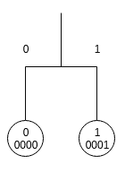

它有两片叶子。让我们把树翻一番：

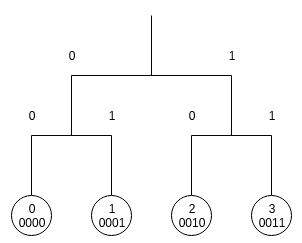

这棵树现在有四片叶子。让我们再加倍：

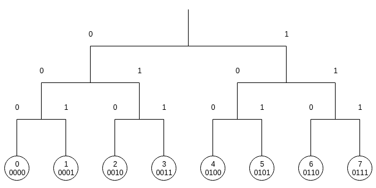

这棵树现在有八片叶子。如果你再把它翻一番，你会有一棵像我们以前的树一样的树，它有 16 片叶子。

我们可以看到的级数是 2，4，8，16。如果我们继续旅行，数字将是 32、64、128 等等。这可以写为 2<sup>1、</sup>2<sup>2、</sup>2<sup>3、</sup>2<sup>4、</sup>2<sup>5</sup>。。。2<sup>n</sup>。

让我们关注一棵有 16 片叶子的树。当我们表示叶数时，必须使用 4 位二进制数，例如 0001 或 0101，因为最大的数字是 15 或 1111。如果我们使用一棵有 64 片叶子的树，我们必须使用一个 6 位数字，比如 0000010101，因为最大可能的数字是 63 或 111111。位号越大，节点必须保存在其地址簿中的节点数量就越大。

然后我们有了*k*配置号。*k*决定一个节点在一个 bucket 中可以保存的最大节点数。存储桶的数量与分布式哈希表中使用的位数相同。在一棵有 16 片叶子的树上，桶的数量是 4。在一棵有 64 片叶子的树上，桶的数量是 6。每个桶对应一个位。假设我们有一棵有 16 片叶子的树，所以每个数字有 4 位，比如 0101 或 1100。这意味着节点有四个 bucket。

第一个铲斗对应于左侧的第一个位。第二个桶对应于左侧的第二个位。第三个铲斗对应于左侧的第三个位。第四个存储桶对应于左侧的第四位。

让我们来看一个有 16 个叶子的树中 ID 3 的节点的例子。现在，我们假设在一棵有 16 片叶子的树中有 16 个节点。在现实世界中，树是稀疏的，许多树枝是空的。

在描述 Kademlia 的论文中，作者使用了 160 个存储桶或 160 位地址。这棵树上的叶子很多。作为比较，2<sup>78</sup>是可见宇宙中的原子数。本文选择的*k*配置号为 20，因此一个节点在其地址簿中最多可以有 3200 个节点。

在这个例子中，假设*k*是 2。这意味着对于每个 bucket，节点将保存另外两个节点。对应于第一位的第一个 bucket 对应于树的另一半，节点不在其中。我们在树的这半部分中有八个节点，但我们只能保存其中的两个节点，因为*k*的编号是 2。让我们为这个 bucket 选择节点 11 和 14。我们将在后面描述如何选择哪些节点进入哪些存储桶。

然后，让我们将节点所在树的一半分割，这样我们有两个分支。第一个分支由 ID 为 0 的节点、ID 为 1 的节点、ID 为 2 的节点和 ID 为 3 的节点组成。第二个分支由 ID 为 4 的节点、ID 为 5 的节点、ID 为 6 的节点和 ID 为 7 的节点组成。第二个分支是第二个桶。此分支中有四个节点，但我们只能保存两个节点。让我们选择 ID 为 4 的节点和 ID 为 5 的节点。

然后，让我们划分节点（ID 为 3 的节点）所在的分支，这样我们有两个小分支。第一个小分支由 ID 为 0 的节点和 ID 为 1 的节点组成。第二个小分支由 ID 为 2 的节点和 ID 为 3 的节点组成。因此，第三个桶是第一个小分支。只有两个节点，一个 ID 为 0 的节点和一个 ID 为 1 的节点，所以我们保存这两个节点。

最后，让我们划分节点（ID 为 3 的节点）所在的小分支，这样我们有两个小分支。第一个分支由 ID 为 2 的节点组成，第二个分支由 ID 为 3 的节点组成。第四个 bucket 或最后一个 bucket 将是由节点 3 组成的分支。

我们之所以保存这一个节点，是因为它小于*k*配置号：


下图显示了完整的四个铲斗。每个 bucket 是源节点不驻留的分支的一半。不同节点的 bucket 配置不同。ID 为 11 的节点可以具有如下所示的 bucket 配置：


让我们看一个特定节点如何找到另一个不驻留在地址簿中的节点的例子。假设*k*配置号为 1。源节点是具有 16 片叶子的树中 ID 为 3 的节点。对于第一个 bucket（由 ID 为 8 到 ID 为 15 的节点组成的最大分支），ID 为 3 的节点保存 ID 为 10 的节点。但是 ID 为 3 的节点希望找到 ID 为 13 的节点。ID 为 3 的节点与 ID 为 10 的节点联系，请求“您能帮我找到 ID 为 13 的节点吗？”。ID 为 10 的节点已将 ID 为 14 的节点保存在其相应的 bucket（由 ID 为 12、13、14 和 15 的节点组成的分支）中。ID 为 10 的节点将 ID 为 14 的节点提供给 ID 为 3 的节点。ID 为 3 的节点向 ID 为 14 的节点询问相同的问题，“您能帮我找到 ID 为 13 的节点吗？”。ID 为 14 的节点没有它，但它的 bucket 中有 ID 为 12 的节点（由 ID 为 12 的节点和 ID 为 13 的节点组成的分支）。ID 为 14 的节点将 ID 为 12 的节点提供给 ID 为 3 的节点。ID 为 3 的节点再次向 ID 为 12 的节点询问相同的问题。这一次，ID 为 12 的节点可以将目标节点或 ID 为 13 的节点给予 ID 为 3 的节点。一个幸福的结局！

下图显示了这些节点：


您是否注意到节点 ID 3 必须重复请求多少次？四次。如果这个数字听起来很熟悉，那是因为这棵树有 16 片叶子，也就是 2<sup>4。</sup>在计算机科学中，到达目的地之前所需的跳跃量的最坏情况是 2 log*n*+*c*。*n*是这棵树有多少片叶子，*c*是常数。

您刚才看到的树有完整的节点；没有空叶子或空树枝。然而，在现实世界中，有空树枝和空树叶。假设你有一棵树，有 1024（2<sup>10</sup>片叶子，*k*号是 3。启动 ID 为 0 的第一个节点。此节点将是源节点。我们将从 ID 为 0 的节点的镜头中看到树：


然后，启动 ID 为 800 的节点：


这棵树将被分成两个桶。然后，启动 ID 为 900 的节点和 ID 为 754 的节点：


如果我们在 bucket 中添加另一个节点呢？让我们启动 ID 为 1011 的节点。ID 为 0 的节点将 ping 最近使用最少的节点，即 ID 为 800 的节点，以查看它是否仍处于活动状态。如果是，它将检查其他节点。如果 ID 为 754 的节点不活动，则该节点将替换为 ID 为 1011 的节点。如果所有节点仍处于活动状态，则 ID 为 1011 的节点将从存储桶中被拒绝。这样做的原因是为了避免新节点淹没系统。我们假设正常运行时间较长的节点是可信的，我们更喜欢这些节点而不是新节点。假设我们拒绝 ID 为 1011 的节点。

首先，我们启动 ID 为 490 的节点。然后，我们拆分 ID 为 0 的节点所在的分支：

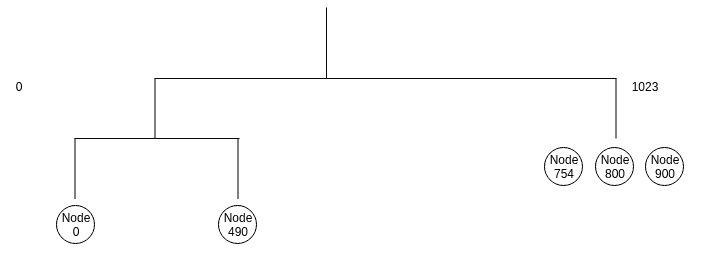

现在，让我们添加 ID 为 230 的节点：

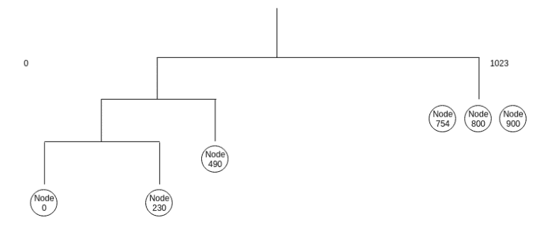

让我们添加 ID 为 60 的节点：

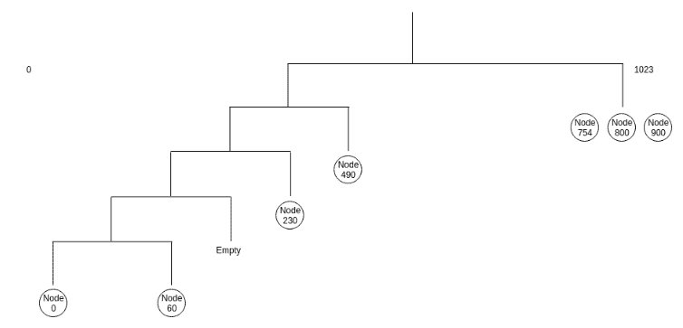

等等每次我们在源节点所在的分支中添加节点时，它都会将 bucket 一分为二，直到达到最低级别。如果我们在源节点不存在的其他分支中添加节点，我们将添加节点，直到达到*k*编号。

您现在已经基本了解了 Kademlia 的工作原理。然而，这并不是全部。如果插入节点，则节点需要告知旧节点其存在。该节点还需要从旧节点获取联系人。我提到，当一个节点插入到源节点所在的分支时，分支会被拆分，但在某些情况下，即使源节点不在其中，分支也会被拆分。发生这种情况的原因是，如果一个分支中至少有*k*个节点，则需要一个节点保留该分支中的所有有效节点，这意味着必须拆分源节点不驻留的分支。

除了路由算法，Kademlia 还有其他重要方面。节点需要每小时重新发布密钥和值（数据）。这是为了预测旧节点离开和新节点加入系统。这些节点距离较近，因此更适合保存数据。还有一种加速查找算法，这样当一个节点查找另一个节点时，我们可以使用更少的步骤。

You can refer to the Kademlia paper for the full specification. [https://pdos.csail.mit.edu/~petar/papers/maymounkov-kademlia-lncs.pdf](https://pdos.csail.mit.edu/~petar/papers/maymounkov-kademlia-lncs.pdf).

IPFS 使用 S/Kademlia，这是 Kademlia 的扩展版本。它不同于原始的 Kademlia 算法，因为 S/Kademlia 有一些安全要求。并非所有节点都以崇高的目的加入 Kademlia 分布式哈希表。因此，在 S/Kademlia 中，要生成节点的 ID，需要节点生成加密密钥对，因此很难篡改节点之间的通信。其他要求包括在节点能够生成其 ID 之前使用工作证明（如比特币和以太坊）。路由算法中也有一些调整，以确保节点能够在对手（如网络中的垃圾邮件节点）中与其他节点通信。

# 总结

在本章中，我们研究了 IPF。我们从 IPFS 项目的动机及其历史开始。虽然 IPFS 不是区块链技术的一部分，但它与区块链相似，因为它补充了区块链技术。然后，我们了解了保存在 IPFS 文件系统中的内容的数据结构。该数据结构是基于 Merkle 树的 Merkle**有向无环图**（**DAG**）。我们创建了简单的 Merkle 树和 Merkle DAG 库来理解这些数据结构的唯一性。Merkle 树提供了一种检查部分数据完整性的简单方法，而 Merkle DAG 用于保存包含文件的目录以及保留文件名。然后，我们了解了 Kademlia 分布式哈希表的对等网络方面。节点之间的距离基于异或距离。节点也保存在 bucket 中，这与位寻址相对应。最后，我们展示了一个节点如何通过跳桶找到其他节点。

在下一章中，我们将使用 IPFS 软件并以编程方式与之交互。***