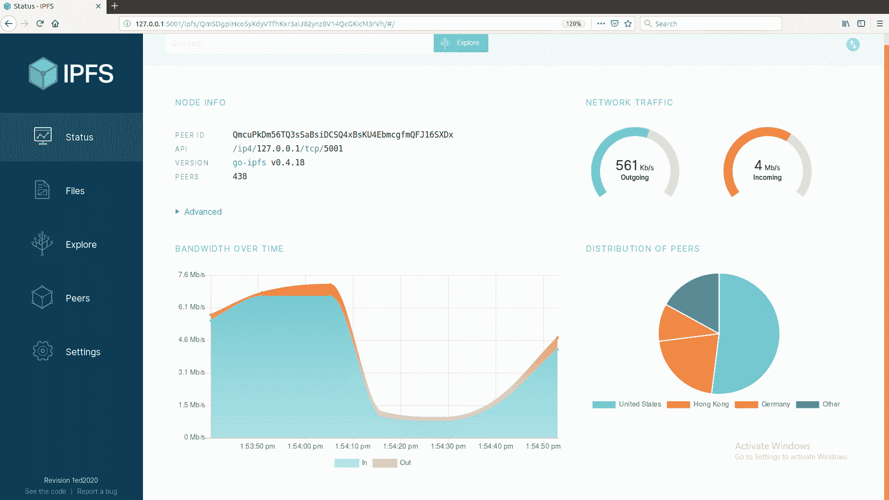
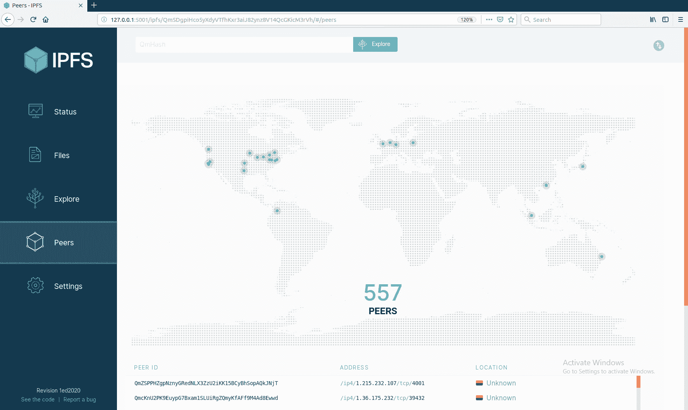
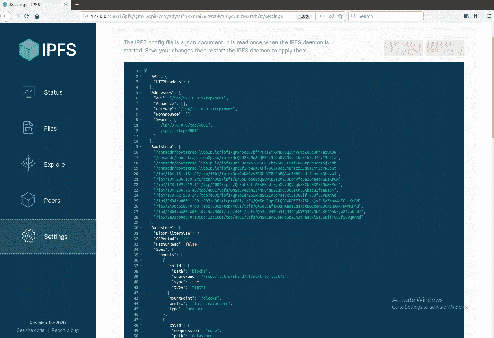
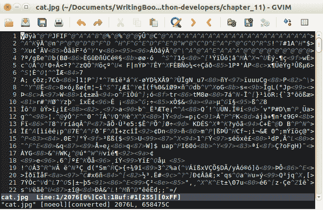

# 使用 ipfsapi 与 IPFS 交互

在本章中，我们将学习如何使用 Python 以编程方式与 IPFS 交互。我们可以在这里进行一些交互，例如添加文件、检索文件、托管可变文件、订阅主题、发布主题，以及将文件复制到**可变文件系统**（**MFS**）。首先，我们必须安装并启动 IPFS 软件。然后，我们将学习如何安装 IPFS Python 库并了解其大部分 API。

在本章中，我们将介绍以下主题：

*   安装 IPFS 软件及其库
*   内容哈希
*   ipfsapi

# 安装 IPFS 软件及其库

在撰写本文时，只有两个 IPFS 实现：`go-ipfs`（用 Go 语言编写）和`js-ipfs`（用 JavaScript 编写）。目前还没有用 Python 编写的 IPFS 实现。Go 实现是比较流行的，所以我们将使用它。

转到，[https://dist.ipfs.io/#go-ipfs](https://dist.ipfs.io/#go-ipfs)，并为您的平台下载软件。对于 Ubuntu Linux，文件名为`go-ipfs_v0.4.18_linux-amd64.tar.gz`。

使用以下命令行提取此命令：

```py
$ tar xvfz go-ipfs_v0.4.18_linux-amd64.tar.gz
```

然后，使用以下命令安装二进制文件：

```py
$ cd go-ipfs
$ sudo ./install.sh
```

此步骤是可选的。这里，我们将`IPFS_PATH`环境变量导出到 shell：

```py
$ export IPFS_PATH=/path/to/ipfsrepo
```

这是`ipfs`存储文件的地方。您可以将此语句存储在`~/.bashrc`中。默认情况下（没有此环境变量），`ipfs`将使用`~/.ipfs`（主目录中的`.ipfs`目录）作为存储数据的位置。

设置环境变量后，初始化`ipfs`本地存储库。您只能执行此步骤一次：

```py
$ ipfs init
```

如果您在云中运行`ipfs`（如 Amazon Web Services、Google 云平台、Digital Ocean 或 Azure），则应使用服务器配置文件标志：

```py
$ ipfs init --profile server
```

如果没有，您将收到云提供商发出的令人讨厌的警告信，因为默认情况下（没有服务器配置文件标志），IPFS`daemon`将执行类似端口扫描的操作。

然后，启动`daemon`，如下所示：

```py
$ ipfs daemon
```

默认情况下，API 服务器正在侦听端口 5001。我们将通过此端口以编程方式与 IPFS 交互。默认情况下，它只在 localhost 中侦听。如果你想把这个端口对外开放，请小心。IPFS 中没有**访问控制列表**（**ACL**）。任何有权访问此端口的人都可以将数据上载到 IPFS。

默认情况下，网关服务器正在侦听端口 8080。我们使用此端口从 IPFS 对等文件系统下载该文件。默认情况下，Swarm 正在侦听端口 4001。这是其他节点从我们的存储下载文件的方式。所有这些端口都可以更改。

IPFS 有一个仪表板，可通过以下链接访问：[http://localhost:5001/webui](http://localhost:5001/webui) 。以下是仪表板的屏幕截图：



如您所见，大多数 IPFS 节点位于美国、中国和德国。

单击 Peers 选项卡以查看 IPFS 节点根据其 IP 地址的分布，如以下屏幕截图所示：



可以在此选项卡中看到节点，包括它们的 IP 地址。如果您关心节点的隐私，请记住隐私功能的开发仍处于初级阶段。

您可以在“设置”选项卡中配置 IPFS 设置，如以下屏幕截图所示：



现在我们的 IPFS 守护进程已经启动，让我们安装我们的`ipfs`Python 库。

打开一个新的终端，因为我们不想打扰我们的守护进程。然后，运行以下命令：

```py
$ virtualenv -p python3.6 ipfs-venv
$ source ipfs-venv/bin/activate
(ipfs-venv) $ pip install ipfsapi
```

在此之前，`ipfs`Python 库被称为`py-ipfs-api`，但后来被重命名为`ipfsapi`。

# 内容哈希

在 IPFS 快速启动文档中（[https://docs.ipfs.io/introduction/usage](https://docs.ipfs.io/introduction/usage) ），他们教你的第一件事就是下载可爱的猫图片。使用以下代码执行此操作：

```py
$ ipfs cat /ipfs/QmW2WQi7j6c7UgJTarActp7tDNikE4B2qXtFCfLPdsgaTQ/cat.jpg >cat.jpg
$ eog cat.jpg 
```

运行上述代码时，将下载 cat 图片，您将获得以下输出：


`eog` is an image viewer in Ubuntu.

为了尊重传统，让我们创建一个 Python 脚本，用 Python 以编程方式下载前面的图像，并将脚本命名为`download_cute_cat_picture.py`：

```py
import ipfsapi

c = ipfsapi.connect()
cute_cat_picture = 'QmW2WQi7j6c7UgJTarActp7tDNikE4B2qXtFCfLPdsgaTQ/cat.jpg'
c.get(cute_cat_picture)
```

执行此脚本后，图像将在您的目录中命名为`cat.jpg`。

正如您可能已经注意到的，在长哈希之后有一个`cat.jpg`文件名。从技术上讲，我们在这里做的是下载一个目录中的文件，其中包含一张可爱的猫图片。如果你愿意，你可以试试这个。为此，请创建另一个脚本并将其命名为`download_a_directory_of_cute_cat_picture.py`，然后运行以下代码：

```py
import ipfsapi

c = ipfsapi.connect()
directory = 'QmW2WQi7j6c7UgJTarActp7tDNikE4B2qXtFCfLPdsgaTQ'
c.get(directory)
```

执行此脚本后，您将在包含此脚本的目录中获得一个名为`QmW2WQi7j6c7UgJTarActp7tDNikE4B2qXtFCfLPdsgaTQ`的目录。如果您查看此目录，您将找到 cat 图片文件。

让我们逐行地查看脚本，以了解“{ To0t}”库的用法。可以使用以下代码导入库：

```py
import ipfsapi
```

以下代码用于获取到 IPFS 守护程序的连接对象：

```py
c = ipfsapi.connect()
```

`connect`方法接受两个参数。最重要的两个参数是`host`和`port`：

```py
c = ipfsapi.connect(host="ipfshost.net", port=5001)
```

默认情况下，我们使用端口 5001 连接到本地主机：

```py
c.get(cute_cat_picture)
```

然后，我们使用来自*c*对象的 IPFS HTTP API 的方法。`get`是用于与 IPFS 守护进程交互的方法之一。对于这种方法，通常有一个与`ipfs`客户端软件等效的参数：

```py
$ ipfs get QmW2WQi7j6c7UgJTarActp7tDNikE4B2qXtFCfLPdsgaTQ/cat.jpg
```

您可能会注意到，在创建第一个 Python 脚本之前，我们在命令行界面中使用了`ipfs cat`命令。然而，在脚本中，我们使用了`get`方法。在`ipfsapi`库中还有`cat`方法。

使用`get`方法下载文件，使用`cat`方法获取文件内容。

让我们创建一个使用`cat`方法的脚本，并将其命名为`cat_cute_cat.py`：

```py
import ipfsapi

c = ipfsapi.connect()
result = c.cat('QmW2WQi7j6c7UgJTarActp7tDNikE4B2qXtFCfLPdsgaTQ/cat.jpg')
with open('cat.jpg', 'wb') as f:
    f.write(result)
```

`cat`方法返回文件内容的 bytes 对象。它接受两个可选参数，`offset`和`length`。`offset`是文件中开始获取内容的位置。`length`是您希望从`offset `位置开始获取的内容长度。如果您希望构建下载管理器（具有暂停和恢复功能）或视频流播放器，则这些参数非常重要。您可能并不总是希望下载整个文件。

现在，让我们向 IPFS 添加一个文件。为此，创建一个简单的文件并将其命名为`hello.txt`。这是文件的内容：

```py
I am a good unicorn.
```

确保字符串后面有新行：

```py
$ cat hello.txt
I am a good unicorn.
$
```

如果命令提示符出现在字符串行之后，则一切正常。你可以继续。

但是，假设命令提示符出现在字符串的右侧，如以下代码块所示：

```py
$ cat hello.txt
I am a good unicorn.$
```

这意味着您没有新行，需要在字符串之后添加新行。

现在，让我们创建一个脚本，将此文件添加到 IPFS 中，并将其命名为`add_file.py`：

```py
import ipfsapi

c = ipfsapi.connect()
result = c.add('hello.txt')
print(result)
```

执行此代码将获得以下输出：

```py
(ipfs-venv) $ python add_file.py
{'Name': 'hello.txt', 'Hash': 'QmY7MiYeySnsed1Z3KxqDVYuM8pfiT5gGTqprNaNhUpZgR', 'Size': '29'}
```

我们可以使用`cat`或`get`方法检索文件的内容，即`I am a good unicorn.\n`。让我们在名为`get_unicorn.py`的脚本中使用`cat`方法，如下代码块所示：

```py
import ipfsapi

c = ipfsapi.connect()
result = c.cat('QmY7MiYeySnsed1Z3KxqDVYuM8pfiT5gGTqprNaNhUpZgR')
print(result)
```

运行此命令将获得以下输出：

```py
(ipfs-venv) $ python get_unicorn.py
b'I am a good unicorn.\n'
```

正如我们在[第 10 章](10.html)*Interplantary–一个全新的文件系统*中提到的，我们通过散列得到文件的内容。通过这种方式，我们只检索内容，而不是文件名。

但如何将`b'I am a good unicorn.\n'`转换为`'QmY7MiYeySnsed1Z3KxqDVYuM8pfiT5gGTqprNaNhUpZgR'`？只是对内容进行散列吗？例如，要`hash`文件的内容，可以使用 SHA-256 哈希函数：

```py
import hashlib
the_hash = hashlib.sha256(b'I am a good unicorn.\n').hexdigest()
```

别那么快！事实证明，您需要先了解 protobuf、multihash 和 base58，才能理解这个过程。让我们在以下几节中讨论这些问题。

# Protobuf

如果您试图安装谷歌开源软件，如`Tensorflow`，您会遇到 protobuf，因为它被`Tensorflow`使用。`Protobuf`是一个序列化库。如果您从官方文档中了解了 Python，您就会知道 Pickle 是一种序列化数据的方法。如果您了解了 web 开发编程，很可能会使用`.json`或`.xml`作为数据序列化。

在我们将`b'I am a good unicorn.\n'`传递给 IPFS 之前，我们将数据包装在一个数据结构中。让我们创建一个脚本来证明我的主张，并将脚本命名为`get_unicorn_block.py`：

```py
import ipfsapi

c = ipfsapi.connect()
result = c.block_get('QmY7MiYeySnsed1Z3KxqDVYuM8pfiT5gGTqprNaNhUpZgR')
print(result)
```

运行脚本将允许您看到文件内容由其他内容包装：

```py
(ipfs-venv) $ python get_unicorn_block.py
b'\n\x1b\x08\x02\x12\x15I am a good unicorn.\n\x18\x15'
```

我们可以看到文件的内容仍然完好无损，`b'I am a good unicorn.\n'`，在神秘的字符串之间。左边和右边的垃圾字符是什么？这是 IPFS 中数据节点的数据结构。

在取消序列化此序列化数据之前，让我们快速了解如何使用`protobuf`：

1.  使用以下命令安装`protobuf-compiler`：

```py
$ sudo apt-get install protobuf-compiler
```

您的`protobuf`编译器是`protoc`：

```py
$ protoc --version
libprotoc 2.6.1
```

2.  然后，让我们使用以下命令安装 Python`protobuf`库：

```py
(ipfs-venv) $ pip install protobuf
```

3.  在使用`protobuf`序列化数据之前，需要先创建数据结构格式。格式必须保存在文件中。我们将格式文件命名为`crypto.proto`并使用以下脚本：

```py
syntax = "proto2";

package crypto;

message CryptoCurrency {
 required string name = 1;
 optional int32 total_supply = 2;

 enum CryptoType {
 BITCOIN = 0;
 ERC20 = 1;
 PRIVATE = 2;
 } required CryptoType type = 3 [default = ERC20];
}
```

当您查看此数据结构时，它就像一个没有方法的结构或类。在声明您使用的语法后，您将声明`package`以避免名称冲突。`message`就像另一种主流编程语言中的类或结构关键字。这个`message`是许多数据类型的封装。在我们的例子中，它们是`string`、`int32`和`enum`。

4.  在用 Python 中的 protobuf 序列化数据之前，我们需要将这个`.proto`文件转换成 Python 模块文件：

```py
$ protoc crypto.proto --python_out=.
```

`python_out`参数用于指示要在哪个目录中输出此 Python 文件。

您应该得到为您生成的`crypto_pb2.py`文件。请参阅 GitLab 链接中的代码文件以获取脚本：[https://gitlab.com/arjunaskykok/hands-on-blockchain-for-python-developers/tree/master/chapter_11](https://gitlab.com/arjunaskykok/hands-on-blockchain-for-python-developers/tree/master/chapter_11) 。

如果您没有阅读文件顶部的注释，请让我为您阅读：不要直接编辑文件。如果要在序列化过程中更改数据结构，可以修改`.proto`文件，然后编译它。现在已经为您生成了这个`Python`库文件，您可以扔掉这个`.proto`文件。但是，最好将其保存起来以备文档使用。

现在，让我们用 Python 脚本测试序列化和非序列化过程。将脚本命名为`serialize_crypto_data.py`：

```py
import crypto_pb2

cryptocurrency = crypto_pb2.CryptoCurrency()
cryptocurrency.name = 'Bitcoin Cash'
cryptocurrency.total_supply = 21000000
cryptocurrency.type = crypto_pb2.CryptoCurrency.BITCOIN

serialized_data = cryptocurrency.SerializeToString()
print(serialized_data)

cryptocurrency2 = crypto_pb2.CryptoCurrency()
cryptocurrency2.ParseFromString(serialized_data)
print(cryptocurrency2)
```

如果执行脚本，将获得以下输出：

```py
(ipfs-venv) $ python serialize_crypto_data.py
b'\n\x0cBitcoin Cash\x10\xc0\xde\x81\n\x18\x00'
name: "Bitcoin Cash"
total_supply: 21000000
type: BITCOIN
```

序列化输出`b'\n\x0cBitcoin Cash\x10\xc0\xde\x81\n\x18\x00'`类似于 IPFS 中的 unicorn 数据块。如果您解析这个二进制数据，您应该得到原始的 Python 对象。

现在您已经了解了 protobuf 的基本用法，让我们回到 IPFS 中的块数据：

```py
(ipfs-venv) $ python get_unicorn_block.py
b'\n\x1b\x08\x02\x12\x15I am a good unicorn.\n\x18\x15'
```

这是 protobuf 中的序列化数据。在取消序列化之前，我们需要获取相关的`.proto`文件。显然，我们需要两个`.proto`文件`unixfs.proto`和`merkledag.proto`。

`unixfs.proto`可从[下载 https://github.com/ipfs/go-unixfs/blob/master/pb/unixfs.proto](https://github.com/ipfs/go-unixfs/blob/master/pb/unixfs.proto) ，而`merkeldag.proto`可从[下载 https://github.com/ipfs/go-merkledag/blob/master/pb/merkledag.proto](https://github.com/ipfs/go-merkledag/blob/master/pb/merkledag.proto) 。

以下代码块是`unixfs.proto`文件的内容：

```py
syntax = "proto2";

package unixfs.pb;

message Data {
    enum DataType {
        Raw = 0;
        Directory = 1;
        File = 2;
        Metadata = 3;
        Symlink = 4;
        HAMTShard = 5;
    }

    required DataType Type = 1;
    optional bytes Data = 2;
    optional uint64 filesize = 3;
    repeated uint64 blocksizes = 4;

    optional uint64 hashType = 5;
    optional uint64 fanout = 6;
}

message Metadata {
    optional string MimeType = 1;
}
```

以下代码块是`merkledag.proto`文件的内容：

```py
package merkledag.pb;

import "code.google.com/p/gogoprotobuf/gogoproto/gogo.proto";

option (gogoproto.gostring_all) = true;
option (gogoproto.equal_all) = true;
option (gogoproto.verbose_equal_all) = true;
option (gogoproto.goproto_stringer_all) = false;
option (gogoproto.stringer_all) =  true;
option (gogoproto.populate_all) = true;
option (gogoproto.testgen_all) = true;
option (gogoproto.benchgen_all) = true;
option (gogoproto.marshaler_all) = true;
option (gogoproto.sizer_all) = true;
option (gogoproto.unmarshaler_all) = true;

...
...

// An IPFS MerkleDAG Node
message PBNode {

  // refs to other objects
  repeated PBLink Links = 2;

  // opaque user data
  optional bytes Data = 1;
}
```

为了简化流程，您应该删除`merkledag.proto`文件中的以下行：

```py
import "code.google.com/p/gogoprotobuf/gogoproto/gogo.proto";

option (gogoproto.gostring_all) = true;
option (gogoproto.equal_all) = true;
option (gogoproto.verbose_equal_all) = true;
option (gogoproto.goproto_stringer_all) = false;
option (gogoproto.stringer_all) =  true;
option (gogoproto.populate_all) = true;
option (gogoproto.testgen_all) = true;
option (gogoproto.benchgen_all) = true;
option (gogoproto.marshaler_all) = true;
option (gogoproto.sizer_all) = true;
option (gogoproto.unmarshaler_all) = true
```

然后，使用以下命令编译两个`.proto`文件：

```py
$ protoc unixfs.proto merkledag.proto --python_out=.
```

完成此操作后，您将获得作为输出生成的`unixfs_pb2.py`和`merkledag_pb2.py`文件。

让我们创建一个脚本来解码块数据，`b'\n\x1b\x08\x02\x12\x15I am a good unicorn.\n\x18\x15'`，并将脚本命名为`unserialize_unicorn.py`*：*

```py
import unixfs_pb2
import merkledag_pb2

outer_node = merkledag_pb2.PBNode()
outer_node.ParseFromString(b'\n\x1b\x08\x02\x12\x15I am a good unicorn.\n\x18\x15')
print(outer_node)

unicorn = unixfs_pb2.Data()
unicorn.ParseFromString(outer_node.Data)
print(unicorn)
```

运行脚本。这将为您提供以下输出：

```py
(ipfs-venv) $ python unserialize_unicorn.py
Data: "\010\002\022\025I am a good unicorn.\n\030\025"

Type: File
Data: "I am a good unicorn.\n"
filesize: 21
```

让我们分析一下这里发生了什么。我们的原始数据`b'I am a good unicorn.\n'`从`unixfs`原型模块包装在`Data`中，然后再从`merkledag`原型模块包装在`PBNode`中。这就是为什么我们首先使用`PBNode`取消序列化脚本中的序列化数据。然后，我们用`Data`取消序列化结果。

# 多重散列

现在，让我们散列序列化数据。IPFS 使用多重散列来散列数据。这意味着它不仅输出散列输出，还输出它使用的散列函数、该散列函数的散列输出长度以及该散列函数的散列输出。

让我们看一看多哈希用法的例子。假设我们要散列的数据是`b'i love you'`。我们选择`sha256`作为散列函数，如下所示：

```py
>>> from hashlib import sha256
>>> sha256(b'i love you').hexdigest()
'1c5863cd55b5a4413fd59f054af57ba3c75c0698b3851d70f99b8de2d5c7338f
```

让我们检查一下这个散列输出的长度：

```py
>>> len('1c5863cd55b5a4413fd59f054af57ba3c75c0698b3851d70f99b8de2d5c7338f')
64
```

由于十六进制格式的数字始终包含两个字符，因此哈希输出的长度为 32（64/2）。但是，我们需要 32 的十六进制版本，即 0x20 或`20`。

There is a hash function table that lists all hash functions that multihash supports (sha1, shake, blake, keccak, and so on). This can be seen here: [https://github.com/multiformats/multicodec/blob/master/table.csv](https://github.com/multiformats/multicodec/blob/master/table.csv).

如您所见，`sha256`被赋予了编号`12`。

现在，我们使用以下命令组合它们：

```py
Hash function + the length of hash output from hash function + hash output from hash function
12 + 20 + 1c5863cd55b5a4413fd59f054af57ba3c75c0698b3851d70f99b8de2d5c7338f
```

或者，我们可以使用以下命令：

```py
12201c5863cd55b5a4413fd59f054af57ba3c75c0698b3851d70f99b8de2d5c7338f
```

我们再来一次，但使用另一个函数，即`sha1`：

```py
>>> from hashlib import sha1
>>> sha1(b'i love you').hexdigest()
'bb7b1901d99e8b26bb91d2debdb7d7f24b3158cf'
>>> len('bb7b1901d99e8b26bb91d2debdb7d7f24b3158cf')
40
```

20（40/2）的十六进制版本为 0x14 或`14`。

`sha1`哈希函数从哈希函数表中获得数字 0x11 或`11`。因此，输出如下：

```py
11 + 14 + bb7b1901d99e8b26bb91d2debdb7d7f24b3158cf
1114bb7b1901d99e8b26bb91d2debdb7d7f24b3158cf
```

那么，为什么要使用多重散列函数，而不仅仅是普通的散列函数，比如`sha1`、`sha256`或`keccak256`？有时争论是散列函数被破坏了，这意味着某人可以在合理的时间内找到具有相同散列输出的两个不同输入。如果发生这种情况，那是非常危险的。哈希用于完整性检查。想象一下，我给你发了一份秘密文件来创造一种治疗癌症的方法。为了确保它不被篡改，我们对该文档进行散列，然后广播散列输出。因此，任何想要学习此文档的人都需要在阅读和执行文档之前先验证文档的哈希值。然而，想象一下我的敌人可以创建一个不同的文档。现在，本文档不是治疗癌症的方法，而是创建病毒的指南，但它仍然具有相同的哈希输出。如果您散列了错误的文档，您将无辜地执行该文件并创建病毒。

如果一个散列函数被破坏了（事实上，`sha1`散列函数已经被破坏了），程序员需要升级他们的系统。但是，他们会遇到困难，因为他们通常会对哈希函数进行假设。例如，如果他们使用`sha1`函数，他们会期望哈希函数的输出长度为 20 个数字。如果他们选择将哈希函数升级为`sha256`，则需要替换处理旧哈希函数时预期长度为 20 个字符的所有代码，这很麻烦。

对于`multihash`，我们希望升级过程能够简化，因为`multihash`函数的输出中嵌入了函数和散列函数输出的长度。我们不再假设散列输出的长度。

如果您仍然无法理解`multihash`的动机，让我们使用以下代码进行实验：

```py
(ipfs-venv) $ pip install pymultihash
(ipfs-venv) $ python
>>> import multihash
>>> the_universal_hash = multihash.digest(b'i love you', 'sha1')
>>> the_universal_hash.verify(b'i love you')
True
```

您是否注意到，当我们想要检查`b'i love you' `数据的完整性时，我们没有对哈希输出的长度进行假设？然后我们发现了坏消息，`sha1`散列函数坏了。为了升级我们的系统，我们需要做的只是将`'sha1'`字符串替换为`'sha2_256'`字符串：

```py
>>> the_universal_hash = multihash.digest(b'i love you', 'sha2_256')
>>> the_universal_hash.verify(b'i love you')
True
```

通过使用多重散列，升级 IPFS 软件中的散列函数变得很容易。哈希函数只是一个配置问题。

# 基地 58

我们最不需要学习的是`base58`。Base58 是`base64`的修改版本。这通常用于将二进制数据编码为 ASCII 字符串。以下代码块用于将`b'i love you'`编码为 ASCII 字符串：

```py
>>> import base64
>>> base64.b64encode(b'i love you')
b'aSBsb3ZlIHlvdQ=='
```

`base64`模块是 Python 标准库的一部分。

通常，您不会使用`base64`对另一个 ASCII 字符串进行编码。相反，您将对二进制数据（如图像文件）进行编码。如果您使用文本编辑器打开`cat.jpg`，您将得到类似于以下屏幕截图所示文本的乱码文本：



这是一个使用`base64`编码的完美示例。为什么要用`base64`对二进制数据进行编码？其中一个用例是，如果你想在给朋友的电子邮件中附上一张可爱的猫图片。电子邮件协议不允许二进制数据。下面的代码块显示了如果我们附加图片，结果将是什么：

```py
>>> c = None
>>> with open('cat.jpg', 'rb') as f:
...     c = f.read()
... 
>>> import base64
>>> base64.b64encode(c)
b'/9j/4AAQSkZJRgABAQIAJQAlAAD/2wBDAAEBAQEBAQEBAQEBAQEBAQEBAQEBAQEBAQEBAQEBAQEBAQEBAQEBAQEBAQEBAQEBAQEBAQEBAQEBAQEBAQEBAQH/2wBDAQEBAQEBAQEBAQEBAQEBAQEBAQEBAQEBAQEBAQEBAQEBAQEBAQEBAQEBAQEBAQEBAQEBAQEBAQEBAQEBAQEBAQH/wAARCAMgBQADASIAAhEBAxEB/8QAHwAAAAYDAQEBAAAAAAAAAAAAAAQFBgcIAgMJCgEL/8QAbhAAAAQCBgQJCAYHBQQGBQIXAgMEBQEGAAcREhMhFCMxQQgiJDNRYXGB8BUyNEORobHBQkRT0eHxCRYlUlRjczViZHSDF3KEkyZFgpSjszZVZZKkw9MKGHWitMRWhdTj5Eay8xkndoaVlsLS4v/EABwBAAEFAQEBAAAAAAAAAAAAAAACAwQFBgcBCP/EAEwRAAAEBAIIBAUDAgQFAgUCBwECAxEABCExQVEFEhNhcYGR8KGxwdEGFCIj4TIz8SRDBxVCUzREUmJjFnNUco……………...s0fQyVCRRbpSWOyyylf5pKJGnOLTlixICLAcYL6fZ25/hSCW3hIrDGFOwjWKFEvluXlXQ8MosvyoeVg4umYFuP8AV4psrOiyiO8V8M5xBw1BwcG8WAJeNhmW5/du25QypGNKzQKJcAEXxthvCtWiuBRPVVA9twcApcfLHKP/2Q=='
```

使用`base64`编码的过程（如何将`b'i love you'`转换为`b'aSBsb3ZlIHlvdQ=='`）超出了本书的范围。如果您足够好奇，可以查看`base64`规范。

既然您已经熟悉了`base64`，那么`base58`将非常简单。在`base58`编码中，打印时不明确的字母，如 0、O、I 和 l 将被删除。+和/（斜杠）字符也将被删除。这种`base58`编码由 Satoshi Nakamoto 设计，用于编码大整数。简而言之，比特币地址只是一个非常大的整数。如果您曾经以加密货币（不一定是比特币）转账过任何金额，您很可能会仔细检查地址以确保地址正确。例如，您想将 1 枚比特币转移到您祖母的比特币地址，而她的地址是`1BvBMSEYstWetqTFn5Au4m4GFg7xJaNVN2`。如果你像大多数人一样，你会多次验证地址的正确性，以确保地址没有错误。通过删除不明确的字符，如 0、O、I 和 l，您会发现更容易确保此地址是它应该是的地址。Base58 是软件中用于解决此问题的优秀 UX 设计之一。

所以，`base58`不是设计用来编码可爱的猫图片的。你可以使用`base64`编码来达到这个目的。

让我们安装`base58`库进行实验：

```py
>>> import base58
>>> base58.b58encode(b'i love you')
b'6uZUjTpoUEryQ8'
```

通过使用`base58`，我们可以创建一个长的十六进制字符串，可以用我们自己的眼睛轻松地检查和验证。

# 组合 protobuf、multihash 和 base58

既然您已经了解了 protobuf、multihash 和 base58，我们终于可以理解`b'I am a good unicorn.\n'`文件的内容是如何变成`'QmY7MiYeySnsed1Z3KxqDVYuM8pfiT5gGTqprNaNhUpZgR'`的。

`b'I am a good unicorn.\n'`数据被包装在 IPFS 节点中，并用 protobuf 序列化为`b'\n\x1b\x08\x02\x12\x15I am a good unicorn.\n\x18\x15'`。下面是如何在 Python 中实现这一点。

创建脚本并将其命名为`serialize_unicorn.py`：

```py
import unixfs_pb2
import merkledag_pb2

precious_data = b'I am a good unicorn.\n'

unicorn = unixfs_pb2.Data()
unicorn.Type = unixfs_pb2.Data.File
unicorn.Data = precious_data
unicorn.filesize = len(precious_data)

serialized_unicorn_node = unicorn.SerializeToString()

outer_node = merkledag_pb2.PBNode()
outer_node.Data = serialized_unicorn_node
print(outer_node.SerializeToString())
```

运行它。您应该获得以下输出：

```py
(ipfs-venv) $ python serialize_unicorn.py
b'\n\x1b\x08\x02\x12\x15I am a good unicorn.\n\x18\x15'
```

然后，将该 protobuf 序列化数据用`sha256`散列到`'912d1af8f0013cd12a514859d20e9a196eb2845981408a84cf3543bb359a4536'`（IPFS 中的多散列默认使用`sha256`散列函数）。

以下是如何在 Python 中执行此操作：

```py
>>> import hashlib
>>> hashlib.sha256(b'\n\x1b\x08\x02\x12\x15I am a good unicorn.\n\x18\x15').hexdigest()
'912d1af8f0013cd12a514859d20e9a196eb2845981408a84cf3543bb359a4536'
```

IPFS 使用的多哈希表中的`sha256`函数数为 12。可以在这里看到该表：[https://github.com/multiformats/multicodec/blob/master/table.csv](https://github.com/multiformats/multicodec/blob/master/table.csv) 。

散列输出的长度为`32`，或十六进制的 0x20。一个十六进制数占用两个字符：

```py
>>> len('912d1af8f0013cd12a514859d20e9a196eb2845981408a84cf3543bb359a4536') // 2
32
>>> hex(32)
'0x20'
```

让我们将它们连接起来：

```py
12 + 20 + 912d1af8f0013cd12a514859d20e9a196eb2845981408a84cf3543bb359a4536
1220912d1af8f0013cd12a514859d20e9a196eb2845981408a84cf3543bb359a4536
```

如果您将此输出编码为 base58 编码，则应获得`'QmY7MiYeySnsed1Z3KxqDVYuM8pfiT5gGTqprNaNhUpZgR'`。

下面是如何在 Python 中实现这一点。`b58encode()`方法只接受字节对象，不接受十六进制对象，所以必须先将十六进制字符串转换成字节对象：

```py
>>> import codecs
>>> codecs.decode('1220912d1af8f0013cd12a514859d20e9a196eb2845981408a84cf3543bb359a4536', 'hex')
b'\x12 \x91-\x1a\xf8\xf0\x01<\xd1*QHY\xd2\x0e\x9a\x19n\xb2\x84Y\x81@\x8a\x84\xcf5C\xbb5\x9aE6'
```

`codecs`是 Python 标准库的一部分。

执行代码后，您将获得以下输出：

```py
>>> base58.b58encode(b'\x12 \x91-\x1a\xf8\xf0\x01<\xd1*QHY\xd2\x0e\x9a\x19n\xb2\x84Y\x81@\x8a\x84\xcf5C\xbb5\x9aE6')
b'QmY7MiYeySnsed1Z3KxqDVYuM8pfiT5gGTqprNaNhUpZgR'
```

瞧！这个难题终于解决了。

# ipfsapi

让我们回到 ipfsapi 的 API。我们添加了一个带有 IPFS API 的文件，并收到了用于引用文件内容的哈希。但是如果我们添加一个大文件，它将被分成许多块。这是为了提高效率。

让我们从 Unsplash 下载一个相当大的图像文件。转到，[https://unsplash.com/photos/UBtUB4Qc-_4](https://unsplash.com/photos/UBtUB4Qc-_4) 下载图像文件。下载文件的名称为`milada-vigerova-1284157-unsplash.jpg`。将其与 IPFS Python 脚本文件放在同一目录中。您可以为此使用任何图像文件，但请确保其大小至少为 1MB。但是，如果使用另一个图像文件，则应获得不同的哈希值。

使用以下代码块创建名为`add_image_file.py`的脚本：

```py
import ipfsapi

c = ipfsapi.connect()
result = c.add('dose-juice-1184429-unsplash.jpg')
print(result)
```

运行它。您应该获得以下输出：

```py
(ipfs-venv) $ python add_image_file.py
{'Name': 'milada-vigerova-1284157-unsplash.jpg', 'Hash': 'QmV5KPoHHqbq2NsALniERnaYjCJPi3UxLnpwdTkV1EbNZM', 'Size': '2604826'}
```

接下来，创建另一个脚本，列出此块中的所有块，并将脚本命名为`list_blocks.py`：

```py
import ipfsapi
import pprint

c = ipfsapi.connect()
blocks = c.ls('QmV5KPoHHqbq2NsALniERnaYjCJPi3UxLnpwdTkV1EbNZM')
pp = pprint.PrettyPrinter(indent=2)
pp.pprint(blocks)
```

`pprint`是 Python 标准库的一部分。

运行脚本。您应该获得以下输出：

```py
(ipfs-venv) $ python list_blocks.py
{ 'Objects': [ { 'Hash': 'QmV5KPoHHqbq2NsALniERnaYjCJPi3UxLnpwdTkV1EbNZM',
 'Links': [ { 'Hash': 'Qmahxa3MABVtHWh7b2cbQb9hEfiuvwKeYceaqrW8pZjemV',
 'Name': '',
 'Size': 262158,
 'Type': 2},
 { 'Hash': ...
... 'QmbSa1vj3c1edyKFdTCaT88pYGTLS9n2mpRuL2B2NLUygv',
 'Name': '',
 'Size': 244915,
 'Type': 2}]}]}
```

正如我在[第 10 章](10.html)、*行星际—一个全新的文件系统*中所解释的，由于内存问题，大文件不会立即散列。相反，它将被分成许多块。除最后一个块外，每个块的大小为 262158 字节。但是，您可以配置块的大小。每个区块将分别散列。然后，文件内容的根散列就是这些散列的组合。IPFS 使用 Merkle 树来计算根哈希。当然，在使用 protobuf 序列化之前，必须将每个块包装在 IPFS 节点中。然后，将有一个容器节点，其中包含指向这些块的所有链接。

您可以在没有`.proto`文件的情况下对以下 IPFS 块进行反向工程：

```py
{'Name': 'milada-vigerova-1284157-unsplash.jpg', 'Hash': 'QmV5KPoHHqbq2NsALniERnaYjCJPi3UxLnpwdTkV1EbNZM', 'Size': '2604826'}
```

记住此图像文件中的哈希值。获取此文件内容的 IPFS 块。您可以使用 Python 脚本或 IPFS 命令行实用程序执行此操作：

```py
$ ipfs block get QmV5KPoHHqbq2NsALniERnaYjCJPi3UxLnpwdTkV1EbNZM > block.raw
```

我们将二进制格式的块保存到一个二进制文件中。然后，我们可以使用`protoc`编译器`decode`这个二进制文件。

```py
$ protoc --decode_raw < block.raw
```

您应该得到以下结果：

```py
2 {
  1 {
    2: "\267\301\242\262\250qw\216+\237\301\273\'\360%\"\2022\201#R\364h\262$\357\227\2355\244>x"
  }
  2: ""
  3: 262158
}
...
...
1 {
  1: 2
  3: 2604197
  4: 262144
  4: 262144
...
...
  4: 262144
  4: 244901
}

```

您可能熟悉这种结构。在没有 proto 文件的情况下解码 protobuf 中的序列化数据时，问题是必须猜测 1、2、3 和 4 在某个块中的含义。如果你有原始文件，这一行，`3: 2604197`将变成`filesize: 2604197`。因此，在对 protobuf 中的序列化数据进行解码之前获取 proto 文件是一个好主意。

我们可以从这些块重建原始文件。让我们创建脚本并将其命名为`construct_image_from_blocks.py`：

```py
import ipfsapi

c = ipfsapi.connect()

images_bytes = []

blocks = c.ls('QmV5KPoHHqbq2NsALniERnaYjCJPi3UxLnpwdTkV1EbNZM')
for block in blocks['Objects'][0]['Links']:
    bytes = c.cat(block['Hash'])
    images_bytes.append(bytes)

images = b''.join(images_bytes)
with open('image_from_blocks.jpg', 'wb') as f:
    f.write(images)
```

运行脚本后，如果打开`image_from_blocks.jpg`，将查看原始图像文件。

我们添加了一个文件。现在，让我们尝试添加一个文件目录。

创建一个名为`mysite`的目录。在该目录中，创建一个名为`img`的目录。将`cat.jpg`映像文件放入此`img`目录中。然后，在`img`目录旁创建一个名为`index.html`的文件。

以下代码块是`index.html`的内容：

```py
<html>
  <head>
    <link href="https://stackpath.bootstrapcdn.com/bootstrap/4.2.1/css/bootstrap.min.css" rel="stylesheet" integrity="sha384-GJzZqFGwb1QTTN6wy59ffF1BuGJpLSa9DkKMp0DgiMDm4iYMj70gZWKYbI706tWS" crossorigin="anonymous">
  </head>
  <body>
    
  </body>
</html>
```

然后，在`img`目录旁边创建一个`README.md`文件。以下代码块是`README.md`文件的内容：

```py
This is Readme file.
```

现在，创建一个 Python 脚本，将此目录添加到 IPFS 中，并将脚本命名为`add_directory.py`：

```py
import ipfsapi
import pprint

c = ipfsapi.connect()
result = c.add('mysite', True)

pp = pprint.PrettyPrinter(indent=2)
pp.pprint(result)
```

运行脚本将提供以下输出：

```py
(ipfs-venv) $ python add_directory.py
[ { 'Hash': 'QmWhZDjrm1ncLLRZ421towkyYescK3SUZdWEM5GxApfxJe',
 'Name': 'mysite/README.md',
 'Size': '29'},
 { 'Hash': 'QmUni2ApnGhZ89JEbmPZQ1QU9wcinnCoujjrYAy9TCQQjj',
 'Name': 'mysite/index.html',
 'Size': '333'},
 { 'Hash': 'Qmd286K6pohQcTKYqnS1YhWrCiS4gz7Xi34sdwMe9USZ7u',
 'Name': 'mysiimg/cat.jpg',
 'Size': '443362'},
 { 'Hash': 'QmW2WQi7j6c7UgJTarActp7tDNikE4B2qXtFCfLPdsgaTQ',
 'Name': 'mysite/img',
 'Size': '443417'},
 { 'Hash': 'QmZamPcNnfZjjTkoyrYjYMEA8pp29KmpmkuSvkicSGiZDp',
 'Name': 'mysite',
 'Size': '443934'}]
```

`add`方法的第二个参数涉及`recursive`参数。IPFS 使用 Merkle DAG 数据结构保存此文件目录。

我们可以使用以下 URL 在浏览器中打开我们的网站：`http://localhost:8080/ipfs/QmZamPcNnfZjjTkoyrYjYMEA8pp29KmpmkuSvkicSGiZDp/`。以下屏幕截图是网站在浏览器中的显示方式：


您还可以使用以下 URL 从另一个网关（使用另一个节点）访问 IPFS 路径：[https://ipfs.io/ipfs/QmZamPcNnfZjjTkoyrYjYMEA8pp29KmpmkuSvkicSGiZDp/](https://ipfs.io/ipfs/QmZamPcNnfZjjTkoyrYjYMEA8pp29KmpmkuSvkicSGiZDp/) 。根据您的 internet 连接，这可能需要一些时间，因为 ipfs.io 服务器中的节点需要定位计算机中的内容。

# 互穿网络

能够发布一个文件或一个文件目录，其中文件的完整性由哈希保护，这是非常棒的。但是，有时您可能希望能够发布具有相同链接的动态文件。我在这里的意思是，散列链接会在不同的时间生成不同的内容。其中一个用例是您想要发布新闻。视情况而定，新闻每分钟或每小时都可能发生变化。

这样做的方式是使用**行星际名称系统**（**IPN**）。哈希链接来自 IPFS 节点中的加密密钥。当我们启动 IPFS 守护进程时，我们成为 IPFS 对等网络中众多节点中的一个。我们的身份是基于加密密钥的。

让我们创建两个星座预测。这里的预测应该随着时间的推移而改变。第一个文件名为`horoscope1.txt`，该文件的内容在以下代码块中给出：

```py
You will meet the love of your life today!
```

第二个文件名为`horoscope2.txt`，该文件的内容在以下代码块中给出：

```py
You need to be careful when going outside!
```

让我们使用这个名为`add_horoscope_predictions.py`的 Python 脚本添加这两个文件：

```py
import ipfsapi

c = ipfsapi.connect()
result = c.add('horoscope1.txt')
print(result)
result = c.add('horoscope2.txt')
print(result)
```

运行此命令将获得以下输出：

```py
(ipfs-venv) $ python add_horoscope_predictions.py
{'Name': 'horoscope1.txt', 'Hash': 'QmTG4eE6ruUDhSKxqwofJXXqDFAmNzQiGdo4Z7WvVdLZuS', 'Size': '51'}
{'Name': 'horoscope2.txt', 'Hash': 'Qme1FUeEhA1myqQ8C1sCSXo4dDJzZApGD6StE26S72ZqyU', 'Size': '51'}
```

注意我们在输出中获得的这两个散列。

现在，创建一个脚本，列出我们所有的键，并将脚本命名为`keys_list.py`：

```py
import ipfsapi

c = ipfsapi.connect()
print(c.key_list())
```

运行上述脚本将获得以下输出：

```py
(ipfs-venv) $ python keys_list.py
{'Keys': [{'Name': 'self', 'Id': 'QmVPUMd7mFG54zKDNNzPRgENsr5VTbBxWJThfVd6j9V4U8'}]}
```

现在，让我们发布我们的第一个星座预测。使用以下代码块创建名为`publish_horoscope1.py`的 Python 脚本：

```py
import ipfsapi

c = ipfsapi.connect()
peer_id = c.key_list()['Keys'][0]['Id']
c.name_publish('QmY7MiYeySnsed1Z3KxqDVYuM8pfiT5gGTqprNaNhUpZgR')
result = ipfs.cat('/ipns/' + peer_id)
print(result)
```

运行此操作可能需要一段时间。在 IPN 中发布文件有点慢。如果您足够耐心，您将获得以下输出：

```py
(ipfs-venv) $ python publish_horoscope1.py
b'You will meet the love of your life today!\n'
```

您可以使用`name_publish()`方法发布内容。它接受内容的哈希链接（IPFS 路径，而不是文件名）作为第一个参数。

然后，要从 IPFS 访问内容，可以使用`cat`或`get`方法。这里，我们使用的是`cat`方法。`cat`方法的参数不是散列链接或 IPFS 路径，而是 IPNS 路径，它只是您可以从`keys_list.py`脚本获得的密钥。您必须以`'/ipns/'`字符串作为前缀。因此，IPNS 路径为`'/ipns/ QmVPUMd7mFG54zKDNNzPRgENsr5VTbBxWJThfVd6j9V4U8'`。

现在，让我们发布更多数据。使用以下代码块创建名为`publish_horoscope2.py`的脚本：

```py
import ipfsapi

c = ipfsapi.connect()
peer_id = c.key_list()['Keys'][0]['Id']
c.name_publish('Qme1FUeEhA1myqQ8C1sCSXo4dDJzZApGD6StE26S72ZqyU')
result = ipfs.cat('/ipns/' + peer_id)
print(result)
```

运行此操作将得到与前一个不同的结果：

```py
(ipfs-venv) $ python publish_horoscope2.py
b'You need to be careful when going outside!\n'
```

IPNS 路径`'ipns/ QmVPUMd7mFG54zKDNNzPRgENsr5VTbBxWJThfVd6j9V4U8'`仍然是相同的，但我们得到了不同的结果。

这很有趣，但我们是否仅限于一条 IPNS 路径？不可以。您可以生成另一个密钥，以便拥有另一个 IPNS 路径。

使用以下代码块创建名为`generate_another_key.py`的 Python 脚本：

```py
import ipfsapi

c = ipfsapi.connect()
print(c.key_list())
c.key_gen('another_key', 'rsa')
print(c.key_list())
```

运行上述脚本将获得以下输出：

```py
(ipfs-venv) $ python generate_another_key.py
{'Keys': [{'Name': 'self', 'Id': 'QmVPUMd7mFG54zKDNNzPRgENsr5VTbBxWJThfVd6j9V4U8'}]}
{'Keys': [{'Name': 'self', 'Id': 'QmVPUMd7mFG54zKDNNzPRgENsr5VTbBxWJThfVd6j9V4U8'}, {'Name': 'another_key', 'Id': 'QmcU8u2Koy4fdrSjnSEjrMRYZVPLKP5YXQhLVePfUmjmkv'}]}
```

您从`'another_key'`开始的新 IPNS 路径是`'/ipns/ QmcU8u2Koy4fdrSjnSEjrMRYZVPLKP5YXQhLVePfUmjmkv'`。

然后，当您想要在 IPNS 路径上发布内容时，只需使用`name_publish()`中的`key`参数即可。使用以下代码块创建名为`publish_horoscope1_in_another_ipns.py`的脚本：

```py
import ipfsapi

c = ipfsapi.connect()
peer_id = c.key_list()['Keys'][1]['Id']
c.name_publish('QmTG4eE6ruUDhSKxqwofJXXqDFAmNzQiGdo4Z7WvVdLZuS', key='another_key')
result = c.cat('/ipns/' + peer_id)
print(result)
```

运行它。你应该得到第一个星座预测。正如您所观察到的，我们使用另一个对等 ID。请注意`peer_id = c.key_list()['Keys'][1]['Id']`中的索引 1。之前，我们使用了索引 0。

在 IPN 中发布不会永远存储它。默认情况下，它存储 IPFS 文件 24 小时。您可以使用`name_publish()`中的`lifetime`关键字更改持续时间。例如，如果您想在 IPNS 中发布`5h`的 IPFS 文件，您可以改为：

```py
c.name_publish('QmTG4eE6ruUDhSKxqwofJXXqDFAmNzQiGdo4Z7WvVdLZuS', key='another_key', lifetime='5h')
```

# 钉住

如果要删除 IPFS 上的文件，该怎么办？假设您使用`ipfs add`命令意外添加了自己的裸体照片：

```py
$ ipfs add nude_picture.jpg
added QmWgMcTdPY9Rv7SCBusK1gWBRJcBi2MxNkC1yC6uvLYPwK nude_picture.jpg
2.64 MiB / 2.64 MiB [==================================================] 100.00%
```

如何删除你的裸体照片？没有`ipfs rm QmPCqvJHUs517pdcFNZ7EJMKcjEtbUBUDYxZcwsSijRtBx`这样的东西，因为这个命令没有任何意义。它应该做什么？告诉保存裸体图片的每个节点删除图片？这将破坏知识产权框架的崇高目标。您可以做的是删除 IPFS 本地存储上的图片。IPFS 中删除本地文件的术语称为*删除 pin*。删除裸体图片文件的 pin 后，内容仍在 IPFS 本地存储中。但是当 IPFS 的垃圾收集器清理对象时，它会删除裸体图片文件的内容。希望没有人有机会在他们的节点上锁定（下载）这个敏感文件！

让我们创建一个脚本来删除 pin，并让垃圾收集器完成它的工作。将脚本命名为`removing_nude_picture.py`：

```py
import ipfsapi

c = ipfsapi.connect()
c.pin_rm('QmWgMcTdPY9Rv7SCBusK1gWBRJcBi2MxNkC1yC6uvLYPwK')
c.repo_gc()
```

运行脚本。然后，如果您尝试获取裸体照片的内容，则会失败：

```py
(ipfs-venv) $ ipfs get QmWgMcTdPY9Rv7SCBusK1gWBRJcBi2MxNkC1yC6uvLYPwK

```

当然，如果有人已经将你的裸体图片固定在另一个节点上，那么你仍然可以获得你的裸体图片的内容。

本例中的裸体图片基本上是熊猫的裸体图片，可以从 Unsplash 网站下载：[https://unsplash.com/photos/IgdVdJCmzf4](https://unsplash.com/photos/IgdVdJCmzf4) 。如果您在本例中使用此图片，请准备好其他人也会使用它。要测试删除 pin 是否真的有效，您可以使用一个世界上没有人拥有的真正唯一的文件。通过解析 IPFS 存储路径中的`LevelDB`文件，可以检查该文件是否已在本地存储中被删除。然而，这超出了本书的范围。

# Pubsub

IPFS 有一个实验特性，即**发布-订阅**或**发布-订阅**。基本上，IPFS 中的节点可以订阅主题。假设这个话题是比特币话题。IPFS 中的节点可以向月球发布*！*比特币主题的信息。然后，订阅“比特币”主题的任何节点都可以获得该消息。

因为 pubsub 是一个实验性的特性，所以需要使用特定的标志运行 IPFS 守护程序。使用以下命令运行带有`--enable-pubsub-experiment`标志的 IPFS 守护程序：

```py
$ ipfs daemon --enable-pubsub-experiment
```

订阅服务器和发布服务器都需要使用此特定标志运行守护程序。

让我们创建一个脚本来订阅某个主题，并将该脚本命名为`subscribe_topic.py`：

```py
import ipfsapi
from base64 import b64decode

c = ipfsapi.connect()
with c.pubsub_sub('bitcoin') as sub:
    for message in sub:
        string = b64decode(message['data'])
        print(string)
        break
```

订阅主题的方式为`pubsub_sub`。第一个参数是我们想要订阅的主题。当我们从订阅中收到数据时，我们还将获得有关发件人的信息。然而，就目前而言，我们只关心信息。这条信息是用`base64`编码的，所以我们必须先对它进行解码。

运行脚本。这将等到收到任何消息后再退出。

让我们创建一个要发布到此主题的脚本，并将该脚本命名为`publish_topic.py`：

```py
import ipfsapi

c = ipfsapi.connect()
c.pubsub_pub('bitcoin', 'To the moon!')
```

It would be better if you run this script in another computer so you can marvel at the wonder of the decentralized technology. Don't forget that you must run the IPFS daemon with a particular flag. But if you are lazy, you could run this script in the same computer.

在订阅脚本运行时，运行发布脚本。

然后，在运行订阅脚本的终端中，应获得以下输出：

```py
(ipfs-venv) $ python subscribe_topic.py
b'To the moon!'
```

那么，pubsub 有什么好处呢？首先，您可以构建一个通知系统。假设您为您的家庭运行一个家庭文件共享系统。当您添加女儿的照片时，您希望通知所有家庭成员。不仅仅是通知；您可以构建一个分散的聊天系统（比如 IRC 或 Slack）。当和其他技术（如无内容复制数据类型）结合使用时，您甚至可以在 IPFS 之上构建一个分散的在线结对编程系统！

请注意，pubsub 仍然是实验性功能。IPF 的开发者有许多有趣的计划正在酝酿中。其中最有趣的一个计划是，基于加密密钥在 pubsub 系统的顶部添加一个身份验证系统。现在，每个人都可以发布和订阅一个主题。

# 可变文件系统

IPFS 有一个称为可变文件系统（MFS）的特性。MFS 与您的操作系统文件系统不同。让我们创建一个脚本来探索此功能，并将脚本命名为`exploring_mfs.py`：

```py
import ipfsapi
import io

c = ipfsapi.connect()

print("By default our MFS is empty.")
print(c.files_ls('/')) # root is / just like Unix filesystem

print("We can create a directory in our MFS.")
c.files_mkdir('/classical_movies')

print("We can create a file in our MFS.")
c.files_write('/classical_movies/titanic',
              io.BytesIO(b"The ship crashed. The end."),
              create=True)

print("We can copy a file in our MFS.")
c.files_cp('/classical_movies/titanic',
           '/classical_movies/copy_of_titanic')

print("We can read the file.")
print(c.files_read('/classical_movies/titanic'))

print("We can remove the file.")
print(c.files_rm('/classical_movies/copy_of_titanic'))

print("Now our MFS is not empty anymore.")
print(c.files_ls('/'))
print(c.files_ls('/classical_movies'))

print("You can get the hash of a path in MFS.")
print(c.files_stat('/classical_movies'))

print("Then you can publish this hash into IPNS.")
```

运行此命令将获得以下输出：

```py
(ipfs-venv) $ python exploring_mfs.py
By default our MFS is empty.
{'Entries': None}
We can create a directory in our MFS.
We can create a file in our MFS.
We can copy a file in our MFS.
We can read the file.
b'The ship crashed. The end.'
We can remove the file.
[]
Now our MFS is not empty anymore.
{'Entries': [{'Name': 'classical_movies', 'Type': 0, 'Size': 0, 'Hash': ''}]}
{'Entries': [{'Name': 'titanic', 'Type': 0, 'Size': 0, 'Hash': ''}]}
You can get the hash of a path in MFS.
{'Hash': 'QmNUrujevkYqRtYmpaj2Af1DvgR8rt9a7ApyiyXHnF5wym', 'Size': 0, 'CumulativeSize': 137, 'Blocks': 1, 'Type': 'directory'}
Then you can publish this hash into IPNS
```

您可能想知道这个功能的意义是什么。在 MFS 中，没有什么是在 OS 文件系统中做不到的。在这个特定的例子中，是的，你是对的，这个特性是没有意义的。但在复制文件时，MFS 和 OS 文件系统之间有一个细微的区别。让我们创建一个脚本来证明这个断言，并将脚本命名为`copy_in_mfs.py`：

```py
import ipfsapi

c = ipfsapi.connect()
c.files_cp('/ipfs/QmY8zTocoVNDJWUr33nhksBiZ3hxugFPhb6qSzpE761bVN', '/46MB_cute_bear.mp4')

print(c.files_ls('/'))
```

运行脚本将提供以下输出：

```py
(ipfs-venv) $ python copy_in_mfs.py 
{'Entries': [{'Name': '46MB_cute_bear.mp4', 'Type': 0, 'Size': 0, 'Hash': ''}, {'Name': 'classical_movies', 'Type': 0, 'Size': 0, 'Hash': ''}]}
```

带有散列链接`QmY8zTocoVNDJWUr33nhksBiZ3hxugFPhb6qSzpE761bVN`的文件是一个可爱的小熊视频，可从以下网站下载：[https://videos.pexels.com/videos/bear-in-a-forest-855113](https://videos.pexels.com/videos/bear-in-a-forest-855113) 。您可以使用以下命令下载此文件：`ipfs get QmY8zTocoVNDJWUr33nhksBiZ3hxugFPhb6qSzpE761bVN`（假设我的 IPFS 节点在线，您可以从该 URL 下载视频，如果没有其他固定此视频的 IPFS 节点在线，您可以自己将视频固定到另一台计算机中以测试脚本）。文件大小为 46 MB，但脚本执行速度非常快。考虑到我们必须下载视频文件，脚本的运行时间太快。这是因为我们没有将视频下载到存储中。在我们的 MFS 中，`/46MB_cute_bear.mp4`的路径并不像在我们的 OS 文件系统中那样是一个真正传统的文件。你可以说它就像 IPFS 中一个真正文件的符号链接，由 IPFS 生态系统中的一些节点固定。

这意味着您可以将 100 TB 的文件从 IPFS 路径复制到 MFS，并且不会占用任何存储空间（某些元数据除外）。

如果你像计算机科学家一样思考，IPFS 文件系统就像一个巨大的图形数据库。

# 其他 API

还有其他 IPFS HTTP API 方法，我们在这里没有讨论的余地。完整的参考可在[中找到 https://docs.ipfs.io/reference/api/http/](https://docs.ipfs.io/reference/api/http/) 。有一些 API 可以引导您的节点（如果您想基于某些现有节点构建节点列表，这很有用）、从节点查找附近的节点、连接到特定节点、配置 IPFS、关闭 IPFS 守护程序等等。

# 总结

在本章中，您学习了如何使用 Python 通过 HTTP API 与 IPFS 交互。首先，您安装了 IPFS 软件并运行了守护进程。首先，您向 IPFS 添加了一个文件，并研究了如何获取文件内容的哈希值，该哈希值基于 protobuf、multihash 和 base58。然后，您看到，如果添加到 IPF 中，一个大文件将被分成许多块。您还可以将文件目录添加到 IPFS 中。基于此功能，您可以在 IPFS 上托管一个静态网站。然后，您了解了如何在 IPN 中发布 IPFS 文件，您可以在这些文件上拥有动态内容。在此之后，您了解了 MFS，在这里您可以从 IPFS 复制一个大文件，而不会在本地存储中产生任何重大成本。

在下一章中，您将结合 IPF 和智能合约来构建一个分散的应用程序。

# 进一步阅读

以下是与本章相关的各种网站的参考资料：

*   [https://github.com/ipfs/py-ipfs-api](https://github.com/ipfs/py-ipfs-api)
*   [https://docs.ipfs.io/](https://docs.ipfs.io/)