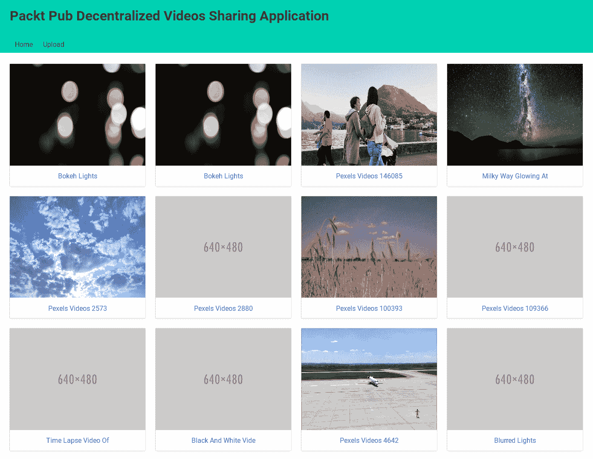
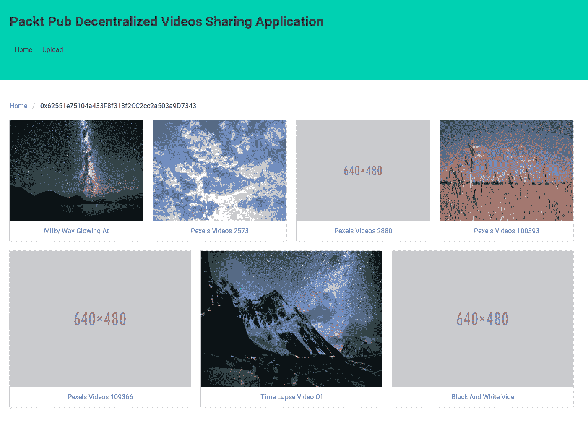
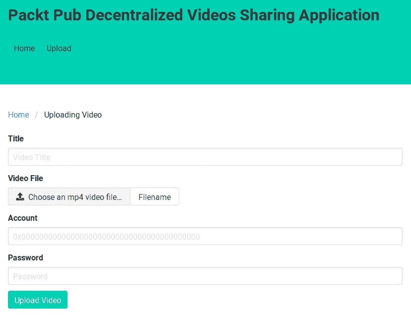

# 十二、使用 IPFS 实现去中心应用

在本章中，我们将把智能合约与**星际文件系统**（**IPFS**）结合起来，构建一个分散的视频共享应用（类似于 YouTube 但分散）。我们将使用 web 应用作为区块链和 IPF 的前端。如前所述，IPFS 不是区块链技术。IPFS 是一种分散的技术。然而，在区块链论坛、会议或教程中，您可能会经常听到 IPF 被提及。其中一个主要原因是 IPFS 克服了区块链的弱点，即其存储非常昂贵。

在本章中，我们将介绍以下主题：

*   分散式视频共享应用的体系结构
*   编写视频共享智能合约
*   构建视频共享 web 应用

# 分散式视频共享应用的体系结构

这就是我们的应用在完成后的样子。首先，你去一个网站，在那里你会看到一个视频列表（就像 YouTube）。在这里，您可以在浏览器中播放视频，将视频上载到浏览器，以便人们可以观看您的可爱猫咪视频，以及其他人的视频。

从表面上看，这就像一个普通的应用。您可以使用自己喜欢的 Python web 框架（如 Django、Flask 或 Pyramid）构建它。然后使用 MySQL 或 PostgreSQL 作为数据库。您可以选择 NGINX 或 Apache 作为 gunicornweb 服务器前面的 web 服务器。对于缓存，可以使用 Varnish 进行全页缓存，使用 Redis 进行模板缓存。您还将在云上托管 web 应用和视频，例如**亚马逊 web 服务**（**AWS**）或**谷歌云平台**（**GCP**）、Azure。然后，您将使用内容交付网络使其在全球范围内可扩展。对于前端，可以使用 JavaScript 框架，包括 React.js、Angular.js、Vue.js 或 Ember。如果您是高级用户，可以使用机器学习进行视频推荐。

然而，这里的关键点是，我们想要构建的是一个具有区块链技术的分散式视频共享应用，而不是一个集中式应用。

让我们讨论一下使用区块链技术构建分散式视频共享应用的意义。

我们无法在以太坊区块链上存储视频文件，因为它非常昂贵；在以太坊区块链上，即使存储图片文件也要付出高昂的代价。有人在下面的链接上为我们计算了一下：[https://ethereum.stackexchange.com/questions/872/what-is-the-cost-to-store-1kb-10kb-100kb-worth-of-data-into-the-ethereum-block](https://ethereum.stackexchange.com/questions/872/what-is-the-cost-to-store-1kb-10kb-100kb-worth-of-data-into-the-ethereum-block) 。

存储 1KB 的成本约为 0.032eth。一个像样的图像文件大约是 2MB。如果问硬盘制造商，1MB 是 1000KB，如果问操作系统，则是 1024KB。我们只是将其四舍五入到 1000，因为这对我们的计算没有任何影响。因此，在以太坊上存储 2MB 文件的成本约为 2000 乘以 0.032 ETH，相当于 64 ETH。ETH 的价格总是在变化。在撰写本文时，1 ETH 的成本约为 120 美元。这意味着要存储 2MB 图片文件（Unsplash 网站上的正常大小的股票图片文件），您需要花费 7680 美元。MP4 格式的一分钟半视频文件大约是 46MB。因此，您需要花费 176640 美元在以太坊上存储此视频文件。

区块链开发者通常会将视频文件的引用存储在区块链上，并将视频文件本身存储在普通存储器上，如 AWS 上，而不是为此付费。在 Vyper 智能合约中，您可以使用`bytes`数据类型：

```py
cute_panda_video: bytes[128]
```

然后，您可以将存储在 AWS S3（[中的视频链接存储起来 https://aws.amazon.com/s3/ 智能合约中的](https://aws.amazon.com/s3/)：

```py
cute_panda_video = "http://abucket.s3-website-us-west-2.amazonaws.com/cute_panda_video.mp4"
```

这种方法很好，但问题是您依赖于 AWS。如果公司不喜欢你的可爱熊猫视频，他们可以将其删除，智能合约中的 URL 将无效。当然，您可以在智能合约上更改`cute_panda_video`变量的值（除非您禁止它这样做）。然而，这种情况给我们的应用带来了不便。如果你使用一家集中化公司的服务，你的信念取决于该公司的突发奇想。

我们可以通过使用分散存储（如 IPFS）来缓解此问题。我们可以将 IPFS 路径（或 IPFS 哈希）存储为`cute_panda_video`变量的值，而不是 URL，类似于以下示例：

```py
cute_panda_video = "/ipfs/QmWgMcTdPY9Rv7SCBusK1gWBRJcBi2MxNkC1yC6uvLYPwK"
```

然后，我们可以在 AWS 和其他地方（如 GCP）启动 IPFS 守护进程。因此，如果 AWS 审查我们的可爱熊猫视频，我们可爱熊猫视频的 IPFS 路径仍然有效。我们可以提供其他地方的视频，比如 GCP。你甚至可以在你奶奶家的电脑上播放视频。对可爱的熊猫视频上瘾的人甚至可以锁定视频，并帮助我们提供可爱的熊猫视频。

除了以分散的方式托管可爱的熊猫视频外，分散视频共享应用还有其他价值。该值与区块链技术有关。假设我们想要构建一个类似于（竖起大拇指）的视频功能。我们可以在区块链上存储类似的价值。这可以防止腐败。想象一下，我们想为最可爱的熊猫视频建立一个投票竞赛，奖金为 10 BTC。如果我们的竞赛应用是以集中式方式完成的（使用一个表在 SQL 数据库（如 MySQL 或 PostgreSQL）上保留相同的值），作为集中式管理员，我们可以使用以下代码劫持获胜者：

```py
UPDATE thumbs_up_table SET aggregate_voting_count = 1000000 WHERE video_id = 234;
```

当然，作弊并不是那么容易。您需要通过确保聚合计数与单个计数匹配，用数据库日志覆盖跟踪。这需要微妙地完成。你可以在一小时内将总数增加到 100 到 1000 之间的随机数，而不是一次增加 100 万张选票。这并不是说你欺骗了用户，我只是想表达我的观点。

有了区块链，我们可以通过集中管理防止数据完整性的破坏。like 值保存在智能合约中，您可以让人们审核智能合约的源代码。分散式视频共享应用上的 like 功能通过诚实的过程增加了视频上的 like 数量。

除了数据的完整性，我们还可以建立加密经济。我的意思是，我们可以在智能合同中进行经济活动（如销售、购买、投标等）。我们可以在同一个智能合约中构建代币。这个代币的硬币可以花在喜欢视频上，所以喜欢视频不再是免费的。视频的主人可以把这些钱像现金一样放进口袋里。这种动态可以激励人们上传更好的视频。

除此之外，一个分散的应用保证了 API 的独立性。应用去中心化的本质是防止 API 受到类似于 Twitter API 惨败的干扰或骚扰。很久以前，开发者可以在 twitterapi 的基础上自由开发一个有趣的应用，但是 Twitter 对开发者如何使用他们的 API 施加了严格的限制。其中一个例子是 Twitter 曾经关闭了对 Politwoops 的 API 访问，从而保留了政客删除的推文。不过，访问已被重新激活。通过使应用分散，我们可以提高 API 的民主性。

出于教育目的，我们的应用有两个主要特性。首先，您可以查看视频列表、播放视频和上传视频。这些都是你在 YouTube 上做的正常事情。第二，你可以喜欢视频，但只能用硬币或代币。

在开始构建应用之前，让我们先设计智能合约的体系结构和 web 应用的体系结构。

# 视频共享智能合约的体系结构

我们的应用从智能合约开始。我们的智能合约需要做以下几件事：

*   跟踪用户上传的视频
*   使用令牌及其标准操作（ERC20）
*   为用户提供一种使用硬币或代币欣赏视频的方式
*   用于喜欢视频的硬币将转移给视频所有者

就这样。我们始终努力使智能合约尽可能简短。代码行越多，出现错误的可能性就越大。智能合约中的一个漏洞无法修复。

在编写此智能合约之前，让我们思考一下我们希望如何构建智能合约。智能合约的结构包括数据结构。让我们看一个例子，我们想用什么样的数据结构来跟踪用户的视频。

我们肯定希望使用一个映射变量，并将地址数据类型作为键。这里困难的部分是选择要用作此映射数据类型值的数据类型。正如我们在[第 3 章](03.html)*中了解到的，使用 Vyper*实现智能合约，Vyper 中没有无限大小的数组。如果我们使用一个`bytes32`数组，那么我们将限制数组的某个大小作为该映射的值。这意味着用户可以拥有最大大小的视频。我们可以使用`bytes32`数组来保存一个非常大的视频列表，比如 100 万个视频。有人上传超过 100 万个视频的机会有多大？如果你每天上传一个视频，十年内你只能上传 3650 个视频。然而，`bytes32`数组的问题是，它不能接受大小超过 32 字节的数据。IPFS 路径，如`QmWgMcTdPY9Rv7SCBusK1gWBRJcBi2MxNkC1yC6uvLYPwK`，长度为 44 个字符。因此，您必须至少使用一个`bytes[44]`数据类型，但我们将其四舍五入为`bytes[50]`。

相反，我们希望使用另一个映射数据类型变量（让我们称之为映射 z）作为该映射数据类型变量的值，这已在上一段中描述过。映射 z 有一个整数作为键，一个结构包含一个`bytes[50]`数据类型变量以保持 IPFS 路径和`bytes[20]`数据类型变量以保持视频标题作为值。有一个整数跟踪器来启动映射 z 中键的值。此整数跟踪器使用值 0 初始化。每次我们向映射 z 添加一个视频（IPFS 路径和视频标题），我们都会将这个整数跟踪器增加一个。所以下次我们添加另一个视频时，映射 z 的关键不再是 0，而是 1。此整数跟踪器对于每个帐户都是唯一的。我们可以创建帐户到该整数跟踪器的另一个映射。

看完视频后，我们关注喜欢的东西。我们如何存储用户 A 喜欢视频 Z 的事实？我们需要确保用户不能多次喜欢同一视频。最简单的方法是创建一个映射，以`bytes[100]`数据类型作为键，以`boolean`数据类型作为值。`bytes[100]`数据类型变量是使用视频喜欢者地址、视频上传者地址和视频索引的组合。`boolean`数据类型变量用于指示用户是否已经喜欢该视频。

最重要的是，我们需要一个整数数据类型来保持视频拥有的喜好数量的聚合计数。聚合类是以`bytes[100]`数据类型为键，以`integer`数据类型为值的映射。`bytes[100]`数据类型变量是视频上传器地址和视频索引的组合。

这种方法的缺点是很难跟踪哪些用户喜欢智能合约中的特定视频。我们可以创建另一个映射来跟踪哪些用户喜欢某个视频。然而，这将使我们的智能合约复杂化。在此之前，我们花了更多的精力创建了一个地图，专门用于跟踪用户上传的所有视频。这是必要的，因为我们想得到一个用户的视频列表。这就是我们所说的核心特性。然而，跟踪哪些用户喜欢视频并不是我所说的核心功能。

只要我们能够使视频喜欢过程诚实，我们就不需要跟踪哪些用户喜欢视频。如果我们真的很想跟踪这些用户，我们可以在智能合约中使用事件。每次用户喜欢视频时，它都会触发一个事件。然后，在`web3.py`库的客户端，我们可以过滤这些事件，以获得所有喜欢特定视频的用户。这将是一个昂贵的过程，应该与主应用分开进行。我们可以使用芹菜进行后台作业，此时结果可以存储在数据库中，如 SQlite、PostgreSQL 或 MySQL。构建分散的应用并不意味着完全否定集中式方法。

The topic of tokens has been discussed thoroughly in [Chapter 8](08.html), *Creating Token in Ethereum*.

# 视频共享 web 应用的体系结构

我们将开发一个 Python web 应用，用作智能合约的前端。这意味着我们需要一个合适的服务器来成为 Python web 应用的主机。为此，我们至少需要一个 Gunicorn web 服务器。换句话说，我们需要将 Python web 应用托管在集中的服务器中，例如 AWS、GCP 或 Azure 中。这对于观看视频来说实际上是很好的，但是当用户想要上传视频时，问题就出现了，因为这需要访问私钥。用户可能会担心集中式服务器上的 Python web 应用会窃取他们的私钥。

因此，解决方案是在 GitHub 或 GitLab 上发布 Python web 应用的源代码，然后告诉用户下载、安装并在其计算机上运行。他们可以审计我们的 Python web 应用的源代码，以确保没有讨厌的代码试图窃取他们的私钥。但是，如果他们每次都需要审核源代码，那么我们会在 Git 存储库中添加另一个提交。

或者更好的是，我们可以将 Python web 应用的源代码存储在 IPFS 上。他们可以从 IPFS 下载，并确保我们的应用的源代码不会被篡改。在使用源代码之前，他们只需要审核一次源代码。

然而，虽然我们可以在 IPFS 上托管静态网站，但对于动态网页（如 Python、PHP、Ruby 或 Perl web 应用）却无法做到这一点。这样的动态网站需要一个合适的 web 服务器。因此，任何下载 Python web 应用源代码的人都需要在执行应用之前安装正确的软件。他们需要安装 Python 解释器、web 服务器（Gunicorn、Apache 或 NGINX）以及所有必要的库。

但是，只有桌面用户可以这样做。移动用户无法执行我们的应用，因为 Android 或 iOS 平台上没有合适的 Python 解释器或 web 服务器。

这就是 JavaScript 的亮点所在。您可以创建一个动态的静态网站，以便在网页中具有交互性。您还可以使用 React.js、Angular.js、Ember.js 或 Vue.js 创建一个复杂的 JavaScript web 应用，并将其部署到 IPFS 上。桌面用户和移动用户可以执行 JavaScript web 应用。因为这是一本关于 Python 的书，所以我们仍将关注如何创建 Python web 应用。但是，您应该记住 JavaScript 与 Python 相比的优势。

不管 JavaScript 有多好，它仍然无法挽救移动用户的困境。移动平台上的计算能力仍然不如桌面平台上的计算能力强大。您仍然无法在移动平台上运行完整的以太坊节点，就像您无法在移动平台上运行 IPFS 软件一样。

让我们来设计我们的 web 应用。这有几个实用程序：

*   播放视频
*   上传视频
*   喜欢录像吗
*   列出许多用户最近的视频
*   列出一个特定用户的视频

列出一个用户的所有视频比较容易，因为我们有一个无限大小的视频数组（基本上是一个以整数为键的映射和另一个整数跟踪器），我们可以根据智能合约中的一个用户获得这些视频。页面的控制器接受用户（或者基本上是智能合约中的地址）作为参数。

播放视频接受视频上传者的地址和视频索引作为参数。如果视频还不存在于我们的存储中，我们将从 IPFS 下载它。然后我们将视频提供给用户。

上载视频需要与以太坊节点交互。此上载视频的方法或功能接受要使用的帐户地址参数、加密私钥密码参数、视频文件参数和视频标题参数。我们首先将视频文件存储在 IPFS 上。然后，如果成功，我们可以将有关该视频的信息存储在区块链上。

喜欢视频还需要与以太坊节点交互。此喜欢视频的方法或功能接受要使用的视频喜欢者地址的参数、加密私钥密码的参数、视频上传者地址的参数和视频索引的参数。在确保用户之前不喜欢视频后，我们将信息存储在区块链上。

列出许多用户最近的视频有点棘手。所涉及的努力是相当巨大的。在智能合约中，我们没有跟踪所有参与用户的变量。我们也没有一个变量来跟踪来自不同用户的所有视频。然而，我们可以通过在区块链上存储视频信息的方法创建事件。完成后，我们可以找到该活动的所有最新视频。

现在是构建分散式视频共享应用的时候了。

# 编写视频共享智能合约

不用多说，让我们建立我们的智能合约开发平台：

1.  首先，我们按照如下方式设置虚拟环境：

```py
$ virtualenv -p python3.6 videos-venv
$ source videos-venv/bin/activate
(videos-venv) $
```

2.  然后我们安装 Web3、Populus 和 Vyper：

```py
(videos-venv) $ pip install eth-abi==1.2.2
(videos-venv) $ pip install eth-typing==1.1.0
(videos-venv) $ pip install py-evm==0.2.0a33
(videos-venv) $ pip install web3==4.7.2
(videos-venv) $ pip install -e git+https://github.com/ethereum/populus#egg=populus
(videos-venv) $ pip install vyper 
```

The latest version of Vyper is 0.1.0b6, which breaks Populus. The developer needs some time to fix this. If the bug has not been fixed by the time you are reading this book, you could patch Populus yourself.

3.  使用以下命令检查此库是否已修复错误：

```py
(videos-venv) $ cd videos-venv/src/populus
(videos-venv) $ grep -R "compile(" populus/compilation/backends/vyper.py
 bytecode = '0x' + compiler.compile(code).hex()
 bytecode_runtime = '0x' + compiler.compile(code, bytecode_runtime=True).hex()
```

在我们的例子中，这个 bug 还没有被修复。

4.  那么，让我们修补 Populus 以修复该漏洞。确保您仍在同一目录中（`videos-venv/src/populus`：

```py
(videos-venv) $ wget https://patch-diff.githubusercontent.com/raw/ethereum/populus/pull/484.patch
(videos-venv) $ git apply 484.patch
(videos-venv) $ cd ../../../ 
```

5.  修补 Populus 后，我们将创建我们的智能合约项目目录：

```py
(videos-venv) $ mkdir videos-sharing-smart-contract
```

6.  然后，我们将该目录初始化为 Populus 项目目录：

```py
(videos-venv) $ cd videos-sharing-smart-contract
(videos-venv) $ mkdir contracts tests 
```

7.  接下来，我们将下载 Populus 项目目录中的 Populus 配置文件：

```py
(videos-venv) $ wget https://raw.githubusercontent.com/ethereum/populus/master/populimg/defaults.v9.config.json -O project.json
```

8.  我们现在将打开 Populus 的`project.json`配置文件，覆盖`compilation`键的值，如下代码块所示：

```py
  "compilation": {
    "backend": {
      "class": "populus.compilation.backends.VyperBackend"
    },
    "contract_source_dirs": [
      "./contracts"
    ],
    "import_remappings": []
  },
```

9.  然后我们在`videos-sharing-smart-contract/contracts/VideosSharing.vy`中编写我们的智能合约代码，如下面的代码块所示（完整代码请参阅下面 GitLab 链接中的代码文件：[https://gitlab.com/arjunaskykok/hands-on-blockchain-for-python-developers/blob/master/chapter_12/videos_sharing_smart_contract/contracts/VideosSharing.vy](https://gitlab.com/arjunaskykok/hands-on-blockchain-for-python-developers/blob/master/chapter_12/videos_sharing_smart_contract/contracts/VideosSharing.vy) ：

```py
struct Video:
    path: bytes[50]
    title: bytes[20]

Transfer: event({_from: indexed(address), _to: indexed(address), _value: uint256})
Approval: event({_owner: indexed(address), _spender: indexed(address), _value: uint256})
UploadVideo: event({_user: indexed(address), _index: uint256})
LikeVideo: event({_video_liker: indexed(address), _video_uploader: indexed(address), _index: uint256})

...
...

@public
@constant
def video_aggregate_likes(_user_video: address, _index: uint256) -> uint256:
    _user_video_str: bytes32 = convert(_user_video, bytes32)
    _index_str: bytes32 = convert(_index, bytes32)
    _key: bytes[100] = concat(_user_video_str, _index_str)

    return self.aggregate_likes[_key]
```

现在，让我们一点一点地讨论我们的智能合同：

```py
struct Video:
    path: bytes[50]
    title: bytes[20]
```

这是我们希望保留在区块链上的视频信息结构。`Video`结构的`path`存储 IPFS 路径，路径长度为 44。如果我们使用另一个散列函数，IPFS 路径的长度将不同。请记住，IPFS 在散列对象时使用多重散列。如果在 IPFS 配置中使用更昂贵的散列函数，如 SHA512，则需要将`bytes[]`数组数据类型的大小增加一倍。例如，`bytes[100]`应该足够了。`Video`结构的`title`存储视频标题。在这里，我使用`bytes[20]`是因为我想保持标题简短。如果要存储更长的标题，可以使用更长的字节，如`bytes[100]`。但是，请记住，你在区块链上存储的字节越多，你必须花费的汽油（钱！）就越多。当然，您可以在此结构中添加更多信息，例如视频描述或视频标记，只要您知道结果，执行存储视频信息的方法需要更多的气体。

我们现在进入活动列表：

```py
Transfer: event({_from: indexed(address), _to: indexed(address), _value: uint256})
Approval: event({_owner: indexed(address), _spender: indexed(address), _value: uint256})
UploadVideo: event({_user: indexed(address), _index: uint256})
LikeVideo: event({_video_liker: indexed(address), _video_uploader: indexed(address), _index: uint256})
```

`Transfer`和`Approval`是 ERC20 标准事件的一部分。您可以在[第八章](08.html)*以太坊*中阅读更多关于 ERC20 的信息。当我们在智能合约中上传视频信息时触发`UploadVideo`事件。我们保存视频上传者的地址和视频索引。当我们喜欢智能合约中的视频时，会触发`LikeVideo`事件。

我们保存视频喜欢者的地址、视频上传者的地址和视频索引：

```py
user_videos_index: map(address, uint256)
```

这是我们无限阵列的整数跟踪器。所以如果`user_videos_index[address of user A] = 5`，则表示用户 A 已经上传了四个视频。

以下是 ERC20 标准的一部分：

```py
name: public(bytes[20])
symbol: public(bytes[3])
totalSupply: public(uint256)
decimals: public(uint256)
balances: map(address, uint256)
allowed: map(address, map(address, uint256))
```

有关 ERC20 的更多信息，请参见[第 8 章](08.html)*在以太坊*中创建令牌。

我们继续下一行：

```py
all_videos: map(address, map(uint256, Video))
```

这是保持所有用户观看所有视频的核心变量。`address`数据类型键用于保存用户地址。`map(uint256, Video)`数据类型值是我们的无限数组。`map(uint256, Video)`中的`uint256`键从 0 开始，然后由`user_videos_index`变量跟踪。`Video`struct 是我们的视频信息。

下面两行代码用于类似的代码：

```py
likes_videos: map(bytes[100], bool)
aggregate_likes: map(bytes[100], uint256)
```

`likes_videos`变量是一个用于检查某个用户是否喜欢某个特定视频的变量。`aggregate_likes`变量是一个用于显示此特定视频已获得多少喜欢的变量。

现在，我们已经完成了变量的定义，并将继续讨论以下代码块中显示的代码：

```py
@public
def __init__():
    _initialSupply: uint256 = 500
    _decimals: uint256 = 3
    self.totalSupply = _initialSupply * 10 ** _decimals
    self.balances[msg.sender] = self.totalSupply
    self.name = 'Video Sharing Coin'
    self.symbol = 'VID'
    self.decimals = _decimals
    log.Transfer(ZERO_ADDRESS, msg.sender, self.totalSupply)

...
...

@public
@constant
def allowance(_owner: address, _spender: address) -> uint256:
    return self.allowed[_owner][_spender]
```

这是标准的 ERC20 代码，您可以在[第 8 章](08.html)*在以太坊*中创建令牌中了解。但是，我对代码做了一个小的调整，如下代码块所示：

```py
@private
def _transfer(_source: address, _to: address, _amount: uint256) -> bool:
    assert self.balances[_source] >= _amount
    self.balances[_source] -= _amount
    self.balances[_to] += _amount
    log.Transfer(_source, _to, _amount)

    return True

@public
def transfer(_to: address, _amount: uint256) -> bool:
    return self._transfer(msg.sender, _to, _amount)
```

在这个智能合约中，我将`transfer`方法的内部代码提取到专用的私有方法中。这样做的原因是，传输硬币功能将用于该方法中，以喜欢视频。记住，当我们喜欢视频时，我们必须向视频上传者支付硬币。我们不能在另一个公共函数中调用公共函数。代码的其余部分相同（令牌的名称除外）：

```py
@public
def upload_video(_video_path: bytes[50], _video_title: bytes[20]) -> bool:
    _index: uint256 = self.user_videos_index[msg.sender]

    self.all_videos[msg.sender][_index] = Video({ path: _video_path, title: _video_title })
    self.user_videos_index[msg.sender] += 1

    log.UploadVideo(msg.sender, _index)aggregate_likes

    return True
```

这是用于在区块链上存储视频信息的方法。我们将视频上传到 IPFS 后调用此方法。`_video_path`为 IPFS 路径，`_video_title`为视频标题。我们从视频上传器（`msg.sender`获取最新索引）。然后我们根据视频上传器的地址和最新索引将`Video`结构的值设置为`all_videos`。

然后增加整数跟踪器（`user_videos_index`。不要忘记记录此事件。

```py
@public
@constant
def latest_videos_index(_user: address) -> uint256:
    return self.user_videos_index[_user]

@public
@constant
def videos_path(_user: address, _index: uint256) -> bytes[50]:
    return self.all_videos[_user][_index].path

@public
@constant
def videos_title(_user: address, _index: uint256) -> bytes[20]:
    return self.all_videos[_user][_index].title
```

前面代码块中的方法是为使用 web3 的客户端获取最新视频索引、视频 IPFS 路径和视频标题的方便方法。如果没有这些方法，您仍然可以获得有关视频的信息，但是使用 web3 访问嵌套映射数据类型变量中的结构变量并不简单

下面的代码显示了喜欢视频的方法。它接受视频上传者的地址和视频索引。在这里，您创建了两个键，一个用于`likes_videos`，另一个用于`aggregate_likes`。`likes_videos`的键是视频喜欢者的地址、视频上传者的地址和视频索引的组合。`aggregate_likes`的键是视频上传器地址和视频索引的组合。创建关键点后，我们确保视频喜欢者将来不会喜欢同一个视频，并且视频喜欢者以前也不喜欢这个特定的视频。就像视频一样，只需使用我们创建的键将`True`值设置为`likes_videos`变量。然后我们用我们创建的键增加`aggregate_likes`的值。最后，我们将一枚代币从视频喜欢者转移到视频上传者。不要忘记记录此事件：

```py
@public
def like_video(_user: address, _index: uint256) -> bool:
    _msg_sender_str: bytes32 = convert(msg.sender, bytes32)
    _user_str: bytes32 = convert(_user, bytes32)
    _index_str: bytes32 = convert(_index, bytes32)
    _key: bytes[100] = concat(_msg_sender_str, _user_str, _index_str)
    _likes_key: bytes[100] = concat(_user_str, _index_str)
 a particular
    assert _index < self.user_videos_index[_user]
    assert self.likes_videos[_key] == False

    self.likes_videos[_key] = True
    self.aggregate_likes[_likes_key] += 1
    self._transfer(msg.sender, _user, 1)

    log.LikeVideo(msg.sender, _user, _index)

    return True
```

以下代码行是用于检查特定用户是否喜欢某个视频以及该特定视频已经有多少人喜欢的便捷方法：

```py
@public
@constant
def video_has_been_liked(_user_like: address, _user_video: address, _index: uint256) -> bool:
    _user_like_str: bytes32 = convert(_user_like, bytes32)
    _user_video_str: bytes32 = convert(_user_video, bytes32)
    _index_str: bytes32 = convert(_index, bytes32)
    _key: bytes[100] = concat(_user_like_str, _user_video_str, _index_str)

    return self.likes_videos[_key]

@public
@constant
def video_aggregate_likes(_user_video: address, _index: uint256) -> uint256:
    _user_video_str: bytes32 = convert(_user_video, bytes32)
    _index_str: bytes32 = convert(_index, bytes32)
    _key: bytes[100] = concat(_user_video_str, _index_str)

    return self.aggregate_likes[_key]
```

让我们在`videos_sharing_smart_contract/tests/test_video_sharing.py`中编写一个测试。有关完整代码，请参阅以下 GitLab 链接中的代码文件：[https://gitlab.com/arjunaskykok/hands-on-blockchain-for-python-developers/blob/master/chapter_12/videos_sharing_smart_contract/tests/test_videos_sharing.py](https://gitlab.com/arjunaskykok/hands-on-blockchain-for-python-developers/blob/master/chapter_12/videos_sharing_smart_contract/tests/test_videos_sharing.py) 。

```py
import pytest
import eth_tester

def upload_video(video_sharing, chain, account, video_path, video_title):
    txn_hash = video_sharing.functions.upload_video(video_path, video_title).transact({'from': account})
    chain.wait.for_receipt(txn_hash)

def transfer_coins(video_sharing, chain, source, destination, amount):
    txn_hash = video_sharing.functions.transfer(destination, amount).transact({'from': source})
    chain.wait.for_receipt(txn_hash)

...
...

   assert events[1]['args']['_video_liker'] == video_liker2
    assert events[1]['args']['_video_uploader'] == video_uploader
    assert events[1]['args']['_index'] == 0

    with pytest.raises(eth_tester.exceptions.TransactionFailed):
        like_video(video_sharing, chain, video_liker, video_uploader, 0)
```

让我们一点一点地详细讨论测试脚本。在下面的代码块中，在导入必要的库之后，我们创建了三个方便的函数：上传视频的函数、转移硬币的函数和喜欢视频的函数：

```py
import pytest
import eth_tester

def upload_video(video_sharing, chain, account, video_path, video_title):
    txn_hash = video_sharing.functions.upload_video(video_path, video_title).transact({'from': account})
    chain.wait.for_receipt(txn_hash)

def transfer_coins(video_sharing, chain, source, destination, amount):
    txn_hash = video_sharing.functions.transfer(destination, amount).transact({'from': source})
    chain.wait.for_receipt(txn_hash)

def like_video(video_sharing, chain, video_liker, video_uploader, index):
    txn_hash = video_sharing.functions.like_video(video_uploader, index).transact({'from': video_liker})
    chain.wait.for_receipt(txn_hash)
```

正如下面的代码块所示，在上传视频之前，我们确保最新的视频索引为 0。然后，在我们上传一个视频后，我们应该检查最新视频的索引，它应该增加一个。当然，我们也会检查视频路径和视频标题。然后我们再次上传一个视频，并检查最新视频的索引，现在应该是 2。我们还检查视频路径和视频标题。最后，我们检查事件并确保它们已正确创建：

```py
def test_upload_video(web3, chain):
    video_sharing, _ = chain.provider.get_or_deploy_contract('VideosSharing')

    t = eth_tester.EthereumTester()
    video_uploader = t.get_accounts()[1]

    index = video_sharing.functions.latest_videos_index(video_uploader).call()
    assert index == 0

...
...

    assert events[0]['args']['_user'] == video_uploader
    assert events[0]['args']['_index'] == 0

    assert events[1]['args']['_user'] == video_uploader
    assert events[1]['args']['_index'] == 1
```

让我们看一下测试脚本的下一部分：

```py
def test_like_video(web3, chain):
    video_sharing, _ = chain.provider.get_or_deploy_contract('VideosSharing')

    t = eth_tester.EthereumTester()
    manager = t.get_accounts()[0]
    video_uploader = t.get_accounts()[1]
    video_liker = t.get_accounts()[2]
    video_liker2 = t.get_accounts()[3]

    transfer_coins(video_sharing, chain, manager, video_liker, 100)
    transfer_coins(video_sharing, chain, manager, video_liker2, 100)
    transfer_coins(video_sharing, chain, manager, video_uploader, 50)
    upload_video(video_sharing, chain, video_uploader, b'video-ipfs-path', b"video title")

...
...

    with pytest.raises(eth_tester.exceptions.TransactionFailed):
        like_video(video_sharing, chain, video_liker, video_uploader, 0)
```

首先，我们将一些硬币从 manager 帐户（启动智能合约的帐户）转移到不同的帐户，然后上传视频。在喜欢视频之前，我们应该确保帐户的令牌余额是他们应该的，测试帐户不喜欢此视频，并且总喜欢数仍然为 0。

完成此操作后，我们喜欢来自特定帐户的视频。视频喜欢者的令牌余额应减少 1，视频上传者的令牌余额应增加 1。这意味着智能合约已记录该帐户喜欢该视频，并且该视频的总喜欢度应增加 1。

然后，我们喜欢另一个帐户的视频。视频喜欢者的令牌余额应减少 1，视频上传者的令牌余额应再次增加 1。智能合约记录了另一个帐户喜欢此视频，此时此视频的总喜欢度应再次增加 1，使之成为 2。

然后，我们确保喜欢视频的事件被触发。

最后，我们确保喜欢视频的人不能多次喜欢同一视频。

我们将不讨论本智能合约中 ERC20 的测试部分。请参考[第 8 章](08.html)*在以太坊创建令牌*了解如何测试 ERC20 令牌智能合约。

要执行测试，请运行以下语句：

```py
(videos-venv) $ py.test tests/test_videos_sharing.py
```

# 启动私有以太坊区块链

让我们使用 geth 启动我们的私有以太坊区块链。我们在这里不使用 Ganache，因为 Ganache 的稳定版本还不支持事件（但是，Ganache 的 beta 版本（v2.0.0beta2）已经支持事件）：

1.  我们将使用以下代码块启动该块：

```py
(videos-venv) $ cd videos_sharing_smart_contract
(videos-venv) $ populus chain new localblock
(videos-venv) $ ./chains/localblock/init_chain.sh
```

2.  现在编辑`chains/localblock/run_chain.sh`。找到`--ipcpath`，然后将值（在`--ipcpath`之后的单词）更改为`/tmp/geth.ipc`。
3.  然后编辑`project.json`文件。`chains`对象指向四个键：`tester`、`temp`、`ropsten`和`mainnet`。在`chains`对象中添加另一个键`localblock`：

```py
    "localblock": {
      "chain": {
        "class": "populus.chain.ExternalChain"
      },
      "web3": {
        "provider": {
          "class": "web3.providers.ipc.IPCProvider",
        "settings": {
          "ipc_path":"/tmp/geth.ipc"
        }
       }
      },
      "contracts": {
        "backends": {
          "JSONFile": {"$ref": "contracts.backends.JSONFile"},
          "ProjectContracts": {
            "$ref": "contracts.backends.ProjectContracts"
          }
        }
      }
    }
```

4.  使用以下命令运行区块链：

```py
(videos-venv) $ ./chains/localblock/run_chain.sh
```

5.  使用以下命令编译我们的智能合约：

```py
(videos-venv) $ populus compile
```

6.  然后，使用以下命令将我们的智能合约部署到我们的私有区块链：

```py
(videos-venv) $ populus deploy --chain localblock VideosSharing
```

在`address.txt`中写下部署智能合约的地址。此文件必须与`videos_sharing_smart_contract`目录相邻。

# 创建引导脚本

此脚本用于加载数据，以使应用的开发更容易。我们可以从[下载免费视频 https://videos.pexels.com/](https://videos.pexels.com/) 。在`videos_sharing_smart_contract`目录旁边创建一个`stock_videos`目录，并将一些 MP4 文件下载到该`stock_videos`目录。就我而言，我下载了 20 多个视频。

下载一些数据后，我们将创建一个名为`bootstrap_videos.py`的脚本。有关完整代码，请参阅以下 GitLab 链接中的代码文件：[https://gitlab.com/arjunaskykok/hands-on-blockchain-for-python-developers/blob/master/chapter_12/bootstrap_videos.py](https://gitlab.com/arjunaskykok/hands-on-blockchain-for-python-developers/blob/master/chapter_12/bootstrap_videos.py) ：

```py
import os, json
import ipfsapi
from web3 import Web3, IPCProvider
from populus.utils.wait import wait_for_transaction_receipt

w3 = Web3(IPCProvider('/tmp/geth.ipc'))

common_password = 'bitcoin123'
accounts = []
with open('accounts.txt', 'w') as f:
...
...
    nonce = w3.eth.getTransactionCount(Web3.toChecksumAddress(account))
    txn = VideosSharing.functions.upload_video(ipfs_path, title).buildTransaction({
                'from': account,
                'gas': 200000,
                'gasPrice': w3.toWei('30', 'gwei'),
                'nonce': nonce
              })
    txn_hash = w3.personal.sendTransaction(txn, common_password)
    wait_for_transaction_receipt(w3, txn_hash)
```

让我们一点一点地详细讨论脚本。在下面的代码块中，在导入必要的库之后，我们创建了一个名为`w3`的对象，它是我们私有区块链的连接对象：

```py
import os, json
import ipfsapi
from web3 import Web3, IPCProvider
from populus.utils.wait import wait_for_transaction_receipt

w3 = Web3(IPCProvider('/tmp/geth.ipc'))
```

在下面的代码行中，我们使用`w3.personal.newAccount()`方法创建新帐户。然后我们将新帐户的地址放入`accounts.txt`文件和`accounts`变量中。所有账户均使用`'bitcoin123'`作为密码：

```py
common_password = 'bitcoin123'
accounts = []
with open('accounts.txt', 'w') as f:
    for i in range(4):
        account = w3.personal.newAccount(common_password)
        accounts.append(account)
        f.write(account + "\n")
```

记住：在我们的私有区块链上部署智能合约后，我们将其地址保存在`address.txt`文件中。现在是将文件内容加载到`address`变量的时候了：

```py
with open('address.txt', 'r') as f:
    address = f.read().rstrip("\n")

with open('videos_sharing_smart_contract/build/contracts.json') as f:
    contract = json.load(f)
    abi = contract['VideosSharing']['abi']
```

然后我们在我们的 Populus 项目目录`videos_sharing_smart_contract`的`build`目录中加载可以从`contracts.json`获取的`abi`或我们的智能合约接口。我们使用`json.load()`方法将 JSON 加载到`contract`变量中。`abi`来自`json`对象的`'VideosSharing'`键的`'abi'`键。

然后我们用地址和接口用`w3.eth.contract()`方法初始化智能合约对象。然后我们通过`ipfsapi.connect()`方法得到 IPFS 连接对象：

```py
VideosSharing = w3.eth.contract(address=address, abi=abi)

c = ipfsapi.connect()
```

接下来，我们要将乙醚转移到我们的新帐户。默认情况下，第一个账户（`w3.eth.accounts[0]`）从挖掘中获得所有奖励，因此它有足够的资源可供分享。默认密码为`'this-is-not-a-secure-password'`：

```py
coinbase = w3.eth.accounts[0]
coinbase_password = 'this-is-not-a-secure-password'
# Transfering Ethers
for destination in accounts:
    nonce = w3.eth.getTransactionCount(Web3.toChecksumAddress(coinbase))
    txn = {
            'from': coinbase,
            'to': Web3.toChecksumAddress(destination),
            'value': w3.toWei('100', 'ether'),
            'gas': 70000,
            'gasPrice': w3.toWei('1', 'gwei'),
            'nonce': nonce
          }
    txn_hash = w3.personal.sendTransaction(txn, coinbase_password)
    wait_for_transaction_receipt(w3, txn_hash)
```

发送以太通过`w3.personal.sendTransaction()`方法完成，该方法接受包含发送方（`'from'`）、目的地（`'to'`）、以太数量（`'value'`）、天然气、天然气价格（`'gasPrice'`）、`nonce`作为第一个参数、密码作为第二个参数的字典。然后我们等待交易通过`wait_for_transaction_receipt()`方法确认。

在转移乙醚后，我们将我们代币的一些 ERC20 硬币转移到新帐户。这是必要的，因为要想喜欢视频，我们需要 ERC20 代币的硬币：

```py
# Transfering Coins
for destination in accounts:
    nonce = w3.eth.getTransactionCount(coinbase)
    txn = VideosSharing.functions.transfer(destination, 100).buildTransaction({
                'from': coinbase,
                'gas': 70000,
                'gasPrice': w3.toWei('1', 'gwei'),
                'nonce': nonce
              })
    txn_hash = w3.personal.sendTransaction(txn, coinbase_password)
    wait_for_transaction_receipt(w3, txn_hash)
```

我们构建了一个交易对象`txn`，用于转移代币方法（`VideosSharing.functions.transfer`），它通过`buildTransaction`方法接受目的账户和硬币金额。它接受发送方（`'from'`）、天然气、天然气价格（`'gasPrice'`）和 nonce 的字典。我们使用`w3.personal.sendTransaction()`方法创建一个事务，然后等待使用`wait_for_transaction_receipt()`方法确认该事务。

我们使用`os.listdir()`方法列出`stock_videos`目录中的所有文件。您已将一些 MP4 文件下载到此目录。完成此操作后，我们将迭代这些文件：

```py
# Uploading Videos
directory = 'stock_videos'
movies = os.listdir(directory)
length_of_movies = len(movies)
for index, movie in enumerate(movies):
    account = accounts[index//7]
    ipfs_add = c.add(directory + '/' + movie)
    ipfs_path = ipfs_add['Hash'].encode('utf-8')
    title = movie.rstrip('.mp4')[:20].encode('utf-8')

    nonce = w3.eth.getTransactionCount(Web3.toChecksumAddress(account))
    txn = VideosSharing.functions.upload_video(ipfs_path, title).buildTransaction({
                'from': account,
                'gas': 200000,
                'gasPrice': w3.toWei('30', 'gwei'),
                'nonce': nonce
              })
    txn_hash = w3.personal.sendTransaction(txn, common_password)
    wait_for_transaction_receipt(w3, txn_hash)
```

我们希望每个帐户上传七个视频（`account = accounts [index//7]`。因此，前七个视频将由第一个帐户上载，而第二批七个视频将由第二个帐户上载。然后我们将 MP4 文件添加到 IPFS（`ipfs_add = c.add(directory + '/' + movie)`）。我们获取 IPFS 路径并将其转换为字节对象（`ipfs_path = ipfs_add['Hash'].encode('utf-8')`），将 MP4 文件名剥离为 20 个字符并将其转换为字节对象，因为智能合约中的标题的数据类型为`bytes[20]`。

然后我们称之为智能合约的`upload_video`方法（`VideosSharing.functions.upload_video`。我们必须先构建事务对象，然后再将其作为参数发送给`w3.personal.sendTransaction()`方法。我们像往常一样用`wait_for_transaction_receipt()`方法等待交易确认。

但是，您必须小心使用`upload_video`方法，因为它在区块链上保存了具有`bytes[50]`数据类型的视频路径和具有`bytes[20]`数据类型的视频标题。它还会增加视频的索引并记录事件。所需的天然气和天然气价格远远超过转让硬币或代币的方法。要转移代币，您可以获得 1 gwei 的汽油价格和 70000 汽油。然而，对于我们的`upload_video`方法，这将失败。对于这种方法，我使用 30 gwei 的天然气价格和 200000 的天然气价格。记住，区块链中的存储是昂贵的。甚至一些管柱也可能提高操作所需的天然气和天然气价格

1.  确保您已经启动了您的私有区块链，然后启动 IPF`daemon`：

```py
$ ipfs daemon
```

Refer to [Chapter 11](11.html), *Using ipfsapi to Interact with IPFS*, if you don't know how to install and launch IPFS.

2.  现在，我们需要在虚拟环境中安装 IPFS Python 库：

```py
(videos-venv) $ pip install ipfsapi
```

3.  然后，我们使用以下命令运行引导脚本：

```py
(videos-venv) $ python bootstrap_videos.py
```

这需要一些时间。您可以通过访问智能合约并检查视频是否已上载来测试引导脚本是否成功。

4.  创建一个名为`check_bootstrap.py`的脚本：

```py
import json
from web3 import Web3, IPCProvider

w3 = Web3(IPCProvider('/tmp/geth.ipc'))

with open('accounts.txt', 'r') as f:
    account = f.readline().rstrip("\n")

with open('address.txt', 'r') as f:
    address = f.read().rstrip("\n")

with open('videos_sharing_smart_contract/build/contracts.json') as f:
    contract = json.load(f)
    abi = contract['VideosSharing']['abi']

VideosSharing = w3.eth.contract(address=address, abi=abi)

print(VideosSharing.functions.latest_videos_index(account).call())
```

5.  运行脚本。如果将`0`作为输出，则引导脚本失败。如果您获得了`0`以外的输出，则您的视频信息已成功上传到区块链中。

# 构建视频共享 web 应用

是时候建立我们智能合约的前端了。在此之前，在[第 7 章](07.html)、*前端去中心应用*和[第 9 章](09.html)、*加密货币钱包*中，我们使用 Qt for Python 或`Pyside2`库创建了一个桌面应用。这次我们将使用 Django 库构建一个 web 应用：

1.  无需更多麻烦，让我们安装 Django：

```py
(videos-venv) $ pip install Django
```

2.  我们还需要 OpenCV Python 库来获取视频的缩略图：

```py
(videos-venv) $ pip install opencv-python
```

3.  现在，让我们创建 Django 项目目录。这将创建一个带有设置文件的骨架 Django 项目：

```py
(videos-venv) $ django-admin startproject decentralized_videos
```

4.  在这个新目录中，创建一个`static media`目录：

```py
(videos-venv) $ cd decentralized_videos
(videos-venv) $ mkdir static media
```

5.  仍在同一目录中，创建名为`videos`的 Django 应用：

```py
(videos-venv) $ python manage.py startapp videos
```

6.  然后更新我们的 Django 项目设置文件。该文件位于`decentralized_videos/settings.py`中。将我们的新应用`videos`添加到`INSTALLED_APPS`变量。确保`'videos'`和`'django.contrib.staticfiles'`字符串之间有逗号。我们需要将每个 Django 应用添加到此变量中，以便 Django 项目能够识别它。Django 项目可以由许多 Django 应用组成：

```py
INSTALLED_APPS = [
    'django.contrib.admin',
    'django.contrib.auth',
    'django.contrib.contenttypes',
    'django.contrib.sessions',
    'django.contrib.messages',
    'django.contrib.staticfiles',
    'videos'
]
```

7.  然后，在同一文件中添加以下代码行：

```py
STATIC_URL = '/static/'

STATICFILES_DIRS = [
    os.path.join(BASE_DIR, "static"),
]

MEDIA_URL = '/media/'
MEDIA_ROOT = os.path.join(BASE_DIR, 'media')
```

`STATIC_URL`变量定义我们如何访问静态 URL。使用此值，我们可以使用以下 URL 访问静态文件：`http://localhost:8000/static/our_static_file`。`STATICFILES_DIRS`变量表示我们在文件系统中保存静态文件的位置。我们只需将视频存储在 Django 项目目录中的`static`目录中。`MEDIA_URL`与`STATIC_URL`用途相同，但用于媒体文件。媒体文件是用户上传到 Django 项目中的文件，而静态文件是我们作为开发人员放入 Django 项目中的文件。

# 意见

现在让我们创建`videos`应用的视图文件。视图是类似于 API 端点的控制器。该文件位于`decentralized_videos/videos/views.py`中。有关完整代码，请参阅以下 GitLab 链接中的代码文件：[https://gitlab.com/arjunaskykok/hands-on-blockchain-for-python-developers/blob/master/chapter_12/decentralized_videos/videos/views.py](https://gitlab.com/arjunaskykok/hands-on-blockchain-for-python-developers/blob/master/chapter_12/decentralized_videos/videos/views.py) ：

```py
from django.shortcuts import render, redirect
from videos.models import videos_sharing

def index(request):
    videos = videos_sharing.recent_videos()
    context = {'videos': videos}
    return render(request, 'videos/index.html', context)
...
...
def like(request):
    video_user = request.POST['video_user']
    index = int(request.POST['index'])
    password = request.POST['password']
    video_liker = request.POST['video_liker']
    videos_sharing.like_video(video_liker, password, video_user, index)
    return redirect('video', video_user=video_user, index=index)
```

让我们一点一点地讨论代码。首先，我们使用以下代码行导入所有必需的库：

```py
from django.shortcuts import render, redirect
from videos.models import videos_sharing
```

`render`和`redirect`方法是 Django 库中的方便函数，用于呈现模板（如 HTML 文件），并将模板从一个视图重定向到另一个视图。`videos_sharing`是一个自定义实例，我们将很快在`models`文件中创建它。

接下来，我们将创建作为主页视图的方法：

```py
def index(request):
    videos = videos_sharing.recent_videos()
    context = {'videos': videos}
    return render(request, 'videos/index.html', context)
```

我们从模型实例中检索最近的视频。我们将构建这个类及其方法。我们呈现`'videos/index.html'`模板，稍后我们将创建一个包含`videos`对象的上下文。`request`参数是 POST 参数和 GET 参数等的表示。

然后，我们有以下页面代码行，其中列出了特定视频上传程序中的所有视频：

```py
def channel(request, video_user):
    videos = videos_sharing.get_videos(video_user)
    context = {'videos': videos, 'video_user': video_user}
    return render(request, 'videos/channel.html', context)
```

此方法接受一个`video_user`参数，该参数表示视频上传器的地址。我们通过`videos_sharing.get_videos`方法获取视频，该方法接受视频上传器的地址。然后，我们使用包含视频和视频上传器地址的上下文呈现`'videos/channel.html'`模板文件。

在以下方法中，我们可以查看将在其中播放视频的页面：

```py
def video(request, video_user, index):
    video = videos_sharing.get_video(video_user, index)
    context = {'video': video}
    return render(request, 'videos/video.html', context)
```

此方法接受表示视频上传器地址的`video_user`参数和表示视频索引的`index`参数。我们从`videos_sharing.get_video`方法中获得一个特定的视频，该方法接受`video_user`和`index`参数。接下来，我们向`'videos/video.html'`提交一份包含该视频的合同。

然后，当我们上传一个视频文件时，我们会调用这个视图，它的标题，视频上传者的地址和密码：

```py
def upload(request):
    context = {}
    if request.POST:
        video_user = request.POST['video_user']
        title = request.POST['title']
        video_file = request.FILES['video_file']
        password = request.POST['password']
        videos_sharing.upload_video(video_user, password, video_file, title)
        context['upload_success'] = True
    return render(request, 'videos/upload.html', context)
```

要检索 POST 参数，可以使用`request.POST`属性。然而，为了访问我们正在上传的文件，我们使用了`request.FILES`属性。此视图用于页面上载文件和处理文件本身。我们使用`videos_sharing.upload_video`方法将视频信息存储到区块链中。在这个方法的最后，如果我们成功上传了一个视频，我们用包含成功通知的`context`呈现`'videos/upload.html'`。

For educational purposes, I made the uploading code simpler without validating it. On top of that, this web application is used by one person. However, if you intend to build a web application that serves many strangers, you need to validate uploaded files. You should also use the Django form to handle POST parameters instead of doing it manually.

然后，通过以下方法，我们可以看到喜欢的视频：

```py
def like(request):
    video_user = request.POST['video_user']
    index = int(request.POST['index'])
    password = request.POST['password']
    video_liker = request.POST['video_liker']
    videos_sharing.like_video(video_liker, password, video_user, index)
    return redirect('video', video_user=video_user, index=index)
```

当我们想要喜欢一个视频时，我们检索所有必要的信息，比如视频喜欢者的地址、视频上传者的地址、视频的索引和密码，这样我们就可以得到特定的视频。然后我们使用`videos_sharing.like_video`方法来完成这项工作。喜欢视频后，我们重定向到`video`视图。

# 模型

让我们在`decentralized_videos/videos/models.py`中创建模型文件。大多数逻辑和繁重的操作都发生在这里。调用智能合约的方法并将文件存储到 IPF 也发生在这里。有关完整代码，请参阅以下 GitLab 链接中的代码文件：[https://gitlab.com/arjunaskykok/hands-on-blockchain-for-python-developers/blob/master/chapter_12/decentralized_videos/videos/models.py](https://gitlab.com/arjunaskykok/hands-on-blockchain-for-python-developers/blob/master/chapter_12/decentralized_videos/videos/models.py) ：

```py
import os.path, json
import ipfsapi
import cv2
from web3 import Web3, IPCProvider
from populus.utils.wait import wait_for_transaction_receipt
from decentralized_videos.settings import STATICFILES_DIRS, STATIC_URL, BASE_DIR, MEDIA_ROOT

class VideosSharing:
...
...
        txn_hash = self.w3.personal.sendTransaction(txn, password)
        wait_for_transaction_receipt(self.w3, txn_hash)

videos_sharing = VideosSharing()
```

让我们一点一点地讨论 Django 项目的核心功能。首先，我们从 Python 标准库、IPFS Python 库、OpenCV Python 库、web3 库、Populus 库以及 Django 设置文件中的一些变量导入便利方法：

```py
import os.path, json
import ipfsapi
import cv2
from web3 import Web3, IPCProvider
from populus.utils.wait import wait_for_transaction_receipt
from decentralized_videos.settings import STATICFILES_DIRS, STATIC_URL, BASE_DIR, MEDIA_ROOT
```

然后，我们从`VideosSharing`模型的初始化代码开始：

```py
class VideosSharing:

    def __init__(self):
        self.w3 = Web3(IPCProvider('/tmp/geth.ipc'))
        with open('../address.txt', 'r') as f:
            address = f.read().rstrip("\n")

        with open('../videos_sharing_smart_contract/build/contracts.json') as f:
            contract = json.load(f)
            abi = contract['VideosSharing']['abi']

        self.SmartContract = self.w3.eth.contract(address=address, abi=abi)

        self.ipfs_con = ipfsapi.connect()
```

我们通过创建 web3 连接对象`w3`来初始化这个实例，通过提供智能合约的地址和接口`SmartContract`来创建智能合约对象，最后创建 IPFS 连接对象`ipfs_con`。

然后，我们有`index`视图中使用的方法：

```py
    def recent_videos(self, amount=20):
        events = self.SmartContract.events.UploadVideo.createFilter(fromBlock=0).get_all_entries()
        videos = []
        for event in events:
            video = {}
            video['user'] = event['args']['_user']
            video['index'] = event['args']['_index']
            video['path'] = self.get_video_path(video['user'], video['index'])
            video['title'] = self.get_video_title(video['user'], video['index'])
            video['thumbnail'] = self.get_video_thumbnail(video['path'])
            videos.append(video)
        videos.reverse()
        return videos[:amount]
```

可以从事件中检索最近的视频。如果您还记得我们在智能合约中上传视频时，您会记得我们在此处记录了一个事件。我们的活动是`UploadVideo`。因为这个 Django 项目是一个玩具应用，所以我们从起始块获取所有事件。在现实世界中，你会想要限制它（可能是最后 100 个街区）。此外，您可能希望将事件存储到后台作业（如 cron）中的数据库中，以便于检索。此事件对象包含视频上载程序和视频索引。根据这些信息，我们可以得到视频路径、视频标题和视频缩略图。我们在`videos`对象中积累视频，将其反转（因为我们希望获得最近的视频），然后将此对象返回给方法的调用方。

然后，我们可以从特定的视频上传器获取视频：

```py
    def get_videos(self, user, amount=20):
        latest_index = self.SmartContract.functions.latest_videos_index(user).call()
        i = 0
        videos = []
        while i < amount and i < latest_index:
            video = {}
            index = latest_index - i - 1
            video['user'] = user
            video['index'] = index
            video['path'] = self.get_video_path(user, index)
            video['title'] = self.get_video_title(user, index)
            video['thumbnail'] = self.get_video_thumbnail(video['path'])
            videos.append(video)
            i += 1
        return videos
```

这在`channel`视图中使用。首先，我们得到这个视频上传器的最新视频索引。根据这些信息，我们可以知道视频上传者上传了多少视频。然后，我们从最高索引到最低索引逐个检索视频，直到视频数量达到我们需要的数量。

以下是基于视频上传器地址获取视频路径和视频标题的方法：

```py

    def get_video_path(self, user, index):
        return self.SmartContract.functions.videos_path(user, index).call().decode('utf-8')

    def get_video_title(self, user, index):
        return self.SmartContract.functions.videos_title(user, index).call().decode('utf-8')
```

视频索引定义如下：

```py
    def process_thumbnail(self, ipfs_path):
        thumbnail_file = STATICFILES_DIRS[0] + '/' + ipfs_path + '.png'
        if not os.path.isfile(thumbnail_file):
            video_path = STATICFILES_DIRS[0] + '/' + ipfs_path + '.mp4'
            cap = cv2.VideoCapture(video_path)
            cap.set(cv2.CAP_PROP_POS_FRAMES, 0)
            _, frame = cap.read()
            cv2.imwrite(thumbnail_file, frame)
```

我们使用智能合约中的`videos_path`和`videos_title`方法。不要忘记解码结果，因为`bytes`对象构成了我们的智能合约。

以下代码块是获取视频缩略图的方法：

```py
    def get_video_thumbnail(self, ipfs_path):
        thumbnail_file = STATICFILES_DIRS[0] + '/' + ipfs_path + '.png'
        url_file = STATIC_URL + '/' + ipfs_path + '.png'
        if os.path.isfile(thumbnail_file):
            return url_file
        else:
            return "https://bulma.img/placeholders/640x480.png"
```

当我们在视频播放页面中查看视频时，我们会检查是否有某个文件名具有`.png`文件扩展名。我们在`static files`目录中找到这个文件名模式。如果我们找不到该文件，我们只使用来自 internet 的占位符图片文件。

以下代码块是检索特定视频的方法：

```py
    def get_video(self, user, index):
        video = {}
        ipfs_path = self.get_video_path(user, index)
        video_title = self.get_video_title(user, index)
        video_file = STATICFILES_DIRS[0] + '/' + ipfs_path + '.mp4'
        thumbnail_file = STATICFILES_DIRS[0] + '/' + ipfs_path + '.png'
        video['title'] = video_title
        video['user'] = user
        video['index'] = index
        video['aggregate_likes'] = self.SmartContract.functions.video_aggregate_likes(user, index).call()

        if os.path.isfile(video_file):
            video['url'] = STATIC_URL + '/' + ipfs_path + '.mp4'
        else:
            self.ipfs_con.get(ipfs_path)
            os.rename(BASE_DIR + '/' + ipfs_path, STATICFILES_DIRS[0] + '/' + ipfs_path + '.mp4')
            video['url'] = STATIC_URL + '/' + ipfs_path + '.mp4'

        if not os.path.isfile(thumbnail_file):
            self.process_thumbnail(ipfs_path)

        return video
```

这在`video`视图中使用。我们需要视频路径、视频标题、视频文件、视频缩略图以及该视频的聚合（我们可以通过智能合约中的`video_aggregate_likes`方法获得）。我们检查静态文件目录中是否存在此 MP4 文件。如果没有，我们使用`ipfs_con.get`方法从 IPFS 中检索它。然后我们将文件移动到静态文件目录，如果还不存在缩略图，则创建缩略图。

在现实世界中，您可能希望在后台作业中使用芹菜和 RabbitMQ 从 IPFS 检索文件。对于这个玩具应用，我们只需以分块方式下载视频。然而，安装和配置芹菜和 RabbitMQ 并不是为了胆小的人，我认为这会分散我们在这里的教育目的。

以下方法演示了上载视频时发生的情况：

```py
    def upload_video(self, video_user, password, video_file, title):
        video_path = MEDIA_ROOT + '/video.mp4'
        with open(video_path, 'wb+') as destination:
            for chunk in video_file.chunks():
                destination.write(chunk)
        ipfs_add = self.ipfs_con.add(video_path)
        ipfs_path = ipfs_add['Hash'].encode('utf-8')
        title = title[:20].encode('utf-8')
        nonce = self.w3.eth.getTransactionCount(Web3.toChecksumAddress(video_user))
        txn = self.SmartContract.functions.upload_video(ipfs_path, title).buildTransaction({
                    'from': video_user,
                    'gas': 200000,
                    'gasPrice': self.w3.toWei('30', 'gwei'),
                    'nonce': nonce
                  })
        txn_hash = self.w3.personal.sendTransaction(txn, password)
        wait_for_transaction_receipt(self.w3, txn_hash)
```

我们将文件从内存中的文件保存到媒体目录中，然后使用`ipfs_con.add`方法将文件添加到 IPFS。我们获得 IPFS 路径并准备视频标题。然后，我们从智能合约中调用`upload_video`方法。记住为此设定足够的汽油和汽油价格。这是一种相当昂贵的智能合约方法。我们等待交易确认。在现实世界中，您需要使用后台作业完成所有这些步骤。

以下代码块显示如何从视频生成缩略图：

```py
    def process_thumbnail(self, ipfs_path):
        thumbnail_file = STATICFILES_DIRS[0] + '/' + ipfs_path + '.png'
        if not os.path.isfile(thumbnail_file):
            video_path = STATICFILES_DIRS[0] + '/' + ipfs_path + '.mp4'
            cap = cv2.VideoCapture(video_path)
            cap.set(cv2.CAP_PROP_POS_FRAMES, 0)
            _, frame = cap.read()
            cv2.imwrite(thumbnail_file, frame)
```

在确保不存在这样的文件后，我们得到视频对象。我们读取对象的第一帧并将其保存到图像文件中。此视频功能来自 OpenCV Python 库。

然后，我们有喜欢视频的方法：

```py
    def like_video(self, video_liker, password, video_user, index):
        if self.SmartContract.functions.video_has_been_liked(video_liker, video_user, index).call():
            return
        nonce = self.w3.eth.getTransactionCount(Web3.toChecksumAddress(video_liker))
        txn = self.SmartContract.functions.like_video(video_user, index).buildTransaction({
                    'from': video_liker,
                    'gas': 200000,
                    'gasPrice': self.w3.toWei('30', 'gwei'),
                    'nonce': nonce
                  })
        txn_hash = self.w3.personal.sendTransaction(txn, password)
        wait_for_transaction_receipt(self.w3, txn_hash)
```

我们通过调用智能合约中的`video_has_been_liked`方法来确保此视频不受欢迎。然后，我们使用智能合约中所需的参数调用`like_video`方法。

最后，我们创建一个`VideosSharing`类的实例，以便导入该实例：

```py
videos_sharing = VideosSharing()
```

我宁愿导入一个类的实例，而不是导入一个类。因此，我们在这里初始化一个类实例。

# 模板

是时候写我们的模板了。首先，让我们使用以下命令行创建模板目录：

```py
(videos-venv) $ cd decentralized_videos
(videos-venv) $ mkdir -p videos/templates/videos
```

然后，我们首先使用以下几行 HTML 创建基本布局。这是所有模板都将使用的布局。该文件位于`videos/templates/videos/base.html`中。您可以在下面的 GitLab 链接中参考代码文件以获取完整代码：[https://gitlab.com/arjunaskykok/hands-on-blockchain-for-python-developers/blob/master/chapter_12/decentralized_videos/videos/templates/videos/base.html](https://gitlab.com/arjunaskykok/hands-on-blockchain-for-python-developers/blob/master/chapter_12/decentralized_videos/videos/templates/videos/base.html) ：

```py
<!DOCTYPE html>
<html>
  <head>
    <meta charset="utf-8">
    <meta name="viewport" content="width=device-width, initial-scale=1">
    <title>Decentralized Videos Sharing Application</title>
    <link rel="stylesheet" href="https://cdnjs.cloudflare.com/ajax/libs/bulma/0.7.2/css/bulma.min.css">
...
...
    </section>
    
    
  </body>
</html>
```

在标题中，我们导入了 Bulma CSS 框架和字体可怕的 JavaScript 文件。在这个基本布局中，我们设置了导航，其中包含主页链接和视频上传链接。``和``之间的部分将由我们的模板内容填充。

While this book focuses on teaching Python only, avoiding other technologies such as CSS and JavaScript as much as possible, some CSS is necessary to make our web application look decent. You can go to [https://bulma.io](https://bulma.io) to learn about this CSS framework.

然后，让我们在`videos/templates/videos/index.html`中创建我们的第一个模板文件。使用以下代码块创建模板文件：

```py



<section class="section">
  <div class="container">
    
      
        <div class="column">
          <div class="card">
            <div class="card-image">
              
                
              
            </div>
            <p class="card-footer-item">
              <span><a href="">{{ video.title }}</a></span>
            </p>
          </div>
        </div>
      
    
  </div>
</section>

```

第一件事优先；我们确保此模板扩展了我们的基本布局。然后我们在这个模板中显示我们的视频。我们使用`card`类 div 来显示视频。`cycle`方法生成`columns`类 div，包含四个`column`类 div。第二个`cycle`方法用于关闭此分区。在`card`的页脚中，我们创建了一个指向页面的链接以播放此视频。`url`方法接受 URL 名称（我们将很快讨论）及其参数。

然后，我们将创建模板文件在`videos/templates/videos/video.html`中播放视频。您可以在下面的 GitLab 链接中参考代码文件以获取完整代码：[https://gitlab.com/arjunaskykok/hands-on-blockchain-for-python-developers/blob/master/chapter_12/decentralized_videos/videos/templates/videos/video.html](https://gitlab.com/arjunaskykok/hands-on-blockchain-for-python-developers/blob/master/chapter_12/decentralized_videos/videos/templates/videos/video.html) ：

```py



<section class="section">
  <div class="container">
    <nav class="breadcrumb" aria-label="breadcrumbs">
      <ul>
        <li><a href="/">Home</a></li>
        <li><a href="/channel/{{ video.user }}">Channel</a></li>
        <li class="is-active"><a href="#" aria-current="page">{{ video.title }}</a></li>
      </ul>
    </nav>

...
...

  </div>
</section>

```

扩展基本布局后，我们创建了一个`breadcrumb`，用户可以进入视频上传器的频道页面。然后我们用一个`video`HTML 标记显示视频。在视频下方，我们将显示总喜欢数。在页面的底部，我们创建了一个喜欢视频的表单。这接受用户输入的视频喜欢者的地址和密码。有隐藏的输入来发送视频上传者的地址和视频索引。请注意，此表单中有一个名为``的 CSRF 令牌。这对于避免 CSRF 漏洞是必要的。

然后，让我们创建模板文件，在`videos/templates/videos/channel.html`中列出特定视频上传器中的所有视频。您可以在下面的 GitLab 链接中参考代码文件以获取完整代码：[https://gitlab.com/arjunaskykok/hands-on-blockchain-for-python-developers/blob/master/chapter_12/decentralized_videos/videos/templates/videos/channel.html](https://gitlab.com/arjunaskykok/hands-on-blockchain-for-python-developers/blob/master/chapter_12/decentralized_videos/videos/templates/videos/channel.html) ：

```py



<section class="section">
  <div class="container">
    <nav class="breadcrumb" aria-label="breadcrumbs">
      <ul>
        <li><a href="/">Home</a></li>
        <li class="is-active"><a href="#">{{ video_user }}</a>
...
...
            </p>
          </div>
        </div>
      
    
  </div>
</section>

```

此模板文件与索引模板相同，只是我们在视频列表的顶部有一个`breadcrumb`。

让我们在`videos/templates/videos/upload.html`中创建上传视频的最后一个模板文件。您可以在下面的 GitLab 链接中参考代码文件以获取完整代码：[https://gitlab.com/arjunaskykok/hands-on-blockchain-for-python-developers/blob/master/chapter_12/decentralized_videos/videos/templates/videos/upload.html](https://gitlab.com/arjunaskykok/hands-on-blockchain-for-python-developers/blob/master/chapter_12/decentralized_videos/videos/templates/videos/upload.html) ：

```py



<section class="section">
  <div class="container">
    <nav class="breadcrumb" aria-label="breadcrumbs">
      <ul>
        <li><a href="/">Home</a></li>
        <li class="is-active"><a href="#" aria-current="page">Uploading Video</a></li>
      </ul>
    </nav>
    <div class="content">
...
...
</section>
<script type="text/javascript">
var file = document.getElementById("video_file");
file.onchange = function() {
  if(file.files.length > 0) {
    document.getElementById('video_filename').innerHTML = file.files[0].name;
  }
};
</script>

```

在这个模板中，在扩展了基本布局之后，我们创建了`breadcrumb`。然后，我们创建一个表单来上传视频。

它有四个输入：视频标题、视频文件、视频上传者的地址和密码。模板底部的 JavaScript 代码用于在选择文件后在文件上载字段的标签上设置文件名。因为我们正在上传文件，所以需要将表单的`enctype`属性设置为`"multipart/form-data"`。

# 网址

`urls`文件是 Django 中的一种路由机制。打开`decentralized_videos/videos/urls.py`，删除内容，替换为以下脚本：

```py
from django.urls import path

from . import views

urlpatterns = [
    path('', views.index, name='index'),
    path('channel/<str:video_user>', views.channel, name='channel'),
    path('video/<str:video_user>/<int:index>', views.video, name='video'),
    path('upload-video', views.upload, name='upload'),
    path('like-video', views.like, name='like'),
]
```

还记得我们以前创建的视图文件吗？这里，我们将视图映射到路由中。我们使用`http://localhost:8000/video/0x0000000000000000000000000000000000000000/1`进入视频播放页面。参数将映射到`video_user`变量和`index`变量中。`path`方法的第一个参数是我们在浏览器中调用它的方式。第二个方法是我们使用的视图，第三个参数是模板中使用的路由的名称。

然后我们需要将这些`urls`注册到项目`urls`文件中。编辑`decentralized_videos/decentralized_videos/urls.py`并添加`videos.urls`路径，以便我们的 web 应用知道如何将 URL 路由到`videos`视图：

```py
from django.contrib import admin
from django.urls import include, path

urlpatterns = [
    path('', include('videos.urls')),
    path('admin/', admin.site.urls)
]
```

# 演示

是享受劳动成果的时候了。在运行服务器之前，请确保您位于`decentralized_videos`目录中。不要忘记首先运行私有区块链和 IPFS 守护程序：

```py
(videos-venv) $ cd decentralized_videos
(videos-venv) $ python manage.py runserver
```

然后打开`http://localhost:8000`。在这里，您将看到最新的视频，如下面的屏幕截图所示。如果您不明白为什么我有一些视频的缩略图，您需要转到视频播放页面生成缩略图：



让我们点击其中一个视频：


你可以在这里播放视频。

To play HTML5 video on the web, we can use Chrome browser. You can also use Firefox browser, but you need to do additional steps to enable playing video on browser, by following the steps on this following website: [https://stackoverflow.com/questions/40760864/how-to-play-mp4-video-in-firefox](https://stackoverflow.com/questions/40760864/how-to-play-mp4-video-in-firefox).

你也可以喜欢视频的形式。让我们单击面包屑中的频道链接：



这是来自特定视频上传器的视频列表。最后，让我们转到上传视频页面。单击导航菜单中的上载链接：



您可以在此处上传视频，如前面的屏幕截图所示。

# 笔记

为了使这个应用在现实世界中表现得更好，需要做很多事情。您需要添加测试，您需要测试模型、视图、模板，最后，您需要执行实体集成测试。您还需要在后台作业中使用芹菜和 RabbitMQ 或 Redis 执行繁重和长时间的操作（例如在智能合约上调用操作、使用 IPFS 添加和获取文件）。除此之外，您还需要添加一些 JavaScript 文件，以便注意后台作业是否已使用池机制完成。您还可以使用 Django 频道来完成这项工作。

与其访问模型中智能合约的方法，不如使用 cron 将区块链中的所有信息放在后台任务的数据库中。然后模型可以访问数据库以获取必要的信息。要上传视频，我们需要每次发送我们的地址和密码。也许，为了方便起见，我们可以为用户提供一种临时保存地址和密码的方法。我们可以将其保存在会话、cookie 甚至 web3 对象中。

在我们的玩具应用中，我们假设每个人都上传一个有效的视频文件。如果有人上传了无效的视频文件，我们需要处理这种情况。此外，如果有人上传了一个无效的视频 IPFS 路径，这也应该得到相应的处理。我们是否应该验证智能合同（使用更多天然气）？我们应该在前端验证它吗？我们需要处理很多角落的案子。我们还需要添加分页。搜索呢？我们需要抓取区块链上的事件。我们应该只关注视频标题，还是应该从视频文件本身提取信息？如果您想在现实世界中构建一个分散的视频共享应用，这些是您需要考虑的问题。

# 总结

在本章中，我们结合了 IPFS 技术和智能合约技术。我们构建了一个分散的视频共享应用。首先，我们写了一份智能合约来存储视频信息和视频标题。我们还通过制作喜欢视频的行为需要来自 ERC20 代币的硬币来构建加密经济学。除此之外，我们还了解到，即使存储视频信息，如 IPFS 路径和标题的字节字符串，也需要比平常更多的气体。在编写智能合约之后，我们使用 Django 库构建了一个 web 应用。我们创建了一个项目，然后在此项目中构建了一个应用。接下来，我们构建了视图、模型、模板和 URL。在模型中，我们将视频文件存储在 IPFS 中，然后将 IPFS 路径存储在区块链上。我们使用 Bulma CSS 框架使模板更加美观，然后通过执行此 web 应用的功能启动应用。

在这本书中，我们了解了什么是区块链，什么是智能合约。我们使用 Vyper 编程语言构建了许多有趣的智能合约，例如投票智能合约、类似 Twitter 的应用智能合约、ERC20 令牌智能合约和视频共享智能合约。我们还利用 web3 库与这些智能合约进行交互，并构建分散的应用。在此基础上，我们使用 PySide2 库为去中心应用构建 GUI 前端，使用 Django 库为去中心应用构建 web 前端。GUI 前端应用之一是加密货币钱包，可以处理以太和 ERC20 代币。最后，我们还了解了一种互补的分散技术 IPFS，它可以作为区块链应用的存储解决方案。

掌握所有这些技能后，您就可以在以太坊平台上构建许多有趣的应用。但以太坊仍然是一项新兴技术。诸如分片、股权证明和隐私等技术仍在以太坊进行研究和开发。这些新技术可能会影响您所学的技术，例如 Vyper 和 web3。因此，您需要了解以太坊平台上的新更新。

# 进一步阅读

*   我们可以在以下网站上了解有关以太坊即将进行的更改的更多信息：[https://github.com/ethereum/eth2.0-specs](https://github.com/ethereum/eth2.0-specs) 。