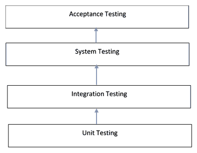

# 八、编写可测试代码

在本章中，我们进入了本书的第二部分，其中介绍了使用 Python 开发企业级应用。本书的第一部分着重于如何在考虑可伸缩性和性能的情况下构建企业级应用，而第二部分则着重于应用的内部开发方面，例如我们如何确保我们的应用是安全的，它的性能如何，以及如何在交付应用时进行更高质量的检查，以最大限度地减少生产阶段意外行为的发生。

在本章中，我们希望将您的重点放在企业应用开发的一个非常重要的方面，或者，出于这个原因，一个。。。

# 技术要求

本书中的代码清单可在[的`chapter08`目录下找到 https://github.com/PacktPublishing/Hands-On-Enterprise-Application-Development-with-Python](https://github.com/PacktPublishing/Hands-On-Enterprise-Application-Development-with-Python) 。

在[第 6 章](06.html)中*示例*构建 bugzot 中开发的 bugzot 应用的单元测试和功能测试相关的代码示例可以在`chapter06`目录下找到。

可以通过运行以下命令克隆代码示例：

```py
git clone https://github.com/PacktPublishing/Hands-On-Enterprise-Application-Development-with-Python
```

这包括有关如何运行代码的说明。除此之外，本章还需要安装 Python 库，这使我们能够简化测试代码的编写。可通过运行以下命令安装库和所有相关依赖项：

```py
pip install -r requirements.txt
```

# 测试的重要性

作为开发人员，我们通常致力于解决具有挑战性的问题，尝试在复杂的连接中导航，并提出解决方案。但是，有多少次我们会关注代码无法提供预期结果的所有可能方式？尽管很难打破我们作为开发人员自己编写的东西，但它构成了开发周期中最重要的方面之一。

此时，测试成为开发生命周期的一个重要方面。通过回答以下问题，可以总结出应用测试的目的：

*   代码中的各个组件是否按照预期执行？
*   代码流是否来自。。。

# 不同类型的测试

当重点放在交付高质量的应用时，无论是面向普通客户还是面向企业，都需要执行多种类型的测试。这些测试技术可能从应用开发生命周期的不同点开始，因此被相应地分类。

在本节中，我们将重点放在理解与开发人员相关的术语上，而不是集中在一些可以分为黑盒测试和白盒测试的测试方法上。那么，让我们来看一看。

# 单元测试

当我们开始构建应用时，我们将应用划分为若干子模块。这些子模块包含许多类或方法，它们相互作用以实现特定的输出。

为了生成正确的输出，所有单独的类和方法都需要正确工作，否则结果会有所不同。

现在，当我们的目标是检查代码库中各个组件的正确性时，我们通常编写针对这些独立于应用的其他组件的测试。这种独立于其他组件测试单个组件的测试称为**单元测试**。

为了简单地说明这一点，以下是一些。。。

# 集成测试

一个应用不仅仅是在其所有单独的组件都编写完成后才完成的。为了产生任何有意义的输出，这些单独的组件需要根据所提供的输入类型以不同的可能方式相互交互。要对应用代码库进行完整检查，组成应用的组件不仅需要单独测试，还需要在它们相互交互时进行测试。

一旦应用退出单元测试阶段，集成测试就开始了。在集成测试中，通过使用接口使各个组件相互交互，然后测试这种交互，以查看生成的结果是否符合预期。

在集成测试阶段，不仅测试应用组件之间的交互，还测试组件与任何其他外部服务（如第三方 API 和数据库）之间的交互。

简言之，以下是集成测试的一些特性：

*   **重点测试接口：**由于应用的不同组件通过使用组件公开的接口进行交互，因此集成测试的作用是验证这些接口是否按预期工作
*   **通常在单元测试后开始：**组件通过单元测试后，集成在一起，相互连接，然后进行集成测试
*   **代码流测试：**与单元测试不同，单元测试中单独测试各个组件，并且通常模拟对任何其他组件的依赖，集成测试通常关注从一个组件到另一个组件的数据流，因此也检查代码流的结果

正如我们所看到的，集成测试是应用测试过程的重要组成部分，其目的是验证应用的不同组件是否能够正确地相互交互。

一旦集成测试完成，测试过程的下一个阶段就是系统测试，然后是验收测试的最后阶段。下图显示了从单元测试阶段到验收测试阶段的测试流程，以及应用开发过程中可能发生的各种测试。



为了保持这本书的篇幅，我们将跳过对这两种测试技术的解释，而将本章的其余部分集中于实现一些实际的单元测试。

在本章的其余部分中，我们将继续关注单元测试实践以及如何在演示应用中实现它们。

# 考虑测试构建应用

因此，我们现在知道测试很重要，我们还必须了解不同类型的测试。但是，在构建应用时，我们是否需要做一些重要的事情，以便能够正确地测试它？

这个问题的答案有点复杂。尽管我们可以很容易地以我们想要的任何特定方式编写代码，并通过一些过程（例如，单元测试）对代码进行测试，但最好遵循一套通用的指导原则，以便可以轻松有效地测试代码。那么，让我们继续看一下指南：

*   **每个组件都应承担一项责任：**确保测试有效并涵盖。。。

# 测试驱动开发

测试驱动开发是一种软件开发过程，其中软件开发过程首先涉及针对单个需求编写测试，然后构建或改进将通过这些测试的方法。与组件开发完成后编写测试相比，这种过程通常有利于生成缺陷数量较少的应用。

在测试驱动开发过程中，遵循以下步骤：

1.  **添加测试：**一旦指定了需求，开发人员就开始为前一个组件中改进的新组件编写新的测试。此测试设置特定组件的预期结果。
2.  **运行测试，查看新测试是否失败：**添加新测试后，根据代码运行测试，查看新测试是否因预期原因失败。这可以确保测试按预期工作，在不利条件下不会通过。
3.  **编写/修改组件：**一旦测试已经运行并且可以看到预期的结果，我们将继续编写新组件或修改现有组件，以便新添加的测试用例通过。
4.  **运行测试：**一旦进行了所需的修改以使测试通过，测试套件将再次运行，以查看以前失败的测试现在是否通过。这可以确保修改按预期进行。
5.  **重构：**随着我们在 TDD 过程之后的应用开发生命周期中的进展，有时会出现重复的测试或可能承担相同责任的组件。为了消除这些问题，需要不断地重构以减少重复。

现在，我们已经相当了解了测试在任何成功应用的开发中起着多大的重要作用，以及如何编写易于测试的代码。现在，我们该动手了，开始为我们在[第 6 章](06.html)中构建的应用编写一些测试，*示例—构建 BugZot*。

# 编写单元测试

所以，是时候开始编写单元测试了。Python 库为我们提供了很多编写测试的选项，这也很容易。我们通常被宠坏了。这个库本身提供了一个单元测试模块，可以用来编写单元测试，这样我们就不缺乏框架，可以在编写单元测试时使我们的生活更轻松。

因此，让我们首先看看如何使用 Python`unittest`模块编写一些简单的单元测试，然后我们将继续使用一个著名的 Python 测试框架为我们的应用编写单元测试。

# 使用 Python unittest 编写单元测试

Python3 提供了一个非常好的功能库，允许我们为应用编写单元测试。该库称为`unittest`，用于编写单元测试，其范围从非常简单的测试的复杂性到非常复杂的测试，包括在单元测试运行之前的正确设置。

Python`unittest`库中支持的一些功能如下：

*   **面向对象：**该库便于以面向对象的方式编写单元测试。这意味着，通过使用类和方法，以面向对象的形式编写对象。这并不意味着只有面向对象的代码才能使用库进行测试。该库同样支持测试面向对象和非面向对象代码。
*   **测试夹具的能力：**一些测试可能需要在测试运行之前以某种方式设置环境，然后在测试完成后进行适当清理。这就是所谓的测试夹具，Python`unittest`库完全支持它。
*   **编写测试套件的能力：**该库提供编写由多个测试用例组成的全功能测试套件的功能。测试套件的结果会立即聚合并显示。
*   **内置测试运行程序：**测试运行程序用于编排测试并编译已执行测试的结果以生成报告。该库提供了一个内置的测试运行程序来实现此功能。

现在，让我们看看下面的代码，我们将用它来编写单元测试：

```py
import hashlib
import secrets

def strip_password(password):
    """Strip the trailing and leading whitespace.

    Returns:
        String
    """
    return password.strip()

def generate_salt(num_bytes=8):
    """Generate a new salt

    Keyword arguments:
    num_bytes -- Number of bytes of random salt to generate

    Returns:
        Bytes
    """

    return secrets.token_bytes(num_bytes)

def encrypt_password(password, salt):
    """Encrypt a provided password and return a hash.

    Keyword arguments:
    password -- The plaintext password to be encrypted
    salt -- The salt to be used for padding

    Returns:
        String
    """

    passwd_hash = hashlib.pbkdf2_hmac('sha256', password.encode('utf-8'), salt, 10000).hex()
    return passwd_hash
```

在这段代码中，我们定义了一些函数，旨在帮助我们生成可以安全存储在数据库中的密码散列。

现在，我们的目标是利用 Python`unittest`库为前面的代码编写一些单元测试。

以下代码旨在为密码助手模块实现一小部分单元测试：

```py
from helpers import strip_password, encrypt_password
import unittest

class TestPasswordHelpers(unittest.TestCase):
    """Unit tests for Password helpers."""

    def test_strip_password(self):
        """Test the strip password function."""

        self.assertEqual(strip_password(' saurabh '), 'saurabh')

    def test_encrypt_password(self):
        """Test the encrypt password function."""

        salt = b'\xf6\xb6(\xa1\xe8\x99r\xe5\xf6\xa5Q\xa9\xd5\xc1\xad\x08'
        encrypted_password = '2ba31a39ccd2fb7225d6b1ee564a6380713aa94625e275e59900ebb5e7b844f9'

        self.assertEqual(encrypt_password('saurabh', salt), encrypted_password)

if __name__ == '__main__':
    unittest.main()
```

我们创建了一个用于运行单元测试的简单文件。现在，让我们来看看这个文件所做的事情。

首先，我们从所需的模块中导入要测试的函数。对于本例，我们在名为`helpers.py`的文件中定义了这些函数，我们将从中导入它们。下一次导入将获得 Python unittest 库。

一旦我们导入了所需的东西，下一步就是开始编写单元测试。为此，我们首先定义一个名为`TestPasswordHelpers`的类，该类继承自`unittest.TestCase`类。该类用于定义我们可能要执行的一组测试用例，如下所示：

```py
class TestPasswordHelpers(unittest.TestCase):
```

在类定义中，我们接着为要测试的方法定义单独的测试用例。定义测试用例的方法必须以单词`test`开头，以表示此特定方法是测试，需要由测试运行者执行。例如，负责测试我们的`strip_password`方法的方法被命名为`test_strip_password()`：

```py
def test_strip_password(self):
```

在方法定义中，我们使用断言来验证特定方法的输出是否符合我们的预期。例如，`assertEqual`方法用于断言参数 1 是否与参数 2 匹配：

```py
self.assertEqual(strip_password(' saurabh '), 'saurabh')
```

一旦定义了这些测试，接下来要做的就是在终端上运行测试文件时，为它定义一个入口点。这是通过从入口点调用`unittest.main()`方法来完成的。调用后，将运行文件中提到的测试用例并显示输出，如下所示：

```py
python helpers_test.py
..
----------------------------------------------------------------------
Ran 2 tests in 0.020s

OK
```

当您想用 Python 编写单元测试时，这是最简单的。现在，是时候让我们转向更重要的事情了。让我们为演示应用编写一些单元测试。

# 用 pytest 编写单元测试

正如我们所讨论的，用 Python 编写单元测试可以使用我们可以使用的许多选项来完成。例如，在上一节中，我们使用 Python 的`unittest`库来编写单元测试。在本节中，我们将继续使用`pytest`编写单元测试，这是一个为应用编写单元测试的框架。

但是`pytest`提供了什么好处，这意味着我们应该朝着它前进？为什么我们不能继续使用 Python 附带的`unittest`库呢？

虽然 AUTT0 库为我们提供了许多灵活性，同时也有了使用的便利性，但是仍然有许多改进，席 T1 提供给了表，所以让我们看看这些改进是什么：

# 让我们设置 pytest

`pytest`框架是一个独立的框架，在标准化 Python 发行版之外作为一个单独的库提供。在开始使用`pytest`编写测试之前，我们需要安装`pytest`。安装`pytest`不是一项大任务，通过运行以下命令可以轻松完成：

```py
pip install pytest
```

现在，在我们开始为我们的应用编写测试之前，让我们首先在我们的应用目录下创建一个名为*tests*的新目录，该目录与`run.py`所在的目录处于同一级别，通过运行以下命令来存储这些测试用例：

```py
mkdir -p bugzot/tests
```

现在，是时候用`pytest`编写我们的第一个测试了。

# 用 pytest 编写我们的第一个测试

在我们的演示应用中，我们定义了许多用于将数据存储在数据库中的模型。作为我们的第一个测试，让我们针对我们的模型编写一个测试用例。

下面的代码片段显示了我们的`User`模型的一个简单测试用例：

```py
'''File: test_user_model.pyDescription: Tests the User database model'''import sysimport pytest# Setup the import path for our applicationsys.path.append('.') # Add the current rootdir as the module path# import our bugzot model we want to testfrom bugzot.models import User@pytest.fixture(scope='module')def create_user():  user = User(username='joe', email='joe@gmail.com', password='Hello123')  return userdef test_user_creation(create_user): assert create_user.email ...
```

# 用 pytest 编写功能测试

`pytest`框架及其独特的夹具和`flask`的强大功能，使我们能够轻松地为应用编写功能测试。这使我们能够相当轻松地测试我们构建的 API 端点。

让我们看一下我们的索引 API 端点的一个示例测试，然后深入研究如何编写测试。

下面的代码显示了使用`pytest`编写的测试索引 API 端点的示例测试用例：

```py
'''
File: test_index_route.py
Description: Test the index API endpoint
'''
import os
import pytest
import sys
import tempfile

sys.path.append('.')
import bugzot

@pytest.fixture(scope='module')
def test_client():
  db, bugzot.app.config['DATABASE'] = tempfile.mkstemp()
  bugzot.app.config['TESTING'] = True
  test_client = bugzot.app.test_client()

  with bugzot.app.app_context():
    bugzot.db.create_all()

  yield test_client

  os.close(db)
  os.unlink(bugzot.app.config['DATABASE'])

def test_index_route(test_client):
  resp = test_client.get('/')
  assert resp.status_code == 200
```

这是一个非常简单的功能测试，我们编写它是为了测试我们的索引 API 路由，看看它是否正常工作。现在，让我们来看看我们在这里做了什么使这个功能测试工作：

前几行代码或多或少是通用的，在这里我们导入了构建测试所需的一些库。

有趣的工作从我们制作的`test_client()`夹具开始。该装置用于为我们提供一个基于烧瓶的测试客户机，我们可以使用它来测试应用端点，看看它们是否正常工作。

因为我们的应用是一个面向数据库的应用，需要数据库才能正常工作，所以我们需要做的第一件事就是为我们的应用设置一个数据库配置。为了进行测试，我们可以使用一个 SQLite3 数据库，该数据库可以在大多数操作系统中轻松创建。以下调用为我们提供了用于测试目的的数据库：

```py
db, bugzot.app.config['DATABASE'] = tempfile.mkstemp()
```

该调用向数据库返回一个文件描述符和一个我们将存储在应用配置中的 URI。

一旦创建了数据库，下一件事就是告诉我们的应用它正在测试环境中运行，这样应用内部的错误处理就会被禁用，以改进测试的输出。通过将应用配置中的`TESTING`标志设置为`True`即可轻松完成此操作。

Flask 为我们提供了一个简单的测试客户端，我们可以使用它来运行应用测试。通过调用应用`test_client()`方法可以获得该客户端，如下所示：

```py
test_client = bugzot.app.test_client()
```

一旦获得了测试客户机，我们需要设置应用上下文，这是通过调用 Flask 应用的`app_context()`方法来完成的。

建立应用上下文后，我们通过调用`db.create_all()`方法创建数据库。

一旦设置了应用上下文并创建了数据库，接下来我们要做的就是开始测试。这是通过生成测试客户端来实现的：

```py
yield test_client
```

完成后，测试现在执行并控制转移到`test_index_route()`方法，我们只需通过调用`test_client`的`get`方法加载索引路由，如下所示：

```py
resp = test_client.get('/')
```

完成后，我们通过检查响应的 HTTP 状态码并验证其是否为`200`、是否成功来检查 API 是否提供了有效响应，如下所示：

```py
assert resp.status_code == 200
```

一旦测试完成执行，控制转移回 fixture，我们通过关闭数据库文件描述符并删除数据库文件来执行清理，如下所示：

```py
os.close(db)
os.unlink(bugzot.app.config['DATABASE'])
```

很简单，不是吗？这就是我们如何用`pytest`和`Flask`编写一个简单的功能测试。我们甚至可以编写以这种方式处理用户身份验证和数据库修改的测试，但我们将把它作为一个练习留给读者。

# 总结

在本章中，我们了解了测试是如何形成应用开发项目的一个重要方面的，以及为什么它是必要的。这里，我们来看看在开发生命周期中通常使用的不同类型的测试，以及不同技术的用途。然后，我们继续研究如何以一种使测试成为一个简单而有效的过程的方式来设计我们的代码。接下来，我们开始深入研究 Python 语言，看看它为编写测试提供了哪些工具。在这里，我们发现了如何使用 Python`unittest`库编写单元测试，以及如何运行它们。接下来，我们来看看如何利用`pytest`这样的测试框架来编写测试用例。。。

# 问题

1.  单元测试和功能测试之间有什么区别？
2.  我们如何使用 Python`unittest`编写单元测试套件？
3.  固定装置在`pytest`中的作用是什么？
4.  写入固定装置时，`pytest`中的作用域是什么？