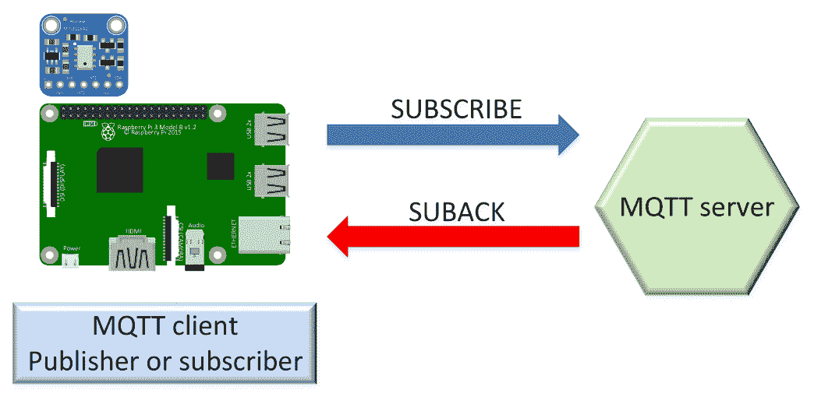
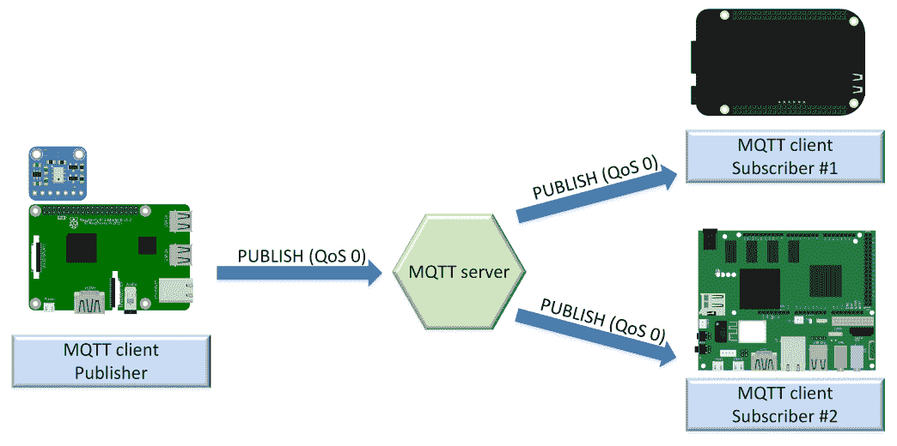

# 二、使用命令行和 GUI 工具了解 MQTT 的工作原理

在本章中，我们将使用命令行和 GUI 工具详细了解 MQTT 3.1.1 的工作原理。我们将学习 MQTT 基础知识、MQTT 的特定词汇表及其工作模式。我们将使用不同的实用程序和图表来理解与 MQTT 相关的最重要的概念。在编写 Python 代码以使用 MQTT 协议之前，我们将了解所有需要了解的内容。我们将使用不同的服务质量（QoS）级别，并分析和比较它们的开销。我们将了解以下内容：

*   使用命令行工具订阅主题
*   使用 GUI 工具订阅主题
*   使用命令行工具发布消息
*   使用 GUI 工具发布消息
*   使用 GUI 工具取消订阅主题
*   学习主题的最佳实践
*   理解 MQTT 通配符
*   了解不同的服务质量级别
*   使用至少一次交付（QoS 级别 1）
*   仅使用一次交付（QoS 级别 2）
*   了解不同服务质量级别的管理费用

# 使用命令行工具订阅主题

无人机是一种物联网设备，可与许多传感器和执行器进行交互，包括与发动机、螺旋桨和伺服电机相连的数字电子速度控制器。无人机也称为**无人机**（**无人机**），但我们肯定会将其称为无人机。让我们想象一下，我们必须监视许多无人机。具体来说，我们必须显示每个伺服电机的高度和速度。并非所有的无人机都有相同数量的发动机、螺旋桨和伺服电机。我们必须监控以下类型的无人机：

| **名称** | **螺旋桨数量** |
| 四轴飞行器 | `4` |
| 六架直升机 | `6` |
| 八人直升机 | `8` |

每架无人机每 2 秒将其高度发布到以下主题：`sensors/dronename/altitude`，其中`dronename`必须替换为分配给每架无人机的名称。例如，名为`octocopter01`的无人机将其高度值发布到`sensors/octocopter01/altitude`主题，名为`quadcopter20`的无人机将使用`sensors/quadcopter20/altitude`主题。

此外，每架无人机每 2 秒将其每个转子的速度发布到以下主题：`sensors/dronename/speed/rotor/rotornumber`，其中`dronename`必须替换为分配给每架无人机的名称，`rotornumber`必须替换为要发布速度的转子编号。例如，名为`octocopter01`的无人机将其转子编号`1`的速度值发布到`sensors/octocopter01/speed/rotor/1`主题。

我们将使用 MOSQUITO 中包含的`mosquitto_sub`命令行实用程序生成一个简单的 MQTT 客户机，该客户机订阅一个主题并打印它接收到的所有消息。在 macOS 或 Linux 中打开终端，或在 Windows 中打开命令提示符，转到安装 MOSQUITO 的目录，然后运行以下命令：

```py
mosquitto_sub -V mqttv311 -t sensors/octocopter01/altitude -d
```

If you want to work with Windows PowerShell instead of the Command Prompt, you will have to add `.\` as a prefix to `mosquitto_sub`.

前面的命令将创建一个 MQTT 客户机，该客户机将与本地 MQTT 服务器建立连接，然后将使客户机订阅在`-t`选项`sensors/octocopter01/altitude`之后指定的主题。我们指定客户机与`-V mqttv311`建立连接时要使用的 MQTT 协议的版本。通过这种方式，我们向 MQTT 服务器指示我们要使用 MQTT 版本 3.11。我们指定`-d`选项来启用调试消息，这将允许我们了解引擎盖下发生的事情。稍后我们将分析连接和订阅的其他选项。

终端或命令提示符窗口将显示与以下行类似的调试消息。考虑到生成的`ClientId`将与`Client mosqsub|17040-LAPTOP-5D`之后显示的不同：

```py
Client mosqsub|17040-LAPTOP-5D sending CONNECT
Client mosqsub|17040-LAPTOP-5D received CONNACK
Client mosqsub|17040-LAPTOP-5D sending SUBSCRIBE (Mid: 1, Topic: sensors/octocopter01/altitude, QoS: 0)
Client mosqsub|17040-LAPTOP-5D received SUBACK
Subscribed (mid: 1): 0
```

当消息从 MQTT 服务器到达 MQTT 客户机时，终端或命令提示符窗口将显示发布到我们订阅的主题的消息。让窗户开着。您将看到客户端向 MQTT 服务器发送`PINGREQ`数据包，并从 MQTT 服务器接收`PINQRESP`数据包。以下几行显示了为这些数据包显示的消息示例：

```py
Client mosqsub|17040-LAPTOP-5D sending PINGREQ
Client mosqsub|17040-LAPTOP-5D received PINGRESP
```

# 使用 GUI 工具订阅主题

MQTT.fx 是一个使用 JavaFX 实现的 GUI 实用程序，可用于 Windows、Linux 和 macOS。此工具允许我们连接 MQTT 服务器、订阅主题过滤器、查看收到的消息以及将消息发布到主题。您可以从本实用程序主页的下载部分下载适用于您的操作系统的相应版本：[http://www.mqttfx.org](http://www.mqttfx.org) 。

现在，我们将使用 MQTT.fx GUI 实用程序生成另一个订阅同一主题`sensors/octocopter01/altitude`的 MQTT 客户机，并显示它接收到的所有消息。我们将使用 MQTT.fx 版本 1.6.0。遵循以下步骤：

1.  启动 MQTT.fx，在位于左上角的下拉列表中选择 local mosquitto，然后单击此下拉列表右侧和连接按钮左侧的配置图标。MQTT.fx 将显示“编辑连接配置文件”对话框，其中包含名为 local mosquito 的连接配置文件的不同选项。在了解 MQTT 客户机发送到 MQTT 服务器以建立连接的数据时，我们分析了其中许多选项。
2.  确保按下“常规”按钮，并确保禁用 MQTT 版本使用默认值复选框。确保在 MQTT 版本下面的下拉列表中选择了 3.1.1。这样，我们告诉 MQTT 服务器我们想要使用 MQTT 版本 3.11。请注意，客户机 ID 文本框指定 MQTT_FX_ 客户机。这是 MQTT.fx 将在`CONNECT`控制数据包中发送给 MQTT 服务器（MOSQUITO）的`ClientId`值。以下屏幕截图显示了一个包含选定选项的对话框：


3.  单击“确定”，然后单击“连接”按钮。MQTT.fx 将与本地 MOSQUITO 服务器建立连接。请注意，由于客户端连接到 MQTT 服务器，所以 Connect 按钮被禁用，Disconnect 按钮被启用。

4.  点击订阅，在订阅按钮左侧的下拉列表中输入`sensors/octocopter01/altitude`。然后，单击订阅按钮。MQTT.fx 将在左侧显示一个新面板，其中包含我们已订阅的主题，如以下屏幕截图所示：


如果不想使用 MQTT.fx 实用程序，可以运行另一个`mosquitto_sub`命令来生成另一个订阅主题的 MQTT 客户端，并打印它收到的所有消息。您只需在 macOS 或 Linux 中打开另一个终端，或在 Windows 中打开另一个命令提示符，转到安装 MOSQUITO 的目录，然后再次运行以下命令。在这种情况下，无需指定此处给出的`-d`选项：

```py
mosquitto_sub -V mqttv311 -t sensors/octocopter01/altitude
```

现在，我们有两个 MQTT 客户端订阅了相同的主题：`sensors/octocopter01/altitude`。现在，我们将了解当客户订阅某个主题时会发生什么。

MQTT 客户端向 MQTT 服务器发送一个`SUBSCRIBE`数据包，数据包标识符（`PacketId`在报头中），一个或多个主题过滤器在有效负载中具有所需的服务质量级别。

**服务质量**称为**QoS**。

因此，单个`SUBSCRIBE`数据包可以要求 MQTT 服务器向客户机订阅许多主题。`SUBSCRIBE`数据包必须至少包含一个主题过滤器和一个 QoS 对，以符合协议。

在我们请求订阅的两种情况下，我们使用特定的主题名称作为主题过滤器的值，因此我们请求 MQTT 服务器订阅单个主题。稍后我们将学习在主题过滤器中使用通配符。

我们使用了默认选项，因此请求的服务质量默认为 0。稍后我们将深入讨论 QoS 级别。现在，我们将继续关注最简单的订阅案例。如果 QoS 级别等于 0，`PacketId`字段的值将为 0。如果 QoS 级别等于 1 或 2，则分组标识符将具有一个数字值来识别分组，并使得能够识别与该分组相关的响应。

MQTT 服务器将处理一个有效的`SUBSCRIBE`数据包，并用一个`SUBACK`数据包进行响应，该数据包指示订阅确认，并确认`SUBSCRIBE`数据包的接收和处理。`SUBACK`数据包将在头中包含`SUBSCRIBE`数据包中接收到的相同数据包标识符（`PacketId`。`SUBACK`数据包将为每对主题过滤器和`SUBSCRIBE`数据包中接收到的期望 QoS 水平包括一个返回码。返回代码的数量将与`SUBSCRIBE`数据包中包含的主题过滤器的数量相匹配。下表显示了这些返回代码的可能值。前三个返回码表示成功订阅，每个值指定可以根据请求的 QoS 和 MQTT 服务器授予请求的 QoS 的可能性交付的最大 QoS：

| **返回码值** | **说明** |
| `0` | 已成功订阅，最大 QoS 为 0 |
| `1` | 已成功订阅，最大 QoS 为 1 |
| `2` | 已成功订阅，最大 QoS 为 2 |
| `128` | 未能订阅 |

如果订阅成功，MQTT 服务器将开始使用返回代码中指定的 QoS 将与订阅中指定的主题筛选器匹配的每个已发布消息发送到 MQTT 客户端。

下图显示了 MQTT 客户端和 MQTT 服务器之间的交互，以订阅一个或多个主题筛选器：



# 使用命令行工具发布消息

我们将使用 MOSQUITO 中包含的`mosquitto_pub`命令行实用程序生成一个简单的 MQTT 客户机，该客户机将消息发布到主题。在 macOS 或 Linux 中打开终端，或在 Windows 中打开命令提示符，转到安装 MOSQUITO 的目录，然后运行以下命令：

```py
mosquitto_pub -V mqttv311 -t sensors/octocopter01/altitude -m  "25 f" -d
```

前面的命令将创建一个 MQTT 客户机，该客户机将与本地 MQTT 服务器建立连接，然后使客户机将消息发布到`-t`选项`sensors/octocopter01/altitude`之后指定的主题。我们在`-m`选项`"25 f"`之后指定消息的有效负载。我们指定客户机与`-V mqttv311`建立连接时要使用的 MQTT 协议版本。通过这种方式，我们向 MQTT 服务器指示我们要使用 MQTT 版本 3.11。我们指定`-d`选项来启用调试消息，这将允许我们了解引擎盖下发生的事情。稍后我们将分析连接和发布的其他选项。

终端或命令提示符窗口将显示与以下行类似的调试消息。考虑到生成的`ClientId`将与`Client mosqpub|17912-LAPTOP-5D`之后显示的不同。发布消息后，客户端将断开连接：

```py
Client mosqpub|17912-LAPTOP-5D sending CONNECT
Client mosqpub|17912-LAPTOP-5D received CONNACK
Client mosqpub|17912-LAPTOP-5D sending PUBLISH (d0, q0, r0, m1, 'sensors/octocopter01/altitude', ... (4 bytes))
Client mosqpub|17912-LAPTOP-5D sending DISCONNECT
```

# 使用 GUI 工具发布消息

现在，我们将使用 MQTT.fx GUI 实用程序生成另一个 MQTT 客户机，该客户机将另一条消息发布到同一主题 sensors/octocopter01/aighty。遵循以下步骤：

1.  转到 MQTT.fx 窗口，在该窗口中您建立了连接并订阅了主题。
2.  点击发布，在发布按钮左侧的下拉列表中输入`sensors/octocopter01/altitude`。
3.  在发布按钮下方的文本框中输入以下文本：`32 f`，如下图所示：


4.  然后，单击“发布”按钮。MQTT.fx 将把输入的文本发布到指定的主题。

如果不想使用 MQTT.fx 实用程序，可以运行另一个`mosquitto_pub`命令来生成另一个将消息发布到主题的 MQTT 客户端。您只需在 macOS 或 Linux 中打开另一个终端，或在 Windows 中打开另一个命令提示符，转到安装 MOSQUITO 的目录，然后运行以下命令：

```py
mosquitto_pub -V mqttv311 -t sensors/octocopter01/altitude -m "32 f"
```

现在，返回终端或命令提示符窗口，在该窗口中您执行了`mosquitto_sub`命令并订阅了`sensors/octocopter01/atitude`主题。您将看到与以下行类似的行：

```py
Client mosqsub|3476-LAPTOP-5DO received PUBLISH (d0, q0, r0, m0, 'sensors/octocopter01/altitude', ... (4 bytes))
25 f
Client mosqsub|3476-LAPTOP-5DO received PUBLISH (d0, q0, r0, m0, 'sensors/octocopter01/altitude', ... (4 bytes))
32 f
```

如果我们清理以客户机前缀开头的调试消息，我们将只看到下面两行。这些行显示了我们订阅`sensors/octocopter01/altitude`主题后收到的两条消息的有效负载：

```py
25 f
32 f
```

转到 MQTT.fx 窗口并单击订阅。在窗口左侧的面板中，您将在标题右侧看到用于订阅的主题筛选器的 2。MQTT.fx 告诉您在`sensors/octocopter01/altitude`主题中收到了两条消息。单击此面板，MQTT.fx 将在面板右侧显示所有接收到的消息。MQTT.fx 将在每条消息的右侧显示一个数字，以指定自启动主题筛选器订阅以来的消息编号。单击每条消息，MQTT.fx 将以默认纯字符串格式显示消息（0）的 QoS 级别、接收日期和时间以及消息的有效负载。以下屏幕截图显示了 MQTT.fx 生成的订阅服务器已接收的第二条消息的有效负载：


我们创建了两个发布者，每个发布者都发布了一条关于同一主题的消息：`sensors/octocopter01/altitude`。此主题的两个订阅者都收到了这两条消息。现在，我们将了解当客户机向主题发布消息时，幕后会发生什么。

已建立连接的 MQTT 客户机向 MQTT 服务器发送一个`PUBLISH`数据包，该数据包的头包含以下字段和标志。我们需要理解这些字段和标志的含义，因为在 Python 中使用 MQTT 工具和 MQTT 客户端库时，我们将能够指定它们的一些值：

*   `PacketId`：如果 QoS 等级等于 0，则该字段的值为 0 或不存在。如果 QoS 级别等于 1 或 2，则分组标识符将具有一个数字值来识别分组，并使得能够识别与该分组相关的响应。
*   `Dup`：如果 QoS 等级等于 0，则该字段的值为 0。如果 QoS 级别等于 1 或 2，则 MQTT 客户机库或 MQTT 服务器可以在订阅者尚未确认第一条消息时重新发送以前由客户机发布的消息。每当试图重新发送已发布的消息时，Dup 标志的值必须为 1 或`True`。
*   `QoS`：指定消息的 QoS 级别。稍后，我们将深入探讨消息的服务质量级别，以及它们与许多其他标志的关系。到目前为止，我们一直在使用 QoS 级别 0。
*   `Retain`：如果此标志的值设置为`1`或`True`，MQTT 服务器将以其指定的 QoS 级别存储消息。每当新的 MQTT 客户机订阅与存储或保留消息的主题匹配的主题筛选器时，此主题的最后一条存储消息将发送给新的订阅者。如果此标志的值设置为`0`或`False`，则 MQTT 服务器不会存储该消息，并且如果为该主题保留了一条消息，则不会将保留的消息替换为相同的主题。
*   `TopicName`：包含消息必须发布到的主题名称的字符串。主题名称具有层次结构，其中斜杠（`/`用作分隔符。在我们的示例中，`TopicName`的值是`"sensors/octocopter01/altitude"`。稍后我们将分析主题名称的最佳实践。

有效负载包含 MQTT 客户机希望 MQTT 服务器发布的实际消息。MQTT 是数据不可知的，因此我们可以发送任何二进制数据，并且没有 JSON 或 XML 强加的限制。当然，如果我们愿意，我们可以使用这些或其他工具来组织有效负载。在我们的示例中，我们发送了一个字符串，其中包括一个表示高度的数字，后跟一个空格，以及一个表示测量单位为`feet`的`"f"`。

MQTT 服务器将读取一个有效的`PUBLISH`数据包，并且它将仅在 QoS 级别大于 0 时响应一个数据包。如果 QoS 级别为 0，MQTT 服务器将不响应。MQTT 服务器将标识其订阅主题与为消息指定的主题名称匹配的所有订阅者，并且服务器将向这些客户端发布消息。

下图显示了 MQTT 客户端和 MQTT 服务器之间的交互，以发布 QoS 级别为 0 的消息：



其他 QoS 级别具有不同的流，发布服务器和 MQTT 服务器之间存在额外的交互，并且增加了我们稍后将分析的开销。

# 使用 GUI 工具取消订阅主题

当我们不希望订阅服务器接收到更多目标主题名称与一个或多个主题筛选器匹配的消息时，订阅服务器可以向 MQTT 服务器发送取消订阅主题筛选器列表的请求。显然，取消订阅主题过滤器与订阅主题过滤器相反。我们将使用 MQTT.fx GUI 实用程序从`sensors/octocopter01/altitude`主题取消订阅 MQTT 客户端。遵循以下步骤：

1.  转到 MQTT.fx 窗口，在该窗口中您建立了连接并订阅了主题。
2.  单击订阅。

3.  单击窗口左侧显示`sensors/octocopter01/altitude`主题名称的面板。然后，单击此面板中的“取消订阅”按钮。以下屏幕截图显示了此按钮：


4.  MQTT.fx 将从`sensors/octocopter01/altitude`主题取消订阅客户端，因此客户端不会收到发布到`sensors/octocopter01/altitude`主题的任何新消息。

现在，我们将使用 MQTT.fx GUI 实用程序使 MQTT 客户机向`sensors/octocopter01/altitude`发布另一条消息。遵循以下步骤：

1.  转到 MQTT.fx 窗口，在该窗口中您建立了连接并订阅了主题。
2.  点击发布，在发布按钮左侧的下拉列表中输入`sensors/octocopter01/altitude`。
3.  然后，单击“发布”按钮。MQTT.fx 将把输入的文本发布到指定的主题。

4.  在发布按钮下方的文本框中输入以下文本：`37 f`，如下图所示：


如果不想使用 MQTT.fx 实用程序，可以运行`mosquitto_pub`命令生成另一个 MQTT 客户机，该客户机将消息发布到主题。您只需在 macOS 或 Linux 中打开另一个终端，或在 Windows 中打开另一个命令提示符，转到安装 MOSQUITO 的目录，然后运行以下命令：

```py
mosquitto_pub -V mqttv311 -t sensors/octocopter01/altitude -m "37 f"
```

现在，返回 MQTT.fx 窗口并单击 Subscribe 以检查已接收的消息。在我们向`sensors/octocopter01/altitude`主题发布新消息之前，客户端已取消订阅该主题，因此不会显示最近发布的有效负载为`"37 f"`的消息。

返回终端或命令提示符窗口，在该窗口中您执行了`mosquitto_sub`命令并订阅了`sensors/octocopter01/atitude`主题。您将看到类似于以下内容的行：

```py
Client mosqsub|3476-LAPTOP-5DO received PUBLISH (d0, q0, r0, m0, 'sensors/octocopter01/altitude', ... (4 bytes))
37 f
```

该客户端仍然订阅了`sensors/octocopter01/altitude`主题，因此收到了有效负载为`"37 f"`的消息。

MQTT 客户端向 MQTT 服务器发送一个`UNSUBSCRIBE`数据包，数据包标识符（`PacketId`位于报头中，一个或多个主题过滤器位于有效负载中。`SUBSCRIBE`数据包的主要区别在于，不必为每个主题筛选器包含 QoS 级别，因为 MQTT 客户端只想取消订阅。

After an MQTT client unsubscribes from one or more topic filters, the MQTT server still keeps the connection open; the subscriptions to topic filters that don't match the topic filters specified in the `UNSUBSCRIBE` packet payload will continue working.

因此，单个`UNSUBSCRIBE`数据包可以要求 MQTT 服务器从许多主题中取消订阅客户端。`UNSUBSCRIBE`数据包必须在有效负载中至少包含一个主题过滤器，以符合协议。

在前面的示例中，我们请求 MQTT 服务器取消订阅，我们使用特定的主题名称作为主题筛选器的值，因此我们请求 MQTT 服务器取消订阅单个主题。如前所述，我们将在后面学习在主题过滤器中使用通配符。

数据包标识符将具有一个数字值来识别数据包，并使其能够识别与该`UNSUBSCRIBE`数据包相关的响应。MQTT 服务器将处理一个有效的`UNSUBSCRIBE`数据包，并用一个`UNSUBACK`数据包进行响应，该数据包表示取消订阅确认，并确认`UNSUBSCRIBE`数据包的接收和处理。`UNSUBACK`数据包将在头中包含与`UNSUBSCRIBE`数据包中接收到的相同的数据包标识符（`PacketId`。

MQTT 服务器将删除与发送数据包的特定客户端的`UNSUBSCRIBE`数据包有效负载中的任何指定主题过滤器完全匹配的任何主题过滤器。主题筛选器匹配必须精确才能删除。MQTT 服务器从客户机的订阅列表中删除主题筛选器后，服务器停止添加要发布到客户机的新消息。只有已开始向 QoS 级别为 1 或 2 的客户端传递的消息才会发布到客户端。此外，服务器可能会发布已缓冲以分发给订阅服务器的现有消息。

下图显示了在取消订阅一个或多个主题筛选器时 MQTT 客户端和 MQTT 服务器之间的交互：


# 学习主题的最佳实践

我们已经知道 MQTT 允许我们发布关于主题的消息。发布者必须始终指定消息将发布到的主题名称。理解 MQTT 中主题名的最简单方法是将它们看作文件系统中的路径。

如果我们必须为不同数量的无人机保存几十个包含不同类型传感器信息的文件，我们可以创建目录或文件夹的层次结构来组织我们将要保存的所有文件。我们可以创建一个名为`sensors`的目录，然后为每个无人机创建一个子目录，如`octocopter01`，最后创建一个带有传感器名称的子目录，如`altitude`。macOS 或 Linux 中的路径将是`sensors/octocopter01/altitude`，因为这些操作系统使用正斜杠（`/`）作为分隔符。在 Windows 中，路径将为`sensors\drone\altitude`，因为此操作系统使用反斜杠（`\`）作为分隔符。

然后，我们将在创建的路径中保存名为`octocopter01`的无人机高度传感器信息的文件。我们不必将文件保存在路径中，而是可以考虑将消息发布到路径，并使用我们用于在路径中组织文件以在主题中排列消息的相同机制。

主题具有主题级别，特别是主题级别的层次结构，而不是目录或文件夹，斜杠（`/`用作分隔符，即主题级别分隔符。如果我们使用`sensors/octocopter01/altitude`作为主题名称，`sensors`是第一个主题级别，`octocopter01`是第二个主题级别，`altitude`是第三个主题级别。

Topic names are case-sensitive, and therefore `sensors/octocopter01/altitude` is different from `sensors/Octocopter01/altitude`, `Sensors/octocopter01/altitude`, and `Sensors/Octocopter01/Altitude`. In fact, the four strings will be considered as four individual topic names. We must make sure we select a case scheme for the topic names and we use it for all topic names and topic filters.

我们可以在主题名称中使用任何 UTF-8 字符，后面将分析的两个通配符除外：加号（`+`）和哈希（`#`）。因此，我们必须避免主题名称中的`+`和`#`。但是，限制字符集以避免客户端库出现意外问题是一种很好的做法。例如，我们可以避免使用英语中不常见的重音和字符，就像我们在构建 URL 时所做的那样。可以使用这些字符，但使用它们时肯定会遇到问题。

我们应该避免创建以美元符号（`$`开头的主题，因为许多 MQTT 服务器在以`$`开头的主题中发布与服务器相关的统计数据。具体来说，第一个主题级别是`$SYS`。

在向不同的主题名称发送消息时，我们必须保持一致性，就像在不同路径中保存文件时一样。例如，如果我们想发布名为`hexacopter20`的无人机的高度，我们将使用`sensors/hexacopter20/altitude`。我们必须使用与`octocopter01`相同目标相同的主题级别，只需将无人机名称从`octocopter01`更改为`hexacopter20`。使用不同结构的主题或不一致的案例（如`altitude/sensors/hexacopter20`或`Sensors/Hexacopter20/Altitude`）将是一种非常糟糕的做法。我们必须考虑到，我们可以使用主题过滤器订阅多个主题，因此创建相应的主题名称非常重要。

# 理解 MQTT 通配符

在分析订阅操作时，我们了解到 MQTT 客户机可以订阅一个或多个主题过滤器。如果我们指定一个主题名作为主题过滤器，我们将只订阅一个主题。我们可以利用以下两个通配符创建主题筛选器，订阅与筛选器匹配的所有主题：

*   **加号**（`+`）：这是一个单级通配符，匹配特定主题级别的任何名称。我们可以使用这个通配符，而不是在主题过滤器中为任何主题级别指定名称。
*   **散列**（`#`）：这是一个多级通配符，我们只能在主题过滤器的末尾使用，作为最后一级，它匹配第一级与`#`符号左侧指定的主题级别相同的任何主题。

例如，如果我们想要接收所有无人机高度相关的所有消息，我们可以使用`+`单级通配符，而不是特定的无人机名称。我们可以使用以下主题过滤器：`sensors/+/altitude`。

如果我们将消息发布到以下主题，则使用`sensors/+/altitude`主题筛选器的订阅者将收到所有消息：

*   `sensors/octocopter01/altitude`
*   `sensors/hexacopter20/altitude`
*   `sensors/superdrone01/altitude`
*   `sensors/thegreatestdrone/altitude`

`sensors/+/altitude`主题筛选器的订户不会接收发送到以下任何主题的消息，因为它们与主题筛选器不匹配：

*   `sensors/octocopter01/speed/rotor/1`
*   `sensors/superdrone01/speed/rotor/2`
*   `sensors/superdrone01/remainingbattery`

如果我们想要接收与名为`octocopter01`的无人机的所有传感器相关的所有消息，我们可以在无人机名称和斜杠（`/`后使用`#`多级通配符。我们可以使用以下主题过滤器：`sensors/octocopter01/#`。

如果我们将消息发布到以下主题，则使用`sensors/octocopter01/#`主题筛选器的订阅者将收到所有消息：

*   `sensors/octocopter01/altitude`
*   `sensors/octocopter01/speed/rotor/1`
*   `sensors/octocopter01/speed/rotor/2`
*   `sensors/octocopter01/speed/rotor/3`
*   `sensors/octocopter01/speed/rotor/4`
*   `sensors/octocopter01/remainingbattery`

我们使用了一个多级通配符，因此，不管`sensors/octocopter01/`之后有多少额外的主题级别，我们都会收到它们。

`sensors/octocopter01/#`主题筛选器的订户不会接收发送到以下任何主题的消息，因为它们与主题筛选器不匹配。以下任何一项都没有`sensors/octocopter01/`作为前缀，因此它们与主题筛选器不匹配：

*   `sensors/hexacopter02/altitude`
*   `sensors/superdrone01/altitude`
*   `sensors/thegreatestdrone/altitude`
*   `sensors/drone02/speed/rotor/1`
*   `sensors/superdrone02/speed/rotor/2`
*   `sensors/superdrone02/remainingbattery`

显然，我们在使用任何通配符时都必须小心，因为我们可能使用单个主题过滤器订阅大量主题。我们必须避免订阅客户端不感兴趣的主题，以避免浪费不必要的带宽和服务器资源。

稍后，我们将在订阅中使用这些通配符来分析不同的 QoS 级别如何与 MQTT 一起工作。

# 了解不同的 QoS 级别

现在我们了解了连接、订阅和发布如何与主题名称和带有通配符的主题过滤器结合使用，我们可以深入研究 QoS 级别。到目前为止，我们已经分析了订阅和发布如何在 QoS 级别等于 0 的情况下工作。现在，我们将了解这个数字的含义，以及当我们使用其他可用的 QoS 级别进行发布和订阅时，事情是如何工作的。

请记住，发布涉及从 MQTT 客户机发布到 MQTT 服务器，然后从服务器发布到订阅的客户机。了解我们可以使用一个 QoS 级别发布和使用另一个 QoS 级别订阅是非常重要的。因此，发布服务器和 MQTT 服务器之间的发布过程有一个 QoS 级别，MQTT 服务器和订阅服务器之间的发布过程有另一个 QoS 级别。我们将使用发送方和接收方来确定不同 QoS 级别的消息传递所涉及的各方。在发布服务器和 MQTT 服务器之间的发布过程中，发布服务器将是发送方，MQTT 服务器将是接收方。在 MQTT 服务器和订阅服务器之间的发布过程中，发送方将是 MQTT 服务器，接收方将是订阅服务器。

基于 QoS 级别，在 MQTT 协议中，相关方之间成功传递消息的含义存在差异。QoS 级别是消息的发送者和接收者之间关于实际传递消息的保证的协议。这些保证可能包括消息可能到达的次数和重复的可能性（或否）。MQTT 支持以下三种可能的 QoS 级别：

*   **0，最多一次交付**：此 QoS 级别提供与底层 TCP 协议相同的保证。接收方或目的地未确认该消息。发送者只是将消息发送到目的地，没有其他事情发生。对于可能无法到达目的地的任何邮件，发件人既不存储也不安排新的传递。此 QoS 级别的关键优势在于，与其他 QoS 级别相比，它具有尽可能低的开销。
*   **1，至少一次传递**：此 QoS 级别向必须接收消息的目的地添加确认要求。通过这种方式，QoS 级别 1 保证消息将至少向订阅者发送一次。这种 QoS 级别的一个关键缺点是，它可能会生成重复的消息，也就是说，同一消息可能会多次发送到同一目的地。发送方存储消息，直到收到订户的确认。如果发送方在特定时间内未收到确认，发送方将再次向接收方发布消息。如果不应重复处理两次，则最终接收器必须具有必要的逻辑来检测重复。
*   **2，恰好一次传递**：此 QoS 级别保证消息只传递一次到目的地。与其他 QoS 级别相比，QoS 级别 2 的开销最高。此 QoS 级别需要发送方和接收方之间的两个流。在发送方确定目的地已成功接收一次 QoS 级别为 2 的消息后，将其视为已成功发送。

有时，我们只是希望消息以尽可能少的带宽使用率来传递，我们有一个非常可靠的网络，如果由于某种原因丢失了一些消息，这并不重要。在这些情况下，QoS 级别 0 是合适的选择。

在其他情况下，消息非常重要，因为它们代表控制物联网设备的命令，网络不可靠，我们必须确保消息到达目的地。此外，重复的命令可能会产生一个大问题，因为我们不希望物联网设备处理特定命令两次。在这些情况下，QoS 级别 2 将是合适的选择。

If a publisher works with a QoS level higher than the QoS level specified by the subscriber, the MQTT server will have to downgrade the QoS level to the lowest level that the specific subscriber is using when it publishes the message from the MQTT server to this subscriber. For example, if we use QoS level 2 to publish a message from the publisher to the MQTT server, but one subscriber has requested QoS level 1 when making the subscription, the publication from the MQTT server to this subscriber will use QoS level 1.

# 使用至少一次交付（QoS 级别 1）

首先，我们将使用通配符订阅 QoS 级别为 1 的主题筛选器，然后将一条消息发布到与 QoS 级别为 1 的主题筛选器匹配的主题名称。通过这种方式，我们将分析发布和订阅如何在 QoS 级别 1 下工作。

我们将使用 MOSQUITO 中包含的`mosquitto_sub`命令行实用程序生成一个简单的 MQTT 客户机，该客户机订阅 QoS 级别为 1 的主题过滤器，并打印它接收到的所有消息。在 macOS 或 Linux 中打开终端，或在 Windows 中打开命令提示符，转到安装 MOSQUITO 的目录，然后运行以下命令：

```py
mosquitto_sub -V mqttv311 -t sensors/+/altitude -q 1 -d
```

前面的命令将创建一个 MQTT 客户机，该客户机将与本地 MQTT 服务器建立连接，然后将使客户机订阅在`-t`选项`sensors/+/altitude`之后指定的主题筛选器。我们指定要使用 QoS 级别 1 订阅带有`-q 1`选项的主题过滤器。我们指定`-d`选项以启用调试消息，这将允许我们了解引擎盖下发生的事情以及与发布 QoS 级别为 0 的消息相比的差异。

终端或命令提示符窗口将显示与以下行类似的调试消息。考虑到生成的`ClientId`将与`Client mosqsub|16736-LAPTOP-5D`之后显示的不同。请注意，`QoS: 1`表示订阅是以 QoS 级别 1 完成的：

```py
Client mosqsub|16736-LAPTOP-5D sending CONNECT
Client mosqsub|16736-LAPTOP-5D received CONNACK
Client mosqsub|16736-LAPTOP-5D sending SUBSCRIBE (Mid: 1, Topic: sensors/+/altitude, QoS: 1)
Client mosqsub|16736-LAPTOP-5D received SUBACK
Subscribed (mid: 1): 1
```

我们将使用 MOSQUITO 中包含的`mosquitto_pub`命令行实用程序生成一个简单的 MQTT 客户机，该客户机将消息发布到 QoS 级别为 1 的主题，而不是之前发布消息时使用的 QoS 级别 0。在 macOS 或 Linux 中打开终端，或在 Windows 中打开命令提示符，转到安装 MOSQUITO 的目录，然后运行以下命令：

```py
mosquitto_pub -V mqttv311 -t sensors/hexacopter02/altitude -m  "75 f" -q 1 -d
```

前面的命令将创建一个 MQTT 客户机，该客户机将与本地 MQTT 服务器建立连接，然后使客户机将消息发布到`-t`选项`sensors/hexacopter02/altitude`之后指定的主题。我们在`-m`选项`"75 f"`之后指定消息的有效负载。我们指定要使用 QoS 级别 1 来发布带有`-q 1`选项的消息。我们指定 X 选项以启用调试消息，这将允许我们了解引擎盖下发生的事情以及与发布 QoS 级别为 0 的消息相比的差异。

终端或命令提示符窗口将显示与以下行类似的调试消息。考虑到生成的`ClientId`将与`Client mosqpub|19544-LAPTOP-5D`之后显示的不同。发布消息后，客户端将断开连接：

```py
Client mosqpub|19544-LAPTOP-5D sending CONNECT
Client mosqpub|19544-LAPTOP-5D received CONNACK
Client mosqpub|19544-LAPTOP-5D sending PUBLISH (d0, q1, r0, m1, 'sensors/drone02/altitude', ... (4 bytes))
Client mosqpub|19544-LAPTOP-5D received PUBACK (Mid: 1)
Client mosqpub|19544-LAPTOP-5D sending DISCONNECT
```

前面几行显示生成的 MQTT 客户机向 MQTT 服务器发送`PUBLISH`数据包，然后从服务器接收`PUBACK`数据包。

现在，返回终端或命令提示符窗口，在该窗口中您执行了`mosquitto_sub`命令并订阅了`sensors/+/atitude`主题过滤器。您将看到与以下行类似的行：

```py
Client mosqsub|16736-LAPTOP-5D received PUBLISH (d0, q1, r0, m1, 'sensors/drone02/altitude', ... (4 bytes))
Client mosqsub|16736-LAPTOP-5D sending PUBACK (Mid: 1)
75 f
```

前面几行显示生成的 MQTT 客户端，即订阅者，从 MQTT 服务器接收到一个`PUBLISH`包，然后向服务器发送一个`PUBACK`包以确认消息。如果我们清理以`Client`前缀开头的调试消息，我们将只看到最后一行，该行显示了由于订阅`sensors/+/altitude`主题筛选器而收到的消息的有效负载：`75 f`。

已经建立连接的 MQTT 客户机，即发布服务器，向 MQTT 服务器发送一个`PUBLISH`数据包，该数据包的标题我们已经描述过，QoS 设置为 1，并且包含一个`PacketId`数值，该数值对于该客户机是唯一的。此时，出版商会考虑用 Type T3T 标识的 Tyr2 T2 包作为未确认的 T4 包。

MQTT 服务器读取一个有效的`PUBLISH`数据包，并使用与`PUBLISH`数据包使用的`PacketId`值相同的`PUBACK`数据包响应发布服务器。一旦发布服务器接收到`PUBACK`数据包，它将丢弃该消息，MQTT 服务器负责将其发布到适当的订阅者。

下图显示了发布服务器和 MQTT 服务器之间的交互，以发布 QoS 级别为 1 的消息：


MQTT 服务器可以在向发布服务器发送`PUBACK`数据包之前开始向适当的订阅服务器发布消息。因此，当发布服务器从 MQTT 服务器接收到`PUBACK`数据包时，并不意味着所有订户都收到了消息。理解此`PUBACK`数据包的含义非常重要。

对于必须向其发布消息的每个订阅者，MQTT 服务器将发送一个`PUBLISH`数据包，订阅者必须通过向 MQTT 服务器发送一个`PUBACK`数据包来确认收到消息。下图显示了在 QoS 级别为 1 的消息发布时 MQTT 服务器和订阅者之间的交互：


If the application is able to tolerate duplicates and we have to make sure that messages reach the subscribers at least once, QoS level 1 is an excellent choice. If there is no way to handle duplicates, we have to use QoS level 2.

# 仅使用一次交付（QoS 级别 2）

首先，我们将使用通配符订阅 QoS 级别为 2 的主题筛选器，然后我们将向一个主题发布一条消息，该主题将与 QoS 级别为 2 的主题筛选器相匹配。通过这种方式，我们将分析发布和订阅如何在 QoS 级别 2 下工作。

我们将使用 MOSQUITO 中包含的`mosquitto_sub`命令行实用程序生成一个简单的 MQTT 客户机，该客户机订阅 QoS 级别为 1 的主题过滤器，并打印它接收到的所有消息。在 macOS 或 Linux 中打开终端，或在 Windows 中打开命令提示符，转到安装 MOSQUITO 的目录，然后运行以下命令：

```py
mosquitto_sub -V mqttv311 -t sensors/quadcopter30/# -q 2 -d
```

前面的命令将创建一个 MQTT 客户机，该客户机将与本地 MQTT 服务器建立连接，然后将使客户机订阅在`-t`选项`sensors/quadcopter30/#`之后指定的主题筛选器。我们指定要使用 QoS 级别 2 订阅带有`-q 2`选项的主题过滤器。我们指定`-d`选项以启用调试消息，这将允许我们了解引擎盖下发生的事情以及与发布 QoS 级别为 0 和 1 的消息相比的差异。

终端或命令提示符窗口将显示与以下行类似的调试消息。考虑到生成的`ClientId`将与`Client mosqsub|8876-LAPTOP-5DO`之后显示的不同。请注意，`QoS: 2`表示订阅是以 QoS 级别 2 完成的：

```py
Client mosqsub|8876-LAPTOP-5DO sending CONNECT
Client mosqsub|8876-LAPTOP-5DO received CONNACK
Client mosqsub|8876-LAPTOP-5DO sending SUBSCRIBE (Mid: 1, Topic: sensors/quadcopter30/#, QoS: 2)
Client mosqsub|8876-LAPTOP-5DO received SUBACK
Subscribed (mid: 1): 2
```

我们将使用 MOSQUITO 中包含的`mosquitto_pub`命令行实用程序生成一个简单的 MQTT 客户机，该客户机将消息发布到具有 QoS 级别 2 的主题，而不是我们以前发布消息时使用的 QoS 级别 0 和 1。在 macOS 或 Linux 中打开终端，或在 Windows 中打开命令提示符，转到安装 MOSQUITO 的目录，然后运行以下命令：

```py
mosquitto_pub -V mqttv311 -t sensors/quadcopter30/speed/rotor/1 -m  "123 f" -q 2 -d
```

前面的命令将创建一个 MQTT 客户机，该客户机将与本地 MQTT 服务器建立连接，然后使客户机将消息发布到`-t`选项`sensors/quadcopter30/speed/rotor/1`之后指定的主题。我们在`-m`选项`"123 f"`之后指定消息的有效负载。我们指定使用 QoS 级别 2 来发布带有`-q 2`选项的消息。我们指定`-d`选项以启用调试消息，这将允许我们了解引擎盖下发生的事情以及与发布 QoS 级别为 0 和 1 的消息相比的差异。

终端或命令提示符窗口将显示与以下行类似的调试消息。考虑到生成的`ClientId`将与`Client mosqpub|14652-LAPTOP-5D`之后显示的不同。发布消息后，客户端将断开连接：

```py
Client mosqpub|14652-LAPTOP-5D sending CONNECT
Client mosqpub|14652-LAPTOP-5D received CONNACK
Client mosqpub|14652-LAPTOP-5D sending PUBLISH (d0, q2, r0, m1, 'sensors/quadcopter30/speed/rotor/1', ... (5 bytes))
Client mosqpub|14652-LAPTOP-5D received PUBREC (Mid: 1)
Client mosqpub|14652-LAPTOP-5D sending PUBREL (Mid: 1)
Client mosqpub|14652-LAPTOP-5D received PUBCOMP (Mid: 1)
Client mosqpub|14652-LAPTOP-5D sending DISCONNECT
```

前面几行显示生成的 MQTT 客户机（即发布服务器）与 MQTT 服务器进行了以下数据包交换：

1.  发布服务器向 MQTT 服务器发送了一个`PUBLISH`数据包
2.  发布服务器从 MQTT 服务器接收到一个`PUBREC`数据包
3.  发布服务器向 MQTT 服务器发送了一个`PUBREL`数据包
4.  发布服务器从 MQTT 服务器接收到一个`PUBCOMP`数据包

现在，返回终端或命令提示符窗口，在该窗口中您执行了`mosquitto_sub`命令并订阅了`sensors/quadcopter30/#`主题过滤器。您将看到与以下行类似的行：

```py
Client mosqsub|8876-LAPTOP-5DO received PUBLISH (d0, q2, r0, m1, 'sensors/quadcopter30/speed/rotor/1', ... (5 bytes))
Client mosqsub|8876-LAPTOP-5DO sending PUBREC (Mid: 1)
Client mosqsub|8876-LAPTOP-5DO received PUBREL (Mid: 1)
123 f
Client mosqsub|8876-LAPTOP-5DO sending PUBCOMP (Mid: 1)
```

前面几行显示生成的 MQTT 客户机（即订户）与 MQTT 服务器进行了以下数据包交换：

1.  订阅者从 MQTT 服务器接收到一个`PUBLISH`数据包
2.  订户向 MQTT 服务器发送了一个`PUBREC`数据包
3.  订阅者从 MQTT 服务器接收到一个`PUBREL`数据包
4.  订户在成功接收到带有有效负载的消息后，向 MQTT 服务器发送了一个`PUBCOMP`数据包

如果我们清理以`Client`前缀开头的调试消息，我们将只看到最后一行，它显示了由于订阅了`sensors/quadcopter30/#`主题过滤器而收到的消息的有效负载：`123 f`。

已经建立连接的 MQTT 客户机，即发布服务器向 MQTT 服务器发送一个`PUBLISH`数据包，该数据包具有我们已经描述过的标头，QoS 设置为 2，并且包含一个`PacketId`数值，该数值对于该客户机是唯一的。此时，出版商会考虑用 Type T3T 标识的 Tyr2 T2 包作为未确认的 T4 包。

MQTT 服务器读取一个有效的`PUBLISH`数据包，它将使用一个与`PUBLISH`数据包使用的`PacketId`值相同的`PUBREC`数据包响应发布服务器。`PUBREC`数据包表示 MQTT 服务器接受消息的所有权。一旦发布者收到`PUBREC`数据包，它将丢弃该消息，并存储与该消息和`PUBREC`数据包相关的`PacketId`。

发布服务器向 MQTT 服务器发送一个`PUBREL`数据包，作为对接收到的`PUBREC`数据包的响应。此`PUBREL`数据包将被视为未确认，直到它从 MQTT 服务器接收到与`PacketId`相关的`PUBCOMP`数据包。最后，MQTT 服务器向发布服务器发送带有`PacketId`的`PUBCOMP`数据包，此时，发布服务器和 MQTT 服务器都确定消息已成功传递。

下图显示了发布服务器和 MQTT 服务器之间的交互，以发布 QoS 级别为 2 的消息：


对于必须向其发布消息的 QoS 级别为 2 的每个订阅者，MQTT 服务器将发送一个`PUBLISH`数据包，并且我们在发布者和 MQTT 服务器之间分析的相同数据包交换将在 MQTT 服务器和订阅者之间发生。但是，在本例中，MQTT 服务器充当发布服务器并启动流。下图显示了在 QoS 级别为 2 的消息发布时 MQTT 服务器和订阅者之间的交互：


If the application isn't able to tolerate duplicates and we have to make sure that messages reach the subscribers only once, QoS level 2 is the appropriate choice. However, magic comes with a price: we must take into account that QoS level 2 has the highest overhead compared to the other QoS levels.

# 了解不同服务质量级别的开销

下图总结了 MQTT 客户机和 MQTT 服务器之间交换的不同包，以发布 QoS 级别为 0、1 和 2 的消息。通过这种方式，我们可以很容易地识别出随着 QoS 水平的提高而增加的开销：


It is very important to take into account the additional overhead required by QoS level 2 and to use it only when it is really necessary.

# 测试你的知识

让我们看看您是否能正确回答以下问题：

1.  MQTT 的 QoS 级别 0 表示：
    1.  一次交货
    2.  最多一次交货
    3.  至少一次交货
2.  MQTT 的 QoS 级别 1 表示：
    1.  一次交货
    2.  最多一次交货
    3.  至少一次交货
3.  MQTT 的 QoS 级别 2 表示：
    1.  一次交货
    2.  最多一次交货
    3.  至少一次交货
4.  如果应用程序不能容忍重复，并且我们必须确保消息只到达订阅者一次，那么适当的选择是：
    1.  QoS 级别 0
    2.  QoS 级别 1
    3.  服务质量等级 2
5.  哪个 QoS 级别的开销最高：
    1.  QoS 级别 0
    2.  QoS 级别 1
    3.  服务质量等级 2

权利答案包含在[附录](6.html)*解决方案*中。

# 总结

在本章中，我们使用不同的工具与我们在[第 1 章](1.html)、*安装 MQTT 3.1.1 Mosquitto 服务器*中安装的 Mosquitto MQTT 3.1.1 服务器进行交互。我们使用一个不安全的 MQTT 服务器来轻松理解 MQTT 客户机和 MQTT 服务器之间的交互。

我们通过命令行和 GUI 工具订阅了主题。然后，我们发布 QoS 级别为 0 的消息，并取消订阅主题。我们学习了与主题相关的最佳实践；以及单级和多级通配符。我们详细研究了 MQTT 支持的不同服务质量级别，以及何时适合使用它们。我们分析了它们的优缺点。

现在我们已经了解了 MQTT 3.1.1 的基本原理，我们将学习如何保护 MQTT 服务器并遵循与安全相关的最佳实践，这是我们将在[第 3 章](3.html)、*中讨论的主题，以保护 MQTT 3.1.1 Mosquitto 服务器*。