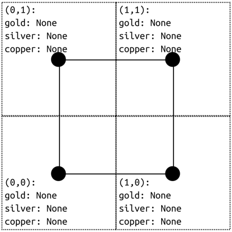
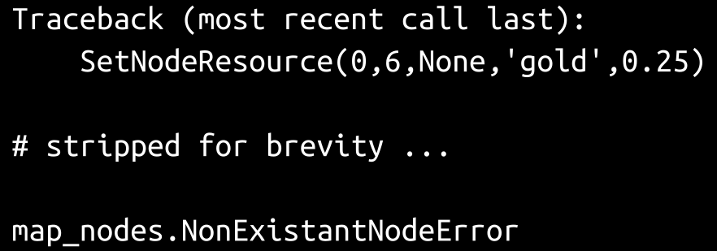

# 编程与软件工程

开发商店通常有其开发人员所属的特定级别、等级或等级，表明每个级别的员工所期望的经验、专业知识和行业智慧水平。这些可能因位置而异（可能相差很大），但典型结构如下所示：

*   **初级开发人员：**初级开发人员通常是没有太多编程经验的人。他们可能知道编写代码的基本知识，但他们不需要知道更多。
*   **开发人员：**中级开发人员（无论正式名称是什么）通常都有足够的经验，可以信赖他们编写合理可靠的代码，几乎没有监督。他们可能有足够的经验来确定实现细节和策略，并且他们通常会对不同的代码块如何能够（并且确实）相互交互以及什么方法可以最大限度地减少这些交互中的困难有一些了解。
*   **高级开发人员：**高级开发人员有足够的经验——即使专注于一组特定的产品/项目——能够牢牢掌握典型开发工作中涉及的所有技术技能。在他们职业生涯的这一点上，他们几乎总能牢牢掌握所涉及的许多非技术（或半技术）技能，尤其是鼓励或强化商业价值观（如稳定性和发展努力的可预测性）的政策和程序，以及战略和战术。他们可能不是这些领域的专家，但他们知道什么时候应该指出风险，并且他们通常会有几个选项来建议如何降低这些风险。

Above the level of the senior developer, the terminology and definition often varies even more wildly, and the skill set usually starts to focus more on business-related abilities and responsibilities (scope and influence) than on technical capabilities or expertise.

就技术能力和专业知识而言，编程和软件工程之间的分界线属于开发人员和高级开发人员之间的差异。在初级阶段，有时在开发人员阶段，工作的中心往往是编写代码以满足应用的任何需求，并符合任何标准。高级开发人员级别的软件工程对相同的最终结果有一个全局视图。更大的图景包括对以下事项的认识和关注：

*   技术/发展标准和其他标准，包括最佳实践
*   编写代码以实现的目标，包括附加到这些目标的业务价值
*   代码所属的整个系统的形状和范围

# 大局

那么，这幅更大的图是什么样子的呢？有三个容易识别的重点领域，第四个（称之为**用户交互**）要么通过其他三个领域进行编织，要么分解为自己的组。

软件工程必须注意标准，特别是非技术（业务）标准，以及最佳实践。这些可能会被遵循，也可能不会被遵循，但是，由于它们是标准或最佳实践，因此不遵循它们应该始终是一个有意识（且有辩护理由）的决定。业务流程标准和实践跨越多个软件组件并不罕见，如果在开发过程中没有考虑一定程度的规程和规划以使其更加可见，这会使它们难以跟踪。在纯粹与开发相关的方面，标准和最佳实践可以极大地影响代码的创建和维护、其持续的有用性，甚至仅仅是在必要时找到给定代码块的能力。

很少有人仅仅为了编写代码而编写代码。几乎总是有一些其他价值与之相关，特别是当代码所属的产品有业务价值或实际收入时。在这些情况下，可以理解的是，为开发工作付费的人员将非常有兴趣确保一切按预期工作（代码质量），并在预期时部署（过程可预测性）。

从现在起，在`hms_sys`项目的开发过程中，代码质量问题将得到解决，而过程可预测性主要受到[第 5 章](https://cdp.packtpub.com/hands_on_software_engineering_with_python/wp-admin/post.php?post=29&action=edit)、*hms_ 系统项目*中讨论的开发方法的影响。

剩下的与政策和程序相关的问题通常是通过在项目启动期间（或者开发团队）建立并遵循各种标准、流程和最佳实践来管理的。在`hms_sys`项目的设置章节中，将对这些项目进行详细检查，例如设置源代码控制、制定标准编码约定以及规划可重复的自动化测试。理想情况下，一旦这些类型的发展过程到位，保持它们运行和可靠的持续活动将成为习惯，成为日常过程的一部分，几乎消失在背景中。

最后，由于更多地关注代码方面，软件工程必须注意整个系统，记住系统的通用视图。软件由许多元素组成，这些元素可能被归类为**原子**；在正常情况下，它们本身是不可分割的单元。就像他们在现实世界中的同伴一样，当他们开始互动时，事情会变得有趣，希望有用。不幸的是，这也是意外（甚至危险）行为 bug 通常开始出现的时候。

这种意识可能是更难培养的项目之一。它依赖于可能不明显、不成文或不易获得的知识。在大型或复杂的系统中，甚至可能不清楚从哪里开始寻找，或者问什么样的问题来试图找到获取知识所需的信息。

# 提问

对于任何给定的代码块，都可以提出许多不同的问题，就像对于复杂系统中的非常简单的代码，都可以提出问题来回答问题一样，对于这些问题，可以提出更多的问题。

如果没有一个明显的起点，那么从以下真正基本的问题开始是很好的第一步：

*   谁将使用该功能？
*   他们会用它做什么？
*   他们何时何地可以使用它？
*   它试图解决什么问题？例如，他们为什么需要它？
*   它必须如何工作？如果缺少细节，将此问题分解为两个独立的问题是有用的：
    *   如果它成功执行，会发生什么？
    *   如果执行失败怎么办？

梳理出关于整个系统的更多信息通常从以下基本问题开始：

*   此代码与系统的哪些其他部分交互？
*   它如何与他们互动？

在确定了所有的活动部件之后，思考“如果……”场景是确定事物将破裂的潜在点、风险和危险交互的好方法。您可以提出以下问题：

*   如果此参数（需要一个数字）被传递给字符串，会发生什么情况？
*   如果该属性不是预期的对象，会发生什么？
*   如果其他对象试图更改该对象，而该对象已被更改，会发生什么情况？

当一个问题被回答时，简单地问，还有什么？这有助于验证当前答案是否合理完整。

让我们看看这个过程的实际情况。为了提供一些上下文，正在为一个系统编写一个新函数，该系统在地图网格上跟踪三种资源：黄金、白银和铜的矿产资源。网格位置以米为单位从一个公共原点测量，每个网格位置跟踪一个浮点数，从 0.0 到 1.0，这表明在网格正方形中找到资源的可能性有多大。开发数据集已经包括四个默认节点，分别为：**0**、**0**、**0**、**1**、**1**、**0**、**1**、**1**——没有值，如下所示：



系统已经定义了一些类来表示各个地图节点，并提供了从这些节点所在的任何中央数据存储中基本访问这些节点及其属性的功能：


各种用途的常量、异常和函数已经存在，如下所示：

*   **`node_resource_names`**：包含系统关注的所有资源名称，可以看作是字符串列表：`['gold','silver','copper']`
*   **`NodeAlreadyExistsError`**：如果试图创建已经存在的`MapNode`，将引发异常
*   **`NonexistentNodeError`**：如果请求的`MapNode`不存在，则会引发异常

*   **`OutOfMapBoundsError`**：如果请求地图区域中不允许存在的`MapNode`，则会引发异常
*   **`create_node(x,y)`**：创建并返回一个新的默认`MapNode`，注册到流程中节点的全局数据集中
*   **`get_node(x,y)`**：在可用节点的全局数据集中指定的（*x*、*y*坐标位置处查找并返回一个`MapNode`

作为项目的一部分，开发人员最初尝试编写代码，为给定节点上的单个资源设置值。生成的代码如下所示（假设所有必要的导入都已存在）：

```py
def SetNodeResource(x, y, z, r, v):
    n = get_node(x,y)
    n.z = z
    n.resources.add(r, v)
```

这段代码是功能性的，从它将为一组简单的测试做它应该做的（以及开发人员期望的）的角度来看；例如，执行，如下所示：

```py
SetNodeResource(0,0,None,'gold',0.25) print(get_node(0,0)) SetNodeResource(0,0,None,'silver',0.25) print(get_node(0,0)) SetNodeResource(0,0,None,'copper',0.25) print(get_node(0,0))
```

结果显示在以下输出中：


按照这个标准，代码及其功能毕竟没有什么问题。现在，让我们问一些问题，如下所示：

*   **谁将使用此功能？**：该函数可由两个不同的应用程序前端、现场测量员或测量后化验员调用。测量员可能不会经常使用它，但如果他们在测量过程中看到明显的矿床迹象，他们将 100%确定地记录在该网格位置找到资源；否则，他们将完全忽略资源评级。

*   **他们会用它做什么？**：在基本需求（为给定节点上的单个资源设置一个值）和前面的答案之间，这感觉好像已经得到了回答。

*   **他们何时何地可以访问它？**：通过验船师和化验师应用程序使用的库。没有人会直接使用它，但它将集成到这些应用程序中。

*   **它应该如何工作？**：这已经得到了回答，但提出了一个问题：是否需要一次添加多个资源评级？如果有一个很好的地方可以实现的话，这可能一文不值。

*   **此代码与系统的哪些其他部分交互？**：代码中没有太多不明显的地方；它使用`MapNode`对象、这些对象的资源和`get_node`函数。

*   **如果试图更改现有的****映射节点，会发生什么情况？**：对于最初编写的代码，其行为符合预期。这是代码编写时要处理的愉快路径，并且它是有效的。

*   **如果节点不存在会发生什么？**：定义了`NonexistentNodeError`这一事实是一个很好的线索，至少有些映射操作需要节点存在才能完成。通过调用现有函数对其执行快速测试，如下所示：

```py
SetNodeResource(0,6,None,'gold',0.25)
```

前面的命令产生以下结果：



这是因为开发数据在该位置还没有 MapNode。

*   **如果节点在给定位置不存在，会发生什么？**：同样，定义了`OutOfMapBoundsError`。由于开发数据中没有越界节点，并且代码当前无法克服越界节点不存在的事实，因此没有很好的方法来查看如果尝试这样做会发生什么。

*   **如果*z*值当时未知，会发生什么情况？**：由于`create_node`函数甚至不需要*z*-值，但 MapNode 实例有一个，因此在现有节点上调用此函数会覆盖现有节点上的现有 z-高度值，这是一个真正的风险。从长远来看，这可能是一个关键缺陷。
*   **这是否符合所有适用的开发标准？**：在没有任何标准细节的情况下，可以公平地假设，任何已定义的标准可能至少包括以下内容：
    *   代码元素的命名约定，如函数名和参数；与`get_node`处于同一逻辑级别的现有函数，使用`SetNodeResources`作为新函数的名称，虽然在语法上完全合法，但可能违反命名约定标准。
    *   至少在文档方面做了一些努力，但没有。
    *   一些内联注释（可能），如果需要向未来的读者解释部分代码，也没有这些注释，尽管考虑到本版本中的代码数量和相对简单的方法，是否有任何需要是有争议的。
*   **如果执行失败怎么办？**：如果在执行过程中出现故障，它可能会抛出显式错误，并给出合理详细的错误消息。
*   **如果为任何参数传递了无效值，会发生什么情况？**：其中一些参数可以通过执行当前函数（如前所述）进行测试，同时首先为无效参数提供一个超出范围的数字，然后是一个无效的资源名称。

考虑下面的代码，用无效的数字执行：

```py
SetNodeResource(0,0,'gold',2)
```

前面的代码产生以下输出：


此外，考虑以下代码，具有无效的资源类型：

```py
SetNodeResource(0,0,'tin',0.25)
```

上述代码产生以下结果：


根据这些示例判断，函数本身在执行过程中可能会成功，也可能会出错；因此，归根结底，真正需要做的就是以某种方式解释这些潜在的错误。

可能会想到其他问题，但前面的问题足以实现一些重大更改。在考虑了上述答案的含义并确定了如何处理这些答案所暴露的问题后，功能的最终版本如下：

```py
def set_node_resource(x, y, resource_name, 
    resource_value, z=None):
    """
Sets the value of a named resource for a specified 
node, creating that node in the process if it doesn't 
exist.

Returns the MapNode instance.

Arguments:
 - x ................ (int, required, non-negative) The
                      x-coordinate location of the node 
                      that the resource type and value is 
                      to be associated with.
 - y ................ (int, required, non-negative) The 
                      y-coordinate location of the node 
                      that the resource type and value is 
                      to be associated with.
 - z ................ (int, optional, defaults to None) 
                      The z-coordinate (altitude) of the 
                      node.
 - resource_name .... (str, required, member of 
                      node_resource_names) The name of the 
                      resource to associate with the node.
 - resource_value ... (float, required, between 0.0 and 1.0, 
                      inclusive) The presence of the 
                      resource at the node's location.

Raises
 - RuntimeError if any errors are detected.
"""
    # Get the node, if it exists
    try:
        node = get_node(x,y)
    except NonexistentNodeError:
        # The node doesn't exist, so create it and 
        # populate it as applicable
        node = create_node(x, y)
    # If z is specified, set it
    if z != None:
        node.z = z
# TODO: Determine if there are other exceptions that we can 
#       do anything about here, and if so, do something 
#       about them. For example:
#    except Exception as error:
#        # Handle this exception
    # FUTURE: If there's ever a need to add more than one 
    #    resource-value at a time, we could add **resources 
    #    to the signature, and call node.resources.add once 
    #    for each resource.
    # All our values are checked and validated by the add 
    # method, so set the node's resource-value
    try:
        node.resources.add(resource_name, resource_value)
        # Return the newly-modified/created node in case 
        # we need to keep working with it.
        return node
    except Exception as error:
        raise RuntimeError(
            'set_node_resource could not set %s to %0.3f '
            'on the node at (%d,%d).' 
            % (resource_name, resource_value, node.x, 
            node.y)
        )
```

暂时去掉注释和文档，这可能与原始代码没有太大区别—只添加了九行代码，但差异很大，如下所示：

*   它并不假定节点总是可用的。
*   如果请求的节点不存在，它将使用为此目的定义的现有函数创建一个新节点来操作。
*   它并不认为每次添加新资源的尝试都会成功。
*   当这样的尝试失败时，它会引发一个错误，显示发生了什么。

所有这些附加项目都是前面提出的问题的直接结果，也是对如何处理这些问题的答案作出有意识决定的直接结果。这种最终结果就是编程和软件工程思维之间的差异真正显现出来的地方。

# 总结

软件工程不仅仅是编写代码。经验注重细节；询问有关代码如何运行、与系统其他部分如何交互等问题；是从编程思维向软件工程思维演变的重要方面。通过简单地提出正确的问题，获得经验所需的时间可能会大大缩短。

还有一些因素完全超出了创建和管理需要检查和提问的代码的范围。他们主要关注围绕开发工作的预开发规划中可以或应该预期的内容，这从理解典型的软件开发生命周期开始。