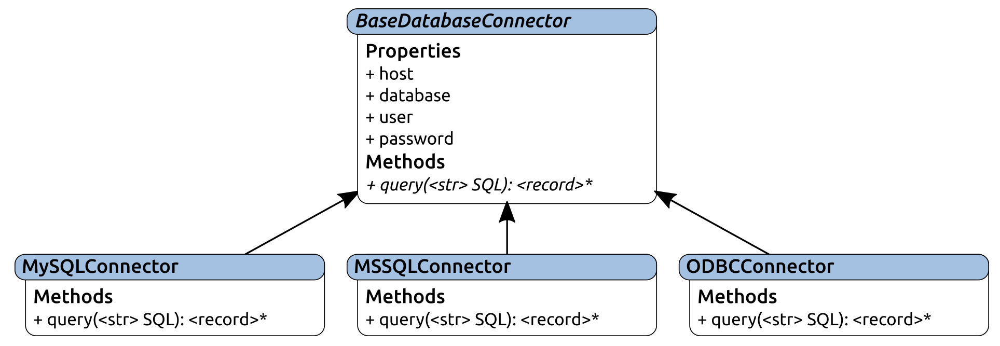

# 十、关于业务对象数据持久性的思考

大多数程序和系统都需要存储和检索数据以进行操作。另一种选择，将数据嵌入代码本身，毕竟是不切实际的。所涉及的数据存储的具体形状可能会有很大差异，这取决于底层存储机制、应用程序或服务的特定需求，甚至是名义上的非技术约束，例如不需要最终用户安装其他软件，但基本需求保持不变，不管这些因素加起来是什么。

`hms_sys`的各个组成项目/子系统也不例外：

*   **Artisan****应用程序**需要允许**Artisan**用户管理**Artisan**正在创建和销售的**产品**，并至少管理他们自己的一些业务实体数据
*   **Artisan****Gateway**服务可能至少需要为**Artisan**、**产品**和**订单**准备数据，并与**客户**和**地址**对象关联，随着这些对象包含的数据在不同的过程中移动
*   **中央办公室应用程序**将需要能够管理**Artisan**和**产品**数据的部分，并且可能需要读取订单数据，如果仅用于故障排除目的

到目前为止，对于该数据将如何持久化，甚至在何处持久化，都没有具体的要求，尽管**Artisan 应用程序**可能需要在本地保存数据，并将其传播到**Artisan 网关**或通过**中央办公室应用程序**将访问该数据的，如下图所示：

本次迭代将完成`hms_sys`中每个组件项目所涉及的数据持久性机制的需求、实施和测试，首先对每个组件项目特定的需求和范围进行一些基本分析。然而，在这一点上，我们对于后端数据存储的外观甚至没有任何明确的方向，因此我们无法真正编写任何故事来为如何实现数据持久性提供有用的指导。显然，在计划和执行这个迭代之前，需要进行更多的调查。

本章将研究以下主题：

*   迭代（敏捷）过程通常如何处理没有足够信息执行的故事
*   通常有哪些数据存储和持久性选项
*   在决定各种`hms_sys`组件项目将如何处理数据访问之前，应该检查哪些数据访问策略

# 迭代（有些）灵活

在许多敏捷方法中，有一些特定的人工制品和/或过程，用于处理迭代开始时的场景类型。对于某些功能，即使只是暗示，但没有足够的信息来实际根据该需求进行任何开发。甚至可能已经有一些故事看起来是完整的，但缺乏一些发展所需的具体细节。在这种情况下，这些故事可能类似于以下内容：

*   作为一名**技工**，我需要将我的**产品**数据存储在本地，这样我就可以使用它，而不必担心连接到我目前可能无法访问的外部系统
*   作为**产品经理**/**审批人**，我需要能够访问任何/所有**工匠**的**产品**信息，以便我能够管理这些产品在网络商店中的可用性
*   作为一名**系统管理员**，我需要**Artisan Gateway**将**产品**及相关数据与主**Web store**应用程序分开存储，以便在发布到公共站点之前能够安全地进行暂存

所有这些故事看起来都很完整，因为它们从每个用户的角度定义了需要发生什么，但是它们缺少关于这些应该如何运作的任何信息。

进入扣球。

Spikes 起源于 XP 方法，并在其他几种敏捷方法中被采用（官方或其他），本质上是一种故事，其目的是研究并返回其他故事的可用规划细节。理想情况下，需要在其周围生成峰值的故事将在其进入迭代之前被识别（如果没有发生），缺少信息的故事将不可行，并且不可避免地会发生某种洗牌，将不完整的故事推迟到其峰值完成，或者将峰值及其结果合并到修订的迭代计划中。然而，前者通常更可能是两者中的一个，因为没有来自峰值的信息，估计目标故事充其量是困难的，也许是不可能的。与我们前面提到的原始故事相关的 spike 故事可能是这样写的：

*   作为一名开发人员，我需要知道如何存储和检索**Artisan****应用程序**数据，以便为这些流程编写相应的代码
*   作为开发人员，我需要知道如何存储和检索**Central****Office Application**数据，以便为这些流程编写相应的代码
*   作为一名开发人员，我需要知道如何存储和检索**Artisan Gateway**数据，以便为这些流程编写相应的代码

为了解决这些尖峰问题，并最终确定本次迭代的故事，了解哪些选项是可用的是很有帮助的。一旦对它们进行了探索，就可以在系统的应用程序和服务层的上下文中对它们进行权衡，并且可以做出一些关于实现方法的最终决定，同时编写一些最终的故事来解决这些问题。

# 数据存储选项

所有需要认真考虑的方案都有几个共同的特点：

*   它们将允许数据离线存储，这样应用程序或服务程序就不需要一直运行以确保相关数据不会丢失
*   它们必须允许应用程序和服务执行四种标准**积垢**操作中的至少三种：
    *   **C****创建**：允许存储新对象的数据。
    *   **R****ead**：允许访问现有对象的数据，一次访问一个对象，一次访问所有对象，并且可能具有一些过滤/搜索功能。
    *   **U****更新**：允许在需要时更改现有数据。
    *   **D****elete**：允许（可能）删除不再相关对象的数据。至少，标记这样的数据，使其不普遍可用也会起作用。

还应根据**酸**特性对其进行检查和评估，尽管并非所有这些特性在`hms_sys`的数据需求中都是必不可少的。但是，没有一个是不可能实现的：

*   **A****tomicity**：数据事务应该是全部或全无，因此，如果部分数据写入失败，正在写入的整个数据集也应该失败，使数据处于稳定状态
*   **C****一致性**：数据事务应始终在整个数据集中产生有效的数据状态，遵守并遵守任何存储系统规则（但应用程序级别的规则由应用程序负责）
*   **Isolat****ion**：数据事务应始终导致相同的结束状态，如果以相同的顺序一次执行一个组件更改，则会发生相同的结束状态
*   **D****可维护性**：数据事务一旦提交，应以一种防止因系统崩溃、断电等而丢失的方式进行存储

# 关系数据库

**关系数据库管理系统**（**RDBMSes**）是应用程序可用的较为成熟的数据存储方法之一，其选项已普遍使用数十年。它们通常将数据存储为表（或关系*中的单个记录（有时称为**行**），这些表定义了所有成员记录的字段名（**列**）和类型。表通常定义一个主键字段，该字段为表中的每条记录提供唯一标识符。定义用户记录的表的简单示例可能类似于以下内容：*

 *

因此，表中的每个记录都是一致的数据结构，上例中的所有用户都将具有`user_id`、`first_name`、`last_name`和`email_address`值，尽管`user_id`以外的字段的值可能为空或`NULL`。任何表中的数据都可以通过查询进行访问或组装，而无需更改表本身，并且可以在查询中连接表，以便（比如）一个表中的用户可以与他们以另一个顺序拥有的记录相关联。

This structure is often referred to as a schema, and it both defines structure and enforces data constraints such as value type and size.

关系数据库最常见的查询语言是**结构化查询语言**（**SQL**），或者至少是它的一些变体。SQL 是 ANSI 标准，但有许多变体可用。可能还有其他选择，但 SQL 几乎肯定是最流行的选择，而且非常成熟和稳定。

SQL is a complex enough topic in its own right, even setting aside its variations across database engines, to warrant a book of its own. We'll explore a little bit of SQL as `hms_sys` iterations progress, though, with some explanation of what is happening.

# 优缺点

关系数据库数据存储的一个更重要的优点是，它能够在单个查询请求中检索相关记录，例如前面提到的用户/订单结构。大多数关系数据库系统还允许在单个请求中进行多个查询，并将每个查询的记录集合作为单个结果集返回。例如，可以查询相同的用户和订单表结构，以返回单个用户和该用户的所有订单，这在应用程序对象结构中具有一些优势，其中一种对象类型具有一个或多个与其关联的对象集合。

对于大多数关系数据库引擎来说，另一个潜在的显著优势是它们对事务的支持，允许在任何单个数据操作因任何原因失败时，将一组潜在复杂的数据更改或数据插入作为一个整体回滚。这实际上保证在任何 SQL RDBMS 中都可用，并且在处理金融系统时是一个非常显著的优势。对事务的支持可能是处理资金流动的系统的一个功能性要求。如果不是，可能值得一问为什么不是。支持包含多个操作的事务是全面 ACID 合规性的一个关键方面，如果没有它，原子性、一致性和（在某种程度上）隔离标准将受到怀疑。幸运的是，几乎任何值得称为关系数据库系统的系统都将提供足够的事务支持，以满足可能出现的任何需求。

许多关系数据库系统还支持创建视图和存储过程/函数，使数据访问更快、更稳定。在所有实际用途中，视图都是预定义的查询，通常跨多个表进行查询，并且构建视图的目的通常是检索与其关联的表中的特定数据子集。存储过程和函数可以看作是应用程序函数的近似等价物，它们接受特定的输入，执行某些任务集，并且可能返回执行这些任务时生成的数据。至少，可以使用存储过程来代替编写查询，这有一些性能和安全优势。

在大多数关系数据库中，表固有的模式既是优点，也是缺点。由于该模式强制执行数据约束，因此表中存在错误数据的可能性较小。预期为字符串值或整数值的字段将始终为字符串或整数值，因为无法将字符串字段设置为非字符串值。这些约束确保了数据类型的完整性。不过，这样做的代价是，在进出数据存储时，可能必须检查和/或转换值类型（有时还包括值本身）。

如果关系数据库有缺点，那可能是包含数据的表的结构是固定的，因此对这些表进行更改需要更多的时间和精力，这些更改可能会影响访问它们的代码。例如，更改数据库中的字段名可能会破坏引用该字段名的应用程序功能。大多数关系数据库系统还需要单独的软件安装和服务器硬件，就像相关应用程序一样，这些硬件在任何时候都可以运行。对于任何给定的项目来说，这可能是一个问题，也可能不是问题，但可能是一个成本考虑因素，特别是如果该服务器位于其他人的基础架构中。

扩展 RDBMS 可能仅限于为服务器本身增加更多马力、改进硬件规格、添加 RAM 或将数据库移动到新的、更强大的服务器。但是，前面提到的一些数据库引擎有额外的包，可以提供多服务器扩展，例如水平扩展到多个服务器，这些服务器仍然像单个数据库服务器一样工作。

# MySQL/MariaDB

MySQL 是一种流行的 RDBMS，在 20 世纪 90 年代中期作为开源项目启动。MariaDB 是 MySQL 的一个社区维护分支，旨在作为 MySQL 的替代品，并在 MySQL（现在由 Oracle 所有）停止在开源许可下发布时作为开源选项继续可用。在撰写本书时，MySQL 和 MariaDB 是可以互换的。

两者都使用相同的 SQL 变体，与标准 SQL 的语法差异通常非常简单。MySQL 是，并且 MariaDB 被认为在读取/检索数据方面比在写入数据方面更优化，但是对于许多应用程序来说，这些优化可能不会引起注意。

MySQL 和 MariaDB 可以通过在基础安装中添加群集和/或复制软件来进行水平扩展，以满足高可用性或负载需求，但要真正有效，还需要额外的服务器（真实或虚拟）。

有几个 Python 库用于连接 MySQL 和与 MySQL 交互，由于 MariaDB 旨在直接替换 MySQL，因此这些库在不修改 MariaDB 访问权限的情况下也可以工作。

# MS-SQL

Microsoft 的 SQL Server 是一个基于 SQL 的专有 DBMS，使用其自己的标准 SQL 变体（与 T-SQL 类似的 MySQL 变体，差异通常很小，至少对于简单到复杂的需求来说是如此）

MS-SQL 还具有针对高可用性和负载场景的群集和复制选项，同样需要离散服务器来最大限度地提高水平扩展的效率。

至少有两个 Python 选项可用于连接和使用 MS-SQL 数据库：

*   `pymssql`：这特别利用了 MS-SQL 使用的**表格数据流**（**TDS**协议），并允许更直接地连接到后端引擎
*   `pyodbc`：通过**开放式数据库连接**（**ODBC**协议）提供数据库连接，截至 2018 年年中，微软对该协议充满信心

# PostgresQL

PostgreSQL 是另一个开源数据库选项，它是一个对象关系数据库系统，其设计重点是标准遵从性。作为 ORDBMS，它允许以更面向对象的方式定义数据结构，表的行为类似于类，能够从其他表/类继承。它仍然使用 SQL 作为它自己的变体，但是对于大多数开发目的来说，它们之间的差别很小，并且有几个 Python 选项用于连接数据库和使用数据库。它还支持复制和集群，与前面的选项中提到的注意事项相同。

# NoSQL 数据库

在撰写本文时，有几十种 NoSQL 数据库选项可用，既可以作为独立/本地服务安装，也可以作为云数据库选项。大多数设计背后的驱动因素包括以下重点：

*   **对大量用户的支持：**数以万计的并发用户，可能是数百万，支持他们对性能的影响应该尽可能小
*   **高可用性和可靠性：**能够与数据交互，即使一个或多个数据库节点完全脱机
*   **支持高度流动的数据结构：**允许结构化数据不绑定到严格的数据模式，甚至可以跨同一数据存储集合中的记录

从开发的角度来看，此列表中的最后一点可能是最重要的，它允许根据需要定义几乎任意的数据结构。

如果 RDBMS 中的表概念是一种存储模型，那么在 NoSQL 数据库连续体中有许多替代存储模型：

*   **文档存储：**每个等价记录都是一个文档，包含创建它时使用的任何数据结构。文档通常是 JSON 数据结构，因此允许对不同的数据类型（字符串、数字和布尔值作为简单值、嵌套列表/数组和对象）进行一些区分，以获得更复杂的数据结构，还允许使用正式的`null`值。

*   **键/值存储：**每个记录等价物只是一个值，属于任何类型，并由一个唯一的键标识。这种方法可以被认为是一个数据库，相当于一个 Python`dict`结构。

*   **宽列存储区：**可以将每条记录视为属于一个 RDBMS 表，其中有大量（无限？）列可用，可能有主键，也可能没有主键。

还有一些变体感觉它们结合了这些基本模型的各个方面。例如，在 Amazon 的 DynamoDB 中创建数据存储首先要定义一个表，该表需要定义一个键字段，并允许定义一个辅助键字段。但是，一旦创建了这些表，这些表的内容就像文档存储一样。然后，最终结果就像一个键/文档存储（每个键指向一个文档的键/值存储）。

NoSQL 数据库通常是非关系型的，尽管也有例外。从开发角度来看，这意味着在处理从 NoSQL 数据存储中存储和检索的应用程序数据时，需要考虑至少三种方法之一：

*   永远不要使用与其他数据相关的数据确保每个记录都作为一个实体包含它所需要的一切。这里的权衡是，如果不是不可能的话，也很难解释一个记录（或与该记录相关联的对象）被两个或多个其他记录/对象共享的情况。例如，多个用户都是其成员的用户组。
*   处理代码中与这些记录相关的记录之间的关系。使用刚才提到的相同用户/组概念，这可能涉及一个`Group`对象，读取所有相关的`User`记录，并在实例化期间使用该数据中的`User`对象填充`users`属性。可能存在一些并发更改相互干扰的风险，但不会比 RDBMS 支持的系统中相同类型的过程的风险大得多。这种方法还意味着数据将按对象类型进行组织—一个不同的`User`对象数据集合和一个不同的`Group`对象数据集合，但可能任何允许区分不同对象类型的机制都会起作用。
*   选择提供某种关系支持的后端数据存储引擎。

NoSQL 数据库也不太可能支持事务，尽管仍然有一些选项提供完全符合 ACID 的事务功能，并且在数据存储级别处理事务需求的标准/选项与前面提到的非常相似，即处理关系功能。即使是那些没有任何事务支持的系统，在这种复杂程度下，对于单个记录仍将是 ACID 兼容的，兼容所需的只是成功存储记录。

# 优缺点

考虑到大多数 NoSQL 选项背后的高可用性和并发用户关注点，它们比 RDBMS 更适合于可用性和可扩展性非常重要的应用程序也就不足为奇了。这些属性在大数据应用程序和生活在云中的应用程序中更为重要，主要云提供商在该领域都有自己的产品，并为一些著名的 NoSQL 选项提供了起点：

*   亚马逊（AWS）：
    *   发电机
*   谷歌：
    *   Bigtable（用于大数据需求）
    *   数据存储
*   Microsoft（Azure）：
    *   宇宙数据库（原名 DocumentDB）
    *   Azure 表存储

在开发过程中，或多或少任意定义数据结构的能力也是一个显著的优势，因为它消除了定义数据库模式和表的需要。至少，潜在的权衡是，由于数据结构可以任意更改，因此必须编写使用它们的代码以容忍这些结构更改，或者可能需要有意识地将更改应用于现有数据项，而不会中断系统及其使用。

举个例子，如果前面提到的 AUTT0 属性席需要添加一个 AUT1 T1 属性，为了提供认证/授权支持，实例化代码可能会考虑到它，并且任何现有的用户对象记录都将没有字段。在代码方面，这可能没什么大不了的`password_hash`初始化期间的可选参数将负责允许创建对象，如果未设置，则将其作为空值存储在数据中将负责数据存储方面，但需要规划、设计某种机制，并实现提示用户提供密码以存储真实值。如果在 RDBMS 支持的系统中进行了类似的更改，则必须执行相同类型的过程，但很有可能存在对数据库模式进行更改的既定过程，这些过程可能包括更改模式和确保所有记录都具有已知的起始值。

考虑到可用选项的数量，它们之间在执行类似任务方面存在差异（有时差异很大）也就不足为奇了。也就是说，从数据中检索记录时，只需为要检索的项目提供唯一标识符（`id_value`，即可根据数据存储背后的引擎使用不同的库和语法/结构：

*   在 MongoDB 中（使用`connection`对象）：
    *   `connection.find_one({'unique_id':'id_value'})`
*   在 Redis 中（使用`redis connection`：
    *   `connection.get('id_value')`
*   在 Cassandra 中（使用`query`值和`criteria`列表，针对 Cassandra`session`对象执行）：
    *   `session.execute(query, criteria)`

很有可能每个不同的引擎都有自己不同的方法来执行相同的任务，尽管可能会出现一些常见的名称。毕竟，函数或方法名称（如 get 或 find）的备选方案太多了。如果一个系统需要能够与多个不同的数据存储后端引擎协同工作，那么这些引擎是设计和实现通用（可能是抽象的）数据存储适配器的理想选择。

由于关系和事务支持因引擎而异，这种不一致性也可能是基于 NoSQL 的数据存储的一个缺点，尽管至少有一些选项可以在缺少时使用。

# 蒙哥达

MongoDB 是一个免费的、开源的 NoSQL 文档存储引擎，也就是说，它将整个数据结构存储为单个文档，这些文档即使不是 JSON，也非常类似于 JSON。在 Python 中发送到`MongoDB`数据库和从`MongoDB`数据库检索的数据使用 Python 本机数据类型（`dict`和`list`集合，任何简单类型，如`str`和`int`，可能还有其他标准类型，如`datetime`对象）。

MongoDB 被设计为可用作分布式数据库，支持高可用性、横向扩展和开箱即用的地理分布。

与大多数 NoSQL 数据存储解决方案一样，MongoDB 是无模式的，允许 MongoDB 集合中的文档（大致相当于 RDBMS 中的表）具有完全不同的结构。

# 其他 NoSQL 选项

如前所述，有几十个 NoSQL 数据库选项可供选择。对于本地安装的具有 Python 驱动程序/支持的 NoSQL 数据库，以下是三个比较流行的选项：

*   **Redis**：一个键/值存储引擎
*   **卡桑德拉**：宽列存储引擎
*   **Neo4j**：图形数据库

# 其他数据存储选项

另一种可能无法很好地处理大量数据或在大量并发用户负载下工作的方法是，将应用程序数据作为一对多文件本地存储在本地计算机上。随着简单结构化数据表示格式（如 JSON）的出现，这可能是一个比乍一看更好的选择，至少对于某些需求来说是这样：特别是 JSON，它具有基本的值类型支持和表示任意复杂或大型数据结构的能力，是一种合理的存储格式。

最重要的障碍是确保数据访问至少具有某种程度的 ACID 合规性，尽管与 NoSQL 数据库一样，如果所有事务都是单记录，ACID 合规性仍然可以依赖，原因与事务的简单性相同。

在使用文件存储应用程序数据时必须解决的另一个重要问题是语言或底层操作系统如何处理文件锁定。如果允许在写入过程中读取开放供写入的文件，或者允许在写入过程中读取不完整的文件，那么读取不完整的数据文件误读可用数据只是时间问题，然后将坏数据提交到该文件，可能会导致至少数据的丢失，并且可能会破坏该过程中的整个数据存储。

很明显，那会很糟糕。

访问速度也可能是一个问题，因为文件访问比访问存储在内存中的数据慢。

也就是说，如果数据只能从代码中的单个源访问，那么可以应用一些策略使基于文件的本地数据存储不受这种故障的影响。解决潜在的访问速度问题也可以在相同的过程中完成，类似于以下过程：

*   使用数据的程序将启动：
    *   数据从持久文件系统数据存储读入内存
*   使用该程序，并进行数据访问：
    *   数据从内存中的副本中读取，并传递给用户
*   数据以某种方式更改：
    *   在将控制权返回给用户之前，记录更改，并将更改提交到文件系统数据存储
*   程序已关闭：
    *   在终止之前，将检查所有数据，以确保没有任何更改仍然挂起
    *   如果有更改，请等待更改完成
    *   如有必要，将所有数据重新写入文件系统数据存储

# 选择数据存储选项

查看`hms_sys`的逻辑架构，并考虑到**Artisan 应用程序**的本地数据存储（原始图中没有），开发需要关注三个数据库：

**网店数据库**已附加到**网店应用程序**上，因此无法修改。目前的预期是，对该数据库中数据的修改将通过调用**Web Store 应用程序**提供的 API 来处理。此时，可以将对该数据库的数据访问和来自该数据库的数据访问放在一边。

另一方面，`artisan`**数据库**根本不存在，必须作为`hms_sys`开发的一部分创建。考虑到 artisan 级别，可以安全地假设第一次迭代中与安装相关的故事，最好将需要执行的软件安装数量保持在尽可能少的水平。这反过来表明，本地文件系统数据存储可能是**Artisan 应用程序**级别的首选选项。这就考虑到了以下几点：

*   数据存储在应用程序的安装或初始设置过程中本地生成
*   **Artisan**可以在本地管理他们的数据，即使他们离线
*   **Artisan**无需安装任何附加软件即可管理数据存储

由于**Artisan 应用程序**预计是一个本地桌面应用程序，因此这正好符合前面提到的一组过程，以使基于文件的数据存储安全稳定。如果**Artisan**安装了多个**Artisan****应用程序**（例如，多台机器上各安装一个），则存在数据冲突的风险，但任何本地数据存储选项都存在这种风险，实际上没有将数据存储移动到公共在线数据库，目前确实没有办法减轻这种特殊的担忧，这超出了`hms_sys`的开发范围。

The idea of centralizing data and applications alike will be examined in more detail later. For now, everything at the Artisan level will reside locally with the Artisan Application.

`hms_sys`**数据库**也根本不存在。与`artisan`**数据库**不同的是，它旨在允许多个并发用户在工匠提交待审查产品信息时，任意数量的中央办公室用户可能在任何给定时间审查或管理产品，在这些活动进行的同时，从网上商店转达或拉取的订单也可能会被发送给相关的工匠。综上所述，这些都足以排除本地文件存储方法—它可能仍然是可行的，甚至在当前使用水平下可能是可行的，但如果使用率/负载增长过快，可能会很快遇到扩展问题。

有鉴于此，即使我们真的不知道将使用什么后端引擎，但知道它将不是**Artisan 应用程序**使用的相同存储机制也证实了前面提到的想法，即我们可以很好地定义一个公共数据访问方法集，围绕该结构生成某种抽象，并定义每个应用程序或服务对象级别的具体实现。采用这种方法的好处实际上可以归结为相同的**面向对象设计原则**（**OODP**）的变体：多态性。

# 多态性（和接口编程）

**多态性**最简单的说法是，对象在代码中可以互换，而不会破坏任何东西。为了实现这一点，这些对象必须为公共接口成员提供所有相同的可访问属性和方法。理想情况下，这些公共接口成员也应该是唯一的接口成员，否则就有破坏这些对象互换性的风险。在基于类的结构中，最好将该接口定义为单独的抽象，即 Python 中的 ABC，无论有无具体成员。考虑以下类集合，用于对各种关系数据库后端进行连接和查询：

哪里：

*   `BaseDatabaseConnector`是一个抽象类，需要所有派生类实现一个查询方法，并提供`host`、`database`、`user`和`password`属性，这些属性将用于实际连接到给定数据库

*   具体的类`MySQLConnector`、`MSSQLConnector`和`ODBCConnector`都实现了所需的`query`方法，允许实例实际对实例所连接的数据库执行查询

如果连接属性（`host`、`password`）存储在配置文件中（或实际代码本身之外的任何地方），并通过某种方式指定要使用的连接器类型，那么在运行时允许定义这些不同的连接类型并不困难，甚至可能在执行过程中被关掉。

反过来，这种互换性允许编写的代码不需要知道任何有关进程如何工作、应该如何调用以及预期结果如何的信息。这是一个实际的例子，说明了编程到接口而不是实现的想法，这在[第 5 章](https://cdp.packtpub.com/hands_on_software_engineering_with_python/wp-admin/post.php?post=29&action=edit)、*hms_sys 系统项目*以及封装变化的概念中提到。这两种情况通常是携手并进的，就像在本例中一样。

以这种方式替换对象的能力还有另一个好处，可以称之为未来验证代码库。如果在将来的某个时候，使用前面显示的数据连接器的代码突然需要能够连接到并使用一个尚未可用的数据库引擎，那么使其可用的工作量将相对较小，前提是它使用了与已有连接参数相同的连接参数和类似的连接过程。例如，要创建一个`PostgreSQLConnector`（用于连接`PostgreSQL`数据库），需要做的就是创建类，从`BaseDatabaseConnector`派生类，并实现所需的`query`方法。它仍然需要一些开发工作，但如果每个数据库连接进程都有自己的不同类需要处理，则可能需要的开发工作就没有那么多了。

# 数据访问设计策略

在开始编写本次迭代的故事之前，我们需要进行的最后一点分析包括确定对象数据访问的责任将在哪里。在脚本或另一个纯过程上下文中，只需连接到数据源，根据需要从中读取数据，根据需要修改数据，然后再次写回任何更改就足够了，但这只能是可行的，因为整个过程是相对静态的。

在`hms_sys`等应用程序或服务中，数据使用在很大程度上是一种随机访问场景。可能有一些常见的过程，甚至看起来很像简单脚本的逐步实现，但这些过程可能（也将）以完全不可预测的方式启动。

那么，这就意味着我们需要有一个数据访问过程，这个过程很容易调用，并且可以用最少的努力重复。鉴于我们已经知道，至少有两种不同的数据存储机制将发挥作用，如果我们能够设计这些流程，以便使用完全相同的方法调用，那么未来的支持和开发也将变得更加容易，无论底层数据存储看起来如何，抽象这些流程，允许代码使用接口，而不是实现。

完成这种抽象的一个选项是从数据源开始，使每个数据源都知道正在使用的对象类型，并将能够对每个对象类型执行 CRUD 操作所需的信息存储在某处。这在技术上是一个可行的实现，但很快就会变得非常复杂，因为需要考虑和维护数据存储和业务对象类型的每个组合。即使初始类集被限制为三个数据存储变体（Artisan 应用程序**的文件系统数据存储**、一个通用 RDBMS 数据存储和一个通用 NoSQL 数据存储），也就是四个业务对象的三种数据存储类型的四个操作（CRUD），总共 48 个排列（4×3×4）必须进行建造、测试和维护。添加到混合中的每个新操作，例如，搜索业务对象数据存储的能力，以及要持久化的每个新业务对象类型和每个新数据存储类型，都会增加置换计数，将每个操作中的一个增加到 75 个项目（5×3×5）必须处理的问题很容易失控。

如果我们后退一步，考虑一下所有这些组合实际需要什么，就有可能找到一个不同的、更易于管理的解决方案。对于每个需要持久化的业务对象，我们需要能够执行以下操作：

1.  为新对象创建记录。
2.  读取以某种方式标识的单个对象的记录，并返回该项的实例。
3.  在对单个对象进行更改后更新该对象的记录。
4.  删除单个对象的记录。
5.  根据与某些条件的匹配，查找并返回零到多个对象。

如果能够将对象标记为处于特定状态的活动对象与处于非活动状态的对象，并将其删除（而不实际删除底层记录），可能也会很有用。跟踪创建和/或更新的日期/时间也是一种常见做法。如果没有其他原因，它有时对排序很有用。

所有 CRUD 操作都与对象类型本身直接相关，也就是说，我们需要能够创建、读取、更新、删除和查找`Artisan`对象才能使用它们。这些实例的各种对象属性可以根据需要在实例创建的上下文中检索和填充，也可以作为实例创建过程的一部分创建，或者使用拥有的实例进行更新，或者根据需要单独进行更新。考虑到这些从属操作，跟踪对象的记录是否需要创建或更新可能也很有用。最后，我们需要跟踪数据存储中每个对象的状态数据记录的一些唯一标识符。把所有这些放在一起，下面是`BaseDataObject`ABC 的样子：

所有属性均为混凝土，在`BaseDataObject`级别烘焙实现：

*   `oid`是对象的唯一标识符，是一个`UUID`值，在数据访问期间将存储为字符串并从字符串转换而来。

*   `created`和`modified`是 Python`datetime`对象，在数据访问期间可能还需要与字符串值表示进行转换。
*   `is_active`是一个标志，指示是否应将给定记录视为活动记录，允许对记录以及这些记录所代表的对象的活动/非活动状态进行一些管理。
*   `is_deleted`是一个类似的标志，指示记录/对象是否应被视为已删除，即使它确实仍然存在于数据库中。
*   `is_dirty`和`is_new`是分别跟踪对象的对应记录是否需要更新（因为它已更改）或创建（因为它是新的）的标志。它们是本地属性，不会存储在数据库中。

Using a `UUID` instead of a numeric sequence requires a bit more work, but has some security advantages, especially in web application and service implementations—`UUID` values are not easily predictable, and have 1632 possible values, making automated exploits against them much more time-consuming. There may be requirements (or at least a desire) to not really delete records, ever. It's not unusual in certain industries, or for publicly traded companies who are required to meet certain data-audit criteria, to want to keep all data, at least for some period of time.

`BaseDataObject`定义了两种具体实例方法和三种抽象实例方法：

*   `create`（抽象和受保护）将要求派生类实现创建状态数据记录并将其写入相关数据库的过程。
*   如果调用它的实例的属性值与传递给它的条件的相应值匹配，则`matches`（具体）将返回一个布尔值。这将有助于在 get 方法中实现基于标准的过滤，稍后将对其进行讨论。
*   `save`（具体）检查实例的`is_dirty`标志，调用实例的`update`方法，如果是`True`则退出，然后检查`is_new`标志，如果是`True`则调用实例的`create`方法。这样做的最终结果是，任何源于`BaseDataObject`的对象都可以简单地告知`save`本身，并将采取适当的行动，即使它不是行动。

*   `to_data_dict`（摘要）将返回对象状态数据的`dict`表示，其值的格式和类型可以写入状态数据记录所在的数据库。
*   `update`（抽象和受保护）是`create`方法的更新实现对应物，用于更新对象的现有状态数据记录。

`BaseDataObject`还定义了四个类方法，所有这些方法都是抽象的，然后绑定到*类*本身，而不是该类的实例，并且必须由派生自`BaseDataObject`的其他类实现：

*   `delete`对提供的`*oids`标识的每个记录执行物理记录删除。
    *   `from_data_dict`返回该类的一个实例，该实例填充了所提供的`data_dict`中的状态数据，该数据通常来自对这些记录所在的数据库的查询。这是我们已经描述过的`to_data_dict`方法的对应物。

*   `get`是使用从数据库检索的状态数据返回对象的主要机制。它被定义为允许特定记录（参数列表）`*oids`和筛选条件（在`**criteria`关键字参数中，它应该是传递给每个对象匹配项的条件参数），并将根据这些值返回未排序的对象实例列表。
*   `sort`接受对象列表，并使用`sort_by`中传递的回调函数或方法对其进行排序。

`BaseDataObject`捕获所有需要呈现的功能需求和公共属性，以便让业务对象类和实例负责其数据存储交互。暂且不考虑任何数据库引擎问题，在**Artisan 应用程序**中定义一个支持数据持久性的业务对象类，如`Artisan`变得非常简单。最终的具体`Artisan`类只需要从`BaseArtisan`和`BaseDataObject`继承，如下所示，然后实现这些父类所需的九个抽象方法：

如果可以安全地假设任何给定的应用程序或服务实例将始终为每个业务对象类型使用相同的数据存储后端，那么这种方法就足够了。任何特定于引擎的需求或功能都可以简单地添加到每个最终的具体类中。不过，也可以将特定数据存储引擎（例如 MongoDB 和 MySQL）所需的任何属性收集到另一个抽象层中，然后让最终的具体对象从其中一个派生：

在这个场景中，最终的`Artisan`类可以派生自`MongoDataObject`或`MySQLDataObject`，这些类可以强制提供针对特定后端引擎执行数据访问方法所需的任何数据。这些中间层 ABC 还可能为与每种引擎类型相关的任务提供一些辅助方法，例如，使用`create_sql`类属性中的模板 SQL，并使用`to_data_dict()`中的实例数据值填充它，从而能够为 MySQL 调用创建最终 SQL 以创建实例。这种方法将任何给定的业务对象类所需的大部分数据访问信息保留在该类中，并与业务对象本身相关联，这并不是一个坏主意，尽管如果需要支持很多组合，它可能会变得复杂。它还将使向所有数据对象添加新功能（在类树的`BaseDataObject`级别）所涉及的工作级别更易于管理。添加新的抽象功能仍然需要在所有派生的具体类中实现，但任何具体的变化都将被简单地继承并立即可用。

# 数据访问决策

考虑到所有这些因素，现在是时候对各个组件项目的对象如何处理跟踪其数据做出一些决定了。为了使所有对象数据访问都有一个单一的接口，我们将实现前面描述的`BaseDataObject`ABC，或者与之非常类似的东西，并从该 ABC 和在上一次迭代中构建的相关业务对象类的组合中派生出最终的数据持久化具体类。最后，我们将得到的是我们称之为数据对象的类，它们能够读取和写入自己的数据。

在**Artisan 应用程序**中，由于我们不需要担心并发用户同时与数据交互，并且由于我们不想让**Artisan**用户负担额外的软件安装，除非没有更好的选择，我们将通过使用本地文件存储对象数据来构建数据持久性机制。

在将在中央办公室上下文中运行的代码中，我们将有并发用户，至少是潜在用户，因此数据存储需要集中在专用数据库系统中。不需要正式的、驻留在数据库中的模式（尽管拥有一个模式并不是一件坏事），因此使用 NoSQL 选项应该可以缩短开发时间，并在数据结构需要意外更改时提供一定的灵活性。我们将在开发工作的这一部分时更详细地重新检查这些选项。

# 为什么要从头开始？

这一功能结构将从头开始构建，但还有其他选项也可能起作用，或者在其他情况下甚至更好。例如，有几个**对象关系映射器**（**ORM**）包/库可供使用，这些包/库允许在代码中定义数据库和结构，并传播到数据存储，其中一些集成到完整的应用程序框架中。其中包括 Django 的`models`模块，它是整个 Django web 应用程序框架的一部分，是开发 web 应用程序的常用选项。其他变体包括 SQLAlchemy，它在 SQL 操作上提供了一个抽象层，以及一个用于处理对象数据的 ORM。

还有一些数据库选项（SQL 和 NoSQL）的特定驱动程序库，其中一些可能提供 ORM 功能，但所有这些都至少提供了连接到数据源并对这些数据源执行查询或操作的基本功能。很有可能编写代码，只针对 MySQL 或 MariaDB 等 RDBMS 执行 SQL，或者针对 NoSQL 引擎（如 MongoDB）甚至云驻留数据存储（如 Amazon 的 DynamoDB）执行与该 SQL 对应的函数。对于简单的应用程序，这实际上可能是一种更好的方法，至少在最初是这样。这将缩短开发时间，因为我们到目前为止探索的各种抽象层根本不在图中，代码本身也将具有某种简单性，因为它所需要做的只是执行基本的 CRUD 操作，甚至可能不是所有这些操作。

为`hms_sys`开发的数据对象结构将揭示数据访问框架设计中的许多基本原则，这也是选择“从底层开始”方法的部分原因。另一个原因是，由于它将位于完全基于 ORM 的方法和低级“针对连接执行查询”实现策略之间，因此它将显示这两种方法的许多相关方面。

# 总结

数据访问机制和过程有很多选择，虽然偶尔会有要求或多或少地要求其中一个机制和过程优先于其他机制和过程，但在所有开发工作中可能没有一个单一的正确方法。特别是，如果时间至关重要，那么寻找现成的解决方案可能是一个很好的开始，但是如果需求或其他约束不允许轻松应用其中一个，那么创建自定义解决方案也不是不可能的。

在使用特定的数据存储机制之前，逻辑起点可能是在集体数据访问需求上定义抽象层——也就是说，定义`BaseDataObject`ABC，这就是我们下一步要解决的问题。*