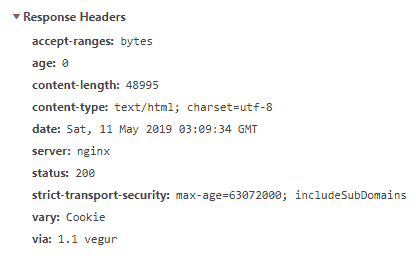
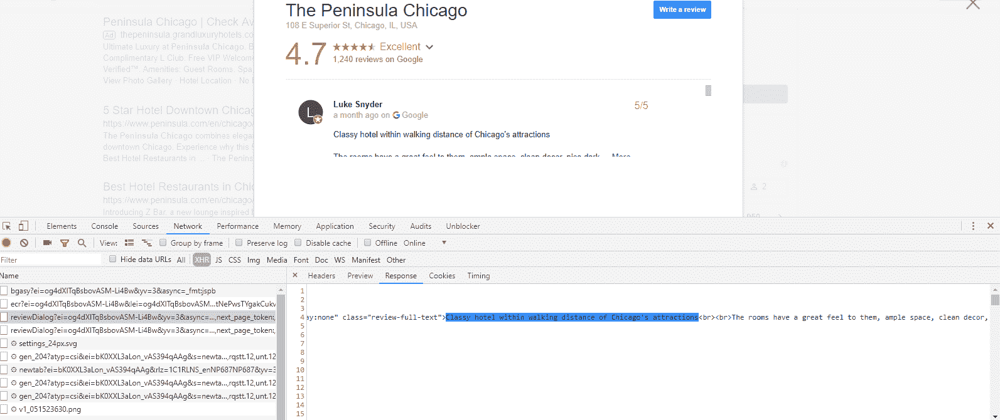
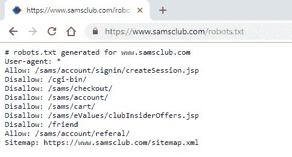

# 刮网基础

在本章中，我们将学习和探索与 web 抓取和基于 web 的技术相关的一些基本概念，假设您以前没有 web 抓取经验

首先，让我们先问几个问题：

*   为什么对数据的需求不断增长
*   我们将如何利用**万维网**（**WWW**的资源来管理和满足对数据的需求？

Web scraping 解决了这两个问题，因为它提供了各种工具和技术，可用于提取数据或协助信息检索。无论是基于 web 的结构化数据还是非结构化数据，我们都可以使用 web 抓取过程来提取数据，并将其用于研究、分析、个人收集、信息提取、知识发现等许多目的。

我们将学习部署用于从 web 查找数据的一般技术，并在前面的章节中使用 Python 编程语言深入探讨这些技术。

在本章中，我们将介绍以下主题：

*   网页抓取简介
*   了解 web 开发和技术
*   数据查找技术

# 网页抓取简介

刮取是提取、复制、筛选或收集数据的过程。从网络（通常称为网站或网页，或互联网相关资源）中抓取或提取数据通常称为*网络抓取*。

Web 抓取是一种从 Web 中提取数据的过程，适用于特定的要求。数据收集和分析，以及参与信息和决策，再加上与研究相关的活动，使得报废过程对所有类型的行业都很敏感。

互联网及其资源的普及导致信息领域每天都在发展，这也导致对原始数据的需求不断增长。数据是科学、技术和管理领域的基本要求。收集或组织的数据以不同程度的逻辑进行处理，以获取信息并获得进一步的见解。

Web scraping 提供了用于从网站收集数据的工具和技术，这些工具和技术适合于个人或业务相关需求，但有一些法律方面的考虑

在执行任务之前，有许多法律因素需要考虑。大多数网站都包含*隐私政策*、*关于我们的*和*条款和条件*等页面，在这些页面上可以找到法律条款、禁止的内容政策和一般信息。在规划网站上的任何爬行和抓取活动之前，遵循这些政策是开发人员的道德义务。

Scraping and crawling are both used quite interchangeably throughout the chapters in this book. Crawling, also known as spidering, is a process used to browse through the links on websites and is often used by search engines for indexing purposes, whereas scraping is mostly related to content extraction from websites. 

# 了解 web 开发和技术

网页不仅仅是一个文档容器。当今计算机和网络技术的快速发展已经将网络转变为动态和实时的信息源。

在我们这边，我们（用户）使用网络浏览器（如谷歌浏览器、Firefox Mozilla、Internet Explorer 和 Safari）从网络上访问信息。Web 浏览器向用户提供各种基于文档的功能，并包含对 Web 开发人员通常有用的应用程序级功能。

用户通过浏览器查看或浏览的网页不仅仅是单个文档。现有各种技术可用于开发网站或网页。网页是包含 HTML 标记块的文档。大多数情况下，它是由各种相互关联的技术（包括 JavaScript 和 CSS）中的各种子块作为依赖或独立组件链接而成的

了解网页的一般概念和网页开发技术，以及网页中的技术，将为抓取过程提供更大的灵活性和控制。很多时候，开发人员也可以采用反向工程技术。

逆向工程是一项涉及到分解和检查构建特定产品所需的概念的活动。有关反向工程的更多信息，请参阅 GlobalSpec 文章*反向工程**如何工作？*，可在[上购买 https://insights.globalspec.com/article/7367/how-does-reverse-engineering-work](https://insights.globalspec.com/article/7367/how-does-reverse-engineering-work) 。

在这里，我们将介绍和探索一些在数据提取过程中可以帮助和指导我们的技术。

# 超文本传输协议

**超文本传输协议**（**HTTP**）是在客户端和 web 服务器之间传输 HTML 文档等资源的应用协议。HTTP 是遵循客户机-服务器模型的无状态协议。客户端（web 浏览器）和 web 服务器使用 HTTP 请求和 HTTP 响应进行通信或交换信息：


HTTP (client-server communication)

使用 HTTP 请求或 HTTP 方法，客户端或浏览器向服务器提交请求。提交请求的方法有多种（也称为 HTTP 请求方法），如`GET`、`POST`、`PUT`：

*   `GET`：这是请求信息的常用方法。它被认为是一种安全的方法，因为资源状态不会改变。此外，它还用于提供查询字符串，如`http://www.test-domain.com/`，根据随请求发送的`id`和`display`参数向服务器请求信息。
*   `POST`：用于向服务器发出安全请求。请求的资源状态*可以*更改。发布或发送到请求 URL 的数据在 URL 中不可见，而是随请求正文一起传输。它用于以安全的方式向服务器提交信息，例如用于登录和用户注册。

使用以下屏幕截图中显示的浏览器开发人员工具，可以显示请求方法以及其他 HTTP 相关信息：


General HTTP headers (accessed using the browser developer tools)

在*实现 HTTP 方法*部分，我们将在[第 2 章](02.html)、
*Python 和 Web——使用 urllib 和请求*中进一步探讨 HTTP 方法。

**HTTP 头**在执行请求或响应时向客户端或服务器传递附加信息。标头通常是在客户端和服务器通信期间传输的信息的名称-值对，通常分为请求和响应标头：

*   请求头：这些头用于发出请求。语言和编码请求`-*`等信息，即引用者、cookies、浏览器相关信息等，在发出请求时提供给服务器。以下屏幕截图显示了向[发出请求时从浏览器开发人员工具获得的请求头 https://www.python.org](https://www.python.org) :


Request headers (accessed  using the browser developer tools)

*   响应头：这些头包含有关服务器响应的信息。有关响应（包括大小、类型和日期）和服务器状态的信息通常可以在响应头中找到。以下 s creenshot 显示了向[发出请求后从浏览器开发者工具获得的响应标题 https://www.python.org](https://www.python.org) ：



Response headers (a ccessed  using the browser developer tools)

在之前的截图中看到的信息是在向[发出请求时捕获的 https://www.python.org](https://www.python.org)

在向服务器发出请求时，还可以为 HTTP 请求提供所需的 HTTP 头。与请求 URL、请求方法、状态代码、请求头、查询字符串参数、cookies、`POST`参数和服务器详细信息相关的信息通常可以使用 HTTP 头信息进行探索。

通过**HTTP 响应**，服务器处理发送给它的请求，有时处理指定的 HTTP 头。当接收和处理请求时，它将其响应返回到浏览器。

响应包含状态代码，其含义可以使用开发人员工具显示，如前面的屏幕截图所示。以下列表包含一些状态代码以及一些简要信息：

*   200（确定，请求成功）
*   404（找不到；找不到请求的资源）
*   500（内部服务器错误）
*   204（没有要发送的内容）
*   401（向服务器发出未经授权的请求）

For more information on HTTP, HTTP responses, and status codes, please consult the official documentation at  [https://www.w3.org/Protocols/](https://www.w3.org/Protocols/) and [https://developer.mozilla.org/en-US/docs/Web/HTTP/Status](https://developer.mozilla.org/en-US/docs/Web/HTTP/Status).

**HTTP cookies**是服务器发送到浏览器的数据。Cookie 是网站在您的系统或计算机上生成和存储的数据。Cookie 中的数据有助于识别用户对网站的 HTTP 请求。Cookie 包含有关会话管理、用户首选项和用户行为的信息。

服务器根据 cookie 中存储的信息识别浏览器并与浏览器通信。cookie 中存储的数据有助于网站访问和传输某些保存的值，如会话 ID、过期日期和时间等，从而在 web 请求和响应之间提供快速交互：


Cookies set by a website ( a ccessed  using the browser developer tools) F or more information on cookies, please visit  AboutCookies at [http://www.allaboutcookies.org/](http://www.allaboutcookies.org/),  and  allaboutcookies at [http://www.allaboutcookies.org/](http://www.allaboutcookies.org/).

使用**HTTP 代理**，代理服务器充当客户端和主 web 服务器之间的中间服务器。web 浏览器向服务器发送实际通过代理传递的请求，代理将服务器的响应返回给客户端。

代理通常用于监控/过滤、性能改进、翻译和互联网相关资源的安全。代理也可以作为服务购买，也可以用于处理跨域资源。还有各种形式的代理实现，例如 web 代理（可用于绕过 IP 阻塞）、CGI 代理和 DNS 代理。

在 web 抓取过程中，使用`GET`请求、HTML 表单相关`POST`请求以及修改或调整标题传递的基于 Cookie 的参数对于管理代码（即脚本）和访问内容至关重要。

Details on HTTP, headers, cookies, and so on will be explored more in the upcoming *Data finding techniques for the web* section.  Please visit MDN web docs-HTTP ([https://developer.mozilla.org/en-US/docs/Web/HTTP](https://developer.mozilla.org/en-US/docs/Web/HTTP)) for more detailed information on HTTP.

# HTML

网站由包含文本、图像、样式表和脚本等内容的页面或文档组成。它们通常使用标记语言构建，如**超文本标记语言**（**HTML**）和**可扩展超文本标记语言**（**XHTML**）

HTML 通常被称为用于构建网页的标准标记语言。自 20 世纪 90 年代初以来，HTML 已独立使用，并与基于服务器的脚本语言（如 PHP、ASP 和 JSP）结合使用。

XHTML 是 HTML 的高级和扩展版本，HTML 是 web 文档的主要标记语言。XHTML 也比 HTML 更严格，从编码角度看，它是一个 XML 应用程序

HTML 定义并包含网页的内容。可以提取的数据以及任何显示数据源的信息都可以在预定义指令集或标记元素（称为**标记**内的 HTML 页面中找到。HTML 标记通常是带有某些预定义属性的命名占位符。

# HTML 元素和属性

HTML 元素（也称为文档节点）是 web 文档的构建块。HTML 元素由一个开始标记`<..>`和一个结束标记`</..>`构建，其中包含某些内容。HTML 元素还可以包含通常定义为`attribute-name = attribute-value`的属性，这些属性为元素提供附加信息：

```py
<p>normal paragraph tags</p>
<h1>heading tags there are also h2, h3, h4, h5, h6</h1>
<a href="https://www.google.com">Click here for Google.com</a>

<br />
```

上述代码可以分解如下：

*   `<p>`和`<h1>`HTML 元素包含一般文本信息（元素内容）。
*   `<a>`定义了一个包含实际链接的`href`属性，点击文本`Click here for Google.com`时会对其进行处理。该链接指的是[https://www.google.com/](https://www.google.com/) 。
*   ``图像标签还包含一些属性，例如`src`和`alt`，以及它们各自的值。`src`保存资源，即图像地址或图像 URL 作为值，而`alt`保存``的替代文本的值
*   `<br />`表示 HTML 中的换行符，没有属性或文本内容。它用于在文档布局中插入新行。

HTML 元素也可以嵌套在具有父子层次结构的树状结构中：

```py
<div>
   <p id="mainContent" class="content"> 
        <i> Paragraph contents </i>
        
        ….
    </p>
    <p class="content" id="subContent">
        <i style="color:red"> Sub paragraph content </i>
        <h1 itemprop="subheading">Sub heading Content! </h1>
        ….
    </p>
</div>
```

如前面的代码所示，在 HTML`<div>`块中找到了两个`<p>`子元素。这两个子元素都带有某些属性和各种子元素作为其内容。通常，HTML 文档是使用上述结构构建的。

# 全局属性

HTML 元素可以包含一些附加信息，例如键/值对。这些属性也称为 HTML 元素属性。属性保存值并提供标识，或者包含在抓取活动期间在许多方面都有帮助的附加信息，例如标识准确的 web 元素并从中提取值或文本，遍历元素等等。

有一些属性是 HTML 元素所共有的，或者可以应用于所有 HTML 元素，如下所示。这些属性被标识为全局属性（[https://developer.mozilla.org/en-US/docs/Web/HTML/Global_attributes](https://developer.mozilla.org/en-US/docs/Web/HTML/Global_attributes) ：

*   `id`
*   `class`
*   `style`
*   `lang`

HTML 元素属性，如`id`和`class`主要用于标识或格式化单个元素或元素组。这些属性也可以由 CSS 和其他脚本语言管理

`id`属性值对于应用它们的元素来说应该是唯一的。`class`属性值主要与 CSS 一起使用，提供相等的状态格式选项，可以与多个元素一起使用。

当与 CSS、遍历和解析技术一起使用时，通过将`#`和`.`分别放在属性名称前面来识别`id`和`class`等属性。

HTML element attributes can also be overwritten or implemented dynamically using scripting languages.

如以下示例所示，`itemprop`属性用于向元素添加属性，而`data-*`用于存储元素本身固有的数据：

```py
<div itemscope itemtype ="http://schema.org/Place">
    <h1 itemprop="univeristy">University of Helsinki</h1>
     <span>Subject:
         <span itemprop="subject1">Artificial Intelligence</span>   
    </span>
     <span itemprop="subject2">Data Science</span>
</div>


</img>
```

HTML 标记和属性是提取数据的主要来源。

Please visit [https://www.w3.org/html/](https://www.w3.org/html/) and [https://www.w3schools.com/html/](https://www.w3schools.com/html/) for more information on HTML.

在前面的章节中，我们将使用不同的工具探讨这些属性。我们还将执行各种逻辑操作，并使用它们提取内容。

# XML

**可扩展标记语言**（**XML**）是一种用于在互联网上分发数据的标记语言，具有一套用于编码可读且易于在机器和文档之间交换的文档的规则

XML 可以跨各种格式和系统使用文本数据。XML 设计用于携带便携式数据或存储在标记中的数据，这些标记不是用 HTML 标记预定义的。在 XML 文档中，标记由文档开发人员或自动化程序创建，以描述它们所承载的内容

下面的代码显示了一些示例 XML 内容。`<employees>`父节点有三个`<employee>`子节点，依次包含其他子节点`<firstName>`、`<lastName>`和`<gender>`：

```py
<employees>
    <employee>
        <firstName>Rahul</firstName>
        <lastName>Reddy</lastName>
        <gender>Male</gender>
    </employee>
    <employee>
        <firstName>Aasira</firstName>
        <lastName>Chapagain</lastName>
        <gender>Female</gender> 
    </employee>
    <employee>
        <firstName>Peter</firstName>
        <lastName>Lara</lastName>
        <gender>Male</gender>        
    </employee>
</employees>
```

XML 是一种开放标准，使用 Unicode 字符集。XML 用于跨各种平台共享数据，并已被各种 web 应用程序采用。许多网站使用 XML 数据，使用脚本语言实现其内容，并以 HTML 或其他文档格式呈现给最终用户查看。

还可以执行 XML 文档的提取任务，以获得所需格式的内容，或者根据特定的数据需求过滤需求。此外，幕后数据也可能仅从某些网站获得。

Please visit   [https://www.w3.org/XML/](https://www.w3.org/XML/) and [https://www.w3schools.com/xml/](https://www.w3schools.com/xml/)  for more information on XML. 

# JavaScript

JavaScript 是一种编程语言，用于编程在浏览器中运行的 HTML 和 web 应用程序。JavaScript 主要用于添加动态功能和在网页内提供基于用户的交互。JavaScript、HTML 和 CSS 是最常用的 web 技术之一，现在它们也用于无头浏览器。JavaScript 引擎的客户端可用性也加强了它在应用程序测试和调试中的地位。

JavaScript 代码可以使用`<script>`添加到 HTML 中，也可以作为文件嵌入。`<script>`包含 JavaScript 变量、运算符、函数、数组、循环、条件和事件的编程逻辑，针对 HTML**文档对象模型**（**DOM**）：

```py
<!DOCTYPE html>
<html>
<head>
    <script>
        function placeTitle() {
            document.getElementById("innerDiv").innerHTML = "Welcome to WebScraping";
        }
    </script>
</head>
<body>
    <div>Press the button: <p id="innerDiv"></p></div>
    <br />
    <button id="btnTitle" name="btnTitle" type="submit" onclick="placeTitle()">
        Load Page Title!
    </button>
</body>
</html>
```

The HTML DOM is a standard for how to get, change, add, or delete HTML elements. JavaScript HTML DOM, W3Schools can be referred to the URL [https://www.w3schools.com/js/js_htmldom.asp](https://www.w3schools.com/js/js_htmldom.asp)[.](https://www.w3schools.com/js/js_htmldom.asp)[ ](https://www.w3schools.com/js/js_htmldom.asp)

对 HTML 内容、元素、属性值、CSS 和 HTML 事件的动态操作，以及可访问的内部函数和编程特性，使得 JavaScript 在 web 开发中非常流行。有许多与 JavaScript 相关的基于 web 的技术，包括 JSON、jQuery、AngularJS 和 AJAX 等。

jQuery 是一个 JavaScript 库，它解决了浏览器之间的不兼容性问题，提供了 API 特性来处理 HTMLDOM、事件和动画。

jQuery 因提供了 web 的交互性和 JavaScript 的编码方式而在全球范围内广受好评。与 JavaScript 框架相比，jQuery 是轻量级的，它也很容易实现，具有简短易读的编码方法。

For more information on jQuery, please visit [https://www.w3schools.com/jquery/](https://www.w3schools.com/jquery/) and [http://jquery.com/](http://jquery.com/).

**异步 JavaScript 和 XML**（**AJAX**）是一种 web 开发技术，在客户端使用一组 web 技术创建异步 web 应用程序。JavaScript**XMLHttpRequest**（**XHR**对象）用于在网页上执行 AJAX 并加载页面内容，而无需刷新或重新加载页面。请参观学校（[https://www.w3schools.com/js/js_ajax_intro.asp](https://www.w3schools.com/js/js_ajax_intro.asp) 了解有关 AJAX 的更多信息。

从粗略的角度来看，JavaScript 功能的基本概述对于理解如何构建或操作页面以及识别所使用的动态组件非常有价值。

Please visit [https://developer.mozilla.org/en-US/docs/Web/JavaScript](https://developer.mozilla.org/en-US/docs/Web/JavaScript)  and  [https://www.javascript.com/](https://www.javascript.com/) for more information on JavaScript.

# JSON

**JavaScript 对象表示法**（**JSON**）是一种用于存储数据并将数据从服务器传输到网页的格式。它与语言无关，由于其大小和可读性，在基于 web 的数据交换操作中很受欢迎。

JSON 数据通常是作为 JavaScript 对象计算的名称/值对，并遵循 JavaScript 操作。JSON 和 XML 经常被比较，因为它们都在各种 web 资源之间传输和交换数据。JSON 的结构简单、可读、自描述性、可理解且易于处理，因此其排名也高于 XML。对于使用 JavaScript、AJAX 或 RESTful 服务的 web 应用程序，JSON 比 XML 更受欢迎，因为它的操作既快又简单

JSON 和 JavaScript 对象是可互换的。JSON 不是一种标记语言，它不包含任何标记或属性。相反，它是一种纯文本格式，可以通过服务器发送/访问，也可以由任何编程语言管理。JSON 对象也可以表示为数组、字典和列表，如以下代码所示：

```py
{"mymembers":[
 { "firstName":"Aasira", "lastName":"Chapagain","cityName":"Kathmandu"},
 { "firstName":"Rakshya", "lastName":"Dhungel","cityName":"New Delhi"},
 { "firstName":"Shiba", "lastName":"Paudel","cityName":"Biratnagar"},
 { "firstName":"Rahul", "lastName":"Reddy","cityName":"New Delhi"},
 { "firstName":"Peter", "lastName":"Lara","cityName":"Trinidad"}
]}
```

**JSON 行**：这是一种类似 JSON 的格式，其中记录的每一行都是有效的 JSON 值。它也称为换行符分隔的 JSON，即由换行符（`\n`字符）分隔的单个 JSON 记录。JSON 行格式在处理大量数据时非常有用

与 XML 相比，JSON 或 JSON 行格式的数据源更受欢迎，因为数据模式和代码可读性很容易，也可以用最少的编程工作量来管理：

```py
 {"firstName":"Aasira", "lastName":"Chapagain","cityName":"Kathmandu"}
 {"firstName":"Rakshya", "lastName":"Dhungel","cityName":"New Delhi"}
 {"firstName":"Shiba", "lastName":"Paudel","cityName":"Biratnagar"}
 {"firstName":"Rahul", "lastName":"Reddy","cityName":"New Delhi"}
 {"firstName":"Peter", "lastName":"Lara","cityName":"Trinidad"}
```

从数据提取的角度来看，由于 JSON 格式的轻量级和简单结构，web 页面使用 JSON 内容及其脚本技术来添加动态特性

Please visit [http://www.json.org/](http://www.json.org/), [http://jsonlines.org/](http://jsonlines.org/), and [https://www.w3schools.com/js/js_json_intro.asp](https://www.w3schools.com/js/js_json_intro.asp) for more information regarding JSON and JSON Lines.

# CSS

到目前为止，我们介绍的基于 web 的技术涉及内容、内容绑定、内容开发和处理。**层叠样式表**（**CSS**）描述 HTML 元素的显示属性和网页外观。CSS 用于设计样式并提供 HTML 元素所需的外观和表示。

开发人员/设计师可以使用 CSS 控制 web 文档的布局和表示。CSS 可以应用于页面中的不同元素，也可以通过单独的文档嵌入。可使用`<style>`标签描述样式细节。

`<style>`标记可以包含针对块中重复和各种元素的详细信息。如以下代码所示，存在多个`<a>`元素，并且具有`class`和`id`全局属性：

```py
<html>
<head>
      <style>
        a{color:blue;}
        h1{color:black; text-decoration:underline;}
        #idOne{color:red;}
        .classOne{color:orange;}
      </style>
</head>
<body>
      <h1> Welcome to Web Scraping </h1>
      Links:
      <a href="https://www.google.com"> Google </a> 
      <a class='classOne' href="https://www.yahoo.com"> Yahoo </a> 
      <a id='idOne' href="https://www.wikipedia.org"> Wikipedia </a>
</body>
</html>
```

与 CSS 属性一起提供的属性或已在前面代码块中的`<style>`标记内设置样式的属性将产生如下输出：


HTML output (with the elements styled using CSS)

CSS 属性也可以与每个特定元素一起以串联结构显示。内嵌 CSS 属性覆盖外部 CSS 样式。CSS`color`属性已被内联应用于元素。这将覆盖`<style>`中定义的`color`值：

```py
  <h1 style ='color:orange;'> Welcome to Web Scraping </h1>
  Links:
  <a href="https://www.google.com" style ='color:red;'> Google </a> 
  <a class='classOne' href="https://www.yahoo.com"> Yahoo </a> 
  <a id='idOne' href="https://www.wikipedia.org" style ='color:blue;'> Wikipedia </a>
```

CSS 也可以使用外部样式表文件嵌入到 HTML 中：

```py
<link href="http://..../filename.css" rel="stylesheet" type="text/css">
```

虽然 CSS 用于 HTML 元素的外观，但 CSS 选择器（用于选择元素的模式）通常在抓取过程中起主要作用。我们将在前面的章节中详细探讨 CSS 选择器。

Please visit [https://www.w3.org/Style/CSS/](https://www.w3.org/Style/CSS/) and [https://www.](https://www.w3schools.com/css/)[w3schools](https://www.w3schools.com/css/)[.com/css/](https://www.w3schools.com/css/) for more detailed information on CSS.

# 安格拉斯

到目前为止，我们在本章中介绍了一些选定的 web 相关技术。让我们通过介绍 AngularJS 来概述 web 框架。Web 框架处理大量与 Web 相关的工具，用于开发与 Web 相关的资源，同时采用最新的方法。

AngularJS（也称为*Angular.js*或*Angular*）主要用于构建客户端 web 应用程序。这是一个基于 JavaScript 的框架。AngularJS 使用`<script>`标记添加到 HTML 中，该标记将 HTML 属性扩展为指令，并将数据绑定为表达式。AngularJS 表达式用于将数据绑定到从静态或动态 JSON 资源检索的 HTML 元素。AngularJS 指令的前缀为`ng-`。

AngularJS 与 HTML 一起用于动态内容开发。它提供性能改进、测试环境、元素操作和数据绑定功能，并通过跨文档、数据、平台和其他工具提供更加动态和灵活的环境，帮助在**模型视图控制器**（**MVC**框架中构建 web 应用程序。

我们可以将外部 JavaScript 文件链接到我们的 HTML 文档，如下所示：

```py
<!doctype html>
<html ng-app>
    <head>
        <script 
 src="https://ajax.googleapis.com/ajax/libs/angularjs/1.7.5/angular.min.js">
 </script>
    </head>
    <body>
        <div>
            <label> Place: </label>
            <input type="text" ng-model="place" placeholder="Visited place!">
            <label> Cost :</label>
            <input type="text" ng-model="price" placeholder="Ticket Price!">
            <br>
            <b>Wow! {{place}} for only {{price}}</b>
        </div>
    </body>
</html>
```

此外，我们还可以在页面上同时包含脚本和元素块，如下所示：

```py
<script>
     var app = angular.module('myContact', []);
     app.controller('myDiv', function($scope) {
         $scope.firstName = "Aasira";
         $scope.lastName = "Chapagain";
         $scope.college= "London Business School";
         $scope.subject= "    Masters in Analytics and Management    ";
     });
</script>
<div ng-app="myContact" ng-controller="myDiv">
     First Name: <input type="text" ng-model="firstName"><br>
     Last Name: <input type="text" ng-model="lastName"><br>
     College Name: <input type="text" ng-model="college"><br>
     Subjects: <input type="text" ng-model="subject"><br>
     <br>
     Full Name: {{firstName + " " + lastName}}
     <br>
     Enrolled on {{college + " with " + subject}}
</div>
```

我们在这里提供的 AngularJS 及其工作方法的总体概述允许在跟踪和遍历数据方面具有更大的灵活性。

Please visit AngularJS ([https://angularjs.org/](https://angularjs.org/) and [https://angular.io/](https://angular.io/)) for more detail information on AngularJS.

前面讨论的技术是 web 的几个核心组件；它们相互链接，相互依赖，以生成最终用户交互的网站或 web 文档。在前面的章节中，我们将识别脚本并进一步分析其中包含的代码。

在下一节中，我们将探索 web 内容并查找可以在 web 页面中找到的数据，我们将在前面的章节中使用 Python 编程语言提取这些数据

# web 数据查找技术

有多种技术可用于开发网站。使用 web 浏览器呈现给最终用户的内容也可以以各种其他格式和模式存在。

如前所述，动态生成或操作网页内容也是可能的。页面内容还可以包括使用 HTML 和相关技术呈现的静态内容，或者动态呈现和创建的静态内容。还可以使用第三方来源检索内容，并将其呈现给最终用户。

# HTML 页面源代码

Web 浏览器用于基于客户端-服务器的 GUI 交互，探索 Web 内容。浏览器地址栏随 web 地址或 URL 一起提供，请求的 URL 被传送到服务器（主机）并接收响应，即由浏览器加载。可以进一步探索获得的响应或页面源，并以原始格式搜索所需内容

用户可以自由选择他们的 web 浏览器。我们将在本书的大部分内容中使用谷歌 Chrome，安装在 Windows**操作系统**（**操作系统**）上。

The HTML source for pages will be  frequently  opened and investigated for required content and resources during scraping process. Right click  the web page. A menu will then appear where you can find the **View page source** option. Alternatively, press *Ctrl *+ *U* .

# 案例 1

让我们通过以下步骤来查看 web 抓取的一个示例：

1.  转到[https://www.google.com 在您选择的浏览器中打开](https://www.google.com)
2.  在搜索框中输入`Web Scraping`
3.  按*输入*或点击页面上的谷歌搜索按钮
4.  您应该会看到类似于以下屏幕截图的内容：


Search results for web scraping from Google

谷歌已经向我们提供了我们要求的搜索信息。这些信息以段落形式显示，并提供了许多链接。显示的信息是交互式的、丰富多彩的，并以维护结构显示，搜索内容采用布局。

这是我们正在查看的前端内容。这些内容是根据我们与谷歌的互动动态提供给我们的。现在，让我们查看已提供给我们的原始内容。

5.  右键单击网页。然后会出现一个菜单，您可以在其中找到“查看页面源”选项。或者，按*Ctrl*+*U*。然后，将打开一个新选项卡，其中包含页面的 HTML 源代码。在浏览器中的 URL 开头检查`view-source`：


HTML page source: search results for web scraping from Google

我们现在正在访问上一个屏幕截图中显示的页面的 HTML 源代码。HTML 标记和 JavaScript 代码很容易看到，但没有以正确的格式显示。这些是浏览器呈现给我们的核心内容

Search for some text, displayed on the normal page view, in the page source. Identify how and where the text, links, and images are found in the page source. You will be able to find the text in the page source within HTML tags (but not always, as we shall see!)

Web 开发可以使用各种技术和工具来完成，正如我们在前面章节中讨论的那样。浏览器显示的网页内容在探索其源代码时可能并不总是在 HTML 标记中可用。内容也可以存在于脚本内部，甚至在第三方链接上。这就是为什么 web 抓取常常具有挑战性，因此需要用于 web 开发的最新工具和技术。

# 案例 2

让我们探索另一个案例，使用我们在*案例 1*部分中应用的浏览过程：

1.  在谷歌上搜索`Top Hotels in USA for 2018`并选择任何您喜欢的酒店名称。
2.  直接在 Google 中搜索酒店名称（也可以忽略前面的步骤）。例如，尝试`The Peninsula Chicago`。
3.  谷歌将加载搜索到的酒店详细信息以及地图、预订和评论部分。此操作的结果将类似于以下屏幕截图：


Google search result for The Peninsula Chicago

4.  在左边，你可以找到谷歌评论的链接。单击链接后，将弹出一个新页面，如以下屏幕截图所示：


Google reviews page from the search page

5.  右键点击弹出的查看页面，选择查看页面来源，或按*Ctrl*+*U*查看页面来源

Try to find the reviews and response texts by users from the page source. 

# 开发工具

开发工具（或*DevTools*）被发现嵌入到当今市场上的大多数浏览器中。开发人员和最终用户都可以识别和定位资源，并搜索在客户机-服务器通信过程中或在参与 HTTP 请求和响应时使用的 web 内容。

DevTools 允许用户检查、创建、编辑和调试 HTML、CSS 和 JavaScript。它们还允许我们处理性能问题。它们有助于提取浏览器动态或安全显示的数据

DevTools 将用于大多数数据提取案例，以及与前面提到的*页面源*部分中的*案例 2*类似的案例。有关开发工具的更多信息，请浏览以下链接：

*   镀铬工具（[https://developers.google.com/web/tools/chrome-devtools/](https://developers.google.com/web/tools/chrome-devtools/) ）
*   Firefox 开发工具[https://developer.mozilla.org/son/docs/Tools/](https://developer.mozilla.org/son/docs/Tools)

在 Google Chrome 中，我们可以按照以下任何说明加载 DevTools：

*   只需按*Ctrl*+*Shift*+*I*
*   另一个选项是右键单击页面并按 Inspect 选项
*   或者，如果通过 Chrome 菜单访问开发者工具，请单击更多工具|开发者工具：



Loading the Chrome DevTools for a reviews page

前面的屏幕截图显示了开发人员工具面板：元素、控制台、网络、源等等。在我们的例子中，让我们从评论页面中查找一些文本。以下步骤将使我们能够找到它：

1.  打开开发人员工具内的网络面板。
2.  选择 XHR 过滤器选项。（多个资源，如 HTML 文件、图像和 JSON 数据将在“名称”面板下列出。）
3.  我们需要遍历“名称”窗格下的资源，查找所选的文本片段。（响应选项卡显示所选资源的内容。）
4.  找到一个以`reviewDialog?`开头的资源，其中包含搜索到的文本。

The steps outlined here for searching review text form one of the most commonly used techniques for locating exact content. These steps are followed normally when the content is obtained dynamically and is not found inside the page source.

开发者工具中有各种面板，与提供给 web 资源或用于分析的特定功能相关，包括源、内存、性能和网络。我们将探索 Chrome DevTools 中的一些面板，如下所示：

The specific names of p anels found in browser-based DevTools might not be the same across all browsers.

*   元素：显示所查看页面的 HTML 内容。这用于查看和编辑 DOM 和 CSS，也用于查找 CSS 选择器和 XPath。

HTML elements displayed or located from the  Elements panel may not be available in the page source.

*   控制台：用于运行 JavaScript 代码并与之交互，以及查看日志消息：


The Console panel inside Chrome DevTools

*   源：用于导航页面、查看可用脚本和文档源。基于脚本的工具可用于脚本执行（即，恢复、暂停）、单步执行函数调用、激活和停用断点等任务，如果遇到以下情况，还可以处理异常（如暂停异常）：


The Sources panel from Chrome DevTools

*   网络：为我们提供与 HTTP 请求和响应相关的资源，并显示加载页面时使用的网络资源。网络功能选项中的资源，如将数据记录到网络日志、捕获屏幕截图、过滤 web 资源（JavaScript、图像、文档和 CSS）、搜索 web 资源和分组 web 资源，也可用于调试任务：


The Chrome DevTools Network panel

还可以按类型筛选请求：

*   **全部**：列出所有与网络相关的请求，包括文档请求、图像请求、字体和 CSS 请求。资源按加载顺序放置。
*   **XHR**：列表`XmlHttpRequest`对象动态加载 AJAX 内容
*   **JS**：列出请求的脚本文件
*   **CSS**：列出请求的样式文件
*   **Img**：列出请求的图像文件
*   **文档**：列出所请求的 HTML 或 web 文档
*   **其他**：任何未列出的请求相关资源类型

对于前面列出的筛选选项，在“名称”面板中有所选资源的选项卡（标题、预览、响应、计时、cookie）：

*   Headers：加载特定请求的 HTTP 头数据。显示的信息包括请求 URL、请求方法、状态代码、请求头、查询字符串参数和`POST`参数。
*   预览：加载响应的格式化预览。
*   响应：加载对特定请求的响应。
*   计时：查看时间细分信息。
*   Cookies：加载“名称”面板中所选资源的 cookie 信息。

从抓取的角度来看，DevTools 网络面板对于查找和分析 web 资源非常有用。这些信息对于检索数据和选择处理这些资源的方法非常有用

For more information on the  Network  panel, please visit [https://developers.google.com/web/tools/chrome-devtools/network-performance/reference/](https://developers.google.com/web/tools/chrome-devtools/network-performance/reference) and [https://developer.mozilla.org/en-US/docs/Tools/Network_Monitor/](https://developer.mozilla.org/en-US/docs/Tools/Network_Monitor). There are various elements provided on the Network panel which are explained below:

*   性能：可以记录屏幕截图页面和内存时间线。获取的可视信息用于优化网站速度、缩短加载时间和分析运行时性能。在早期的 Chrome 版本中，性能面板提供的信息通常存在于名为 Timeline 的面板中：


The Performance panel in  Chrome DevTools

*   内存：在早期的 Chrome 版本中，该面板也称为面板配置文件。从该面板获得的信息用于修复内存问题和跟踪内存泄漏。开发人员还使用性能和内存面板来分析网站的总体性能
*   应用程序：最终用户可以检查和管理所有加载资源的存储，包括 cookie、会话、应用程序缓存、图像和数据库。

在浏览了 HTML 页面源代码和开发工具之后，我们现在大致了解了在哪里可以浏览或搜索数据。总体而言，刮取涉及从网页中提取数据，我们需要识别或定位包含要提取数据的资源。在继续进行数据浏览和内容识别之前，计划和识别包含数据的页面 URL 或链接将是有益的。

用户可以选择任何 URL 进行抓取。指向单个页面的页面链接或 URL 也可能包含分页链接或将用户重定向到其他资源的链接。跨多个页面分发的内容需要通过标识页面 URL 来单独爬网。存在网站提供的网站地图和`robots.txt`文件，其中包含爬行相关活动的链接和指令。

# 站点地图

`sitemap.xml`文件是一个 XML 文件，保存与页面 URL 相关的信息。维护站点地图是向搜索引擎告知网站包含的 URL 的一种简单方法。基于搜索引擎的脚本对网站地图中的链接进行爬网，并将找到的链接用于索引和各种目的，如**搜索引擎优化**（**SEO**）

站点地图中的 URL 通常包含其他信息，如创建日期、修改日期、新 URL、删除的 URL 等。它们通常被包装在 XML 标记中。在本例中，我们有`<sitemap>`和`<loc>`，如下图所示：


Sitemap content from https://www.samsclub.com/

通过在 URL 中添加`sitemap.xml`来访问站点地图，例如[https://www.samsclub.com/sitemap.xml](https://www.samsclub.com/sitemap.xml) 。

对于所有网站，`sitemap.xml`没有义务存在。站点地图可能包含页面、产品、类别和内部站点地图文件的单独 URL，这些文件可以轻松地进行处理，以便进行刮取，而不是浏览网页中的链接并逐个从每个网站收集所有链接

# robots.txt 文件

`robots.txt`也称为机器人排除协议，是一种基于网络的标准，用于网站与自动脚本交换信息。通常，`robots.txt`向网络机器人（也称为**网络漫游者**、**爬虫**发送有关其网站上 URL、页面和目录的指令，或**爬行器**），使用诸如允许、禁止、站点地图和爬网延迟等指令来指导其行为：



The robots.txt file from https://www.samsclub.com/

对于任何提供的网址或 URL，`robots.txt`文件可以通过在 URL 中添加`robots.txt`来访问，例如`https://www.samsclub.com/robots.txt`或`https://www.test-domainname.com/robots.txt`。

如前面的屏幕截图所示（*中的 robots.txt 文件 https://www.samsclub.com/* ），在[中列出了允许、禁止和站点地图指令 https://www.samsclub.com/robots.txt](https://www.samsclub.com/robots.txt) ：

*   允许允许网络机器人访问其承载的链接
*   Disallow 表示对给定资源的访问限制
*   用户代理：*显示所有代理都将遵循列出的指令

对于网络爬虫和垃圾邮件发送者造成的访问违规，网站管理员可以采取以下步骤：

*   加强安全机制，限制未经授权访问网站
*   在跟踪的 IP 地址上施加块
*   采取必要的法律行动

网络爬虫应该遵守文件中提到的指令，但是为了正常的数据提取目的，在爬虫脚本妨碍网站流量之前，或者如果他们从网络访问个人数据，则没有任何限制。同样，每个网站上都应该有一个`robots.txt`文件不是强制性的。

For more information on directives and `robots.txt`, please visit [http://www.robotstxt.org/](http://www.robotstxt.org/) .

# 总结

在本章中，我们探讨了一些与万维网相关的核心技术和工具，这些技术和工具是网络抓取所必需的。

本章的主要重点是通过介绍 web 开发工具来识别和探索内容，以及寻找目标数据的页面 URL。

在下一章中，我们将使用 Python 编程语言与 web 交互，并探索与 web 相关的主要 Python 库，我们将使用这些库来检查 web 内容。

# 进一步阅读

*   AngularJS:[https://www.angularjs.org](https://www.angularjs.org) 、[https://www.angular.io](https://www.angular.io)
*   AJAX:[http://api.jquery.com/jquery.ajax/](http://api.jquery.com/jquery.ajax/) 、[https://www.w3schools.com/js/js_ajax_intro.asp](https://www.w3schools.com/js/js_ajax_intro.asp)
*   浏览器开发工具：[https://developers.google.com/web/tools/chrome-devtools/](https://developers.google.com/web/tools/chrome-devtools/) 、[https://developer.mozilla.org/son/docs/Tools](https://developer.mozilla.org/son/docs/Tools)
*   CSS:[https://www.w3schools.com/css/](https://www.w3schools.com/css/) 、[https://www.w3.org/Style/CSS/](https://www.w3.org/Style/CSS/)
*   饼干：[https://www.aboutcookies.org/](https://www.aboutcookies.org/) 、[www.allaboutcookies.org](http://www.allaboutcookies.org/)
*   HTTP:[https://www.w3.org/Protocols/](https://www.w3.org/Protocols/) 、[https://developer.mozilla.org/en-US/docs/Web/HTTP](https://developer.mozilla.org/en-US/docs/Web/HTTP)
*   HTTP 方法：[https://restfulapi.net/http-methods/](https://restfulapi.net/http-methods/)
*   HTTP 头的快速引用：[http://jkorpela.fi/http.html](http://jkorpela.fi/http.html)
*   开发人员的 Web 技术：[https://developer.mozilla.org/en-US/docs/Web](https://developer.mozilla.org/en-US/docs/Web)
*   标记系统与学术文本处理的未来：[http://xml.coverpages.org/coombs.html](http://xml.coverpages.org/coombs.html)
*   JSON 行：[http://jsonlines.org/](http://jsonlines.org/)
*   jQuery:[https://jquery.com/](https://jquery.com/) 、[https://www.w3schools.com/jquery/](https://www.w3schools.com/jquery/)
*   JavaScript:[https://developer.mozilla.org/en-US/docs/Web/JavaScript](https://developer.mozilla.org/en-US/docs/Web/JavaScript) 、[https://www.javascript.com/](https://www.javascript.com/)
*   机器人排除协议：[http://www.robotstxt.org/](http://www.robotstxt.org/)
*   逆向工程：[https://insights.globalspec.com/article/7367/how-does-reverse-engineering-work](https://insights.globalspec.com/article/7367/how-does-reverse-engineering-work)
*   网站地图：[https://www.sitemaps.org/](https://www.sitemaps.org/)
*   XML:[https://www.w3schools.com/xml/](https://www.w3schools.com/xml/) 、[https://www.w3.org/XML/](https://www.w3.org/XML/)