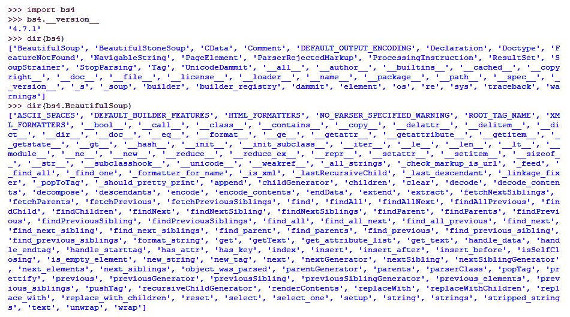
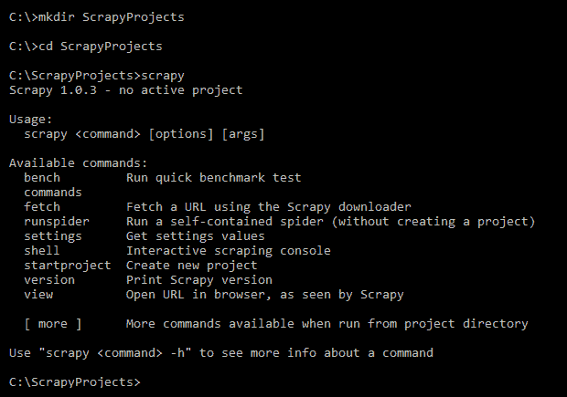
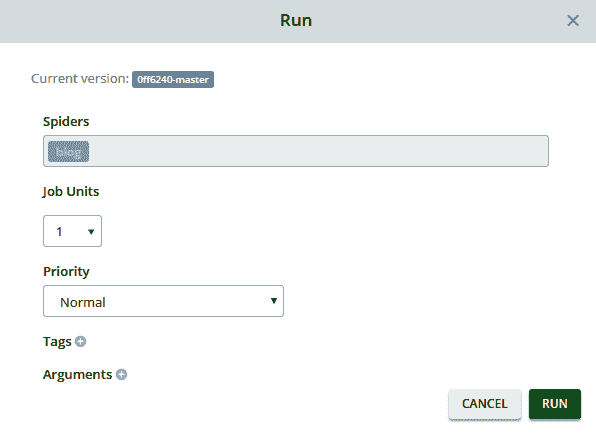

# 五、将 Scrapy 和 BeautySoup 用于爬取

到目前为止，我们已经了解了 web 开发技术、数据查找技术以及访问各种 Python 库以从 web 上获取数据。

在本章中，我们将学习和探索两个流行于文档解析和抓取活动的 Python 库：Scrapy 和 BeautySoup。

BeautifulSoup 处理文档解析。解析文档是为了遍历元素并提取其内容。Scrapy 是一个用 Python 编写的 web 爬行框架。它为 web 抓取提供了一个面向项目的范围。Scrapy 为电子邮件、选择器、项目等提供了大量内置资源，可以从简单的内容提取到基于 API 的内容提取

在本章中，我们将了解以下内容：

*   用靓汤爬取
*   使用 Scrapy 进行网页抓取
*   部署网络爬虫（学习如何使用[部署抓取代码）https://www.scrapinghub.com](https://www.scrapinghub.com)

# 技术要求

需要 web 浏览器（Google Chrome 或 Mozilla Firefox），我们将使用以下列出的应用程序和 Python 库：

*   最新的 Python 3.7*或 Python 3.0*（已安装）
*   所需的 Python 库如下所示：
    *   `lxml`
    *   `requests`、``urllib``
    *   `bs4`或`beautifulsoup4`
    *   `scrapy`

有关设置或安装，请参阅[第 2 章](02.html)、*Python 和 Web–使用 urllib 和请求*、*设置*部分。

代码文件可在 GitHub 上在线获取：[https://github.com/PacktPublishing/Hands-On-Web-Scraping-with-Python/tree/master/Chapter05](https://github.com/PacktPublishing/Hands-On-Web-Scraping-with-Python/tree/master/Chapter05) 。

# 用靓汤爬取

Web 抓取是从 Web 文档中提取数据的过程。对于数据收集或从 web 文档中提取数据，识别和遍历元素（HTML、XML）是基本要求。Web 文档是使用各种类型的元素构建的，这些元素可以单独存在，也可以嵌套在一起。

解析是使用任何给定 web 内容的内容分解、公开或标识组件的活动。此类活动增强了搜索和收集所需元素的内容等功能。通过查找所需的数据或内容来获取、解析和遍历 Web 文档是基本的抓取任务

在[第 3 章](03.html)*中，我们使用 LXML、XPath 和 CSS 选择器*为类似的任务探索了 LXML，并使用 XPath 和 CSS 选择器进行数据提取。lxml 还用于抓取和解析，因为它具有高效的内存特性和可扩展的库。

在下一小节中，我们将学习和探索 Python`bs4`库（用于 BeautifulSoup）的特性

# 靓汤介绍

BeautySoup 通常被标识为解析库，也被称为 HTML 解析器，用于解析 HTML 或 XML 格式的 web 文档。它生成一个类似于 lxml（ElementTree）的解析树，用于识别和遍历元素以提取数据和执行 web 抓取。

Beautiful Soup 提供了完整的解析相关功能，可使用`lxml`和`htmllib`使用。简单易用的方法集合，加上处理导航、搜索和解析相关活动的属性，使 BeautySoup 成为其他 Python 库中的最爱。

可以使用 BeautySoup 构造函数手动处理文档编码，但是除非构造函数指定，否则 BeautySoup 会自动处理编码相关的任务

与其他库和解析器相比，Beautiful Soup 的一个显著特点是，它还可以用于解析损坏的 HTML 或标记不完整或缺失的文件。有关 Beautiful Soup 的更多信息，请访问[https://www.crummy.com/software/BeautifulSoup](https://www.crummy.com/software/BeautifulSoup) *。*

现在，让我们探索并学习一些与使用 Beautiful Soup 进行数据提取过程相关的主要工具和方法。

# 探索BeautySoup

Python`bs4`库包含一个`BeautifulSoup`类，用于解析。有关 Beautiful Soup 和安装库的更多详细信息，请参阅[中有关安装 Beautiful Soup 的官方文档 https://www.crummy.com/software/BeautifulSoup/](https://www.crummy.com/software/BeautifulSoup/) 。成功安装库后，我们可以使用 Python IDE 获得如下屏幕截图所示的详细信息：



Successful installation of bs4 with details

此外，在前面的屏幕截图和编码支持中可以看到的简单（命名）和可解释方法的集合使它在开发人员中更受欢迎

让我们从`bs4`导入`BeautifulSoup`和`SoupStrainer`，如下代码所示：

```py
from bs4 import BeautifulSoup
from bs4 import SoupStrainer #,BeautifulSoup
```

我们将使用如下代码片段所示的 HTML 或`html_doc`作为示例来探索 Beautiful Soup 的一些基本功能。使用`requests`或`urllib`为任何选定 URL 获得的响应也可用于实际爬取案例中的内容：

```py
    html_doc="""<html><head><title>The Dormouse's story</title></head>
        <body>
        <p class="title"><b>The Dormouse's story</b></p>
        <p class="story">Once upon a time there were three little sisters; and their names were
        <a href="http://example.com/elsie" class="sister" id="link1">Elsie</a>,
        <a href="http://example.com/lacie" class="sister" id="link2">Lacie</a> and
        <a href="http://example.com/tillie" class="sister" id="link3">Tillie</a>;
        and they lived at the bottom of a well.</p>
        <p class="story">...</p>
        <h1>Secret agents</h1>
        <ul>
            <li data-id="10784">Jason Walters, 003: Found dead in "A View to a Kill".</li>
            <li data-id="97865">Alex Trevelyan, 006: Agent turned terrorist leader; James' nemesis in "Goldeneye".</li>
            <li data-id="45732">James Bond, 007: The main man; shaken but not stirred.</li>
        </ul>
        </body>
        </html>"""    
```

要继续解析和访问 BeautySoup 方法和属性，必须创建一个 BeautySoup 对象，通常称为 sSoup 对象。关于构造函数中提供的字符串或标记内容的类型，下面列出了几个创建漂亮的 Soup 对象的示例以及前面提到的参数：

*   `soup = Beautifulsoup(html_markup)`
*   `soup = Beautifulsoup(html_markup, 'lxml')`
*   `soup = Beautifulsoup( html _markup , 'lxml', parse_from=SoupStrainer("a"))`
*   `soup = Beautifulsoup(html_markup, 'html.parser')`
*   ``soup = Beautifulsoup(html_markup, 'html5lib')``
*   `soup = Beautifulsoup(xml_markup, 'xml')`
*   `soup = Beautifulsoup(some_markup, from_encoding='ISO-8859-8')`
*   `soup = Beautifulsoup(some_markup, exclude_encodings=['ISO-8859-7'])`

Beautiful Soup 构造函数起着重要作用，我们将在这里探讨一些重要参数：

*   `markup`：传递给构造函数的第一个参数接受要解析的字符串或对象。
*   `features`：用于`markup`的解析器名称或标记类型。解析器可以是`lxml`、`lxml-xml`、`html.parser`或`html5lib`。类似地，可以使用的标记类型有`html`、`html5`和`xml`。不同类型的受支持解析器可用于 Beautiful Soup。如果我们只想解析一些 HTML，只需将标记传递给 BeautySoup，它就会使用相应安装的解析器。有关解析器及其安装的更多信息，请访问[安装解析器 https://www.crummy.com/software/BeautifulSoup/bs4/doc/#installing-a-语法分析器](https://www.crummy.com/software/BeautifulSoup/bs4/doc/#installing-a-parser)
*   `parse_only`：接受一个`bs4.SoupStrainer`对象，即只使用文档中与`SoupStrainer`对象匹配的部分进行解析。考虑到代码的有效性和与内存相关的问题，当只对文档的一部分进行解析时，它非常有用。有关`SoupStrainer`的更多信息，请访问[中的仅解析文档的一部分 https://www.crummy.com/software/BeautifulSoup/bs4/doc/#parsing-仅限于](https://www.crummy.com/software/BeautifulSoup/bs4/doc/#parsing-only-part-of-a-document)文件的一部分。
*   `from_encoding`：表示正确编码的字符串用于解析标记。如果 BeautySoup 使用了错误的编码，则通常会提供此选项。
*   `exclude_encodings`：如果 Beautiful Soup 使用了错误的编码，则指示错误编码的字符串列表。

Response time is a considerable factor when using Beautiful Soup. As Beautiful Soup uses the parsers (`lxml`, `html.parser`, and `html5lib`), there is always a concern regarding the extra time consumption.

Using a parser is always recommended to obtain similar results across platforms and systems.  Also, for speeding up, it is recommended to use `lxml` as the parser with Beautiful Soup.

对于这种特殊情况，我们将使用`lxml`作为解析器创建`soupA`对象，以及`SoupStrainer`对象`tagsA`（仅解析`<a>`，即 HTML 的元素或锚定标记）。我们可以使用`SoupStrainer`获取部分内容进行解析，这在处理重内容时非常有用

`soupA`是一个靓汤对象，表示为`SoupStrainer`对象`tagsA`*找到的所有`<a>`元素，如下代码中使用；如输出所示，仅收集了`<a>`标记，或者解析的文档是使用`lxml`*解析的`SoupStrainer`对象**

 **```py
tagsA = SoupStrainer(    "a"    )
soupA = BeautifulSoup(html_doc,    'lxml'    ,    parse_only    =tagsA)

print    (    type    (soupA))
<class 'bs4.BeautifulSoup'>

    print    (soupA)
<a class="sister" href="http://example.com/elsie" id="link1">Elsie</a><a class="sister" href="http://example.com/lacie" id="link2">Lacie</a><a class="sister" href="http://example.com/tillie" id="link3">Tillie</a>
```

网站上提供的 HTML 内容可能并不总是以干净的字符串进行格式化。阅读以段落而不是逐行代码形式呈现的页面内容既困难又耗时。

Beautiful Soup`prettify()`函数返回一个 Unicode 字符串，以易于阅读的干净、格式化的结构表示该字符串，并在树结构中标识元素，如以下代码所示；`prettify()`函数也接受参数编码：

```py
    print    (soupA.prettify())

<a class="sister" href="http://example.com/elsie" id="link1">
 Elsie
</a>
<a class="sister" href="http://example.com/lacie" id="link2">
 Lacie
</a>
<a class="sister" href="http://example.com/tillie" id="link3">
 Tillie
</a>
```

解析树中基于文档的元素（如 HTML 标记）可以具有具有预定义值的各种属性。元素属性是重要的资源，因为它们在元素中一起提供标识和内容。在遍历树时，验证元素是否包含某些属性非常方便。

例如，如以下代码所示，HTML`<a>`元素包含`class`、`href`和`id`属性，每个属性都带有预定义的值，如以下代码片段所示：

```py
<a class="sister" href="http://example.com/lacie" id="link2">
```

Beautiful Soup 的`has_attr()`函数返回对所选元素的搜索属性名的布尔响应，如以下代码元素`a`所示：

*   返回`name`属性的`False`
*   返回`class`属性的`True`

我们可以使用`has_attr()`函数按名称确认属性键，如果它存在于解析文档中，如下所示：

```py
print(soupA.a.has_attr('class'))
True

print(soupA.a.has_attr('name'))
False
```

通过对 Beautiful Soup 的基本介绍和本节中探讨的一些方法，我们现在将继续在下一节中搜索、遍历和迭代解析树，查找元素及其内容

# 搜索、遍历和迭代

BeautySoup 提供了许多方法和属性来遍历和搜索解析树中的元素。这些方法通常以与其实现类似的方式命名，描述它们执行的任务。还有许多属性和方法可以链接在一起并用于获得类似的结果

`find()`f 函数返回与搜索条件或解析元素匹配的第一个子元素。它在抓取上下文以查找元素和提取细节时非常有用，但只适用于单个结果。还可以将其他参数传递给`find()`函数，以识别准确的元件，如下所示：

*   `attrs`：具有键值对的字典
*   `text`：带元素文本
*   `name`：HTML 标记名

让我们用代码中允许的不同参数来实现`find()`函数：

```py
    print        (soupA.find(        "a"        )) #        print    (soupA.find(    name    =    "a"    ))
    <a class="sister" href="http://example.com/elsie" id="link1">Elsie</a>

        print    (soupA.find(    "a"    ,    attrs    ={    'class'    :    'sister'    }))
<a class="sister" href="http://example.com/elsie" id="link1">Elsie</a>

    print    (soupA.find(    "a"    ,    attrs    ={    'class'    :    'sister'    },    text    =    "Lacie"    ))
<a class="sister" href="http://example.com/lacie" id="link2">Lacie</a>

    print    (soupA.find(    "a"    ,    attrs    ={    'id'    :    'link3'    }))
<a class="sister" href="http://example.com/tillie" id="link3">Tillie</a>

    print(soupA.find('a',id="link2"))    
    <a class="sister" href="http://example.com/lacie" id="link2">Lacie</a>    
```

下面是在上一示例中实现的代码的简短描述列表：

*   `find("a")   or   find(name="a")`：搜索 HTML`<a>`元素或标记名，前提是`a`返回在`soupA`中找到的`<a>`的第一个存在
*   `find( "a" , attrs ={ 'class' : 'sister' })`：搜索元素`<``a>`，属性键为类，值为姐妹
*   `find( "a" , attrs ={ 'class' : 'sister' }, text="Lacie")`：用`class`属性键和`sister`值搜索`<a>`元素，用`Lacie`值搜索文本
*   `find("a",attrs={'id':'link3'})`：使用`id`属性键和`link3`值搜索`<a>`元素
*   `find("a",id="link2")`：在`<a>`元素中搜索具有`link2`值的`id`属性 e

`find_all()`函数的工作方式与`find()`函数类似，额外的`attrs`和`text`作为参数，并返回所提供标准或`name`属性的匹配（多个）元素列表，如下所示：

```py
    #find all <a> can also be written as         #        print        (soupA.find_all(name=        "a"        ))
        print        (soupA.find_all(        "a"        )) 

    [<a class="sister" href="http://example.com/elsie" id="link1">Elsie</a>, <a class="sister" href="http://example.com/lacie" id="link2">Lacie</a>, <a class="sister" href="http://example.com/tillie" id="link3">Tillie</a>]

#find all <a>, but return only 2 of them
    print    (soupA.find_all(    "a"    ,    limit    =    2    )) #attrs, text

[<a class="sister" href="http://example.com/elsie" id="link1">Elsie</a>, <a class="sister" href="http://example.com/lacie" id="link2">Lacie</a>]
```

额外的`limit`参数接受数值，控制使用`find_all()`函数返回的元素总数。

字符串、字符串列表、正则表达式对象或其中任何一个都可以作为`attrs`参数的值提供给`name`和`text`属性，如以下代码段中使用的代码所示：

```py
    print    (soupA.find(    "a"    ,    text    =re.compile(    r'cie'    ))) #import re
<a class="sister" href="http://example.com/lacie" id="link2">Lacie</a>

print    (soupA.find_all(    "a"    ,    attrs    ={    'id'    :re.compile(    r'3'    )}))
[<a class="sister" href="http://example.com/tillie" id="link3">Tillie</a>]

    print(soupA.find_all(re.compile(r'a')))
    [<a class="sister" href="http://example.com/elsie" id="link1">Elsie</a>, <a class="sister" href="http://example.com/lacie" id="link2">Lacie</a>, <a class="sister" href="http://example.com/tillie" id="link3">Tillie</a>] 
```

`find_all()`函数内置了对全局属性的支持，如类名和名称，如下所示：

```py
soup = BeautifulSoup(html_doc,    'lxml'    )

print    (soup.find_all(    "p"    ,    "story"    )) #class=story
    [<p class="story">Once upon a time there were three little sisters; and their names were
<a class="sister" href="http://example.com/elsie" id="link1">Elsie</a>,
<a class="sister" href="http://example.com/lacie" id="link2">Lacie</a> and
<a class="sister" href="http://example.com/tillie" id="link3">Tillie</a>;
and they lived at the bottom of a well.</p>, <p class="story">...</p>]

print    (soup.find_all(    "p"    ,    "title"    )) #soup.find_all(    "p"    ,    attrs    ={    'class'    :    "title"    })
    [<p class="title"><b>The Dormouse's story</b></p>]    
```

也可以通过列表传递多个`name`和`attrs`值，如下语法所示：

*   `soup.find_all( "p" , attrs ={ 'class' :[ "title" , "story" ]})`：查找所有具有 class 属性`title`和`story`值的`<p>`元素
*   `soup.find_all(["p","li"])`：将汤对象中的所有`<p>`和`<li>`元素

在以下代码中可以看到前面的语法：

```py
    print    (soup.find_all(    "p"    ,    attrs    ={    'class'    :[    "title"    ,    "story"    ]}))
[<p class="title"><b>The Dormouse's story</b></p>,
<p class="story">Once upon a...
<a class="sister" href="http://example.com/elsie" id="link1">Elsie</a>,....
<a class="sister" href="http://example.com/tillie" id="link3">Tillie</a>;
and they lived at the bottom of a well.</p>, <p class="story">...</p>]

print(soup.find_all(["p","li"]))
[<p class="title"><b>The Dormouse's story</b></p>,
<p class="story">Once...<a class="sister" href="http://example.com/elsie"...., 
<p class="story">...</p>, 
<li data-id="10784">Jason Walters, 003:....</li>,<li....., 
<li data-id="45732">James Bond, 007: The main man; shaken but not stirred.</li>]
```

我们还可以使用元素文本来搜索和列出内容。在这种情况下，使用一个与`text`参数类似的`string`参数；它还可以与或不与任何标记名一起使用，如以下代码所示：

```py
print(soup.find_all(string="Elsie")) #text="Elsie"
['Elsie']

print(soup.find_all(text=re.compile(r'Elsie'))) #import re
['Elsie']

print(soup.find_all("a",string="Lacie")) #text="Lacie"
[<a class="sister" href="http://example.com/elsie" id="link2">Lacie</a>]
```

也可以使用`find_all()`函数实现元素的迭代。从下面的代码中可以看出，我们正在检索在`<ul>`元素中找到的所有`<li>`元素，并打印它们的标记名、属性数据、ID 和文本：

```py
for li in soup.ul.find_all('li'):
    print(li.name, ' > ',li.get('data-id'),' > ', li.text)

li > 10784 > Jason Walters, 003: Found dead in "A View to a Kill".
li > 97865 > Alex Trevelyan, 006: Agent turned terrorist leader; James' nemesis in "Goldeneye".
li > 45732 > James Bond, 007: The main man; shaken but not stirred.
```

The elements `value` attribute   can be retrieved using the  `get()`  function as seen in the preceding code. Also, the presence of attributes can be checked using the  `has_attr()`  function.

元素遍历也可以只使用一个标记名，使用`find()`或`find_all()`函数进行，也可以不使用，如以下代码所示：

```py
print(soupA.a) #tag a
<a class="sister" href="http://example.com/elsie" id="link1">Elsie</a>

print(soup.li) #tag li
<li data-id="10784">Jason Walters, 003: Found dead in "A View to a Kill".</li>

print(soup.p)
<p class="title"><b>The Dormouse's story</b></p>

print(soup.p.b) #tag p and b
<b>The Dormouse's story</b>

print(soup.ul.find('li',attrs={'data-id':'45732'}))
<li data-id="45732">James Bond, 007: The main man; shaken but not stirred.</li>
```

在遍历以下代码中使用的元素时，可以使用`text`和`string`属性或`get_text()`方法来提取元素的文本。在`find()`或`find_all()`函数中还有一个参数`text`和`string`，用于搜索内容，如下代码所示：

```py
print(soup.ul.find('li',attrs={'data-id':'45732'}).text)
James Bond, 007: The main man; shaken but not stirred.

print(soup.p.text) #get_text()
The Dormouse's story

print(soup.li.text)
Jason Walters, 003: Found dead in "A View to a Kill".

print(soup.p.string)
The Dormouse's story
```

在本节中，我们探讨了如何使用元素并通过实现重要功能（如`find()`和`find_all()`函数及其适当的参数和标准）进行搜索和遍历

在接下来的部分中，我们将根据元素在解析树中的位置来探索它们

# 利用儿童和父母

对于已解析的文档，可以使用`contents`、`children`和`descendants`元素遍历子元素或子元素：

*   `contents`根据列表中提供的标准收集儿童。
*   `children`用于具有直接子级的迭代。
*   `descendants`与`contents`和`children`*元素的工作方式略有不同。它允许迭代所有子元素，而不仅仅是直接子元素，也就是说，元素标记和标记内的内容实际上是两个独立的子元素。*

 *前面的列表显示了也可用于迭代的特性。以下代码说明了这些功能在输出中的使用：

```py
print(list(soup.find('p','story').children))
['Once upon a time there were three little sisters; and their names were\n', <a class="sister" href="http://example.com/elsie" id="link1">Elsie</a>, ',\n', <a class="sister" href="http://example.com/lacie" id="link2">Lacie</a>, ' and\n', <a class="sister" href="http://example.com/tillie" id="link3">Tillie</a>, ';\nand they lived at the bottom of a well.']

print(list(soup.find('p','story').contents))
['Once upon a time there were three little sisters; and their names were\n', <a class="sister" href="http://example.com/elsie" id="link1">Elsie</a>, ',\n', <a class="sister" href="http://example.com/lacie" id="link2">Lacie</a>, ' and\n', <a class="sister" href="http://example.com/tillie" id="link3">Tillie</a>, ';\nand they lived at the bottom of a well.']

print(list(soup.find('p','story').descendants))
['Once upon a time there were three little sisters; and their names were\n', <a class="sister" href="http://example.com/elsie" id="link1">Elsie</a>, 'Elsie', ',\n', <a class="sister" href="http://example.com/lacie" id="link2">Lacie</a>, 'Lacie', ' and\n', <a class="sister" href="http://example.com/tillie" id="link3">Tillie</a>, 'Tillie', ';\nand they lived at the bottom of a well.']
```

选择的`children`和`descendants`标签名称可以通过`name`属性获取。解析后的字符串和`\n`函数（换行符）返回为`None`，可以过滤掉，如下代码所示：

```py
#using List Comprehension Technique
print([a.name for a in soup.find('p','story').children])
[None, 'a', None, 'a', None, 'a', None]

print([{'tag':a.name,'text':a.text,'class':a.get('class')} for a in soup.find('p','story').children if a.name!=None])
[{'tag': 'a', 'text': 'Elsie', 'class': ['sister']}, {'tag': 'a', 'text': 'Lacie', 'class': ['sister']}, {'tag': 'a', 'text': 'Tillie', 'class': ['sister']}]

print([a.name for a in soup.find('p','story').descendants])
[None, 'a', None, None, 'a', None, None, 'a', None, None]

print(list(filter(None,[a.name for a in soup.find('p','story').descendants])))
['a', 'a', 'a']
```

与`find()`和`find_all()`函数类似，我们也可以使用`findChild()`和`findChildren()`函数遍历子元素。`findChild()`函数用于检索单个子项，`findChildren()`函数检索子项列表，如下代码所示：

```py
print(soup.find('p','story').findChildren())
[<a class="sister" href="http://example.com/elsie" id="link1">Elsie</a>, <a class="sister" href="http://example.com/lacie" id="link2">Lacie</a>, <a class="sister" href="http://example.com/tillie" id="link3">Tillie</a>]

print(soup.find('p','story').    findChild    ()) #    soup.find('p','story').find()    
<a class="sister" href="http://example.com/elsie" id="link1">Elsie</a>
```

与`children`元素类似，**`parent`**元素返回为搜索条件找到的父对象。这里的主要区别在于，`parent`元素从树中返回单亲对象，如以下代码所示：****

 ****```py
#print parent element of <a> with class=sister
print(soup.find('a','sister').parent)
<p class="story">Once upon a time there were three little sisters; and their names were
<a class="sister" href="http://example.com/elsie" id="link1">Elsie</a>,
<a class="sister" href="http://example.com/lacie" id="link2">Lacie</a> and
<a class="sister" href="http://example.com/tillie" id="link3">Tillie</a>;
and they lived at the bottom of a well.</p>

#print parent element name of <a> with class=sister
print(soup.find('a','sister').parent.name)
p

#print text from parent element of <a> with class=sister
print(soup.find('a','sister').parent.text)
Once upon a time there were three little sisters; and their names were
Elsie,
Lacie and
Tillie;
and they lived at the bottom of a well.
```

使用`parents`元素可以克服单亲返回的限制；这将返回多个现有父元素，并与此处代码中所示的`find()`函数中提供的搜索条件相匹配，通常用于迭代：

```py
for element in soup.find('a','sister').parents:
    print(element.name)

p
body
html #complete HTML
[document]  #soup object
```

As seen in the preceding output, `[document]` refers to the soup object and `html` refers to the complete HTML block found in the soup. The Beautiful Soup object that created itself is a parsed element. 

与现有的子遍历函数类似，还可以使用`findParent()`和`findParents()`搜索函数遍历和检索父对象。`findParent()`f 函数遍历直接父级，而`findParents()`函数返回根据提供的条件找到的所有父级。

还必须注意，在提供必要参数和条件的情况下，子遍历函数和父遍历函数与`find()`函数一起使用，如以下代码所示：

```py
#find single Parent for selected <a> with class=sister 
print(soup.find('a','sister').findParent())

<p class="story">Once upon a time there were three little sisters; and their names were
<a class="sister" href="http://example.com/elsie" id="link1">Elsie</a>,
<a class="sister" href="http://example.com/lacie" id="link2">Lacie</a> and
<a class="sister" href="http://example.com/tillie" id="link3">Tillie</a>;
and they lived at the bottom of a well.</p>

#find Parents for selected <a> with class=sister 
print(soup.find('a','sister').findParents())

[<p class="story">Once upon a time there were three little sisters; and their names were
<a class="sister".........Tillie</a>;and they lived at the bottom of a well.</p>,
<body><p class="title"><b>The Dormouse's story</b></p>
<p class="story">Once upon........... <li data-id="45732">James Bond, 007: The main man; shaken but not stirred.</li> </ul> </body>, 
<html><head><title>The Dormouse's story</title></head><body><p class="title"><b>The Dormouse's story</b></p> ........... </ul> </body></html>,
<html><head><title>The Dormouse's story</title></head><body><p class="title"><b>The Dormouse's story</b></p>...........</body></html>]
```

我们使用各种各样的函数探索了子元素和父元素的遍历和搜索。在下一节中，我们将探索并使用解析树中的位置元素。

# 使用下一个和上一个

与遍历树中已解析的子级和父级类似，BeautySoup 还支持遍历和迭代位于所提供条件之前和之后的元素。

属性`next`和`next_element`返回所选条件的立即解析内容。我们还可以附加`next`和`next_element`函数来创建遍历的代码链，如以下代码所示：

```py
print(soup.find('p','story').next)
Once upon a time there were three little sisters; and their names were

print(soup.find('p','story').next.next)
<a class="sister" href="http://example.com/elsie" id="link1">Elsie</a>

print(soup.find('p','story').next_element)
Once upon a time there were three little sisters; and their names were

print(soup.find('p','story').next_element.next_element)
<a class="sister" href="http://example.com/elsie" id="link1">Elsie</a>

print(soup.find('p','story').next_element.next_element.next_element)
Elsie
```

与`next `和`next_elements`函数类似，也存在遍历结果返回先前或先前解析元素结果的属性，如`previous `和`previous_element`，与`next `和`next_element`函数相反，它们的工作方式相反。

如下面的代码所示，`previous `和`previous_element`也可以附加到它们自身，以创建遍历序列：

```py
print(soup.find('p','story').previous) #returns empty or new-line. print(soup.find('p','title').next.next.next) #returns empty or newline similar to code above

print(soup.find('p','story').previous.previous)
The Dormouse's story

print(soup.find('p','story').previous_element) #returns empty or new-line. 
print(soup.find('p','story').previous_element.previous_element)
The Dormouse's story

print(soup.find('p','story').previous_element.previous_element.previous_element)
<b>The Dormouse's story</b>
```

我们现在将`next `或`next_element`和`previous `或`previous_element`元素组合在一起进行遍历，如下所示：

```py
print(soup.find('p','title').next.next.previous.previous)

<p class="title"><b>The Dormouse's story</b></p>
```

分别使用`next_elements`和`previous_elements`获得`next_element`和`previous_element`的迭代特征。这些迭代器用于移动到下一个或上一个已解析的内容，如下所示：

```py
for element in soup.find('ul').next_elements:
    print(element)

<li data-id="10784">Jason Walters, 003: Found dead in "A View to a Kill".</li>
Jason Walters, 003: Found dead in "A View to a Kill".

<li data-id="97865">Alex Trevelyan, 006: Agent ............. "Goldeneye".</li>
Alex Trevelyan, 006: Agent turned terrorist leader; James' nemesis in "Goldeneye".

<li data-id="45732">James Bond, 007: The main man; shaken but not stirred.</li>
James Bond, 007: The main man; shaken but not stirred.
```

`find_next()`函数实现`next_elements`，但只返回在`next`或`next_element`元素之后找到的单个元素。与`next_elements`相比，使用`find_next()`函数还有一个优势，因为我们可以为元素实现额外的搜索逻辑。

下面的代码演示了`find_next()`函数的使用，包括搜索条件和不包括搜索条件；它还显示`next`元素和`next_elements`的输出，以比较实际使用情况，如下所示：

 **```py
print(soup.find('p','story').next)
Once upon a time there were three little sisters; and their names were

print(soup.find('p','story').next_element)
Once upon a time there were three little sisters; and their names were

print(soup.find('p','story').find_next()) #element after next_element
<a class="sister" href="http://example.com/elsie" id="link1">Elsie</a>

print(soup.find('p','story').find_next('h1'))
<h1>Secret agents</h1>
```

**`find_all_next()`**函数的工作方式与`find_next()`函数类似，但返回所有后续元素。它还用作`find_next()`函数的迭代版本。其他搜索条件和参数，如`limit`可用于搜索和控制以下代码中使用的返回结果：

```py
print(soup.find('p','story').find_all_next())
[<a class="sister" href="http://example.com/elsie" id="link1">Elsie</a>, <a class="sister" href="http://example.com/lacie" id="link2">Lacie</a>, <a class="sister" href="http://example.com/tillie" id="link3">Tillie</a>, <p class="story">...</p>, <h1>Secret agents</h1>, <ul>
<li data-id="10784">Jason Walters, 003: Found dead in "A View to a Kill".</li>
<li data-id="97865">Alex Trevelyan, 006: Agent turned terrorist leader; James' nemesis in "Goldeneye".</li>
<li data-id="45732">James Bond, 007: The main man; shaken but not stirred.</li>
</ul>, <li data-id="10784">Jason Walters, 003: Found dead in "A View to a Kill".</li>, <li data-id="97865">Alex Trevelyan, 006: Agent turned terrorist leader; James' nemesis in "Goldeneye".</li>, <li data-id="45732">James Bond, 007: The main man; shaken but not stirred.</li>]

print(soup.find('p','story').find_all_next('li',limit=2))
[<li data-id="10784">Jason Walters, 003: Found dead in "A View to a Kill".</li>, <li data-id="97865">Alex Trevelyan, 006: Agent turned terrorist leader; James' nemesis in "Goldeneye".</li>]
```

`find_previous()`函数实现`previous``_elements`，但只返回在`previous`或`previous_element`之前找到的单个元素。与`previous``_elements`相比，它还有一个优势，因为我们可以为元素实现额外的搜索逻辑。以下代码演示了`find_previous()`功能和`previous`功能的使用：

```py
print(soup.find('ul').previous.previous.previous)
<h1>Secret agents</h1>

print(soup.find('ul').find_previous())
<h1>Secret agents</h1>

print(soup.find('ul').find_previous('p','title'))
<p class="title"><b>The Dormouse's story</b></p>
```

`find_all_previous()`函数是`find_previous()`的迭代版本；它返回满足以下代码中所示的可用条件的所有以前的元素：

```py
print(soup.find('ul').find_all_previous('p'))

[<p class="story">...</p>, <p class="story">Once upon a time there were three little sisters; and their names were
<a class="sister" href="http://example.com/elsie" id="link1">Elsie</a>,
<a class="sister" href="http://example.com/lacie" id="link2">Lacie</a> and
<a class="sister" href="http://example.com/tillie" id="link3">Tillie</a>;
and they lived at the bottom of a well.</p>, <p class="title"><b>The Dormouse's story</b></p>]
```

`next_sibling`和`previous_sibling`是沿着解析树遍历查找下一个和上一个兄弟的另一种方式。一个或多个同级元素被称为在解析树中相同级别上出现或找到的元素或共享同一父元素的元素。以下代码说明了`next_sibling`和`previous_sibling`元素的使用：

```py
print(soup.find('p','title').next_sibling) #returns empty or new-line

print(soup.find('p','title').next_sibling.next_sibling) #print(soup.find('p','title').next_sibling.next)
<p class="story">Once upon a time there were three little sisters; and their names were
<a class="sister" href="http://example.com/elsie" id="link1">Elsie</a>,
<a class="sister" href="http://example.com/lacie" id="link2">Lacie</a> and
<a class="sister" href="http://example.com/tillie" id="link3">Tillie</a>;
and they lived at the bottom of a well.</p>

print(soup.find('ul').previous_sibling) #returns empty or new-line

print(soup.find('ul').previous_sibling.previous_sibling)
<h1>Secret agents</h1>
```

使用如下代码所示的`next_siblings`和`previous_siblings`元素，也可以使用兄弟元素进行迭代：

```py
#using List Comprehension 
title = [ele.name for ele in soup.find('p','title').next_siblings]
print(list(filter(None,title)))
['p', 'p', 'h1', 'ul']

ul = [ele.name for ele in soup.find('ul').previous_siblings]
print(list(filter(None,ul)))
['h1', 'p', 'p', 'p']
```

与下一个元素的`find_next()`和`find_all_next()`函数类似，兄弟元素也有可用的函数，即
的`find_next_sibling()`和`find_next_siblings()`函数。这些函数实现了`next_siblings`函数来迭代和搜索可用的同级。如以下代码所示，`find_next_sibling()`函数返回单个元素，而`find_next_siblings()`函数返回所有匹配的同级元素：

```py
#find next <p> siblings for selected <p> with class=title
print(soup.find('p','title').find_next_siblings('p'))
[<p class="story">Once upon a time there were three little sisters; and their names were
<a class="sister" href="http://example.com/elsie" id="link1">Elsie</a>,
<a class="sister" href="http://example.com/lacie" id="link2">Lacie</a> and
<a class="sister" href="http://example.com/tillie" id="link3">Tillie</a>;
and they lived at the bottom of a well.</p>, <p class="story">...</p>]

#find single or next sibling for selected <h1>
print(soup.find('h1').find_next_sibling())
<ul>
<li data-id="10784">Jason Walters, 003: Found dead in "A View to a Kill".</li>
<li data-id="97865">Alex Trevelyan, 006: ............in "Goldeneye".</li>
<li data-id="45732">James Bond, 007: The main man; shaken but not stirred.</li>
</ul>

#find single or next sibling <li> for selected <h1>
print(soup.find('h1').find_next_sibling('li'))
None
```

`find_previous_sibling()`和`find_previous_siblings()`函数的工作方式与`find_next_sibling()`和`find_next_siblings()`函数类似，但会导致通过`previous_siblings`函数跟踪元素。其他搜索条件和结果控制参数`limit`也可以应用于迭代版本，例如`find_previous_siblings()`函数。

如以下代码所示，`find_previous_sibling()`函数返回单个同级元素，而`find_previous_siblings()`函数返回给定条件下以前可用的所有同级元素：

```py
#find first previous sibling to <ul>
print(soup.find('ul').find_previous_sibling())
<h1>Secret agents</h1>

#find all previous siblings to <ul>
print(soup.find('ul').find_previous_siblings())

[<h1>Secret agents</h1>, <p class="story">...</p>, <p class="story">Once upon a time there were three little sisters; and their names were
<a class="sister" href="http://example.com/elsie" id="link1">Elsie</a>,
<a class="sister" href="http://example.com/lacie" id="link2">Lacie</a> and
<a class="sister" href="http://example.com/tillie" id="link3">Tillie</a>;
and they lived at the bottom of a well.</p>, <p class="title"><b>The Dormouse's story</b></p>]
```

我们使用本节中介绍的函数和属性，探索了搜索和遍历解析树的各种方法。

以下是一系列有助于记忆和计划使用 Beautiful Soup 进行搜索和遍历活动的提示：

*   以`find`函数开头的函数名用于搜索和迭代以提供条件和参数：
    *   `find`函数的复数版本用于迭代，例如`findChildren()`和`findParents()`元素
    *   `find`函数的单一版本返回单个元素，如`find()`、`findChild()`或`findParent()`函数
*   以单词`find_all`开头的函数名返回所有匹配的元素，并用于搜索和迭代提供的条件和参数，如`find_all()`、`find_all_next()`和`find_all_previous()`f 函数
*   具有复数名称的属性用于迭代目的，例如`next_elements`、`previous_elements`、`parents`、`children`、`contents`、`descendants`、`next_siblings`和`previous_siblings`元素
*   具有单数名称的属性返回单个元素，也可以附加以形成遍历代码链，例如`parent`、`next`、`previous`、`next_element`、`previous_element`、`next_sibling`和`previous_sibling`函数

# 使用 CSS 选择器

在前面的部分中，我们使用了大量的属性和函数，寻找所需的元素及其内容。Beautiful Soup 还支持 CSS 选择器（库 SoupSieve 位于[）https://facelessuser.github.io/soupsieve/selectors/](https://facelessuser.github.io/soupsieve/selectors/) ），它增强了它的使用，并允许开发人员编写高效的代码来遍历解析树

CSS 选择器（CSS 查询或 CSS 选择器查询）是 CSS 通过元素名称或使用全局属性（`ID`、`Class`）来选择 HTML 元素的定义模式。有关 CSS 选择器的更多信息，请参阅[第 3 章](03.html)、*使用 LXML、XPath 和 CSS 选择器*、*XPath 和 CSS 选择器简介*部分

对于靓汤，`select()`函数用于执行 CSS 选择器。我们可以通过定义 CSS 选择器来执行元素的搜索、遍历和迭代。`select()`函数是单独实现的，也就是说，它没有使用 Beautiful Soup 中的其他函数和属性进行扩展，从而创建了一系列代码。`select()`函数返回与提供的 CSS 选择器匹配的元素列表。值得注意的是，使用 CSS 选择器的代码与前面章节中用于类似目的的代码相比，长度非常短

我们将探讨几个使用`select()`处理 CSS 选择器的示例

# 示例 1–列出具有数据 id 属性的*   元素

在下面的示例中，我们将使用`select()`函数列出具有`data-id`属性的`<li>`元素：

```py
print(soup.select('li[data-id]'))
[<li data-id="10784">Jason Walters, 003: Found dead in "A View to a Kill".</li>, <li data-id="97865">Alex Trevelyan, 006: Agent turned terrorist leader; James' nemesis in "Goldeneye".</li>, <li data-id="45732">James Bond, 007: The main man; shaken but not stirred.</li>]
```

如前面代码中所示，`li[data-id]`选择器使用名为`data-id`的属性键查询`<li>`元素。`data-id`的值为空，允许遍历所有`<li>`拥有的`data-id`。结果以对象列表的形式获得，其中可以应用索引来获取精确的元素，如以下代码所示：

```py
print(soup.select('ul li[data-id]')[1]) #fetch index 1 only from resulted List
<li data-id="97865">Alex Trevelyan, 006: Agent turned terrorist leader; James' nemesis in "Goldeneye".</li>
```

如果我们希望从 CSS 查询中提取出第一个匹配项，我们可以使用列表索引，即`0`（零）或`select_one()`函数来代替`select()`函数，如下面的代码所示。`select_one()`函数返回对象字符串，而不是列表：

```py
print(soup.select_one('li[data-id]'))
<li data-id="10784">Jason Walters, 003: Found dead in "A View to a Kill".</li>
```

# 示例 2–遍历元素

CSS 选择器有各种组合符，如+、>、空格字符等，它们显示元素之间的关系。以下示例代码中使用了一些这样的组合符：

```py
    print(soup.select('p.story > a.sister'))#Selects all <a> with class='sister' that are direct child to <p> with class="story"
[<a class="sister" href="http://example.com/elsie" id="link1">Elsie</a>, <a class="sister" href="http://example.com/lacie" id="link2">Lacie</a>, <a class="sister" href="http://example.com/tillie" id="link3">Tillie</a>]

print(soup.select('p b'))        #Selects <b> inside <p>
        [<b>The Dormouse's story</b>]

print(soup.select('p + h1'))#Selects immediate <h1> after <p>
[<h1>Secret agents</h1>]

print(soup.select('p.story + h1'))        #Selects immediate <h1> after <p> with class 'story'
        [<h1>Secret agents</h1>]

    print(soup.select('p.title + h1'))    #Selects immediate <h1> after <p> with class 'title'
    []
```

# 示例 3–基于属性值搜索元素

在 Beautiful Soup 中查找元素有多种方法，例如使用以单词`find`开头的函数或在 CSS 选择器中使用属性。可以使用 CSS 选择器中的`*`搜索模式中的属性键，如以下代码所示：

```py
print(soup.select('a[href*="example.com"]'))
[<a class="sister" href="http://example.com/elsie" id="link1">Elsie</a>, <a class="sister" href="http://example.com/lacie" id="link2">Lacie</a>, <a class="sister" href="http://example.com/tillie" id="link3">Tillie</a>]

print(soup.select('a[id*="link"]'))
[<a class="sister" href="http://example.com/elsie" id="link1">Elsie</a>, <a class="sister" href="http://example.com/lacie" id="link2">Lacie</a>, <a class="sister" href="http://example.com/tillie" id="link3">Tillie</a>]
```

我们正在搜索文本为`example.com`的`<a>`元素，该元素可能存在于`href`属性的值中。此外，我们还搜索了`<a>`元素，该元素包含一个带有文本链接的属性 ID

有了 CSS 选择器的基本知识，我们可以将它与 BeautifulSoup 一起部署，用于各种用途。在处理元素时，使用`select()`函数非常有效，但我们也可能面临一些限制，例如从获取的元素中提取文本或内容。

在前面的章节中，我们已经介绍并探讨了美丽汤的元素。为了总结这个概念，我们将在下一节中创建一个爬虫示例。

# 构建网络爬虫

在本节中，我们将构建一个 web 爬虫来演示真正的基于内容的抓取，目标是 web 内容。

我们将从[中删除报价 http://toscrape.com/](http://toscrape.com/) 和在[找到的作者的目标引文 http://quotes.toscrape.com/](http://quotes.toscrape.com/) 。爬虫将从前五个列表页面收集引用和作者信息，并将数据写入 CSV 文件。我们还将探索个人作者页面并提取有关作者的信息

从我们愿意收集信息的领域的基本规划和识别开始，请参考[第 3 章](03.html)、*使用 LXML、XPath 和 CSS 选择器*、*使用 web 浏览器开发工具访问 web 内容*部分：

```py
    '''
        Listing Quotes from first 5 or less pages found         from 'http://quotes.toscrape.com/'
        '''

        import     requests
    import     re
    from     bs4     import     BeautifulSoup
    import     csv

sourceUrl =     'http://quotes.toscrape.com/'
    keys = [    'quote_tags'    ,    'author_url'    ,    'author_name'    ,    'born_date'    ,    'born_location'    ,    'quote_title'    ]
```

在前面的代码中，可以找到一些库和对象，如下所示：

*   `sourceUrl`：表示类别网站抓取数据需要抓取的主页的 URL
*   `keys`：Python 列表包含将记录写入外部文件时将使用的列名
*   `requests`：导入此库用于向包含报价列表的 URL 页面发出 HTTP 请求并接收响应
*   `csv`：此库将用于将刮取的数据写入外部 CSV 文件
*   `bs4`：美汤实施使用库

The first line in a CSV file contains column names. We need to write these columns before appending records with real content in the CSV file.

下面代码中的`read_url()`f 函数将用于使用`requests`函数发出请求并接收响应。此函数将接受以下页面的`url`参数：

```py
    def     read_url(url):
        """Read given Url, Returns requests object for page content"""
                response = requests.get(url)
        return     response.text
```

`dataSet `是定义用于管理外部文件`quotes.csv`的句柄。`csv.writer()`文件句柄用于访问基于 CSV 的属性。`writerow()`函数通过键传递，用于将包含列名的行从列表键写入外部文件，如下所示：

```py
    if     __name__ ==     '__main__'    :
    dataSet =     open    (    'quotes.csv'    ,     'w'    ,     newline    =    ''    ,     encoding    =    'utf-8'    )
    dataWriter = csv.writer(dataSet)

        # Write a Header or Column_names to CSV
                dataWriter.writerow(keys)

    #load details for provided URL
    get_details(sourceUrl, dataWriter)
            dataSet.close()
```

已实现的`get_details()`功能正在为分页和刮取逻辑进行编码。`read_url()`功能提供了一个动态生成的页面 URL，用于管理分页，如下所示：

```py
    def     get_details(page, dataWriter):
        """Get 'response' for first 5 pages, parse it and collect data for 'keys' headers"""
                nextPage =     True
                pageNo =     1
                    while     (nextPage     and     pageNo <=     5    ):
        response = read_url(page +     'page/'     +     str    (pageNo))
        soup = BeautifulSoup(response,     'lxml'    )

        rows = soup.find_all(    'div'    ,     'quote'    )
            if     (    len    (rows) >     0    ):
                print    (    "Page "    ,pageNo,    " Total Quotes Found "    ,    len    (rows))
                for     row     in     rows:
                    if     row.find(    'span'    ,    attrs    ={    'itemprop'    :    'text'    }):
                    title = row.find(    attrs    ={    'itemprop'    :    'text'    }).text.strip()
                    author = row.find(    attrs    ={    'itemprop'    :    'author'    }).text.strip()
                    authorLink = row.find(    'a'    ,    href    =re.compile(    r'/author/'    )).get(    'href'    )
                    tags = row.find(    'div'    ,    'tags'    ).find(    itemprop    =    "keywords"    ).get(    'content'    )
                        print    (title,     ' : '    , author,    ' : '    ,authorLink,     ' : '    ,tags)

                        if     authorLink:
                        authorLink =     'http://quotes.toscrape.com'     + authorLink
                        linkDetail = read_url(authorLink)
                        soupInner = BeautifulSoup(linkDetail,     'lxml'    )
                        born_date = soupInner.find(    'span'    ,    'author-born-date'    ).text.strip()
                        born_location = soupInner.find(    'span'    ,    'author-born-location'    ).text.strip()
                            # Write a list of values in file
                                    dataWriter.writerow(
                        [tags,authorLink,author,born_date,born_location.replace(    'in '    ,    ''    ),title])

            nextPage =     True
                        pageNo +=     1
                        else    :
                print    (    "Quotes Not Listed!"    )
```

在下面的代码中，使用`lxml`解析`read_url()`函数中的`response`元素以获得`soup`元素。使用 soup 获得的行列出了在`<div class="quote">`函数中找到的单个页面（即，包含单个报价详细信息的元素块）中可用的所有报价，并将迭代以获取单个项目的数据，如`quote_tags`、`author_url`和`author_name`遍历 quote 元素：


Page source with quote element 

接收到的单个项目将被刮除、清理并收集在一个列表中，该列表保持其列名的顺序，并使用通过`csv`库和文件句柄访问的`writerow()`函数（将值列表附加到文件中）写入文件。

`quotes.csv`d ata 文件将包含以下屏幕截图中所示的刮取数据：


Rows with scraped data from http://quotes.toscrape.com/ 

在本节中，我们探索了使用 BeautifulSoup 进行遍历和搜索的各种方法。在下一节中，我们将使用 Scrapy，一个 web 爬行框架。

# 使用 Scrapy 进行网页抓取

到目前为止，我们在这本书中已经使用并探索了各种各样的库和 web 抓取技术。可用的最新库适应新概念，并以更有效、多样化和简单的方式实施技术；Scrapy 就是其中之一

在本节中，我们将介绍并使用 Scrapy（一种用 Python 编写的开源 web 爬行框架）。有关 Scrapy 的更多详细信息，请访问官方文件[http://docs.scrapy.org/en/latest/](http://docs.scrapy.org/en/latest/)

在本节中，我们将实现刮片功能并构建一个展示有用概念的项目。

# 刮痧入门

Scrapy 是一个用 Python 编写的 web 爬行框架，用于以有效且最少的编码对网站进行爬行。根据 Scrapy 的官方网站（[https://scrapy.org/](https://scrapy.org/) ，它是<q>“一个开源协作框架，用于从网站中提取所需数据。以一种快速、简单但可扩展的方式。”</q>

Scrapy 提供了使用内置工具部署爬虫所需的完整框架。Scrapy 最初是为网页抓取而设计的；随着它的普及和发展，它也被用来从 API 中提取数据。基于剪贴画的网络爬虫也很容易管理和维护，因为它们的结构。一般来说，Scrapy 为处理 web 抓取的项目提供了一个基于项目的范围。

以下是使 Scrapy 成为开发人员最喜爱的一些特性和区别点：

*   Scrapy 使用 XPath、CSS 选择器和正则表达式为文档解析、遍历和提取数据提供内置支持。
*   爬虫程序是异步调度和管理的，允许同时对多个链接进行爬虫。
*   它自动化了 HTTP 方法和操作，也就是说，不需要为代码手动导入库，例如`requests`或`urllib`。Scrapy 使用其内置库处理请求和响应。
*   内置了对提要导出、管道（项目、文件、图像和媒体）的支持，即以 JSON、CSV、XML 和数据库的形式导出、下载和存储数据。
*   中间件的可用性和大量内置扩展可以处理 cookie、会话、身份验证、`robots.txt`、日志、使用情况统计、电子邮件处理等。
*   Scrapy 驱动的项目由易于使用、可区分的组件和文件组成，这些组件和文件可以通过基本的 Python 技能和更多的技能来处理。

请参考[上的刮伤官方文件 https://docs.scrapy.org/en/latest/intro/overview.html](https://docs.scrapy.org/en/latest/intro/overview.html) 进行深入详细的概述。

通过对 Scrapy 的基本介绍，我们现在开始建立一个项目，并在接下来的部分中更详细地探讨该框架。

# 建立一个项目

在进行项目设置之前，我们将要求在系统上成功安装一个带有`scrapy`的 Python 库。有关设置或安装，请参阅[第 2 章](02.html)、*Python 和 Web–使用 urllib 和请求、**设置*部分或，有关 Scrapy 安装的更多详细信息，请参阅[上的官方安装指南 https://docs.scrapy.org/en/latest/intro/overview.html](https://docs.scrapy.org/en/latest/intro/overview.html) 。 

成功安装后，我们可以使用 Python IDE 获得以下屏幕截图中所示的详细信息：


Successful installation of Scrapy with details

随着`scrapy`库的成功安装，还有`scrapy`命令行工具的可用性。此命令行工具包含许多命令，这些命令用于项目的各个阶段，从启动或创建项目到项目完全启动和运行。

要开始创建项目，让我们按照以下步骤操作：

1.  打开终端或命令行界面
2.  创建一个文件夹（`ScrapyProjects`），如下面的屏幕截图所示，或者选择一个文件夹来放置碎片项目
3.  在所选文件夹内，运行或执行`scrapy`命令
4.  将显示可用命令及其简要详细信息的列表，类似于以下屏幕截图：



List of available commands for Scrapy

我们将创建一个`Quotes`项目，从[获取与网页抓取相关的作者报价 http://toscrape.com/](http://toscrape.com/) ，使用 URL[访问前五页或以下的信息 http://quotes.toscrape.com/](http://quotes.toscrape.com/) 。

[我们现在开始`Quotes`项目，在命令提示符下，运行或执行`scrapy startproject Quotes`命令，如下图所示：](http://quotes.toscrape.com/)


Starting a project (using command: scrapy startproject Quotes)

如果成功，前面的命令将创建一个名为 `Quotes` （即项目根目录）的新文件夹，其中包含其他文件和子文件夹，如以下屏幕截图所示：


Contents for project folder ScrapyProjects\Quotes

成功创建项目后，让我们探索项目文件夹中的各个组件：

*   `scrapy.cfg`是一个配置文件，在该文件中可以找到并添加与部署相关的默认项目设置。
*   子文件夹将找到名为 s ame 的`Quotes`作为项目目录，它实际上是一个 Python 模块。我们将在本模块中找到其他 Python 文件和其他资源，如下所示：


Contents for project folder ScrapyProjects\Quotes\Quotes 

如前一屏幕截图所示，模块包含在`spiders`文件夹和`items.py`、`pipelines.py`和`settings.py`Python 文件中。`Quotes`模块中的这些内容针对下表中探讨的项目范围有具体实施：

*   `spiders`：此文件夹将包含 Spider 类或 Spider 用 Python 编写的内容。spider 是包含用于刮取的代码的类。每个单独的蜘蛛类都指定用于特定的爬取活动。
*   `items.py`：此 Python 文件包含 item 容器，即继承`scrapy. Items`的 Python 类文件用于收集刮取的数据并在 Spider 中使用。Items 通常声明为携带值，并从主项目中的其他资源获得内置支持。项类似于 Python dictionary 对象，其中键是`scrapy.item.Field`的字段或对象，将保存某些值。

尽管默认项目为与项相关的任务创建了`items.py`，但在 spider 中使用它并不是必须的。我们可以使用任何列表或收集数据值，并以自己的方式处理它们，例如将它们写入文件，将它们附加到列表中，等等

*   `pipelines.py`：该部分是在数据刮取后执行的。刮下的物品被发送到管道以执行某些操作。它还决定是处理收到的报废物品还是将其丢弃。
*   `settings.py`：这是最重要的文件，可以调整项目的设置。根据项目的偏好，我们可以调整设置。有关[的设置，请参考 Scrapy 的官方文档 https://scrapy2.readthedocs.io/en/latest/topics/settings.html](https://scrapy2.readthedocs.io/en/latest/topics/settings.html)

在本节中，我们使用 Scrapy 成功创建了一个项目和所需的文件。这些文件将按照以下章节中的说明进行使用和更新。

# 生成蜘蛛

我们需要生成一个 Spider 来收集数据。爬行器将执行爬行活动。`ScrapyProjects\Quotes\Quotes`文件夹中确实存在名为`spiders`的空默认文件夹。

从`ScrapyProjects\Quotes`项目文件夹中，运行或执行`scrapy genspider quotes quotes.toscrape.com`命令。

成功执行该命令将创建一个`quotes.py`文件，即`ScrapyProjects\Quotes\Quotes\spiders\`路径内的一个爬行器。g 生成的 Spider 类`QuotesSpider`继承了`scrapy.Spider`的刮屑特性。在`QuotesSpider`中还有一些必需的属性和函数，如以下代码所示：

```py
import scrapy

class QuotesSpider(scrapy.Spider):
    name = "quotes"
    allowed_domains = ["quotes.toscrape.com"]
    start_urls = (
        'http://www.quotes.toscrape.com/',
    )

    def parse(self, response):
        pass
```

`QuotesSpider`Spider 类包含为特定任务分配的自动生成的属性，如下表所示：

*   `name`：此变量保存值，即前面代码中看到的爬行器引号的名称。该名称标识爬行器并可用于访问它。名称的值在发出`scrapy genspider quotes`时通过命令行指令提供，这是`genspider`之后的第一个参数。
*   `allowed_domains`：创建的爬行器可以在`allowed_domains`中找到的列出的域内爬行。最后传递的参数是`quotes.toscrape.com`参数，而生成爬行器实际上是将在`allowed_domains`列表中列出的域名。
*   传递给`allowed_domains`的域名将生成`start_urls`的 URL。如果存在 URL 重定向的机会，则需要在`allowed_domains`中提及此类 URL 域名
*   `start_urls`：这些 URL 包含一个由爬行器实际处理以进行爬网的 URL 列表。找到或提供给`allowed_domains`的域名将自动添加到此列表中，并可手动添加或更新。Scrapy 为`start_urls`添加 HTTP 协议生成 URL。在某些情况下，我们可能还需要手动更改或修复 URL，例如，添加到域名的`www`需要删除。更新后的`start_urls`将如以下代码所示：

```py
start_urls = ( 'http://quotes.toscrape.com/',)
```

*   `parse()`：该功能通过与数据提取或处理相关的逻辑实现。`parse()`作为主要控制器和抓取活动的起点。为主要项目创建的爬行器将开始处理提供的 URL 或`parse()`中的`start_urls`或`parse()`中的 URL。XPath 和 CSS 选择器相关的表达式和代码被实现，提取的值也被添加到项中（即来自`item.py`文件的`QuotesItem`。 

我们还可以通过执行以下命令来验证 Spider 的成功创建：

*   `scrapy list`
*   `scrapy list spide*r*`

这两个命令都将列出显示其名称的爬行器，该名称位于`spiders`文件夹中，如以下屏幕截图所示：


Listing Spiders from Command Prompt

在本节中，我们为我们的刮片任务生成了一个名为`quotes`的爬行器。在接下来的部分中，我们将创建项目字段，这些字段将与 Spider 一起使用，并帮助收集数据。

# 创建项目

继续抓取任务和项目文件夹，我们将找到一个名为`item.py`或 item 的文件，其中包含 Python 类`QuotesItem`。该项目也由 Scrapy 在发出`scrapy startproject Quotes`命令时自动生成。`QuotesItem`c 类继承了`scrapy.Item`类的内置属性和方法，如`Field`。Scrapy 中的`Item`或`QuotesItem`表示用于收集值的容器，下面代码中列出的`Fields`包括引号、标记等，它们将充当我们将使用`parse()`获取的值的键相同字段的值将在找到的页面中提取和收集。

该项以 Python 字典的形式访问，提供的字段作为键并提取其值。在该项中声明字段并在 Spider 中使用这些字段是有效的，但不强制使用`item.py`，如下例所示：

```py
class QuotesItem(scrapy.Item):
    # define the fields for your item here like:
    # name = scrapy.Field()

    quote = scrapy.Field()
    tags = scrapy.Field()
    author = scrapy.Field()
    author_link = scrapy.Field()

    pass
```

当爬行器中需要该项时，我们需要导入`QuotesItem`，如下代码所示，通过创建一个对象并访问声明的字段进行处理，即`quote`、`tags`、`author`等：

```py
#inside Spider 'quotes.py'
from Quotes.items import QuotesItem
....
#inside parse()
item = QuotesItem() #create an object 'item' and access the fields declared.

item['quote'] = .......
item['tags'] = .......
item['author'] = ......
item['author_link'] = ......
......
```

在本节中，我们声明了我们愿意从网站检索数据的`item`字段。在下一节中，我们将探讨不同的数据提取方法，并将它们链接到项目字段。

# 提取数据

生成 Spider 并使用必需字段声明项后，我们现在将继续提取特定项字段所需的值或数据。可以使用 XPath、CSS 选择器和正则表达式应用与提取相关的逻辑，我们还可以实现与 Python 相关的库，如`bs4`（Beautiful Soup）、`pyquery`等等。

通过为爬行器设置操作`start_urls`和项目`QuotesItem`，我们现在可以使用`parse()`和[上的选择器继续提取逻辑 https://docs.scrapy.org/en/latest/topics/selectors.html](https://docs.scrapy.org/en/latest/topics/selectors.html) 。

# 使用 XPath

Spider 中的`parse()`函数是实现所有逻辑过程来抓取数据的地方。如以下代码所示，我们在这个 Spider 中使用 XPath 表达式来提取`QuotesItem`中所需字段的值

For more information on XPath and obtaining XPath Query, using browser-based developer tools, please refer to [Chapter 3](03.html), *Using LXML, XPath and CSS Selectors*, *XPath and CSS Selectors using DevTools* section . Similarly, for more information on the `pyquery`  Python library,   please refer to [Chapter 4](04.html) , *Scraping Using pyquery – a Python Library.*

如下一段代码所示，`QuotesItem`中的`item`对象用于收集单个字段相关数据，并最终使用 Python 关键字`yield`对其进行收集和迭代。`parse()`实际上是一个生成器，从`QuotesItem`返回对象`item`。

Python keyword `yield` is used to return a generator. Generators are functions that return an object that can be iterated. The Python function can be treated as a generator using the yield in place of the return.

`parse()`有一个附加参数`response`；这是`scrapy.http.response.html.HtmlResponse`的一个对象，由 Scrapy 返回，带有访问或爬网 URL 的页面内容。获得的响应可与 XPath 和 CSS 选择器一起用于进一步的刮取活动：

```py
    '''
Using XPath
'''        
def     parse(    self    , response):
     print    (    "Response Type >>> "    ,     type    (response))
 rows = response.xpath(    "//div[@class='quote']"    ) #root element

     print    (    "Quotes Count >> "    , rows.    __len__    ())
     for     row     in     rows:
     item = QuotesItem()

     item[    'tags'    ] =     row.xpath(    'div[@class="tags"]/meta[@itemprop="keywords"]/@content'    ).extract_first().strip()
     item[    'author'    ] = row.xpath(    '//span/small[@itemprop="author"]/text()'    ).extract_first()
     item[    'quote'    ] = row.xpath(    'span[@itemprop="text"]/text()'    ).extract_first()
     item[    'author_link'    ] = row.xpath(    '//a[contains(@href,"/author/")]/@href'    ).extract_first()

         if         len    (item[    'author_link'    ])>    0    :
         item[    'author_link'    ] =     'http://quotes.toscrape.com'    +item[    'author_link'    ]

         yield     item
```

如下面的代码所示，XPath 表达式将使用`xpath()`表达式应用于响应，并用作`response.xpath()`。提供给`response.xpath()`的 XPath 表达式或查询被解析为行，即包含字段所需元素的元素块。

通过提供 XPath 查询并使用以下附加函数，将迭代获得的行以提取单个元素值：

*   `extract()`：提取与所提供表达式匹配的所有元素。
*   `extract_first()`：仅提取与所提供表达式匹配的第一个元素。
*   `strip()`：清除字符串开头和结尾的空白字符。如果提取的内容导致字符串以外的类型，例如`NoneType`或`List`等，我们需要小心使用此函数，因为它可能会导致错误。

在本节中，我们使用 XPath 收集了报价清单的详细信息；在下一节中，我们将介绍相同的过程，但使用 CSS 选择器。

# 使用 CSS 选择器

在本节中，我们将使用 CSS 选择器及其扩展，如`::text`和`::attr`以及`extract()`和`strip()`。与`response.xpath()`类似，可以运行 XPath 表达式，CSS 选择器可以使用`response.css()`运行。`css()`选择器使用提供的表达式匹配元素：

```py
    '''
Using CSS Selectors
'''
def     parse(    self    , response):
        print    (    "Response Type >>> "    ,     type    (response))
    rows = response.css(    "div.quote"    ) #root element

        for     row     in     rows:
        item = QuotesItem()

        item[    'tags'    ] = row.css(    'div.tags > meta[itemprop="keywords"]::attr("content")'    ).extract_first()
        item[    'author'    ] = row.css(    'small[itemprop="author"]::text'    ).extract_first()
        item[    'quote'    ] = row.css(    'span[itemprop="text"]::text'    ).extract_first()
        item[    'author_link'    ] = row.css(    'a:contains("(about)")::attr(href)'    ).extract_first()

            if         len    (item[    'author_link'    ])>    0    :
            item[    'author_link'    ] =     'http://quotes.toscrape.com'    +item[    'author_link'    ]

            yield     item   
```

如前面代码所示，`rows`用`post-item`类表示单个元素，迭代以获得`Item`字段

For more information on CSS Selectors and obtaining CSS Selectors using browser-based development tools, please refer to [Chapter 3](03.html), *Using LXML, XPath, and CSS Selectors*, *CSS Selectors* section and *XPath and CSS Selectors using DevTools* section, respectively. 

有关选择器及其属性的更多详细信息，请参阅[上有关选择器的官方文档 https://docs.scrapy.org/en/latest/topics/selectors.html](https://docs.scrapy.org/en/latest/topics/selectors.html) 。在接下来的部分中，我们将学习如何从多个页面中提取数据。

# 来自多个页面的数据

在上一节中，我们尝试在`start_urls`中为 URL 抓取数据，即[http://quotes.toscrape.com/](http://quotes.toscrape.com/) 。还需要注意的是，这个特定的 URL 只会导致第一页的引号列表

Quotes 列表可以在多个页面中找到，我们需要访问其中的每个页面来收集信息。分页链接的模式可在以下列表中找到：

*   [http://quotes.toscrape.com/](http://quotes.toscrape.com/) （首页）
*   [http://quotes.toscrape.com/page/2/](http://quotes.toscrape.com/page/2/)
*   [http://quotes.toscrape.com/page/3/](http://quotes.toscrape.com/page/3/)

`parse()`中使用的 XPath 和 CSS 选择器（如前一节代码中所示）将仅从第一页或第 1 页抓取数据。通过使用`scrapy.Request`中的`callback`参数将链接传递到 Spider 内部的`parse()`，可以请求和提取跨页面找到的分页链接。

如以下代码所示，在第 1 页上找到的指向第 2 页的链接被提取并传递给`scrapy.Request`，向`nextPage`处理发出请求，并使用`parse()`生成项目字段。类似地，迭代会一直进行到下一页或`nextPage`的链接存在：

```py
    def     parse(    self    , response):
        print    (    "Response Type >>> "    ,     type    (response))
    rows = response.css(    "div.quote"    )

        for     row     in     rows:
        item = QuotesItem()
        ......
        ......
            yield     item

    #using CSS
    nextPage = response.css(    "ul.pager > li.next > a::attr(href)"    ).extract_first() 
    #using XPath
    #    nextPage = response.xpath("//ul[@class='pager']//li[@class='next']/a/@href").extract_first()    

        if     nextPage:
            print    (    "Next Page URL: "    ,nextPage)
            #nextPage obtained from either XPath or CSS can be used.
                        yield     scrapy.Request(    'http://quotes.toscrape.com'    +nextPage,    callback    =    self    .parse)

     print    (    'Completed'    )
```

我们也可以通过仅对`start_urls`进行更改来获得基于分页的结果，如下面的代码所示。使用此过程不需要使用前面代码中使用的`nextPage`或`scrapy.Request`。

需要爬网的 URL 可以列在`start_url`中，由`parse()`递归实现，如下代码所示：

```py
    '''
        To be used for pagination purpose: include the URL to be used by parse()
        '''

        start_urls = (
            'http://quotes.toscrape.com/',
            'http://quotes.toscrape.com/page/1/',
            'http://quotes.toscrape.com/page/2/',
        )    
```

我们还可以使用 Python 列表理解技术获得 URL 列表。以下代码中使用的`range()`f 函数接受参数的开头和结尾，即 1 和 4，并将生成数字 1、2 和 3，如下所示：

```py
    start_urls = ['http://quotes.toscrape.com/page/%s' % page for page in xrange(1, 6)]
    '''
Results to: 
[http://quotes.toscrape.com/page/1,
http://quotes.toscrape.com/page/2,
http://quotes.toscrape.com/page/3,
http://quotes.toscrape.com/page/4,
http://quotes.toscrape.com/page/5,]
'''
```

在提取逻辑、分页和声明项的情况下，在下一节中，我们将运行爬虫引号并将项导出到外部文件

# 运行和导出

我们需要运行 Spider 并在提供的 URL 中查找项目字段的数据。我们可以通过发出`scrapy crawl quotes`命令或如以下屏幕截图所示，从命令行开始运行 Spider：


Running a Spider (scrapy crawl quotes)

Scrapy argume nt 爬网在命令中提供了一个爬行器名称（`quotes`。成功运行该命令将生成有关 Scrapy、Bot、Spider、爬行统计信息和 HTTP 方法的信息，并将项目数据列为字典

执行爬行器时，我们将收到各种形式的信息，如`INFO`/`DEBUG`/`scrapy`统计信息等，如以下代码所示：

```py
    ...[scrapy] INFO: Scrapy 1.0.3 started (bot: Quotes)
...[scrapy] INFO: Optional features available: ssl, http11, boto
...[scrapy] INFO: Overridden settings: {'NEWSPIDER_MODULE': 'Quotes.spiders', 'SPIDER_MODULES':     ['Quoyes.spiders'], 'BOT_NAME': 'Quotes'}
        .......
        ...[scrapy] INFO: Enabled item pipelines:    
    ...[scrapy] INFO: Spider opened    
    ...[scrapy] INFO: Crawled 0 pages (at 0 pages/min), scraped 0 items (at 0 items/min)    
    ...[scrapy] DEBUG: Telnet console listening on 127.0.0.1:6023    
    ...[scrapy] DEBUG: Redirecting (301) to <GET http://quotes.toscrape.com/> from <GET http://quotes.toscrape.com/>

    [scrapy] DEBUG: Crawled (200) <GET http://quotes.toscrape.com/page/1/> (referer: None)
('Response Type >>> ', <class 'scrapy.http.response.html.HtmlResponse'>)        .......
.......
('Response Type >>> ', <class 'scrapy.http.response.html.HtmlResponse'>)
...[scrapy] DEBUG: Scraped from <200 http://quotes.toscrape.com/>
{'author': u'J.K. Rowling',
.......
...[scrapy] DEBUG: Scraped from <200 http://quotes.toscrape.com/page/5/>
{'author': u'James Baldwin',
 'author_link': u'http://quotes.toscrape.com/author/James-Baldwin',
.....
('Next Page URL: ', u'/page/6/')
.......
.......
Completed
..        .[scrapy] INFO: Closing spider (finished)             
```

统计数字如下：

```py
    [scrapy] INFO: Dumping Scrapy stats:
{'downloader/request_bytes': 3316,
 'downloader/request_count': 13,
 'downloader/request_method_count/GET': 13,
 'downloader/response_bytes': 28699,
 'downloader/response_count': 13,
 'downloader/response_status_count/200': 11,
 'downloader/response_status_count/301': 2,
 'dupefilter/filtered': 1,
 'finish_reason': 'finished',
 'finish_time': datetime.datetime(.....
 'item_scraped_count': 110,
 'log_count/DEBUG': 126,
 'log_count/ERROR': 2,
 'log_count/INFO': 8,
 'log_count/WARNING': 1,
 'request_depth_max': 8,
 'response_received_count': 11,
 'scheduler/dequeued': 13,
 'scheduler/dequeued/memory': 13,
 'scheduler/enqueued': 13,
 'scheduler/enqueued/memory': 13,
 'start_time': datetime.datetime(....
..... [scrapy] INFO: Spider closed (finished)    
```

我们还可以运行 Spider 并将找到的项目或刮取的数据保存到外部文件中。数据导出或存储在文件中，以便于访问、使用以及共享和管理

使用 Scrapy，我们可以使用爬网命令将刮取的数据导出到外部文件，如下表所示：

*   要将数据提取到 CSV 文件，我们可以使用`C:\ScrapyProjects\Quotes> scrapy crawl quotes -o quotes.csv`命令，如以下屏幕截图所示：


Contents from file quotes.csv

*   要将数据提取为 JSON 文件格式，我们可以使用`C:\ScrapyProjects\Quotes> scrapy crawl quotes -o quotes.json`命令，如下所示：


Contents from file quotes.json

`-o`参数后跟文件名将在主项目文件夹中生成。请参阅[中有关饲料出口的官方剪贴文档 http://docs.scrapy.org/en/latest/topics/feed-exports.html](http://docs.scrapy.org/en/latest/topics/feed-exports.html) 有关可用于导出数据的更详细信息和文件类型。

在本节中，我们学习了 Scrapy，并使用它创建了一个 Spider 来刮取数据并将刮取的数据导出到外部文件。在下一节中，我们将在 web 上部署爬虫程序。

# 部署 web 爬虫程序

在线或在实时服务器上部署 web 爬虫程序肯定会提高爬虫活动的效率，包括速度、更新的技术、web 空间、随时使用等。在线部署前需要进行本地测试和确认。我们需要与网络托管公司或云服务器一起拥有或购买网络空间。

[处的刮屑云 https://scrapinghub.com/scrapy-cloud](https://scrapinghub.com/scrapy-cloud) 来自[的 Scrapinghubhttps://scrapinghub.com/](https://scrapinghub.com/) 是部署和管理 Scrapy Spider 的最佳平台之一。Scrapy Cloud 提供了一个简单的交互式界面来部署 Scrapy，并且是免费的，这里列出了一些附加功能：

*   编码/管理和运行 Spider
*   将 Spider 部署到云
*   下载和共享数据
*   API 访问与资源管理

以下是使用 Scrapy Cloud 部署项目所执行的步骤：

1.  打开网络浏览器，进入[https://scrapinghub.com/](https://scrapinghub.com/) 。
2.  从导航菜单中，选择 PRODUCTS 并选择 SCRAPY CLOUD，如以下屏幕截图所示：


Scrapinghub products

3.  在[加载的页面上登录或注册 https://scrapinghub.com/scrapy-cloud](https://scrapinghub.com/scrapy-cloud) （或打开登录页面：[https://app.scrapinghub.com/account/login/](https://app.scrapinghub.com/account/login/) ：


Log in and register page from scraping hub

4.  完成注册和登录后，用户将获得一个交互式仪表板和一个创建项目的选项，如以下屏幕截图所示：


User dashboard 

5.  单击“创建项目”将弹出一个窗口，如以下屏幕截图所示：


Create a new project from Scrapy Cloud

6.  创建一个名为（如屏幕截图所示）的项目，并选择 technology SCRAPY 来部署爬行器；单击创建。
7.  将加载包含 Scrapy Cloud 项目的仪表板，列出新创建的项目，如以下屏幕截图所示：


Scrapy Cloud Projects listings with option CREATE PROJECT

8.  要为创建的项目部署代码，请从 Scrapy Cloud 项目列表中选择列出的项目。
9.  项目仪表板将加载各种选项。选择“代码和部署”选项：


Project dashboard with various options

10.  使用命令行或 GitHub 部署代码
11.  成功部署将列出 Spider，如以下屏幕截图所示：


Listing of Spider after code deploy

12.  单击列出的爬行器，将显示详细信息和可用选项，如以下屏幕截图所示：


Spider details

13.  单击“运行”开始爬行所选的爬行器，如图所示：



Spider Run window

14.  使用默认选项单击“运行”。
15.  爬行作业将在下面的屏幕截图中列出。我们可以浏览已完成的作业，以了解有关项目、请求、错误、日志等的详细信息：


Jobs details for Spider

16.  在浏览已完成作业的项目时，作业详细信息中提供了筛选、数据导出和下载等选项，其中包含请求、日志、统计信息等的爬网作业详细信息。单击列出的特定爬行器可加载更多信息：


Listing items from Spider

使用前面列出的操作，我们可以使用 Scraping hub 成功部署 Scrapy Spider。

在本节中，我们使用并探索了 Scraping hub 来部署 Scrapy Spider。

# 总结

选择正确的库和框架取决于项目范围。用户可以自由选择图书馆并体验在线过程。

在本章中，我们使用并探索了使用 BeautySoup 遍历 web 文档的各个方面，并探索了使用 Spider 为爬行活动构建的框架：Scrapy。Scrapy 提供了一个完整的框架来开发爬虫程序，并且使用 XPath 和 CSS 选择器并支持数据导出非常有效。也可以使用 Scrapping hub 部署 Scrappy 项目，体验部署的 Spider 的现场性能，并享受 Scrappings hub（Scrapy Cloud）在[提供的功能 https://scrapinghub.com/scrapy-cloud](https://scrapinghub.com/scrapy-cloud)

在下一章中，我们将探讨有关从 web 上抓取数据的更多信息

# 进一步阅读

*   刮痧：[https://docs.scrapy.org/en/latest/intro/overview.html](https://docs.scrapy.org/en/latest/intro/overview.html)
*   学习刮痧：[https://learn.scrapinghub.com/scrapy/](https://learn.scrapinghub.com/scrapy/)
*   靓汤：[https://www.crummy.com/software/BeautifulSoup/bs4/doc/](https://www.crummy.com/software/BeautifulSoup/bs4/doc/)
*   苏普西耶夫：[https://facelessuser.github.io/soupsieve/selectors/](https://facelessuser.github.io/soupsieve/selectors/)
*   XPath 教程：[https://doc.scrapy.org/en/xpath-tutorial/topics/xpath-tutorial.html](https://doc.scrapy.org/en/xpath-tutorial/topics/xpath-tutorial.html)
*   CSS 选择器参考：[https://www.w3schools.com/cssref/css_selectors.asp](https://www.w3schools.com/cssref/css_selectors.asp)
*   饲料出口：[http://docs.scrapy.org/en/latest/topics/feed-exports.html](http://docs.scrapy.org/en/latest/topics/feed-exports.html)
*   爬取轮毂（爬取云）：[https://scrapinghub.com/](https://scrapinghub.com/)*********