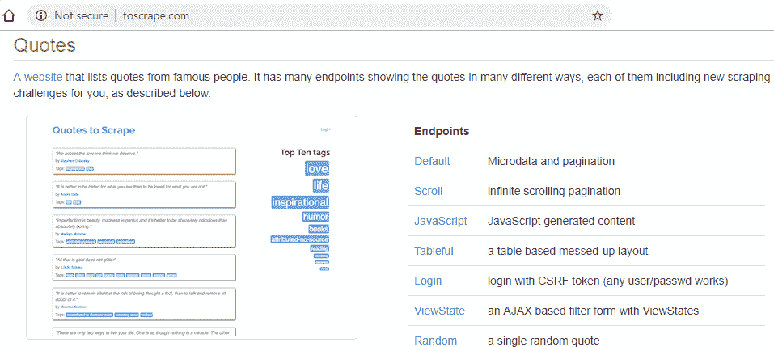
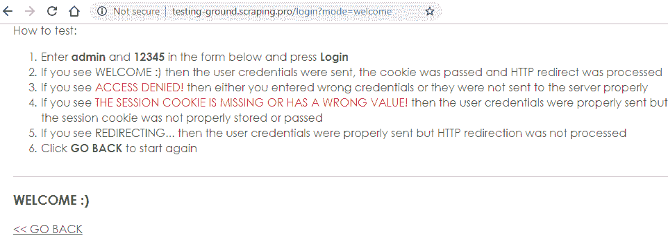
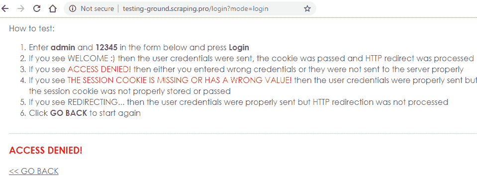

# 使用安全 Web

到目前为止，我们已经了解了 web 开发技术、数据查找技术和 Python 库，可以用来访问和获取 web 内容。

如今存在各种形式的基于 web 的安全措施，以保护我们免受未经验证的使用和对敏感 web 内容的未经授权访问。网站应用了许多工具和技术；一些目标是基于用户的操作，而一些目标是网站的内容及其可用性

安全 web（或基于 web 的安全功能）被认为是由网站实施的技术之一，并被希望使用或查看网站内容的最终用户使用。我们将从 web 抓取的角度介绍一些处理这些特性的基本概念。

在本章中，我们将学习以下主题：

*   安全 web 简介
*   HTML`<form>`处理
*   处理用户身份验证
*   使用 cookie 和会话

# 技术要求

本章要求使用网络浏览器（Google Chrome 或 Mozilla Firefox）。我们将使用以下 Python 库：

*   `requests`
*   `pyquery`

如果您当前的 Python 设置中不存在这些库，请参阅[第 2 章](02.html)、*Python 和 Web–使用 urllib 和请求*、*设置*部分，以了解有关它们的安装和如何设置的更多信息。

本章的代码文件可在本书的 GitHub 存储库[中找到 https://github.com/PacktPublishing/Hands-On-Web-Scraping-with-Python/tree/master/Chapter06](https://github.com/PacktPublishing/Hands-On-Web-Scraping-with-Python/tree/master/Chapter06) 。

# 安全 web 简介

用于访问信息的基于 web 的安全功能（或用于维护安全访问状态的功能）的实现正日益快速增长。随着基于 web 的技术的不断发展，网站和 web 应用程序部署了基本或高度复杂的安全机制

从爬行和抓取的角度来看，支持 web 的安全内容通常具有挑战性。在本节中，将向您介绍一些基于安全性的基本概念。在接下来的章节中，我们将探讨这些概念及其实现。

以下各节将讨论一些支持安全性的概念或易受安全性影响的概念。这些概念可以使用一些底层工具或措施在网站中独立和协作地实现。

# 表格处理

这也称为 HTML`<form>`处理、表单处理或表单提交。此方法处理 HTML`<form>`中的数据。

HTML`<form>`或`<form>`标记内的元素，如`<input>`、`<option>`、`<button>`、`<textarea>`等，具有特定属性，通常用于收集和提交数据。请访问 W3School HTML 表格（[https://www.w3schools.com/html/html_forms.asp](https://www.w3schools.com/html/html_forms.asp) 获取 HTML 表单的实际示例和详细信息。

HTTP 方法或请求方法，如`GET`、`POST`、`PUT`等，用于跨网页访问或提交数据。有关 HTTP 的更多信息，请访问[https://www.w3.org/Protocols/](https://www.w3.org/Protocols/)

从安全角度来看，HTML`<form>`可以包含动态、隐藏或系统生成的值，用于管理验证、向字段提供值或在表单提交期间执行基于安全性的实现。在页面中，用户可能看不到具有`<input type="hidden"...>`等字段的表单。在这种情况下，用户必须从页面源代码或基于浏览器的开发人员工具获得帮助。

带有表单的网页可能在某些字段中显示并请求输入，并且可以在后端或源中包含更多的字段，这些字段可以包含基于用户或系统的信息。这些信息在后台收集和处理，用于基于 web 的分析、营销、用户和系统识别、安全管理等。

For more information on form processing, please refer to [Chapter 3](03.html), *Using LXML, XPath, and CSS Selectors*, *Using web browser developer tools for accessing web content* section.

# Cookies 和会话

要访问已浏览网站设置的 cookie 和会话值，请参考[第 1 章](01.html)、*刮网基础*、*开发者工具*部分的*数据查找技术*部分。现在，让我们了解一下什么是 cookies 和会话。

# 曲奇饼

Cookie 是网站在您的系统或计算机上生成和存储的数据。Cookie 中的数据有助于识别用户对网站的 web 请求。Cookie 中的数据以`key:value`对存储。存储在 cookies 中的数据有助于网站访问该数据，并以快速交互的形式传输某些保存的值。

Cookie 还允许网站跟踪用户配置文件、他们的网络习惯等，并将这些信息用于索引、页面广告和营销活动

基于 Cookie 的数据可以持续一个会话（即从加载网页到关闭浏览器），形成所谓的会话 Cookie，也可以持续数天、数周或数月，称为永久或存储 Cookie。Cookie 还可以包含以秒为单位的到期值，并且一旦该值所表示的时间段过去，Cookie 将从系统中过期或删除。

For more information on cookies, please refer to [Chapter 1](01.html), *Web Scraping Fundamentals*, the *Understanding Web Development and Technologies* section  of the *HTTP* section. You can also visit [https://www.aboutcookies.org/](https://www.aboutcookies.org/) and  [http://www.allaboutcookies.org/](http://www.allaboutcookies.org/) for more information.

# 会议

会话是在两个系统之间强制执行基于状态的通信的属性。会话用于临时存储用户信息，并在用户退出浏览器或离开网站时立即删除。

会话用于维护安全活动。网站生成一个唯一的标识号，也称为会话 ID 或会话密钥，用于独立跟踪其用户或基于安全的功能。在会话可用性的大多数情况下，也可以使用 cookie 跟踪会话可用性。

# 用户身份验证

用户身份验证处理和管理基于用户的标识过程。网站通过其注册页面提供用户注册，从而收集必填或可用字段的用户输入。用户的详细信息保存在安全的地方，如云数据库、基于服务器的数据库或任何其他安全系统

注册用户经过验证，可以登录和注销其系统，并通过其用户名、密码和电子邮件地址进行标识

表单处理、cookie、会话管理和其他基于安全性的措施可以单独部署，也可以协作部署。

在前一章中，我们根据信息可用性、访问网页、应用各种 HTTP 方法等来提取数据，探索并解决了各种场景。本章中的各节介绍了在 web 抓取过程中可以实施或可能面临的各种措施和情况

# HTML

<form>处理</form>

在本节中，我们将处理表单处理或表单提交，以便从[搜索活动 http://toscrape.com](http://toscrape.com) （视图状态）。ViewState 是一种基于 AJAX 的过滤表单。

此特定表单提交在 AJAX（[的帮助下分多个步骤执行 https://www.w3schools.com/js/js_ajax_intro.asp](https://www.w3schools.com/js/js_ajax_intro.asp) ）。有关 AJAX 的更多信息，请访问[W3AJAX](https://www.w3schools.com/js/js_ajax_intro.asp)：



http://toscrape.com with various endpoints in the Quotes section

让我们设置代码。需要导入`pyquery`和`requests`库，并收集所需的 URL 以便使用。`processRequests()`函数以及位置参数和命名参数用于处理对提供的`url`的请求，基于`params`参数的 HTTP`POST`和`GET`方法返回 PyQuery 对象作为响应。

我们还对迭代`authorTags`和分别收集`quoteAuthor`和`message`感兴趣。以类似的方式，可以提取从页面获得的任何信息：

```py
    from     pyquery     import     PyQuery     as     pq
    import     requests
mainurl =     "http://toscrape.com/"
    searchurl =     "http://quotes.toscrape.com/search.aspx"
    filterurl =     "http://quotes.toscrape.com/filter.aspx"
    quoteurl =     "http://quotes.toscrape.com/"
    authorTags = [(    'Albert Einstein'    ,     'success'    ), (    'Thomas A. Edison'    ,     'inspirational'    )]

    def     processRequests(url, params={}, customheaders={}):
        if         len    (params) >     0    :
        response = requests.post(url,     data    =params,     headers    =customheaders)
        else    :
        response = requests.get(url)    
                    return     pq(response.text)

    if     __name__ ==     '__main__'    :
        for     authorTag     in     authorTags:
        authorName,tagName= authorTag
```

下面的屏幕截图显示了前面代码中定义的`searchurl`页面的内容。存在两个单独的下拉列表，每个下拉列表分别包含作者及其标记的选项：


http://quotes.toscrape.com/search.aspx  searchurl wit h author and tag

让我们加载`searchurl`，如下代码所示，并从“作者”下拉列表中选择一位作者。使用 AJAX 为作者选择的`<option>`生成`<option>`标记：

Please refer to [Chapter 3](03.html), *Using LXML, XPath, and CSS Selectors*, the *Using web browser developer tools for accessing web content* section, and [Chapter 1](01.html), *Web Scraping Fundamentals* , the  *Data finding techniques* and *Developer tools* sections.

```py
    #Step 1: load searchURL
    searchResponse = processRequests(searchurl)
author = searchResponse.find(    'select#author option:contains("'     + authorName +     '")'    ).attr(    'value'    )
viewstate = searchResponse.find(    'input#__VIEWSTATE'    ).attr(    'value'    )
tag = searchResponse.find(    'select#tag option'    ).text()

    print    (    "Author: "    , author)
    print    (    "ViewState: "    , viewstate)
    print    (    "Tag: "    , tag)
```

如您所见，`processRequests()`函数是使用 HTTP`GET`到`searchurl`调用的，并且将作为 PyQuery 的对象返回响应。我们从`searchResponse`中收集必要的表单字段。收集`author`、`viewstate`、`tag`等字段，每次迭代时获取的字段值显示在以下输出中：

```py
Author: Albert Einstein
ViewState: NTA2MjI4NmE1Y2Q3NGFhMzhjZTgxMzM4ZWU0NjU4MmUsQWxiZXJ0IEVpbnN0ZWluLEouSy4gUm93bGluZyxKYW5lIEF1c3Rlbi............BDdW1taW5ncyxLaGFsZWQgSG9zc2VpbmksSGFycGVyIExlZSxNYWRlbGVpbmUgTCdFbmdsZQ==
Tag: ----------

Author: Thomas A. Edison
ViewState: ZjNhZTUwZDYzY2YyNDZlZmE5ODY0YTI5OWRhNDAyMDYsQWxiZXJ0IEVpbnN0ZWluLEouSy4gUm93bGluZyxKYW5lIEF1c3Rlbi............BDdW1taW5ncyxLaGFsZWQgSG9zc2VpbmksSGFycGVyIExlZSxNYWRlbGVpbmUgTCdFbmdsZQ==
Tag: ----------
```

从前面的输出中，我们可以看到`viewstate (<input id="__VIEWSTATE"..>)`在`authorTags`的两次迭代中都包含唯一的值。

`ViewState` is a unique and random value that's generated by websites to identify individual states of the page, which are often found as a hidden `<input>` value. This `<form>` value exists in most websites that use `<form>` and built-in ASP or ASP.NET technologies. The `ViewState` value is used on the client side, and it preserves or retains the value of the `<form>` elements, alongside page identity. Use of  `ViewState` is one of the techniques related to state management. For more information, please visit the article from  C#Corner found at [https://www.c-sharpcorner.com/article/Asp-Net-state-management-techniques/](https://www.c-sharpcorner.com/article/Asp-Net-state-management-techniques/) .  

`ViewState`的值对于获取所选作者的`<option>`标记是必需的。我们可以在下面的代码中看到，`params`由`author`、`tag`、`__VIEWSTATE`创建，并通过获取`filterResponse`通过 HTTP`POST`和`customheaders`发布或提交到`filterurl`。下面的代码显示了当`filterurl`加载了 author 和 default 标记时会发生什么：

```py
    #Step 2: load filterurl with author and default tag
    params = {    'author'    : author,     'tag'    : tag,     '__VIEWSTATE'    : viewstate}
customheaders = {
        'Accept'    :     'text/html,application/xhtml+xml,application/xml;q=0.9,image/webp,image/apng,*/*;q=0.8'    ,
        'Content-Type'    :     'application/x-www-form-urlencoded'    ,
        'Referer'    : searchurl
}

filterResponse = processRequests(filterurl,params,customheaders)
viewstate = filterResponse.find(    'input#__VIEWSTATE'    ).attr(    'value'    )
tagSuccess = filterResponse.find(    'select#tag option:contains("'     + tagName +     '")'    ).attr(    'value'    )
submitButton = filterResponse.find(    'input[name="submit_button"]'    ).attr(    'value'    )

print    (    "Author: "    , author)
    print    (    "ViewState: "    , viewstate)
    print    (    "Tag: "    , tagSuccess)
    print    (    "Submit: "    , submitButton)
```

迭代上述代码将产生以下输出：

*   `http://quotes.toscrape.com/filter.aspx`带有所选作者（`Thomas A. Edison`和标签（`inspirational`：

```py
Author: Thomas A. Edison
ViewState: ZjNhZTUwZDYzY2YyNDZlZmE5ODY0YTI5OWRhNDAyMDYsQWxiZXJ0IEVpbnN0ZWluLEouSy4gUm93bGluZyxKYW5lIEF1c3Rlbi............BDdW1taW5ncyxLaGFsZWQgSG9zc2VpbmksSGFycGVyIExlZSxNYWRlbGVpbmUgTCdFbmdsZSwtLS0tLS0tLS0t
Tag: inspirational
Submit: Search
```

*   `http://quotes.toscrape.com/filter.aspx`带有所选作者（`Albert Einstein`和标签（`success`：

```py
Author: Albert Einstein
ViewState: NTA2MjI4NmE1Y2Q3NGFhMzhjZTgxMzM4ZWU0NjU4MmUsQWxiZXJ0IEVpbnN0ZWluLEouSy4gUm93bGluZyxKYW5lIEF1c3Rlbi............BDdW1taW5ncyxLaGFsZWQgSG9zc2VpbmksSGFycGVyIExlZSxNYWRlbGVpbmUgTCdFbmdsZSwtLS0tLS0tLS0t
Tag: success
Submit: Search
```

现在我们已经获得了每个`authorTags`的所有基于过滤器`<form>`的参数，最后一步是使用`HTTP POST`将这些参数即`params`提交给`filterurl`，并提取结果信息：

```py
    #Step 3: load filterurl with author and defined tag
    params = {    'author'    : author,     'tag'    : tagSuccess,     'submit_button'    : submitButton,     '__VIEWSTATE'    : viewstate}    
    customheaders = {
    'Accept'    :     'text/html,application/xhtml+xml,application/xml;q=0.9,image/webp,image/apng,*/*;q=0.8'    ,
    'Content-Type'    :     'application/x-www-form-urlencoded'    ,
    'Referer'    : filterurl
}

finalResponse = processRequests(filterurl,params, customheaders)

    #Step 4: Extract results
    quote = finalResponse.find(    'div.quote span.content'    ).text()

quoteAuthor = finalResponse.find(    'div.quote span.author'    ).text()
message = finalResponse.find(    'div.quote span.tag'    ).text()
    print    (    "        Author: "    , quoteAuthor,     "        \n        Message: "    , message)
```

我们可以看到，`finalResponse`是一个 PyQuery 对象，由`processRequests()`返回并解析得到`quote`*、*`quoteAuthor`*、*和`message`，如下图所示：


http://quotes.toscrape.com/filter.aspx   with results for Author and Tag

使用前面代码`Author`和`Message`的迭代 1 的输出如下：

```py
Author: Albert Einstein 
Message: success
```

以下是第二次迭代的屏幕截图：


http://quotes.toscrape.com/filter.aspx   with results for Author and Tag

使用前面代码`Author`和`Message`的第二次迭代的输出如下：

```py
Author: Thomas A. Edison 
Message: inspirational
```

前面的代码中显示了带有搜索和过滤操作的表单处理，以及隐藏字段的使用。系统在后台使用`ViewState`值来识别所选选项并过滤与之相关的标签，从而产生作者引用的内容。

最终表单提交的 HTTP`POST`参数总数为四个，而页面仅显示或允许您与两个选项交互。如果对某个值进行任何更改，例如`viewstate`，或者`params`*中缺少`viewstate`，则*将导致空引号，如下代码所示：

```py
#params={    'author'    :author,    'tag'    :tagSuccess,    'submit_button'    :submitButton,    '__VIEWSTATE'    :viewstate}
params={    'author'    :author,    'tag'    :tagSuccess,    'submit_button'    :submitButton,    '__VIEWSTATE'    :viewstate+"TEST"}
#params={    'author'    :author,    'tag'    :tagSuccess,    'submit_button'    :submitButton}
......
finalResponse = processRequests(filterurl,params, customheaders)
......
    print    (    "        Author: "    , quoteAuthor,     "        \n        Message: "    , message)

*Quote:* 
*Author:* 
*Message:*
```

表单提交不仅取决于从页面中可见的`<form>`元素中选择的所需参数，还可能存在隐藏值和动态生成的状态表示，为了成功输出，应有效处理和处理这些参数

在下一节中，我们将处理表单提交和用户身份验证。

# 处理用户身份验证

在本节中，我们将探讨一个用于处理基本用户身份验证的任务，该任务可从[获得 http://testing-ground.scraping.pro/login](http://testing-ground.scraping.pro/login) 。用户身份验证通常使用唯一的信息组合进行处理，如用户名、密码、电子邮件等，以识别网站上的用户

本节中的代码涉及登录和更改登录凭据，以及从页面获取相应的消息

正如我们在下面的屏幕截图中所看到的，HTML`<form>`包含两个`<input>`框，它们接受登录所需的用户名和密码（即登录凭据）。登录凭据是私有且安全的信息，但对于这个特定的测试站点，这些值是可见的、预定义的，并提供了它们，即，`Username = "admin"`和`Password = "12345"`：


Login page

使用这些凭证在[上进行登录 http://testing-ground.scraping.pro/login](http://testing-ground.scraping.pro/login) ，我们需要找到页面上用于处理输入凭证的`<form>`属性，即`action`和`method`。我们可以看到，HTTP`POST`方法将应用于[上的表单提交 http://testing-ground.scraping.pro/login?mode=login](http://testing-ground.scraping.pro/login?mode=login) ：


Inspecting <form> elements

让我们继续设置代码。需要导入`pyquery`和`requests`库，并收集所需的 URL 以便使用：

```py
    from     pyquery     import     PyQuery     as     pq
    import     requests
mainUrl =     "http://testing-ground.scraping.pro"
    loginUrl =     "http://testing-ground.scraping.pro/login"
    logoutUrl =     "http://testing-ground.scraping.pro/login?mode=logout"
    postUrl=    "http://testing-ground.scraping.pro/login?mode=login"    
```

如下面的代码所示，`responseCookies()`函数在打印头和 cookie 信息之前会接受从`requests.get()`获取的响应对象。类似地，`processParams()`函数接受将发布的基于`<form>`的参数，并打印从页面获取的消息：

```py
    def     responseCookies(response):
    headers = response.headers
    cookies = response.cookies
        print    (    "Headers: "    , headers)
        print    (    "Cookies: "    , cookies)

    def     processParams(params):
    response = requests.post(postUrl,     data    =params)
    responseB = pq(response.text)
    message = responseB.find(    'div#case_login h3'    ).text()
        print    (    "Confirm Login : "    ,message)

    if     __name__ ==     '__main__'    : 
    requests.get(logoutUrl)

    response = requests.get(mainUrl)
    responseCookies(response)

    response = requests.get(loginUrl)
    responseCookies(response)
```

现在，让我们请求`logoutUrl`清理 cookie 和会话（如果存在）。或者，对于一个全新的流程，我们可以分别请求`mainUrl`和`loginUrl`，并检查从`responseCookies()`接收到的消息。以下是输出：

```py
Headers:{'Vary':'Accept-Encoding','Content-Type':'text/html','Connection':'Keep-Alive', ..........., 'Content-Encoding':'gzip','X-Powered-By':'PHP/5.4.4-14+deb7u12'}
Cookies: <RequestsCookieJar[]>

Headers:{'Vary':'Accept-Encoding','Content-Type':'text/html','Connection':'Keep-Alive',.............., 'Set-Cookie':'tdsess=deleted; expires=Thu, 01-Jan-1970 00:00:01 GMT',........., 'Keep-Alive':'timeout=5, max=100','X-Powered-By':'PHP/5.4.4-14+deb7u12'}
Cookies: <RequestsCookieJar[]>
```

如前面的输出所示，`mainUrl`和`loginUrl`的 cookies 都为空，除了`Set-Cookie`之外，没有其他唯一的头对可用，其值为`loginUrl`中的`tdsess=deleted; expires=Thu, 01-Jan-1970 00:00:01 GMT`

既然`loginUrl``<form>`元素属性名称中的`responseA`已被收集为`username`和`password`，该信息将用于创建`paramsCorrect`和`paramsIncorrect`参数字符串，并将其发布到`postUrl`：

```py
responseA = pq(response.text)
username = responseA.find(    'input[id="usr"]'    ).attr(    'name'    )
password = responseA.find(    'input[id="pwd"]'    ).attr(    'name'    )

    #Welcome : Success
    paramsCorrect = {username:     'admin'    , password:     '12345'    }     #Success
        print    (paramsCorrect)
processParams(paramsCorrect)
```

使用提供的`paramsCorrect`参数字符串成功提交表单将导致以下输出：

```py
{'pwd': '12345', 'usr': 'admin'}
Confirm Login : WELCOME :)
```

前面的输出是从`postUrl`的响应中提取的，在这个测试用例中，它实际上是一个 URL 为[的重定向页面 http://testing-ground.scraping.pro/login?mode=welcome](http://testing-ground.scraping.pro/login?mode=welcome) ：



Successful form submission with valid login credentials

让我们继续表单提交，但凭据无效。`paramsIncorrect`短语包含`password`的无效值：

```py
 paramsIncorrect = {username:     'admin'    , password:     '123456'    }     #Access Denied
                 print    (paramsIncorrect)
 processParams(paramsIncorrect)
```

上述代码将产生以下输出：

```py
{'pwd': '123456', 'usr': 'admin'}
Confirm Login : ACCESS DENIED!
```

前面的输出也可以在`loginUrl`本身中找到，这次没有重定向：



Access Denied! (processed with wrong credentials)

如您所见，用户身份验证和表单提交是协同工作的。通过使用正确的登录凭据，并能够使用 Python 处理表单提交过程，我们可以获得成功的输出或处理从网站返回的相关输出

在下一节中，我们将通过处理包含会话的 cookie 来执行表单提交和用户身份验证。

# 使用 cookie 和会话

在本节中，我们将处理用户身份验证的表单处理，并管理[的 cookie 和会话 http://quotes.toscrape.com/login](http://quotes.toscrape.com/login) 来自[http://toscrape.com](http://toscrape.com)

In order to log in, you need to log in with a CSRF token (any username/password works) .  

让我们设置代码。需要导入`pyquery`和`requests`库，并收集和使用所需的 URL。`getCustomHeaders()`函数与`cookieHeader`参数一起用于设置 URL 请求头的 cookie 值。`responseCookies()`函数与`response`参数一起显示`headers`和`cookies`，并从`cookies`返回`Set-Cookie`值：

```py
    from     pyquery     import     PyQuery     as     pq
    import     requests
mainUrl =     "http://toscrape.com/"
    loginUrl =     "http://quotes.toscrape.com/login"        
    quoteUrl =     "http://quotes.toscrape.com/"

        def     getCustomHeaders(cookieHeader):
        return     {
            'Host'    :     'quotes.toscrape.com'    ,
            'User-Agent'    :     'Mozilla/5.0 (Windows NT 10.0; Win64; x64; rv:65.0) Gecko/20100101 Firefox/65.0'    ,
            'Accept'    :     'text/html,application/xhtml+xml,application/xml;q=0.9,image/webp,*/*;q=0.8'    ,
            'Referer'    :     'http://quotes.toscrape.com/login'    ,
            'Content-Type'    :     'application/x-www-form-urlencoded'    , 
            'Cookie'    : cookieHeader
    }

    def     responseCookies(response):
    headers = response.headers
    cookies = response.cookies
        print    (    "Headers: "    , headers)
        print    (    "Cookies: "    , cookies)
        return     headers[    'Set-Cookie'    ]

    if     __name__ ==     '__main__'    :
```

For more information on HTTP and HTTP headers, please visit [Chapter 1](01.html), *Web Scraping Fundamentals*, the *Understanding Web Development and Technologies* and *HTTP* sections. For more details on cookies, please visit [https://www.aboutcookies.org/](https://www.aboutcookies.org/) or [allaboutcookies.org](http://www.allaboutcookies.org/).

现在，让我们分别加载`mainUrl`和`loginUrl`：

```py
requests.get(mainUrl)
response = requests.get(loginUrl)

```

以下屏幕截图显示了使用`loginUrl`时登录页面的外观：


Login page from http://quotes.toscrape.com/login

加载`loginUrl`后，我们可以检查或使用基于浏览器的开发工具查找请求头并确认是否存在 cookie。我们收到以下输出：


Network panel Doc-based headers tab from browser developer tools

以下代码接受来自`response`的 Cookie，并在标头中使用：

```py
setCookie = responseCookies(response)
    print    (    "Set-Cookie: "    ,setCookie)
```

从前面的屏幕截图可以看出，请求头包含以`sessio=....`开头的值`key=Cookie`，也称为会话 ID。该信息在`response.headers`和`response.cookies`中都可以找到，`responseCookies()`函数在打印细节之前从`response.headers`返回 cookie 值：

```py
Headers: {'Set-Cookie': session=eyJjc3JmX3Rva2VuIjoicUlPVGNnQ2FKZmJaS3NOdmlIREFWbVdvWGtMakJkVXl1U3BScmVZTWhRd0d6dEZueFBsRSJ9.D68Log.3ANox76h0whpTRjkqNo7JRgCtWI; HttpOnly; Path=/',...,'Content-Encoding':'gzip','Content-Type':'text/html; charset=utf-8',......}

Cookies: <RequestsCookieJar[<Cookie session=eyJjc3JmX3Rva2VuIjoicUlPVGNnQ2FKZmJaS3NOdmlIREFWbVdvWGtMakJkVXl1U3BScmVZTWhRd0d6dEZueFBsRSJ9.D68Log.3ANox76h0whpTRjkqNo7JRgCtWI for quotes.toscrape.com/>]>

Set-Cookie: session=eyJjc3JmX3Rva2VuIjoicUlPVGNnQ2FKZmJaS3NOdmlIREFWbVdvWGtMakJkVXl1U3BScmVZTWhRd0d6dEZueFBsRSJ9.D68Log.3ANox76h0whpTRjkqNo7JRgCtWI; HttpOnly; Path=/
```

A  session ID  is a unique number that a website's server assigns to a specific user for a certain duration or for a session. This  ID  can be stored in certain `<form>` fields or  cookies,  or even appended to a URL query string. 

现在我们已经收到了基于 cookie 的会话值，我们需要维护这个值，以便我们有一个成功的登录过程。

让我们收集基于`<form>`的字段以及有关表单提交的更多信息：


Elements  panel  from Browser Developer Tools with page source

从前面的屏幕截图中可以看到，`<form>`正在使用 HTTP`POST`将表单字段提交给`loginUrl`，还有一个隐藏的`<input>`字段和`csrf_token`，以及接受登录凭据的字段

**Cross-Site Request Forgery **(**CSRF**) or session riding is a security measure that is used to identify each individual request between a user and a website. Generally, `CSRF_TOKEN` or a token is used to manage such a mechanism. A token is a random string generated by websites when a request to the page is made by a user. A token value is required to process any form of HTTP request to the website. The token value keeps changing for each successful request. An HTML `<form>` containing a token value can be processed with either an updated or deleted token, which are not accepted by websites.

在本例中，`username`和`password`是开放字符串值，`test`已用于这两个值：

```py
responseA = pq(response.text)
csrf_token = responseA.find(    'input[name="csrf_token"]'    ).attr(    'value'    )
username = responseA.find(    'input[id="username"]'    ).attr(    'name'    )
password = responseA.find(    'input[id="password"]'    ).attr(    'name'    )

params = {username:     'test'    , password:     'test'    ,     'csrf_token'    : csrf_token}
print(params)
```

已收集并配置具有现有值和名称的表单字段`params`，这将导致以下输出：

```py
{'password':'test','username':'test','csrf_token':'jJgAHDQykMBnCFsPIZOoqdbflYRzXtSuiEmwKeGavVWxpNLUhrcT'}
```

The parameters to be submitted via a form action are built using the `name` attribute of the `<form>` element as a key and default, respectively, and is required to receive values as their value. 

`requests.post()`短语使用已设置的`params`和`customHeaders`实现对`loginURL`的 HTTP`POST`请求。使用我们之前收到的`setCookie`值创建`customHeaders`：

```py
customHeaders = getCustomHeaders(setCookie)
response = requests.post(loginUrl,     data    =params,     headers    =customHeaders)
setCookie = responseCookies(response)
    #print    (    "Set-Cookie: "    ,setCookie)

responseB = pq(response.text)
logoutText = responseB.find(    'a[href*="logout"]'    ).text()
logoutLink = responseB.find(    'a[href*="logout"]'    ).attr(    'href'    )

    print    (    "Current Page : "    ,response.url)
    print    (    "Confirm Login : "    , responseB.find(    '.row h2'    ).text())
    print    (    "Logout Info : "    , logoutText,    " & "    ,logoutLink)
```

最后，我们收到一个成功的输出，以及重定向的 URL 和有关注销的信息：

```py
Current Page : http://quotes.toscrape.com/
Confirm Login : Top Ten tags
Logout Info : Logout & /logout
```

以下屏幕截图显示了已验证信息的成功身份验证：


Successful authentication verified with information from http://quotes.toscrape.com/ Empty  `customHeaders`  or  `customHeaders`  without a  `key`  named  `Cookie`  will not be successful in the authentication process. Similarly, `csrf_token` is also required as the parameter. A posted, updated, or empty `csrf_token` will not be successful in the authentication process, even when `customHeaders`  is provided with the required `key:value` pairs of information.

# 总结

在本章中，我们探讨了一些与安全问题相关的基本措施和技术，这些措施和技术在 web 抓取方面经常遇到，并且具有挑战性。

维护用户和网站之间的安全措施是一项极具挑战性和危险性的任务。存在并需要管理不同的安全问题。web 上存在各种新概念，需要有效和合法地处理这些概念，以便我们能够执行 web 抓取活动。

在下一章中，我们将使用 Python 编程语言与 web API 交互以进行数据提取。

# 进一步阅读

*   AJAX:[http://api.jquery.com/jquery.ajax/](http://api.jquery.com/jquery.ajax/) 、[https://www.w3schools.com/js/js_ajax_intro.asp](https://www.w3schools.com/js/js_ajax_intro.asp)
*   浏览器开发工具：[https://developers.google.com/web/tools/chrome-devtools/](https://developers.google.com/web/tools/chrome-devtools/) 、[https://developer.mozilla.org/son/docs/Tools](https://developer.mozilla.org/son/docs/Tools)
*   饼干：[https://www.aboutcookies.org/](https://www.aboutcookies.org/) 、[http://www.allaboutcookies.org/](http://www.allaboutcookies.org/)
*   CSRF:[https://www.owasp.org/index.php/Cross-Site_Request_Forgery_（CSRF）](https://www.owasp.org/index.php/Cross-Site_Request_Forgery_(CSRF))
*   HTML 表格：[https://www.w3schools.com/html/html_forms.asp](https://www.w3schools.com/html/html_forms.asp) 、[https://developer.mozilla.org/en-US/docs/Learn/HTML/Forms](https://developer.mozilla.org/en-US/docs/Learn/HTML/Forms)
*   HTTP:[https://www.w3.org/Protocols/](https://www.w3.org/Protocols/)
*   HTTP 头文件：[http://jkorpela.fi/http.html](http://jkorpela.fi/http.html)
*   HTTP 会话：[https://developer.mozilla.org/en-US/docs/Web/HTTP/Session](https://developer.mozilla.org/en-US/docs/Web/HTTP/Session)
*   刮网沙箱：[http://toscrape.com/](http://toscrape.com/)
*   刮网机试验场：[http://testing-ground.scraping.pro/](http://testing-ground.scraping.pro/)