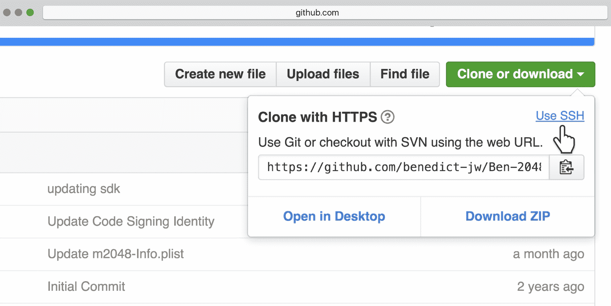

# 并发和并行编程高级入门

*在 Python*中掌握并发性的第一章将概述什么是并发编程（与顺序编程相比）。我们将简要讨论可以并发的程序和不能并发的程序之间的区别。我们将回顾并行工程和编程的历史，并提供一些当今如何使用并行编程的示例。最后，我们将简要介绍本书将采用的方法，包括章节结构的概要以及如何下载代码和创建工作 Python 环境的详细说明。

本章将介绍以下主题：

*   并发的概念
*   为什么有些程序不能并发，以及如何将它们与可以并发的程序区分开来
*   计算机科学中并发的历史：它是如何在今天的行业中使用的，以及在未来可以预期什么
*   本书各章节将涵盖的具体主题
*   如何设置 Python 环境，以及如何从 GitHub 签出/下载代码

# 技术要求

查看以下视频以查看代码的运行：[http://bit.ly/2TAMAeR](http://bit.ly/2TAMAeR)

# 什么是并发？

据估计，需要计算机程序处理的数据量每两年翻一番。例如，**国际数据公司**（**IDC**）估计，到 2020 年，地球上每个人的数据量将达到 5200 GB**。伴随着如此惊人的数据量，对计算能力的需求越来越高。尽管每天都在开发和使用大量计算技术，但并发编程仍然是有效和准确处理数据的最突出方式之一。**

 **当并发一词出现时，有些人可能会感到害怕，但它背后的概念非常直观，即使在非编程环境中也很常见。然而，这并不是说并发程序和顺序程序一样简单；它们确实更难书写和理解。然而，一旦实现了正确有效的并发结构，执行时间将随之显著提高，稍后您将看到这一点。

# 并发与顺序

也许理解并发编程最明显的方法是将其与顺序编程进行比较。当顺序程序一次处于一个位置时，在并发程序中，不同的组件处于独立或半独立的状态。这意味着处于不同状态的组件可以独立执行，因此可以同时执行（因为一个组件的执行不依赖于另一个组件的结果）。下图说明了这两种类型之间的基本区别：


Difference between concurrent and sequential programs

并发的一个直接优点是提高了执行时间。同样，由于某些任务是独立的，因此可以同时完成，因此计算机执行整个程序所需的时间更少。

# 示例 1–检查非负数是否为素数

让我们考虑一个快速的例子。假设我们有一个简单的函数来检查一个非负数是否为素数，如下所示：

```py
# Chapter01/example1.py

from math import sqrt

def is_prime(x):
    if x < 2:
    return False

if x == 2:
    return True

if x % 2 == 0:
    return False

limit = int(sqrt(x)) + 1
    for i in range(3, limit, 2):
        if x % i == 0:
            return False

return True
```

另外，假设我们有一个非常大的整数列表（*10<sup>13</sup>*到*10<sup>13</sup>+500*），我们想使用前面的函数检查它们是否都是素数：

```py
input = [i for i in range(10 ** 13, 10 ** 13 + 500)]
```

顺序方法是简单地将一个数字接着一个数字传递给`is_prime()`函数，如下所示：

```py
# Chapter01/example1.py

from timeit import default_timer as timer

# sequential
start = timer()
result = []
for i in input:
    if is_prime(i):
        result.append(i)
print('Result 1:', result)
print('Took: %.2f seconds.' % (timer() - start))
```

复制代码或从 GitHub 存储库下载代码并运行（使用`python example1.py`命令）。输出的第一部分类似于以下内容：

```py
> python example1.py
Result 1: [10000000000037, 10000000000051, 10000000000099, 10000000000129, 10000000000183, 10000000000259, 10000000000267, 10000000000273, 10000000000279, 10000000000283, 10000000000313, 10000000000343, 10000000000391, 10000000000411, 10000000000433, 10000000000453]
Took: 3.41 seconds.
```

您可以看到，该程序花了大约`3.41`秒来处理所有的数字；我们很快就会回到这个数字上来。目前，我们还可以在运行程序时检查计算机的工作强度。在操作系统中打开活动监视器应用程序，然后再次运行 Python 脚本；以下屏幕截图显示了我的结果：


Activity Monitor showing computer performance

显然，计算机工作不太努力，因为它几乎有 83%处于空闲状态。

现在，让我们看看并发是否真的能帮助我们改进程序。 `is_prime()` 函数包含大量繁重的计算，因此它是并发编程的良好候选。由于将一个数字传递给`is_prime()`函数的过程与传递另一个数字的过程是独立的，因此我们可以对我们的程序应用并发性，如下所示：

```py
# Chapter01/example1.py

# concurrent
start = timer()
result = []
with concurrent.futures.ProcessPoolExecutor(max_workers=20) as executor:
    futures = [executor.submit(is_prime, i) for i in input]

    for i, future in enumerate(concurrent.futures.as_completed(futures)):
        if future.result():
            result.append(input[i])

print('Result 2:', result)
print('Took: %.2f seconds.' % (timer() - start))
```

粗略地说，我们将任务分成不同的小块，并同时运行它们。现在不要担心代码的细节，因为我们稍后将更详细地讨论进程池的使用。

当我执行该函数时，执行时间明显缩短，计算机也使用了更多的资源，空闲率仅为 37%：

```py
> python example1.py
Result 2: [10000000000183, 10000000000037, 10000000000129, 10000000000273, 10000000000259, 10000000000343, 10000000000051, 10000000000267, 10000000000279, 10000000000099, 10000000000283, 10000000000313, 10000000000391, 10000000000433, 10000000000411, 10000000000453]
Took: 2.33 seconds
```

活动监视器应用程序的输出如下所示：


Activity Monitor showing computer performance

# 并行与并行

在这一点上，如果您在并行编程方面有一些经验，您可能想知道并发性与并行性是否有什么不同。并发编程和并行编程之间的关键区别在于，虽然在并行程序中有许多处理流（主要是 CPU 和内核）同时独立工作，但可能有不同的处理流（主要是线程）访问和使用**共享资源**同时在并发程序中。

由于此共享资源可以被任何不同的处理流读取和覆盖，因此在需要执行的任务彼此不完全独立时，有时需要某种形式的协调。换句话说，重要的是一些任务要在其他任务之后执行，以确保程序将产生正确的结果。


Difference between concurrency and parallelism

上图说明了并发性和并行性之间的区别：在上段中，相互不交互的并行活动（在本例中为 CAR）可以同时运行，而在下段中，一些任务必须等待其他任务完成后才能执行。

稍后我们将看到更多这些区别的例子。

# 快速的比喻

并发是一个很难完全理解的概念，所以让我们考虑一个快速的隐喻，以便使并发性及其与并行性的差异更容易理解。

虽然有些神经科学家可能不同意，但让我们简单地假设，人脑的不同部分负责执行单独的、唯一的身体部分动作和活动。例如，大脑的左半球控制身体的右侧，从而控制右手（反之亦然）；或者，大脑的一部分可能负责写作，而另一部分只负责说话。

现在，让我们考虑第一个例子，具体来说。如果你想移动你的左手，你大脑的右侧（只有右侧）必须处理移动命令，这意味着你大脑的左侧可以*自由*处理其他信息。因此，可以同时移动和使用左手和右手来做不同的事情。类似地，也可能同时书写*和*对话。

这就是并行性：不同的进程彼此不交互，并且相互独立。请记住，并发性并不完全像并行性。即使存在进程一起执行的实例，并发也涉及到共享相同的资源。如果并行性类似于同时使用左手和右手执行独立任务，那么并发性可以与杂耍相关联，其中两只手同时执行不同的任务，但它们也与同一对象（在本例中为杂耍球）交互，因此，双手之间需要某种形式的协调。

# 不是每件事都应该同时进行

并非所有程序都是平等创建的：一些程序可以相对容易地并行或并发，而另一些程序是**固有顺序的**，因此不能并行或并行执行。前者的一个极端例子是令人尴尬的**并行**程序，这些程序可以划分为不同的并行任务，它们之间几乎没有或根本没有依赖性或通信需求。

# 尴尬地平行

令人尴尬的并行程序的一个常见示例是由图形处理单元处理的三维视频渲染，其中每个帧或像素都可以在没有相互依赖的情况下进行处理。密码破解是另一项令人尴尬的并行任务，可以轻松地分布在 CPU 内核上。在后面的章节中，我们将处理许多类似的问题，包括图像处理和 web 抓取，这些问题可以直观地并发/并行，从而显著提高执行时间。

# 固有顺序

与尴尬的并行任务相反，某些任务的执行在很大程度上取决于其他任务的结果。换句话说，这些任务不是独立的，因此不能并行或并发。此外，如果我们试图在这些程序中实现并发性，可能会花费更多的执行时间来产生相同的结果。让我们回到前面的主要检查示例；下面是我们看到的输出：

```py
> python example1.py
Result 1: [10000000000037, 10000000000051, 10000000000099, 10000000000129, 10000000000183, 10000000000259, 10000000000267, 10000000000273, 10000000000279, 10000000000283, 10000000000313, 10000000000343, 10000000000391, 10000000000411, 10000000000433, 10000000000453]
Took: 3.41 seconds.
Result 2: [10000000000183, 10000000000037, 10000000000129, 10000000000273, 10000000000259, 10000000000343, 10000000000051, 10000000000267, 10000000000279, 10000000000099, 10000000000283, 10000000000313, 10000000000391, 10000000000433, 10000000000411, 10000000000453]
Took: 2.33 seconds.
```

仔细观察，你会发现这两种方法的两个结果并不完全相同；第二个结果列表中的素数是**无序**。（回想一下，在第二种方法中，为了应用并发性，我们指定将任务拆分为不同的组以同时执行，并且我们获得的结果顺序是每个任务完成执行的顺序。）这是在我们的第二种方法中使用并发的直接结果：我们将程序要执行的任务分成不同的组，并且我们的程序同时处理这些组中的任务。

由于跨不同组的任务是同时执行的，因此输入列表中有一些任务位于其他任务之后，但在这些其他任务之前执行。例如，数字`10000000000183`在我们的输入列表中位于数字`10000000000129`之后，但在我们的输出列表中位于数字`10000000000129`之前进行处理。事实上，如果您反复执行程序，第二个结果几乎在每次运行中都会发生变化。

显然，如果我们想要得到的结果需要按照我们最初的输入顺序，那么这种情况是不可取的。当然，在本例中，我们可以通过使用某种形式的排序来简单地修改结果，但最终会花费额外的执行时间，这可能会使它比原始的顺序方法更加昂贵。

怀孕是一个通常用来说明某些任务天生顺序的概念：女性的数量永远不会缩短怀孕的时间。与并行或并发任务相反，在并行或并发任务中，处理实体数量的增加将提高执行时间，而在固有的顺序任务中添加更多处理器则不会。固有顺序性的著名例子包括迭代算法：牛顿法、三体问题的迭代解或迭代数值近似法。

# 示例 2–固有的顺序任务

让我们考虑一个很快的例子：

计算*f<sup>1000</sup>（3）*，*f（x）=x<sup>2</sup>-x+1*，*f<sup>n+1</sup>（x）=f（f<sup>n</sup>【x】*。

对于像*f*这样的复杂函数（其中比较难找到*f<sup>n</sup>（x）*的一般形式），计算*f<sup>1000</sup>**（3）*或类似值的唯一明显合理的方法是迭代计算*f<sup>2</sup>（3）=f（f（3）】*、*f<sup>3</sup>（3）=f（f<sup>2</sup>（3】、*、*、*、*f<sup>999</sup>（3）=f（f<sup>998</sup>（3】*、最后是*f*f【T11000】、*、*f*、*999（3）**。**

 *因为实际计算实际的时间是非常重要的，所以，我们必须只考虑在我们的代码中（水果挞）实际上在 1000℃开始加热，之后，我的笔记本电脑实际上开始加热，之后，20 分钟（3）

```py
# Chapter01/example2.py

def f(x):
    return x * x - x + 1

# sequential
def f(x):
    return x * x - x + 1

start = timer()
result = 3
for i in range(20):
    result = f(result)

print('Result is very large. Only printing the last 5 digits:', result % 100000)
print('Sequential took: %.2f seconds.' % (timer() - start))
```

运行（或使用`python example2.py`；以下代码显示了我收到的输出：

```py
> python example2.py
Result is very large. Only printing the last 5 digits: 35443
Sequential took: 0.10 seconds.
```

现在，如果我们试图对这个脚本应用并发性，唯一可能的方法就是通过`for`循环。一种解决方案可能如下所示：

```py
# Chapter01/example2.py

# concurrent
def concurrent_f(x):
    global result
    result = f(result)

result = 3

with concurrent.futures.ThreadPoolExecutor(max_workers=20) as exector:
    futures = [exector.submit(concurrent_f, i) for i in range(20)]

    _ = concurrent.futures.as_completed(futures)

print('Result is very large. Only printing the last 5 digits:', result % 100000)
print('Concurrent took: %.2f seconds.' % (timer() - start))
```

我收到的输出如下所示：

```py
> python example2.py
Result is very large. Only printing the last 5 digits: 35443
Concurrent took: 0.19 seconds.
```

尽管两种方法产生相同的结果，但并行方法所用的时间几乎是顺序方法的两倍。这是因为每次产生一个新线程（从`ThreadPoolExecutor`开始）时，该线程内的函数`conconcurrent_f()`都需要等待变量`result`被前一个线程完全处理，因此整个程序以顺序方式执行。

因此，虽然第二种方法没有涉及实际的并发性，但产生新线程的开销导致执行时间显著缩短。这是固有顺序任务的一个示例，其中不应应用并发性或并行性来尝试改进执行时间。

# I/O 绑定

考虑顺序性的另一种方式是（在计算机科学中）一种称为 I/O 界限的条件的概念，在这种情况下，完成计算所需的时间主要取决于等待**输入/输出**（**I/O**操作完成所花费的时间。当请求数据的速率比消耗数据的速率慢，或者简言之，请求数据的时间比处理数据的时间长时，就会出现这种情况。

在 I/O 绑定状态下，CPU 必须暂停其操作，等待处理数据。这意味着，即使 CPU 处理数据的速度加快，进程的速度也不会随着 CPU 速度的提高而增加，因为它们会受到更多的 I/O 限制。随着更快的计算速度成为新计算机和处理器设计的主要目标，I/O 束缚态在程序中变得越来越普遍，但越来越不受欢迎。

如您所见，在许多情况下，并发编程的应用会导致处理速度降低，因此应该避免这种情况。因此，对于我们来说，重要的是不要将并发视为可以无条件地提高执行时间的金券，而要理解受益于并发的程序结构与不受益于并发的程序结构之间的差异。

# 并发的历史、现在和未来

在以下子主题中，我们将讨论并发的过去、现在和未来。

从计算机科学的早期开始，并发编程领域就受到了广泛的欢迎。在本节中，我们将讨论并发编程是如何在其整个历史中开始和发展的，它在行业中的当前使用，以及关于并发在未来将如何使用的一些预测。

# 并发的历史

并发的概念已经存在了相当长的一段时间。这个想法是从十九世纪和二十世纪早期的铁路和电报工作发展而来的，有些术语甚至一直沿用至今（例如**信号量**，表示在并发程序中控制对共享资源的访问的变量）。并发首先被应用于解决如何在同一铁路系统上处理多个列车的问题，以避免碰撞并最大限度地提高效率，以及在早期电报中如何处理通过给定一组电线的多个传输。

并发编程的大部分理论基础实际上是在 20 世纪 60 年代奠定的。最早于 1959 年开发的早期算法语言 ALGOL 68 包含支持并发编程的功能。关于并发性的学术研究正式始于 1965 年 Edsger Dijkstra 的一篇开创性论文，他是计算机科学的先驱，最著名的是以他的名字命名的路径查找算法。

这篇开创性的论文被认为是并发编程领域的第一篇论文，Dijkstra 在这篇论文中发现并解决了互斥问题。互斥是并发控制的一个属性，它可以防止竞争条件（我们将在后面讨论），它后来成为并发中讨论最多的话题之一。

然而，在那之后就没有什么兴趣了。从 1970 年左右到 2000 年初，据说处理器的执行速度每 18 个月翻一番。在此期间，程序员不需要关心并发编程，因为他们所要做的就是让程序运行得更快，而只是等待。然而，在 21 世纪初，处理器业务发生了范式转变；制造商们不再为计算机制造越来越大、速度越来越快的处理器，而是开始将注意力集中在更小、速度较慢的处理器上，这些处理器被分组组装在一起。这是计算机开始使用多核处理器的时候。

如今，一台普通计算机有不止一个核心。因此，如果程序员以任何方式将所有程序写入非并发状态，他们会发现他们的程序只使用一个内核或一个线程来处理数据，而 CPU 的其余部分处于空闲状态，什么也不做（正如我们在*例 1–检查非负数是否为素数*部分中看到的）。这是最近推出并发编程的一个原因。

并发日益流行的另一个原因是图形、多媒体和基于 web 的应用程序开发领域的不断增长，其中并发应用程序被广泛用于解决复杂而有意义的问题。例如，并发性是 web 开发中的一个主要角色：用户发出的每个新请求通常作为自己的进程（这称为多处理；请参见[第 6 章](06.html)、*使用 Python*处理进程）或与其他请求异步协调（这称为异步编程；请参见[第 9 章](09.html)、*异步编程简介*）；如果这些请求中的任何一个需要访问共享资源（例如，数据库）以更改数据，则应考虑并发性。

# 现在

考虑到当今互联网和数据共享的爆炸性增长，并发比以往任何时候都更加重要。当前并发编程的使用强调正确性、性能和健壮性。

一些并发系统，如操作系统或数据库管理系统，通常设计为无限期运行，包括故障自动恢复，并且不会意外终止。如前所述，并发系统使用共享资源，因此在其实现中需要某种形式的**信号量**，以控制和协调对这些资源的访问。

并发编程在软件开发领域中非常普遍。以下是存在并发性的几个示例：

*   并发在大多数常用的编程语言中扮演着重要角色：C++、C 语言、Erlang、Go、java、朱丽亚、JavaScript、Perl、Python、Ruby、Scala 等等。
*   同样，由于如今几乎每台计算机的 CPU 中都有不止一个核心，桌面应用程序需要能够利用这种计算能力，以便提供真正设计良好的软件。


Multicore processors used in MacBook Pro computers

*   2011 年发布的 iPhone4S 具有双核 CPU，因此移动开发也必须与并发应用程序保持连接。
*   至于视频游戏，目前市场上最大的两个玩家是 Xbox360，它是一个多 CPU 系统，和索尼的 PS3，它本质上是一个多核系统。
*   即使是目前售价 35 美元的 Raspberry Pi 的迭代版也是围绕四核系统构建的。
*   据估计，谷歌平均每秒处理 40000 多个搜索查询，相当于全球每天超过 35 亿次搜索，每年 1.2 万亿次搜索。除了拥有具有惊人处理能力的大型计算机之外，并发是处理大量数据请求的最佳方式。

今天，大部分数据和应用程序都存储在云中。由于云上的计算实例相对较小，因此几乎每个 web 应用程序都必须并发，同时处理不同的小作业。当它获得更多的客户并且必须处理更多的请求时，一个设计良好的 web 应用程序可以简单地利用更多的服务器，同时保持相同的逻辑；这与我们前面提到的健壮性属性相对应。

即使在日益流行的人工智能和数据科学领域，也取得了重大进展，部分原因是高端图形卡（GPU）可用作并行计算引擎。在最大的数据科学网站（[上的每一次显著竞争中 https://www.kaggle.com/](https://www.kaggle.com/) ），几乎所有获奖解决方案都在培训过程中使用了某种形式的 GPU。由于大数据模型必须梳理大量数据，并发性提供了一个有效的解决方案。一些人工智能算法甚至被设计成将其输入数据分解成更小的部分并独立处理，这是应用并发性以获得更好的模型训练时间的绝佳机会。

# 未来

在当今时代，计算机/互联网用户期望即时输出，无论他们使用的是什么应用程序，开发人员经常发现自己在为应用程序提供更高速度的问题上苦苦挣扎。在使用方面，并发将继续是编程领域的主要参与者之一，为这些问题提供独特和创新的解决方案。如前所述，无论是视频游戏设计、移动应用程序、桌面软件还是 web 开发，在不久的将来，并发都将无处不在。

考虑到应用程序中对并发支持的需求，一些人可能会认为并发编程在学术界也将变得更加标准。尽管计算机科学课程中涵盖了并发性和并行性方面的具体主题，但在本科生和研究生课程中将实施并发编程方面的深入、复杂的主题（理论和应用课程），以更好地为每天都在使用并发性的行业做好准备。关于构建并发系统、研究数据流以及分析并发和并行结构的计算机科学课程将只是开始。

其他人可能对并发编程的未来持怀疑态度。有人说并发实际上是关于依赖性分析：编译器理论的一个子领域，它分析语句/指令之间的执行顺序约束，并确定程序对其语句进行**重新排序**或**并行化**是否安全。此外，由于只有极少数程序员真正理解并发性及其所有复杂性，因此编译器将在操作系统的支持下，承担起在自己编译的程序中实际实现并发性的责任。

具体地说，在未来，程序员将不必关心并发编程的概念和问题，他们也不应该这样做。在编译器级别实现的算法应查看正在编译的程序，分析语句和指令，生成依赖关系图以确定这些语句和指令的最佳执行顺序，并在适当和有效的情况下应用并发/并行。简言之，理解并能够有效地处理并发系统的程序员数量少，以及并发设计自动化的可能性，这两者的结合将导致对并发编程的兴趣降低。

最后，只有时间才能告诉我们并发编程的未来。我们程序员只能查看并发在现实世界中的使用情况，并确定它是否值得学习：正如我们在本例中所看到的，它确实值得学习。此外，尽管设计并发程序和依赖性分析之间有着紧密的联系，但我个人认为并发编程是一个更加复杂和复杂的过程，这可能很难通过自动化实现。

并发编程确实非常复杂，很难正确进行，但这也意味着通过这个过程获得的知识对任何程序员都是有益和有用的，我认为这是学习并发的充分理由。分析程序加速问题、将程序重组为不同的独立任务、协调这些任务以使用相同的资源的能力是程序员在处理并发性时培养的主要技能，而这些主题的知识也将帮助他们解决其他编程问题。

# 在 Python 中掌握并发性的简要概述

Python 是最流行的编程语言之一，这是有充分理由的。无论是软件开发、web 开发、数据分析还是机器学习，该语言都附带了许多库和框架，以促进高性能计算。然而，开发人员之间也有批评 Python 的讨论，这些讨论通常围绕着**全局解释器锁****【GIL】**及其导致的并发和并行程序实现困难展开。

虽然并行性和并行性在 Python 中的表现与其他常见编程语言不同，但程序员仍然可以实现并发或并行运行的 Python 程序，并实现显著的程序加速。

*掌握 Python 中的并发*将全面介绍 Python 中并发工程和编程的各种高级概念。本书还将详细概述并发性和并行性在实际应用程序中的使用情况。它是理论分析和实践示例的完美结合，将使您全面了解 Python 中并发编程的理论和技术。

本书将分为六个主要部分。它将从并发和并发编程背后的思想开始——历史，它在当今行业中的应用，最后，对并发可能提供的加速进行数学分析。此外，本章的最后一节（即我们的下一节）将介绍如何遵循本书中的编码示例，包括在您自己的计算机上设置 Python 环境、从 GitHub 下载/克隆本书中包含的代码，以及从您的计算机上运行每个示例。

接下来的三节将介绍并发编程中的三种主要实现方法：线程、进程和异步 I/O。这些部分将包括每种方法的理论概念和原则，Python 语言为支持它们而提供的语法和各种功能，讨论其高级使用的最佳实践，以及直接应用这些概念解决实际问题的实践项目。

第五节将向读者介绍工程师和程序员在并发编程中面临的一些最常见的问题：死锁、饥饿和竞争条件。读者将了解每个问题的理论基础和原因，在 Python 中分析和复制每个问题，并最终实现潜在的解决方案。本节的最后一章将讨论前面提到的 GIL，它是 Python 语言特有的。它将涵盖 GIL 在 Python 生态系统中不可或缺的角色、GIL 对并发编程带来的一些挑战，以及如何实现有效的变通方法。

在本书的最后一节中，我们将研究并发 Python 编程的各种高级应用程序。这些应用程序将包括设计无锁和基于锁的并发数据结构、内存模型和原子类型操作，以及如何从头构建支持并发请求处理的服务器。本节还将介绍测试、调试和调度并发 Python 应用程序时的最佳实践。

在本书中，您将通过以下讨论、示例代码和实践项目，培养使用并发程序的基本技能。您将了解并发编程中最重要概念的基础知识，如何在 Python 程序中实现它们，以及如何将这些知识应用于高级应用程序。在*掌握 Python*中的并发性之后，您将拥有关于并发性的广泛理论知识和 Python 语言中各种并发应用的实用知识的独特组合。

# 为什么是 Python？

如前所述，开发人员在使用 Python 编程语言（特别是 C 语言编写的 Python 参考实现 CPython）处理并发性时面临的一个困难是它的 GIL。GIL 是一个互斥锁，用于保护对 Python 对象的访问，防止多个线程同时执行 Python 字节码。这个锁是必需的，主要是因为 CPython 的内存管理不是线程安全的。CPython 使用引用计数来实现其内存管理。这导致多个线程可以同时访问和执行 Python 代码；这种情况是不可取的，因为它可能导致数据的错误处理，我们说这种类型的内存管理不是线程安全的。为了解决这个问题，顾名思义，GIL 是一个只允许一个线程访问 Python 代码和对象的锁。然而，这也意味着，要在 CPython 中实现多线程程序，开发人员需要了解 GIL 并解决它。这就是为什么许多人在用 Python 实现并发系统时遇到问题的原因。

那么，为什么要使用 Python 来实现并发呢？尽管 GIL 阻止多线程 CPython 程序在某些情况下充分利用多处理器系统，但大多数阻塞或长时间运行的操作（如 I/O、图像处理和 NumPy 数字处理）都发生在 GIL 之外。因此，GIL 只会成为在 GIL 中花费大量时间的多线程程序的潜在瓶颈。正如您将在以后的章节中看到的，多线程只是并发编程的一种形式，尽管 GIL 对允许多个线程访问共享资源的多线程 CPython 程序提出了一些挑战，但其他形式的并发编程没有这个问题。例如，在进程之间不共享任何公共资源的多处理应用程序（如 I/O、图像处理或 NumPy 数字处理）可以与 GIL 无缝地工作。我们将在[第 15 章](15.html)、*全局解释锁*中更深入地讨论 GIL 及其在 Python 生态系统中的位置。

除此之外，Python 在编程社区中越来越受欢迎。由于其用户友好的语法和整体可读性，越来越多的人发现在他们的开发中使用 Python 相对简单，无论是初学者学习新的编程语言，中间用户寻找 Python 的高级功能，或者有经验的程序员使用 Python 来解决复杂的问题。据估计，Python 代码的开发速度比 C/C++代码快 10 倍。

大量使用 Python 的开发人员形成了一个强大的、不断增长的支持社区。Python 中的库和包每天都在开发和发布，解决不同的问题和技术。目前，Python 语言支持范围极广的编程，即软件开发、桌面 GUI、视频游戏设计、web 和 internet 开发以及科学和数值计算。近年来，Python 也在成长为数据科学、大数据和机器学习领域的顶级工具之一，与该领域的长期参与者 R。

Python 中可用的开发工具数量之多，鼓励了更多的开发人员开始使用 Python 编程，使 Python 更加流行和易于使用；我称之为*Python*的恶性循环。DataCamp 首席数据科学家 David Robinson 写了一篇博客（[https://stackoverflow.blog/2017/09/06/incredible-growth-python/](https://stackoverflow.blog/2017/09/06/incredible-growth-python/) ）关于 Python 惊人的增长，并称之为最流行的编程语言。

然而，Python 速度很慢，或者至少比其他流行编程语言慢。这是因为 Python 是一种动态类型的解释语言，其中值不是存储在密集的缓冲区中，而是存储在分散的对象中。这是 Python 可读性和用户友好性的直接结果。幸运的是，关于如何使 Python 程序运行得更快，有多种选择，并发性是其中最复杂的一种；这就是我们在本书中要掌握的内容。

# 设置 Python 环境

在我们进一步讨论之前，让我们先看看一些关于如何设置必要工具的规范，您将在本书中使用这些工具。特别是，我们将讨论为您的系统和适当的开发环境获取 Python 发行版的过程，以及如何下载本书各章示例中使用的代码。

# 一般设置

让我们看看为您的系统和适当的开发环境获取 Python 发行版的过程：

*   任何开发人员都可以从[获得自己的 Python 发行版 https://www.python.org/downloads/](https://www.python.org/downloads/) 。
*   尽管 Python2 和 Python3 都得到了支持和维护，但在本书中我们将使用 Python3。
*   本书对**集成开发环境**（**IDE**的选择是灵活的。尽管在技术上可以使用最小的文本编辑器（如记事本或文本编辑）开发 Python 应用程序，但使用专为 Python 设计的 IDE 读写代码通常要容易得多。这些包括怠速（[https://docs.python.org/3/library/idle.html](https://docs.python.org/3/library/idle.html) 、PyCharm（[https://www.jetbrains.com/pycharm/](https://www.jetbrains.com/pycharm/) 、崇高文本（[https://www.sublimetext.com/](https://www.sublimetext.com/) 和原子（[https://atom.io/](https://atom.io/) 。

# 下载示例代码

要获得本书中使用的代码，您可以从 GitHub 下载一个存储库，其中包括本书中涵盖的所有示例和项目代码：

*   首先，访问[https://github.com/PacktPublishing/Mastering-Concurrency-in-Python](https://github.com/PacktPublishing/Mastering-Concurrency-in-Python) 。
*   要下载存储库，只需单击窗口右上角的克隆或下载按钮。选择下载 ZIP 将压缩存储库下载到您的计算机：



Click on Download ZIP to download the repository

*   解压缩下载的文件以创建我们正在查找的文件夹。文件夹应具有名称`Mastering-Concurrency-in-Python`。

文件夹内有单独的文件夹，标题为`ChapterXX`，表示该文件夹中包含代码的章节。例如，`Chapter03`文件夹包含[第 3 章](03.html)、*使用 Python*中的线程所涵盖的示例和项目代码。在每个子文件夹中，都有各种 Python 脚本；在阅读本书中的每个代码示例时，您将知道在每个章节的特定点上运行哪个脚本。

# 总结

现在，您已经了解了并发和并行编程的概念。它是关于设计和构造编程命令和指令，以便在共享相同资源的同时，以有效的顺序执行程序的不同部分。由于同时执行某些命令和指令可以节省时间，因此与传统的顺序编程相比，并发编程在程序执行时间方面有显著的改进。

然而，在设计并发程序时需要考虑各种因素。虽然有些特定任务可以轻松分解为可以并行执行的独立部分（令人尴尬的并行任务），但其他任务需要不同形式的程序命令之间的协调，以便正确有效地使用共享资源。还有一些固有的顺序任务，在这些任务中，不能应用并发性和并行性来实现程序加速。您应该知道这些任务之间的基本区别，以便能够适当地设计并发程序。

最近，出现了一种范式转换，它促进了并发在编程世界的大多数方面的实现。现在，并发几乎无处不在：桌面和移动应用程序、视频游戏、web 和 internet 开发、AI 等等。并发性仍在增长，预计未来还会继续增长。因此，对于任何有经验的程序员来说，理解并发及其相关概念，并知道如何将这些概念集成到应用程序中是至关重要的。

另一方面，Python 是最（如果不是最）流行的编程语言之一。它在编程的大多数子字段中提供了强大的选项。因此，并发性和 Python 的结合是编程中最值得学习和掌握的主题之一。

在下一章中，关于阿姆达尔定律，我们将讨论并发为我们的程序提供的加速方面的改进有多重要。我们将分析阿姆达尔定律的公式，讨论其含义并考虑 Python 示例。

# 问题

*   并发背后的想法是什么，为什么它有用？
*   并发编程和顺序编程之间有什么区别？
*   并发编程和并行编程之间有什么区别？
*   每个程序都可以并发还是并行？
*   什么是令人尴尬的并行任务？
*   什么是固有的顺序任务？
*   I/O 绑定是什么意思？
*   当前在现实世界中如何使用并发处理？

# 进一步阅读

有关更多信息，请参阅以下链接：

*   *Python 并行编程食谱*，作者：Giancarlo Zaccone，Packt 出版有限公司，2015 年
*   *在 Python 中学习并发：构建高效、健壮和并发的应用程序*（2017 年），作者：福布斯，Elliot
*   “并行工程基础的历史根源”，*IEEE 工程管理学报*44.1（1997）：67-78，作者：Robert P.Smith
*   *编程语言语用学*，摩根·考夫曼，2000，作者：迈克尔·李·斯科特***