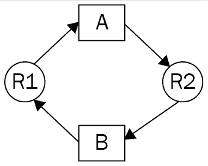
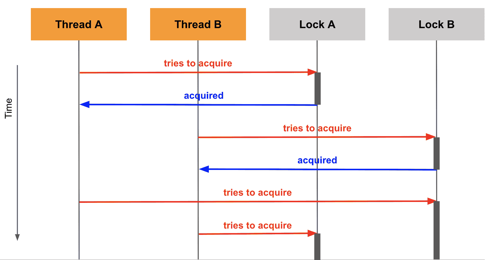

# 僵局

死锁是最常见的并发问题之一，将是我们在本书中分析的第一个问题。在本章中，我们将讨论并发编程中死锁的理论原因。我们将讨论并发中的一个经典同步问题，称为就餐哲学家问题，作为死锁的一个实际例子。我们还将演示 Python 中死锁的实际实现。我们将讨论解决这个问题的几种方法。本章还将介绍 livelock 的概念，它与死锁相关，是并发编程中相对常见的问题。

本章将介绍以下主题：

*   死锁背后的思想，以及如何在 Python 中模拟死锁
*   常见的死锁解决方案，以及如何在 Python 中实现它们
*   livelock 的概念及其与死锁的关系

# 技术要求

以下是本章的先决条件列表：

*   确保计算机上安装了 Python 3
*   在**[下载 GitHub 存储库 https://github.com/PacktPublishing/Mastering-Concurrency-in-Python](https://github.com/PacktPublishing/Mastering-Concurrency-in-Python)**
*   在本章中，我们将使用名为**`Chapter12`**的子文件夹
*   查看以下视频以查看代码的运行：[http://bit.ly/2r2WKaU](http://bit.ly/2r2WKaU)

# 僵局的概念

在计算机科学领域，死锁是指并发编程中的一种特殊情况，在这种情况下，无法取得任何进展，程序被锁定在当前状态。在大多数情况下，这种现象是由于不同锁对象之间缺乏协调或处理不当造成的（用于线程同步目的）。在这一部分中，我们将讨论一个通常被称为哲学家进餐问题的思维实验，以说明僵局的概念及其原因；从这里，您将学习如何在 Python 并发程序中模拟问题。

# 哲学家进餐问题

Edgar Dijkstra 于 1965 年首次提出了哲学家进餐问题（正如您在**[第 1 章](01.html)***中了解到的，*并发和并行编程高级入门*是并发编程的领先先驱）。这个问题最初是用不同的技术术语（计算机系统中的资源争用）来证明的，后来由英国计算机科学家、快速排序算法发明者托尼·霍尔（Tony Hoare）重新表述。问题陈述如下。*

五位哲学家围坐在一张桌子旁，每人面前都有一碗食物。在这五碗食物之间放着五把叉子，所以每个哲学家的左边有一把叉子，右边有一把叉子。下图显示了此设置：


An illustration of the Dining Philosophers problem

每一位沉默的哲学家都要在思考和饮食之间交替。每个哲学家都必须有两个叉子在身边，以便能够从各自的碗中取出食物，而且两个或两个以上不同的哲学家不能共用叉子。当哲学家吃完一定量的食物后，他们要把两个叉子放回各自的原始位置。在这一点上，哲学家周围的哲学家将能够使用这些叉子。

由于哲学家们沉默，不能相互交流，他们没有办法让对方知道他们需要叉子吃饭。换言之，哲学家吃饭的唯一方法是让两个叉子都可以使用。这个问题的问题是为哲学家设计一套指令，让他们有效地在吃饭和思考之间切换，从而为每个哲学家提供足够的食物。

现在，解决此问题的一种潜在方法是以下一组说明：

1.  哲学家必须思考，直到他们左边的叉子可用为止。当这种情况发生时，哲学家将拿起它。
2.  哲学家必须思考，直到他们右边的叉子可用为止。当这种情况发生时，哲学家将拿起它。
3.  如果一个哲学家拿着两个叉子，他们会从面前的碗里吃一定量的食物，然后以下内容适用：
    *   然后，哲学家必须把正确的叉子放在原来的地方
    *   然后，哲学家必须把左叉子放在原来的位置
4.  该过程从第一个要点开始重复。

很清楚，这套指令如何导致无法取得进展的局面；也就是说，如果一开始，所有哲学家都开始同时执行他们的指令。由于所有的叉子在开始时都在桌子上，因此可以由附近的哲学家拾取，因此每个哲学家都能够执行第一条指令（拾取左侧的叉子）。

现在，在这一步之后，每一位哲学家都会用左手拿着一把叉子，桌上就不会有叉子了。因为没有一个哲学家手里都拿着叉子，所以他们不能继续吃自己的食物。此外，给他们的一套指令规定，只有哲学家吃了一定量的食物后，他们才能把叉子放在桌子上。这意味着，只要哲学家没有吃东西，他们就不会松开手中的叉子。

因此，由于每个哲学家的左手只拿着一把叉子，他们无法继续吃东西或放下手中的叉子。哲学家唯一能吃到食物的时候是当他们的邻座哲学家放下叉子时，这只有在他们能吃到自己的食物时才有可能；这创造了一个永远无法满足的条件循环。从本质上说，这种情况是僵局的性质，在这种僵局中，一个系统的所有要素都原地踏步，无法取得任何进展。

# 并发系统中的死锁

以哲学家就餐问题为例，让我们考虑死锁的形式概念及其相关理论。给定具有多个线程或进程的并发程序，如果一个进程（或线程）正在等待另一个进程持有和使用的资源，而另一个进程又在等待另一个进程持有和使用的资源，则执行流将进入死锁状态。换句话说，进程在等待资源时不能继续执行其执行指令，而资源只能在执行完成后释放；因此，这些进程无法更改其执行状态。

死锁也由并发程序同时需要具备的条件定义，以使死锁发生。这些条件最初是由计算机科学家小爱德华·G·科夫曼提出的，因此被称为科夫曼条件。这些条件如下：

*   至少有一个资源必须处于不可共享状态。这意味着该资源由单个进程（或线程）持有，其他进程无法访问该资源；在任何给定时间，资源只能由单个进程（或线程）访问和持有。这种情况也称为互斥。
*   存在一个进程（或线程），该进程（或线程）同时访问一个资源并等待其他进程（或线程）持有的另一个资源。换句话说，该进程（或线程）需要访问两个资源才能执行其指令，其中一个指令已经被它持有，另一个指令正在等待来自其他进程（或线程）的指令。这种情况称为保持等待。
*   资源只能由持有资源的进程（或线程）释放，前提是该进程（或线程）有特定的指令可以这样做。也就是说，除非进程（或线程）主动释放资源，否则该资源将保持不可共享状态。这是无先占权条件。
*   最后一个条件称为循环等待。如名称所示，此条件指定存在一组进程（或线程），使得集合中的第一个进程（或线程）处于等待状态，等待第二个进程（或线程）释放资源，而第二个进程（或线程）需要等待第三个进程（或线程）；最后，集合中的最后一个进程（或线程）正在等待第一个进程。

让我们快速看一下死锁的一个基本示例。考虑一个并发程序，其中有两个不同的进程（进程 To0 T0，一个 To1 T1 和过程 Po2 T2 B B To.T3），以及两个不同的资源（资源 To4 Tr.R1 Ont5）和资源 T6 Tr2 Road T7 T.），如下：



Sample deadlock diagram

这两种资源都不能跨单独的进程共享，每个进程都需要访问这两种资源才能执行其指令。以流程**A**为例。它已经持有资源**R1**，但它还需要**R2**继续执行。然而，**R2**无法通过流程**A**获取，因为它被流程**B**持有。因此，过程**A**无法继续。流程**B**也是如此，它持有**R2**并且需要**R1**才能继续。**R1**依次由流程**A**持有。

# Python 模拟

在本节中，我们将在实际的 Python 程序中实现上述情况。具体来说，我们将有两个锁（我们将它们称为锁 A 和锁 B），以及两个单独的线程与锁交互（线程 A 和线程 B）。在我们的程序中，我们将设置这样一种情况：线程 a 已经获取了锁 a，正在等待获取线程 B 已经获取的锁 B，而线程 B 又在等待释放锁 a。

如果您已经从 GITHUB 页面下载了这本书的代码，请继续导航到胡特尔 T0 文件夹。

```py
# Chapter12/example1.py

import threading
import time

def thread_a():
    print('Thread A is starting...')

    print('Thread A waiting to acquire lock A.')
    lock_a.acquire()
    print('Thread A has acquired lock A, performing some calculation...')
    time.sleep(2)

    print('Thread A waiting to acquire lock B.')
    lock_b.acquire()
    print('Thread A has acquired lock B, performing some calculation...')
    time.sleep(2)

    print('Thread A releasing both locks.')
    lock_a.release()
    lock_b.release()

def thread_b():
    print('Thread B is starting...')

    print('Thread B waiting to acquire lock B.')
    lock_b.acquire()
    print('Thread B has acquired lock B, performing some calculation...')
    time.sleep(5)

    print('Thread B waiting to acquire lock A.')
    lock_a.acquire()
    print('Thread B has acquired lock A, performing some calculation...')
    time.sleep(5)

    print('Thread B releasing both locks.')
    lock_b.release()
    lock_a.release()

lock_a = threading.Lock()
lock_b = threading.Lock()

thread1 = threading.Thread(target=thread_a)
thread2 = threading.Thread(target=thread_b)

thread1.start()
thread2.start()

thread1.join()
thread2.join()

print('Finished.')
```

在此脚本中，`thread_a()`和`thread_b()`函数分别指定线程 A 和线程 B。在我们的主程序中，我们还有两个`threading.Lock`对象：锁 A 和锁 B。线程指令的一般结构如下：

1.  开线
2.  尝试获取与线程同名的锁（线程 A 将尝试获取锁 A，线程 B 将尝试获取锁 B）
3.  进行一些计算
4.  尝试获取另一个锁（线程 A 将尝试获取锁 B，线程 B 将尝试获取锁 A）
5.  执行其他一些计算
6.  释放两个锁
7.  断线

请注意，我们正在使用`time.sleep()`函数模拟正在处理的某些计算的操作。

首先，我们在主程序中几乎同时启动线程 A 和线程 B。考虑到线程指令的结构，我们可以看到此时，两个线程都将被启动；线程 A 将尝试获取锁 A，并将成功获取，因为此时锁 A 仍然可用。线程 B 和锁 B 也是如此。这两个线程将继续自己执行一些计算。

让我们考虑我们的程序的当前状态：锁 A 已经被线程 A 获取，并且锁 B 已经被线程 B 获取。在它们各自的计算过程完成之后，线程 A 将尝试获取锁 B。线程 B 将尝试获取锁 A。我们可以很容易地看到，这是死锁情况的开始：因为锁 B 已经被线程 B 持有，线程 A 无法获取，因此线程 B 也无法获取锁 A。

现在两个线程都将无限等待，以获取各自的第二个锁。但是，释放锁的唯一方法是线程继续执行其执行指令，并在最后释放它拥有的所有锁。因此，我们的程序将在此时被困在执行中，不会取得进一步的进展。

下图进一步说明了死锁如何按顺序展开的过程：



Deadlock sequence diagram

现在，让我们看看我们在实际操作中创建的死锁。运行脚本，应获得以下输出：

```py
> python example1.py
Thread A is starting...
Thread A waiting to acquire lock A.
Thread B is starting...
Thread A has acquired lock A, performing some calculation...
Thread B waiting to acquire lock B.
Thread B has acquired lock B, performing some calculation...
Thread A waiting to acquire lock B.
Thread B waiting to acquire lock A.
```

正如我们所讨论的，由于每个线程都试图获取另一个线程当前持有的锁，因此释放锁的唯一方法是让线程继续执行。这是一个死锁，您的程序将无限挂起，永远不会到达程序最后一行的最后一条 print 语句。

# 僵局情况的处理方法

正如我们所看到的，死锁会导致并发程序无限挂起，这在任何方面都是不可取的。在本节中，我们将讨论防止死锁发生的潜在方法。直观地说，每种方法都希望从我们的程序中消除四种 Coffman 条件中的一种，以防止死锁。

# 实施资源排名

从哲学家进餐问题和 Python 示例中，我们可以看到四个 Coffman 条件中的最后一个条件，循环等待，是死锁问题的核心。它指定并发程序中的不同进程（或线程）以循环方式等待其他进程（或线程）持有的资源。仔细看一下，我们可以看到这种情况的根本原因是进程（或线程）访问资源的顺序（或缺少顺序）。

在哲学家进餐问题中，每个哲学家都被指示先拿起左边的叉子，而在我们的 Python 示例中，线程总是在执行任何计算之前尝试获取具有相同名称的锁。正如你所看到的，当哲学家们想同时开始吃饭时，他们会拿起各自的左叉子，陷入无限的等待中；类似地，当两个线程同时开始执行时，它们将获取各自的锁，并且再次无限期地等待其他锁。

我们可以由此推断，如果进程（或线程）不是随意访问资源，而是以预定的静态顺序访问资源，那么它们获取和等待资源的方式的循环性质将被消除。因此，对于我们的双锁 Python 示例，我们将要求两个线程以相同的顺序尝试获取锁，而不是让线程 A 尝试获取锁 A，线程 B 尝试获取锁 B。例如，两个线程现在将首先尝试获取锁 A，执行一些计算，尝试获取锁 B，执行进一步的计算，最后释放两个线程。

此更改在`Chapter12/example2.py`文件中实现，如下所示：

```py
# Chapter12/example2.py

import threading
import time

def thread_a():
    print('Thread A is starting...')

    print('Thread A waiting to acquire lock A.')
    lock_a.acquire()
    print('Thread A has acquired lock A, performing some calculation...')
    time.sleep(2)

    print('Thread A waiting to acquire lock B.')
    lock_b.acquire()
    print('Thread A has acquired lock B, performing some calculation...')
    time.sleep(2)

    print('Thread A releasing both locks.')
    lock_a.release()
    lock_b.release()

def thread_b():
    print('Thread B is starting...')

    print('Thread B waiting to acquire lock A.')
    lock_a.acquire()
    print('Thread B has acquired lock A, performing some calculation...')
    time.sleep(5)

    print('Thread B waiting to acquire lock B.')
    lock_b.acquire()
    print('Thread B has acquired lock B, performing some calculation...')
    time.sleep(5)

    print('Thread B releasing both locks.')
    lock_b.release()
    lock_a.release()

lock_a = threading.Lock()
lock_b = threading.Lock()

thread1 = threading.Thread(target=thread_a)
thread2 = threading.Thread(target=thread_b)

thread1.start()
thread2.start()

thread1.join()
thread2.join()

print('Finished.')
```

此版本的脚本现在可以完成其执行，并应产生以下输出：

```py
> python3 example2.py
Thread A is starting...
Thread A waiting to acquire lock A.
Thread A has acquired lock A, performing some calculation...
Thread B is starting...
Thread B waiting to acquire lock A.
Thread A waiting to acquire lock B.
Thread A has acquired lock B, performing some calculation...
Thread A releasing both locks.
Thread B has acquired lock A, performing some calculation...
Thread B waiting to acquire lock B.
Thread B has acquired lock B, performing some calculation...
Thread B releasing both locks.
Finished.
```

在我们的双锁示例中，这种方法有效地消除了死锁问题，但它对问题的支持程度如何？为了回答这个问题，让我们自己用 Python 模拟这个问题和解决方案。`Chapter12/example3.py`文件包含 Python 中哲学家就餐问题的实现，如下所示：

```py
# Chapter12/example3.py

import threading

# The philosopher thread
def philosopher(left, right):
    while True:
        with left:
             with right:
                 print(f'Philosopher at {threading.currentThread()} 
                       is eating.')

# The chopsticks
N_FORKS = 5
forks = [threading.Lock() for n in range(N_FORKS)]

# Create all of the philosophers
phils = [threading.Thread(
    target=philosopher,
    args=(forks[n], forks[(n + 1) % N_FORKS])
) for n in range(N_FORKS)]

# Run all of the philosophers
for p in phils:
    p.start()
```

这里，我们有`philospher()`函数作为独立线程的底层逻辑。它接收两个`Threading.Lock`对象，并使用两个上下文管理器模拟前面讨论的进食过程。在我们的主程序中，我们创建了一个包含五个锁对象的列表，名为`forks`，以及一个包含五个线程的列表，名为`phils`，其规格为第一个线程将接收第一个和第二个锁，第二个线程将接收第二个和第三个锁，依此类推；第五个线程将按顺序接收第五个和第一个锁。最后，我们同时启动所有五个线程。

运行脚本，可以很容易地看到死锁几乎立即发生。以下是我的输出，直到程序无限挂起：

```py
> python3 example3.py
Philosopher at <Thread(Thread-1, started 123145445048320)> is eating.
Philosopher at <Thread(Thread-1, started 123145445048320)> is eating.
Philosopher at <Thread(Thread-1, started 123145445048320)> is eating.
Philosopher at <Thread(Thread-1, started 123145445048320)> is eating.
Philosopher at <Thread(Thread-1, started 123145445048320)> is eating.
Philosopher at <Thread(Thread-1, started 123145445048320)> is eating.
Philosopher at <Thread(Thread-3, started 123145455558656)> is eating.
Philosopher at <Thread(Thread-1, started 123145445048320)> is eating.
Philosopher at <Thread(Thread-3, started 123145455558656)> is eating.
Philosopher at <Thread(Thread-3, started 123145455558656)> is eating.
Philosopher at <Thread(Thread-3, started 123145455558656)> is eating.
Philosopher at <Thread(Thread-3, started 123145455558656)> is eating.
Philosopher at <Thread(Thread-5, started 123145466068992)> is eating.
Philosopher at <Thread(Thread-3, started 123145455558656)> is eating.
Philosopher at <Thread(Thread-3, started 123145455558656)> is eating.
```

随之而来的问题是：我们如何实现在`philosopher()`函数中获取锁的顺序？我们将使用 Python 中内置的`id()`函数，该函数返回参数的唯一、常量标识，作为对锁对象进行排序的键。我们还将实现一个定制的上下文管理器，以便在一个单独的类中考虑这个排序逻辑。导航到`Chapter12/example4.py`以了解此具体实现，如下所示：

```py
# Chapter12/example4.py

class acquire(object):
    def __init__(self, *locks):
        self.locks = sorted(locks, key=lambda x: id(x))

    def __enter__(self):
        for lock in self.locks:
            lock.acquire()

    def __exit__(self, ty, val, tb):
        for lock in reversed(self.locks):
            lock.release()
        return False

# The philosopher thread
def philosopher(left, right):
    while True:
        with acquire(left,right):
             print(f'Philosopher at {threading.currentThread()} 
                   is eating.')
```

在主程序保持不变的情况下，此脚本将生成一个输出，表明此排序解决方案可以有效地解决问题。

然而，这种方法在应用于某些特定情况时存在问题。记住并发的高级概念，我们知道将并发应用于程序时的主要目标之一是提高速度。让我们回到我们的双锁示例，检查执行资源排序的程序的执行时间。看一看`Chapter12/example5.py`文件；它只是一个实现了分级（或有序）锁定的双锁程序，并添加了一个计时器来跟踪两个线程完成执行所需的时间。

运行脚本后，您的输出应类似于以下内容：

```py
> python3 example5.py
Thread A is starting...
Thread A waiting to acquire lock A.
Thread B is starting...
Thread A has acquired lock A, performing some calculation...
Thread B waiting to acquire lock A.
Thread A waiting to acquire lock B.
Thread A has acquired lock B, performing some calculation...
Thread A releasing both locks.
Thread B has acquired lock A, performing some calculation...
Thread B waiting to acquire lock B.
Thread B has acquired lock B, performing some calculation...
Thread B releasing both locks.
Took 14.01 seconds.
Finished.
```

您可以看到，两个线程的联合执行大约花费了 14 秒。然而，如果我们仔细观察两个线程中的具体指令，我们可以看到，除了与锁交互之外，线程 a 大约需要 4 秒来进行计算（由两个`time.sleep(2)`命令模拟），而线程 B 大约需要 10 秒（两个`time.sleep(5)`命令）。

这是否意味着我们的程序所用的时间与我们按顺序执行两个线程所用的时间一样长？我们将用我们的`Chapter12/example6.py`文件来测试这一理论，在该文件中，我们指定每个线程在主程序中一次执行一条指令：

```py
# Chapter12/example6.py

lock_a = threading.Lock()
lock_b = threading.Lock()

thread1 = threading.Thread(target=thread_a)
thread2 = threading.Thread(target=thread_b)

start = timer()

thread1.start()
thread1.join()

thread2.start()
thread2.join()

print('Took %.2f seconds.' % (timer() - start))
print('Finished.')
```

运行此脚本，您将看到我们的双锁程序的顺序版本将花费与其并发对应程序相同的时间：

```py
> python3 example6.py
Thread A is starting...
Thread A waiting to acquire lock A.
Thread A has acquired lock A, performing some calculation...
Thread A waiting to acquire lock B.
Thread A has acquired lock B, performing some calculation...
Thread A releasing both locks.
Thread B is starting...
Thread B waiting to acquire lock A.
Thread B has acquired lock A, performing some calculation...
Thread B waiting to acquire lock B.
Thread B has acquired lock B, performing some calculation...
Thread B releasing both locks.
Took 14.01 seconds.
Finished.
```

这个有趣的现象是我们对程序中的锁提出了大量要求的直接结果。换句话说，由于每个线程必须获取两个锁才能完成其执行，因此在任何给定时间，每个锁都不能由多个线程获取，最后，锁需要以特定顺序获取，并且单个线程的执行不能同时发生。如果我们返回并检查由`Chapter12/example5.py`文件生成的输出，很明显，在线程 A 在其执行结束时释放了两个锁之后，线程 B 无法开始其计算。

因此，非常直观的结论是，如果您对并发程序的资源设置了足够的锁，那么它的执行将完全按顺序进行，再加上并发编程功能的开销，它的速度甚至比程序的纯顺序版本还要差。但是，我们在哲学家进餐问题（用 Python 模拟）中没有看到锁所创建的顺序性。这是因为在双线程问题中，两个锁足以将程序执行顺序化，而五个锁不足以对问题执行相同的操作。

我们将在[第 14 章](14.html)*竞赛条件*中探讨这一现象的另一个实例。

# 忽略锁和共享资源

锁无疑是同步任务和一般并发编程中的一个重要工具。但是，如果锁的使用导致了不希望出现的情况，例如死锁，那么我们很自然地会探索在并发程序中不使用锁的选项。通过忽略锁，我们的程序的资源可以在并发程序中的不同进程/线程之间有效地共享，从而消除了四个 Coffman 条件中的第一个：互斥。

这种解决死锁问题的方法可以直接实现；让我们试试前面的两个例子。在双锁示例中，我们只需删除指定与线程函数内和主程序中的锁对象的任何交互的代码。换句话说，我们不再使用锁定机制。`Chapter12/example7.py`文件包含此方法的实现，如下所示：

```py
# Chapter12/example7.py

import threading
import time
from timeit import default_timer as timer

def thread_a():
    print('Thread A is starting...')

    print('Thread A is performing some calculation...')
    time.sleep(2)

    print('Thread A is performing some calculation...')
    time.sleep(2)

def thread_b():
    print('Thread B is starting...')

    print('Thread B is performing some calculation...')
    time.sleep(5)

    print('Thread B is performing some calculation...')
    time.sleep(5)

thread1 = threading.Thread(target=thread_a)
thread2 = threading.Thread(target=thread_b)

start = timer()

thread1.start()
thread2.start()

thread1.join()
thread2.join()

print('Took %.2f seconds.' % (timer() - start))

print('Finished.')
```

运行脚本，您的输出应类似于以下内容：

```py
> python3 example7.py
Thread A is starting...
Thread A is performing some calculation...
Thread B is starting...
Thread B is performing some calculation...
Thread A is performing some calculation...
Thread B is performing some calculation...
Took 10.00 seconds.
Finished.
```

很明显，由于我们没有使用锁来限制对任何计算进程的访问，因此两个线程的执行现在已经完全独立，因此线程完全并行运行。出于这个原因，我们还获得了更好的速度：由于线程并行运行，整个程序花费的总时间与两个线程的较长任务花费的时间相同（换句话说，线程 B，10 秒）。

那吃饭的问题呢？似乎我们也可以得出结论，没有锁（叉子），问题很容易解决。由于资源（食物）对每个哲学家来说都是独一无二的（换句话说，任何哲学家都不应该吃另一个哲学家的食物），因此每个哲学家都可以在不担心其他哲学家的情况下继续执行自己的任务。通过忽略锁，每个锁都可以并行执行，类似于我们在双锁示例中看到的。

然而，这样做意味着我们完全误解了这个问题。我们知道锁的使用是为了使进程和线程能够以系统、协调的方式访问程序中的共享资源，以避免错误处理数据。因此，删除并发程序中的任何锁定机制意味着现在不受访问限制的共享资源以不协调的方式被操纵（因此被破坏）的可能性显著增加。

因此，通过忽略锁，我们很可能需要完全重新设计和重构并发程序。如果仍然需要以有组织的方式访问和操作共享资源，则需要实现其他同步方法。我们的进程和线程的逻辑可能需要改变，以便与这种新的同步方法进行适当的交互，执行时间可能会受到程序结构变化的负面影响，并且还可能出现其他潜在的同步问题。

# 关于锁的附加说明

虽然在我们的程序中取消锁定机制以消除死锁的方法可能会引起一些问题和担忧，但它确实为我们揭示了 Python 中关于锁对象的一个新观点：并发程序的一个元素在访问给定资源时可能完全绕过锁。换句话说，如果不同的进程/线程实际获取了锁对象，那么锁对象只会阻止这些进程/线程访问和操作共享资源。

那么，锁实际上并不锁定任何东西。它们只是有助于指示在给定时间是否应访问资源的标志；如果一个指示错误，甚至恶意的进程/线程试图在不检查锁对象是否存在的情况下访问该资源，那么它很可能能够毫不费力地访问该资源。换句话说，锁根本没有连接到它们应该锁定的资源，并且它们肯定不会阻止进程/线程访问这些资源。

因此，锁的简单使用对于设计和实现安全、动态、并发的数据结构是低效的。为了实现这一点，我们需要在锁和它们相应的资源之间添加更具体的链接，或者完全使用不同的同步工具（例如，原子消息队列）。

# 关于解决僵局的结论性说明

您已经看到了解决死锁问题的两种最常见的方法。每种方法都解决了四种 Coffman 条件中的一种，虽然在我们的示例中这两种方法（在某种程度上）都成功地防止了死锁的发生，但每种方法都提出了不同的、额外的问题和担忧。因此，真正理解并发程序的本质是很重要的，以便知道这两个程序中哪一个是适用的，如果它们中的任何一个是适用的。

也有可能一些程序，通过死锁，被透露给我们不适合并发；有些程序最好是按顺序运行，而强制并发会使情况变得更糟。正如我们所讨论的，虽然并发在我们的应用程序的许多领域中提供了显著的改进，但有些领域本质上不适合并发编程的应用。在死锁的情况下，开发人员应该准备考虑不同的方法来设计并发程序，并且当一个并发方法不工作时，不应该不愿意实现另一种方法。

# 活锁的概念

livelock 的概念与死锁相关；有些人甚至认为它是死锁的替代版本。在活锁情况下，并发程序中的进程（或线程）能够切换它们的状态；事实上，它们不断地切换状态。然而，它们只是无限地来回切换，没有取得任何进展。现在我们将考虑活锁的实际场景。

假设一对配偶在一张桌子旁一起吃饭。他们只有一把叉子可以互相分享，所以在任何一点上，他们中只有一个人可以吃东西。此外，夫妻双方都对对方很有礼貌，所以即使一方饿了，想吃东西，如果另一方也饿了，他们也会把叉子放在桌子上。这个规范是为这个问题创建一个活锁的核心：当配偶双方都饿了的时候，每个人都会等待对方先吃饭，从而创建一个无限循环，在这个循环中，每个配偶在想要吃饭和等待另一个配偶吃饭之间切换。

让我们用 Python 模拟这个问题。导航至`Chapter12/example8.py`并查看`Spouse`类：

```py
# Chapter12/example8.py

class Spouse(threading.Thread):

    def __init__(self, name, partner):
        threading.Thread.__init__(self)
        self.name = name
        self.partner = partner
        self.hungry = True

    def run(self):
        while self.hungry:
            print('%s is hungry and wants to eat.' % self.name)

            if self.partner.hungry:
                print('%s is waiting for their partner to eat first...' 
                      % self.name)
            else:
                with fork:
                    print('%s has stared eating.' % self.name)
                    time.sleep(5)

                    print('%s is now full.' % self.name)
                    self.hungry = False
```

这个类继承自`threading.Thread`类并实现了我们前面讨论的逻辑。它为`Spouse`实例取一个名称，另一个`Spouse`对象作为它的伙伴；初始化时，`Spouse`对象也总是饥饿的（`hungry`属性总是设置为`True`。类中的`run()`函数指定线程启动时的逻辑：只要`Spouse`对象的`hungry`属性设置为`True`，对象就会尝试使用锁定对象 fork 吃饭。但是，它总是检查其合作伙伴是否也将其`hungry`属性设置为`True`，在这种情况下，它将不会继续获取锁，而是等待其合作伙伴执行该操作。

在我们的主程序中，我们首先创建 fork 作为锁对象；然后，我们创建两个`Spouse`线程对象，它们是彼此的`partner`属性。最后，我们启动两个线程，并运行程序，直到两个线程都完成执行：

```py
# Chapter12/example8.py

fork = threading.Lock()

partner1 = Spouse('Wife', None)
partner2 = Spouse('Husband', partner1)
partner1.partner = partner2

partner1.start()
partner2.start()

partner1.join()
partner2.join()

print('Finished.')
```

运行脚本，您将看到，正如我们所讨论的，每个线程将进入一个无限循环，在想吃东西和等待它的伙伴吃东西之间切换；程序将永远运行，直到 Python 被中断。以下代码显示了我获得的输出的前几行：

```py
> python3 example8.py
Wife is hungry and wants to eat.
Wife is waiting for their partner to eat first...
Husband is hungry and wants to eat.
Wife is hungry and wants to eat.
Husband is waiting for their partner to eat first...
Wife is waiting for their partner to eat first...
Husband is hungry and wants to eat.
Wife is hungry and wants to eat.
Husband is waiting for their partner to eat first...
Wife is waiting for their partner to eat first...
Husband is hungry and wants to eat.
Wife is hungry and wants to eat.
Husband is waiting for their partner to eat first...
...
```

# 总结

在计算机科学领域中，死锁是指并发编程中的一种特殊情况，在这种情况下，没有任何进展，程序被锁定在当前状态。在大多数情况下，这种现象是由于不同锁对象之间缺乏协调或处理不当造成的，可以用问题来说明。

防止死锁发生的潜在方法包括对锁对象施加命令和通过忽略锁对象共享不可共享的资源。每个解决方案都解决了四种 Coffman 条件中的一种，虽然两种解决方案都可以成功地防止死锁，但每种解决方案都会引发不同的额外问题和担忧。

与死锁概念相关的是 livelock。在 livelock 情况下，并发程序中的进程（或线程）可以切换它们的状态，但它们只是无限地来回切换，没有任何进展。在下一章中，我们将讨论并发编程中的另一个常见问题：饥饿。

# 问题

*   什么会导致僵局，为什么会不受欢迎？
*   哲学家进餐问题与僵局问题有何关联？
*   科夫曼的四个条件是什么？
*   资源排名如何解决死锁问题？在实施时，还会出现哪些其他问题？
*   忽略锁如何解决死锁问题？在实施时，还会出现哪些其他问题？
*   livelock 与死锁有什么关系？

# 进一步阅读

有关更多信息，请参阅以下链接：

*   *Python 并行编程*，作者：帕拉奇，派克特出版有限公司，2014 年
*   *Python 并行编程食谱*，作者：Giancarlo Zaccone，Packt 出版有限公司，2015 年
*   *Python 线程死锁避免*（[dabeaz.blogspot.com/2009/11/Python-Thread-Deadlock-avoidation20](http://dabeaz.blogspot.com/2009/11/python-thread-deadlock-avoidance_20.html)）