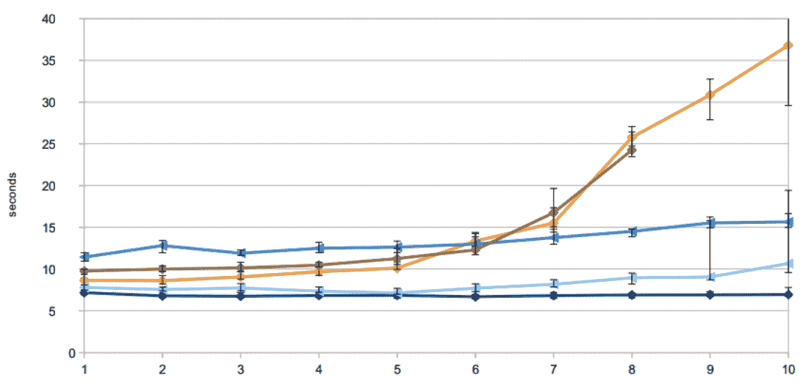
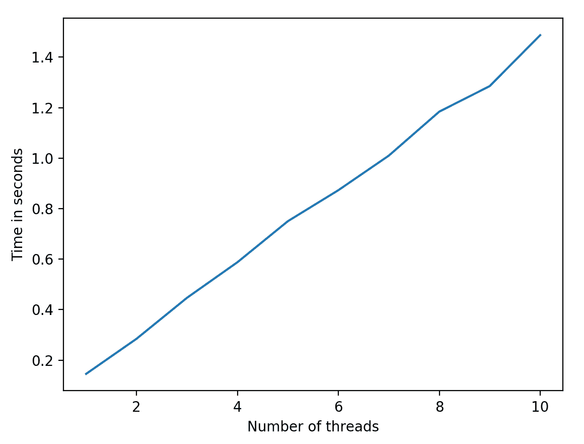
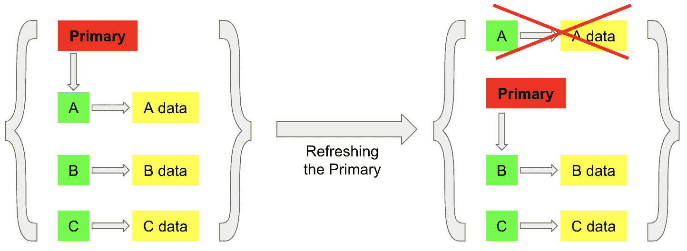

# 十六、设计基于锁和无互斥的并发数据结构

在本章中，我们将分析并发编程中设计和实现两种常见类型的数据结构的详细过程：基于锁和无互斥。将讨论这两种数据结构之间的主要区别，以及它们在并发编程中的各自用法。本章还对并发程序的准确性和速度之间的权衡进行了分析。通过这种分析，读者将能够对自己的并发应用应用相同的权衡分析。

本章将介绍以下主题：

*   基于锁的数据结构的常见问题，以及如何解决这些问题
*   详细分析了如何实现基于锁的数据结构
*   与基于锁的数据结构相比，无互斥数据结构背后的思想及其优缺点
*   详细分析了如何实现无互斥锁的数据结构

# 技术要求

以下是本章的先决条件列表：

*   确保计算机上安装了 Python 3
*   在[下载 GitHub 存储库 https://github.com/PacktPublishing/Mastering-Concurrency-in-Python](https://github.com/PacktPublishing/Mastering-Concurrency-in-Python)
*   在本章中，我们将使用名为`Chapter16`的子文件夹
*   查看以下视频以查看代码的运行：[http://bit.ly/2QhT3MS](http://bit.ly/2QhT3MS)

# Python 中基于锁的并发数据结构

在前面介绍锁的使用的章节中，您了解到锁不会锁定任何东西；在数据结构上实现的非实质性锁定机制实际上并不会通过简单地绕过所施加的锁定来阻止外部程序同时访问数据结构。这个问题的一个解决方案是将锁嵌入到数据结构中，这样外部实体就不可能忽略锁。

在本章的第一节中，我们将考虑前面特定使用锁和基于锁的数据结构背后的理论。具体来说，我们将分析使用锁（或互斥锁）作为同步机制，设计可由不同线程安全执行的并发计数器的过程。

# 洛克斯中心和竞争条件

首先，让我们模拟一下并发程序中计数器类的朴素、无锁实现遇到的问题。如果您已经从 GitHub 页面下载了本书的代码，请继续并导航到`Chapter16`文件夹。

让我们看一看`Chapter16/example1.py`文件，具体来说就是`LocklessCounter`类的实现：

```py
# Chapter16/example1.py

import time

class LocklessCounter:
    def __init__(self):
        self.value = 0

    def increment(self, x):
        new_value = self.value + x
        time.sleep(0.001) # creating a delay
        self.value = new_value

    def get_value(self):
        return self.value
```

这是一个简单的计数器，它有一个名为`value`的属性，该属性包含计数器的当前值，在计数器实例首次初始化时分配有`0`。类的`increment()`方法接受一个参数`x`，并将调用的`LocklessCounter`对象的当前值增加`x`。请注意，我们在`increment()`函数中创建了一个小延迟，介于计算计数器新值的过程和将新值分配给计数器对象的过程之间。该类还有一个名为`get_value()`的方法，该方法返回调用计数器的当前值。

很明显，为什么在一个并发程序中，Type T0R 类的实现可以创建一个竞争条件：当一个线程在增加一个共享计数器的中间时，另一个线程也可以访问计数器来执行 Oracle T1 方法。第一个线程对计数器值所做的更改可能会被第二个线程所做的更改覆盖。

作为复习，下图显示了在多个进程或线程同时访问和更改共享资源的情况下，竞争条件是如何发生的：


Diagram of a race condition

为了模拟这种竞争条件，在我们的主程序中，我们总共包括三个线程，以将共享计数器增加 300 倍：

```py
# Chapter16/example1.py

from concurrent.futures import ThreadPoolExecutor

counter = LocklessCounter()
with ThreadPoolExecutor(max_workers=3) as executor:
    executor.map(counter.increment, [1 for i in range(300)])

print(f'Final counter: {counter.get_value()}.')
print('Finished.')
```

`concurrent.futures`模块为我们提供了一种通过线程池安排任务的简单而高级的方法。具体地说，在初始化共享计数器对象之后，我们将变量`executor`声明为三个线程的池（使用上下文管理器），执行器对共享计数器调用`increment()`方法 300 次，每次将计数器的值增加`1`。

这些任务将使用`ThreadPoolExecutor`类的`map()`方法在池中的三个线程之间执行。在程序结束时，我们只需打印出计数器对象的最终值。以下代码显示了运行脚本后我自己的输出：

```py
> python3 example1.py
Final counter: 101.
Finished.
```

虽然在您自己的系统上执行脚本时可以获得不同的计数器值，但计数器的最终值实际上不太可能是 300，这是正确的值。此外，如果反复运行脚本，则可能会获得计数器的不同值，从而说明程序的不确定性。同样，由于一些线程覆盖了其他线程所做的更改，一些增量在执行过程中丢失，因此在本例中，计数器只成功地增加了`101`次。

# 在计数器的数据结构中嵌入锁

良好的基于锁的并发数据结构的目标是在其类属性和方法中内部实现其锁，以便外部函数和程序不能绕过这些锁并同时访问共享的并发对象。对于我们的计数器数据结构，我们将为类添加一个附加属性，该属性将保存与计数器值对应的`lock`对象。考虑下面的新的数据结构在 DOLL T1 文件中的实现：

```py
# Chapter16/example2.py

import threading
import time

class LockedCounter:
    def __init__(self):
        self.value = 0
        self.lock = threading.Lock()

    def increment(self, x):
        with self.lock:
            new_value = self.value + x
            time.sleep(0.001) # creating a delay
            self.value = new_value

    def get_value(self):
        with self.lock:
            value = self.value

        return value
```

在我们计数器数据结构的这个实现中，`lock`对象也被初始化为`LockedCounter`实例的属性，当该实例被初始化时。此外，每当线程访问计数器的值时，无论是为了读取（`get_value()`方法）还是为了更新（`increment()`方法），都必须获取该`lock`属性，以确保没有其他线程也在访问它。这是通过使用具有`lock`属性的上下文管理器来完成的。

从理论上讲，这一实现应该为我们解决竞争条件的问题。在主程序中，我们实现的线程池与前一个示例中使用的线程池相同。将创建一个共享计数器，并跨三个不同的线程将其递增 300 倍（每次递增一个单位）：

```py
# Chapter16/example2.py

from concurrent.futures import ThreadPoolExecutor

counter = LockedCounter()
with ThreadPoolExecutor(max_workers=3) as executor:
    executor.map(counter.increment, [1 for i in range(300)])

print(f'Final counter: {counter.get_value()}.')
print('Finished.')
```

运行脚本，程序生成的输出应类似于以下内容：

```py
> python3 example2.py
Final counter: 300.
Finished.
```

如您所见，竞争条件的问题已成功解决：计数器的最终值为`300`，这与执行的增量数量完全对应。此外，无论程序再次运行多少次，计数器的值始终保持`300`。我们目前拥有的是一个适用于并发计数器的有效、正确的数据结构。

# 可伸缩性的概念

编程的一个方面对并发应用至关重要，即**可伸缩性**。所谓可伸缩性，是指当程序要处理的任务数量增加时，性能的变化。软件性能和可伸缩性咨询有限责任公司创始人兼总裁安德烈·邦迪（Andre B.Bondi）将术语可伸缩性定义为<q>*“一个系统、网络或流程处理不断增长的工作量的能力，或其扩大以适应这种增长的潜力。”*</q>

在并发编程中，可伸缩性是一个必须考虑的重要概念；并发编程中增加的工作量通常是要执行的任务数量，以及执行这些任务的进程和线程的数量。例如，并发应用的设计、实现和测试阶段通常涉及相当小的工作量，以促进高效快速的开发。这意味着一个典型的并发应用在现实生活中处理的工作要比在开发阶段多得多。这就是为什么在设计良好的并发应用中，可伸缩性分析是至关重要的。

由于一个进程或线程的执行独立于另一个进程或线程的执行，只要单个进程/线程负责的工作量保持不变，我们希望进程/线程数量的变化不会影响通用程序的性能。这种特性称为**完美可扩展性**，是并发程序的理想特性；如果给定的完全可伸缩并发程序的工作量增加，该程序可以简单地创建更多的活动进程或线程，以吸收增加的工作量。这样，它的性能就可以保持稳定。

然而，由于创建线程和进程的开销，几乎不可能在大多数情况下实现完美的可伸缩性。也就是说，如果并发程序的性能不会随着活动进程或线程数量的增加而显著恶化，那么我们可以接受可伸缩性。术语**显著恶化**在很大程度上取决于并发程序负责执行的任务类型，以及允许程序性能下降的程度。

在这种分析中，我们将考虑一个二维图，表示给定并发程序的可伸缩性。*x*轴表示活动线程或进程的数量（同样，每个线程或进程负责在整个程序中执行固定数量的工作）；*y*轴表示程序的速度，具有不同数量的活动线程或进程。正在考虑的图表将有一个普遍增加的趋势；程序拥有的进程/线程越多，程序执行（很可能）所需的时间就越长。另一方面，完美的可伸缩性将转化为水平线，因为当线程/进程数量增加时，不需要额外的时间。

下图是此类图表的示例，用于可伸缩性分析：



Example of scalability analysis (Source: stackoverflow.com/questions/10660990/c-sharp-server-scalability-issue-on-linux)

在上图中，*x*轴表示执行线程/进程的数量，*y*轴表示运行时间（本例中以秒为单位）。不同的图表显示了特定设置（与多个内核组合的操作系统）的可伸缩性。

图的斜率越陡，随着线程/进程数量的增加，相应的并发模型的伸缩性越差。例如，水平线（本例中为深蓝色和最低的图形）表示完美的可伸缩性，而黄色（最上面的）图形表示不需要的可伸缩性。

# 计数器数据结构的可扩展性分析

现在，让我们具体考虑当前的计数器数据结构的可伸缩性，随着活动线程数的变化。我们让三个线程增加一个共享计数器，总共增加了 300 倍；因此，在我们的可伸缩性分析中，我们将让每个活动线程增加一个共享计数器 100 倍，同时更改程序中活动线程的数量当线程数增加时，使用计数器数据结构的程序的类型会改变。

考虑 AUT0T0 文件，如下：

```py
# Chapter16/example3.py

import threading
from concurrent.futures import ThreadPoolExecutor
import time
import matplotlib.pyplot as plt

class LockedCounter:
    def __init__(self):
        self.value = 0
        self.lock = threading.Lock()

    def increment(self, x):
        with self.lock:
            new_value = self.value + x
            time.sleep(0.001) # creating a delay
            self.value = new_value

    def get_value(self):
        with self.lock:
            value = self.value

        return value

n_threads = []
times = []
for n_workers in range(1, 11):
    n_threads.append(n_workers)

    counter = LockedCounter()

    start = time.time()

    with ThreadPoolExecutor(max_workers=n_workers) as executor:
        executor.map(counter.increment, 
                     [1 for i in range(100 * n_workers)])

    times.append(time.time() - start)

    print(f'Number of threads: {n_workers}')
    print(f'Final counter: {counter.get_value()}.')
    print(f'Time taken: {times[-1] : .2f} seconds.')
    print('-' * 40)

plt.plot(n_threads, times)
plt.xlabel('Number of threads'); plt.ylabel('Time in seconds')
plt.show()
```

在前面的脚本中，我们仍然使用与前面示例中使用的`LockedCounter`类相同的实现。在我们的主程序中，我们针对不同数量的活动线程测试这个类；具体来说，我们正在迭代一个`for`循环，使活动线程的数量从 1 增加到 10。在每次迭代中，我们初始化一个共享计数器，并创建一个线程池来处理适当数量的任务（在这种情况下），将每个线程的共享计数器增加 100 倍。

我们还跟踪活动线程的数量，以及线程池在每次迭代中完成任务所花费的时间。这是我们用于可伸缩性分析过程的数据。我们正在打印这些数据，并绘制一个类似于我们在前面的示例图中看到的可伸缩性图。

以下代码显示了运行脚本的输出：

```py
> python3 example3.py
Number of threads: 1
Final counter: 100.
Time taken: 0.15 seconds.
----------------------------------------
Number of threads: 2
Final counter: 200.
Time taken: 0.28 seconds.
----------------------------------------
Number of threads: 3
Final counter: 300.
Time taken: 0.45 seconds.
----------------------------------------
Number of threads: 4
Final counter: 400.
Time taken: 0.59 seconds.
----------------------------------------
Number of threads: 5
Final counter: 500.
Time taken: 0.75 seconds.
----------------------------------------
Number of threads: 6
Final counter: 600.
Time taken: 0.87 seconds.
----------------------------------------
Number of threads: 7
Final counter: 700.
Time taken: 1.01 seconds.
----------------------------------------
Number of threads: 8
Final counter: 800.
Time taken: 1.18 seconds.
----------------------------------------
Number of threads: 9
Final counter: 900.
Time taken: 1.29 seconds.
----------------------------------------
Number of threads: 10
Final counter: 1000.
Time taken: 1.49 seconds.
----------------------------------------
```

此外，我获得的可伸缩性图如下所示：



Scalability of lock-based counter data structures

即使您自己的输出在每个迭代的特定持续时间内发生变化，可伸缩性趋势也应该相对相同；换句话说，您的可伸缩性图应该具有与前一个图相同的斜率。正如您从我们的输出类型中所看到的，即使每次迭代中的计数器具有正确的值，我们计数器数据结构的当前可伸缩性是非常不受欢迎的：随着更多线程添加到程序中以执行更多任务，程序的性能几乎呈线性下降。回想一下，理想的完美可伸缩性要求性能在不同数量的线程/进程之间保持稳定。我们的计数器数据结构增加了程序的执行时间，其数量与活动线程数量的增加成正比。

直观地说，这种可伸缩性限制来自我们的锁定机制：因为在任何给定时间只有一个线程可以访问和增加共享计数器，所以程序必须执行的增量越多，完成所有增量任务所需的时间就越长。使用锁作为同步机制的最大缺点是第二个：锁可以执行并发程序（同样，第一个缺点是锁实际上不锁定任何东西）。

# 近似计数器作为可伸缩性解决方案

考虑到设计和实现一个正确的、快速的、基于锁的并发数据结构的复杂性，开发高效可伸缩的锁机制是计算机科学中的一个热门研究课题，已经提出了许多解决我们所面临问题的方法。在本节中，我们将讨论其中之一：**近似计数器**。

# 近似计数器背后的想法

让我们回顾一下我们当前的程序，以及锁阻止我们在速度方面获得良好性能的原因：程序中所有活动线程都与同一个共享计数器交互，该计数器一次只能与一个线程交互。这个问题的解决方案是隔离与独立线程计数器的交互。具体来说，我们正在跟踪的计数器的值将不再仅由单个共享计数器对象表示；相反，除了我们最初拥有的共享的**全局计数器**之外，我们将使用许多**本地计数器**，每个线程/进程一个。

这种方法背后的基本思想是在其他低级计数器之间分配工作（增加共享全局计数器）。当活动线程执行并希望递增全局计数器时，首先必须递增其相应的本地计数器。与单个本地计数器交互不同，与单个共享计数器交互是高度可伸缩的，因为只有一个线程访问和更新每个本地计数器；换句话说，在和单个本地计数器交互时，不同线程之间不存在争用。

当每个线程与其对应的本地计数器交互时，本地计数器必须与全局计数器交互。具体而言，每个本地计数器将定期获取全局计数器的锁，并相对于其当前值递增；例如，如果一个值为 6 的本地计数器想要增加全局计数器，它将增加 6 个单位，并将自己的值设置回零。这是因为从本地计数器报告的所有增量都是相对于全局计数器的值的，这意味着，如果本地计数器持有*x*的值，则全局计数器应将其值增加*x*。

您可以将此设计视为一个简单的网络，全局计数器位于中心节点，每个本地计数器位于后部节点。每个后节点通过将其值发送到中心节点并随后将其值重置回零来与中心节点交互。下图进一步说明了该设计：


Diagram of four-thread approximate counters

如前所述，如果所有活动线程都与同一个基于锁的计数器进行交互，那么使程序并发不会获得额外的速度，因为独立线程之间的执行不能重叠。现在，每个线程有一个单独的计数器对象，线程可以独立地同时更新其相应的本地计数器，从而创建重叠，从而提高程序的速度性能，使程序更具可伸缩性。

该技术的名称为**近似计数器**，源于全局计数器的值只是正确值的近似值。具体而言，全局计数器的值仅通过本地计数器的值进行计算，并且每当全局计数器由一个本地计数器递增时，全局计数器的值就会变得更精确。

然而，这种设计中有一个规范值得高度考虑。本地计数器与全局计数器交互并更新其值的频率？当然，它不能以每次递增的速率递增（每次本地计数器递增时，都递增全局计数器），因为这相当于使用一个共享锁，甚至会有更多的开销（来自本地计数器）。

称为**阈值 S**的量用于表示所讨论的频率；具体而言，阈值 S 被定义为本地计数器值的上边界。因此，如果本地计数器的值增加到大于阈值 S，它应该更新全局计数器并将其值重置为零。阈值 S 越小，本地计数器更新全局计数器的频率就越高，我们的程序的可伸缩性就越差，但全局计数器的值将更为最新。相反，阈值 S 越大，全局计数器的值更新频率越低，但程序的性能越好。

因此，在近似计数器对象的准确性和使用数据结构的并发程序的可伸缩性之间存在权衡。与计算机科学和编程中的其他常见权衡类似，只有通过个人实验和测试才能确定近似计数器数据结构的最佳阈值。在下一节中，当我们为近似计数器数据结构实现我们自己的设计时，我们将任意将阈值 S 的值设置为 10。

# 在 Python 中实现近似计数器

考虑到近似计数器的概念，让我们试着在 Python 中实现数据结构，这是在我们之前设计的基于锁的计数器的基础上进行的。考虑下面的{ To.t0a>文件，具体为：

```py
# Chapter16/example4.py

import threading
import time

class LockedCounter:
    def __init__(self):
        self.value = 0
        self.lock = threading.Lock()

    def increment(self, x):
        with self.lock:
            new_value = self.value + x
            time.sleep(0.001) # creating a delay
            self.value = new_value

    def get_value(self):
        with self.lock:
            value = self.value

        return value

class ApproximateCounter:
    def __init__(self, global_counter):
        self.value = 0
        self.lock = threading.Lock()
        self.global_counter = global_counter
        self.threshold = 10

    def increment(self, x):
        with self.lock:
            new_value = self.value + x
            time.sleep(0.001) # creating a delay
            self.value = new_value

            if self.value >= self.threshold:
                self.global_counter.increment(self.value)
                self.value = 0

    def get_value(self):
        with self.lock:
            value = self.value

        return value
```

虽然`LockedCounter`类与我们前面的示例中的相同（该类将用于实现我们的全局计数器对象），但包含我们前面讨论的近似计数器逻辑的实现的`ApproximateCounter`类是令人感兴趣的。新初始化的`ApproximateCounter`对象将被赋予一个起始值`0`，并且它也将有一个锁，因为它也是一个基于锁的数据结构。`ApproximateCounter`对象的重要属性是需要向其报告的全局计数器和指定向其相应全局计数器报告的速率的阈值。如前所述，在这里，我们只是选择`10`作为阈值的任意值。

在`ApproximateCounter`类的`increment()`方法中，我们也可以看到相同的增量逻辑：该方法接受一个名为`x`的参数，在保持调用的近似计数器对象的锁的同时，将计数器的值增加`x`。此外，该方法还必须检查计数器新增加的值是否超过其阈值；如果是这样，它将其全局计数器的值增加一个等于本地计数器当前值的量，并且本地计数器的值将被设置回`0`。这个类中用于返回计数器当前值的`get_value()`方法与我们之前看到的相同。

现在，让我们在主程序中测试和比较新数据结构的可伸缩性。首先，我们将重新生成数据，以实现旧单锁计数器数据结构的可伸缩性：

```py
# Chapter16/example4.py

from concurrent.futures import ThreadPoolExecutor

# Previous single-lock counter

single_counter_n_threads = []
single_counter_times = []
for n_workers in range(1, 11):
    single_counter_n_threads.append(n_workers)

    counter = LockedCounter()

    start = time.time()

    with ThreadPoolExecutor(max_workers=n_workers) as executor:
        executor.map(counter.increment, 
                     [1 for i in range(100 * n_workers)])

    single_counter_times.append(time.time() - start)
```

与前面的示例一样，我们使用`ThreadPoolExecutor`对象在单独的线程中并发处理任务，同时跟踪每次迭代完成所需的时间；这里没有什么令人惊讶的。接下来，我们将在`for`循环的迭代中，使用相应数量的活动线程生成相同的数据，如下所示：

```py
# New approximate counters

def thread_increment(counter):
    counter.increment(1)

approx_counter_n_threads = []
approx_counter_times = []
for n_workers in range(1, 11):
    approx_counter_n_threads.append(n_workers)

    global_counter = LockedCounter()

    start = time.time()

    local_counters = [ApproximateCounter(global_counter) for i in range(n_workers)]
    with ThreadPoolExecutor(max_workers=n_workers) as executor:
        for i in range(100):
            executor.map(thread_increment, local_counters)

    approx_counter_times.append(time.time() - start)

    print(f'Number of threads: {n_workers}')
    print(f'Final counter: {global_counter.get_value()}.')
    print('-' * 40)
```

让我们花一些时间来分析前面的代码。首先，我们有一个外部`thread_increment()`函数，它接收一个计数器并将其递增 1；此函数稍后将用作重构代码，以单独递增本地计数器。

同样，我们将通过一个`for`循环来分析这个新数据结构在活动线程数量不断变化的情况下的性能。在每次迭代中，我们首先初始化一个`LockedCounter`对象作为全局计数器，以及一个本地计数器列表，这些计数器是`ApproximateCounter`类的实例。它们都与相同的全局计数器（在初始化方法中传递）关联，因为它们需要向相同的计数器报告。

接下来，与我们为多个线程调度任务所做的类似，我们使用上下文管理器创建一个线程池，在其中我们将通过嵌套的`for`循环分发任务（增加本地计数器）。我们在另一个`for`循环中循环的原因是为了模拟与我们在上一个示例中实现的任务数一致的任务数，并同时将这些任务分布到所有本地计数器上。我们还在每次迭代中打印出全局计数器的最终值，以确保新的数据结构正常工作。

最后，在我们的主程序中，我们将绘制从两个`for`循环生成的数据点，以通过各自的性能比较两个数据结构的可伸缩性：

```py
# Chapter16/example4.py
import matplotlib.pyplot as plt

# Plotting

single_counter_line, = plt.plot(
    single_counter_n_threads,
    single_counter_times,
    c = 'blue',
    label = 'Single counter'
)
approx_counter_line, = plt.plot(
    approx_counter_n_threads,
    approx_counter_times,
    c = 'red',
    label = 'Approximate counter'
)
plt.legend(handles=[single_counter_line, approx_counter_line], loc=2)
plt.xlabel('Number of threads'); plt.ylabel('Time in seconds')
plt.show()
```

运行脚本，您将收到的第一个输出将包括第二个`for`循环中全局计数器的各个最终值，如下所示：

```py
> python3 example4.py
Number of threads: 1
Final counter: 100.
----------------------------------------
Number of threads: 2
Final counter: 200.
----------------------------------------
Number of threads: 3
Final counter: 300.
----------------------------------------
Number of threads: 4
Final counter: 400.
----------------------------------------
Number of threads: 5
Final counter: 500.
----------------------------------------
Number of threads: 6
Final counter: 600.
----------------------------------------
Number of threads: 7
Final counter: 700.
----------------------------------------
Number of threads: 8
Final counter: 800.
----------------------------------------
Number of threads: 9
Final counter: 900.
----------------------------------------
Number of threads: 10
Final counter: 1000.
----------------------------------------
```

如您所见，我们从全局计数器获得的最终值都是正确的，这证明我们的数据结构工作正常。此外，您将获得类似于以下内容的图形：


Scalability of single-lock counter and approximate counters

蓝线表示单锁计数器数据结构的速度变化，而红线表示近似计数器数据结构的速度变化。如您所见，尽管近似计数器的性能确实会随着线程数量的增加而有所恶化（由于创建单个本地计数器和分发越来越多的增量任务等开销），但我们的新数据结构具有高度可扩展性，特别是与我们以前的单锁计数器数据结构相比。

# 关于近似计数器设计的几点考虑

您可能注意到的一件事是，即使只有一个线程与一个本地计数器交互，数据结构在初始化时仍然有一个`lock`属性。这是因为事实上，多个线程可以共享相同的本地计数器。在某些情况下，为每个活动线程创建一个本地计数器效率很低，因此开发人员可以让两个或多个共享同一个本地计数器，而单个计数器仍然可以向同一个全局计数器报告。

例如，假设有 20 个线程在并发计数器程序中执行；我们只能有 10 个本地计数器向一个全局计数器报告。从我们所看到的情况来看，这种设置的可伸缩性比每个线程都有一个单独的本地计数器的设置要低，但是这种方法的优点是它使用更少的内存空间，并且避免了创建更多本地计数器的开销。

使用近似计数器的程序的设计方式还有另一种可能的变化。我们不需要只有一层本地计数器，还可以实现本地计数器向其报告的半全局计数器，后者反过来向比自身高一级的全局计数器报告。当使用近似计数器数据结构时，开发人员不仅必须找到（如前所述）适当的报告阈值，而且还需要优化与单个本地计数器相关联的线程数，以及我们设计中的层数。

# Python 中无互斥的并发数据结构

上一小节结束了我们在 Python 中设计基于锁的并发数据结构的讨论，以及其中涉及的复杂性。现在我们将讨论一种无互斥并发数据结构的理论设计方法。

并发数据结构中的术语**互斥自由**表示缺少保护数据结构完整性的锁定机制。这并不意味着数据结构完全无视对其数据的保护；相反，数据结构必须采用其他同步机制。在本节中，我们将分析一种称为**读取副本更新**的机制，并讨论如何将其应用于 Python 数据结构。

# Python 中不可能无锁

基于锁的数据结构的反面是无锁数据结构。在这里，我们将讨论它的定义，以及为什么在 Python 中无锁的特性实际上是不可能的，以及为什么我们能最接近它的是无互斥。

与基于锁的数据结构不同，无锁的数据结构不仅不采用任何锁定机制（如无互斥锁的数据结构），而且还要求任何给定的线程或进程不能无限期地等待执行。这意味着，如果成功实现了无锁数据结构，那么使用该数据结构的应用将永远不会遇到死锁和饥饿问题。因此，在并发编程中，无锁数据结构被广泛认为是一种更先进的技术，因此，它们更难实现。

然而，无锁的特性实际上不可能在 Python 中实现（更具体地说，是在 CPython 解释器中实现）。正如您可能已经猜到的，这是由于 GIL 的存在，它在任何给定的时间都阻止多个线程在 CPU 中执行。要了解更多关于 GIL 的信息，请导航至[第 15 章](15.html)、*全局解释器锁*，并阅读关于 GIL 的深入分析（如果尚未阅读）。总而言之，在 CPython 中实现一个纯粹的无锁数据结构在逻辑上是不可能的。

然而，这并不意味着 Python 中的并发程序不能从无锁数据结构的设计中获益。如前所述，完全可以实现无互斥的 Python 数据结构（可以认为是无锁数据结构的子集）。事实上，无互斥的数据结构仍然可以成功避免死锁和饥饿问题。但是，它们不能充分利用纯粹的无锁执行，从而提高速度。

在下一小节中，我们将看一看 Python 中的自定义数据结构，分析它在并发使用时引发的问题，最后，尝试将无互斥逻辑应用于底层数据结构。

# 网络数据结构简介

我们正在实现的数据结构类似于一个节点网络，其中一个是主节点。此外，每个节点都包含节点的一个键和一个值。您可以将此数据结构视为 Python 字典（换句话说，一组键和值分别配对在一起），但其中一个键和值对称为网络的主节点。

可视化此数据结构的一个好方法是分析使用该数据结构的情况。假设您被要求实现一个流行网站的请求处理逻辑，不幸的是，该网站也是**拒绝服务（DoS）**攻击的常见目标。尽管网络安全团队做出了努力，但网站很可能会频繁被删除，因此，您可以采取一种方法来保证网站的客户仍然能够访问该网站，即在服务器上保留除主网站外的多个网站工作副本。

这些副本在各个方面都相当于主网站，因此主网站可以在任何时候被任何副本完全替换。现在，如果主网站被 DoS 攻击关闭，作为服务器管理员，您可以简单地允许主网站关闭，并将新主网站的地址切换到您已准备好的副本之一。因此，网站的客户在从网站访问数据时不会遇到任何困难或不一致，因为副本与被删除的主网站相同。另一方面，未实现此机制的服务器很可能需要花费一些时间从 DoS 攻击中恢复（隔离攻击、恢复中断或损坏的数据，等等）。

此时，可以在该 web 管理方法和前述网络数据结构之间建立连接。事实上，网络数据结构本质上是该方法的高级抽象；数据结构是一组节点或一对值（在前一种情况下是网站地址和数据），同时跟踪也可以被任何其他节点替换的主节点（当主网站受到攻击时，访问该网站的客户端被定向到新网站）。我们将此处理称为**刷新数据结构中的主**，如下图所示：



Diagram of network primary refreshing

在上图中，我们的网络数据结构中有三个单独的数据注释（可视化为字典，用一对大括号表示）：键**a**，指向一些数据；**B**键，指向自身数据；最后，键**C**，也指向它自己的数据。此外，我们还有一个指针，指示字典网络的主键，指向键**a**。当主刷新过程发生时，我们将停止跟踪密钥**A**（主键）及其自身，然后让主指针指向网络中的另一个节点（本例中为密钥**B**。

# 在 Python 和 race 条件下实现一个简单的网络数据结构

让我们考虑一下 Python 中这个数据结构的开始实现。导航到`Chapter16/network.py`文件，如下所示：

```py
# Chapter16/network.py

import time
from random import choice

class Network:
    def __init__(self, primary_key, primary_value):
        self.primary_key = primary_key
        self.data = {primary_key: primary_value}

    def __str__(self):
        result = '{\n'
        for key in self.data:
            result += f'\t{key}: {self.data[key]};\n'

        return result + '}'

    def add_node(self, key, value):
        if key not in self.data:
            self.data[key] = value
            return True

        return False

    # precondition: the object has more than one node left
    def refresh_primary(self):
        del self.data[self.primary_key]
        self.primary_key = choice(list(self.data))

    def get_primary_value(self):
        primary_key = self.primary_key
        time.sleep(1) # creating a delay
        return self.data[primary_key]
```

这个文件包含`Network`类，它实现了我们前面讨论的逻辑。初始化时，该类的每个实例在其网络中至少有一个节点（存储在`data`属性中），即其主节点；我们还使用 Python 的字典数据结构来实现这种网络设计。每个对象还必须跟踪其`primary_key`属性中存储的主要数据的键。

在这个类中，我们还有一个`add_node()`方法，用于向网络对象添加新的数据节点；请注意，每个节点都必须有一个键和一个值。回想一下我们的 web 管理示例，它对应于 internet 地址和网站拥有的数据。该类还有一个模拟刷新主进程的`refresh_primary()`方法（该方法删除对以前主数据的引用，并从其余节点中伪随机选择一个新的主节点）。请记住，此方法的先决条件是调用网络对象必须至少剩下两个节点。

最后，我们有一个名为`get_primary_value()`的访问器方法，它返回调用网络对象的主键指向的值。在这里，我们在方法的执行中添加了一点延迟，以模拟使用这种原始数据结构将出现的竞争条件。（另外，为了便于调试，我们正在覆盖默认的`__str__()`方法。）

现在，让我们将注意力转向`Chapter16/example5.py`文件，我们在其中导入此数据结构并在并发程序中使用它：

```py
# Chapter16/example5.py

from network import Network
import threading

def print_network_primary_value():
    global my_network

    print(f'Current primary value: {my_network.get_primary_value()}.')

my_network = Network('A', 1)
print(f'Initial network: {my_network}')
print()

my_network.add_node('B', 1)
my_network.add_node('C', 1)
print(f'Full network: {my_network}')
print()

thread1 = threading.Thread(target=print_network_primary_value)
thread2 = threading.Thread(target=my_network.refresh_primary)

thread1.start()
thread2.start()

thread1.join()
thread2.join()

print(f'Final network: {my_network}')
print()

print('Finished.')
```

首先，我们实现了一个名为`print_network_primary_value()`的函数，该函数使用前面提到的`get_primary_value()`方法访问并获取网络对象的主数据，该网络对象也是一个全局变量。在我们的主程序中，我们用一个起始节点初始化一个网络对象，以`A`作为节点密钥，`1`作为节点数据（该节点也自动成为主节点）。然后，我们再向该网络添加两个节点：`B`分别指向`1`和`C`指向`1`。

现在初始化并启动了两个线程，第一个线程调用`print_network_primary_value()`函数打印出当前网络的主数据。第二个从网络对象调用`refresh_primary()`方法。我们还将在整个程序的各个点打印出网络对象的当前状态。

很容易发现此处可能出现的争用情况：因为第一个线程尝试访问主数据，而第二个线程尝试刷新网络数据（本质上是在当时删除当前主数据），所以第一个线程很可能会在其执行中导致错误。具体来说，以下是我在运行脚本后的输出：

```py
> python3 example5.py
Initial network: {
 A: 1;
}

Full network: {
 A: 1;
 B: 1;
 C: 1;
}

Exception in thread Thread-1:
Traceback (most recent call last):
 File "/Library/Frameworks/Python.framework/Versions/3.7/lib/python3.7/threading.py", line 917, in _bootstrap_inner
 self.run()
 File "/Library/Frameworks/Python.framework/Versions/3.7/lib/python3.7/threading.py", line 865, in run
 self._target(*self._args, **self._kwargs)
 File "example5.py", line 7, in print_network_primary_value
 print(f'Current primary value: {my_network.get_primary_value()}.')
 File "/Users/quannguyen/Documents/python/mastering_concurrency/ch16/network.py", line 30, in get_primary_value
 return self.data[primary_key]
KeyError: 'A'

Final network: {
 B: 1;
 C: 1;
}

Finished.
```

正如我们所讨论的，我们遇到了一个`KeyError`，这是因为在第一个线程获得主键时，该键和主数据已经通过在第二个线程中执行从数据结构中删除了。下图进一步说明了这一点：


Race condition with network data structure

正如您在前几章中所看到的，我们在数据结构的源代码中使用了`time.sleep()`函数，以确保竞争条件将发生。大多数情况下，执行速度足够快，不会发生错误，但竞争条件仍然存在，这是我们当前数据结构中需要解决的问题。

# 作为解决方案的 RCU

我们所遇到的竞争条件的根源是，正如我们所知，我们正在处理的网络对象在不同线程之间共享，这些线程同时变异并读取数据结构中的数据。具体来说，我们程序中的第二个线程正在变异数据（通过调用`refresh_primary()`方法），而第一个线程正在读取相同的数据。

显然，我们可以简单地将锁定作为此数据结构的同步机制。但是，我们知道，获取和释放锁的任务涉及少量成本，随着数据结构在整个系统中的广泛使用，这一成本将变得非常可观。由于流行的网站和系统（即 MongoDB）使用此抽象来设计和构造其服务器，因此相当高的通信量将使使用锁的成本变得明显，并导致性能降低。实现一个近似数据结构的变体可能有助于解决这个问题，但是实现的复杂性可能被证明太难实现。

因此，我们达到了在本例中使用无互斥方法作为同步机制的目标，**读取副本更新**（**RCU**。为了保护数据结构的完整性，RCU 本质上是一种同步机制，当线程或进程请求对数据结构进行读写访问时，它会创建并维护数据结构的另一个版本。通过在单独的副本中隔离数据结构和线程/进程之间的交互，RCU 确保不会发生冲突数据。当一个线程或进程改变了它所分配到的数据结构副本中的信息时，该更新可以报告给原始数据结构。

简言之，当共享数据结构有线程或进程请求访问它（读取进程）时，它需要返回自身的副本，而不是让线程/进程访问自己的数据（复制进程）；最后，如果数据结构的副本有任何更改，则需要将其更新回共享数据结构（更新过程）。

RCU 对于必须同时处理单个更新程序和多个读卡器的数据结构特别有用，这是我们前面讨论的服务器网络的典型情况（多个客户端不断访问和请求数据，但只是偶尔的周期性攻击）。但这将如何应用于我们当前的网络数据结构？理论上，我们的数据结构的访问器方法（`get_primary_value()`方法），也就是竞争条件的根，需要在从线程读取数据之前创建数据结构的副本。本规范在`Chapter16/concurrent_network.py`文件中的访问器方法中实现，如下所示：

```py
# Chapter16/concurrent_network.py

from copy import deepcopy
import time

class Network:
    [...]

    def get_primary_value(self):
        copy_network = deepcopy(self)

        primary_key = copy_network.primary_key
        time.sleep(1) # creating a delay
        return copy_network.data[primary_key]
```

这里，我们使用复制模块中的内置`deepcopy`方法，该方法返回位于不同内存位置的网络的单独副本。然后，我们只从网络对象的这个副本读取数据，而不是从原始对象本身读取数据。该过程如下图所示：


RCU addressing the race condition

在前面的图中，我们可以看到在数据方面不会发生冲突，因为两个线程现在处理数据结构的不同副本。让我们在`Chapter16/example6.py`文件中看到此实现的实际操作，该文件包含与前面的`example5.py`文件相同的指令（初始化网络对象，同时调用两个线程，一个访问网络的主数据，另一个刷新相同的主数据），只是现在程序使用的是`concurrent_network.py`文件中的新数据结构。

运行脚本后，输出应与以下内容相同：

```py
> python3 example6.py
Initial network: {
 A: 1;
}

Full network: {
 A: 1;
 B: 1;
 C: 1;
}

Current primary value: 1.
Final network: {
 B: 1;
 C: 1;
}

Finished.
```

如您所见，程序不仅在第一个线程中获得了正确的主数据值，而且没有引发任何错误，它还在程序结束时保留了正确的网络（没有先前删除的节点，使用键`A`。RCU 方法确实解决了竞争条件的问题，而不使用任何锁定机制。

您可能还注意到，RCU 也可以应用于上一节中的反例。诚然，RCU 和近似计数器都是解决反问题的合理方法，对于特定并发问题，哪一个是更好的解决方案的问题只能通过经验、实践分析（如可伸缩性分析）来回答。

# 基于简单数据结构的构建

在本章中，我们使用了许多简单的并发数据结构，如计数器和网络。因此，我们能够真正弄清利用这些数据结构的并发程序中遇到的问题的根源，并能够对如何改进其结构和设计进行深入分析。

当您在工作和项目中处理更复杂的并发数据结构时，您将看到它们的设计和结构以及伴随它们而来的问题实际上与我们在分析的数据结构中看到的基本相似。通过真正理解数据结构的底层架构，以及使用它们的程序中可能出现的问题的根源，您可以基于这些知识，设计指令更复杂但逻辑等效的数据结构。

# 总结

在本章中，我们研究了基于锁和无互斥数据结构之间的理论差异：基于锁的数据结构使用锁定机制来保护其数据的完整性，而无互斥数据结构则不使用。我们分析了在设计糟糕的数据结构中可能出现的竞争条件问题，并研究了如何在这两种情况下解决它。

在基于并发锁的计数器数据结构的示例中，我们考虑了近似计数器的设计，以及该设计可以提供的改进的可伸缩性。在对并发网络数据结构的分析中，我们研究了 RCU 技术，该技术将读取指令与更新指令隔离开来，目的是保持并发数据结构的完整性。

在下一章中，我们将研究 Python 并发编程中的另一组高级概念：内存模型和原子类型操作。您将进一步了解 Python 内存管理，以及原子类型的定义和使用。

# 问题

*   解决锁不能锁定任何东西的问题的主要方法是什么？
*   描述并发编程环境中的可伸缩性概念
*   简单的锁定机制如何影响并发程序的可伸缩性？
*   什么是近似计数器，它们如何帮助解决并发编程中的可伸缩性问题？
*   Python 中是否可以使用无锁数据结构？为什么？
*   什么是无互斥锁的并发数据结构，它与基于并发锁的数据结构有何不同？
*   RCU 技术是什么？对于无互斥的并发数据结构，它解决了什么问题？

# 进一步阅读

有关更多信息，请参阅以下链接：

*   *操作系统：三个简单的部件*。第 151 卷。威斯康星州：Arpaci Dusseau 图书，2014 年，由 Arpaci Dusseau、Remzi H.和 Andrea C.Arpaci Dusseau 出版
*   *并发数据结构的秘密生命*（[addthis.com/blog/2013/04/25/The-Secret-Life-of-Concurrent-Data-Structures/](https://www.addthis.com/blog/2013/04/25/the-secret-life-of-concurrent-data-structures/#.W7onwBNKiAw)），作者：迈克尔·斯皮格尔
*   *从根本上讲，什么是 RCU？*Linux 每周新闻（LWN.net）（2007），麦肯尼、保罗·E.和乔纳森·沃尔波尔
*   *黄蜂巢：Python*（[emptysqua.re/blog/wasps-Nest-Read-Copy-Update-Python/](https://emptysqua.re/blog/wasps-nest-read-copy-update-python/)中的读拷贝更新模式），Davis，A.Jesse Jiryu
*   *可扩展性特征及其对性能的影响*，第二届国际**软件与性能研讨会论文集**（**WOSP**）00。p、 195 年，安德烈布