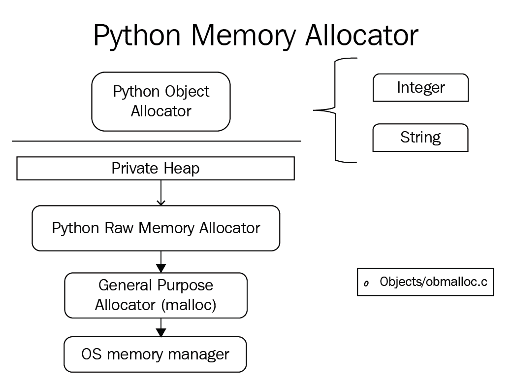
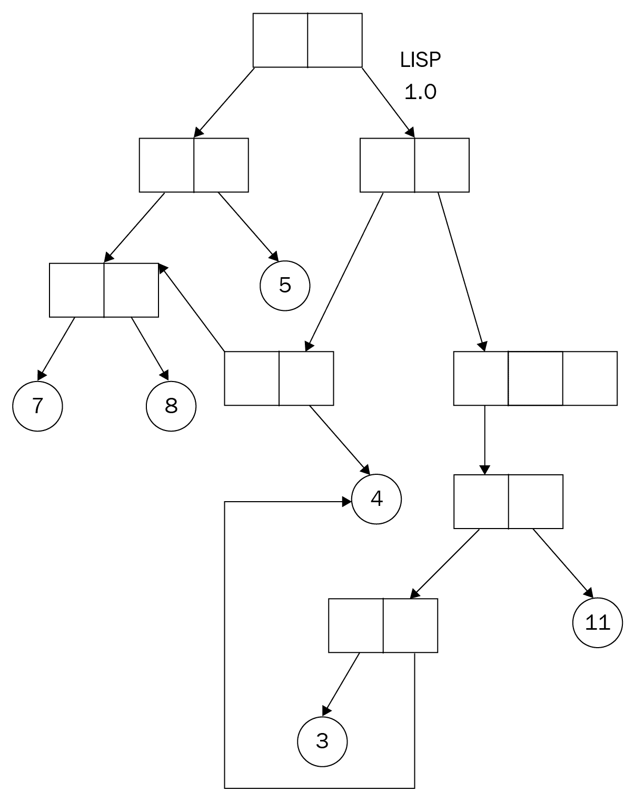

# 原子类型的内存模型和操作

在并发编程过程中需要考虑的问题以及随之而来的问题都与 Python 管理内存的方式有关。因此，深入理解 Python 中如何存储和引用变量和值，不仅有助于查明导致并发程序故障的低级错误，而且有助于优化并发代码。在本章中，我们将深入研究 Python 内存模型及其原子类型，特别是它们在 Python 并发生态系统中的位置。

本章将介绍以下主题：

*   Python 内存模型、支持不同级别内存分配的组件，以及 Python 内存管理的一般原理
*   原子操作的定义，它们在并发编程中扮演的角色，以及如何在 Python 中使用它们

# 技术要求

本章的技术要求如下：

*   在您的计算机上安装 Python 3 吗
*   在[下载 GitHub 存储库 https://github.com/PacktPublishing/Mastering-Concurrency-in-Python](https://github.com/PacktPublishing/Mastering-Concurrency-in-Python)
*   在本章中，我们将使用名为`Chapter17`的子文件夹
*   查看以下视频以查看代码的运行：[http://bit.ly/2AiToVy](http://bit.ly/2AiToVy)

# Python 内存模型

您可能还记得在[第 15 章](15.html)、*全局解释器锁*中对 Python 内存管理方法的简要讨论。在本节中，我们将通过比较它的内存管理机制，将其与 java 和 C++的内存管理机制进行比较，并讨论它与 Python 中并发编程的实践有关的问题，从而更深入地研究 Python 内存模型。

# Python 内存管理器的组件

Python 中的数据以特定的方式存储在内存中。为了从更高的层次上深入理解并发程序中如何处理数据，我们首先需要深入研究 Python 内存分配的理论结构。在本节中，我们将讨论如何在私有堆中分配数据，以及如何通过确保数据完整性的总体实体**Python 内存管理器***-*处理此数据。

Python 内存管理器由许多与不同实体交互并支持不同功能的组件组成。例如，一个组件通过与运行 Python 的操作系统的内存管理器交互，在低级别处理内存分配；它被称为**原始内存分配器**。

在更高的级别上，还有许多其他内存分配器与前面提到的对象和值的私有堆进行交互。Python 内存管理器的这些组件处理特定于对象的分配，这些分配执行特定于给定数据和对象类型的内存操作：整数必须由不同的分配器处理和管理，一个用于管理字符串，另一个用于字典或元组。由于存储和读取指令在这些数据类型之间有所不同，因此实现了这些不同的特定于对象的内存分配器，以获得额外的速度，同时牺牲一些处理空间。

比前面提到的原始内存分配器低一步的是来自标准 C 库的系统分配器（假设正在考虑的 Python 解释器是 CPython）。有时称为通用分配器，这些 C 中写入的实体负责帮助原始内存分配器与操作系统的内存管理器交互。

前面描述的 Python 内存管理器的整个模型如下图所示：



Python memory manager components

# 标记有向图的记忆模型

我们已经了解了 Python 中内存分配的一般过程，因此在本节中，让我们考虑一下 Python 中如何存储和引用数据。许多程序员通常认为 Python 中的内存模型是一个对象图，每个节点上都有一个标签，边是有方向的。简言之，它是一个有标签的有方向对象图。这种内存模型首先与第二古老的计算机编程语言**Lisp**（以前称为 Lisp）一起使用。

它通常被认为是一个有向图，因为它的内存模型只通过指针跟踪它的数据和变量：每个变量的值都是指针，这个点可以指向符号、数字或子例程。因此，这些指针是对象图中的有向边，实际值（符号、数字、子例程）是图中的节点。下图是 Lisp 内存模型早期阶段的简化：



Lisp memory model as an object graph

通过这个对象图内存模型，内存管理具有许多有利的特性。首先，该模型在可重用性方面提供了很大程度的灵活性；为一种数据类型或对象编写一个数据结构或一组指令，然后在其他类型上重用它，这是可能的，而且实际上相当容易。相比之下，C 语言是一种编程语言，它使用的是不同的内存模型，不提供这种灵活性，它的程序员通常需要花费大量时间为不同类型的数据类型和对象重写相同的数据结构和算法。

该内存模型提供的另一种灵活性是，每个对象都可以被任意数量的指针（或最终变量）引用，因此可以被任意数量的指针（或最终变量）变异。我们已经在[第 15 章](15.html)*全局解释器锁*中的示例 Python 程序中看到了此特性的效果，如果两个变量引用相同的（可变）对象（当一个变量分配给另一个变量时实现）一个通过引用成功地改变了对象，那么这个改变也会通过第二个变量的引用反映出来。

正如在第 15 章中讨论的一样，第 1 章，T1，2，全局解释程序锁 TH3 T3，这与 C++中的内存管理是不一样的。例如，当一个变量（不是指针或引用）被指定一个特定值时，编程语言会将该特定值复制到包含原始变量的内存位置。此外，当一个变量被分配另一个变量时，后者的内存位置将被复制到前者的内存位置；赋值后，这两个变量之间没有进一步的联系。

然而，一些人认为，这实际上可能是编程中的一个缺点，尤其是并发编程，因为不协调地尝试改变共享对象可能会导致不希望的结果。作为有经验的 Python 程序员，您可能还注意到类型错误（当一个预期为一种特定类型的变量引用另一种不可兼容类型的对象时）在 Python 编程中非常常见。这也是这种内存模型的直接结果，因为引用指针可以指向任何东西。

# 在并发上下文中

考虑到 Python 内存模型的理论基础，我们如何期望它影响 Python 并发编程的生态系统？幸运的是，Python 内存模型有利于并发编程，因为它允许对并发进行更简单、更直观的思考和推理。具体来说，Python 实现其内存模型并以我们通常期望的方式执行其程序指令。

为了理解 Python 拥有的这个优点，首先考虑 java 编程语言中的并发性。为了在并发程序（特别是多线程程序）中获得更好的速度性能，Java 允许 CPU 重新排列 Java 代码中包含的给定操作的执行顺序。这种重新排列是以任意方式进行的，因此当多个线程执行时，我们不能简单地从代码的顺序推断执行顺序。这导致了这样一个事实，即如果 Java 中的并发程序以一种非预期的方式执行，开发人员将需要花费大量的时间来确定程序的执行顺序，以查明其程序中的错误。

与 Java 不同，Python 的内存模型以一种维护其指令顺序一致性的方式构建。这意味着指令在 Python 代码中的排列顺序指定了它们的执行顺序—没有对代码的任意重新排列，因此，并发程序不会出现令人惊讶的行为。然而，由于 Java 并发中的重新排列是为了实现程序更快的速度而实现的，这意味着 Python 正在牺牲其性能以保持其执行更简单和更直观。

# Python 中的原子操作

关于内存管理的另一个重要主题是原子操作。在本小节中，我们将探讨编程中原子的定义、原子操作在并发编程环境中的作用，以及如何在 Python 程序中使用原子操作。

# 原子是什么意思？

让我们首先检查原子的实际特性。如果一个操作在并发程序中是原子的，那么它在执行过程中不能被程序中的其他实体中断；原子操作也可以称为可线性化、不可分割或不可中断。考虑到竞争条件的性质以及它们在并发程序中的常见程度，可以很直观地得出结论，原子性是程序的一个理想特征，因为它保证了共享数据的完整性，并保护它不受不协调的突变的影响。

术语“原子”指的是一个原子操作对于它所在的程序的其余部分来说是即时的。这意味着操作必须以连续、不间断的方式执行。正如您可能猜到的，实现原子性的最常用方法是通过互斥或锁。正如我们所看到的，锁要求与共享资源的交互一次发生在一个线程或进程上，从而保护一个线程/进程的交互不会被其他竞争线程或进程中断和潜在损坏。

如果程序员允许并发程序中的某些操作是非原子的，那么他们还需要允许这些操作足够谨慎和灵活（在交互和变异数据的意义上），以便不会因为被其他操作中断而导致错误。然而，如果这些操作在执行过程中被中断时发生不规则和错误的行为，那么程序员就很难真正地再现和调试这些行为。

# 吉尔重新考虑了一下

Python 原子操作上下文中的一个主要元素当然是 GIL；此外，对于 GIL 在原子操作中所起的作用，还有一些常见的误解和复杂性。

例如，在阅读原子操作的定义时，有些人倾向于认为 Python 中的所有操作实际上都是原子的，因为 GIL 实际上要求线程以协调的方式执行，在任何给定点上只有一个线程能够运行。事实上，这是一个错误的说法。GIL 要求在给定时间内只有一个线程可以执行 Python 代码，这并不会导致所有 Python 操作的原子性；一个操作仍然可能被另一个操作中断，错误仍然可能是由于错误处理和损坏共享数据造成的。

在较低级别，Python 解释器处理 Python 并发程序中线程之间的切换。这个过程是针对字节码指令完成的，字节码指令是可由机器解释和执行的编译 Python 代码。具体来说，Python 保持一个固定的频率，指定解释器在一个活动线程与另一个活动线程之间切换的频率，并且可以使用内置的`sys.setswitchinterval()`方法设置该频率。任何非原子操作都可以在执行过程中被此线程切换事件中断。

在 Python 2 中，此频率的默认值为 1000 字节码指令，这意味着在一个线程成功执行 1000 字节码指令后，Python 解释器将查找等待执行的其他活动线程。如果至少有一个其他等待线程，解释器将让当前运行的线程释放 GIL，并让等待线程获取 GIL，从而开始执行后一个线程。

在 Python3 中，频率是完全不同的。用于频率的单位现在是基于时间的，特别是以秒为单位。默认值为 15 毫秒时，此频率指定如果线程已执行至少等于阈值的时间，则线程切换事件（连同 GIL 的释放和获取）将在线程完成当前字节码指令的执行后立即发生。

# Python 中固有的原子性

如前所述，如果执行某个操作的线程已超过其执行限制（例如，在 Python3 中默认为 15 毫秒），则该操作在执行期间可能会中断，此时该操作必须完成其当前字节码指令，并将 GIL 返回给另一个正在等待的线程。这意味着线程切换事件只在字节码指令之间发生。

Python 中有一些操作可以在一条字节码指令中执行，因此本质上是原子操作，而不需要外部机制（如互斥）的帮助。具体来说，如果线程中的操作在一个字节码中完成其执行，则线程切换事件不能中断该操作，因为该事件仅在当前字节码指令完成后发生。这种固有原子性的特征非常有用，因为它允许拥有原子性的操作自由地执行指令，即使没有使用同步方法，同时仍然可以保证它们不会被中断，并且数据不会被破坏。

# 原子与非原子

值得注意的是，对于程序员来说，了解 Python 中哪些操作是原子操作，哪些操作不是原子操作是令人惊讶的。有些人可能会认为，由于简单操作比复杂操作占用的字节码更少，因此操作越简单，就越有可能天生就是原子操作。然而，情况并非如此，确定哪些操作本质上是原子操作的唯一方法是进行进一步分析。

根据 Python 3 的文档（可通过以下链接找到：[docs.Python.org/3/faq/library.html#什么样的全局值变异是线程安全的](https://docs.python.org/3/faq/library.html#what-kinds-of-global-value-mutation-are-thread-safe)），一些固有原子操作的示例包括：

*   将预定义对象追加到列表
*   用另一个列表扩展列表
*   从列表中提取元素
*   从列表中“弹出”
*   排序列表
*   将一个变量赋给另一个变量
*   将变量指定给对象的属性
*   为字典创建新条目
*   使用其他词典更新词典

某些非固有原子操作包括以下内容：

*   递增整数，包括使用`+=`
*   通过引用列表中的另一个元素来更新该列表中的元素
*   通过引用字典中的另一个条目来更新该字典中的条目

# Python 中的模拟

让我们分析一下实际 Python 并发程序中原子操作和非原子操作之间的区别。如果您已经从 GitHub 页面下载了本书的代码，请继续导航到`Chapter17`文件夹。对于本例，我们考虑的是`Chapter17/example1.py`文件：

```py
# Chapter17/example1.py

import sys; sys.setswitchinterval(.000001)
import threading

def foo():
    global n
    n += 1

n = 0

threads = []
for i in range(1000):
    thread = threading.Thread(target=foo)
    threads.append(thread)

for thread in threads:
    thread.start()

for thread in threads:
    thread.join()

print(f'Final value: {n}.')

print('Finished.')
```

首先，我们将 Python 解释器的线程切换频率重置为 0.000001 秒，这是为了让线程切换事件比平常更频繁地发生，从而放大程序中可能存在的任何竞争条件。

该程序的要点是用 1000 个单独的线程递增一个简单的全局计数器（`n`，每个线程通过`foo()`函数递增计数器一次。由于计数器最初初始化为`0`，如果程序正确执行，我们将使该计数器在程序末尾保持 1000 的值。但是，我们知道我们在`foo()`函数（`+=`中使用的增量运算符不是原子操作，这意味着当应用于全局变量时，它可能会被线程切换事件中断。

在多次运行该脚本之后，我们可以观察到，事实上，代码中存在竞争条件。计数器小于 1000 的错误值说明了这一点。例如，以下是我获得的输出：

```py
> python3 example1.py
Final value: 998.
Finished.
```

这与我们之前讨论的一致，也就是说，由于`+=`操作符不是原子的，它需要其他同步机制来确保它与多个线程并发交互的数据的完整性。现在，让我们用一个我们知道是原子的操作来模拟同一个实验，具体地说，**将一个预定义的对象附加到一个列表**中。

在`Chapter17/example2.py`文件中，我们有以下代码：

```py
# Chapter17/example2.py

import sys; sys.setswitchinterval(.000001)
import threading

def foo():
    global my_list
    my_list.append(1)

my_list = []

threads = []
for i in range(1000):
    thread = threading.Thread(target=foo)
    threads.append(thread)

for thread in threads:
    thread.start()

for thread in threads:
    thread.join()

print(f'Final list length: {len(my_list)}.')

print('Finished.')
```

我们现在有了一个原本为空的全局列表，而不是全局计数器。新的`foo()`函数现在接受这个全局列表，并将整数`1`追加到该列表中。在程序的其余部分，我们仍在创建和运行 1000 个单独的线程，每个线程调用一次`foo()`函数。在程序结束时，我们将打印出全局列表的长度，以查看该列表是否已成功变异 1000 次。具体来说，如果列表的长度小于 1000，我们将知道代码中存在竞争条件，类似于我们在前面的示例中看到的情况。

由于`list.append()`方法是一个原子操作，因此保证线程调用`foo()`函数并与全局列表交互时不存在争用条件。程序末尾的列表长度说明了这一点。无论我们运行程序多少次，列表的长度始终为 1000：

```py
> python3 example2.py
Final list length: 1000.
Finished.
```

尽管 Python 中的某些操作天生就是原子的，但很难判断给定操作本身是否是原子的。由于对共享数据应用非原子操作可能导致竞争条件，从而导致错误的结果，因此始终建议程序员利用同步机制来确保并发程序中共享数据的完整性。

# 总结

在本章中，我们研究了 Python 内存模型的底层结构，以及该语言如何在并发编程环境中管理其值和变量。考虑到 Python 中内存管理的结构和实现方式，对并发程序行为的推理要比在另一种编程语言中进行同样的推理容易得多。然而，在 Python 中理解和调试并发程序的容易性也伴随着性能的降低。

原子操作是在执行过程中不能中断的指令。原子性是并发操作的理想特性，因为它保证了跨不同线程共享的数据的安全性。虽然 Python 中有些操作天生是原子的，但始终建议使用诸如锁定之类的同步机制来保证给定操作的原子性。

在下一章中，我们将研究如何从头构建并发服务器。通过这个过程，我们将了解更多关于实现通信协议以及将并发应用于现有 Python 应用程序的信息。

# 问题

*   Python 内存管理器的主要组件是什么？
*   Python 内存模型如何类似于带标签的有向图？
*   在用 Python 开发并发应用程序方面，Python 内存模型有哪些优点和缺点？
*   什么是原子操作？为什么在并发编程中需要原子操作？
*   给出 Python 中固有的原子操作的三个示例。

# 进一步阅读

有关更多信息，请参阅以下链接：

*   *构成编程语言*（[基础的内存模型 http://canonical.org/~kragen/记忆模型/](http://canonical.org/~kragen/memory-models/)，*K.J.Sitaker*
**   *Grok the GIL：如何编写快速且线程安全的 Python*（[opensource.com/article/17/4/Grok-GIL](https://opensource.com/article/17/4/grok-gil)），A.Jesse Jiryu Davis*   Python 中的*线程同步机制*（[http://effbot.org/zone/thread-synchronization.htm#atomic-运营](http://effbot.org/zone/thread-synchronization.htm#atomic-operations)），Fredrik Lundh*   *内存**管理*（[https://docs.python.org/3/c-api/memory.html](https://docs.python.org/3/c-api/memory.html) ），Python 文档*   *并发*（[jython.org/jythonbook/en/1.0/Concurrency](http://www.jython.org/jythonbook/en/1.0/Concurrency.html)），jython 文档*   *Python 内存管理*（[anubnair.wordpress.com/2014/09/30/Memory-management-in-Python/](https://anubnair.wordpress.com/2014/09/30/memory-management-in-python/)），Anu B Nair*