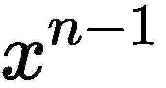
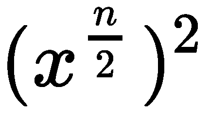

# 使用可调用项和上下文

Python 中的**可调用**概念包括多种不同的方法来创建行为类似于函数的函数和对象。我们可以创建可调用的对象，使用**记忆**来维护答案缓存，因此执行速度非常快。在某些情况下，记忆对于创建在合理时间内完成的算法至关重要。

**上下文**的概念允许我们创建优雅、可靠的资源管理。`with`语句定义一个上下文并创建一个上下文管理器来控制该上下文中使用的资源。Python 文件通常是上下文管理器；在`with`语句中使用时，它们是正确关闭的。

我们将研究几种使用`contextlib`模块中的工具创建上下文管理器的方法。其他一些有用的抽象基类位于名为`collections.abc`的单独子模块中。

我们将展示一些可调用对象的变体设计。这将告诉我们为什么有状态可调用对象有时比简单函数更有用。在开始编写自己的上下文管理器之前，我们还将了解如何使用一些现有的 Python 上下文管理器。

本章将讨论以下概念：

*   设计可调用项
*   改进性能
*   使用`functools`进行回忆录
*   复杂性和可调用接口
*   管理上下文和`with`语句
*   定义`_enter_()`和`_exit_()`方法
*   作为工厂的上下文管理器

# 技术要求

本章的代码文件可在[中找到 https://git.io/fj2Ug](https://git.io/fj2Ug) 。

# 设计可调用项

在 Python 中创建可调用对象有两种简单且常用的方法，如下所示：

*   通过使用`def`语句创建函数。
*   通过创建实现`_call()_`方法的类的实例。这可以通过使用`collections.abc.Callable`作为其基类来实现。

除此之外，我们还可以为变量指定一个**lambda**形式。lambda 是一个仅由一个表达式组成的小型匿名函数。我们不想强调将 lambda 保存在变量中，因为这会导致一种混乱的情况，即我们有一个类似 callable 的函数，它没有用`def`语句定义。

下面是从类创建的简单可调用对象`pow1`：

```py
from typing import Callable
IntExp = Callable[[int, int], int]
class Power1:
    def __call__(self, x: int, n: int) -> int:
        p = 1
        for i in range(n):
            p *= x
        return p
pow1: IntExp = Power1()
```

创建可调用对象分为三个部分，如下所示：

*   类型提示定义参数和结果可调用对象的返回值。在本例中，`Callable[[int, int], int]`定义了一个具有两个整数参数和一个整数结果的函数。为了保存重复，将分配一个新的类型名称`IntExp`。
*   我们用`__call__()`方法定义了这个类。此处的类型签名与`IntExp`类型定义匹配
*   我们创建了类的一个实例，`pow1()`。此对象是可调用的，其行为类似于函数。我们还提供了一个类型提示，以便**mypy**可以确认可调用对象将具有正确的签名。

计算的算法似乎效率低下。我们稍后会解决这个问题。

显然，`__call__()`方法的主体非常简单，不需要完整的类定义。为了展示各种优化，我们将从这个简单的可调用对象开始，而不是将函数变为可调用对象。

我们现在可以像使用任何其他函数一样使用`pow1()`函数。下面是如何在 Python 命令行中使用`pow1()`函数：

```py
>>> pow1(2, 0) 
1 
>>> pow1(2, 1) 
2 
>>> pow1(2, 2) 
4 
>>> pow1(2, 10) 
1024 
```

我们已经用各种参数值评估了可调用对象。

使用`mypy`时，不需要将可调用对象设置为`abc.Callable`w 的子类；但是，使用抽象基类有助于调试。

考虑这个有缺陷的定义：

```py
class Power2(collections.abc.Callable): 
    def __call_( self, x, n ): 
        p= 1 
        for i in range(n): 
            p *= x 
        return p 
```

前面的类定义有错误，不符合可调用抽象的定义。

下面是我们尝试创建此类实例时发生的情况：

```py
>>> pow2: IntExp = Power2() 
Traceback (most recent call last): 
  File "<stdin>", line 1, in <module> 
TypeError: Can't instantiate abstract class Power2 with abstract 
 methods __call__
```

到底出了什么问题可能并不明显，但我们有一个很好的机会来调试它。如果我们没有子类化`collections.abc.Callable`，我们将有一个更神秘的问题需要调试。

下面是一个断开的可调用函数的版本，它依赖于类型提示来检测问题。这与前面显示的正确的`Power`类几乎相同。包含悲剧性缺陷的代码如下所示：

```py
    class     Power3:

        def     __call_(    self    , x:     int    , n:     int    ) ->     int    :
        p =     1
                        for     i     in         range    (n):
            p *= x
            return     p
```

当我们运行 mypy 时，我们会看到关于此代码的投诉。可调用对象的预期类型与定义的`IntExp`类型不匹配：

```py
    # Chapter_6/ch06_ex1.py:68: error: Incompatible types in assignment (expression has type "Power3", variable has type "Callable[[int, int], int]")

```

如果我们忽略 mypy 错误并尝试使用该类，我们将看到运行时问题。以下是当我们尝试使用`Power3`作为一个不满足可调用项期望且也不是`abc.Callable`子类的类时发生的情况：

```py
>>> pow3: IntExp = Power3() 
>>> pow3(2, 5) 
Traceback (most recent call last): 
  File "<stdin>", line 1, in <module> 
TypeError: 'Power3' object is not callable 
```

对于`Power3`类定义有缺陷的原因，此错误提供的指导较少。mypy 提示为查找问题提供了一些帮助。

# 改进性能

我们将研究前面所示的`Power1`类的两个性能调整。

首先，我们需要切换到更好的算法。然后，我们将需要一个更好的算法结合记忆，这涉及到缓存；因此，函数成为有状态的。这就是可调用对象发光的地方。

第一个修改是使用**分而治之**设计策略。前一版本将的计算分为步；循环执行了*n*个乘法运算。如果我们能找到一种方法将问题分成两个相等的部分，那么问题将分解为步骤。

例如，`Power1`可调用的`pow1(2,1024)`执行 1024 个单独的乘法运算。我们可以将其优化为 10 次乘法，这是一个显著的加速。

我们将使用*快速求幂*算法，而不是简单地乘以固定值。它使用三个基本的计算规则，如下所示：

*   如果为，则为，结果为 1。
*   如果*n*为奇数，，结果为。这涉及到对的递归计算。这是一次乘法。然而，是一个偶数，可以进行优化。
*   如果*n*为偶数，，则结果为。这涉及到对的递归计算。这将乘法的数目减半。

以下是这些递归可调用对象：

```py
    class     Power4:

        def         __call__    (    self    , x:     int    , n:     int    ) ->     int    :
            if     n ==     0    :
                return         1
                        elif     n %     2     ==     1    :
                return         self    .    __call__    (x, n -     1    ) * x
            else    :      # n % 2 == 0:
                        t =     self    .    __call__    (x, n //     2    )
                return     t * t

pow4: IntExp = Power4()
```

我们对输入值应用了三条规则：

*   如果*n*为零，我们将返回 1。
*   如果*n*为奇数，我们将进行递归调用并返回。
*   如果*n*为偶数，我们将进行递归调用并返回。

执行时间大大加快。我们可以使用`timeit`模块来查看性能上的差异。有关使用`timeit`的信息，请参见[第 1 章](01.html)、*预备知识、工具和技术*。当我们比较运行`pow1(2,1024)`和`pow4(2,1024)`10000 次时，我们会看到前一个版本的运行时间为 183 秒，而这个版本的运行时间为 8 秒。

以下是我们如何使用`timeit`收集性能数据：

```py
import timeit 

iterative = timeit.timeit( "pow1(2,1024)",""" 
class Power1(): 
    def __call__(self, x: int, n: int) -> int:
        p= 1 
        for i in range(n): 
            p *= x 
        return p 

pow1= Power1() 
""", number=100_000 ) 
print("Iterative", iterative) 
```

我们进口了`timeit`模块。`timeit.timeit()`函数将在定义的上下文中对给定语句求值。在本例中，我们的语句是`pow1(2,1024)`表达式。此语句的上下文是`pow1()`可调用对象的定义；这包括导入、类定义和创建`pow1`实例。

请注意，我们提供了`number=100_000`以加快速度。如果我们使用了迭代次数的默认值，它可能会花费将近两分钟的时间。

# 使用记忆或缓存

记忆背后的想法是缓存以前的结果，以避免重新计算它们。我们将使用相当多的内存，但我们也可以通过避免计算大大提高性能。

普通函数没有缓存以前结果的位置。函数不应是有状态的。但是，可调用对象可以是有状态的。它可以包括以前结果的缓存。

以下是我们的`Power`可调用对象的一个记忆版本：

```py
    class     Power5:

        def         __init__    (    self    ):
            self    .memo = {}

        def         __call__    (    self    , x:     int    , n:     int    ) ->     int    :
            if     (x, n)     not in         self    .memo:
                if     n ==     0    :
                    self    .memo[x, n] =     1
                            elif     n %     2     ==     1    :
                    self    .memo[x, n] =     self    .    __call__    (x, n-    1    ) * x
                elif     n %     2     ==     0    :
                t =     self    .    __call__    (x, n //     2    )
                    self    .memo[x, n] = t * t
                else    :
                    raise         Exception    (    "Logic Error"    )
            return         self    .memo[x, n]

pow5: IntExp = Power5()
```

我们修改了我们的算法，使之能够使用`self.memo`缓存。这将初始化为空映射。在`__call__()`方法中，检查缓存中以前计算的答案。

如果先前已请求参数值，则返回缓存的结果，并且不执行任何计算。这是我们前面提到的最大的加速。

否则，缓存中不存在参数值。在这种缺失值的情况下，必须计算并保存的值。计算快速指数的三个规则用于获取值并将值放入缓存。这使我们确信，未来的计算将能够利用缓存的值。

记忆的重要性怎么强调都不过分。计算量的减少可能是巨大的。这通常是通过用一个可调用对象替换一个缓慢而昂贵的函数来完成的。

Memoization doesn't work well with float values. The lack of exact match equality means some kind of approximately-equal test needs to be made against the cached values. When working with float values, either rounding needs to be used, or some more sophisticated cache search will be required.

# 使用 functools 进行备忘

Python 库在`functools`模块中包含一个备忘录修饰符。我们可以使用这个模块，而不是创建我们自己的可调用对象。

我们可以这样使用：

```py
    from     functools     import     lru_cache

    @lru_cache    ()
    def     pow6(x:     int    , n:     int    ) ->     int    :
        if     n ==     0    :
            return         1
                    elif     n %     2     ==     1    :
            return     pow6(x, n-    1    ) * x
        else    :      # n % 2 == 0:
                    t = pow6(x, n //     2    )
            return     t * t
```

此代码定义了一个函数`pow6()`，该函数由一个**最近使用最少的**（**LRU**缓存修饰。以前的请求存储在备忘录缓存中。LRU 缓存背后的思想是保留最近发出的请求，并悄悄清除最旧的请求。例如，我们可以使用`@lru_cache(256)`将缓存限制为 256 个条目，从而优化内存使用。

使用`timeit`，我们可以看到`pow5()`的 10000 次迭代运行时间约为 1 秒，而`pow6()`的迭代运行时间约为 8 秒。

这也表明，对`timeit`的一次微不足道的使用可能会误报记忆算法的性能。如果每个请求都在重新计算先前缓存的答案，则只有第一次迭代（缓存为空）执行计算。

# 旨在使用可调用接口实现简单性

可调用对象背后的思想是我们有一个专注于单个方法的`class`接口。对于简单的函数定义也是如此。

某些对象具有多个相关方法。例如，21 点`Hand`必须添加卡片并生成总数。21 点`Player`必须下注、接受手牌和做出游戏决策（例如，击打、站立、分割、保险和双下）。这些是更复杂的接口，不适合作为可调用接口。

然而，博彩策略是成为可赎回者的候选策略。虽然它将被实现为设置状态和下注的几种方法，但这似乎有些过分。对于这个简单的例子，该策略可以是一个带有一些公共属性的可调用接口。

以下是直接下注策略，始终相同：

```py
class BettingStrategy: 
    def __init__(self) -> None: 
       self.win = 0 
       self.loss = 0 
    def __call__(self) -> int: 
        return 1 
bet = BettingStrategy() 
```

这个接口的想法是，`Player`对象将通知博彩策略赢的金额和输的金额。`Player`对象可能有如下方法告知下注策略结果：

```py
    def win(self, amount) -> None: 
        self.bet.win += 1 
        self.stake += amount 
    def loss(self, amount) -> None: 
         self.bet.loss += 1 
         self.stake -= amount 
```

这些方法告知投注策略对象（即`self.bet`对象）该手牌是赢还是输。下注时，`Player`对象将执行类似以下操作的操作，以获得当前下注级别：

```py
    def initial_bet(self) -> int: 
        return self.bet() 
```

这是一个令人愉快的简短方法实现。毕竟，博彩策略除了封装一些相对简单的规则外，没有什么作用。

可调用接口的紧凑性可能会有所帮助。我们没有太多的方法名，也没有一组复杂的语法来表示像 betamount 这样简单的东西。

# 复杂性和可调用接口

让我们看看，随着我们的处理变得越来越复杂，这个界面设计的效果如何。下面是每个损失策略（也称为**鞅**下注系统）的加倍：

```py
    class     BettingMartingale(BettingStrategy):

        def         __init__    (    self    ) ->     None    :
            self    ._win =     0
                        self    ._loss =     0
                        self    .stage =     1

                    @property
                    def     win(    self    ) ->     int    :
            return         self    ._win

        @win.setter
                    def     win(    self    , value:     int    ) ->     None    :
            self    ._win = value
            self    .stage =     1

                    @property
                    def     loss(    self    ) ->     int    :
            return         self    ._loss

        @loss.setter
                    def     loss(    self    , value:     int    ) ->     None    :
            self    ._loss = value
            self    .stage *=     2

                    def         __call__    (    self    ) ->     int    :
            return         self    .stage
```

每一次失败都会将阶段乘以 2，从而使下注加倍。这种情况一直持续到我们赢了，弥补了我们的损失，达到了桌面极限，或者破产了，不能再下注。赌场通过设置赌桌限制来限制这一点。

无论何时我们赢了，下注都会重置为基本下注。将`stage`变量重置为`1`值。

目标是轻松访问属性值。此类的客户端将能够使用`bet.win += 1`。这可以依赖于属性`setter`方法根据胜负进行额外的状态更改。我们真正关心的只是`setter`属性，但我们必须定义`getter`属性，以便清楚地创建`setter`属性。除了统计胜负之外，`setter`方法还设置了`stage`实例变量。

我们可以在下面的代码片段中看到此类的作用：

```py
>>> bet= BettingMartingale() 
>>> bet() 
1 
>>> bet.win += 1 
>>> bet() 
1 
>>> bet.loss += 1 
>>> bet() 
2 
```

这个对象的接口仍然很简单。我们可以计算赢数并将赌注重置为基数，也可以计算损失，赌注将加倍。

属性的使用使得类定义冗长而可怕。由于我们真正感兴趣的是`setter`属性，而不是`getter`属性，我们可以使用`__setattr__()`稍微简化类定义，如下代码所示：

```py
    class     BettingMartingale2(BettingStrategy):

        def         __init__    (    self    ) -> None:
            self    .win =     0
                        self    .loss =     0
                        self    .stage =     1

                    def         __setattr__    (    self    , name:     str    , value:     int    ) ->     None    :
            if     name ==     "win"    :
                self    .stage =     1
                        elif     name ==     "loss"    :
                self    .stage *=     2
                        super    ().    __setattr__    (name, value)

        def         __call__    (    self    ) ->     int    :
            return         self    .stage
```

我们使用`__setattr__()`来监控`win`和`loss`属性的变化。除了使用`super().__setattr__()`设置实例变量外，我们还更新了下注金额的内部状态。

这是一个外观更好的类定义，它保留了与具有两个属性的原始可调用对象相同的简单接口。

# 管理上下文和 with 语句

在 Python 中，上下文和上下文管理器在多个地方使用。我们将看几个例子来建立基本术语。

Python 使用`with`语句定义上下文。下面的程序是一个小示例，它解析日志文件以创建该日志的有用 CSV 摘要。由于有两个打开的文件，因此将使用嵌套的`with`上下文。该示例使用了一个复杂的正则表达式`format_1_pat`。我们将很快对此进行定义。

我们可能会在应用程序中看到类似于以下内容的内容：

```py
from pathlib import Path
import gzip 
import csv 

source_path = Path.cwd()/"data"/"compressed_data.gz"
target_path = Path.cwd()/"data"/"subset.csv"

with target_path.open('w', newline='') as target: 
    wtr= csv.writer( target ) 
    with gzip.open(source_path) as source: 
        line_iter = (b.decode() for b in source)
        row_iter = Counter(format_1_pat.match(line) for line in line_iter)
        non_empty_rows: Iterator[Match] = filter(None, row_iter)
        wtr.writerows(m.groups() for m in non_empty_rows)
```

具有两个上下文管理器的两个上下文是本示例的一部分：

*   最外层的上下文以`with target_path.open('w', newline='') as target:`语句开始。`path.open()`方法打开一个同样是上下文管理器的文件，并将其分配给`target`变量以供进一步使用。
*   内部上下文以`with gzip.open(source_path, "r") as source:`语句开始。此`gzip.open()`函数打开给定的路径，并充当上下文管理器

`with`语句结束时，上下文退出，文件正确关闭；这意味着将刷新所有缓冲区并释放操作系统资源。即使`with`上下文主体中存在异常，也会正确处理上下文管理器的退出，并关闭文件。

Always use a with statement around a path.open() and related file-system operations

Since files involve **operating system** (**OS**) resources, it's important to be sure that the entanglements between our applications and the OS are released as soon as they're no longer needed. The `with` statement ensures that resources are used properly.

为了完成该示例，以下是用于解析**通用日志格式**的 Apache HTTP 服务器日志文件的正则表达式：

```py
import re 
format_1_pat= re.compile( 
    r"([\d\.]+)\s+" # digits and .'s: host 
    r"(\S+)\s+"     # non-space: logname 
    r"(\S+)\s+"     # non-space: user 
    r"\[(.+?)\]\s+" # Everything in []: time 
    r'"(.+?)"\s+'   # Everything in "": request 
    r"(\d+)\s+"     # digits: status 
    r"(\S+)\s+"     # non-space: bytes 
    r'"(.*?)"\s+'   # Everything in "": referrer 
    r'"(.*?)"\s*'   # Everything in "": user agent 
) 
```

前面的表达式定位了前面示例中使用的各种日志格式字段。

# 使用十进制上下文

另一个经常使用的上下文是十进制上下文。此上下文定义了`decimal.Decimal`计算的许多属性，包括用于舍入或截断值的量化规则。

我们可能会看到类似于以下代码段的应用程序编程：

```py
import decimal 
PENNY = decimal.Decimal("0.00") 

price = decimal.Decimal('15.99') 
rate = decimal.Decimal('0.0075') 
print(f"Tax={(price * rate).quantize(PENNY)}, Fully={price * rate}")

with decimal.localcontext() as ctx: 
    ctx.rounding = decimal.ROUND_DOWN 
    tax = (price*rate).quantize(PENNY) 
print(f"Tax={tax}")
```

前面的示例显示了默认上下文**和**本地上下文。首先显示默认上下文，它使用默认舍入规则。

本地化上下文以`with decimal.localcontext() as ctx:`语句开始。在这种情况下，十进制舍入被定义为此特定计算的向下舍入。

`with`语句用于确保本地化更改后恢复原始上下文。在此上下文之外，将应用默认舍入。在此上下文中，将应用修改后的舍入规则。

# 其他上下文

还有一些其他常见的情况。几乎所有这些都与基本的输入/输出操作相关。大多数打开文件的模块都会与类似文件的对象一起创建上下文。

上下文还与锁定和数据库事务相关联。我们可以获取并释放一个外部锁，比如信号量，或者我们可能希望数据库事务在成功时正确提交，或者在失败时回滚。这些都是在 Python 中定义上下文的内容。

PEP 343 文档提供了许多关于如何使用`with`语句和上下文管理器的其他示例。还有其他一些地方，我们可能希望使用上下文管理器。

我们可能需要创建只是上下文管理器的类，或者我们可能需要创建具有多种用途的类，其中之一就是作为上下文管理器。我们将研究一些上下文的设计策略。

我们将在[第 9 章](09.html)、*装饰和混合–横切方面*中再次讨论这一点，在这里我们可以介绍更多创建具有上下文管理器功能的类的方法。

# 定义 uuu enter 和 uuu exit 方法

上下文管理器的定义特征是它有两个特殊的方法：`__enter__()`和`__exit__()`。`with`语句使用它们来进入和退出上下文。我们将使用一个简单的上下文，以便了解它们是如何工作的。

我们经常使用上下文管理器来进行全局状态更改。这可能是对数据库事务状态的更改，也可能是对资源锁定状态的更改，这是我们希望在事务完成后执行并撤消的操作。

对于本例，我们将对随机数生成器进行全局更改。我们将创建一个上下文，其中随机数生成器使用固定的已知种子，提供固定的值序列。

以下是上下文管理器类定义：

```py
    import     random
    from     typing     import     Optional, Type
    from     types     import     TracebackType

    class     KnownSequence:

        def         __init__    (    self    ,     seed: int = 0    ) ->     None    :
            self    .seed =     0

                    def         __enter__    (    self    ) ->     'KnownSequence'    :
            self    .was = random.getstate()
        random.seed(    self    .seed,     version    =    1    )
            return         self

                    def         __exit__    (
                self    ,
            exc_type: Optional[Type[    BaseException    ]],
            exc_value: Optional[    BaseException    ],
            traceback: Optional[TracebackType]
    ) -> Optional[    bool    ]:
        random.setstate(    self    .was)
            return False    
```

我们为上下文管理器定义了所需的`__enter__()`和`__exit__()`方法。`__enter__()`方法将保存随机模块的先前状态，然后将种子重置为给定值。`__exit__()`方法将恢复随机数发生器的原始状态。

注意，`__enter__()`返回`self`。这对于已经添加到其他类定义中的**mixin**上下文管理器来说很常见。我们将在[第 9 章](09.html)、*装饰和混合——横切方面*中了解混合的概念。注意，`__enter__()`方法不能有引用`KnownSequence`类的类型提示，因为类定义不完整。相反，使用字符串`'KnownSequence'`；当类型提示检查完成时，mypy 将把它解析到类中。

正常情况下，`__exit__()`方法的参数值为`None`。除非我们有特定的异常处理需求，否则我们通常会忽略参数值。我们将在下面的代码中研究异常处理。下面是一个使用上下文打印五组随机数的示例：

```py
print(tuple(random.randint(-1,36) for i in range(5))) 
with KnownSequence(): 
    print(tuple(random.randint(-1,36) for i in range(5))) 
print(tuple(random.randint(-1,36) for i in range(5))) 
with KnownSequence(): 
    print(tuple(random.randint(-1,36) for i in range(5))) 
print(tuple(random.randint(-1,36) for i in range(5))) 
```

在`KnownSequence`实例管理的上下文中创建的两组随机数产生固定的值序列。在这两个上下文之外，将恢复随机种子，并获得随机值。

输出将如下所示（在大多数情况下）：

```py
(12, 0, 8, 21, 6) 
(23, 25, 1, 15, 31) 
(6, 36, 1, 34, 8) 
(23, 25, 1, 15, 31) 
(9, 7, 13, 22, 29) 
```

其中一些输出取决于机器。虽然精确值可能不同，但第二行和第四行将匹配，因为种子是由上下文固定的。其他行不一定匹配，因为它们依赖于`random`模块自身的随机化特性。

# 异常处理

上下文管理器块中出现的异常将传递给上下文管理器的`__exit__()`方法。异常的标准位–类、参数和回溯堆栈–都将作为参数值提供。

`__exit__()`方法可以使用异常信息执行以下两项操作之一：

*   通过返回一些`True`值使异常静音。
*   通过返回任何其他`False`值，允许异常正常上升。不返回与返回`None`相同，返回`None`为`False`值；这允许异常传播。

也可以使用异常来更改上下文管理器在退出时的操作。例如，我们可能必须对可能出现的某些类型的操作系统错误执行特殊处理。

# 作为工厂的上下文管理器

我们可以创建一个上下文管理器类，它是应用程序对象的工厂。这使我们能够愉快地分离设计考虑事项，而不会使具有上下文管理功能的应用程序类变得混乱。

假设我们想要一个确定的`Deck`来处理 21 点。这并不像听起来那么有用。对于单元测试，我们需要一个完整的模拟卡组，其中包含特定的卡序列。这有一个优点，即上下文管理器可以处理我们已经看到的类。

我们将扩展前面显示的简单上下文管理器，以创建一个可在`with`语句上下文中使用的`Deck`。

以下是一个类，它是`Deck`的工厂，并且还调整了`random`模块：

```py
    class     Deterministic_Deck:

        def         __init__    (    self    , *args, **kw) ->     None    :
            self    .args = args
            self    .kw = kw

        def         __enter__    (    self    ) -> Deck:
            self    .was = random.getstate()
        random.seed(    0    ,     version    =    1    )
            return     Deck(*    self    .args, **    self    .kw)

        def         __exit__    (
                self    ,
            exc_type: Optional[Type[    BaseException    ]],
            exc_value: Optional[    BaseException    ],
            traceback: Optional[TracebackType]
    ) -> Optional[    bool    ]:
        random.setstate(    self    .was)
            return False

```

前面的上下文管理器类保留参数值，以便它可以使用给定参数创建一个`Deck`。

`__enter__()`方法保留旧的随机数状态，然后将`random`模块设置为提供固定值序列的模式。这是用来建造和洗牌的甲板。

注意，`__enter__()`方法返回一个新创建的`Deck`对象，用于`with`语句上下文。这是通过`with`语句中的`as`子句分配的。类型提示指定`Deck`为该方法的返回类型。以下是使用此 factory 上下文管理器的方法：

```py
with Deterministic_Deck(size=6) as deck: 
    h = Hand(deck.pop(), deck.pop(), deck.pop()) 
```

前面的代码示例保证了我们可以用于演示和测试目的的特定卡序列。

# 在上下文管理器中清理

在本节中，我们将讨论一个更复杂的上下文管理器，它在出现问题时尝试进行一些清理。

这解决了我们希望保存应用程序正在重写的文件的备份副本的常见问题。我们希望能够执行类似以下操作：

```py
with Updating(some_path): 
    with some_path.open('w') as target_file: 
        process(target_file) 
```

目的是将原始文件重命名为`some_file copy`。如果上下文工作正常，即未引发异常，则可以删除备份副本或将其重命名为`some_file old`。

如果上下文不能正常工作，即引发异常，我们希望将新文件重命名为`some_file error`，将旧文件重命名为`some_file`，将原始文件恢复到异常之前的状态。

我们需要一个类似于以下内容的上下文管理器：

```py
    from     pathlib     import     Path
    from     typing     import     Optional

    class     Updating:

        def         __init__    (    self    , target: Path) ->     None    :
            self    .target: Path = target
            self    .previous: Optional[Path] =     None

            def         __enter__    (    self    ) ->     None    :
            try    :
            self.previous = (
                self.target.parent 
                    / (self.target.stem + " backup")
                ).with_suffix(self.target.suffix)
                self    .target.rename(    self    .previous)
            except         FileNotFoundError    :
                        self    .previous =     None

            def         __exit__    (
                self    ,
            exc_type: Optional[Type[    BaseException    ]],
            exc_value: Optional[    BaseException    ],
            traceback: Optional[TracebackType]
    ) -> Optional[    bool    ]:
            if     exc_type     is not None    :
                        try    :
                    self    .failure = (
                        self    .target.parent 
                        / (    self    .target.stem +     " error"    )
                    ).with_suffix(    self    .target.suffix)
                    self    .target.rename(    self    .failure)
                except         FileNotFoundError    :
                    pass          # Never even got created.
                            if         self    .previous:
                    self    .previous.rename(    self    .target)
            return False

```

此上下文管理器的`__enter__()`方法将尝试保留命名文件的任何以前副本（如果它已经存在）。如果它不存在，就没有什么可保存的了。只需将文件重命名为`"file backup.ext"`等名称，即可保留该文件。

`__exit__()`方法将获得上下文主体中发生的任何异常的相关信息。如果没有例外，就不需要做更多的事情。如果出现异常，`__exit__()`方法将尝试保留输出（后缀为`"error"`），以便进行调试。它还将通过将备份重命名为原始名称，将文件的任何以前的副本放回原位。

这在功能上相当于一个`try-except-finally`块。但是，它的优点是将相关的应用程序处理与上下文管理分开。申请处理写在`with`语句中。上下文问题被放在一个单独的类中。

# 总结

我们研究了类定义的三种特殊方法。`__call__()`方法用于创建可调用文件。可调用函数用于创建有状态的函数。我们的主要示例是一个用于记忆以前结果的函数。

`__enter__()`和`__exit__()`方法用于创建上下文管理器。上下文用于处理本地化到`with`语句体的处理。我们的大多数示例都包括输入输出处理。Python 还为十进制状态使用本地化上下文。其他示例包括为单元测试目的制作补丁，或获取和释放锁。

# 可调用的设计考虑因素和权衡

当设计一个可调用对象时，我们需要考虑以下内容：

*   首先要考虑的是对象的接口。如果有理由让对象具有类似函数的接口，那么可调用对象是一种明智的设计方法。使用`collections.abc.Callable`可确保可调用 API 的构建正确，并告知任何阅读代码的人类的意图。
*   次要考虑的是函数的状态性。Python 中的普通函数没有滞后——没有保存的状态。然而，一个可调用对象可以很容易地保存一个状态。记忆化设计模式充分利用了有状态的可调用对象。

可调用对象的唯一缺点是所需的语法量。普通函数定义较短，因此不易出错，更易于阅读。

将定义的函数迁移到可调用对象很容易，如下所示：

```py
def x(args): 
    body 
```

前面的函数可以转换为以下可调用对象：

```py
class X: 
    def __call__(self, args): 
        body 
x= X() 
```

这是使函数以新形式通过单元测试所需的最小更改集。现有机构将在新环境下工作，不作修改。

更改完成后，可以将功能添加到可调用对象的函数版本中。

# 上下文管理器设计注意事项和权衡

上下文通常用于获取/释放、打开/关闭和锁定/解锁类型的操作对。大多数示例都与文件 I/O 相关，Python 中的大多数类似文件的对象已经是适当的上下文管理器。

对于包含基本处理步骤的任何内容，几乎总是需要上下文管理器。特别是，任何需要最终`close()`方法的内容都应该由上下文管理器包装。

有些 Python 库具有打开/关闭操作，但对象不是正确的上下文。例如，`shelve`模块没有创建正确的上下文。

我们可以（也应该）在`shelve`文件上使用`contextllib.closing()`上下文。我们将在[第 10 章](10.html)、*序列化和保存–JSON、YAML、Pickle、CSV 和 XML*中展示这一点。

对于我们自己需要`close()`方法的类，我们可以使用`closing()`函数。当遇到具有任何获取/发布生命周期的类时，我们希望在`__init__()`或类级别`open()`方法中获取资源并在`close()`中发布。这样，我们的类就可以很好地集成这个`closing()`函数。

下面是一个需要`close()`函数的类被包装的示例：

```py
with contextlib.closing(MyClass()) as my_object: 
    process(my_object) 
```

`contextllib.closing()`函数将调用作为参数给出的对象的`close()`方法。我们可以保证`my_object`将对其`close()`方法进行评估。

# 期待

在接下来的两章中，我们将介绍用于创建容器和数字的特殊方法。在[第 7 章](07.html)*创建容器和集合*中，我们将查看标准库中的容器和集合。我们还将研究构建一种独特的新型容器。在[第 8 章](08.html)*创建数字*中，我们将了解各种数字类型以及如何创建自己的数字类型。