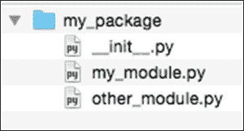
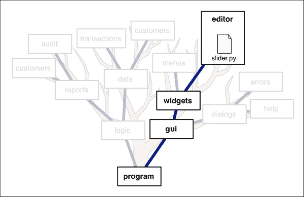
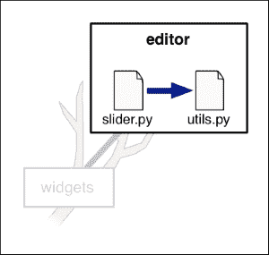
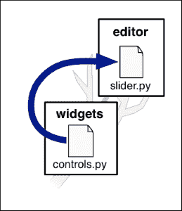

# 第三章使用模块和包

为了能够在 Python 程序中使用模块和包，您需要了解它们是如何工作的。在本章中，我们将详细介绍如何在 Python 中定义和使用模块和包。特别是，我们将：

*   回顾 Python 模块和包是如何定义的
*   查看如何在其他包内创建包
*   了解如何初始化模块和包
*   了解有关导入过程的更多信息
*   探索相对进口的概念
*   了解如何控制导入的内容
*   了解如何处理循环依赖关系
*   了解如何直接从命令行运行模块，以及为什么这很有用

# 模块和包装

到目前为止，您应该对将 Python 代码组织到模块中，然后在其他模块和程序中导入和使用这些模块相当熟悉。然而，这只是一种尝试。让我们先简要回顾一下 Python 模块和包是什么，然后再进一步了解它们是如何工作的。

正如我们所看到的，**模块**只是一个 Python 源文件。您可以使用`import`语句导入模块：

```py
import my_module
```

完成此操作后，您可以通过在项前添加模块名称来引用模块中的任何函数、类、变量和其他定义，例如：

```py
my_module.do_something()
print(my_module.variable)
```

在[第一章](1.html "Chapter 1. Introducing Modular Programming")*介绍模块化编程*时，我们了解到Python**包**是一个包含名为`__init__.py`的特殊文件的目录。这称为**包初始化文件**，并将目录标识为 Python 包。包通常还包含一个或多个 Python 模块，例如：



要导入此包中的模块，请将包名称添加到模块名称的开头。例如：

```py
import my_package.my_module
my_package.my_module.do_something()
```

您还可以使用`import`语句的替代版本，使代码更易于阅读：

```py
from my_package import my_module
my_module.do_something()
```

### 注

在本章后面的*如何导入任何内容*一节中，我们将介绍使用`import`语句的各种方式。

# 包内包

就像你可以在目录中有目录一样，你也可以在其他包中有包。例如，假设我们的`my_package`目录包含另一个名为`my_sub_package`的目录，该目录本身有一个`__init__.py`文件：


正如您所期望的，您通过在包含子包的包的名称前加前缀来导入子包中的模块：

```py
from my_package.my_sub_package import my_module
my_module.do_something()
```

嵌套包的深度没有限制，但在实践中，如果包中有太多级别的包，则会变得有点笨拙。更有趣的是，各种包和子包形成了一个**树状结构**，允许您组织甚至最复杂的程序。例如，一个复杂的业务系统可以这样安排：


如您所见，这被称为树状结构，因为包中的包看起来像树的扩展分支。这样的树状结构允许您将程序中逻辑上相关的部分组合在一起，同时确保在需要时可以找到所有内容。例如，使用上图描述的结构，您可以使用`program.logic.data.customers`包访问客户数据，并且程序中的各种菜单将由`program.gui.widgets.menus`包定义。

显然，这是一个极端的例子。大多数程序即使是非常复杂的程序也不会这么复杂。但您可以看到 Python 包如何让您的程序保持良好的组织，无论它变得多么庞大和复杂。

# 初始化模块

当导入一个模块时，该模块中的任何顶级代码都会被执行。这会使您在模块中定义的各种函数、变量和类可供调用方使用。要了解其工作原理，请创建一个名为`test_module.py`的新 Python 源文件，并在此模块中输入以下代码：

```py
def foo():
    print("in foo")

def bar():
    print("in bar")

my_var = 0

print("importing test module")
```

现在，打开一个终端窗口，`cd`进入存储`test_module.py`文件的目录，然后键入`python`启动 Python 解释器。然后尝试键入以下内容：

```py
% import test_module
```

执行此操作时，Python 解释器将打印以下消息：

```py
importing test module
```

之所以这样做，是因为模块中的所有顶级 Python 语句（包括`def`语句和我们的`print`语句）都是在导入模块时执行的。然后，您可以调用`foo`和`bar`函数，并通过在名称前面加上`my_module`前缀来访问`my_var`全局：

```py
% my_module.foo()
in foo
% my_module.bar()
in bar
% print(my_module.my_var)
0
% my_module.my_var = 1
% print(my_module.my_var)
1
```

因为所有顶级 Python 语句都是在导入模块时执行的，所以您可以直接在模块本身中包含初始化语句来初始化模块，就像我们测试模块中的语句将`my_var`设置为零一样。这意味着导入模块时，模块将自动初始化。

### 注

请注意，模块只导入一次。如果两个模块导入同一个模块，第二个`import`语句将简单地返回对已导入模块的引用，因此您不会两次导入（并初始化）同一个模块。

## 初始化功能

这种隐式初始化是有效的，但不一定是一种好的实践。Python 语言设计者提出的指导原则之一是*显式优于*隐式。换句话说，让一个模块自动初始化本身并不总是好的编码实践，因为读取代码时并不总是清楚哪些被初始化，哪些不被初始化。

为了避免这种混淆，并且为了遵循 Python 指南，通常最好显式初始化模块。按照惯例，这是通过定义一个名为`init()` 的顶级函数来完成的，该函数执行模块的所有初始化。例如，在我们的`test_module`中，我们可以将`my_var = 0`语句替换为以下内容：

```py
def init():
    global my_var
    my_var = 0
```

这有点冗长，但它使初始化显式化。当然，您还必须记住在使用模块之前调用`test_module.init()`，通常是从主程序内部调用。

显式模块初始化的主要优点之一是，您可以控制各种模块初始化的顺序。例如，如果模块 A 的初始化包括调用模块 B 中的函数，并且该函数要求模块 B 已初始化，则如果两个模块以错误的顺序导入，程序将崩溃。当模块导入其他模块时，这会变得特别困难，因为导入模块的顺序可能会非常混乱。为了避免这种情况，最好使用显式模块初始化，在主程序调用`A.init()`之前先调用`B.init()`。这是一个完美的例子，说明了为什么对模块使用显式初始化函数通常更好。

# 初始化包

为了初始化一个包，您将 Python 代码放在包的`__init__.py`文件中。然后在导入包时执行此代码。例如，假设您有一个名为`test_package`的包，其中包含一个`__init__.py`文件和一个名为`test_module.py`的模块：


您可以在`__init__.py`文件中放入您喜欢的任何代码，当第一次导入包（或包中的模块）时，将执行该代码。

您可能想知道为什么要这样做。初始化模块是有意义的，因为模块包含在使用之前可能需要初始化的各种函数（例如，通过将全局变量设置为初始值）。但是为什么要初始化一个包，而不仅仅是该包中的一个模块呢？

答案在于导入包时会发生什么。当您这样做时，您在包的`__init__.py`文件中定义的任何内容都将在包级别可用。例如，假设您的`__init__.py`文件包含以下 Python 代码：

```py
def say_hello():
    print("hello")
```

然后，您可以通过以下方式从主程序访问此功能：

```py
import my_package
my_package.say_hello()
```

您不需要在包中的模块内定义`say_hello()`函数，就可以轻松访问它。

然而，作为的一般原则，向`__init__.py`文件中添加代码并不是一个好主意。它可以工作，但是查看包的源代码的人希望包的代码是在模块中定义的，而不是在包初始化文件中定义的。另外，整个包只有一个`__init__.py`文件，这使得在包中组织代码变得更加困难。

使用包初始化文件的更好方法是在包内的模块中编写代码，然后使用`__init__.py`文件导入此代码，以便在包级别可用。例如，您可以在`test_module`模块中实现`say_hello()`功能，然后在包的`__init__.py`文件中包含以下内容：

```py
from test_package.test_module import say_hello
```

使用您的包的程序仍然会以完全相同的方式调用`say_hello()`函数。唯一的区别是该函数现在作为`test_module`模块的一部分实现，而不是集中在整个包的`__init__.py`文件中。

这是一种非常有用的技术，尤其是当您的软件包变得更加复杂，并且您有许多函数、类和其他定义需要提供时。通过向包初始化文件中添加`import`语句，您可以在您认为最有意义的模块中编写包的各个部分，然后选择在包级别提供哪些函数、类等。

以这种方式使用`__init__.py`文件的好处之一是，各种`import`语句告诉包的用户应该使用哪些函数和类；如果您的包初始化文件中没有包含模块或函数，那么可能出于某种原因将其排除在外。

在包初始化文件中使用`import`语句也会告诉包的用户复杂包的各个部分在哪里。`__init__.py`文件充当包源代码的索引。

总而言之，虽然您可以在包的`__init__.py`文件中包含任何喜欢的 Python 代码，但最好将自己限制在`import`语句中，并将真正的包代码保留在其他地方。

# 如何导入任何东西

到目前为止，我们使用了`import`声明的两种不同版本：

*   导入模块，然后使用模块名称访问该模块中定义的内容。例如：

    ```py
    import math
    print(math.pi)
    ```

*   从模块中导入一些内容，然后直接使用这些内容。例如：

    ```py
    from math import pi
    print(pi)
    ```

然而，`import`语句非常强大，我们可以用它做各种有趣的事情。在本节中，我们将介绍使用`import`语句将模块和包及其内容导入程序的不同方式。

## 进口声明实际上是做什么的？

无论何时创建全局变量或函数，Python 解释器都会将该变量或函数的名称添加到称为**全局命名空间**的内容中。全局命名空间包含您在全局级别定义的所有名称。要查看其工作原理，请在 Python 解释器中输入以下命令：

```py
>>> print(globals())

```

`globals()`内置函数返回包含全局命名空间当前内容的字典：

```py
{'__package__': None, '__doc__': None, '__name__': '__main__', '__builtins__': <module 'builtins' (built-in)>, '__loader__': <class '_frozen_importlib.BuiltinImporter'>}

```

### 提示

不要担心各种奇怪的名字，比如`__package__`；Python 解释器在内部使用这些命令。

现在，让我们定义一个新的顶级函数：

```py
>>> def test():
...     print("Hello")
...
>>>

```

如果我们现在打印出全局名称词典，我们的`test()`功能将包括：

```py
>>> print(globals())
{...'test': <function test at 0x1028225f0>...}

```

### 注

`globals()`字典中还有其他几个条目，但从现在开始，我们只展示我们感兴趣的条目，这样这些示例就不会太混乱了。

如您所见，名称`test`已添加到我们的全局命名空间中。

### 提示

再一次，不要担心与`test`名称相关联的值；这是 Python 存储您定义的函数的内部方式。

当全局命名空间中有某个内容时，您可以从程序中的任何位置按名称访问它：

```py
>>> test()
Hello

```

### 注

请注意，还有第二个名称空间，称为**本地名称空间**，它保存当前函数中定义的变量和其他内容。当谈到变量范围时，本地名称空间很重要，但我们将忽略它，因为它通常不涉及导入模块。

现在，当您使用`import`语句时，您正在向全局名称空间添加条目：

```py
>>> import string
>>> print(globals())
{...'string': <module 'string' from '/Library/Frameworks/Python.framework/Versions/3.3/lib/python3.3/string.py'>...}

```

如您所见，您导入的模块已添加到全局命名空间，允许您按名称访问该模块，例如：

```py
>>> print(string.capwords("this is a test"))
This Is A Test

```

同样的方式，如果您使用`import`语句的`from...import`版本，您导入的项将直接添加到全局名称空间：

```py
>>> from string import capwords
>>> print(globals())
{...'capwords': <function capwords at 0x1020fb7a0>...}

```

现在您知道了`import`语句的作用：它将要导入的内容添加到全局名称空间，以便您可以访问它。

## 使用导入语句

现在，我们已经看到了 Python 语句所做的，让我们来看看 Python 提供的 OUTT1 语句的不同版本。

我们已经看到了两种最常见的`import`语句形式：

*   `import <something>`
*   `from <somewhere> import <something>`

对于第一个表单，您不局限于一次导入一个模块。如果需要，可以一次导入多个模块，如下所示：

```py
import string, math, datetime, random
```

类似地，您可以从模块或包一次导入多个内容：

```py
from math import pi, radians, sin
```

如果要导入的项目超过了一行所能容纳的数量，则可以使用行续字符（`\`将导入分散到多行中，或者将要导入的项目列表用括号括起来。例如：

```py
from math import pi, degrees, radians, sin, cos, \
                 tan, hypot, asin, acos, atan, atan2

from math import (pi, degrees, radians, sin, cos, 
                  tan, hypot, asin, acos, atan, atan2)
```

导入内容时，还可以更改导入项目的名称：

```py
import math as math_ops
```

在本例中，您正在导入名为`math_ops`的`math`模块。`math`模块将使用名称`math_ops`添加到您的全局命名空间中，您可以使用`math_ops`名称访问`math`模块的内容：

```py
print(math_ops.pi)
```

有两个原因导致您可能希望在导入某事物时使用`import...as`语句更改其名称：

1.  使冗长或笨拙的名称更易于键入。
2.  避免命名冲突。例如，如果您使用的两个包都定义了一个名为`utils`的模块，那么您可能希望使用`import...as`语句，以便名称不同。例如：

    ```py
    from package1 import utils as utils1
    from package2 import utils as utils2
    ```

### 注

请注意，您可能应该谨慎使用`import...as`语句。每次更改某个名称时，您（以及任何阅读您的代码的人）都必须记住，`X`是`Y`的另一个名称，这增加了复杂性，意味着您在编写程序时需要记住更多的内容。`import...as`语句当然有合理的用途，但不要过度使用。

当然，您可以将`from...import`语句与`import...as`结合使用：

```py
from reports import customers as customer_report
from database import customers as customer_data
```

最后，您可以使用**通配符导入**一次性导入模块或包中的所有内容：

```py
from math import *
```

这会将`math`模块中定义的所有项添加到当前全局命名空间中。如果您是从包中导入，则将导入包的`__init__.py`文件中定义的所有项目。

默认情况下，模块（或包）中所有不以下划线字符开头的内容都将通过通配符导入。这确保私有变量和函数不会被导入。但是，如果需要，可以使用`__all__`变量更改通配符导入中包含的内容；这将在本章后面的*控制导入内容*一节中讨论。

## 相对进口

到目前为止，无论何时我们导入了一些东西，我们都使用了要从中导入的模块或包的全名。对于简单的导入，如`from math import pi`，这就足够了。然而，有时这种类型的导入可能相当麻烦。

考虑一下，例如，我们在本章前面的包内的 Tyt2 包中查看的包的复杂树。假设我们想从`program.gui.widgets.editor`包中导入一个名为`slider.py`的模块：



您可以使用以下 Python 语句导入此模块：

```py
from program.gui.widgets.editor import slider
```

`import`语句的`program.gui.widgets.editor`部分标识可以找到`slider`模块的包。

虽然这是可行的，但它可能相当笨拙，特别是当您有许多模块要导入，或者如果一个包的一部分需要从同一个包中导入多个其他模块时。

为了处理这种情况，Python支持**相对导入**的概念。使用相对导入，可以相对于包树中当前模块的位置确定要导入的内容。例如，假设`slider`模块想要导入`program.gui.widgets.editor`包中的另一个模块：



要执行此操作，请将包名称替换为一个`.`字符：

```py
from . import slider
```

`.`字符是当前包中*的简写。*

以类似的方式，假设您在`program.gui.widgets`包中有一个模块想要从`editor`子包导入`slider`模块：



在这种情况下，您的`import`声明如下所示：

```py
from .editor import slider
```

`.`字符仍然表示当前位置，`editor`是相对于该当前位置的包的名称。换句话说，您告诉 Python 在当前位置查找名为`editor`的包，然后在此包中导入名为`slider`的模块。

让我们考虑一下相反的情况。假设`slider`模块想要从`widgets`目录导入一个模块：


在这种情况下，您可以使用两个`.`字符表示*上一级*：

```py
from .. import controls
```

正如您所想象的，您可以使用三个`.`字符来表示*上升两级*等等。您还可以结合这些技术，以您喜欢的任何方式在包层次结构中移动。例如，假设`slider`模块想要从`gui.dialogs.errors`包中导入一个名为`errDialog`的模块：


使用相对导入，`slider`模块可以通过以下方式导入`errDialog`模块：

```py
from ...dialogs.errors import errDialog
```

如您所见，您可以使用这些技术选择包树中任何位置的模块或包，相对于树中的当前位置。

使用相对导入有两个主要原因：

1.  这是一种让你的陈述简短易读的好方法。您不必在`slider`模块中键入`from``program.gui.widgets.editor import utils`，只需键入`from . import utils`。
2.  当您编写一个软件包供其他人使用时，您可以让软件包中的不同模块相互引用，而不必担心用户将软件包安装在何处。例如，我可能会将您编写的包放入另一个包中；使用相对导入，您的包将继续工作，而无需更改所有`import`语句以反映新的包结构。

像任何东西一样，相对进口也可能被过度使用。由于`import`语句的含义取决于当前模块的位置，相对导入往往违反*显式优于隐式*原则。如果您试图从命令行运行模块，也可能会遇到麻烦，如本章后面的“从命令行运行模块”一节中所述。出于这些原因，您应该谨慎使用相对导入，并坚持在`import`语句中完整列出整个包层次结构，除非您有充分的理由不这样做。

# 控制什么被导入

当导入模块或包时，或者当您使用通配符导入（如`from my_module import *`时，Python 解释器会将给定模块或包的内容加载到全局命名空间中。如果您是从模块导入，则将导入所有顶级函数、常量、类和其他定义。从包导入时，将导入包的`__init__.py`文件中定义的所有顶级函数、常量等。

默认情况下，这些导入从给定模块或包加载*所有*。唯一的例外是，通配符导入将自动跳过任何以下划线开头的函数、常量、类或其他定义。这具有从通配符导入中排除私有定义的效果。

虽然这种默认行为通常运行良好，但有时您可能需要对导入的内容进行更多控制。为此，您可以使用一个名为`__all__`的特殊变量。

要了解`__all__`变量的工作原理，请查看以下模块：

```py
A = 1
B = 2
C = 3
__all__ = ["A", "B"]
```

如果您导入此模块，则只会导入`A`和`B`。当模块定义变量`C`时，将跳过此定义，因为它不包括在`__all__`列表中。

在包中，`__all__`变量的行为方式相同，但有一个重要区别：您还可以包括导入包时要包含的模块和子包的名称。例如，包的`__init__.py`文件可能只包含以下内容：

```py
__all__ = ["module_1", "module_2", "sub_package"]
```

在这种情况下，`__all__`变量控制要包括哪些模块和包；导入此包时，将自动导入两个模块和子包。

### 注

请注意，前面的`__init.py__`文件相当于以下文件：

```py
import module1
import module2
import sub_package
```

`__init__.py`文件的两个版本都具有将两个模块和子包包含在包中的效果。

虽然您不需要使用它，`__all__`变量为您提供了对导入的完全控制。`__all__`变量也可以作为一种有用的方式，向模块和包的用户指示他们应该使用代码的哪些部分：如果`__all__`列表中没有包含某些内容，那么外部代码就不会使用它。

# 循环依赖

在使用模块时，您可能会遇到一个恼人的问题，即所谓的循环依赖。要了解这些是什么，请考虑以下两个模块：

```py
# module_1.py

from module_2 import calc_markup

def calc_total(items):
    total = 0
    for item in items:
        total = total + item['price']
    total = total + calc_markup(total)
    return total

# module_2.py

from module_1 import calc_total

def calc_markup(total):
    return total * 0.1

def make_sale(items):
    total_price = calc_total(items)
    ...
```

虽然这是一个人为的例子，但您可以看到`module_1`从`module_2`导入了一些内容，`module_2`从`module_1`导入了一些内容。如果您试图运行包含这两个模块的程序，则在导入`module_1`时会看到以下错误：

```py
ImportError: cannot import name calc_total

```

如果您尝试导入`module_2`，则会出现类似错误。由于代码是以这种方式组织的，您将陷入困境：您无法导入任何一个模块，因为两者都依赖于另一个模块。

要解决这个问题，您必须重新构造模块，使它们不相互依赖。在本例中，您可以创建第三个名为`module_3`的模块，并将`calc_markup()`函数移动到该模块。这将使`module_1`依赖于`module_3`，而不是`module_2`，从而打破循环依赖。

### 提示

您还可以使用其他技巧来避免循环依赖错误，例如在函数中移动`import`语句。然而，一般来说，循环依赖性意味着代码设计不好，您应该重构代码以完全删除循环依赖性。

# 从命令行运行模块

在[第 2 章](2.html "Chapter 2. Writing Your First Modular Program")*编写您的第一个模块化程序*中，我们看到您系统的主程序通常被命名为`main.py`，通常具有以下结构：

```py
def main():
    ...

if __name__ == "__main__":
    main()
```

当用户运行程序时，`__name__`全局变量将由 Python 解释器设置为`"__main__"`值。这具有在程序运行时调用`main()`函数的效果。

然而，`main.py`项目没有什么特别之处；这只是另一个 Python 源文件。您可以利用这一点，使 Python 模块可以从命令行执行。

例如，考虑下面的模块，我们将称之为：

```py
def double(n):
    return n * 2

if __name__ == "__main__":
    print("double(3) =", double(3))
```

这个模块定义了一些功能，在本例中是一个名为`double()`的函数，然后在从命令行运行模块时使用`if __name__ == "__main__"`技巧演示和测试模块的功能。让我们试着运行这个模块，看看它是如何工作的：

```py
% python double.py 
double(3) = 6

```

可运行模块的另一个常见用途是允许最终用户从命令行直接访问模块的功能。要了解其工作原理，请创建一个名为`funkycase.py`的新模块，并将以下内容输入此文件：

```py
def funky_case(s):
    letters = []
    capitalize = False
    for letter in s:
        if capitalize:
            letters.append(letter.upper())
        else:
            letters.append(letter.lower())
        capitalize = not capitalize
    return "".join(letters)
```

`funky_case()`函数接受一个字符串，并将每秒钟的字母大写。如果需要，可以导入此模块，然后从程序中访问此功能：

```py
from funkycase import funky_case
s = funky_case("Test String")
```

虽然这个很有用，但我们也希望让用户以独立程序的形式运行`funkycase.py`模块，直接将提供的字符串转换为 funky case，并打印出来让用户可以看到。为此，我们可以使用`if __name__ == "__main__"`技巧和`sys.argv`来提取用户提供的字符串。然后我们可以调用`funky_case()`函数将这个字符串转换成 funky 大小写并打印出来。为此，请在`funkycase.py`模块末尾添加以下代码：

```py
if __name__ == "__main__":
    if len(sys.argv) != 2:
        print("You must supply exactly one string!")
    else:
        s = sys.argv[1]
        print(funky_case(s))
```

此外，将以下内容添加到模块顶部：

```py
import sys
```

现在，您可以直接运行此模块，就像它是一个独立程序一样：

```py
% python funkycase.py "The quick brown fox"
tHe qUiCk bRoWn fOx

```

这样，`funkycase.py`就充当了一种*变色龙模块*。对于其他 Python 源文件，它看起来只是可以导入和使用的另一个模块，而对于最终用户，它看起来像是可以从命令行运行的独立程序。

### 提示

请注意，如果要使模块从命令行可执行，则不限于使用`sys.argv`接受并处理用户提供的参数。Python 标准库中优秀的`argparse`模块允许您编写 Python 程序（和模块），以接受用户的各种输入和选项。如果您以前没有使用过此模块，请务必查看它。

当您创建一个可以从命令行运行的模块时，有一个问题需要注意：如果您的模块使用相对导入，那么当您直接使用 Python 解释器运行它时，您的导入将失败，并出现*尝试相对导入非包*错误。发生此错误的原因是，当从命令行运行模块时，模块忘记了其在包层次结构中的位置。只要您的模块不使用任何命令行参数，就可以通过使用 Python 的`-m`命令行选项来解决此问题，如下所示：

```py
python -m my_module.py

```

但是，如果您的模块确实接受命令行参数，那么您将需要替换相对导入，以避免出现此问题。有一些变通方法，但它们很笨拙，不建议一般使用。

# 总结

在本章中，我们详细介绍了 Python 模块和包的工作方式。我们看到模块只是使用`import`语句导入的 Python 源文件，包是由名为`__init__.py`的包初始化文件标识的 Python 源文件目录。我们了解到，包可以在其他包中定义，以形成嵌套包的树状结构。我们研究了如何初始化模块和包，以及如何以各种方式使用`import`语句将模块和包及其内容导入到程序中。

然后，我们了解了如何使用相对导入来导入相对于包层次结构中当前位置的模块，以及如何使用`__all__`变量来控制导入中包含的内容。

然后我们学习了循环依赖以及如何避免它们，最后我们学习了变色龙模块，它既可以作为可导入的模块，也可以作为可以从命令行运行的独立程序。

在下一章中，我们将把学到的知识应用到更复杂程序的设计和实现中，我们将看到，对这些技术的良好理解将使我们能够构建一个健壮的系统，并且可以进行更新以满足不断变化的需求。