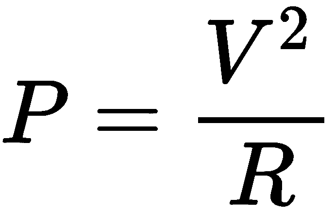
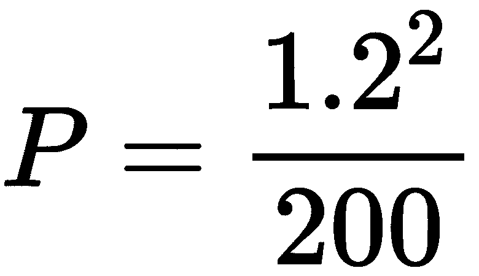
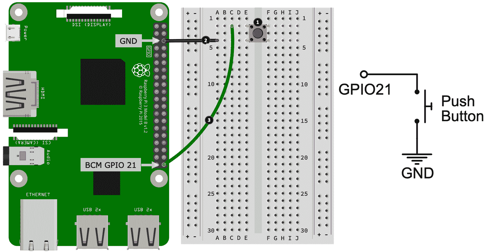
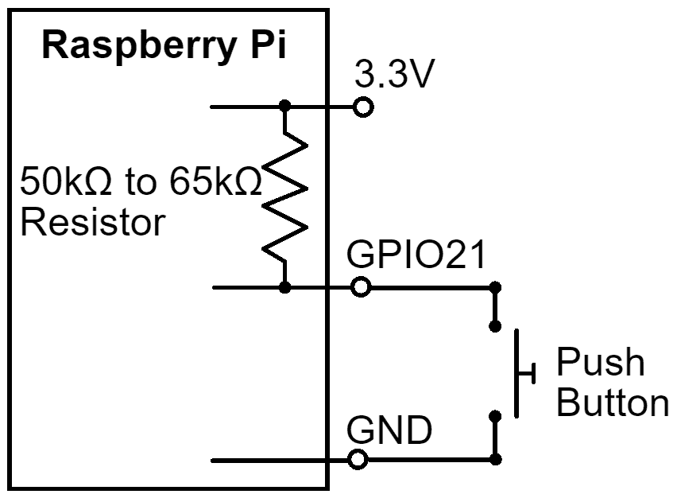
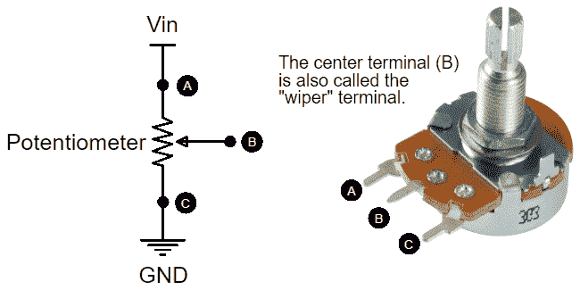
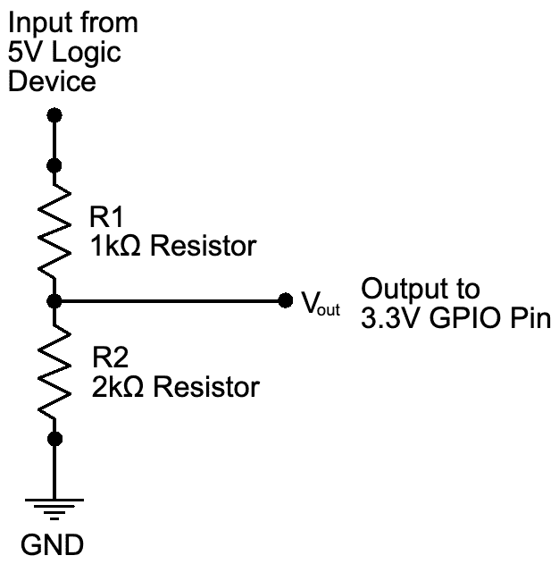
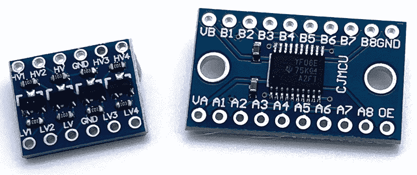
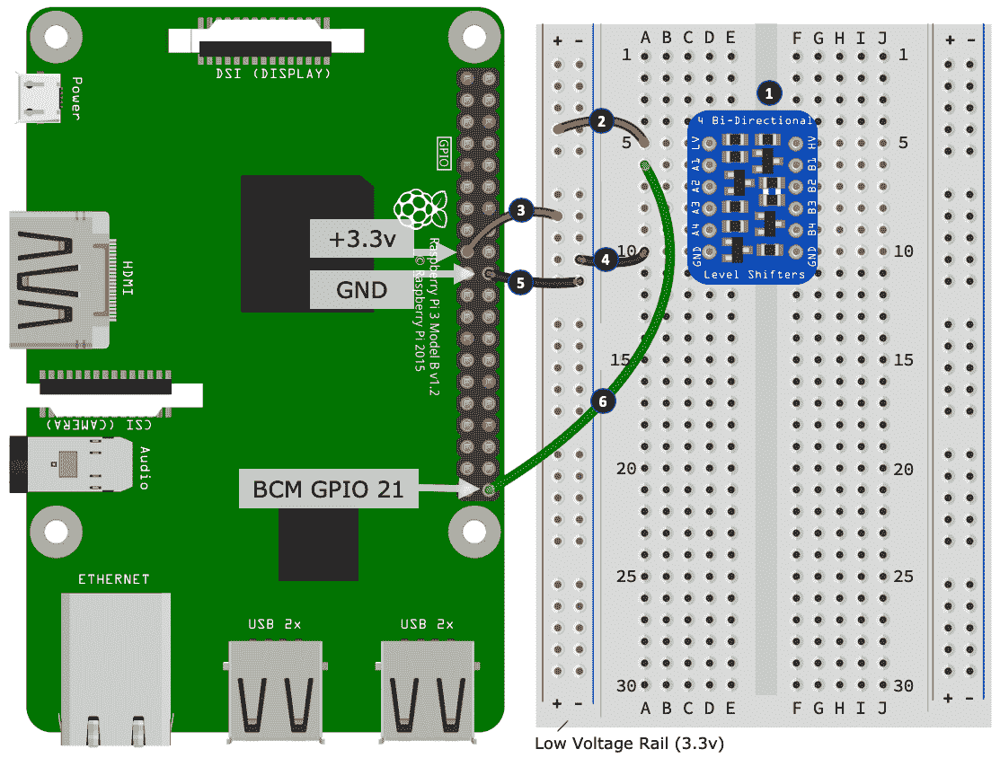

# 八、面向软件工程师的电子 101

到目前为止，在本书中，我们主要关注软件。在这一章中，我们将把重点放在电子学上。我们将通过学习基本的电子概念来实现这一点，这些概念是将基本的电子传感器和执行器与 Raspberry Pi 接口的基础。我们将在本章中学习的内容将为我们将在 To.T0.第 3 节中讨论的许多电路奠定基础。

我们将首先介绍您使用电子产品所需的基本车间工具，并提供实用提示以帮助您购买电子元件。接下来，我们将为您提供一些指导原则，帮助您在使用物理 GPIO 引脚时避免损坏覆盆子 Pi。我们还将讨论电子元件无法帮助您诊断不工作电路的常见方法。

然后我们将进入电子领域！在这里，我们将研究两个重要的电子定律——欧姆定律和基尔霍夫定律——并通过一个实际例子来解释为什么我们在前面几章中使用的电路中使用了 200Ω电阻器来搭配 LED（如果您需要了解此 LED 电路，请参阅[第 2 章](03.html)，*开始使用 Python 和 IoT*。

接下来，我们将探索数字和模拟电子技术，并讨论用于将其与 Raspberry Pi 集成的核心电路和想法。我们将通过学习逻辑电平转换来完成本章，这是一种实用的技术，用于连接在不同电压下工作的电子设备。

本章将介绍以下主题：

*   装修你的车间
*   让你的树莓皮安全
*   电子元件失效的三种方式
*   GPIO 控制的电子接口原理

*   探索数字电子学
*   探索模拟电子学
*   理解逻辑电平转换

# 技术要求

要执行本章中的练习，您需要以下内容：

*   树莓皮 4 B 型
*   Raspbian OS Buster（带桌面和推荐软件）
*   最低 Python 版本 3.5

这些需求是本书中代码示例的基础。只要您的 Python 版本是 3.5 或更高版本，代码示例应该可以工作，而无需修改 Raspberry Pi 3 模型 B 或使用不同版本的 Raspbian OS。

您可以在本书 GitHub 存储库的`chapter06`文件夹中找到本章的源代码：[https://github.com/PacktPublishing/Practical-Python-Programming-for-IoT](https://github.com/PacktPublishing/Practical-Python-Programming-for-IoT) 。

您需要在终端中执行以下命令，以设置虚拟环境并安装本章所需的 Python 库：

```py
$ cd chapter06              # Change into this chapter's folder
$ python3 -m venv venv      # Create Python Virtual Environment
$ source venv/bin/activate  # Activate Python Virtual Environment
(venv) $ pip install pip --upgrade        # Upgrade pip
(venv) $ pip install -r requirements.txt  # Install dependent packages
```

以下依赖项是从`requirements.txt`安装的：

*   **PiGPIO**：PiGPIO GPIO 库（[https://pypi.org/project/pigpio](https://pypi.org/project/pigpio)

本章所需的硬件组件如下：

*   数字万用表。
*   红色 LED（参考数据表–[https://www.alldatasheet.com/datasheet-pdf/pdf/41462/SANYO/SLP-9131C-81.html](https://www.alldatasheet.com/datasheet-pdf/pdf/41462/SANYO/SLP-9131C-81.html) ；点击 PDF 选项）。
*   瞬时**按钮开关**（**SPST**）。

*   200Ω、1kΩ、2kΩ和 51kΩ电阻器。
*   10kΩ电位计
*   基于 4 沟道 MOSFET 的逻辑电平移位器/转换器模块。示例参见*图 6.12*（左侧模块）。

# 装修你的车间

拥有正确的工具和设备对于帮助您组装、构建、测试和诊断电子电路中的问题非常重要。以下是当您深入电子领域并创建如本书所示的电路时所需的基本要素（除电子元件外）：

*   **烙铁**：你需要一个烙铁（和焊料）来做零工，比如将头销连接到分接板上，或者将焊丝连接到组件上，以便将它们插入你的试验板。
*   **焊料**：寻找一种通用 60/40（60%锡和 40%铅）树脂芯焊料，其直径约为 0.5mm 至 0.7mm。
*   **吸锡器/真空装置**：我们都会犯错，所以这个装置可以帮助你去除接头上的焊料，并撤销焊接工作。
*   **湿海绵或抹布**：通过去除堆积的焊料，始终保持烙铁头的清洁–清洁的烙铁头促进清洁的焊接。
*   **剥线器和剥线器**：为您的电子工作准备一套剥线器和剥线器。其他用途的刀片上的切屑和毛刺会降低其性能。
*   **数字万用表（DMM**）：入门级 DMM 适用于一般工作，包括一系列标准功能，如电压、电流和电阻测量。
*   **面包板**：我强烈建议购买两个全尺寸的面包板，并将它们连接在一起，以获得更多的面包板房地产。这将使使用试验板和组件更加容易。
*   **杜邦（跳线）电缆**：这些是与试验板一起使用的导线。他们有不同的类型：男性、女性和女性。你需要把它们混合在一起。
*   **松头插脚**：这些插脚用于将杜邦电缆连接在一起，并用于使非试验板友好组件试验板友好。
*   **外部电源**：这样您就可以从树莓 Pi 外部为电路供电。就本书而言，您至少需要一个能提供 3.3 伏和 5 伏电压的试验板电源。

*   **覆盆子圆周率案例**：确保您的覆盆子圆周率案例。一个没有外壳的覆盆子 Pi 和所有暴露在下面的电子设备是一个即将发生的事故。
*   **GPIO 突破式收割台**：这使得使用覆盆子皮和面包板更加容易。

If you do not already have the aforementioned equipment, keep an eye out for a *soldering iron kit* and a *breadboard starter kit* on sites such as eBay and Banggood. These kits often come bundled with many of the items listed.

这个列表显示了我们需要的基本工具，但是实际的电子产品和小工具呢？我们将在下一步讨论这个问题。

## 购买电子模块和组件

本书中使用的所有组件和模块的目录包含在*附录*中。在本节中，我想提供一些一般提示和指南，以帮助您在购买电子元件时，如果您以前没有做过很多这方面的工作。我们将从一些提示开始，以帮助您购买松散的组件。

### 采购丢失的部件

当涉及到购买松散组件，如电阻器、LED、按钮、晶体管、二极管和其他组件时（我们将在本书*第 3 节*、*物联网游乐场–与物理世界互动的实例*中探讨），以下是一些可以帮助您解决问题的指导原则：

*   获取*附录*中列出的具体部件值和零件号。购买许多备件，因为在学习使用部件时可能会损坏部件。
*   如果您是从易趣或 Banggood 等网站购买，请仔细查看物品的详细信息，最好放大零件的图像并检查显示的零件号。永远不要仅仅依靠上市公司的名称。许多卖家为搜索优化目的在标题中添加了各种术语，这些术语不一定与实际出售的商品相关。
*   在 eBay 和 Banggood 等网站上搜索电子入门工具包等术语。您可能能够在一个事务中找到松散组件的混合包。

这些要点在购买传感器和模块时也适用，我们将在下面讨论。

### 购买开源硬件模块

我相信你知道开源软件，但也有开源硬件。这是一些电子硬件制造商公开发布设计和原理图的地方，这样任何人都可以制造（和销售）硬件。您会发现许多突破性模块（例如我们在[第 5 章](07.html)中使用的 ADS1115 模块，*将您的 Raspberry Pi 连接到物理世界*），这些模块来自不同（或没有）品牌的供应商。不同的供应商也可以用不同的颜色制作他们的模块，虽然不太常见，但也可以使用不同的物理布局。

模块的*核心*或*心脏*——尤其是更简单的模块——通常是单个**集成电路**（**IC**或芯片）。只要核心 IC 和 I/O 引脚相似，通常可以安全地假设电路板将以相同的方式运行。

SparkFun（[https://www.sparkfun.com/](https://www.sparkfun.com/) 和 Adafruit（[http://adafruit.com/](http://adafruit.com/) 是两家生产开放源代码硬件的公司，其他许多公司都克隆了它们。当您从这些公司购买产品时，您将获得的一大优势是，他们的产品通常包括代码示例、教程和有关使用其产品的提示，并且产品质量良好。是的，你可能会多付一点钱，但当你开始工作时，尤其是对于更复杂的电子产品，投资可以为你节省很多时间。发现便宜的克隆产品出现问题并不罕见——因此你需要购买两个或更多的产品来对冲赌注。

我们现在介绍了一些建议和技巧，以帮助您安装车间和购买电子元件。拥有合适的工具并学习如何使用它们（尤其是焊接，如果这是一项新技能，则需要练习），这对于帮助您的电子产品旅程顺利、高效至关重要。有时，购买松散的组件可能会令人困惑，有时容易出错，特别是在规格或标签上的细微差异可能会产生重大实际影响的情况下，因此，如果您不确定，请仔细检查您正在购买的组件。最后，按照*附录*中的建议，采购备件。在电路构建的中途突然停止学习并不是一件有趣的事，因为一个组件被损坏了，你们需要寻找或等待替换品的到来！

接下来，我们将讨论一些指导原则，以帮助您在与电子设备连接时确保覆盆子 Pi 的安全。

# 让你的树莓皮安全

在本节中，我们将介绍一些指导原则和建议，以帮助您在与覆盆子 Pi 进行电子接口时确保其安全。通过谨慎和勤勉，这些指南将帮助您最大限度地减少对覆盆子 Pi 或电子元件的任何潜在损坏。

如果某些电子定向点（如电压和电流）目前没有意义，请不要担心。我们将在本章以及本书*第 3 节**物联网游乐场——与物理世界互动的实例*中讨论这些概念，因此将有更多的上下文：

*   *切勿*向任何输入 GPIO 引脚施加超过 3.3 伏的电压。较高的电压会造成损坏。
*   *切勿*从任何单个输出 GPIO 引脚使用超过 8 mA 的电流（它们可以处理高达~16 mA 的电流，但默认情况下，坚持使用 8 mA 以确保可靠的 GPIO 操作）。A 根据经验，除非您知道自己在做什么，否则不要为 LED 和分接模块以外的任何组件供电。在[第 7 章](10.html)*开启和关闭*中，我们将研究可用于切换更高电流和电压负载的电路。
*   *在多个 GPIO 引脚上使用的*电流不得超过 50 mA。
*   *在配置 GPIO 引脚进行输入时，切勿*使用超过 0.5 mA 的电流。
*   *在连接或断开电路与覆盆子 Pi 的连接或进行任何更改之前，始终*断开电路的电源。
*   *在连接、断开或操作电路之前，始终*停止与 GPIO 引脚交互的任何正在运行的程序。
*   *在给电路通电之前，始终*双*-*检查接线。
*   *从不*替换电路中的随机元件值–它们没有原理图中所示的正确和预期值。
*   如果您在 Raspberry Pi 的监视器上看到闪电图标，或者当您运行程序时监视器变为空白，则该 Pi 会告诉您，您的电路从 Raspberry Pi 吸取了过多的电源。
*   *切勿*直接连接和使用感应负载和机械设备，如电机、继电器或电磁阀，这些设备使用 GPIO 引脚上的磁极。它们会产生太大的电流，导致一种称为*EMF**反激*的现象，这会损坏周围的电子设备，包括您的树莓 Pi。

The power supply you have for your Raspberry Pi should ideally be 3 amps (15 watts). Many phone chargers are rated less than this, and their use is a common reason for seeing the lightning bolt icon (or a blank display) when interfacing simple electronics.

在使用电子设备时，有时组件会损坏或出现故障。让我们简要地看一下这可能发生的方式。

# 电子元件失效的三种方式

使用电子设备不同于软件。在软件世界中，我们可以随心所欲地多次更改代码、中断代码、调试代码和修复代码，而不会造成真正的伤害。我们还可以免费备份和恢复状态和数据。当使用电子产品时，我们没有这种奢侈。我们在物质世界里，如果有什么东西被破坏了，那就是最终的结果！

由部件（包括树莓 Pi）制成的部件和电路可能会因连接错误、电压供应过多、电流供应或来源过多、过热而以多种方式损坏和失效，甚至错误地处理代理组件，使其物理损坏或被来自您身体的静电损坏。

当组件发生故障时，它可能会以几种不同的方式发生故障：

*   它会在一股烟雾中失效，融化，或以其他方式显示其已损坏的物理迹象。
*   它无声地失败，没有故障的可视指示。
*   它被损坏了，但仍然像预期的那样或多或少地工作，但在将来的某个时候，它只是在没有警告的情况下默默地失败。

我们想要的结果是身体上的失败，因为很明显什么失败了，什么需要更换。它还为我们提供了一个起点，让我们可以开始诊断我们的电路。无声故障和延迟故障是痛苦和耗时的，尤其是在启动时。

以下是一些帮助您在启动时构建和调试故障电路的提示：

*   通电前，请务必仔细检查电路。
*   手头有备件。如果您知道可以替换到电路中的良好部件，则诊断和测试电路会容易得多。
*   如果你认为有什么东西损坏了，那么马上把它扔掉。您不需要将故障部件与良好部件混淆，尤其是在没有明显损坏迹象的情况下。

接下来，我们将讨论控制在电路中选择元件的原因和方式的核心电子原理，并用我们的 LED 电路说明这些概念。

# GPIO 控制的电子接口原理

虽然这本书不是一本关于电子理论的书，但是有一些核心原则是非常重要的，因为它们会影响电路设计以及它们如何与 Raspberry Pi 接口。本节的目的是让您基本了解电路为何以特定方式设计，以及这与 GPIO 接口的关系。有了这些基本知识，我希望它能激励您更深入地探索核心思想和原则。您可以在本章末尾的*进一步阅读*部分找到建议的参考资料。

我们将从电子原理的两个最基本的电学原理开始，即*欧姆定律*和*功率。*

## 欧姆定律与功率

欧姆定律是解释*电压*、*电阻*和*电流*相互关系的基本电子学原理。与*功率*原理一起，这些是解释为什么在电路中选择某些值组件的核心基本原理。

欧姆定律表示为以下方程式：


这里，*V*是以伏特为单位测量的电压，*I*（大写 I）是以安培为单位测量的电流，*R*是以欧姆为单位测量的电阻，通常前缀为Ω，希腊语中Ω的符号。

另一方面，功率表示为以下等式：


这里，*P*是以瓦特为单位测量的功率，*I*（大写 I）是以安培为单位测量的电流（与欧姆定律相同），*R*是以欧姆为单位测量的电阻（与欧姆定律相同）。

关于这些方程的基本原理是，在不影响另一个参数的情况下，不能改变电子电路中的一个参数。这意味着在电路中选择和布置元件，以确保电压、电流和功率与单个元件和电路的整体运行成适当比例。

如果你对这个电子世界还不熟悉，而这并没有马上被你所了解，不要灰心丧气！这确实需要时间和练习。除了欧姆定律，我们还有基尔霍夫定律，我们将在下面讨论。

## 基尔霍夫电路定律

基尔霍夫电压定律和电流定律是电路遵循的两个定律。它们是电气工程所必需的两条法律，具体如下：

*   回路中所有电压的代数和必须等于零。
*   进出节点的所有电流的代数和必须等于零。

这和我们将要讨论的这些法律一样深刻。我在这里提到了这些定律，因为电压定律是我们将在下一节中看到的，当我们在前面的章节中计算为什么我们在 LED 电路中使用 200 欧姆电阻器时。

在此基础上，我们简要介绍了三个重要的电气原理或定律——欧姆定律、功率定律和基尔霍夫电路定律。现在是把这些原则付诸实践的时候了。我们将通过一个练习来了解为什么我们在 LED 电路中使用 200Ω串联电阻器。

## 为什么我们在 LED 电路中使用 200 欧姆的电阻器？

到目前为止，在这本书中，我们的电子产品主要是围绕 LED 发展的。我这样做是有充分理由的。LED（和电阻器）是易于使用的组件，为学习欧姆定律、功率和基尔霍夫电压定律等概念提供了基本的构建模块。掌握 LED 电路的基本知识及其背后的计算，您将顺利完成更复杂的元件和电路。

让我们更深入地了解 LED，探索其数据特性，并了解欧姆定律、功率和基尔霍夫电压定律的应用。通过一系列的例子，我们将通过一个过程来解释为什么您在本书前面看到的 LED 电路使用 200 欧姆的电阻器。

下面是一个基本的 LED 电路，类似于我们在本书中迄今为止所使用的。如果您需要对这条线路进行复习，请重新阅读[第 2 章](03.html)、*Python 和 IoT 入门*：


Figure 6.1 – LED and resistor circuit

我们一直在使用一个*典型的*5 毫米*红色*LED。我在这里提取了它的部分*典型*技术规格。强调了*典型*和*红色*的区别，因为 LED 规格确实有所不同，这取决于它们的颜色、最大亮度、物理尺寸和制造商。甚至同一批次的 LED 也会有所不同。

以下是与我们参考的红色 LED 数据表相关的一些核心规范：

*   **正向压降****（V<sub>F</sub>****介于 1.7 和 2.8 伏**之间，典型压降为 2.1 伏。这是 LED 需要点亮的电压。如果电路中的电压不足，LED 将不会点亮。如果有比它需要的更多的东西，那没关系——LED 将只取它需要的东西。

*   **25 mA**的最大连续正向电流**I<sub>F</sub>****。这是在 LED 始终亮起时将其点亮至最大亮度所需的安全电流，对于某些 LED 而言，其亮度可能太高而不舒适。提供较少的电流意味着 LED 将变暗，而提供更多电流可能会损坏 LED。对于我们的 LED 和数据表，当脉冲 LED（例如，使用 PWM）时，最大电流可达（I<sub xmlns:epub="http://www.idpf.org/2007/ops">FP</sub>）100 mA。**

电力呢？LED 是在电压和电流下工作的组件。如果你看功率方程（，你会发现功率是电压（*V*和电流（*I*的函数）。只要您在 LED 的电流额定值范围内工作，您将在其功率公差范围内。

If you do not have a matching datasheet for an LED (which is common when pushing in small quantities), use a voltage drop of 2 volts and a reference amperage of 20 mA for your calculations. You can also use a digital multimeter set to the diode setting to measure the forward voltage for an LED.

让我们继续，看看我们如何得出 R1 电阻的值。

### 计算电阻值

在前面的电路图中，我们有以下参数：

*   电源电压为 3.3 伏
*   LED 典型正向电压为 2.1 伏
*   LED 电流为 20 mA（压降数据表中提到了 mA 的测试条件）

以下是计算电阻器值的过程：

1.  我们的电阻器（标记为 R1）需要降低 1.2 伏，这是我们前面简要提到的基尔霍夫电压定律的简单应用；也就是说，*回路中所有电压的代数和必须等于零*。因此，如果我们的电源电压为+3.3 伏，LED 下降 2.1 伏，那么电阻器必须下降 1.2 伏。这意味着我们得到以下等式：

+3.3V+-2.1V+-1.2V=0V

2.  我们可以用代数方法排列欧姆定律，这样我们可以得到以下结果：


3.  使用此公式，我们计算电阻器的值：


=60Ω（因此，前面电路中的电阻器 R1 为 60Ω）

但这不是 200Ω。到目前为止，我们的示例是连接到 3.3 伏电源的简单 LED 和电阻器电路，而不是 Raspberry Pi。还有很多要考虑的，因为我们需要尊重树莓 Pi 的 GPIO 引脚的当前限制，我们将在下一步做。

### **考虑树莓 Pi 的电流限制**

配置为输出的 GPIO 引脚可安全使用的最大电流为 16 mA。然而，GPIO 引脚有一个可配置的方面，这意味着默认情况下，每个 GPIO 的使用不应超过 8 mA。可以配置此限制，使其达到 16 mA，但这超出了我们的范围。理想情况下，当需要更多电流时，我们希望向外部电路移动，而不是将引脚推得越来越高。我们将在[第 7 章](10.html)*中学习如何打开和关闭*中的内容。

While we want to limit a single GPIO *output* pin to 8 mA, we should not exceed a combined total of ~50 mA over multiple GPIO pins. When it comes to GPIO *input* pins, we should limit the current to 0.5 mA for safe operation when connecting an external input device or component. Connecting an input GPIO pin directly to the Raspberry Pi's +3.3 V or GND pin is fine as the measured current is approximately 70 *micro*amps. (We'll learn how to measure current with a multimeter in [Chapter 7](10.html) , *Turning* *Things On and Off.*)

让我们修改计算并继续此过程：

1.  如果我们将电流限制为 8 mA，我们可以使用之前的方程式得出 R1 的值：


R1=150Ω

2.  电阻器的额定值永远不会精确。它们有一个值公差，如果我们的物理电阻小于 150Ω，根据欧姆定律，我们会增加电路中的电流，超过 8 毫安的限制。

因此，我们将选择稍高的值。这可能与使用经验法则一样简单，例如选择一个标准电阻值 2 大于 150Ω的值，或者将 150Ω乘以我们的电阻公差，然后选择下一个最高的标准值。让我们使用后一种方法，假设我们的电阻器的公差为±20%（顺便说一下，这将是一个质量非常差的电阻器。5%和 10%更常见）：

150Ωx 1.2=180Ω

180Ω恰好是一个标准电阻值，所以我们可以使用它，但我没有（而且你经常会发现，经过计算后，你也没有想要的准确电阻值！）。但是，我有一个 200Ω的电阻器，所以我只使用其中的一个。

对于原型和修补，从 180Ω到约 1kΩ的任何电阻都足以满足我们的电路。只要记住，当你增加电阻值时，你限制了电流，所以 LED 会变暗。

但是通过电阻器的功率和它的额定功率呢？我们将在下一步进行计算。

### 电阻功耗的计算

像我们在面包板中使用的一般用途电阻器，其额定值通常为 1/8 瓦、1/4 瓦或 1/2 瓦。如果你给一个电阻器供电太多，它会随着一股烟烧掉，并发出一股难闻的气味。

下面是我们在使用 3.3 伏电源时如何计算 200Ω电阻器的功耗：

1.  电阻器消耗的功率可通过以下公式计算。请注意，电压*V*是电阻两端的压降，单位为伏特，*R*是电阻，单位为欧姆：



2.  因此，当我们在公式中替换电阻器的压降和电阻值时，我们得到以下结果：



=0.0072 瓦或 7.2 毫瓦（或兆瓦）

3.  我们 7.2 mW 的功率值甚至低于 0.25 瓦的额定电阻器，因此 1/8 瓦或以上的电阻器在我们的电路中是安全的，不会在一股烟雾中烧毁。

如果你认为功率方程与你之前看到的不同，你是对的。这是用电压和电阻改写的功率方程。这是一张方便的图表，我相信你会在你的电子旅程中看到，它以不同的方式表达欧姆定律和功率：


Figure 6.2 – Ohm's Law power wheel

我将给你留下关于 LED 的最后提示，以及一些需要思考的问题。

It's the current that alters the LED's brightness. The 25 mA value from the datasheet is the maximum continuous safe current to drive the LED to its maximum brightness. Less current is fine; it just means the LED will be dimmer.

稍等—在[第 5 章](07.html)*中，将树莓 Pi 连接到物理世界*中，我们使用了 PWM，这是一种用于改变 LED 亮度的伪模拟*电压*。停下来想一分钟……发生了什么事？这只是欧姆定律的应用。在我们的电路中，我们的电阻固定在 200Ω。因此，通过改变电压，我们也会改变电流，从而改变 LED 的亮度。

你怎么认为？请放心，这和本书中的数学一样复杂。然而，我鼓励你重复这些练习，直到你对这个过程感到满意为止。理解电子学的基础知识（以及随之而来的计算）是业余爱好者和工程师之间的区别，前者只是通过反复试验猜测元件，直到电路正常工作，而后者则能真正制造出他们需要的东西。

接下来，我们将探讨与数字电子相关的核心概念。

# 探索数字电子学

数字 I/O 本质上意味着检测或使 GPIO 引脚处于高位或低位。在本节中，我们将探讨核心概念，并查看一些正在运行的数字 I/O 示例。然后，我们将讨论这与您的 Raspberry Pi 以及您将与之接口的任何数字电子组件的关系。我们将通过查看和播放数字输出开始数字 I/O 之旅。

## 数字输出

用简单的电气术语来说，当我们将 GPIO 引脚驱动到高电平时，其电压测量值约为 3.3 伏；当我们将其驱动到低电平时，其电压测量值约为 0 伏。

让我们用万用表观察一下：

Different multimeters may have different connections and labeling than the multimeter illustrated here. Consult your multimeter's manual if you are unsure how to set it up for measuring voltage.

1.  将万用表设置为其电压设置，并将其连接至 GPIO 21 和 GND，如下图所示：


Figure 6.3 – Connecting a multimeter to a GPIO pin

2.  运行以下代码，您可以在`chapter06/digital_output_test.py`文件中找到这些代码。您会注意到仪表在约 0 伏和约 3.3 伏之间切换。我之所以说*关于*，是因为在电子学中没有什么东西是真正完美或精确的；总有公差。下面是代码的概要：

```py
# ... truncated ...
GPIO_PIN = 21
pi = pigpio.pi()
pi.set_mode(GPIO_PIN, pigpio.OUTPUT)           # (1)

try:
    while True:                                # (2)
        # Alternate between HIGH and LOW
        state = pi.read(GPIO_PIN); # 1 or 0
        new_state = (int)(not state) # 1 or 0
        pi.write(GPIO_PIN, new_state);
        print("GPIO {} is {}".format(GPIO_PIN, new_state))
        sleep(3)
# ... truncated ...
```

在第 1 行中，我们将 GPIO 21 配置为一个输出引脚，而在第 2 行中，我们启动了一个`while`循环，将 GPIO 21 的状态在高和低（即 0 和 1）之间交替，每个状态转换之间有 3 秒的延迟。

正如您可能已经注意到的，我们的覆盆子 Pi 的数字输出就是这么简单——高或低。现在，让我们考虑数字输入。

## 数字输入

通常，当我们考虑 3.3 伏设备（如 Raspberry Pi）的数字输入和电压时，我们会考虑将一个引脚连接到地面（0 伏）以使其变低，或将其连接到 3.3 伏以使其变高。在大多数应用程序中，这正是我们将努力做到的。然而，事实上，有更多的故事，因为 GPIO 引脚不只是在两个离散的电压水平运作。相反，它们的工作电压范围将输入引脚定义为高电平和低电平。这适用于 Raspberry Pi 和具有 GPIO、微控制器、IC 和转接板的类似计算机。

考虑下面的图表，它示出了电压在 0 和 3.3 伏之间的连续体，以及三个高亮区域，标记为 Tyt T0。


Figure 6.4 – Digital input trigger voltages

此图告诉我们，如果我们施加的电压介于 2.0 伏和 3.3 伏之间，则输入引脚将读取为数字高电平。或者，如果我们施加的电压介于 0.8 伏和 0 伏之间，引脚将被读取为数字低电平。任何超出这些范围的东西都是一个危险区域，你很可能会损坏你的树莓皮。虽然您可能不会意外地向管脚施加负电压，但由于通常使用 5 伏数字电路，因此意外地向管脚施加超过 3.3 伏的电压确实存在风险。

那么，中间的灰色区域呢？我们是数字高还是数字低？答案是我们不知道，也永远无法可靠地知道。在这个范围内，销被称为*浮动。*

让我们看看浮动销的效果。我们将首先在试验板上创建以下电路：



Figure 6.5 – Push button circuit

以下是这方面的步骤。此处的步骤编号与上图所示的编号黑色圆圈相匹配：

1.  将按钮放在试验板上。
2.  将按钮的一条腿连接到覆盆子 Pi 上的 GND 引脚。在图中，我们连接按钮的最下端（如孔 E4 所示）。
3.  最后，将按钮的另一条腿（在图中，这是最上面的一条腿，如 E2 孔所示）连接到 Rasberry Pi 上的 GPIO 21。

现在完成电路构建，让我们测试电路，看看会发生什么：

1.  运行以下代码，可以在`chapter06/digital_input_test.py`文件中找到：

```py
# ... truncated...
GPIO_PIN = 21
pi = pigpio.pi()
pi.set_mode(GPIO_PIN, pigpio.INPUT)   # (1)
# ... truncated...

try:
   while True:                        # (2)
   state = pi.read(GPIO_PIN)
   print("GPIO {} is {}".format(GPIO_PIN, state))
   sleep(0.02)

except KeyboardInterrupt:
   print("Bye")
   pi.stop() # PiGPIO cleanup.
```

此代码将 GPIO21 配置为第（1）行的输入。在第（2）行，使用`while`循环，我们快速读取 GPIO 引脚的值（1 或 0），并将其打印到终端。

2.  用手指触摸试验板上的电线，以及开关周围任何裸露的金属触点。电线和触点的作用类似于接收电噪声的天线，您应该可以看到终端输出在高（1）和低（0）之间波动–这是一个*浮动*引脚。这也说明了一个常见的误解，即为输入配置的 GPIO 引脚在默认情况下总是很低的。

如果您最初的想法是“*哇！我可以因为这个*而创建一个触摸开关”，那么对不起；你会失望的——它不可靠，至少没有额外的电子设备。

接下来，我们将研究两种常见的避免浮动销的方法。

## 使用上拉和下拉电阻器

当一个引脚没有连接到任何东西时，它被称为是浮动的。如前一个例子所示，它*漂浮在*周围，从附近的其他组件、连接到它的电线和来自你自己的电荷中拾取周围的电噪声。

再次参考上图，当按下*按钮*时，电路完成，GPIO 21 接地，因此我们可以肯定地说引脚低。正如我们刚才看到的，当按钮*未按下*时，GPIO 21 浮动–由于外部噪音，它可以在高和低之间波动。

这需要校正，我们可以通过两种方式来实现——使用电阻器或代码。

### 电阻解决方案

如果我们在电路中添加一个外部电阻器，如下图所示，那么我们将引入一个称为*上拉电阻器*，其作用是*将*（表示连接）GPIO 引脚 21*上拉*（表示连接到正电压）至 3.3 伏：


Figure 6.6 – Push button circuit with a pull-up resistor

以下是在试验板上创建此回路的步骤。此处的步骤编号与上图所示的编号黑色圆圈相匹配：

1.  把按钮放在你的实验板上。
2.  将电阻器（电阻值在 50kΩ到 65kΩ之间）放在试验板上。电阻器的一端与按钮的上部定位支腿共用同一行（如孔 B5 所示）。电阻器的另一端放在空行上。
3.  将电阻器的另一端连接到 Raspberry Pi 上的 3.3 伏引脚。
4.  将按钮的小腿连接到 Raspberry Pi 上的 GND 引脚。
5.  最后，将按钮的上支腿和电阻器的下支腿（如保持 D5 所示）共享的行连接到 Raspberry Pi 上的 GPIO 21。

现在您已经创建了回路，下面简要介绍其工作原理：

*   当按钮*未**按下*时，电阻器*将*GPIO 21*向上拉*至 3.3 伏引脚。电流沿此路径流动，引脚将被读取为保证数字高电平。

*   当按下按钮*时*，将创建 GPIO 21 接地的电路段。由于此路径的电阻较小（接近零），因此会有更多的电流流过，因此 GPIO 引脚会连接到地上，因此读数将为低。

在`chapter06/digital_input_test.py`中运行相同的代码，只是这一次，当您触摸导线时，输出*不应*波动。

If your circuit does not work and your wiring is correct, try rotating your push button 90 degrees on the breadboard.

为什么在上图中使用 50kΩ至 65kΩ电阻器？继续阅读–当我们看到一个基于代码的替代方案，而不是使用我们自己的物理电阻器时，我们会发现原因。

### 代码解决方案

我们可以通过告诉 Raspberry Pi 激活嵌入式上拉电阻器并将其连接到 GPIO 21 来解决代码中的浮动引脚情况，根据 Raspberry Pi 的文档，GPIO 21 将在 50kΩ-65kΩ的范围内，因此我们在上图所示的电路中规定了该范围。

下图所示的电路与上图所示类似，但外部电路中没有物理电阻器。我在 Raspberry Pi 图中添加了一个电阻器，以说明在 Raspberry Pi 的电路中隐藏着一个物理电阻器，尽管我们看不到它：



Figure 6.7 – Push button circuit using an embedded pull-up resistor

让我们在代码中启用上拉电阻器并测试此电路。以下是您需要遵循的步骤：

1.  本例使用*图 6.5 所示的按钮电路。*继续之前，请在您的试验板上重新创建此电路。
2.  接下来，编辑`chapter06/digital_input_test.py`文件以启用内部上拉电阻器，如下所示：

```py
#pi.set_pull_up_down(GPIO_PIN, pigpio.PUD_OFF) <<< COMMENT OUT THIS LINE
    pi.set_pull_up_down(GPIO_PIN, pigpio.PUD_UP)   <<< ENABLE THIS LINE    
```

3.  再次运行`chapter06/digital_input_test.py`文件。按下按钮时，应能看到终端上的高/低（0/1）值发生变化；但是，触摸按钮的导线或端子不应造成任何干扰。

当读取上述代码并观察终端输出时，如果终端在*按钮未按下**按钮*时打印`1`，在*按钮按下*（即按下按钮=引脚低）时打印`0`的事实在编程意义上似乎有点向后，那么你是对的，也是错的。这是因为你作为一个程序员在看电路。我是故意这么做的，因为这是您经常看到的配置。这被称为*低电平激活*，这意味着当引脚处于低电平时，按钮处于激活（按下）状态。

相反的电阻器设置也是可能的，并且同样有效。也就是说，默认情况下，您可以设计 GPIO 21 接地的电路，在这种情况下，我们使用的是一个*下拉*电阻器，无论它是物理电阻器还是在代码中激活的嵌入式电阻器。在这个场景中，您将看到当按下按钮时，pin 读数为 1（高），在代码中可能会感觉更舒服！

作为练习，尝试更改回路和代码，使其默认为下拉式。

When reading a digital input circuit, you need to read the circuit in combination with the code that accompanies it, or in respect to the code you will write. Overlooking how pull-up or pull-down resistors are used can be the basis for seemingly simple digital input circuits not working.

既然我们知道我们可以有物理的和代码激活的上拉和下拉电阻器，我们能说一种方法比另一种更好吗？简而言之，是的，有时……外部电阻器确实有优势。

外部上拉或下拉电阻器的优点是它们始终存在。代码激活的上拉和下拉仅在满足两个条件时出现：

*   您的覆盆子 Pi 已通电。
*   您已运行激活上拉或下拉的代码。在这之前，销是浮动的！我们将看看[第 7 章](10.html)*中的一个应用，其中我们更喜欢外部下拉电阻器来打开和关闭东西。*

这并不是说代码激活的上拉和下拉电阻是低劣的，它只是意味着当你的 Raspberry Pi 断开或者你没有运行代码时，你需要考虑一个浮动引脚对你的电路的影响。

我们现在已经介绍了数字输入和输出的基础知识，在许多方面，数字输入和输出是电子接口的支柱。我们还了解到，数字输入不仅仅是高/开或低/关状态，阈值电压水平实际上决定了什么样的电压水平被视为 Raspberry Pi 的数字高或数字低。除此之外，我们还了解到，在处理数字输入时，有必要适当地使用上拉或下拉电阻器，以使输入电路可靠且可预测–即，它不会*浮动。*

在设计可预测的数字输入电路时，您对数字 I/O 的理解将对您有所帮助（浮动引脚和缺失或错误使用的上拉或下拉电阻器是启动时常见的错误源！）。此外，当您与非 Raspberry Pi 设备和电子设备集成时，您对阈值数字高/低电压电平的理解将非常有价值。在本章后面的*逻辑电平转换*n 部分，我们将再次讨论这个数字电压主题。

现在，让我们从数字开始，探索模拟电子技术。

# 探索模拟电子学

正如我们在上一节中看到的，数字 I/O 都是由电压决定的离散高或低。另一方面，模拟 I/O 与电压的度数有关。在本节中，我们将探讨一些核心概念，并查看运行中模拟 I/O 的示例。

## 模拟输出

在[第 5 章](07.html)*将树莓 Pi 连接到物理世界*中，我们讨论了通过在数字输出引脚上使用 PWM，我们可以创建伪模拟输出或可变输出电压的外观。此外，我们在[第 3 章](04.html)中也看到了 PWM 的使用，*使用 Flask*与 RESTful API 和 Web 套接字联网，当时我们使用这个概念来控制 LED 的亮度。

在本节中，我们将通过一个简短的练习进一步探讨 PWM 的基本思想。我们的示例与之前针对数字输出执行的示例类似，只是这次，我们使用 PWM 在 GPIO 引脚上产生变化的电压。以下是我们需要遵循的步骤：

1.  将万用表连接到 Raspberry Pi，就像我们在*图 6.3*中对数字输出所做的那样。
2.  运行以下代码，您可以在`chapter06/analog_pwm_output_test.py`文件中找到这些代码。
3.  代码运行时，万用表将逐步通过不同的电压范围。根据此处显示的终端屏幕输出，它们并不精确，但应足够接近，以说明意图：

```py
(venv) $ analog_pwm_output_test.py
Duty Cycle 0%, estimated voltage 0.0 volts
Duty Cycle 25%, estimated voltage 0.825 volts
Duty Cycle 50%, estimated voltage 1.65 volts
Duty Cycle 75%, estimated voltage 2.475 volts
Duty Cycle 100%, estimated voltage 3.3 volts
```

让我们看一看代码，这里复制了部分代码。

它使用 PiGPIO 的硬件定时 PWM，在第 1 行上配置，而在第 2 行上定义了一组占空比百分比。这些是我们的代码将在第 3 行中逐步通过的占空比值。在第 4 行，我们在休眠 5 秒之前设置 GPIO 21 的占空比，以便您可以读取端子和万用表上的值：

```py
# ... truncated ...
pi.set_PWM_frequency(GPIO_PIN, 8000)                       # (1)

duty_cycle_percentages = [0, 25, 50, 75, 100]              # (2)
max_voltage = 3.3

try:
    while True:                                  
       for duty_cycle_pc in duty_cycle_percentages:        # (3)
           duty_cycle = int(255 * duty_cycle_pc / 100)
           estimated_voltage = max_voltage * duty_cycle_pc / 100
           print("Duty Cycle {}%, estimated voltage {} volts"
                 .format(duty_cycle_pc, estimated_voltage))
           pi.set_PWM_dutycycle(GPIO_PIN, duty_cycle)      # (4)
           sleep(5)

# ... truncated ...
```

如果您需要从 Raspberry Pi 提供更真实的模拟输出，那么您可能想探索如何使用**数模转换器**（**DAC**。它们通常通过 I2C 或 SPI 接口，您将通过类似于 ADS1115 ADC 的驱动程序库控制它们，只是您将输出一个变化的电压，而不是读取一个。

现在我们已经讨论了模拟输出，并看到了一个如何使用 PWM 创建模拟输出的简单示例，接下来，我们将看看模拟电子设备的输入端。

## 模拟输入

在[第 5 章](07.html)*中，我们将树莓 Pi 连接到物理世界*中，我们学习了如何使用 ADS1115 ADC 断开模块，模拟输入是关于测量预定义范围内的电压，就我们而言，该范围介于 0 伏和 3.3 伏之间。而在数字 I/O 中，我们会说在引脚上测量的 0 伏表示低，3.3 伏表示高，在模拟 I/O 中，在这方面没有高或低的概念。

许多简单的模拟元件和传感器的工作原理是，它们的电阻随测量值的变化而变化。例如，**光相关电阻器**或**LDR**根据其检测到的光按比例改变其电阻。然而，模拟输入都是关于测量电压的。为了把一个变化的电阻变成一个变化的电压，我们使用了一个分压器电路。

### 分压器

下图显示了一个简单的双电阻分压器电路。我们的电阻值在本例中是固定的，以说明基本原理。请注意，本例中我们使用了 5 伏电压。当我们讨论逻辑电平转换时，将很快揭示其原因：


Figure 6.8 – Measuring voltages across a voltage divider

这是电子学和电阻器的一个原理，串联电阻器上的电压*下降*与其电阻成比例。在前面的电路中，R1 的电压是 R2 的两倍，所以它的电压降是 R2 的两倍。这是适用于前面电路的基本公式（实际上又是基尔霍夫定律和欧姆定律的应用）：


V<sub>输出</sub>=5 伏 x2000Ω/（1000Ω+2000Ω）

V<sub>输出</sub>=3.33333 伏

我们将在*第 3 节**物联网游乐场——与物理世界互动的实例*中看到分压器的应用，但现在，为了在实践中看到这一原理并帮助巩固这一概念，在上图中标记的点上使用数字万用表，以验证测量的电压是否接近指示值；R1（上图中的 A 点和 B 点）上的电压约为 1.6 伏，R2（B 点和 C 点）上的电压约为 3.3 伏。R2（B 点和 C 点）上的测量值为上式中的*V<sub>out</sub>*。

电阻值的选择如何？对于分压器，电阻值选择中最重要的部分是它们的相对比率，以我们想要的方式分压。除此之外，还涉及到电流和电阻器额定功率——同样，这些都是欧姆定律和功率的应用。

还记得[第 5 章](07.html)中的电位计吗？*将树莓圆周率连接到物理世界*？它们实际上是分压器！我们将中间的雨刮器连接到 ADS1115 的 AIN1 和 AIN2，当您转动电位计上的刻度盘时，您所做的是改变端子 A 和 B 之间相对于中央雨刮器的电阻，从而产生 ADS1115 读取的可变电压。

下图显示了电位计与语义图的关系。A 点、B 点和 C 点与前面电路中所示的点相当：



Figure 6.9 – A potentiometer is a voltage divider

让我们进行一个实验，通过创建如下所示的电路，了解电位计如何充当分压器：


Figure 6.10 – A potentiometer circuit

下面是要遵循的第一组步骤。此处的步骤编号与上图所示的编号黑色圆圈相匹配：

1.  将 10kΩ电位计放在试验板上。您会注意到，我已经标记了端子 A、B 和 C，以便它们与*图 6.9*中所示的标签相匹配。
2.  将电位计的外部端子（标有 A）连接到 Raspberry Pi 上的 3.3 伏引脚。在这个电路中，我们只使用树莓 Pi 作为电源。如果需要，您可以使用外部电源或电池。
3.  将电位计的备用外部端子（标有 C）连接至 Raspberry Pi 接地引脚。
4.  将万用表的电压测量引线连接到电位计的中间端子（标有 B）。
5.  将万用表的*com*端子连接到 GND（在我们的示例中，它由标有 C 的电位计端子共享）。
6.  打开万用表并选择其电压模式。

现在，打开万用表，转动电位计刻度盘，观察万用表上的电压读数在~0 伏和~3.3 伏范围内的变化。

现在，我们对模拟电子学的介绍到此结束。我们进行了一个简单的练习，用万用表演示和可视化 PWM 如何产生可变输出电压。我们还了解了*分压器*，它们是如何工作的，以及为什么它们是任何模拟输入电路的关键部分。最后，我们再次回顾了*电位器*，并研究了它们如何作为可变*分压器*工作。

这些模拟概念虽然相对简短，但却是每个电子工程师——无论你是专业人士还是爱好者——都需要理解的模拟电路的两个核心原则。这些概念——特别是*分压器*——将在接下来的章节中出现在许多电路中（我们将把它们与 ADS1115 模数转换器结合使用），因此请仔细阅读前面的示例和原理，以确保您掌握基本知识！

接下来，我们将讨论逻辑电平转换，并研究分压器的另一个实际应用，仅此一次是在*数字输入*空间。

# 理解逻辑电平转换

有时，您需要通过 Raspberry Pi 的 3.3 伏 GPIO 引脚与 5 伏设备进行接口。该接口可用于 GPIO 输入、输出或双向 I/O。用于在逻辑电平电压之间转换的技术称为*逻辑电平转换*或*逻辑电平转换*。

有多种技术可用于转换电压，我们将在本节中介绍两种更常见的技术。一个使用分压器电路，我们在前面的标题下讨论过，而另一个使用专用的逻辑电平移位模块。我们的第一个逻辑电平转换的例子是看一个基于电阻器的解决方案，称为*分压器*。

## 作为逻辑电平转换器的分压器

由适当选择的电阻器构成的分压器电路可用于*将*从 5 伏下移到 3.3 伏，允许您使用设备的 5 伏输出作为 3.3 伏 Raspberry Pi 引脚的输入。

To be crystal clear in your understanding and learning, in this section, we are dealing with *digital* electronics, specifically digital input and the application of a *voltage divider* within a digital input circuit. For your own learning and understanding, please ensure that, after completing this chapter, you are comfortable with the basic practical differences and application of a *voltage divider* in both analog and digital circuits.

下图是我们之前在*图 6.8 中看到的相同示例，*只是这次，它是在不同的上下文中绘制的；也就是说，显示如何将 5 伏输入*下移*至 3.3 伏：



Figure 6.11 – Using a voltage divider as a logic-level shifter

分压器不能将电压从 3.3 伏向上移动到 5 伏。但是，请回想一下我们关于数字输入的讨论和*图 6.4*，在图中，我们解释了只要电压为>=~2.0 伏，输入引脚如何读取数字高电平。好的，同样的情况通常也适用于 5 伏电路——只要输入电压为>=~2.0 伏（即 3.3 伏），5 伏逻辑将记录为逻辑高。当施加<=~0.8 伏的电压时，数字低电平也以同样的方式工作。

这种情况经常发生，不过您需要查看有关 5 伏设备的详细信息和数据表。它可以明确地提到最小电压，也可以简单地提到它将使用 3.3 伏逻辑。如果没有支持 3.3 伏逻辑的设备的明显指示，您可以始终使用 3.3 伏自己进行测试。这样做是安全的，因为 3.3 伏小于 5 伏，这意味着没有损坏的风险。在最坏的情况下，它将无法工作或工作不可靠，在这种情况下，您可以使用专用的逻辑电平转换器。我们将在下一步讨论这个问题。

## 逻辑电平转换器 IC 和模块

分压器电路的另一种选择是专用逻辑电平移位器或转换器。它们以 IC（芯片）形式出现，并具有对试验板友好的分接模块。因为它们或多或少都是即插即用的，并且它们包括多个通道，所以它们可以同时转换多个 I/O 流，所以不需要数学运算。

下图显示了典型的 4 通道（左）和 8 通道（右）逻辑电平转换分接模块。左侧的 4 通道使用 MOSFET 构建，而右侧的 8 通道使用 TXB0108 IC。请注意，虽然我们将在*[第 7 章](10.html)*开启和关闭*中介绍 MOSFET，但我们的重点将是将 MOSFET 用作开关，而不是逻辑电平转换应用：*

 *

Figure 6.12 – Logic-level converter breakout modules

逻辑级 s 换档模块也有两半–一个*低压*侧和一个*高压*侧。关于 Raspberry Pi，我们将其 3.3 伏引脚和 GPIOs 连接到低压侧，然后将另一个更高电压电路（例如，5 伏电路）连接到高压侧。

The forthcoming example will be based around a module similar to the 4-channel MOSFET module pictured previously, which has an LV and HV Terminal, and two GND Terminals. If you are using a different module, you may need to consult its datasheet and adjust the wiring appropriately for use in the example.

让我们看看级别转换的实际效果。我们将通过构建电路和测量电压来实现这一点。之前，在*数字输出*部分，我们将万用表直接连接到 Raspberry Pi GPIO 引脚，并观察到当 GPIO 高时，万用表读数约为 3.3 伏。这一次，我们将万用表连接到逻辑电平转换器的高压侧，观察 GPIO 引脚高时万用表的读数是否为 5 伏。

我们将从构建电路开始，我们将分两部分进行：



Figure 6.13 – Visualizing 3.3-volt to 5-volt level shifting (part 1 of 2)

下面是要遵循的第一组步骤，其中我们放置连接逻辑电平转换器低压侧的组件。此处的步骤编号与上图所示的编号黑色圆圈相匹配：

1.  将逻辑电平转换器放在试验板上。
2.  将逻辑电平转换器的 LV（低压）端子连接到左侧电源轨的正极侧。我们将此导轨称为*低压导轨*，因为它将连接到较低的电源电压（即 3.3 伏）。低压端子是逻辑电平转换器的低压侧电源输入端子。
3.  将*低压导轨*的正极连接至 Raspberry Pi 上的 3.3 伏电源引脚。

4.  将逻辑电平转换器低压侧的 GND 端子连接至*低压轨*上的负极轨。
5.  将*低压导轨*上的负极导轨连接到 Raspberry Pi 上的 GND 引脚。
6.  最后，将逻辑电平转换器上的端口 A1 连接到 Raspberry Pi 上的 GPIO 21。

接下来，我们将连接逻辑电平转换器的高压侧，并连接万用表：


Figure 6.14 – Visualizing 3.3-volt to 5-volt level shifting (part 2 of 2)

下面是要遵循的第二组步骤。此处的步骤编号与上图所示的编号黑色圆圈相匹配：

1.  将右侧电源导轨上的正极导轨连接到 Raspberry Pi 上的 5 伏针脚。我们将此导轨称为*高压导轨*，因为它将连接到较高的电源电压（即 5 伏）。高压端子是逻辑电平转换器的高压侧电源输入端子。

2.  将*高压轨*的负轨连接到*低压轨的负轨上。*您可能还记得，所有 GND 连接在电路中都是通用的。如果您需要更新此概念，请重新访问[第 2 章](03.html)*Python 和 IoT 入门*中的*介绍接地连接和符号*部分。
3.  将逻辑电平转换器的高压端子连接到*高压轨*的正极侧。
4.  将逻辑电平转换器高压侧的 GND 端子连接到*高压轨*的负轨上。
5.  将万用表的*电压*测量端子连接到逻辑电平转换器的 B1 端口。
6.  将万用表的*com*端子连接到*高压导轨的负极导轨上。*
7.  最后，将万用表设置为电压模式。

现在我们已经构建了电路，让我们运行 Python 程序，确认当 GPIO 21 高时，万用表的读数为~5 伏。以下是我们需要做的：

1.  运行`chapter06/digital_output_test.py`文件中的代码–这与我们之前在标题为*数字输出*的部分中用于数字输出的代码相同。
2.  在低压侧，我们的 Raspberry Pi 在通道 1 端口 A1 上的低（0 伏）和高（3.3 伏）之间脉冲 GPIO 21，而在高压侧，连接到通道 1 端口 B1 的万用表将在 0 和~5 伏之间交替，说明 3.3 伏逻辑电平高电平到 5 伏逻辑电平高电平的转换。

相反的情况也是可能的；也就是说，如果将 5 伏输入应用于高压侧，它将在低压侧转换为 3.3 伏，可以通过 3.3 伏 Raspberry Pi GPIO 引脚安全地读取为输入。

构建这个反向场景是一个你可能想自己尝试的练习——你已经具备了实现这一点的核心知识、代码和电路；你只需要把一切都连接起来！我鼓励你尝试一下，为了让你开始，这里有一些提示：

*   在试验板上放置一个按钮和上拉电阻器，并将其连接到逻辑电平转换器高压侧的端口 B1。该电路（示意图）与您之前在*图 6.6*中看到的相同，只是电源现在为 5 伏，GPIO 引脚现在为端口 B1。
*   为了测试您的电路，您可以使用我们之前使用的相同数字输入代码，可以在`chapter06/digital_input_test.py`文件中找到。

*   如果您被卡住，需要参考试验板布局，或者希望检查电路构建，您可以在`chapter06/logic_level_input_breadboard.png`文件中找到试验板布局。

When using a logic-level converter IC, breakout module, or a voltage-divider as a level shifter, always test the input/output voltages with your multimeter before connecting them to an external circuit or your Raspberry Pi. This check will ensure you have wired the converter correctly and that the voltages have been shifted as you intended.

让我们通过比较两种方法来结束级别转换的讨论。

## 比较分压器和逻辑电平转换器

一种方法比另一种好吗？这要视情况而定，尽管我会说专用转换器总是比基本分压器更出色，而且它们与试验板一起使用时也不那么麻烦。分压器制造成本较低，但只能在直接方向上工作（需要两个分压器电路来执行双向 I/O）。它们还具有相对较高的电阻，这意味着在可变电阻变化和可测量电压变化之间存在实际延迟。这种延迟足以使简单的分压器不适用于在高电平和低电平之间快速切换的电路。专用逻辑电平转换器克服了这些限制，而且它们是多通道、双向、更快和更高效的。

# 总结

本章首先简要介绍了您在深入了解电子和电路时所需的基本工具和设备，我们将在*第 3 节*（我们将在下一章开始介绍）。然后，我们讨论了一些建议，以帮助您在将电子设备连接到其 GPIO 引脚时确保 Raspberry Pi 的安全，以及在购买组件时的一些提示。

然后，我们研究了欧姆定律（以及非常简单的基尔霍夫定律），然后研究了 LED 电路使用 200 欧姆电阻器的原因和计算。我们以数字电路的电子特性为例，探讨了逻辑电压电平、浮动引脚、上拉和下拉电阻器。然后我们研究了模拟电路，并通过一个分压器电路的例子进行了研究。本章结束时，我们将介绍逻辑电平转换以及如何将 5 伏逻辑设备与 3.3 伏逻辑设备（如 Raspberry Pi）连接起来。

本章的目的是向您介绍基础电子学的基本电子原理，特别是与设备（如树莓 Pi）的电子接口。我还试图解释这些原则背后的基本原因，以及它们如何影响为电路选择的元件。有了这些信息，您现在应该能够更好地理解如何构建简单的电路来使用 Raspberry Pi。

此外，您可以利用这种理解作为进一步发展和提高电子技能的起点。您可以在*进一步阅读*一节中找到有用的电子网站的链接，此外，在我们继续阅读*第 3 节**物联网游乐场*的过程中，我们将看到许多这些原则正在使用。

当您准备好开始时，我将在下一章中与您见面，这也是*第 3 节*、*物联网游乐场*的开始，我们将探讨不同的开关方法。

# 问题

最后，以下是一系列问题，供您测试有关本章内容的知识。您可以在本书的*评估*部分找到答案：

1.  您有一个需要 200Ω电阻器的电路，但您只有 330Ω电阻器可用。使用此值是否安全？

2.  替换电路中的高值电阻器，但电路不工作。关于欧姆定律，有什么问题？
3.  您使用欧姆定律为电路计算了一个合适的电阻值，但当您给电路通电时，电阻开始变色并冒烟。为什么？
4.  假设 GPIO 21 通过 Python 配置为输入引脚，并通过导线直接连接到+3.3 伏引脚，`pi.read(21)`将返回什么值？

5.  您设置了一个按钮，当按下该按钮时，它将 GPIO 21 连接到 GND 引脚。当*未按下*按钮时，您会注意到您的程序不稳定，似乎收到了幻影按钮按下。有什么问题吗？
6.  您需要将一个在 5 伏电压下操作其输出引脚的设备连接到 Raspberry Pi GPIO 输入引脚。您如何安全地执行此操作？
7.  正确或错误–电阻分压器电路可用于将 3.3 伏输入转换为 5 伏，以便与 5 伏逻辑输入设备一起使用。

# 进一步阅读

以下两个网站都是电子制造商，它们都提供各种中级入门教程。他们专注于电子学的实际方面，不会用太多的理论轰炸你。尝试在他们的网站上搜索*树莓皮*：

*   [https://learn.adafruit.com](https://learn.adafruit.com/)

*   [https://learn.sparkfun.com](https://learn.sparkfun.com/)

关于我们在本章中介绍的概念，以下是上述网站上的一些具体链接：

*   关于 LED 的所有内容：[https://learn.sparkfun.com/tutorials/light-emitting-diodes-leds](https://learn.sparkfun.com/tutorials/light-emitting-diodes-leds)

*   欧姆定律、功率和基尔霍夫定律入门：[https://learn.sparkfun.com/tutorials/voltage-current-resistance-and-ohms-law](https://learn.sparkfun.com/tutorials/voltage-current-resistance-and-ohms-law)

*   分压器：[https://learn.sparkfun.com/tutorials/voltage-dividers](https://learn.sparkfun.com/tutorials/voltage-dividers)

*   上/下拉电阻器：[https://learn.sparkfun.com/tutorials/pull-up-resistors/all](https://learn.sparkfun.com/tutorials/pull-up-resistors/all)

*   电阻器和颜色代码：[https://learn.sparkfun.com/tutorials/resistors](https://learn.sparkfun.com/tutorials/resistors)

如果您想深入了解，以下两个网站是优秀的（免费）资源，涵盖了电子基础知识和理论的各种主题：

*   [https://www.allaboutcircuits.com](https://www.allaboutcircuits.com/textbook/)

*   [https://www.electronics-tutorials.ws](https://www.electronics-tutorials.ws/)

我建议花点时间在这些网站上点击一下，了解一下它们包括哪些内容。这样，如果你在本书中遇到一个电子术语、组件或概念，你想进一步探索，你就会知道从哪里开始调查。以下是开始探索的两个链接：

*   [https://www.electronics-tutorials.ws/category/dccircuits](https://www.electronics-tutorials.ws/category/dccircuits) （直流电路理论）

*   [https://www.allaboutcircuits.com/textbook/direct-current](https://www.allaboutcircuits.com/textbook/direct-current/) （直流电路理论）

如果你浏览这些网站上的索引，你会发现包括欧姆定律、功率、基尔霍夫定律、分压器、数字和模拟电子学在内的部分。*