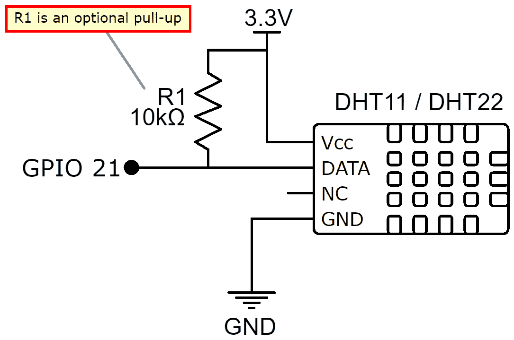
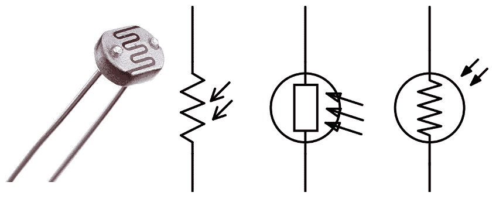
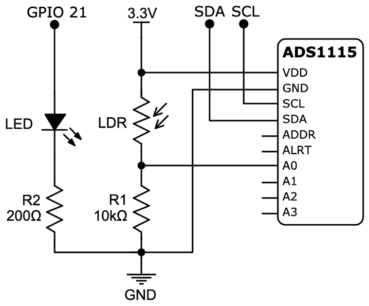

# 十一、测量温度、湿度和光照水平

在上一章中，我们探讨了使用 RGB LED 进行着色的两种方法–使用普通 RGB LED 和可寻址 APA102 RGB LED 条。我们还学习了如何使用简单的 OLED 显示屏，以及如何使用无源蜂鸣器使用 PWM 播放音乐。

在本章中，我们将介绍一些用于收集环境数据的常用组件和电路，包括温度、湿度、黑暗还是光明，以及如何检测湿度。

我们将学习的电路和代码示例对于构建和试验您自己的环境监测项目非常有用。这些电路可被视为测量环境条件的输入或传感器电路。举例来说，你可以结合[第 7 章](10.html)*开关*中的电路思想和示例，在土壤干燥时打开水泵给植物浇水，或者在天黑时打开低压 LED 灯。事实上，我们在[第 13 章](16.html)、*物联网可视化和自动化平台*中有一个可视化平台的示例，我们将使用本章中的一个电路捕获、记录和可视化历史温度和湿度数据！

此外，在本章中，我们将看到模拟电子学和相关概念（如分压器）的实际示例，我们在[第 6 章](08.html)、*软件工程师电子 101 中了解到了这一点。*

以下是我们将在本章中介绍的内容：

*   测量温度和湿度
*   探测光
*   检测水分

# 技术要求

要执行本章中的练习，您需要以下内容：

*   树莓皮 4 B 型
*   Raspbian OS Buster（带桌面和推荐软件）
*   最低 Python 版本 3.5

这些需求是本书中代码示例的基础。只要您的 Python 版本是 3.5 或更高版本，就可以合理地期望代码示例在 Raspberry Pi 3 Model B 或不同版本的 Raspbian OS 上无需修改即可工作。

您可以在 GitHub 存储库的`chapter09`文件夹中找到本章的源代码，该文件夹位于[https://github.com/PacktPublishing/Practical-Python-Programming-for-IoT](https://github.com/PacktPublishing/Practical-Python-Programming-for-IoT) 。

您需要在终端中执行以下命令，以设置虚拟环境并安装本章代码所需的 Python 库：

```py
$ cd chapter09              # Change into this chapter's folder
$ python3 -m venv venv      # Create Python Virtual Environment
$ source venv/bin/activate  # Activate Python Virtual Environment
(venv) $ pip install pip --upgrade        # Upgrade pip
(venv) $ pip install -r requirements.txt  # Install dependent packages
```

以下依赖项是从`requirements.txt`安装的：

*   **PiGPIO**：PiGPIO GPIO 库（[https://pypi.org/project/pigpio](https://pypi.org/project/pigpio)
*   **PiGPIO DHT**：DHT11 和 DHT22 传感器库（[https://pypi.org/project/pigpio-dht](https://pypi.org/project/pigpio-dht)
*   **Adafruit ADS1115**：ADS1115 ADC 库（[https://pypi.org/project/Adafruit-ADS1x15](https://pypi.org/project/Adafruit-ADS1x15)

本章练习所需的电子元件如下：

*   1 个 DHT11（低精度）或一个 DHT22（高精度）温度和湿度传感器
*   1 x**LDR**（**光依赖电阻器**，也称为光电池或光刻胶）
*   电阻器：
    *   1 x 200Ω电阻器
    *   1 x 10kΩ电阻器
    *   1 x 1kΩ电阻器
    *   1 x 100kΩ电阻器

*   1 个红色发光二极管
*   1 个 ADS1115 模数转换器模块
*   外部电源–至少 3.3 V/5 V 可安装在试验板上的电源。

# 测量温度和湿度

温度和相关环境特性的测量是一项常见任务，有许多不同类型的传感器可用于测量这些特性，包括热敏电阻（温度相关电阻器）、通过 SPI 和 I2C 连接的复杂分接模块，以及传感器品种，如 DHT11 或 DHT22 传感器，我们将使用它们作为示例。

所有传感器在精度、响应时间（我们可以从它们那里快速获取数据的速度）和成本方面都有各自的优缺点。

如*图 9.1 所示，DHT 传感器*价格低廉、耐用且易于使用：


Figure 9.1 – DHT11 and DHT22 temperature and humidity sensors

DHT11 是一种非常常见的低成本传感器。DHT22 是其精度较高的同类产品。两者都是引脚兼容的，适合我们的例子。如上图所示，这些传感器的引脚如下：

*   **Vcc**：3-5 伏电源
*   **数据**：连接到 GPIO 引脚的数据引脚

*   **NC**：未连接，表示该引脚未使用
*   **接地**：接地

以下是 DHT11 和 DHT22 之间的核心相似性和差异：

|  | **敦豪 11** | **敦豪 22** |
| **工作电压** | 3 至 5 伏 | 3 至 5 伏 |
| **工作电流** | µA（微安） | µA（微安） |
| **温度范围** | 0 至 50 摄氏度 | -40 至 125 摄氏度 |
| **温度精度** | ±2% | ±0.5% |
| **湿度范围** | 20 - 80% | 0 - 100% |
| **湿度精度** | ±5% | ±2%至 5% |
| **最大采样率** | 更快–每 1 秒一次（1Hz） | 较慢–每 2 秒一次（0.5Hz） |

如上所述，DHT11 和 DHT22 传感器是引脚兼容的。它们只是在测量精度和范围上有所不同。这两种传感器都适用于我们即将创建的用于测量温度和湿度的电路。

## 创建 DHT11/DHT22 回路

我们将首先在我们的实验板上创建图 9.2 所示的电路：



Figure 9.2 – DHT sensor schematic

下面是我们将要构建的电路的试验板布局：


Figure 9.3 – DHT sensor circuit

以下是与*图 9.3*中编号的黑色圆圈相匹配的步骤：

1.  将 DHT11 或 DHT22 传感器放入试验板。
2.  将 10kΩ电阻器（R1）放入试验板。电阻器的一端与 DHT 传感器的数据引脚共用同一行。我们将在完成电路构建后，讨论该电阻器以及为什么在图 9.2 中标记为可选电阻器。
3.  将 Raspberry Pi 上的一个 3.3 伏针脚连接到电源导轨的正极导轨上。
4.  将 10kΩ电阻器（R1）连接至正极电源轨。
5.  将 DHT Vcc 引脚连接至正极电源导轨。
6.  将 Raspberry Pi 上的 GND 引脚连接到负极电源轨。
7.  将 DHT 传感器上的 GND 引脚连接至负极电源导轨。
8.  最后，将 DHT 传感器的数据引脚连接到 Raspberry Pi 上的 GPIO 21。

这就完成了我们的 DHT 传感器电路构建。

In our circui t, Vcc is c onnected to 3.3 volts, which makes the DHT data pin operate at th is voltage. DHT11 and DHT22 are rated for 5 volts; however, if you connecte d Vcc to 5 volts, the data pin becomes a 5-volt logic pin, which is not safe for use with the Raspberry Pi's 3.3-volt GPIO pin.

10kΩ上拉电阻器是可选的，因为我们正在使用的 DHT 软件库已经默认启用 Raspberry Pi 的内部上拉电阻器。我将上拉电阻器包括在电路原理图中，因为它包含在许多 DHT11/DHT22 数据表的电路示例中。如果您需要更新上拉电阻器，请为软件工程师重新阅读[第 6 章](08.html)、*电子 101。*

In our circuit and for the DHT11/DHT22, the leg labeled **NC** means **Not Connected** . NC is a common abbreviation used to indicate that a leg or terminal of a sensor, IC, or component is not internally connected to anything. However, when we are dealing with switches – including relays – a component leg or terminal labeled NC means the **Normally Closed** connection path...so always interpret NC in the context of the component you are looking at.

一旦您创建了电路，我们就可以运行并探索用于测量温度和湿度的代码。

## 运行和探索 DHT11/DHT22 代码

运行`chapter09/dht_measure.py`文件中的代码，测量的温度和湿度将打印到您的终端，如下所示：

```py
(venv) python DHT_Measure.py
{'temp_c': 21, 'temp_f': 69.8, 'humidity': 31, 'valid': True}
```

在这里，我们有以下几点：

*   `temp_c`是以摄氏度为单位的温度。
*   `temp_f`是以华氏度为单位的温度。
*   `humidity`为相对湿度百分比。
*   `valid`通过内部传感器校验和检查指示读数是否有效。必须放弃`value == False`的读数。

源文件中的代码很简洁，在这里完全复制。

在第 1 行中，我们导入 DHT 传感器库并在第 2 行中实例化它。更新线路以匹配您正在使用的 DHT11 或 DHT22 传感器：

```py
from pigpio_dht import DHT11, DHT22   # (1)

SENSOR_GPIO = 21 
sensor = DHT11(SENSOR_GPIO)           # (2)
#sensor = DHT22(SENSOR_GPIO)

result = sensor.read(retries=2)       # (3)
print(result)

result = sensor.sample(samples=5)     # (4)
print(result)
```

在第 3 行和第 4 行中，我们使用`pigpio-dht`库从传感器请求温度和湿度测量。对`read()`的调用将查询传感器进行测量，如果测量返回为`valid == False`，则将继续重试`retries`次。另一种测量方法是`sample()`法，它将采集温度和湿度的许多单独样本，并返回标准化测量值。

`sample()`的优点，尤其是对于精度较低的 DHT11 传感器而言，是由于去除了异常读数（随机尖峰），温度和湿度读数更加一致；但是，它确实显著增加了读取测量值所需的时间–请参阅本节开头表格中的*最大采样率*行。

例如，对于最大采样率为 1 秒的 DHT11，对于 5 个样本，`sample(samples=5)`调用大约需要*1 秒 x 5 个样本=5 秒*才能返回，而采样率为 2 秒的 DHT22 大约需要 10 秒。

DHT11 and DHT22 are pin-compatible; however, they are not software-compatible due to the way each sensor encodes its data while mixing up the software driver and sensor. For example, while a DHT22 sensor using a DHT11 library will generate results, they will be inaccurate (and it'll be pretty obvious – for example, saying your room is 650+ degrees Celsius!)

那是多么容易啊！DHT 系列是流行的低成本传感器，可测量温度和湿度。对于那些需要执行更快速读数的情况，或者需要在恶劣环境中安装传感器的情况，例如在水中或室外，直接暴露在环境中，您肯定能够找到满足您需要的传感器。

以下是温度（和类似环境）传感器连接到树莓 Pi 的其他方法的简要介绍：

*   **热敏电阻器**是一种温度敏感电阻器，非常小，非常适合密闭空间，您可以将其封装在密封包装中，用于室外和液体用途。您可以将其与分压器电路一起使用（类似于我们将在下一节介绍的**光相关电阻器**（**LDR**）。
*   有许多种类的 I2C 和 SPI 传感器可供快速查询，还可能有其他附加的车载传感器，如气压传感器。这些模块通常较大，最好不要直接暴露在元件中。
*   **单线**温度传感器结构紧凑，易于密封，并且具有可以使用长导线（100 米以上）的优点。

有了这些，我们就到了测量温度和湿度这一节的末尾。许多环境监测项目要求您测量温度和湿度，使用 DHT11 或 DHT22 和覆盆子 Pi 是实现这一点的简单且经济有效的方法。我们将在[第 13 章](16.html)、*物联网可视化和自动化平台*中再次回顾我们的 DHT11/22 电路，我们将在其中将该传感器与物联网平台集成，以收集和监测温度和湿度。

现在我们已经探索了温度传感器，让我们学习如何检测光线。

# 探测光

通过一种称为**LDR**的特殊类型的电阻器，可以很容易地检测是否有光。LDR 是一种低成本的光传感器，我们在许多应用中都可以找到它们，从光激活开关和灯，或者是在黑暗时使闹钟显示变暗的电路的一部分，到现金箱和保险箱上的部分报警电路。

You may also find LDRs referred to as photoresistors or photocells.

下图显示了典型的 LDR 组件，以及几种 LDR 原理图符号。如果检查这些符号，您会注意到它们是带有向内箭头的电阻器符号。您可以将这些箭头视为表示落在电阻器上的灯光：



Figure 9.4 – A physical LDR component and a variety of schematic symbols

LDR 的电阻随检测到的相对光而变化。如果将万用表的端子置于欧姆模式，穿过 LDR，您将发现（大约几秒钟后）以下情况：

*   当 LDR 处于黑暗中时（例如，如果将其遮盖），其电阻通常会测量到许多兆欧。
*   在正常照明的房间（例如，在天花板灯打开的桌子上），LDR 的电阻测量单位为千欧姆。
*   当 LDR 处于强光（阳光直射或手电筒照射）下时，其电阻测量值为几百欧姆或更小。

这给了我们不同的区域，在那里我们可以计算出光的存在与否。通过校准和微调，我们可以很容易地确定黑暗和光明之间的一个点，我们可以用来触发事件。例如，您可以使用 LDR 电路，如我们将在旁边创建的电路，以编程方式控制我们在[第 7 章](10.html)中创建的开关电路，*打开和关闭*。

LDRs are only good at measuring relative light levels – the presence or absence of light. If you want absolute measurements such as lux levels, or even to detect color, there is a range of ICs in the I2C or SPI breakout module form that can achieve this.

利用这一基本知识，我们将构建我们的 LDR 电路来检测光。

## LDR 光检测电路的研制

如前所述，LDR 根据其检测到的相对光改变其电阻。为了检测树莓 Pi 的不同抗性，我们需要采取前几章中介绍的几个步骤：

*   我们需要将变化的电阻转换成变化的电压，因为我们的 Raspberry Pi GPIO 引脚工作在电压上，而不是电阻上。这是欧姆定律和分压器电路的应用，我们在[第 6 章](08.html)中为软件工程师学习了*电子 101。*
*   我们的 Raspberry Pi GPIO 引脚只能读取数字信号–例如，高（~3.3 伏）或低（~0 伏）信号。为了测量变化的电压，我们可以连接一个**模数转换器**（**ADC**），例如 ADS1115。我们在[第 5 章](07.html)中介绍了 ADS1115 及其附带的 Python 代码*将树莓 Pi 连接到物理世界。*

我们将在您的试验板上创建图 9.5 所示的电路。当检测到一定程度的黑暗时，该电路和伴随的代码将点亮 LED：



Figure 9.5 – LDR circuit with the ADS1115 ADC schematic

我们将把电路分为两部分。对于第一部分，我们将把组件放在试验板上，如图所示：


Figure 9.6 – LDR circuit with ADS1115 ADC circuit (part 1 of 2)

以下是与*图 9.6*中编号的黑色圆圈相匹配的步骤：

1.  将 LDR 放在试验板上。
2.  在试验板上放置一个 10kΩ电阻器（R1）。该电阻器的一端与 LDR 的一端共用同一行。
3.  将 ADS1115 ADC 放在试验板上。
4.  将一个 200kΩ电阻器（R2）放在试验板上。
5.  将 LED 放在试验板上，注意将 LED 的阴极支脚连接到 200kΩ电阻器的一个支脚共享的同一行。

现在我们已经放置了组件，我们将把它们连接起来：


Figure 9.7 – LDR circuit with ADS1115 ADC circuit (part 2 of 2)

以下是要遵循的步骤；这一次，它们与*图 9.7*中编号的黑色圆圈相匹配：

1.  将电源导轨的正极导轨连接到 LDR。
2.  将 Raspberry Pi 的 3.3 伏引脚连接到电源导轨的正极导轨。
3.  将 Raspberry Pi 的 GND 引脚连接到电源导轨的负极尾部。
4.  将负极电源轨连接至 10kΩ电阻器（R1）。
5.  将 ADS1115 的 Vdd 端子连接到正极电源轨。
6.  将 ADS1115 的 GND 端子连接至负极电源轨。

7.  将 LDR 和 10kΩ电阻器（R1）的连接点连接到 ADS1115 上的端口 A0（您能看到 LDR 和电阻器如何创建一个分压器，而变化的电压输出现在连接到 A0 吗？）。
8.  将 Raspberry Pi 的 SDA 引脚连接至 ADS1115 SDA 端子。
9.  将 Raspberry Pi 的 SCL 引脚连接至 ADS1115 SCL 端子。
10.  将负极电源轨连接至 200kΩ电阻器。
11.  将 LED 的阳极支脚连接到 Raspberry Pi 的 GPIO 21 引脚。

我希望您能够看到由 LDR 和 10kΩ电阻器 R1 构成的分压器。我们将在后面标题为*LDR 配置总结的章节中介绍 10kΩ电阻器背后的原因。*

当 LDR 检测到的光发生变化时，其电阻也随之变化。这样做的效果是改变 R1（固定电阻器）和 LDR 电阻（可变电阻）的相对比率，从而改变在 LDR 和 R1 截取时测得的电压（这是连接 ADS1115 的（模拟输入）以测量此可变电压的地方）。

Don't place your LED too close to your LDR. When it illuminates, the LED is a source of light that is detectable by the LDR, and it could interfere with your LDR readings in the code.

现在您已经创建了 LDR 电路，我们将校准并运行示例代码。

## 运行 LDR 示例代码

我们将运行两个程序：

*   `chapter09/ldr_ads1115_calibrate.py`，这将帮助我们校准 LDR 读数
*   `chapter09/ldr_ads1115.py`，当灯光降至可配置水平以下时，监控灯光水平并打开 LED

首先，我们应该检查 ADS1115 是否正确连接，并且可以通过您的 Raspberry Pi 看到。在终端中运行`i2cdetect`命令。如果您的输出不包括数字（例如`48`），请验证您的接线：

```py
$ i2cdetect -y 1
# ... truncated ...
30: -- -- -- -- -- -- -- -- -- -- -- -- -- -- -- -- 
40: -- -- -- -- -- -- -- -- 48 -- -- -- -- -- -- -- 
50: -- -- -- -- -- -- -- -- -- -- -- -- -- -- -- -- 
# ... truncated ...
```

We first covered the ADS1115 analog-to-digital converter and the `i2cdetect` utility in [Chapter 5](07.html), *Connecting Your Raspberry Pi to the Physical World*.

让我们从校准程序开始运行示例：

1.  运行`chapter09/ldr_ads1115_calibrate.py`文件中的代码，并按照终端上显示的说明进行操作，如下所示：
    1.  `Place the LDR in the light and press Enter`：在本练习中使用室内环境光，注意不要在 LDR 上投射阴影。当您构建应用程序时，您将希望使用对您的目的有意义的光源，例如，阳光直射、室内照明或将明亮的手电筒照射到 LDR 中。
    2.  `Place the LDR in the dark and press Enter`：我建议用一块黑布或杯子完全覆盖 LDR。使用手指并不总是理想的，因为灵敏的 LDR 仍然可以通过手指检测到一定程度的光线：

```py
    (venv) python ldr_ads1115_calibrate.py 
        Place LDR in the light and press Enter
Please wait...

Place LDR in dark and press Enter
Please wait...

File ldr_calibration_config.py created with:
# This file was automatically created by ldr_ads1115_calibrate.py
# Number of samples: 100
MIN_VOLTS = 0.6313
MAX_VOLTS = 3.2356

```

校准程序在黑暗和光明条件下从 ADS1115 采集大量样本（默认为`100`），并计算平均读数。接下来，程序将结果（也显示在终端中）写入`ldr_calibration_config.py`文件。这是我们示例的 Python 源文件，导入到实际的 LDR 和 LED 示例中，我们将在下一步中看到。

2.  运行`chapter09/ldr_ads1115.py`文件中的程序，观察端子上的输出，显示 ADS1115 读取的电压：

```py
LDR Reading volts=0.502, trigger at 0.9061 +/- 0.25, triggered=False
```

希望输出读数为`triggered = False`，并且 LED 应该熄灭。如果不是这样，请尝试重复*步骤 1*中的校准过程，或者继续阅读，您将发现如何在代码中调整触发点。

3.  逐渐将手移近 LDR，限制到达 LDR 的光量。当您移动手时，您会注意到端子上的`voltage`读数发生变化，并且在一定电压水平下，将达到触发点，LED 将点亮：

```py
LDR Reading volts=1.116, trigger at 0.9061 +/- 0.25, triggered=False
LDR Reading volts=1.569, trigger at 0.9061 +/- 0.25, triggered=True
```

您所看到的是分压器的功能，随着 LDR 的电阻随着其检测到的光线而变化，分压器会改变电压。该电压随后由 ADS1115 读取。

您可能已经注意到，产生的电压不是~0 伏到~3.3 伏的全范围，正如我们在*[第 5 章](07.html)*中使用电位计时，将树莓 Pi 连接到物理世界。*我们的限制范围是我们的固定电阻器（R1）和可变电阻（LDR）电路的副作用和限制，它不能将电阻变化到达到~0 或~3.3 伏所需的极限。您将在分压器电路中遇到此限制，因为根据设计，它们将包括一个固定的电阻值。相比之下，我们的电位计是两个可变电阻器，形成一个分压器，我们可以有效地调零（接近 0Ω）分压器的一侧，这取决于我们转动电位计刻度盘的方向，使我们可以接近 0 伏和 3.3 伏。*

 *现在我们已经看到这段代码正在运行，让我们看看它是如何工作的。

## LDR 代码演练

`chapter09/ldr_ads1115_calibrate.py`和`chapter09/ldr_ads1115_calibrate.py`中的大部分代码都是样板代码，用于设置和配置 ADS1115，并使用 PiGPIO 设置 LED。我们不会在这里恢复公共代码。如果您需要复习 ADS1115 相关代码，请查看[第 5 章](07.html)*中的练习，将您的树莓 Pi 连接到物理世界。*

让我们看看让 LDR 工作的 Python 代码。

在第 1 行中，我们看到我们正在导入之前使用校准程序创建的`ldr_calibration_config.py`文件。

接下来，在第 2 行中，我们将校准值分配给`LIGHT_VOLTS`（LDR 亮起时 ADS1115 检测到的电压）和`DARK_VOLTS`（覆盖 LDR 时检测到的电压）变量：

```py
import ldr_calibration_config as calibration                   # (1)

# ... truncated ...

LIGHT_VOLTS = calibration.MAX_VOLTS                            # (2)
DARK_VOLTS = calibration.MIN_VOLTS

TRIGGER_VOLTS = LIGHT_VOLTS - ((LIGHT_VOLTS - DARK_VOLTS) / 2) # (3)
TRIGGER_BUFFER = 0.25                                          # (4)

```

在第 3 行中，我们创建了一个触发点。这是一个电压点，我们稍后将在代码中使用它来打开和关闭 LED。

You can adjust and experiment with the formula or value of `TRIGGER_VOLTS` to change the lighting condition that causes the code to trigger.

第 4 行的`TRIGGER_BUFFER`变量用于在我们的触发器中创建缓冲或滞后，在电子术语中称为*滞后。*该值创建了一个小窗口范围，在该范围内，检测到的电压可以变化，而不会导致触发或取消触发事件。如果没有这种*迟滞，*触发器（和 LED）将随着检测到的电压围绕`TRIGGER_VOLTS`触发器电压振荡而快速打开和关闭。

为了实际体验这种效果，设置`TRIGGER_BUFFER = 0`，您会发现当您将手移到 LDR 上方时，LED 对开和关非常敏感，在某个点甚至可能会闪烁。当您增加`TRIGGER_BUFFER`的值时，您会注意到，打开和关闭 LED 所需的手的移动变得更大。

接下来，在第 5 行中，我们将看到确定是否已达到触发点的代码。`update_trigger()`功能将 ADS1115 检测到的电压与`TRIGGER_BUFFER`调整的`TRIGGER_VOLTS`值进行比较，如果触发点被破坏，则更新`triggered`全局变量：

```py
   triggered = False # (5)

   def update_trigger(volts):
       global triggered

       if triggered and volts > TRIGGER_VOLTS + TRIGGER_BUFFER:
           triggered = False
       elif not triggered and volts < TRIGGER_VOLTS - TRIGGER_BUFFER:
           triggered = True
```

在源文件的末尾，第 6 行有一个`while`循环。在将结果打印到终端之前，我们正在读取 ADS1115 检测到的电压，更新全局`triggered`变量：

```py

trigger_text = "{:0.4f} +/- {}".format(TRIGGER_VOLTS, TRIGGER_BUFFER) 

  try:
      while True:                                                  # (6)
          volts = analog_channel.voltage

          update_trigger(volts)

          output = "LDR Reading volts={:>5.3f}, trigger at {}, triggered={}"
                   .format(volts, trigger_text, triggered)
          print(output)

          pi.write(LED_GPIO, triggered)                           # (7)
          sleep(0.05)

```

最后，在第 7 行中，我们根据`triggered`的值打开或关闭 LED。

现在我们已经了解了如何使用 LDR 电路和 Python 代码检测光线，我想简要介绍一下如何为 LDR 电路选择串联电阻器。

## LDR 配置摘要

在使用 LDR 电路和代码时，您可能已经意识到有一些可调参数会影响电路和代码的工作方式，您是否想知道我们为什么使用 10kΩ电阻器？

没有两个 LDR 将提供相同的光阻测量，并且它们的光阻范围不是线性的。这意味着您的 LDR，加上您计划使用它的照明条件，可以影响合适的固定电阻值。

以下是选择合适固定电阻器的大致指南：

*   如果您希望 LDR 在**较暗的条件**下更灵敏，请使用**较高值的**电阻器（例如，尝试 100kΩ）。
*   如果您希望您的 LDR 在**亮度条件**下更灵敏，请使用**低值**电阻器（例如，尝试 1kΩ）。

请记住，这些只是建议，所以请根据自己的需要尝试不同的阻力。另外，当您更改固定电阻器的值时，请重新运行校准代码。

还有一个称为 Axel Benz 的公式，可用于计算模拟元件（如 LDR）的参考电阻值。公式如下所示：


公式中的参数如下：

*   R<sub>ref</sub>是固定电阻器 R1 的值。
*   R<sub>max</sub>是 LDR 的最大电阻（在黑暗中）。典型值可能为 10Ω。
*   R<sub>min</sub>是 LDR 的最小电阻（在强光下）。典型值可能为 10MΩ。

因此，如果我们使用典型值，我们得到了用于 R1 的 10kΩ值：


Measure the extremes on your LDR with a multimeter and see what value you calculate. Do not be surprised if your measurements vary widely from the typical 10k Ω. When you consider we are working with an LDR ohmic range of ~10 Ω to ~10,000,000 Ω, the difference may still only be a fraction of a percent!

我们在前面的代码中还看到两个变量会影响代码的触发方式：

*   更改`TRIGGER_VOLTS`的值以更改代码触发点–例如，打开或关闭 LED。
*   更改`TRIGGER_BUFFER`的值，以改变触发器对光照条件变化的灵敏度。

最后，请记住，LDR 以对数方式而非线性方式检测光线–例如，当您逐渐将手或物体放在 LDR 上以限制光线时，LDR 报告的电压不一定会随您限制的光线量成比例变化。这就是为什么我们需要改变固定电阻值的原因，如果我们希望 LDR 在较暗或较亮的条件下更敏感。

You can experiment with replacing the fixed resistor, R1, with a variable resistor (for example, replace the fixed 10kΩ with a 20kΩ variable resistor set to 10kΩ. We choose 20kΩ because we can adjust it above and below 10kΩ. A 10kΩ variable resistor would only let us adjust down resistance). After code calibration at 10kΩ and defining a trigger point in code, you can then fine-tune the trigger point by adjusting the variable resistor.

我们对 LDR 的讨论到此结束。我们已经了解了如何使用 ADS1115 ADC 构建一个简单的 LDR 电路，以及如何使用 Python 检测光线。您可以将这个简单的电路和附带的代码用于任何项目，在这些项目中，光或暗的检测是所需的输入触发器–例如，光激活开关。

接下来，我们将学习如何检测水分。

# 检测水分

猜猜看……我们已经做了大量的工作来检测水分！这只是 LDR 电路和代码的另一个应用，只是我们用探针代替了 LDR。

在本练习中，您可以使用两根导线（端部剥落）创建一组探头，并将其连接到 LDR 的位置，如*图 9.8**所示。*这是我们在上一节中构建的电路，如*图 9.7*所示，只是这一次，我们将 LDR 更换为两根导线。现在让我们做一个小小的改变：


Figure 9.8 – Moisture detection circuit

以下是与*图 9.8*中编号的黑色圆圈相匹配的步骤：

1.  从试验板上拆下 LDR。
2.  将一根电线（两端剥开）放入一排之前连接到 LDR 一条腿的试验板中（在图中，这根新电线连接回 Raspberry Pi 上的 3.3 伏）。
3.  将另一根导线（两端剥开）放入先前连接 LDR 另一支脚的试验板排（在图中，这根新导线连接到 10kΩ电阻器（R1）共享的排）。

这个小小的改变——用裸线代替 LDR——将我们的电路变成了一个基本的湿度检测电路。让我们试试电路吧！

在`chapter09`文件夹中，您将找到两个文件，分别名为`moisture_calibrate.py`和`moisture_ads1115.py`。这些文件几乎与我们在上一节中使用的 LDR 文件集相同，只是我将措辞和变量名从`Light`/`Dark`更改为`Wet`/`Dry`。各文件中的注释标记了核心差异。

鉴于相似性，我们将不详细介绍这些源文件和湿度回路；但是，以下步骤仅供参考：

1.  确保探针干燥。
2.  运行`moisture_calibrate.py`并按照说明执行电压校准。
3.  运行 `moisture_ads1115.py` 。
4.  检查终端输出是否指示`trigger=False`（该代码在潮湿条件下触发）。
5.  将探头放在一杯水中（是的，这样做是安全的），观察端子上的电压读数变化（如果探头意外短路也可以，因为不会造成任何损坏）。
6.  将探头浸入水中，检查端子输出读数是否为`trigger=True`（探头潮湿状态）。
7.  如果触发器仍然为`True`，则需要调整代码中`TRIGGER_VOLTS`的值。

You can also place the probe in dry dirt and observe the voltage readings. Slowly wet the dirt and the voltage reading should change. We now have the basis of a program to tell you when your plant needs watering!

那么，为什么会这样呢？简单-水是电的导体，在我们的两个探针之间起着电阻的作用。

Different water in different parts of the world and from different sources – for example, tap versus bottle – may conduct electricity differently. This means you might need to play with the value of the R1 resistor if your circuit is not responding well with the 10kΩ resistor. In addition, you can also experiment with the distance between the probe wires and their size.

我们将通过比较我们刚刚创建的产品和您可以购买的现成水分检测器来结束关于水分检测的讨论。

## 比较检测选项

与易趣等零售网站上的*水/水分检测模块*相比，我们简单的电路和电线探头如何？这些产品通常包含某种类型的探头，以及一个小型电子模块。此处显示了其中一个模块的图片以及一些探头：


Figure 9.9 – Moisture detection module and probes

图中的三个探头各有两个端子，只是电路板上的一条裸露的铜线，类似于我们在*图 9.8 中看到的电路中的裸露导线。*一个关键区别是，这些探针暴露的表面积更大，因此更敏感。此外，与两条剥线相比，它们也不太容易发生腐蚀（至少在短期至中期内）。

You can connect these probes directly to the exposed wires in our circuit shown in *Figure 9.8* to expand and enhance the detection capabilities of the circuit!

让我们讨论一下电子模块（放大并标记在右侧的*图 9.9*中）。

除了 Vcc/Vin 和 GND 端子外，这些模块*通常*（不总是，但通常）有两个输出端子或引脚，如下所示：

*   一个*模拟*输出（在我们的示例中，它被标记为**A**）
*   A*数字*输出（标为**S**）

Please note that I am not providing instructions on how to connect the previously pictured module to your Raspberry Pi, but rather, I will keep the discussion general. There are many variations of these modules available and while their operation is similar, there can be differences in how they need to be wired. At this stage of the book, if you are comfortable with the basic principles of analog versus digital, voltage dividers, and ADC, you have all you need to understand and make an informed decision on how to interface these modules to a device such as a Raspberry Pi. A good starting place will be your modules' datasheet or any information provided at the place of purchase.

*模拟输出*是探头的直通。您将其直接连接到分压器电路中，并使用 ADC（如 ADS1115）测量变化的电压–这正是我们在*图 9.8*中创建的场景。如果使用模拟直通，则绕过模块上的所有其他电路（因此，您可以直接将探头连接到示例电路中）。

*数字输出*使用模块电路。典型的模块电路至少包括一个称为电压比较器的集成电路、一个固定电阻器和一个可变电阻器，这是一个触发点微调调整。固定电阻器与探头一起构成分压器。电压比较器负责监控分压器上的电压，并在微调调整确定的点触发数字输出（例如，从`LOW`到`HIGH`的转换）。微调调整可变电阻器的示例见*图 9.9*。

如果这个电压比较和触发听起来有点熟悉，那么您是正确的。这个带有电压比较器和可配置触发点的模块，原则上是我们创建的 LDR 和湿度电路以及 Python 代码的纯电子版本。是的，您可以在其中一个模块中使用 LDR 而不是探针！

因此，总而言之，使用 ADS1115 和分压器型电路（如图 9.8 所示）或使用模块（如图 9.9 所示）更好吗？没有一个最好的答案；但是，以下几点将帮助您做出自己的决定：

*   使用*图 9.8*中的电路是一种模拟方法。传感器检测到的原始电压直接传递到 Raspberry Pi。这种方法的一个简单优点是您可以完全控制代码中的*触发器*点。例如，您可以从网页远程调整触发点。这种方法的缺点是需要一个更复杂的电路，包括 ADS1115 和分压器。
*   使用*图 9.9*中所示的模块作为数字方法，可以为您的 Raspberry Pi 提供更简单的接口电路，因为您可以将数字输出端子直接连接到 GPIO 引脚（只要模块的数字输出为 3.3 伏）。需要注意的是，您必须能够实际接触模块和调整饰件才能更改触发点。

# 总结

在本章中，我们学习了如何使用常见的 DHT11 和/或 DHT22 传感器测量温度和湿度。我们还研究了如何使用 LDR 检测光，这使我们能够更详细地研究分压器电路和 ADC。最后，我们对 LDR 电路进行了改造，以便检测水分。

我们在本章中介绍的示例电路和代码提供了使用现成传感器和简单电路测量环境条件的实际示例。您现在对这些传感器和电路的理解意味着您可以将这些示例应用于您自己的环境监控项目，包括将它们与 Python 一起用作输入触发器来控制其他电路。

我们还看到了分压器电路的新的实际应用，以及它们如何在模拟电路中用于将可变电阻转换为可变电压以与 ADC 一起使用。这些示例以及您对它们的理解代表了一项重要技能，您可以将其应用于其他基于模拟的传感器。

在下一章中，我们将学习如何更深入地了解直流电机控制以及如何控制伺服。

# 问题

最后，以下是一系列问题，供您测试您对本章内容的了解。您可以在本书的*评估*部分找到答案：

1.  您能列出 DHT11 和 DHT22 温度和湿度传感器之间的两个区别吗？
2.  为什么外部 10kΩ上拉电阻器在我们的 DHT11/22 电路中是可选的？
3.  描述 LDR 用于测量光线的基本电子原理。
4.  如何使 LDR 对某些照明条件更敏感或更不敏感？
5.  您已经创建了一个 LDR 电路并校准了 Python 代码。现在，您更改 LDR，发现电压读数和代码内触发点的行为略有不同。为什么？
6.  当与分压器和 ADS1115 电路一起使用时，为什么在水中放置两根电线作为基本湿度检测器工作？*