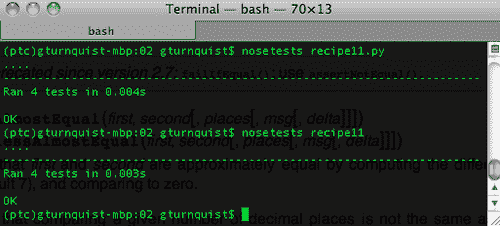
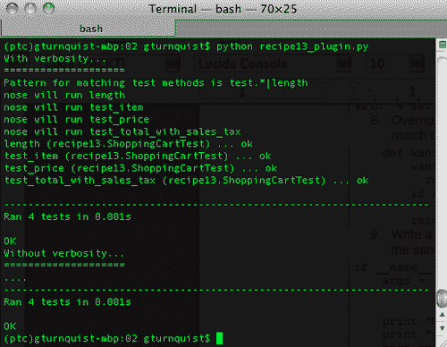
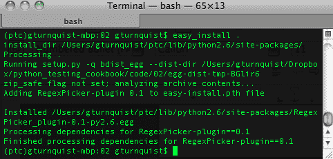
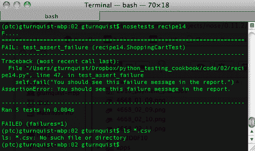
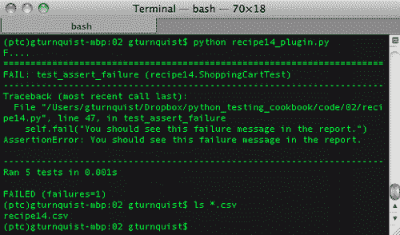
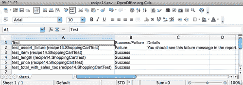
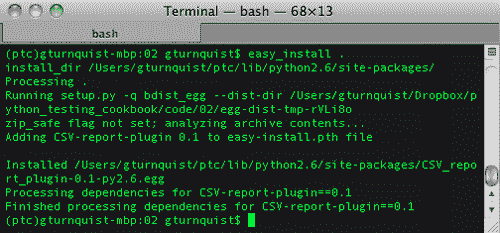
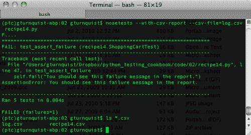
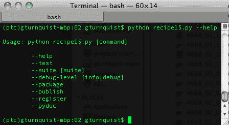
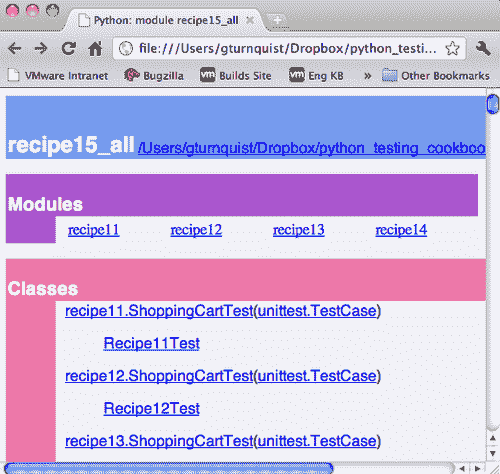

# 二、使用 Nose 运行自动测试套件

在本章中，我们将介绍：

*   对测试越来越挑剔
*   在 Python 中嵌入鼻子
*   编写 nose 扩展以基于正则表达式拾取测试
*   编写 nose 扩展以生成 CSV 报告
*   编写允许运行不同测试套件的项目级脚本

# 导言

在上一章中，我们研究了几种利用 unittest 创建自动化测试的方法。现在，我们将研究收集测试并运行它们的不同方法。Nose 是一个有用的工具，用于发现测试并运行测试。它是灵活的，可以从命令行或嵌入脚本中运行，并且可以通过插件进行扩展。由于它的可嵌入性，更高级别的工具，如项目脚本，它可以通过测试作为选项来构建。

nose 提供了 unittest 没有的功能？关键的事情包括自动测试发现和一个有用的插件 API。有许多 nose 插件提供从特殊格式的测试报告到与其他工具集成的一切。我们将在本章和本书的后半部分对此进行更详细的探讨。

### 注

有关鼻子的更多信息，请参阅[http://somethingaboutorange.com/mrl/projects/nose](http://somethingaboutorange.com/mrl/projects/nose) 。

我们需要激活我们的虚拟环境，然后为这些不同的食谱安装 nose。

创建虚拟环境，激活它，并验证工具是否正常工作：


接下来，使用`pip`安装机头，如下图所示：


# 对测试越来越挑剔

当输入包、模块或文件时，Nose 会自动发现测试。

## 怎么做。。。

通过以下步骤，我们将探索 nose 如何自动查找测试用例并运行它们：

1.  创建一个名为`recipe11.py`的新文件，将此配方的所有代码放入其中。
2.  创建一个要测试的类。对于这个配方，我们将使用一个购物车应用程序，让我们加载项目，然后计算账单。

    ```py
    class ShoppingCart(object):
        def __init__(self):
            self.items = []

        def add(self, item, price):
            self.items.append(Item(item, price))
            return self

        def item(self, index):
            return self.items[index-1].item

        def price(self, index):
            return self.items[index-1].price

        def total(self, sales_tax):
            sum_price = sum([item.price for item in self.items])
            return sum_price*(1.0 + sales_tax/100.0)

        def __len__(self):
            return len(self.items)

    class Item(object):
        def __init__(self, item, price):
            self.item = item
            self.price = price
    ```

3.  创建一个测试用例，用于测试购物车应用程序的各个部分。

    ```py
    import unittest

    class ShoppingCartTest(unittest.TestCase):
        def setUp(self):
            self.cart = ShoppingCart().add("tuna sandwich", 15.00)

        def test_length(self):
            self.assertEquals(1, len(self.cart))

        def test_item(self):
            self.assertEquals("tuna sandwich", self.cart.item(1))

        def test_price(self):
            self.assertEquals(15.00, self.cart.price(1))

        def test_total_with_sales_tax(self):
            self.assertAlmostEquals(16.39, \
                                    self.cart.total(9.25), 2)
    ```

4.  Use the command-line `nosetests` tool to run this recipe by filename and also by module.

    

## 它是如何工作的。。。

我们首先创建一个简单的应用程序，让我们加载一个带有`Items`的`ShoppingCart`。此应用程序允许我们查找每个项目及其价格。最后，我们可以计算包括销售税在内的总账单金额。

接下来，我们编写了一些测试方法，以使用 unittest 测试所有这些特性。

最后，我们使用命令行`nosetests`工具发现测试用例并自动运行它们。这使我们不用手工编写任何测试运行程序来加载测试套件。

## 还有更多。。。

没有编写测试运行程序有什么重要的？使用`nosetests`我们获得了什么？毕竟，unittest 为我们提供了嵌入自动发现测试运行程序的能力，如下所示：

```py
if __name__ == "__main__":
    unittest.main()
```

如果测试跨多个模块进行，那么相同的代码块是否可以工作？否，因为`unittest.main()`只在当前模块中查看。为了扩展到多个模块，我们需要使用 unittest 的`loadTestsFromTestCase`方法或其他定制套件开始加载测试。我们如何组装套件并不重要。当我们面临丢失测试用例的风险时，`nosetests`方便地让我们根据需要搜索所有测试或子集。

项目中的一种常见情况是在许多模块之间展开测试用例。我们通常不会编写一个大的测试用例，而是基于各种设置、场景和其他逻辑分组将事情分解成更小的测试用例。通常的做法是根据正在测试的模块划分测试用例。关键是，手动加载真实世界测试套件的所有测试用例可能会耗费大量人力。

### 鼻子是可伸缩的

自动发现测试并不是使用 nose 的唯一原因。在本章后面，我们将探索如何编写插件来定制它发现的内容以及测试运行的输出。

### 机头可嵌入

nose 提供的所有功能都可以通过命令行使用，也可以从 Python 脚本内部使用。我们还将在本章中进一步探讨这一点。

## 另见

*主张**第一章中提到的**基础*部分

# 将鼻子嵌入 Python

在 Python 脚本中嵌入 nose 非常方便。这使我们能够创建更高级别的测试工具，同时允许开发人员将测试添加到现有工具中。

## 怎么做。。。

通过这些步骤，我们将探索在 Python 脚本中使用 nose 的 API 来运行一些测试：

1.  创建一个名为`recipe12.py`的新文件，以包含此配方中的代码。
2.  创建一个要测试的类。对于这个配方，我们将使用一个购物车应用程序，让我们加载项目，然后计算账单。

    ```py
    class ShoppingCart(object):
        def __init__(self):
            self.items = []

        def add(self, item, price):
            self.items.append(Item(item, price))
            return self

        def item(self, index):
            return self.items[index-1].item

        def price(self, index):
            return self.items[index-1].price

        def total(self, sales_tax):
            sum_price = sum([item.price for item in self.items])
            return sum_price*(1.0 + sales_tax/100.0)

        def __len__(self):
            return len(self.items)

    class Item(object):
        def __init__(self, item, price):
            self.item = item
            self.price = price
    ```

3.  创建一个包含多种测试方法的测试用例。

    ```py
    import unittest

    class ShoppingCartTest(unittest.TestCase):
        def setUp(self):
            self.cart = ShoppingCart().add("tuna sandwich", 15.00)

        def test_length(self):
            self.assertEquals(1, len(self.cart))

        def test_item(self):
            self.assertEquals("tuna sandwich", self.cart.item(1))

        def test_price(self):
            self.assertEquals(15.00, self.cart.price(1))

        def test_total_with_sales_tax(self):
            self.assertAlmostEquals(16.39, \
                                    self.cart.total(9.25), 2)
    ```

4.  创建一个名为`recipe12_nose.py`的脚本，使用 nose 的 API 运行测试。
5.  使脚本可运行，并使用 nose 的`run()`方法运行所选参数。

    ```py
    if __name__ == "__main__":
        import nose
        nose.run(argv=["", "recipe12", "--verbosity=2"])
    ```

6.  Run the test script from the command line and see the verbose output.

    

## 它是如何工作的。。。

在测试运行代码中，我们使用的是`nose.run()`。没有参数，它只是在`sys.argv`上拾取，并像命令行`nosetests`一样工作。但是在这个配方中，我们插入了当前模块的名称，同时增加了详细性。

## 还有更多

Unittest 有`unittest.main()`、发现并运行测试用例。这有什么不同？`unittest.main()`用于发现运行在同一模块中的测试用例。`nose.run()`旨在让我们传入命令行参数或以编程方式加载它们。

例如，查看以下步骤，我们必须完成这些步骤才能使用 unittest 显示详细性：

```py
if __name__ == "__main__":
    import unittest
    from recipe12 import *
    suite = unittest.TestLoader().loadTestsFromTestCase(\
                                        ShoppingCartTest)
    unittest.TextTestRunner(verbosity=2).run(suite)
```

我们必须导入测试用例，使用测试加载程序创建测试套件，然后通过`TextTestRunner`运行它。

要对鼻子做同样的事情，我们只需要：

```py
if __name__ == "__main__":
    import nose
    nose.run(argv=["", "recipe12", "--verbosity=2"])
```

这要简洁得多。我们可以在这里使用与`nosetests`一起使用的任何命令行选项。当我们使用 nose 插件时，这会很方便，我们将在本章和本书的其余部分详细探讨它。

# 基于正则表达式编写 nose 扩展以拾取测试

像 nose 这样的现成测试工具非常有用。但是，最终，我们的选择与我们的需求不符。Nose 具有编写自定义插件的强大能力，这使我们能够微调 Nose 以满足我们的需求。这个配方将帮助我们编写一个插件，允许我们在运行`nosetests`时，通过使用正则表达式匹配方法名，有选择地选择测试方法。

## 准备好了吗

我们需要加载`easy_install`才能安装我们即将创建的 nose 插件。如果您还没有，请访问[http://pypi.python.org/pypi/setuptools](http://pypi.python.org/pypi/setuptools) 按照现场指示下载并安装软件包。

如果您现在刚刚安装，则必须：

*   重建用于运行本书中代码示例的`virtualenv`
*   使用`pip`重新安装`nose`

## 怎么做。。。

通过以下步骤，我们将编写一个 nose 插件，该插件使用正则表达式选择要运行的测试方法。

1.  创建一个名为`recipe13.py`的新文件，以包含此配方的代码。
2.  创建一个购物车应用程序，我们可以围绕它构建一些测试。

    ```py
    class ShoppingCart(object):
        def __init__(self):
            self.items = []

        def add(self, item, price):
            self.items.append(Item(item, price))
            return self

        def item(self, index):
            return self.items[index-1].item

        def price(self, index):
            return self.items[index-1].price
        def total(self, sales_tax):
            sum_price = sum([item.price for item in self.items])
            return sum_price*(1.0 + sales_tax/100.0)

        def __len__(self):
            return len(self.items)

    class Item(object):
        def __init__(self, item, price):
            self.item = item
            self.price = price
    ```

3.  创建一个包含多个测试方法的测试用例，包括一个不以`test`开头的*测试方法。

    ```py
    import unittest

    class ShoppingCartTest(unittest.TestCase):
        def setUp(self):
            self.cart = ShoppingCart().add("tuna sandwich", 15.00)

        def length(self):
            self.assertEquals(1, len(self.cart))

        def test_item(self):
            self.assertEquals("tuna sandwich", self.cart.item(1))

        def test_price(self):
            self.assertEquals(15.00, self.cart.price(1))

        def test_total_with_sales_tax(self):
            self.assertAlmostEquals(16.39, \
                                    self.cart.total(9.25), 2)
    ```* 
4.  Run the module using `nosetests` from the command line, with `verbosity` turned on. How many test methods get run? How many test methods did we define?

    

5.  创建一个名为`recipe15_plugin.py`的新文件，为这个配方编写一个鼻子插件。
6.  捕获`sys.stderr`的句柄以支持调试和详细输出。

    ```py
    import sys
    err = sys.stderr
    ```

7.  Create a nose plugin named `RegexPicker` by subclassing `nose.plugins.Plugin`.

    ```py
    import nose
    import re
    from nose.plugins 
    import Plugin

    class RegexPicker(Plugin):
        name = "regexpicker"

        def __init__(self):
            Plugin.__init__(self)
            self.verbose = False
    ```

    Nose 插件需要一个类级名称。用于定义-`with-<name>`命令行选项。

8.  覆盖`Plugin.options`并添加一个选项，以在命令行上提供模式。

    ```py
        def options(self, parser, env):
            Plugin.options(self, parser, env)
            parser.add_option("--re-pattern",
               dest="pattern", action="store",
               default=env.get("NOSE_REGEX_PATTERN", "test.*"),
               help=("Run test methods that have a method name matching this regular expression"))
    ```

9.  Override `Plugin.configuration` by having it fetch the pattern and verbosity level from the options.

    ```py
        def configure(self, options, conf):
            Plugin.configure(self, options, conf)
            self.pattern = options.pattern
            if options.verbosity >= 2:
                self.verbose = True
                if self.enabled:
                    err.write("Pattern for matching test methods is %s\n" % self.pattern)
    ```

    当我们扩展`Plugin`时，我们继承了一些其他特性，比如`self.enabled`，当`–with--<name>`与鼻子一起使用时，会打开`self.enabled`。

10.  重写`Plugin.wantedMethod`，以便它接受与正则表达式匹配的测试方法。

    ```py
        def wantMethod(self, method):
            wanted = \
              re.match(self.pattern, method.func_name) is not None
            if self.verbose and wanted:
                err.write("nose will run %s\n" % method.func_name)
            return wanted
    ```

    ```py
    Write a test runner that programmatically tests our plugin by running the same test case that we ran earlier.
    if __name__ == "__main__":
        args = ["", "recipe13", "--with-regexpicker", \
                "--re-pattern=test.*|length", "--verbosity=2"]

        print "With verbosity..."
        print "===================="
        nose.run(argv=args, plugin=[RegexPicker()])

        print "Without verbosity..."
        print "===================="
        args = args[:-1]
        nose.run(argv=args, plugin=[RegexPicker()])
    ```

11.  Execute the test runner. Looking at the results in the following screenshot, how many test methods run this time?

    

12.  创建一个`setup.py`脚本，允许我们在`nosetests`中安装并注册我们的插件。

    ```py
    import sys
    try:
        import ez_setup
        ez_setup.use_setuptools()
    except ImportError:
        pass

    from setuptools import setup

    setup(
        name="RegexPicker plugin",
        version="0.1",
        author="Greg L. Turnquist",
        author_email="Greg.L.Turnquist@gmail.com",
        description="Pick test methods based on a regular expression",
        license="Apache Server License 2.0",
        py_modules=["recipe13_plugin"],
        entry_points = {
            'nose.plugins': [
                'recipe13_plugin = recipe13_plugin:RegexPicker'
                ]
        }
    )
    ```

13.  Install our new plugin.

    

14.  Run `nosetests` using `--with-regexpicker` from the command line.

    

## 它是如何工作的。。。

编写 nose 插件有一些要求。首先，我们需要 class-level`name`属性。它被用于几个地方，包括定义命令行开关来调用我们的插件`--with-<name>`。

接下来，我们写`options`。不需要重写`Plugin.options`，但在这种情况下，我们需要一种方法为我们的插件提供正则表达式。为了避免破坏`Plugin.options`的有用机制，我们先调用它，然后使用`parser.add_option`为我们的额外参数添加一行。

*   第一个未命名参数是参数的字符串版本，我们可以指定多个参数。如果我们想的话，我们可以有`-rp`和`--re-pattern`。
*   `Dest`：这是存储结果的属性的名称（请参见配置）。
*   `Action`：指定如何处理参数值（存储、追加等）。
*   `Default`：这是指定在未提供任何值时要存储的值（注意，我们使用`test.*`来匹配标准的 unittest 行为）。
*   `Help`：提供在命令行上打印的帮助信息。

Nose 使用 Python 的`optparse.OptionParser`库定义选项。

### 注

要了解有关 Python 的 optparse.OptionParser 的更多信息，请参阅：[http://docs.python.org/library/optparse.html](http://docs.python.org/library/optparse.html) 。

然后，我们写`configure`。也没有要求覆盖`Plugin.configure`。因为我们有一个额外的选择，`--pattern`，我们需要收获它。我们还想打开由标准机头选项`verbosity`驱动的标志。

在编写 nose 插件时，我们可以做很多事情。在我们的例子中，我们希望集中在**测试****选择**上。有几种加载测试的方法，包括按模块和文件名加载。加载后，它们将通过一个方法运行，在该方法中它们将被投票赞成或反对。这些选民被称为`want*`方法，包括`wantModule`、`wantName`、`wantFunction`、`wantMethod`等。我们实现了`wantMethod`，在那里我们使用 Python 的`re`模块测试`method.func_name`是否与我们的模式匹配。`want*`方法。这些方法有三种返回值类型：

*   `True`：需要进行此项测试
*   `False`：本测试*不需要*（其他插件不会考虑）
*   `None`：插件不在乎。另一个插件（或 nose）可以选择。这可以通过不从 want*方法返回任何内容简洁地实现。

### 提示

`wantMethod`只查看类内部定义的函数。`nosetests`旨在通过多种不同的方法找到测试，而不仅仅限于搜索`unittest.TestCase`的子类。如果在模块中找到测试，但不是作为类方法，则不会使用此模式匹配。为了使这个插件更加健壮，我们需要很多不同的测试，并且我们可能需要覆盖其他`want*`测试选择器。

## 还有更多。。。

这个配方只是触及了插件功能的表面。它着重于测试选择过程。

在本章后面，我们将探讨如何生成专门报告。这涉及到在每个测试运行后使用其他插件挂钩收集信息，以及在测试套件耗尽后生成报告。Nose 提供了一套强大的挂钩，允许进行详细定制，以满足我们不断变化的需求。

### 提示

**插件应为 nose.Plugins.Plugin**子类

`Plugin`内置了很多有价值的机器。子类化是开发插件的推荐方法。如果您不这样做，您可能必须添加方法和属性，这些方法和属性是 nose 所需要的，您没有意识到，当您创建子类时，它们是免费的。

一个很好的经验法则是对我们正在插入的 noseapi 部分进行子类化，而不是重写。

nose API 的在线文档有点不完整。它倾向于假定读者有太多的知识。如果我们重写，插件不能正常工作，那么调试正在发生的事情可能会很困难。

### 提示

**不要将 nose.plugins.IPluginInterface 子类化**

此类仅用于文档编制目的。它提供了插件可以访问的每个钩子的相关信息。但它不是为真正的插件子类化而设计的。

# 编写 nose 扩展以生成 CSV 报告

这个配方将帮助我们编写一个插件，生成一个自定义报告，在 CSV 文件中列出成功和失败的例子。它用于演示如何在每个测试方法完成后收集信息。

## 准备好了吗

我们需要加载`easy_install`才能安装我们即将创建的 nose 插件。如果您还没有，请访问[http://pypi.python.org/pypi/setuptools](http://pypi.python.org/pypi/setuptools) 按照网站上的说明下载并安装软件包。

如果您现在刚刚安装，则必须：

*   重建用于运行本书中代码示例的`virtualenv`
*   使用`easy_install`重新安装机头

## 怎么做。。。

1.  创建一个名为`recipe14.py`的新文件以包含此配方的代码。
2.  创建一个购物车应用程序，我们可以围绕它构建一些测试。

    ```py
    class ShoppingCart(object):
        def __init__(self):
            self.items = []

        def add(self, item, price):
            self.items.append(Item(item, price))
            return self

        def item(self, index):
            return self.items[index-1].item

        def price(self, index):
            return self.items[index-1].price

        def total(self, sales_tax):
            sum_price = sum([item.price for item in self.items])
            return sum_price*(1.0 + sales_tax/100.0)

        def __len__(self):
            return len(self.items)

    class Item(object):
        def __init__(self, item, price):
            self.item = item
            self.price = price
    ```

3.  创建一个包含多种测试方法的测试用例，包括故意设置为失败的测试方法。

    ```py
    import unittest

    class ShoppingCartTest(unittest.TestCase):
        def setUp(self):
            self.cart = ShoppingCart().add("tuna sandwich", 15.00)

        def test_length(self):
            self.assertEquals(1, len(self.cart))

        def test_item(self):
            self.assertEquals("tuna sandwich", self.cart.item(1))

        def test_price(self):
            self.assertEquals(15.00, self.cart.price(1))

        def test_total_with_sales_tax(self):
            self.assertAlmostEquals(16.39, \
                                    self.cart.total(9.25), 2)
        def test_assert_failure(self):
            self.fail("You should see this failure message in the report.")
    ```

4.  Run the module using `nosetests` from the command line. Looking at the output in the following screenshot, does it appear that a CSV report exists?

    

5.  创建一个名为`recipe14_plugin.py`的新文件，以包含我们的新 nose 插件。
6.  Create a nose plugin named `CsvReport` by subclassing `nose.plugins.Plugin`.

    ```py
    import nose
    import re
    from nose.plugins import Plugin

    class CsvReport(Plugin):
        name = "csv-report"

        def __init__(self):
            Plugin.__init__(self)
            self.results = []
    ```

    Nose 插件需要类级别`name`。用于定义`–with--<name>`命令行选项。

7.  重写`Plugin.options`并添加一个选项，以在命令行上提供报告的文件名。

    ```py
        def options(self, parser, env):
            Plugin.options(self, parser, env)
            parser.add_option("--csv-file",
               dest="filename", action="store",
               default=env.get("NOSE_CSV_FILE", "log.csv"),
               help=("Name of the report"))
    ```

8.  Override `Plugin.configuration` by having it fetch the filename from the options.

    ```py
        def configure(self, options, conf):
            Plugin.configure(self, options, conf)
            self.filename = options.filename
    ```

    当我们扩展`Plugin`时，我们继承了一些其他特性，比如`self.enabled`，当`–with-<name>`与鼻子一起使用时，会打开`self.enabled`。

9.  覆盖`addSuccess`、`addFailure`和`addError`以在内部列表中收集结果。

    ```py
        def addSuccess(self, *args, **kwargs):
            test = args[0]
            self.results.append((test, "Success"))

        def addError(self, *args, **kwargs):
            test, error = args[0], args[1]
            self.results.append((test, "Error", error))

        def addFailure(self, *args, **kwargs):
            test, error = args[0], args[1]
            self.results.append((test, "Failure", error))
    ```

10.  覆盖`finalize`生成 CSV 报告。

    ```py
        def finalize(self, result):
            report = open(self.filename, "w")
            report.write("Test,Success/Failure,Details\n")
            for item in self.results:
                if item[1] == "Success":
                    report.write("%s,%s\n" % (item[0], item[1]))
                else:
                    report.write("%s,%s,%s\n" % (item[0],item[1],\
                                                     item[2][1]))
            report.close()
    ```

11.  编写一个测试运行程序，通过运行前面运行的相同测试用例，以编程方式测试我们的插件。

    ```py
    if __name__ == "__main__":
        args = ["", "recipe14", "--with-csv-report", \
                             "--csv-file=recipe14.csv"]
        nose.run(argv=args, plugin=[CsvReport()])
    ```

12.  Execute the test runner. Looking at the output in the next screenshot, is there a test report now?

    

13.  Open up and view the report using your favorite spreadsheet.

    

14.  创建一个`setup.py`脚本，允许我们在`nosetests`中安装并注册我们的插件。

    ```py
    import sys
    try:
        import ez_setup
        ez_setup.use_setuptools()
    except ImportError:
        pass

    from setuptools import setup

    setup(
        name="CSV report plugin",
        version="0.1",
        author="Greg L. Turnquist",
        author_email="Greg.L.Turnquist@gmail.com",
        description="Generate CSV report",
        license="Apache Server License 2.0",
        py_modules=["recipe14_plugin"],
        entry_points = {
            'nose.plugins': [
                'recipe14_plugin = recipe14_plugin:CsvReport'
                ]
        }
    )
    ```

15.  Install our new plugin.

    

16.  Run `nosetests` using `--with-csv-report` from the command line.

    

在上一个屏幕截图中，请注意我们如何拥有上一个日志文件`recipe14.csv`和新的日志文件`log.csv`。

## 它是如何工作的。。。

编写 nose 插件有一些要求。首先，我们需要 class-level`name`属性。它被用于多个地方，包括定义命令行开关来调用我们的插件`--with-<name>`。

接下来，我们写`options`。无需覆盖`Plugin.options`。但是，在这种情况下，我们需要一种方法来为我们的插件提供它将要编写的 CSV 报告的名称。为了避免破坏`Plugin.options`的有用机制，我们首先调用它，然后使用`parser.add_option`为我们的额外参数添加一行。

*   第一个未命名参数是参数的字符串版本
*   `dest`：用于存储结果的属性名称（请参见配置）
*   `action`：说明如何处理参数值（存储、追加等）
*   `default`：这说明在没有提供任何值时要存储什么值
*   `help`：提供在命令行上打印的帮助信息

Nose 使用 Python 的`optparse.OptionParser`库定义选项。

### 注

欲了解更多关于`optparse.OptionParser`的信息，请访问[http://docs.python.org/optparse.html](http://docs.python.org/optparse.html) 。

然后，我们写`configure`。也没有要求覆盖`Plugin.configure`。因为我们有一个额外的选择，`--csv-file`，我们需要收获它。

在此配方中，我们希望在测试方法完成时捕获测试用例以及错误报告。为此，我们实现了`addSuccess`、`addFailure`和`addError`。由于 nose 在通过编程或命令行调用时发送给这些方法的参数不同，因此我们必须使用 Python 的`*args`。

*   此元组的第一个插槽包含`test`，是`nose.case.Test`的一个实例。简单地打印就足以满足我们的需要。
*   此元组的第二个插槽包含`error`，这是`sys.exc_info()`的三元组的一个实例。仅包含在`addFailure`和`addError`中。
*   nose 的网站上没有记录此元组的其他插槽。我们通常忽略它们。

## 还有更多。。。

这个食谱对插件的功能进行了更深入的挖掘。它关注于测试方法成功、失败或导致错误后所做的处理。在我们的例子中，我们只是收集结果并将其放入报告中。我们可以做其他的事情，比如捕获堆栈跟踪，向开发团队发送电子邮件失败，或者向 QA 团队发送页面，让他们知道测试套件已经完成。

有关编写 nose 插件的更多详细信息，请阅读配方*编写**a**nose**扩展*以选择基于正则表达式的测试。

# 编写项目级脚本，让您运行不同的测试套件

Python 具有多范式的特性，使得构建应用程序以及提供脚本支持变得非常容易。

这个方法将帮助我们探索构建一个项目级脚本，它允许我们运行不同的测试套件。我们还将展示一些额外的命令行选项，以创建用于打包、发布、注册和编写自动化文档的挂钩。

## 怎么做。。。

1.  创建一个名为`recipe15.py`的脚本，该脚本使用 Python 的`getopt`库解析一组选项。

    ```py
    import getopt
    import glob
    import logging
    import nose
    import os
    import os.path
    import pydoc
    import re
    import sys

    def usage():
        print
        print "Usage: python recipe15.py [command]"
        print
        print "\t--help"
        print "\t--test"
        print "\t--suite [suite]"
        print "\t--debug-level [info|debug]"
        print "\t--package"
        print "\t--publish"
        print "\t--register"
        print "\t--pydoc"
        print

    try:
        optlist, args = getopt.getopt(sys.argv[1:],
                "ht",
               ["help", "test", "suite=", \
                "debug-level=", "package", \
                "publish", "register", "pydoc"])
    except getopt.GetoptError:
        # print help information and exit:
        print "Invalid command found in %s" % sys.argv
        usage()
        sys.exit(2)
    ```

2.  创建一个映射到`–test`的函数。

    ```py
    def test(test_suite, debug_level):
        logger = logging.getLogger("recipe15")
        loggingLevel = debug_level
        logger.setLevel(loggingLevel)
        ch = logging.StreamHandler()
        ch.setLevel(loggingLevel)
        formatter = logging.Formatter("%(asctime)s - %(name)s - %(levelname)s - %(message)s")
        ch.setFormatter(formatter)
        logger.addHandler(ch)

        nose.run(argv=["", test_suite, "--verbosity=2"])
    ```

3.  创建支持`package`、`publish`和`register`的存根函数。

    ```py
    def package():
        print "This is where we can plug in code to run " + \
              "setup.py to generate a bundle."

    def publish():
        print "This is where we can plug in code to upload " + \
              "our tarball to S3 or some other download site."

    def register():
        print "setup.py has a built in function to " + \
              "'register' a release to PyPI. It's " + \
              "convenient to put a hook in here."
        # os.system("%s setup.py register" % sys.executable)
    ```

4.  使用 Python 的`pydoc`模块创建一个自动生成文档的函数。

    ```py
    def create_pydocs():
        print "It's useful to use pydoc to generate docs."
        pydoc_dir = "pydoc"
        module = "recipe15_all"
        __import__(module)

        if not os.path.exists(pydoc_dir):
            os.mkdir(pydoc_dir)

        cur = os.getcwd()
        os.chdir(pydoc_dir)
        pydoc.writedoc("recipe15_all")
        os.chdir(cur)
    ```

5.  添加一些定义调试级别的代码，然后解析选项以允许用户重写。

    ```py
    debug_levels = {"info":logging.INFO, "debug":logging.DEBUG}
    # Default debug level is INFO
    debug_level = debug_levels["info"]  

    for option in optlist:
        if option[0] in ("--debug-level"):
            # Override with a user-supplied debug level
            debug_level = debug_levels[option[1]]
    ```

6.  添加一些代码扫描`–help`的命令行选项，如果找到，则退出脚本。

    ```py
    # Check for help requests, which cause all other
    # options to be ignored.
    for option in optlist:
        if option[0] in ("--help", "-h"):
            usage()
            sys.exit(1)
    ```

7.  通过迭代每个命令行选项并根据选择的选项调用其他函数来完成。

    ```py
    # Parse the arguments, in order
    for option in optlist:
        if option[0] in ("--test"):
            print "Running recipe15_checkin tests..."
            test("recipe15_checkin", debug_level)

        if option[0] in ("--suite"):
            print "Running test suite %s..." % option[1]
            test(option[1], debug_level)

        if option[0] in ("--package"):
            package()

        if option[0] in ("--publish"):
            publish()

        if option[0] in ("--register"):
            register()

        if option[0] in ("--pydoc"):
            create_pydocs()
    ```

8.  Run the `recipe15.py` script with `–help`.

    

9.  创建一个名为`recipe15_checkin.py`的新文件，以创建一个新的测试套件。
10.  将配方*Getting**nosy**中的测试用例与**testing*一起重用，定义`check``in`测试套件。

    ```py
    import recipe11

    class Recipe11Test(recipe11.ShoppingCartTest):
        pass
    ```

11.  Run the `recipe15.py` script, using `–test –package –publish –register –pydoc`. In the following screenshot, do you notice how it exercises each option in the same sequence as it was supplied on the command line?

    

12.  Inspect the report generated in the `pydoc` directory.

    

13.  创建一个名为`recipe15_all.py`的新文件来定义另一个新的测试套件。
14.  重用本章前面配方中的测试代码来定义`all`测试套件。

    ```py
    import recipe11
    import recipe12
    import recipe13
    import recipe14

    class Recipe11Test(recipe11.ShoppingCartTest):
        pass

    class Recipe12Test(recipe12.ShoppingCartTest):
        pass

    class Recipe13Test(recipe13.ShoppingCartTest):
        pass

    class Recipe14Test(recipe14.ShoppingCartTest):
        pass
    ```

15.  Run the `recipe15.py` script with `–suite=recipe15_all`.

    

## 它是如何工作的。。。

此脚本使用 Python 的`getopt`库，该库模仿 C 编程语言的`getopt()`函数。这意味着我们使用 API 来定义一组命令，然后迭代选项，调用相应的函数。

### 注

访问[http://docs.python.org/library/getopt.html](http://docs.python.org/library/getopt.html) 了解更多有关`getopt`库的详细信息。

*   `usage`：为用户提供帮助的功能。
*   `key`：选项定义包含在以下方框中：

    ```py
        optlist, args = getopt.getopt(sys.argv[1:],
                "ht",
               ["help", "test", "suite=", \
                "debug-level=", "package", \
                "publish", "register", "pydoc"])
    ```

    *   我们解析参数中的所有内容，除了第一个，即可执行文件本身。
    *   `"ht"`定义了短期权：`-h`和`–t`。
    *   该列表定义了长选项。有`"="`的人接受论点。没有国旗的是国旗。
    *   如果收到的选项不在列表中，则会引发异常，我们打印出`usage()`，然后退出。
*   `test`：这将激活记录器，如果我们的应用程序使用 Python 的`logging`库，这将非常有用。
*   `package`：这会产生焦油球。我们创建了一个存根，但通过运行`setup.py sdist|bdist`可以方便地提供快捷方式。
*   `publish`：其功能是将柏油球推到部署地点。我们创建了一个存根，但将其部署到 S3 站点或其他地方是有用的。
*   `register`：这将模块注册到 PyPI。我们创建了一个存根，但是提供运行`setup.py register`的快捷方式会很方便。
*   `create_pydocs`：是自动生成的单据。基于代码生成 HTML 文件非常方便。

定义了这些函数后，我们可以迭代解析的选项。对于此脚本，有如下顺序：

1.  检查是否存在调试覆盖。我们默认为`logging.INFO`，但提供切换到`logging.DEBUG`的能力。
2.  检查是否调用了`-h`或`–help`。如果是，请打印出`usage()`信息，然后退出，不再进行解析。
3.  最后，迭代这些选项，并调用它们相应的函数。

为了练习，我们首先使用`–help`选项调用这个脚本。打印出了我们的命令选择。

然后我们调用了所有选项来演示这些功能。当我们使用`–test`时，脚本被编码为练习`check``in`套件。这是一个简短的测试套件，它模拟运行一个更快的测试来判断事情是否正常。

最后，我们用`–suite=recipe15_all`调用脚本。此测试套件模拟运行通常需要更长时间的更完整测试套件。

## 还有更多

此脚本提供的功能可以通过已生成的命令轻松处理。我们在本章前面讨论了`nosetests`，了解了它如何灵活地接受参数来选择测试。

使用`setup.py`生成 tarball 并注册发布也是 Python 社区中常用的特性。

那么为什么要写这个脚本呢？因为我们可以通过一个命令脚本利用所有这些特性，因为`setup.py`包含一组预构建的命令，这些命令涉及绑定和上传到 Python 项目索引。不包括执行其他任务，如生成**pydocs**、部署到其他位置（如 Amazon S3 存储桶）或任何其他系统级任务。此脚本演示了连接其他命令行选项并将其与项目管理功能链接是多么容易。

我们还可以方便地嵌入`pydoc`的用法。基本上，任何满足项目管理需要的 Python 库都可以嵌入。

### 提示

在一个现有的项目上，我开发了一个脚本，提供了一种统一的方式，将版本信息嵌入模板化的`setup.py`以及`pydoc`、`sphinx`和`DocBook`生成的文档中。该脚本使我不必记住管理项目所需的所有命令。

为什么我没有扩展`distutils`来创建自己的命令？这是个人的品味问题。我更喜欢使用`getopt`并在`distutils`框架之外工作，而不是创建和注册新的子命令。

### 为什么使用 getopt 而不是 optpass？

Python 有几个选项来处理命令行选项解析。`getopt`可能是最简单的。它旨在快速定义短期和长期选项，但它有局限性。它需要自定义编码帮助输出，就像我们使用 usage 函数一样。

它还需要对参数进行自定义处理。`optparse`提供了更复杂的选项，例如更好地处理参数和自动生成帮助。但它也需要更多的代码来实现功能。`optparse`未来也将被`argparse`取代。

作为练习，您可以使用`optparse`编写此脚本的替代版本，以评估哪一个是更好的解决方案。