# 第 5 章验收测试的高级客户场景

在本章中，我们将介绍：

*   安装 Pycracy
*   使用 Pycracy 测试基础知识
*   使用 PyAccuracy 验证 web 应用程序安全性
*   安装机器人框架
*   使用 Robot 创建数据驱动的测试套件
*   使用 Robot 编写可测试的故事
*   标记机器人测试并运行子集
*   用 Robot 测试 web 基础知识
*   使用 Robot 验证 web 应用程序的安全性
*   创建项目级脚本以运行本章的验收测试

# 导言

验收测试包括编写测试来证明我们的代码是可以接受的！但这意味着什么？上下文意味着从客户的角度来看可以接受。客户通常更感兴趣的是软件做什么，而不是它如何做。这意味着测试的目标是输入和输出，并且往往比单元测试处于更高的级别。这有时被称为黑盒测试，通常更面向系统。在一天结束时，它通常与断言客户是否会接受软件的测试相关联。

一些开发人员假设验收测试涉及验证 web 应用程序的前端。事实上，包括 PyAccuracy 在内的一些测试工具都是建立在测试 web 应用程序的唯一前提之上的。从客户是否会接受该软件的角度来看，这完全符合*从客户的角度来看可以接受的*。

但是 web 测试并不是验收测试的唯一形式。并非所有系统都是基于网络的。如果子系统由一个团队建造，并移交给另一个计划在其上建造另一层的团队，则可能需要在第二个团队验收之前进行验收测试。

在本章中，我们将深入探讨一些涉及 web 和非 web 应用程序验收测试的方法。

要创建用于测试的 e-store web 应用程序，请执行以下步骤。

1.  确保您的系统上安装了`mercurial`。
    *   对于 Mac，请使用`mac``ports`或`home``brew`。
    *   对于 Ubuntu/Debian，使用`sudo``apt-get``install``mercurial`
    *   对于其他系统，您需要在安装`mercurial`时进行额外的研究。
2.  这还需要安装可编译的工具，如`gcc`。
    *   对于 Ubuntu，使用`sudo``apt-get``install``build-essential`
    *   对于其他系统，您需要在安装`gcc`时进行额外的研究。
3.  通过键入以下命令安装电子商务网站生成器`satchmo`：

    ```py
    pip install -r http://bitbucket.org/gturnquist/satchmo/raw/tip/scripts/requirements.txt
    pip install -ehg+http://bitbucket.org/gturnquist/satchmo/#egg=satchmo
    ```

4.  安装 Python 的用于图像处理的`PIL`库：`pip install PIL`。
5.  编辑`<virtualenv root>/lib/python2.6/site-packages/django/contrib/admin/templates/admin/login.html`将`id="login"`添加到`Log in``<input>`标签中。这允许 Pycuracy 抓取登录按钮并“单击”它。
6.  运行`satchmo`脚本创建商店应用程序：`clonesatchmo.py`。
7.  当提示创建超级用户时，说`yes`。
8.  出现提示时，输入一个`username`。
9.  出现提示时，输入一个`e-mail``address`。
10.  出现提示时，输入一个`password`。
11.  进入商店目录：`cd store`。
12.  启动商店应用程序：`python manage.py runserver`。

### 提示

如果您在安装`satchmo`时遇到问题，请访问[上的项目现场 http://www.satchmoproject.com](http://www.satchmoproject.com) 可能还有他们在[的支持小组 http://groups.google.com/group/satchmo-users](http://groups.google.com/group/satchmo-users) 。

要创建用于测试的非 web 购物车应用程序，请使用以下代码创建`cart.py`：

```py
class ShoppingCart(object):
    def __init__(self):
        self.items = []

    def add(self, item, price):
        for cart_item in self.items:
            # Since we found the item, we increment
            # instead of append
            if cart_item.item == item:
                cart_item.q += 1
                return self

        # If we didn't find, then we append
        self.items.append(Item(item, price))
        return self

    def item(self, index):
        return self.items[index-1].item

    def price(self, index):
        return self.items[index-1].price * self.items[index-1].q
    def total(self, sales_tax):
        sum_price = sum([item.price*item.q for item in self.items])
        return sum_price*(1.0 + sales_tax/100.0)

    def __len__(self):
        return sum([item.q for item in self.items])

class Item(object):
    def __init__(self, item, price, q=1):
        self.item = item
        self.price = price
        self.q = q
```

此购物车：

*   基于 1，表示第一项和价格为[1]而不是[0]
*   包括具有多个相同项目的功能
*   将计算总价格，然后添加税费

这个应用程序并不复杂。也许它不完全是从系统层面来看的，但它确实提供了一个简单的应用程序来编写验收测试。

# 安装精度

PyAccuracy 是使用 BDD 风格语言编写 web 验收测试的有用工具。此配方显示了为以后的配方安装和设置所需的所有步骤。

## 怎么做。。。

通过这些步骤，我们将在本章后面安装 Pyccuracy 和运行场景所需的所有工具。

1.  通过键入`pip``install``pyccuracy`安装`Pyccuracy`。
2.  从[下载`selenium-server.jar`http://github.com/heynemann/pyccuracy/raw/master/lib/selenium-server.jar](http://github.com/heynemann/pyccuracy/raw/master/lib/selenium-server.jar) 。
3.  通过键入`java -jar selenium-server.jar`启动它。请注意，如果您没有安装 Java，您肯定也需要下载并安装它。
4.  通过键入`pip install lxml`安装`lxml`。
5.  创建一个名为`recipe35.acc`的简单测试文件，并输入以下代码：

    ```py
    As a Yahoo User
    I want to search Yahoo
    So that I can test my installation of Pyccuracy

    Scenario 1 - Searching for Python Testing Cookbook
    Given
        I go to "http://yahoo.com"
    When
        I fill "p" textbox with "Python Testing Cookbook"
        And I click "search-submit" button and wait
    Then
        I see "Python Testing Cookbook - Yahoo! Search Results" title
    ```

6.  Run it by typing `pyccuracy_console -p test.acc`. The following screenshot shows it being run with Firefox (default for this system).

    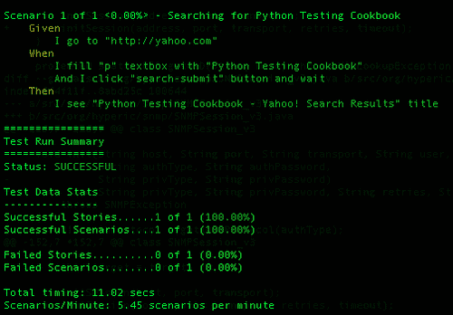

7.  Run it again, using a different web browser like Safari by typing `pyccuracy_console -p test.acc -b safari`.

    ### 注

    在撰写本文时，`Selenium`支持 Firefox、Safari、Opera 和 IE7+，但不支持 Chrome。

    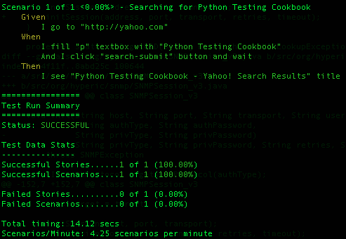

8.  In the folder where we ran the test, there should now be a `report.html` file. Open it up using a browser to view the results. Then click on **Expand All**.

    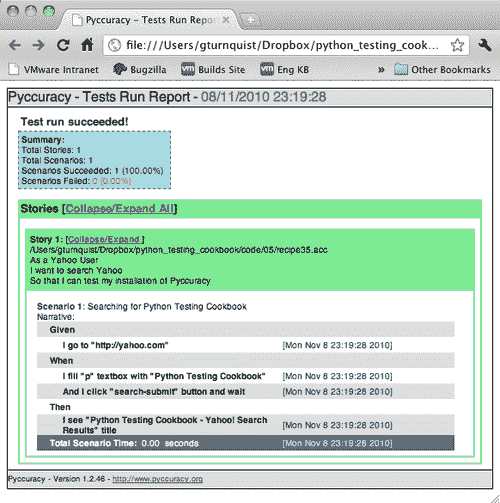

## 它是如何工作的。。。

Pyccuracy 使用`Selenium`，一种流行的浏览器驱动应用程序测试工具来运行其场景。PyAccuracy 提供了一种现成的域特定语言（DSL）来编写测试。DSL 提供了将命令发送到测试浏览器并检查结果、验证 web 应用程序行为的方法。

在本章的后面，有几个食谱展示了 Pycracy 的更多细节。

## 另见

*   使用 Pycracy 测试基础知识
*   使用 PyAccuracy 验证 web 应用程序安全性

# 用 Pycracy 测试基础知识

PyAccuracy 提供了一组易于阅读的操作来驱动 web 应用程序的前端。此配方显示如何使用它驱动购物车应用程序并验证应用程序功能。

## 准备好了吗

1.  If it isn't already running, start up the selenium server in another shell or window by typing: `java` `-jar` `selenium-server.jar`.

    

2.  If the `satchmo` store application isn't already running, start it up in another shell or window by typing: `python` `manage.py` `runserver`.

    ### 提示

    注意：这必须在`virtualenv`环境中运行。

## 怎么做。。。

通过这些步骤，我们将探索编写 PyAccuracy 测试的基础知识。

1.  创建一个名为`recipe36.acc`的新文件。
2.  创建一个用于将项目加载到购物车的故事。

    ```py
    As a store customer
    I want to put things into my cart
    So that I can verify the store's functionality.
    ```

3.  添加一个场景，详细查看空购物车，确认余额为 0.00 美元。

    ```py
    Scenario 1 - Inspect empty cart in detail
    Given
        I go to "http://localhost:8000"
    When
        I click "Cart" link and wait
    Then
        I see that current page contains "Your cart is empty"
        And I see that current page contains "0 - $0.00"
    ```

4.  添加另一个场景，选择一本书，其中两本书被添加到购物车中。

    ```py
    Scenario 2 - Load up a cart with 2 of the same
    Given
        I go to "http://localhost:8000"
    When
        I click "Science Fiction" link
        And I click "Robots Attack!" link and wait
        And I fill "quantity" textbox with "2"
        And I click "addcart" button and wait
        And I click "Cart" link and wait
    Then
        I see that current page contains "Robots Attack!"
        And I see "quantity" textbox contains "2"
        And I see that current page contains "<td align="center">$7.99</td>"
        And I see that current page contains "<td align="center">$15.98</td>"
        And I see that current page contains "<td>$15.98</td>"
    ```

5.  Run the story by typing `pyccuracy_console -p recipe36.acc`.

    

## 它是如何工作的。。。

PyAccuracy 有许多基于驱动浏览器或读取页面的内置操作。这些操作是用于解析故事文件和生成发送到 selenium 服务器的命令的模式，selenium 服务器反过来驱动浏览器，然后读取页面结果。

关键是选择正确的文本来识别正在操作或读取的元素。

### 提示

缺少 ID 标签的 Web 应用程序更难查看。

## 还有更多。。。

关键是选择正确的标识符和元素类型。有了好的标识符，就可以很容易地在*购物车**链接*上点击*等操作。你注意到我们钻到购物车桌子上的问题了吗？HTML`<table>`标记没有标识符，这使得我们无法选择。相反，我们必须查看整个页面，并对一些标记进行全局搜索。*

这使得阅读测试变得更加困难。一个好的解决方案是修改 web 应用程序，使其在`<table>`标记中包含一个 ID。然后，我们缩小了验收标准，仅限于表格。使用这个应用程序是可以的，但是对于复杂的 web 应用程序，如果没有好的 ID，要找到我们正在寻找的确切文本位肯定会困难得多。

这提出了一个有趣的问题：*是否应该**一个*申请一个*被*修改*为**支持**一个**测试*？简单地说，是的。向关键 HTML 元素添加一些好的标识符以支持测试，这并不是一个大的变化。它不涉及对应用程序的重大设计更改。最终的结果是更容易阅读测试用例和更好的自动化测试。

这引出了另一个问题：*如果让应用程序更易于测试涉及到重大的设计变更，该怎么办？*这可能被视为工作中的重大中断。或者，这可能是一个强烈的暗示，我们的设计有太紧密耦合或不够内聚的组件。

在软件开发中，**耦合**和**内聚性**是主观的术语，不太可测量。可以说的是，不适合测试的应用程序通常是单片的，难以维护，并且可能具有循环依赖性，这意味着我们（作为开发人员）更难在不影响整个系统的情况下进行更改以满足需求。

当然，所有这些都与我们的食谱的情况相比是一个巨大的飞跃，我们只是缺少一个 HTML 表的标识符。然而，重要的是要想一想，如果*我们**需要**更多**改变**而不是**一些**所以**小*。

## 另见

安装 Pycracy

# 使用 PyAccuracy 验证 web 应用程序安全性

应用程序通常有登录屏幕。测试安全的 web 应用程序需要我们将登录过程捕获为自定义操作。这样，我们就可以根据需要在任意多的场景中重复使用它。

## 准备好了吗

1.  如果 selenium 服务器尚未运行，请在另一个 shell 或窗口中键入：`java -jar selenium-server.jar`启动 selenium 服务器。
2.  If the `satchmo` store application isn't already running, start it up in another shell or window by typing: `python` `manage.py` `runserver`.

    ### 提示

    注意：这必须在`virtualenv`环境中运行。

## 怎么做。。。

通过以下步骤，我们将练习 web 应用程序的安全性，然后了解如何通过创建执行相同操作的自定义操作来扩展 PyAccuracy：

1.  创建一个名为`recipe37.acc`的新文件以包含此配方的方案。
2.  为练习 Django 的管理应用程序创建一个故事。

    ```py
    As a system administrator
    I want to login to Django's admin page 
    So that I can check the product catalog.
    ```

3.  添加登录到管理应用程序的场景。

    ```py
    Scenario 1 - Logging in to the admin page
    Given
        I go to "http://localhost:8000/admin"
    When
        I fill "username" textbox with "gturnquist"
        And I fill "password" textbox with "password"
        And I click "login" button and wait
    Then
        I see that current page contains "<a href="product/product/">Products</a>"
    ```

4.  添加使用自定义登录操作检查产品目录的方案。

    ```py
    Scenario 2 - Check product catalog
    Given
        I am logged in with username "gturnquist" and password "password"
    When
        I click "Products" link and wait
    Then
        I see that current page contains "robot-attack"
    ```

5.  创建一个名为`recipe37.py`的匹配文件，其中包含自定义定义的操作。
6.  编写登录到管理操作的自定义操作。

    ```py
    from pyccuracy.actions import ActionBase
    from pyccuracy.errors import *

    class LoggedInAction(ActionBase):
        regex = r'(And )?I am logged in with username [\"](?P<username>.+)[\"] and password [\"](?P<password>.+)[\"]$'

        def execute(self, context, username, password):
            self.execute_action(u'I go to "http://localhost:8000/admin"', context)
            logged_in = False
            try:
                self.execute_action(\
                  u'And I see that current page contains "id_username"', context)
            except ActionFailedError:
                logged_in = True

            if not logged_in:
                self.execute_action(u'And I fill "username" textbox with "%s"' % username, context)
                self.execute_action(u'And I fill "password" textbox with "%s"' % password, context)
                self.execute_action(u'And I click "login" button', context)
    ```

7.  Run the story by typing `pyccuracy_console -p recipe37.acc`.

    

## 它是如何工作的。。。

第一个场景显示了执行登录屏幕所需的简单步骤。在证明登录屏幕工作正常后，在更多场景中重复此过程会变得很麻烦。

为了处理这个问题，我们通过扩展`ActionBase`在 Python 中创建了一个自定义操作。自定义操作需要一个正则表达式来定义 DSL 文本。接下来，我们定义一个`execute`方法，其中包括要执行的应用程序逻辑和 PyAccuracy 步骤的组合。本质上，我们可以定义一组步骤来自动执行操作并动态处理不同的情况。

在我们的情况下，我们编码它来处理用户是否已经登录。通过这个定制操作，我们构建了第二个场景，并用一条语句处理了登录，从而允许我们继续测试场景的核心部分。

## 另见

安装 Pycracy

# 安装机器人框架

Robot 框架是使用**关键字**方法编写验收测试的有用框架。关键字是各种库提供的快捷命令，也可以由用户定义。这很容易支持 BDD 风格的`Given`-`When`-`Then`关键字。它还为定义自定义关键字的第三方库打开了大门，以便与其他测试工具（如 Selenium）集成。这也意味着使用 Robot 框架编写的验收测试并不局限于 web 应用程序。

此配方显示了安装 Robot 框架以及第三方 Robot 框架 Selenium 库所需的所有步骤，供以后的配方使用。

## 怎么做。。。

1.  确保激活您的`virtualenv`沙箱。
2.  Install by typing: `easy_install` `robotframework`.

    ### 注

    在撰写本文时，无法使用`pip`安装机器人框架。

3.  使用任何类型的窗口导航器，转到`<virtualenv``root>/build/robotframework/doc/quickstart`并使用您喜爱的浏览器打开`quickstart.html`。这不仅是一个指南，也是一个可运行的测试套件。
4.  切换到 virtualenv 的机器人框架构建目录：`cd``<virtualenv``root>/build/robotframework/doc/quickstart`。
5.  Run the Quick Start manual through `pybot` to verify installation: `pybot quickstart.html`.

    

6.  检查测试运行生成的`report.html`、`log.html`和`output.xml`文件。
7.  安装 Robot Framework Selenium 库，以便通过首先下载[与 Selenium 集成 http://robotframework-seleniumlibrary.googlecode.com/files/robotframework-seleniumlibrary-2.5.tar.gz](http://robotframework-seleniumlibrary.googlecode.com/files/robotframework-seleniumlibrary-2.5.tar.gz) 。
8.  打开柏油包。
9.  切换到目录：`cd robotframework-seleniumlibrary-2.5`。
10.  安装软件包：`python``setup.py install`。
11.  切换到演示目录：`cd``demo`。
12.  启动演示 web 应用程序：`python``rundemo.py``demoapp``start`。
13.  启动 Selenium 服务器：`python``rundemo.py``selenium``start`。
14.  Run the demo tests: `pybot login_tests`.

    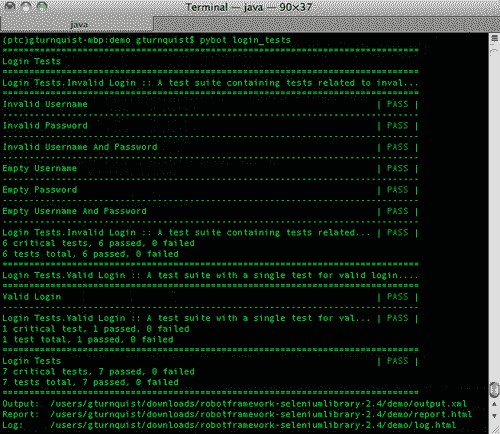

15.  关闭演示 web 应用程序：`python``rundemo.py``demoapp``stop`。
16.  关闭 Selenium 服务器：`python``rundemo.py``selenium``stop`。
17.  检查测试运行生成的`report.html`、`log.html`、`output.xml`和`selenium_log.txt`文件。

## 还有更多。。。

根据这个配方，我们安装了 Robot 框架和一个集成 Robot 和 Selenium 的第三方库。

还有更多的第三方库为 Robot 框架提供了增强的功能。这些选项有足够的潜力填满整本书。因此，我们必须将注意力集中在 Robot 框架提供的一些核心特性上，包括 web 和非 web 测试。

# 使用 Robot 创建数据驱动测试套件

Robot 框架使用**关键字**定义测试、测试步骤、变量和其他测试组件。关键字是各种库提供的快捷命令，也可以自定义。这允许使用多种不同的方式编写和组织测试。

在这个配方中，我们将探索如何使用不同的输入和输出运行相同的测试过程。这些可以描述为数据驱动测试。

## 准备好了吗

1.  我们首先需要激活`virtualenv`设置。
2.  对于这个配方，我们将使用购物车应用程序。
3.  接下来，我们需要安装 Robot 框架，如前一个配方所示。

## 怎么做。。。

下面的步骤将向我们展示如何使用 HTML 表编写一个简单的验收测试。

1.  创建一个名为`recipe39.html`的新文件以捕获测试和配置。
2.  Add an HTML paragraph and table that contains a set of data-driven test cases, as shown in the following browser screenshot.

    

3.  Add another HTML paragraph and table defining the custom keywords **Adding** **items** **to** **cart** and **Add** **item**.

    

4.  创建一个名为`recipe39.py`的新文件，其中包含连接到自定义关键字中的 Python 代码。
5.  Create an old style Python class that implements the custom keywords needed for the scenarios.

    ```py
    from cart import *

    class recipe39:
        def __init__(self):
            self.cart = ShoppingCart()

        def add_item_to_cart(self, description, price):
            self.cart.add(description, float(price))

        def get_total(self, tax):
            return format(self.cart.total(float(tax)), ".2f")
    ```

    ### 提示

    定义类*旧**样式*很重要。如果我们通过子类化`object`将其定义为*新**样式*，Robot Framework 的 runner`pybot`将无法找到方法并将它们与我们的 HTML 关键字关联。

6.  Add a third HTML paragraph and table that loads our Python code to implement **Add** **item** **to** **cart** and **Get** **total**.

    

7.  View the HTML file in your favorite browser.

    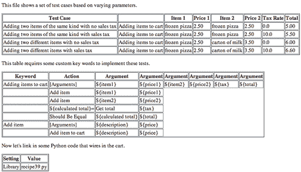

8.  Run the HTML file through `pybot` to exercise the tests by typing `pybot` `recipe39.html`.

    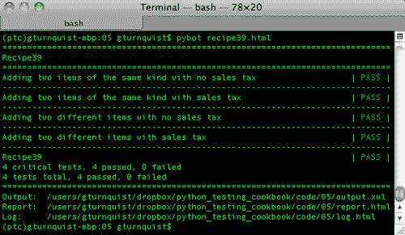

9.  您可以使用您喜爱的浏览器查看`report.html`和`log.html`以了解有关结果的更多详细信息。

## 它是如何工作的。。。

Robot 框架使用 HTML 表定义测试组件。表的标题行标识表定义的组件类型。

我们创建的第一个表是一组测试用例。机器人框架通过在标题行的第一个单元格中看到`Test``Case`来发现这一点。其余的标题单元格没有被解析，这让我们可以自由地输入描述性文本。在这个配方中，我们的每个测试用例都定义了一行。第二列每行有`Adding``items``to``cart`，这是第二个表中定义的自定义关键字。其余列是此自定义关键字的参数。

我们编写的第二个表用于定义自定义关键字。Robot 框架通过在标题行的第一个单元格中看到`Keyword`来解决这个问题。我们的表定义了两个关键字。

*   `Adding``items``to``cart`：
    *   第一行以`[Arguments]`和六个输入变量开始定义参数：`${item1}`、`${price1}`、`${item2}`、`${price2}`、`${tax}`和`${total}`。
    *   下一组行是操作。
    *   第二行和第三行使用另一个自定义关键字：`Add``item`和两个参数。
    *   第四行定义了一个新变量`${calculated``total}`，该变量被分配给另一个关键字`Get``total`的结果，该关键字带有一个参数`${tax}`，该参数在我们的 Python 模块中定义。
    *   最后一行使用内置关键字`Should``Be``Equal`，确认`Get``total`的输出与原始`${total}`匹配。
*   `Add``item`：
    *   第一行以`[Arguments]`和两个输入变量开始定义参数：`${description}`和`${price}`。
    *   第二行使用另一个关键字`Add``item``to``cart`，它是在我们的 Python 模块中定义的，有两个命名参数`${description}`和`${price}`。

我们制作的第三个表包含设置。这可以通过在标题行的第一个单元格中看到`Setting`来识别。此表用于通过使用内置关键字`Library`导入包含最终关键字的 Python 代码。

## 还有更多。。。

Robot 框架通过一个非常简单的约定将关键字映射到 Python 代码：

*   `Get``total``${tax}`映射到`get_total(self,``tax)`。
*   `Add` `item` `to` `cart` `${description}` `${price}` maps to `add_item_to_cart(self`, `description`, `price)`.

    ### 注

    我们需要`add_item_to_cart`的原因是，在连接到 Python 代码时，Robot 框架使用命名参数，所以我们不能编写`add_item`来连接关键字`Add``item`。因为在我们的表中，`Add``item`的每次使用都有不同的变量名，所以我们需要一个具有不同参数的单独关键字。

### 我必须写 HTML 表格吗？

Robot 框架由 HTML 表驱动，但表是如何生成的并不重要。许多项目使用类似于**重组文本**（[的工具 http://docutils.sourceforge.net/rst.html](http://docutils.sourceforge.net/rst.html) ）以不太冗长的方式编写表，然后使用解析器将其转换为 HTML。将`.rst`转换为 HTML 的有用工具是**文档**（[http://docutils.sourceforge.net/](http://docutils.sourceforge.net/) 。它提供了一个方便的`rst2html.py`脚本，可以将所有`.rst`表转换为 HTML。

不幸的是，这本书的格式很难将`.rst`呈现为代码或屏幕截图。要查看好的示例，请访问[http://robotframework.googlecode.com/svn/tags/robotframework-2.5.4/doc/quickstart/quickstart.rst](http://robotframework.googlecode.com/svn/tags/robotframework-2.5.4/doc/quickstart/quickstart.rst) ，在线快速入门 HTML 指南的来源。

### 编写实现自定义关键字的代码的最佳方法是什么？

我们编写了一段 Python 代码，将自定义关键字与`ShoppingCart`应用程序联系起来。使其尽可能轻是很重要的。*为什么？*因为当我们部署实际应用程序时，这个桥不应该是它的一部分。利用这座桥作为捆绑或改造事物的机会可能很诱人，但这应该避免。

相反，最好在软件应用程序本身中包含这些功能。然后，这个额外的功能将成为经过测试和部署的软件功能的一部分。

如果我们不在桥接代码上投入太多，它可以帮助我们避免使软件依赖于测试框架。出于某种原因，如果我们决定切换到 Robot 框架以外的其他工具，我们就不会因为在桥接代码上投入太多而被绑定到该特定工具中。

### 机器人框架变量为 unicode

使 Python 代码正常工作的另一个关键因素是认识到输入值是 Unicode 字符串。因为`ShoppingCart`是基于浮点值的，所以我们必须使用 Python 的`float(input)`函数来转换输入，`format(output`、`".2f")`来转换输出。

*本**与**之前的**节**中**我们*讨论的*【T20 本*桥**中*是否与*有冲突**灯**为**可能？*事实并非如此。通过使用没有副作用的纯内置 Python 函数，我们没有深入研究，而是只传递格式来排列。如果我们开始操作容器，或将字符串转换为列表，反之亦然，甚至定义新类，那么对于这个 bridg 来说，这肯定会变得太沉重 E***

## 另见

安装机器人框架

# 用机器人写一个可测试的故事

正如本章前面讨论的，Robot 框架允许我们使用定义的自定义关键字。

这使我们能够以任何样式构造关键字。在这个配方中，我们将定义自定义关键字，这些关键字实现了 When-Then 样式的规范所给出的 BDD。

## 准备好了吗

1.  我们首先需要激活`virtualenv`设置。
2.  对于这个配方，我们将使用购物车应用程序。
3.  接下来，我们需要安装 Robot 框架，如本章前面几节所示。

## 怎么做。。。

以下步骤将探讨如何编写 When-Then 样式验收测试时给出的 BDD。

1.  创建一个名为`recipe40.html`的新文件来包含我们的 HTML 表。
2.  Create a story file in HTML with an opening statement.

    

3.  Add a table with several scenarios used to exercise the Shopping Cart application with a series of Given-When-Then keywords.

    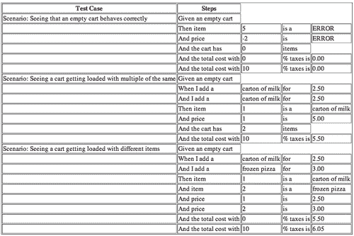

4.  Add a second table that defines all of our custom Given-When-Then keywords.

    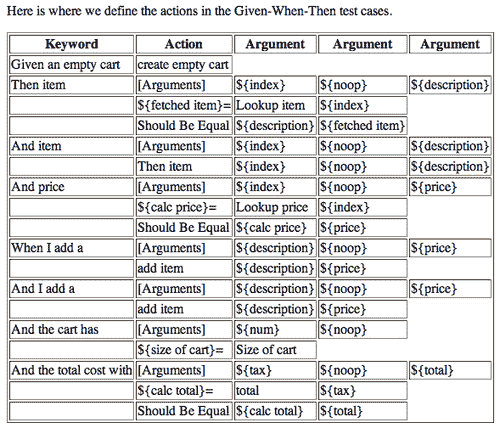

5.  Create a new file called `recipe40.py` to contain Python code that links the custom keywords to the `ShoppingCart` application.

    ```py
    from cart import *

    class recipe40:
        def __init__(self):
            self.cart = None

        def create_empty_cart(self):
            self.cart = ShoppingCart()

        def lookup_item(self, index):
            try:
                return self.cart.item(int(index))
            except IndexError:
                return "ERROR"

        def lookup_price(self, index):
            try:
                return format(self.cart.price(int(index)), ".2f")
            except IndexError:
                return "ERROR"

        def add_item(self, description, price):
            self.cart.add(description, float(price))

        def size_of_cart(self):
            return len(self.cart)

        def total(self, tax):
            return format(self.cart.total(float(tax)), ".2f")
    ```

    ### 注

    这个类实现为*旧式*非常关键。如果通过扩展`object`实现*新型*，机器人框架将不会链接关键字。

6.  Add a third table to our `recipe40.html` file to import our Python module.

    

7.  Run the story by typing `pybot recipe40.html`.

    

## 它是如何工作的。。。

Robot 框架使用 HTML 表定义测试组件。表的标题行标识表定义的组件类型。

我们创建的第一个表是一组测试用例。机器人框架通过在标题行的第一个单元格中看到`Test``Case`来发现这一点。其余的标题单元格没有被解析，这让我们可以自由地输入描述性文本。

在这个配方中，我们的每个测试用例都包含几个自定义关键字，使用 BDD 测试人员熟悉的给定 When-Then 样式。其中许多关键字都有一个或多个参数。

我们编写的第二个表用于定义自定义的 When-Then 关键字。Robot 框架通过在标题行的第一个单元格中看到`Keyword`来解决这个问题。

我们制作的第三个表包含设置。这可以通过在标题行的第一个单元格中看到`Setting`来识别。此表用于通过使用内置关键字`Library`导入包含最终关键字的 Python 代码。

在这个配方中，自定义关键字的一个重要方面是我们用自然流畅的语言编写它们。

```py
When I add a carton of milk for 2.50
```

这被分成四个 HTML 单元，以便参数化输入并使关键字可用于几个测试步骤。


Robot 框架将其视为自定义关键字`When``I``add``a`，有三个参数：`carton``of``milk`、`for`和`2.50`。

稍后，我们将填写与此关键字相关的实际步骤。在这样做时，我们实际上只关心使用`carton``of``milk`和`2.50`。但我们仍然必须将`for`视为一个输入变量。我们通过使用一个占位符变量`${noop}`来实现这一点，在下面的任何关键字步骤中我们都不会使用它。

### 注

在这个配方中，我们称之为一次性变量`${noop}`。我们可以称之为任何东西。如果同一关键字中有多个一次性参数，我们也可以重用它。这是因为 Robot 框架不进行强类型检查。

## 还有更多。。。

我们不得不编写的这整段 HTML 开始感到有点沉重。正如前面的配方*中提到的，创建**一个**数据*-*驱动**测试**套件**和**机器人*一起，`.rst`是一个很好的选择。不幸的是，用`.rst`写这个食谱对于这本书的格式来说太宽了。有关编写`.rst`和获取将`.rst`转换为 HTML 的工具的更多详细信息，请参阅该食谱。

### 当产生重复规则时给出

的确，为了支持两种不同的测试场景，我们必须定义基本相同的`Then``item`和`Add``item`。在其他 BDD 工具中，这些将被自动识别为相同的子句。Robot 框架并没有直接提供 BDD 领域专用语言，所以我们必须自己填写。

最有效的处理方法是详细定义`Then``item`以及所需的所有步骤，然后编码`And``item`来调用`Then``item`。

相比之下，`When``I``add``a`和`And``I``add``a`都是通过调用`add``item`实现的。由于该子句是对 Python 模块的简单传递，因此没有必要像前面的示例那样将它们链接在一起。

另一个选择是研究编写我们自己的 BDD 插件库，以简化所有这一切。

### 试块是否违反了轻装的理念？

在*创建**一个**数据*-*驱动的**测试**套件**和**机器人*的过程中，我们看到连接 HTML 表和`ShoppingCart`应用程序的代码应该尽可能轻，并避免变换和其他操作。

很可能会看到捕获预期的异常并返回一个跨越这条线的字符串。在我们的例子中，解决方案是定义一个可以处理错误和合法值的子句。该子句接受返回的内容，并使用内置关键字`Should``Be``Equal`对其进行验证。

如果不是这样的话，那么使用内置关键字`Run``Keyword``And``Expect``Error`链接到另一个自定义 Python 关键字，而不使用 try-expect 块可能会更平滑。但在这种情况下，我认为保持轻松的目标得到了满足。

## 另见

*   安装机器人框架
*   使用 Robot 创建数据驱动的测试套件

# 标记机器人测试并运行子集

Robot 框架提供了一种使用表驱动结构捕获测试场景的综合方法。这包括以标记和文档的形式添加元数据的能力。

标记允许包括或排除测试用标记。文档显示在命令行和结果报告中。此配方将展示这两种敏锐的特性。

最后，HTML 表不是使用 Robot 框架定义数据表的唯一方法。在这个配方中，我们将探索使用双空格分隔的条目。虽然这不是写故事的唯一非 HTML 方式，但它是最简单的非 HTML 方式，可以证明它仍然符合本书印刷版的字体大小限制。

## 准备好了吗

1.  我们首先需要激活`virtualenv`设置。
2.  创建一个名为`cart41.py`的新文件，以包含购物车应用程序的备用版本。
3.  Type in the following code that stores the cart to a database.

    ```py
    class ShoppingCart(object):
        def __init__(self):
            self.items = []

        def add(self, item, price):
            for cart_item in self.items:
                # Since we found the item, we increment
                # instead of append
                if cart_item.item == item:
                    cart_item.q += 1
                    return self

            # If we didn't find, then we append
            self.items.append(Item(item, price))
            return self

        def item(self, index):
            return self.items[index-1].item

        def price(self, index):
            return self.items[index-1].price * self.items[index-1].q

        def total(self, sales_tax):
            sum_price = sum([item.price*item.q for item in self.items])
            return sum_price*(1.0 + sales_tax/100.0)

        def store(self):
            # This simulates a DB being created.
            f = open("cart.db", "w")
            f.close()

        def retrieve(self, id):
            # This simulates a DB being read.
            f = open("cart.db")
            f.close()

        def __len__(self):
            return sum([item.q for item in self.items])

    class Item(object):
        def __init__(self, item, price, q=1):
            self.item = item
            self.price = price
            self.q = q
    ```

    ### 注

    这个版本的购物车有两个额外的方法：`store`和`retrieve`。它们实际上并不与数据库通信，而是创建一个空文件`cart.db`。*为什么？*目的是模拟与数据库的交互。在配方的后面，我们将展示如何标记涉及此操作的测试用例，并轻松地将它们从测试运行中排除。

4.  接下来，我们需要安装机器人框架，如本章前面章节所示。

## 怎么做。。。

以下步骤将演示如何以 HTML 表以外的格式编写场景，以及如何标记测试，以允许选择在命令行上运行的测试。

1.  Create a new file called `recipe41.txt` using plain text and space separated entries that has a couple of test cases—one simple one and another more complex one with documentation and tags.

    ```py
    ***Test Cases***
    Simple check of adding one item
      Given an empty cart
      When I add a  carton of milk  for  2.50
      Then the total with   0   % tax is  2.50
      And the total with   10   % tax is  2.75

    More complex by storing cart to database
      [Documentation]  This test case has special tagging, so it can be excluded. This is in case the developer doesn't have the right database system installed to interact properly.cart.db
      [Tags]  database
      Given an empty cart
      When I add a  carton of milk  for  2.50
      And I add a   frozen pizza    for  3.50
      And I store the cart
      And I retrieve the cart
      Then there are  2  items
    ```

    ### 注

    需要注意的是，两个空格是识别一个单元格和下一个单元格之间的断点所需的最小间距。具有`When``I``add``a``carton``of``milk``for``2.50`的行实际上有四个信息单元：`|``When``I``add``a``|``carton``of``milk``|``for``I``|``add`。实际上有第五个空单元格作为这一行的前缀，由两个空格缩进表示。需要在测试用例`Simple``check``of``adding``one``item`中将该行标记为一个步骤，而不是另一个测试用例。

2.  添加一个使用纯文本和空格分隔值的自定义关键字定义表。

    ```py
    ***Keywords***
    Given an empty cart
      create empty cart

    When I add a
      [Arguments]   ${description}  ${noop}  ${price}
      add item   ${description}  ${price}

    And I add a
      [Arguments]   ${description}  ${noop}  ${price}
      add item   ${description}  ${price}

    Then the total with
      [Arguments]  ${tax}  ${noop}  ${total}
      ${calc total}=  total  ${tax}
      Should Be Equal  ${calc total}  ${total}

    And the total with
      [Arguments]  ${tax}  ${noop}  ${total}
      Then the total with  ${tax}  ${noop}  ${total}
    And I store the cart
      Set Test Variable  ${cart id}  store cart

    And I retrieve the cart
      retrieve cart  ${cart id}

    Then there are
      [Arguments]  ${size}  ${noop}
      ${calc size}=  Size of cart
      Should Be Equal As Numbers  ${calc size}  ${size}
    ```

3.  创建一个名为`recipe41.py`的新文件，其中包含 Python 代码，该代码将一些关键字与购物车应用程序连接起来。

    ```py
    from cart41 import *

    class recipe41:
        def __init__(self):
            self.cart = None

        def create_empty_cart(self):
            self.cart = ShoppingCart()

        def lookup_item(self, index):
            try:
                return self.cart.item(int(index))
            except IndexError:
                return "ERROR"

        def lookup_price(self, index):
            try:
                return format(self.cart.price(int(index)), ".2f")
            except IndexError:
                return "ERROR"

        def add_item(self, description, price):
            self.cart.add(description, float(price))

        def size_of_cart(self):
            return len(self.cart)

        def total(self, tax):
            return format(self.cart.total(float(tax)), ".2f")

        def store_cart(self):
            return self.cart.store()

        def retrieve_cart(self, id):
            self.cart.retrieve(id)
        def size_of_cart(self):
            return len(self.cart)
    ```

4.  向`recipe41.txt`添加最后一个表，该表将我们的 Python 代码作为库导入，以提供所需的最后一组关键字。

    ```py
    ***Settings***
    Library  recipe41.py
    ```

5.  Run the test scenario as if we were on a machine that had database support by typing `pybot recipe41.txt`.

    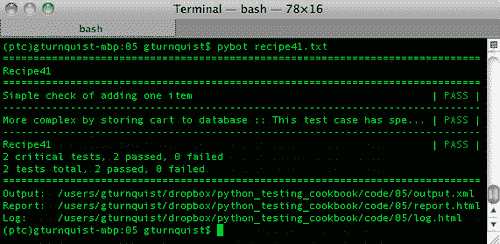

6.  Run the test scenario, excluding tests that were tagged `database` by typing `pybot –exclude database recipe41.txt`.

    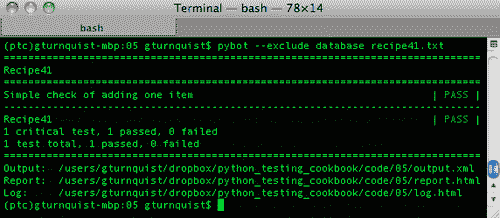

7.  Run the test scenario, including tests that were tagged `database` by typing `pybot –include` `database` `recipe41.txt`.

    

8.  Look at `report.html`, and observe where the extra `[Documentation]` text appears, as well as our `database` tag.

    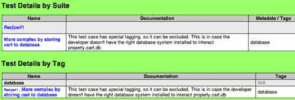

## 它是如何工作的。。。

在这个配方中，我们在第二个测试用例中添加了一个额外的部分，包括文档和标签。

```py
More complex by storing cart to database
  [Documentation]  This test case has special tagging, so it can be excluded. This is in case the developer doesn't have the right database system installed to interact properly.cart.db
  [Tags]  database
  Given an empty cart
  When I add a  carton of milk  for  2.50
  And I add a   frozen pizza    for  3.50
  And I store the cart
  And I retrieve the cart
  Then there are  2  items
```

标记在命令行上可用，如前一个示例所示。它们提供了一种组织测试用例的有用方法。测试用例可以根据需要具有任意多的标记。

我们在前面介绍过，这提供了一个方便的命令行选项，可以基于标记包含或排除。标签也提供了有用的文档，`report.html`之前的屏幕截图显示测试结果也按标签小计：

*   标签可用于识别测试的不同层次，如冒烟、集成、面向客户等
*   标签还可用于标记子系统，如数据库、发票、客户服务、账单等

## 还有更多。。。

此配方演示纯文本格式。三个星号用于环绕标题单元格，两个空格用于指定两个单元格之间的分隔符。

### 注

这是否比 HTML 更难阅读还有争议。它可能不像阅读 HTML 标记那样清晰，但我个人更喜欢这样，而不是阅读 HTML。可以添加更多的空格，这样表格的单元格就更清晰了，但我没有这样做，因为这本书的字体大小不适合它。

### 文件如何？

为了便于演示，我们还添加了一些文档。当`pybot`运行时会出现一段文本，它也会出现在生成的工件中。

## 另见

*   安装机器人框架
*   使用 Robot 创建数据驱动的测试套件
*   使用 Robot 编写可测试的故事

# 用机器人测试网络基础知识

Web 测试是验收测试的一种常见方式，因为客户想知道系统是否可以接受，这是演示系统的一种完美方式。

在前面的教程中，我们探讨了针对非 web 应用程序编写测试。在这个配方中，让我们看看如何使用第三方机器人框架插件来使用 Selenium 测试购物车 web 应用程序。

## 准备好了吗

1.  我们首先需要激活`virtualenv`设置。
2.  对于这个配方，我们使用的是`satchmo`购物车 web 应用程序。要启动它，请切换到`store`目录并键入`python``manage.py``runserver`。您可以通过访问`http://localhost:8000`进行探索。
3.  接下来，安装机器人框架和第三方硒插件，如配方*安装**安装**机器人**框架*所示。

## 怎么做。。。

通过以下步骤，我们将了解如何使用一些基本的机器人命令来驱动 web 应用程序。

1.  创建一个名为`recipe42.txt`的纯文本故事文件，其中包含故事的开头描述。

    ```py
    As a store customer
    I want to put things into my cart
    So that I can verify the store's functionality.
    ```

2.  为测试用例创建一个部分，并添加一个验证是否存在空购物车并捕获屏幕截图的场景。

    ```py
    ***Test Cases***
    Inspect empty cart in detail
      Click link  Cart
      Page Should Contain  Your cart is empty
      Page Should Contain  0 - $0.00
      Capture Page Screenshot  recipe42-scenario1-1.png
    ```

3.  添加另一个场景，选择一本书，添加购物车的两个副本，并确认购物车的总价值。

    ```py
    Load up a cart with 2 of the same
      Click link  Science Fiction  don't wait
      Capture Page Screenshot  recipe42-scenario2-1.png
      Click link  Robots Attack!
      Capture Page Screenshot  recipe42-scenario2-2.png
      Input text  quantity  2
      Capture Page Screenshot  recipe42-scenario2-3.png
      Click button  Add to cart
      Click link  Cart
      Capture Page Screenshot  recipe42-scenario2-4.png
      Textfield Value Should Be  quantity  2
      Page Should Contain  Robots Attack! (Hard cover)
      Html Should Contain  <td align="center">$7.99</td>
      Html Should Contain  <td align="center">$15.98</td>
      Html Should Contain  <td>$15.98</td>
    ```

4.  Add a section of keywords and define a keyword for inspecting the raw HTML of the page.

    ```py
    ***Keywords***
    Html Should Contain
      [Arguments]     ${expected}
      ${html}=        Get Source
      Should Contain  ${html}  ${expected}

    Startup
      Start Selenium Server
      Sleep  3s
    ```

    ### 注

    `Get``Source`是一个 Selenium Library 关键字，用于获取整个页面的原始 HTML。`Start``Selenium``Server`是启动 selenium 服务器的另一个关键词。如果此测试在另一个基于硒的测试套件之前或之后进行，则包含内置的`Sleep`调用以避免启动/关闭时间问题。

5.  Add a section that imports the Selenium Library, and also defines a setup and teardown process for launching and shutting down the browser for each test case.

    ```py
    ***Settings***
    Library         SeleniumLibrary
    Test Setup      Open Browser  http://localhost:8000
    Test Teardown   Close All Browsers

    Suite Setup     Startup
    Suite Teardown  Stop Selenium Server
    ```

    ### 注

    `Test``Setup`是一个内置关键字，用于定义每个测试用例之前执行的步骤。在本例中，它使用 Selenium 库关键字`Open``Browser`启动指向`satchmo`应用程序的浏览器。`Test``Teardown`是一个内置关键字，在每个测试结束时执行，并关闭此测试启动的浏览器。

    `Suite``Setup`是一个内置关键字，仅在执行任何测试之前运行，`Suite``Teardown`仅在该套件中的所有测试之后运行。在本例中，我们使用它来启动和停止 Selenium 库。

6.  Run the test suite by typing `pybot recipe42.txt`.

    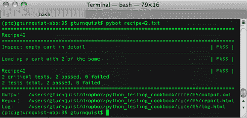

7.  Open `log.html`, and observe the details including the captured screenshots in each scenario. The following screenshot is just one of the many captured screenshots. Feel free to inspect the rest of the screenshots as well as the logs.

    

## 它是如何工作的。。。

Robot 框架提供了一个通过关键字定义测试的强大环境。Selenium 插件与 Selenium 接口，并提供了一整套关键字，用于操作 web 应用程序以及读取和确认其输出。

web 应用程序测试的一个重要部分是掌握一个元素来操作它或测试值。最常见的方法是检查元素的键属性，如`id`、`name`或`href`。例如，在我们的场景中，我们需要单击一个按钮将书籍添加到购物车中。可以通过 ID`addcart`或显示的文本`Add``to``cart`进行识别。

## 还有更多。。。

虽然 Robot 框架与其他商业前端测试解决方案相比是免费的，但重要的是要认识到编写自动化测试的工作并不是免费和轻松的。这需要努力使其成为前端设计的积极组成部分。

在屏幕设计过程的早期加入 Robot 和 SeleniumLibrary 等工具将鼓励良好的实践，如标记框架和元素，以便它们可以在早期进行测试。这与在后端服务器系统已经构建之后尝试为其编写自动测试没有什么不同。这两种情况如果晚一点引入，成本都要高得多。在早期将自动化测试作为后端系统的一部分会鼓励使用类似的编码来支持可测试性。

如果我们希望在开发周期的后期接受验收测试，或者尝试测试从另一个团队继承的系统，我们需要包括对 web 界面进行更改的时间，以便添加标签和标识符来支持编写测试。

### 了解定时配置，它们可能很重要！

虽然 satchmo 购物车应用程序在我们编写的测试中没有任何明显的延迟，但这并不意味着其他应用程序不会。如果您的 web 应用程序的某些部分速度明显较慢，那么阅读在线文档（[是很有价值的 http://robotframework-seleniumlibrary.googlecode.com/hg/doc/SeleniumLibrary.html?r=2.5](http://robotframework-seleniumlibrary.googlecode.com/hg/doc/SeleniumLibrary.html?r=2.5) ）关于配置 Selenium 应等待应用程序响应的时间。

## 另见

*   安装机器人框架
*   使用 Robot 创建数据驱动的测试套件
*   使用 Robot 编写可测试的故事

# 使用 Robot 验证 web app 安全性

Web 应用程序通常具有某种安全性。这通常以登录页面的形式出现。一个编写良好的测试用例应该在开始时启动一个新的浏览器会话，并在结束时关闭它。这会导致用户针对每个测试用例重复登录。

在本食谱中，我们将探索如何编写代码登录 satchmo 的管理页面，如 Django 提供的那样。然后，我们将展示如何将整个登录过程捕获到一个关键字中，从而使我们能够顺利地编写一个访问产品目录的测试，而不会因为登录而受到阻碍。

## 准备好了吗

1.  我们首先需要激活`virtualenv`设置。
2.  对于这个配方，我们使用 satchmo 购物车 web 应用程序。要启动它，请切换到存储目录并键入`python``manage.py runserver`。您可以通过访问`http://localhost:8000`进行探索。
3.  接下来，安装机器人框架和第三方硒插件，如配方*安装**安装**机器人**框架*所示。

## 怎么做。。。

以下步骤将重点介绍如何捕获登录步骤，然后将它们封装在单个自定义关键字中。

1.  创建一个名为`recipe43.txt`的新文件，并编写一个测试故事来练习 Django 的管理界面。

    ```py
    As a system administrator
    I want to login to Django's admin page
    So that I can check the product catalog.
    ```

2.  为测试用例添加一个部分，并编写一个测试用例来练习登录页面。

    ```py
    ***Test Cases***
    Logging in to the admin page
      Open Browser  http://localhost:8000/admin
      Input text  username  gturnquist
      Input text  password  password
      Submit form
      Page Should Contain Link  Products
      Close All Browsers
    ```

3.  添加另一个检查产品目录并验证表中特定行的测试用例。

    ```py
    Check product catalog
      Given that I am logged in
      Click link  Products
      Capture Page Screenshot  recipe43-scenario2-1.png
      Table Should Contain  result_list  Robots Attack!
      Table Row Should Contain  result_list  4  Robots Attack!
      Table Row Should Contain  result_list  4  7.99
      Close All Browsers
    ```

4.  Create a keyword section that captures the login procedure as a single keyword.

    ```py
    ***Keywords***
    Given that I am logged in
      Open Browser  http://localhost:8000/admin/
      Input text  username  gturnquist
      Input text  password  password
      Submit form

    Startup
      Start Selenium Server
      Sleep  3s
    ```

    ### 注

    对于您自己的测试，请输入安装 satchmo 时使用的用户名和密码。`Start``Selenium``Server`是启动 selenium 服务器的另一个关键词。

5.  最后，添加一个设置部分，导入 SeleniumLibrary，并在测试套件的开始和结束时启动和停止 Selenium 服务器。

    ```py
    ***Settings***
    Library         SeleniumLibrary
    Suite Setup     Startup
    Suite Teardown  Stop Selenium Server
    ```

6.  Run the test suite by typing `pybot` `recipe43.txt`.

    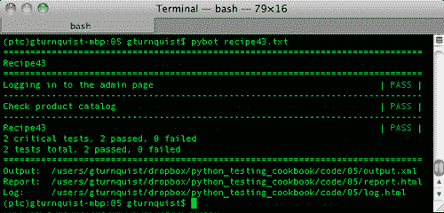

## 它是如何工作的。。。

第一个测试用例展示了我们如何输入用户名和密码数据，然后提交表单。SeleniumLibrary 允许我们按名称选择表单，但如果我们无法识别表单，它会选择找到的第一个 HTML 表单。因为登录页面上只有一个表单，所以这对我们来说很好。

对于第二个测试用例，我们希望导航到产品目录。由于它使用干净的浏览器会话运行，我们不得不再次处理登录屏幕。这意味着我们需要包括相同的步骤再次登录。为了进行更全面的测试，我们可能会编写大量的测试用例。*为什么**应该**我们**避免**复制**和**粘贴**与*相同登录*步骤**针对**每*一步进行一次*测试**案例？*因为它违反了 DRY（不要重复自己）原则。如果登录页面被修改，我们可能需要修改每个实例。

相反，我们用关键字`Given``that``I``am``logged``in`捕获了登录步骤。这为我们提供了一个适用于许多测试用例的有用子句，并让我们关注管理页面。

## 还有更多。。。

在这个配方中，我们使用了 SeleniumLibrary 的一些表格测试操作。我们验证了一本特定的书在表级和行级都存在。我们还核实了那一排书的价格。

最后，我们捕获了产品目录的屏幕截图。此屏幕截图为我们提供了一个快速、直观的概览，我们可以使用它手动确认产品目录，或用于规划下一个测试步骤。

### 为什么不使用“记住我”选项？

许多网站都包含“记住我”复选框，以便在客户端 cookie 中保存登录凭据。Django 管理页面没有，所以*为什么**与**和**相关？*因为很多网站都这样做，我们可能会尝试将其纳入我们的测试中，以避免每次登录。即使我们要测试的 web 应用程序存在此选项，使用它也不是一个好主意。它创建了一个可以从一个测试传播到下一个测试的持久状态。不同的用户帐户可能具有不同的角色，从而影响可见的内容。我们可能不知道测试用例的运行顺序，因此，必须添加额外的代码来识别我们登录的用户。

相反，*不*保存这些信息更容易、更干净。相反，通过单个关键字显式登录可以提供更清晰的意图。这并不意味着我们不应该测试和确认特定 web 应用程序的记住复选框。相反，我们实际上应该测试好帐户和坏帐户，以确保登录屏幕按预期工作。但除此之外，最好不要将未来的测试用例与当前测试用例的存储结果混淆。

### 我们是否应该重构第一个测试场景以使用关键字？

为了坚持 DRY 原则，我们应该在测试故事中只有一个地方有登录过程。但出于演示目的，我们在顶部对其进行了编码，然后将相同的代码复制到关键字中。最好的解决方案是将其封装成单个关键字，可以在测试用例中重用，也可以定义其他自定义关键字，如`Given``I``am``logged``in`。

### 参数会使登录关键字更灵活吗？

绝对地在这个测试故事中，我们硬编码了用户名和密码。但是，对登录页面的良好测试将涉及一个数据驱动的表，其中包含许多好帐户和坏帐户的组合，以及有效和无效密码。这就需要某种登录关键字，它可以接受用户名和密码作为参数。

## 另见

*   安装机器人框架
*   使用 PyAccuracy 验证 web 应用程序安全性
*   使用 Robot 创建数据驱动的测试套件

# 创建项目级脚本以验证本章的验收测试

我们使用了`pyccuracy_console`和`pybot`来运行各种测试配方。但是 Python 项目的管理不仅仅涉及运行测试。打包、使用 Python 项目索引注册以及推送到部署站点等都是需要管理的重要过程。

构建一个命令行脚本来封装所有这些非常方便。使用此配方，我们将运行一个脚本，该脚本将运行本章中介绍的所有测试。

## 准备好了吗

1.  我们首先需要激活`virtualenv`设置。
2.  对于这个配方，我们使用 satchmo 购物车 web 应用程序。要启动它，请切换到存储目录并键入`python``manage.py``runserver`。您可以通过访问`http://localhost:8000`进行探索。
3.  接下来，安装机器人框架和第三方 Selenium 插件，如前面的配方*安装**安装**机器人**框架*所示。
4.  本配方假设本章中的所有不同配方都已编码。

## 怎么做。。。

通过这些步骤，我们将了解如何以编程方式运行本章中的所有测试。

1.  创建一个名为`recipe44.py`的新文件，以包含此配方的代码。
2.  创建定义多个选项的命令行脚本。

    ```py
    import getopt
    import logging
    import os
    import os.path
    import re
    import sys
    from glob import glob

    def usage():
        print
        print "Usage: python recipe44.py [command]"
        print
        print "\t--help"
        print "\t--test"
        print "\t--package"
        print "\t--publish"
        print "\t--register"
        print

    try:
        optlist, args = getopt.getopt(sys.argv[1:],
                "h",
               ["help", "test", "package", "publish", "register"])
    except getopt.GetoptError:
        # print help information and exit:
        print "Invalid command found in %s" % sys.argv
        usage()
        sys.exit(2)
    ```

3.  添加一个启动 Selenium 的方法，运行基于 PyAccuracy 的测试，然后关闭 Selenium。

    ```py
    def test_with_pyccuracy():
        from SeleniumLibrary import start_selenium_server
        from SeleniumLibrary import shut_down_selenium_server
        from time import sleep

        f = open("recipe44_selenium_log.txt", "w")
        start_selenium_server(logfile=f)
        sleep(10)

        import subprocess
        subprocess.call(["pyccuracy_console"])

        shut_down_selenium_server()
        sleep(5)
        f.close()
    ```

4.  添加一个运行 Robot 框架测试的方法。

    ```py
    def test_with_robot():
        from robot import run
        run(".")
    ```

5.  添加一个方法来运行这两个测试方法。

    ```py
    def test():
        test_with_pyccuracy()
        test_with_robot()
    ```

6.  为其他项目函数添加一些存根方法。

    ```py
    def package():
        print "This is where we can plug in code to run " + \
              "setup.py to generate a bundle."

    def publish():
        print "This is where we can plug in code to upload " + \
              "our tarball to S3 or some other download site."

    def register():
        print "setup.py has a built in function to " + \
              "'register' a release to PyPI. It's " + \
              "convenient to put a hook in here."
        # os.system("%s setup.py register" % sys.executable)
    ```

7.  添加一些解析选项的代码。

    ```py
    if len(optlist) == 0:
        usage()
        sys.exit(1)

    # Check for help requests, which cause all other
    # options to be ignored.
    for option in optlist:
        if option[0] in ("--help", "-h"):
            usage()
            sys.exit(1)

    # Parse the arguments, in order
    for option in optlist:
        if option[0] in ("--test"):
            test()

        if option[0] in ("--package"):
            package()

        if option[0] in ("--publish"):
            publish()

        if option[0] in ("--register"):
            register()
    ```

8.  Run the script with the testing flag by typing `python` `recipe44 –test`. In the following screenshot, we can see that all the Pyccuracy tests passed:

    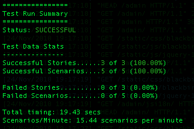

在下一个屏幕截图中，我们可以看到 Robot 框架测试也通过了：


## 它是如何工作的。。。

我们使用 Python 的`getopt`模块来定义命令行选项。

```py
    optlist, args = getopt.getopt(sys.argv[1:],
            "h",
           ["help", "test", "package", "publish", "register"])
```

该地图：

*   “h”：`-h`
*   “帮助”：`--help`
*   “测试”：`--test`
*   “包装”：`--package`
*   “发布”：`--publish`
*   “登记簿”：`--register`

我们扫描接收到的参数列表并调用相应的函数。对于我们的测试函数，我们使用 Python 的`subprocess`模块调用`pyccuracy_console`。我们也可以这样做来调用`pybot`，但是 Robot 框架提供了一个方便的 API 来直接调用它。

```py
    from robot import run
    run(".")
```

这让我们可以在代码中使用它。

## 还有更多。。。

要运行这些测试，我们需要运行 Selenium。我们的机器人框架测试是为自己运行 Selenium 而构建的。PyCurracy 没有这样的功能，所以它需要另一种方法。在这些食谱中，我们使用了`java``-jar``selenium-server.jar`。我们可以尝试对此进行管理，但使用 SeleniumLibrary 的 API 来启动和停止 Selenium 更容易。

这就是用纯 Python 编写代码给我们提供最多选择的地方。我们能够使用另一个库中从未打算使用它的部分来增强 PyAccuracy。

### 我们只能使用 getopt 吗？

Python 2.7 引入了`argparse`作为替代方案。目前的文档没有表明`getopt`已被弃用，所以我们可以像刚才一样安全地使用它。`getopt`模块是一个漂亮、易于使用的命令行解析器。

### 使用各种命令行工具有什么问题？

使用诸如`pyccuracy_console`、`pybot`、`nosetests`之类的工具以及 Python 库附带的许多其他工具并没有什么错。此方法的目的是提供一种方便的替代方法，将所有这些工具合并到一个中心脚本中。通过在这个脚本上投入一点时间，我们不必记住如何使用所有这些特性，而是可以开发脚本来支持项目的开发工作流程。