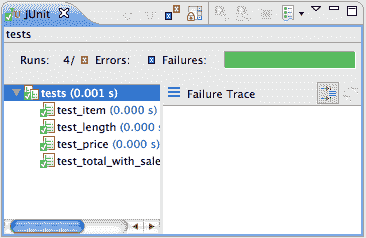
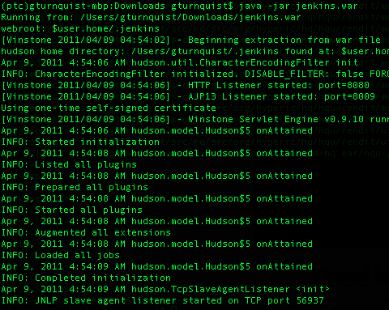
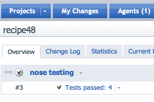
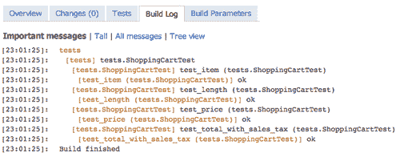
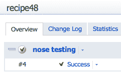
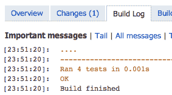
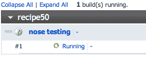
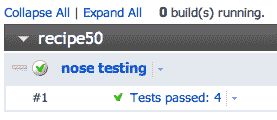

# 六、自动测试与持续集成的集成

在本章中，我们将介绍：

*   为 Jenkins 和 NoseXUnit 生成持续集成报告
*   配置 Jenkins 在提交时运行 Python 测试
*   配置 Jenkins 在计划时运行 Python 测试
*   使用 TeamCity nose 为 TeamCity 生成持续集成报告
*   配置 TeamCity 以在提交时运行 Python 测试
*   将 TeamCity 配置为按计划运行 Python 测试

# 导言

被称为瀑布模型的经典软件开发过程包括以下几个阶段：

1.  收集并定义需求。
2.  设计是为了满足要求而起草的。
3.  编写了满足设计要求的实施策略。
4.  编码完成了。
5.  对编码实现进行了测试。
6.  该系统与其他系统以及该系统的未来版本集成。

在瀑布模型中，这些步骤通常分布在几个月的工作中。这意味着与外部系统集成的最后一步是在几个月后完成的，通常需要花费大量的精力。

**持续集成（CI）**通过引入的概念来弥补瀑布模型的不足，即编写测试来执行这些集成点，并在代码签入系统时自动运行这些测试。采用持续集成的团队通常采用相应的策略，即在测试套件失败时立即修复基线。

这迫使团队不断地保持代码的工作和集成，从而使这最后一步相对免费。

采用更敏捷方法的团队在更短的周期内工作。团队可以在任何地方工作，从每周到每月的编码冲刺。同样，通过在每次签入时运行集成测试套件，基线始终保持功能性；因此，随时准备交付。

这可以防止系统处于非工作状态，而非工作状态只能在冲刺结束或瀑布循环结束时进入工作状态。它打开了与客户或管理层进行更多代码演示的大门，在这些代码演示中，可以收集反馈，并更主动地反馈到开发中。

本章更侧重于将自动化测试与 CI 系统集成，而不是编写测试。因此，我们将重用以下购物车应用程序。创建一个名为`cart.py`的新文件，并在其中输入以下代码：

```py
class ShoppingCart(object):
    def __init__(self):
        self.items = []

    def add(self, item, price):
        for cart_item in self.items:
            # Since we found the item, we increment
            # instead of append
            if cart_item.item == item:
                cart_item.q += 1
                return self

        # If we didn't find, then we append
        self.items.append(Item(item, price))
        return self

    def item(self, index):
        return self.items[index-1].item

    def price(self, index):
        return self.items[index-1].price * self.items[index-1].q

    def total(self, sales_tax):
        sum_price = sum([item.price*item.q for item in self.items])
        return sum_price*(1.0 + sales_tax/100.0)

    def __len__(self):
        return sum([item.q for item in self.items])

class Item(object):
    def __init__(self, item, price, q=1):
        self.item = item
        self.price = price
        self.q = q
```

为了实现这个简单的应用，本章中的各种配方将使用以下单元测试集来演示持续集成。创建另一个名为`tests.py`的文件，并在其中输入以下测试代码：

```py
from cart import *
import unittest

class ShoppingCartTest(unittest.TestCase):
    def setUp(self):
        self.cart = ShoppingCart().add("tuna sandwich", 15.00)

    def test_length(self):
        self.assertEquals(1, len(self.cart))

    def test_item(self):
        self.assertEquals("tuna sandwich", self.cart.item(1))

    def test_price(self):
        self.assertEquals(15.00, self.cart.price(1))

    def test_total_with_sales_tax(self):
        self.assertAlmostEquals(16.39, \
                                self.cart.total(9.25), 2)
```

这组简单的测试看起来不太令人印象深刻，是吗？事实上，它并不像我们之前讨论的那样是真正的集成测试，而是一些基本的单元测试，对吗？

绝对地本章的重点不是编写测试代码。那么，如果这本书是关于代码配方的，为什么我们要关注工具呢？因为与编写测试相比，让自动化测试与您的团队协同工作的意义更大。意识到将自动化测试的概念引入到我们的开发周期中的工具是很重要的。

持续集成产品是一个有价值的工具，我们需要了解如何将它们与我们的测试代码联系起来，从而使整个团队能够参与进来，使测试成为我们开发过程中的头等公民。

本章探讨两个强大的 CI 产品：Jenkins 和 TeamCity。

**詹金斯**[http://jenkins-ci.org/](http://jenkins-ci.org/) 是一款开源产品，由 SUN Microsystems 的一名开发人员领导，该开发人员在被 Oracle 收购后离职。它有一个强大的开发者社区，许多人提供补丁、插件和改进。它最初被称为哈德逊，但开发社区投票将其重命名，以避免法律纠纷。整个哈德逊/詹金斯命名法有更多的历史可以在线阅读，但与本书中的食谱无关。

**团队城市**[http://www.jetbrains.com/teamcity/](http://www.jetbrains.com/teamcity/) 是 Jet Brains 创造的产品，该公司生产 IntelliJ IDE、ReSharper和 PyCharm IDE等商业产品。专业版是一个免费版本，将在本章中用于展示另一个 CI 系统。它有一个企业级的商业升级，你可以自己评估。

# 使用 NoseXUnit 为 Jenkins 生成持续集成报告

**JUnit**[http://junit.org](http://junit.org) 是自动化测试领域的软件行业领导者。它提供了生成被许多工具使用的 XML 报告文件的能力。这扩展到像 Jenkins 这样的连续工具。

**鼻咽炎**[http://nosexunit.sourceforge.net/](http://nosexunit.sourceforge.net/) 是一个 Nose 插件，它可以生成 XML 报告，其中包含相同格式的 Python 测试结果。它的工作原理与 JUnit 与 XML 报告类似，但用于 unittest。即使我们没有构建 Java 代码，也没有要求我们的 CI 服务器不能是基于 Java 的系统。只要我们能够生成正确的报告，这些工具就可以使用。考虑到 Jenkins 是最流行和最受支持的 CI 系统之一，这种插件非常有用。

使用这个方法，我们将探索从简单的 Python 测试生成可消费的报告。

## 准备好了吗

要安装本章的所有组件，需要执行以下步骤。

1.  如[第 2 章](2.html "Chapter 2. Running Automated Test Suites with Nose")所示安装机头。
2.  安装 NoseXUnit（[http://nosexunit.sourceforge.net/](http://nosexunit.sourceforge.net/) ）通过键入`pip install nosexunit`。

## 怎么做。。。

以下步骤将演示如何使用 NoseXUnit 插件以 Jenkins 兼容的格式生成 XML 报告：

1.  Test the shopping cart application using nosetests and the NoseXUnit plugin by typing `nosetests tests.py --with-nosexunit`.

    

2.  Open the report found in `target/NoseXUnit/core/TEST-tests.xml` using an XML or text editor. The following screenshot shows the report displayed in SpringSource Tool Suite ([http://www.springsource.com/developer/sts](http://www.springsource.com/developer/sts)), an Eclipse derivative. (This is by no means a recommendation. Many modern IDEs have built-in XML support as do other editors like emacs, textpad, and so on).

    

## 它是如何工作的。。。

NoseXUnit 收集每个测试的结果，并生成一个与 JUnit 格式相同的 XML 报告。XML 文件不是设计为人类可消费的，但识别结果并不难。当我们早些时候运行测试时，有多少测试用例通过了？测试方法的名称是什么？

在这个 XML 文件中，我们可以看到四个测试用例的名称。事实上，如果此文件在某些工具（如 SpringSource 工具套件）中打开，它将显示为测试结果。



我们不必使用 STS 来做这些。事实上，STS 对于这个简单的任务来说有点重。您最喜欢的 XML 或文本编辑器可以检查报告。我只是想演示这个插件的输出如何与现有工具配合使用。

通过输入**nosetests help**，我们可以看到 nose 在所有已安装插件中的所有选项。这包括：

*   `--core-target=CORE_TARGET`：测试报告输出文件夹（默认为 target/NoseXUnit/core）
*   `--with-nosexunit`：通过插件运行

# 配置 Jenkins 在提交时运行 Python 测试

Jenkins 可以配置为在提交时调用我们的测试套件。这是非常有用的，因为我们可以让它跟踪我们的变化。使用 CI 系统的团队通常采取立即解决 CI 故障的态度，以保持基线功能。

Jenkins 提供了几乎无限的功能，例如从版本控制中检索最新的源代码、打包发行版、运行测试，甚至分析源代码。这个食谱展示了如何配置 Jenkins 来针对我们的购物车应用程序运行我们的测试套件。

## 准备好了吗

1.  Download Jenkins from [http://mirrors.jenkins-ci.org/war/latest/jenkins.war](http://mirrors.jenkins-ci.org/war/latest/jenkins.war).

    

2.  Start it up by running `java -jar jenkins.war`. It's important that no other applications are listening on port 8080.

    

3.  Open the console to confirm Jenkins is working.

    

4.  点击**管理詹金斯**。
5.  点击**管理插件**。
6.  点击**可用**选项卡。
7.  找到**Git 插件**并点击旁边的复选框。
8.  在页面底部，点击**安装**按钮。验证插件是否已成功安装。
9.  导航回仪表板屏幕。
10.  关闭 Jenkins 并重新启动它。
11.  在计算机上安装 git 源代码控件。您可以访问[http://git-scm.com/](http://git-scm.com/) 查找可下载的软件包。您的系统也可能包括软件包安装选项，如 mac ports 或 homebrew for mac、yum for Redhat-based Linux 发行版以及 apt get for Debian/Ubuntu 系统。
12.  为此配方创建一个空文件夹：

    ```py
    gturnquist$ mkdir /tmp/recipe46

    ```

13.  初始化源代码维护文件夹：

    ```py
    gturnquist$ git init /tmp/recipe46
    Initialized empty Git repository in /private/tmp/recipe46/.git/

    ```

14.  将购物车应用程序复制到文件夹中，添加并提交更改。

    ```py
    gturnquist$ cp cart.py /tmp/recipe46/
    gturnquist$ cd /tmp/recipe46/
    gturnquist$ git add cart.py
    gturnquist$ git commit -m "Added shopping cart application to setup this recipe."
    [master (root-commit) 057d936] Added shopping cart application to setup this recipe.
     1 files changed, 35 insertions(+), 0 deletions(-)
     create mode 100644 cart.py

    ```

## 怎么做。。。

以下步骤将说明如何控制代码，然后在进行任何更改并提交时运行测试套件：

1.  打开詹金斯控制台。
2.  点击**新作业**。
3.  输入**recipe46**作为**工作名称**并选择**构建自由风格软件项目**。
4.  点击**a**。
5.  在**源代码管理**部分，选择**Git**。对于**URL**，输入`/tmp/recipe46/`。
6.  在**构建触发器**部分，选择**轮询 SCM**并在计划框中输入*********，每分钟触发一次轮询。
7.  In the **Build** section, select **Execute shell** and enter the following adhoc script that loads the `virtualenv` and runs the test suite.

    ```py
    . /Users/gturnquist/ptc/bin/activate
    nosetests tests.py –with-nosexunit
    ```

    您需要替换该命令来激活您自己的 virtualenv，无论它是在 Windows、Linux 还是 Mac 上，然后使用用于运行测试的命令，就像我们在本章前面所做的那样。

8.  在**构建后操作**部分，选择**发布 JUnit 测试结果报告**并输入`target/NoseXUnit/core/*.xml`，以便 Jenkins 收集测试结果。
9.  点击**保存**保存所有作业设置。
10.  Click on **Enable Auto Refresh**. We should expect the first run to fail, because we haven't added any tests yet.

    

11.  将测试套件复制到受控源代码文件夹中，添加并提交。

    ```py
    gturnquist$ cp tests.py /tmp/recipe46/
    gturnquist$ cd /tmp/recipe46/
    gturnquist$ git add tests.py
    gturnquist$ git commit -m "Added tests for the recipe."
    [master 0f6ef56] Added tests for the recipe.
     1 files changed, 20 insertions(+), 0 deletions(-)
     create mode 100644 tests.py

    ```

12.  Watch to verify whether Jenkins launches a successful test run.

    

13.  导航到测试结果页面，在那里我们可以看到四个测试已经运行。

## 它是如何工作的。。。

Jenkins 提供了一种强大、灵活的方式来配置持续集成作业。在此配方中，我们将其配置为每分钟轮询一次软件确认管理系统。当它检测到更改时，它会提取软件的新副本并运行我们的测试脚本。

通过使用 NoseXUnit 插件，我们生成了一个工件，这个工件很容易用 Jenkins 获得。通过几个步骤，我们可以配置一个监视源代码的网页。

## 还有更多。。。

詹金斯有很多选择。如果检查 web 界面，可以深入查看输出日志以查看实际发生的情况。它还收集趋势，显示我们取得成功的时间、上次构建失败的时间等等。

### 我必须使用 git 进行源代码管理吗？

答案是否定的。我们在这个食谱中使用它来快速展示如何从 web 界面内部安装 Jenkins 插件。要应用插件，我们必须重新启动 Jenkins。

Subversion 和 CVS 是开箱即用的支持。Jenkins 也有支持每个主要源代码控制系统的插件，所以应该很容易满足您的需求。

事实上，像 GitHub和 BitKeeper这样的社交编码网站也得到了支持。我们可以将 Jenkins 安装配置为监视某个 GitHub 帐户的更新，而不是使用 Git 插件。

### 投票的形式是什么？

我们将轮询配置为`* * * * *`，即每分钟一次。这基于用于配置 crontab 文件的格式。从左到右的列是：

*   **分钟**-小时内分钟数（0-59）
*   **小时**-一天中的时间（0-23）
*   **DOM**-月日（1-31）
*   **月份**-月份（1-12）
*   **道琼斯指数**-一周中的一天（0-7），其中 0 和 7 是周日

## 另见

*   使用 NoseXUnit 为 Jenkins 生成持续集成报告

# 配置 Jenkins 在计划时运行 Python 测试

我们刚刚探讨了如何配置 Jenkins 在提交代码更改时运行测试套件。Jenkins 还可以配置为按预定的时间间隔调用我们的测试套件。这是非常有用的，因为我们可以调整它以进行预定的发布。每日或每周发布可以为潜在客户提供良好的发布节奏。

CI 版本通常不一定是最终版本，而是提供前沿支持，以防客户需要尽早调查和集成新功能。

## 准备好了吗

以下步骤用于设置 Jenkins 以及我们测试的副本，以便我们可以按计划的时间间隔轮询它：

1.  按照前面的配方*设置 Jenkins，配置 Jenkins 在提交*时运行 Python 测试。这应该包括设置 Git 插件。
2.  为此配方创建一个空文件夹。

    ```py
    gturnquist$ mkdir /tmp/recipe47

    ```

3.  初始化文件夹以进行源代码维护。

    ```py
    gturnquist$ git init /tmp/recipe47
    Initialized empty Git repository in /private/tmp/recipe47/.git/

    ```

4.  将购物车应用程序复制到文件夹中，添加它，然后提交更改。

    ```py
    gturnquist$ cp cart.py /tmp/recipe47/
    gturnquist$ cd /tmp/recipe47/
    gturnquist$ git add cart.py
    gturnquist$ git commit -m "Added shopping cart application to setup this recipe."
    [master (root-commit) 057d936] Added shopping cart application to setup this recipe.
     1 files changed, 35 insertions(+), 0 deletions(-)
     create mode 100644 cart.py

    ```

## 怎么做。。。

以下步骤将让我们探索创建 Jenkins 作业以定期运行自动化测试套件：

1.  打开詹金斯控制台。
2.  点击**新作业**。
3.  输入**recipe47**作为**工作名称**并选择**构建自由风格软件项目**。
4.  点击**确定**。
5.  在**源代码管理**部分，选择**Git**。对于**URL**，输入`/tmp/recipe47/`。
6.  在**构建触发器**部分，选择**定期构建**并输入未来某个时间。在写这本书的食谱时，作业是在下午 6:10 左右创建的，因此在日程表框中输入`15 18 * * *`将作业安排在未来 5 分钟的下午 6:15。
7.  In the **Build** section, select **Execute shell** and enter the following adhoc script that loads the `virtualenv` and runs the test suite.

    ```py
    . /Users/gturnquist/ptc/bin/activate
    nosetests tests.py –with-nosexunit
    ```

    您需要将其替换为用于激活 virtualenv 的命令，然后是运行测试的步骤。

8.  在**构建后操作**部分，选择**发布 JUnit 测试结果报告**并输入`target/NoseXUnit/core/*.xml`，以便 Jenkins 收集测试结果。
9.  点击**保存**保存所有作业设置。
10.  点击**启用自动刷新**。
11.  将测试套件复制到受控源代码文件夹中，添加并提交。

    ```py
    gturnquist$ cp tests.py /tmp/recipe47/
    gturnquist$ cd /tmp/recipe47/
    gturnquist$ git add tests.py
    gturnquist$ git commit -m "Added tests for the recipe."
    [master 0f6ef56] Added tests for the recipe.
     1 files changed, 20 insertions(+), 0 deletions(-)
     create mode 100644 tests.py

    ```

12.  Watch to verify whether Jenkins launches a successful test run.

    

13.  导航到测试结果，我们可以看到我们的四个测试已经运行。

## 它是如何工作的。。。

这与前面的方法非常相似，只是这次我们为运行测试套件配置了轮询间隔，而不是轮询版本控制系统。每天运行一次构建是非常有用的，以确保事情是稳定的和工作的。

## 还有更多。。。

詹金斯有很多选择。如果检查 web 界面，可以深入查看输出日志以查看实际发生的情况。它还收集趋势，显示我们取得成功的时间、上次构建失败的时间等等。

老实说，Jenkins 有这么多插件和选项，一本书都可以用来探索它的特性。本章的这半部分只是介绍如何在一些面向测试的常见工作中使用它。

### 詹金斯对 TeamCity

到目前为止，我们已经探索了使用 Jenkins。在本章后面，我们将访问 TeamCity。有什么区别？我们为什么要选一个呢？

就功能而言，它们都提供了强大的选择。这就是为什么他们都在这本书中。两者提供的关键是设置作业以运行测试以及其他事情，如打包。

一个关键的区别是 Jenkins 是一个开源产品，TeamCity 是商业产品。您或您的公司可能更喜欢与产品相关的付费公司（[http://www.jetbrains.com/](http://www.jetbrains.com/) ），这是 TeamCity 提供的。这并不能让决策变得清晰，因为 Jenkins 的主要开发者目前为 CloudBees（[工作 http://www.cloudbees.com/](http://www.cloudbees.com/) ），投资 Jenkins 及其周边产品。

如果商业支持不是必须的，你可能会发现 Jenkins 的开发速度更快，插件的数量也更多样化。底线是，选择满足 CI 需求的产品需要进行详细的分析，这里无法回答。

## 另见

*   使用 NoseXUnit 为 Jenkins 生成持续集成报告

# 使用 TeamCity nose 为 TeamCity 生成 CI 报告

有一个 Nose 插件，可以自动检测何时从 TeamCity 内部运行测试。这可以方便地捕获测试结果并与 TeamCity 进行通信。通过这个方法，我们将探索如何在 TeamCity 内部设置一个 CI 作业，运行我们的测试，然后手动调用该作业。

## 准备好了吗

需要以下步骤让我们做好运行 TeamCity CI 作业的准备：

1.  按照[第 2 章](2.html "Chapter 2. Running Automated Test Suites with Nose")所示安装测试。
2.  通过键入`pip install teamcity-nose`安装 teamcity nose。
3.  使用 wget[下载 TeamCityhttp://download.jetbrains.com/teamcity/TeamCity-6.0.tar.gz](http://download.jetbrains.com/teamcity/TeamCity-6.0.tar.gz) 。
4.  打开下载包。
5.  切换到`TeamCity/bin`目录。
6.  启动：`./runAll.sh start`。
7.  打开指向`http://localhost:8111`的浏览器。
8.  如果这是您第一次启动 TeamCity，请接受许可协议。
9.  通过选择用户名和密码创建管理员帐户。
10.  在计算机上安装 git 源代码控件。
11.  为此配方创建一个空文件夹。

    ```py
    gturnquist$ mkdir /tmp/recipe48

    ```

12.  初始化文件夹以进行源代码维护。

    ```py
    gturnquist$ git init /tmp/recipe48
    Initialized empty Git repository in /private/tmp/recipe48/.git/

    ```

13.  将购物车应用程序和测试复制到文件夹中，添加它，然后提交更改。

    ```py
    gturnquist$ cp cart.py /tmp/recipe48/
    gturnquist$ cp tests.py /tmp/recipe48/
    gturnquist$ cd /tmp/recipe48/
    gturnquist$ git add cart.py tests.py
    gturnquist$ git commit -m "Added shopping cart and tests to setup this recipe."
    [master (root-commit) ccc7155] Added shopping cart and tests to setup this recipe.
     2 files changed, 55 insertions(+), 0 deletions(-)
     create mode 100644 cart.py
     create mode 100644 tests.py

    ```

## 怎么做。。。

以下步骤将向我们展示如何在 TeamCity 中配置 CI 作业：

1.  登录 TeamCity 控制台。
2.  在**项目**页签下方，点击**创建项目**。
3.  输入**recipe48**，然后点击**创建**。
4.  点击**为该项目添加构建配置**。
5.  输入**鼻子测试**作为名称，然后点击**VCS 设置**。
6.  点击**创建并附加新的 VCS 根目录**。
7.  在**VCS 根名称**中输入**recipe48**。
8.  选择**Git**作为 VCS 的**类型。**
9.  输入`/tmp/recipe48`作为**获取 URL**。
10.  点击**测试连接**确认设置，然后点击**保存**。
11.  点击**添加构建步骤**。
12.  为**转轮类型**选择**命令行**。
13.  Select **Custom script** for **Run** type and enter the following script:

    ```py
    . /Users/gturnquist/ptc/bin/activate
    nosetests tests.py
    ```

    您需要使用激活 virtualenv 所需的命令对此进行自定义。

14.  点击**保存**。
15.  Go back to the project, and manually run it.

    

## 它是如何工作的。。。

此插件设计为不使用命令行参数调用的经典样式。相反，每当执行 nosetests 时，它会自动运行，并检查是否存在特定于 TeamCity 的环境变量集。如果是这样的话，它将通过打印出可查看的结果以及将有用的信息发送回 TeamCity 来发挥作用。



否则，插件会让自己被绕过，什么也不做。如果插件未安装，则输出如下屏幕截图：



反过来，钻取细节将显示以下输出，但没有多少细节。有四个阶段，每个测试方法一个，但我们知道的不多。



这意味着使用 TeamCity 插件不需要额外的参数，但从 TeamCity 之外的命令行运行它不会导致任何更改。

# 配置 TeamCity 在提交时运行 Python 测试

TeamCity 可以配置为在提交时调用测试套件。

## 准备好了吗

以下步骤将有助于我们准备在提交代码更改时运行我们的测试套件：

1.  按照前面的方法建立 TeamCity，并启动它。您还需要安装`git`，如本章前面所述。
2.  为此配方创建一个空文件夹。

    ```py
    gturnquist$ mkdir /tmp/recipe49

    ```

3.  初始化文件夹以进行源代码维护。

    ```py
    gturnquist$ git init /tmp/recipe49
    Initialized empty Git repository in /private/tmp/recipe49/.git/
    ```

4.  将购物车应用程序复制到文件夹中，添加它，然后提交更改。

    ```py
    gturnquist$ cp cart.py /tmp/recipe49/
    gturnquist$ cd /tmp/recipe49/
    gturnquist$ git add cart.py
    gturnquist$ git commit -m "Added shopping cart application to setup this recipe."
    [master (root-commit) 057d936] Added shopping cart application to setup this recipe.
     1 files changed, 35 insertions(+), 0 deletions(-)
     create mode 100644 cart.py

    ```

## 怎么做。。。

这些步骤将向我们展示如何创建 TeamCity 作业，该作业轮询版本控制以检测更改，然后运行测试套件。

1.  登录 TeamCity 控制台。
2.  在**项目**页签下方，点击**创建项目**。
3.  输入**recipe49**，然后点击**创建**。
4.  点击**为该项目添加构建配置**。
5.  输入**鼻子测试**作为名称，然后点击**VCS 设置**。
6.  点击**创建并附加新的 VCS 根目录**。
7.  在**VCS 根名称**中输入**recipe49**。
8.  选择**Git**作为 VCS 的**类型。**
9.  输入`/tmp/recipe49`作为**获取 URL**。
10.  点击**测试连接**确认设置，然后点击**保存**。
11.  点击**添加构建步骤**。
12.  为**转轮类型**选择**命令行**。
13.  Select **Custom script** for **Run** type and enter the following script:

    ```py
    . /Users/gturnquist/ptc/bin/activate
    nosetests tests.py
    ```

    您必须将其替换为激活自己的 virtualenv 并调用 nosetests 的命令。

14.  点击**保存**。
15.  点击**构建触发**。
16.  点击**添加新触发器**。
17.  从**触发器类型**中选取**VCS 触发器**。
18.  顶部应显示**如果检测到 VCS 签入，VCS 触发器将向队列中添加构建**。点击**保存**。
19.  导航回**项目**。不应安排任何作业或显示任何结果。
20.  Click on **Run**. It should fail, because we haven't added the tests to the repository.

    

21.  从命令行将测试文件复制到存储库中。然后添加它并提交它。

    ```py
    gturnquist$ cp tests.py /tmp/recipe49/
    gturnquist$ cd /tmp/recipe49/
    gturnquist$ git add tests.py
    gturnquist$ git commit -m "Adding tests."
    [master 4c3c418] Adding tests.
     1 files changed, 20 insertions(+), 0 deletions(-)
     create mode 100644 tests.py

    ```

22.  Go back to the browser. It may take a minute for TeamCity to detect the change in the code and start another build job. It should automatically update the screen.

    

## 它是如何工作的。。。

在这个配方中，我们将 TeamCity 配置为与特定触发器相关联的工作。触发器是：每当签入软件基线时。我们必须采取几个步骤来配置它，但它展示了 TeamCity 提供的灵活的电源。

我们还安装了 teamcity nose 插件，这为我们提供了更多关于结果的详细信息。

## 还有更多。。。

TeamCity 将我们的**鼻子测试**工作称为构建工作。这是因为运行测试并不是 TeamCity 唯一的用途。相反，它适合于构建包、部署到站点，以及任何我们希望它在提交时执行的其他操作。这就是为什么 CI 服务器有时被称为**构建服务器**。

但如果我们从测试基线这样的简单工作开始，我们就可以很好地发现 TeamCity 提供的其他有用功能。

### teamcity nose 给了我们什么？

这是一个 nose 插件，为我们提供了更详细的输出。我们在这个食谱中没有详细说明。

## 另见

*   使用 TeamCity nose 为 TeamCity 生成 CI 报告
*   配置 Jenkins 在提交时运行 Python 测试

# 配置 TeamCity 在计划时运行 Python 测试

TeamCity 可以配置为调用我们的测试套件，并在预定的时间间隔内收集结果。

## 准备好了吗

通过启动 TeamCity 并准备一些代码进行测试，这些步骤将为我们准备好这一配方：

1.  像我们在本章前面所做的那样建立 TeamCity，并将其建立并运行。
2.  为此配方创建一个空文件夹。

    ```py
    gturnquist$ mkdir /tmp/recipe50

    ```

3.  初始化文件夹以进行源代码维护。

    ```py
    gturnquist$ git init /tmp/recipe50
    Initialized empty Git repository in /private/tmp/recipe50/.git/

    ```

4.  将购物车应用程序复制到文件夹中，添加它，然后提交更改。

    ```py
    gturnquist$ cp cart.py /tmp/recipe50/
    gturnquist$ cp tests.py /tmp/recipe50/
    gturnquist$ cd /tmp/recipe50/
    gturnquist$ git add cart.py tests.py
    gturnquist$ git commit -m "Adding shopping cart and tests for this recipe."
    [master (root-commit) 01cd72a] Adding shopping cart and tests for this recipe.
     2 files changed, 55 insertions(+), 0 deletions(-)
     create mode 100644 cart.py
     create mode 100644 tests.py

    ```

## 怎么做。。。

这些步骤显示了配置 TeamCity 以按计划运行测试套件的详细信息：

1.  登录 TeamCity 控制台。
2.  在**项目**页签下方，点击**创建项目**。
3.  输入**recipe50**，然后点击**创建**。
4.  点击**为该项目添加构建配置**。
5.  输入**鼻子测试**作为名称，然后点击**VCS 设置**。
6.  点击**创建并附加新的 VCS 根目录**。
7.  在**VCS 根目录名称**中输入**recipe50**。
8.  选择**Git**作为 VCS 的**类型。**
9.  输入`/tmp/recipe50`作为**获取 URL**。
10.  点击**测试连接**确认设置，然后点击**保存**。
11.  点击**添加构建步骤**。
12.  为**转轮类型**选择**命令行**。
13.  Select **Custom script** for **Run** type and enter the following script:

    ```py
    . /Users/gturnquist/ptc/bin/activate
    nosetests tests.py
    ```

    将此替换为您自己的步骤来激活 virtualenv，然后使用 nosetests 运行测试。

14.  点击**保存**。
15.  点击**构建触发**。
16.  点击**添加新触发器**。
17.  从**触发类型**中选择**定时触发**。
18.  选择**每日**作为频率，选择未来五分钟左右的时间。
19.  仅当存在挂起的更改时，取消选择**触发构建的选项。**
20.  点击**保存**。
21.  导航回**项目**。不应安排任何作业或显示任何结果。
22.  Wait for the scheduled time to occur. The following screenshot shows the job when it is activated:

    

以下屏幕截图显示了我们通过测试后总结的结果：



## 它是如何工作的。。。

这和之前的食谱看起来不是很相似吗？当然我们通过创建一个基于时间的触发器而不是基于源代码的触发器来改变它。我们选择的时间触发器是在设定的时间进行的每日计划构建。重点是展示一个常用的触发规则。通过了解什么是相同的，什么是不同的，我们可以开始了解如何弯曲 TeamCity 以满足我们的需求。

TeamCity 还有其他非常有用的触发器，比如在另一个作业完成时触发一个作业。这让我们可以建立许多小而简单的工作，并将它们链接在一起。

我们还安装了 teamcity nose 插件，它为我们提供了更多关于结果的详细信息。

## 另见

*   使用 TeamCity nose 为 TeamCity 生成 CI 报告
*   配置 Jenkins 在计划时运行 Python 测试