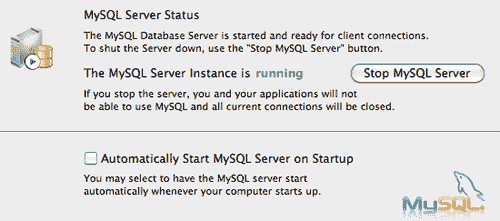
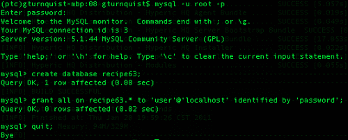
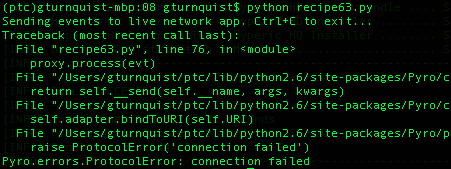
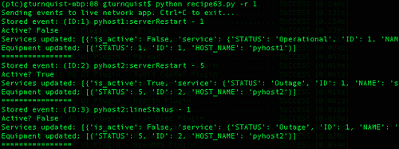
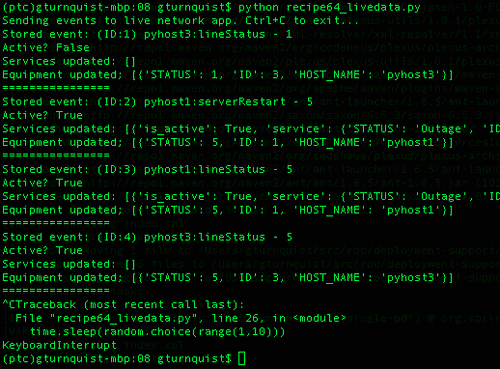
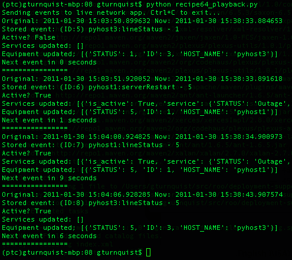
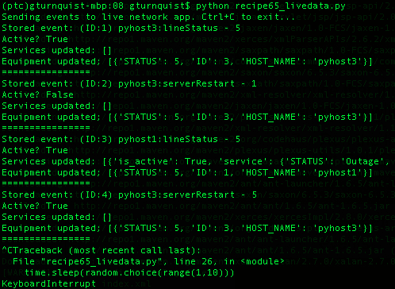
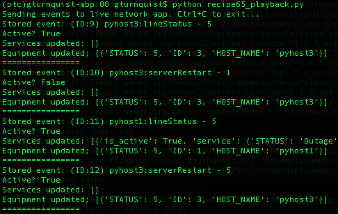

# 第 8 章烟雾/负载测试主要部件

在本章中，我们将介绍：

*   使用导入语句定义测试用例的子集
*   忽略集成测试
*   针对端到端场景
*   以测试服务器为目标
*   编写数据模拟器
*   实时录制和播放实时数据
*   尽可能快地录制和播放实时数据
*   自动化您的管理演示

# 导言

编写自动化测试的团队很少采用冒烟测试。编写测试来验证工作是否正常，或者暴露 bug，这是一种普遍采用的做法，许多团队都接受了验收测试的想法，以验证他们的应用程序是否满足客户需求。

但是烟雾测试有点不同。烟雾测试的关键思想之一是查看系统是否有脉冲。这是什么意思？这类似于医生第一次看病人的时候。他们做的第一件事是检查患者的脉搏和其他生命体征。无脉搏；关键问题！那么，在软件中，脉冲究竟是由什么构成的呢？这就是我们将在本章食谱中探讨的内容。

与考虑确保系统每个角落都已检查的全面测试套件不同，烟雾测试采用了更广阔的视角。一组烟雾测试旨在确保系统正常运行。这几乎就像一张支票。将其与理智测试进行比较。理智测试用于证明一小部分情况确实有效。烟雾测试在快速和浅层的意义上类似，其目的是查看系统是否处于足够的状态，以继续进行更广泛的测试。

如果您设想构建一个用于接收发票的应用程序，那么一组冒烟测试可能包括：

*   验证测试文件是否已被使用
*   验证分析的行数
*   核实账单总额

这听起来像是一个小测试集吗？它不完整吗？是的。这就是我的想法。我们不是在验证我们的软件是否正确解析了所有内容，而是在验证必须工作的几个关键领域。如果它无法读取一个文件，那么就需要解决一个主要问题。如果账单的总数不正确，那么同样，必须处理一些大问题。

### 注

烟雾测试的一个关键副作用是，这些测试应该快速运行。如果我们改变了处理文件的函数呢？如果我们的测试套件需要解析许多不同的文件类型，那么可能需要很长时间来验证我们没有破坏任何东西。与其花 30 分钟来运行一个全面的测试套件，不如先运行一分钟的快速测试，然后再花 29 分钟来开发软件，这样不是更好吗？

烟雾测试在准备客户演示时也可以使用。随着紧张局势的加剧，最好更频繁地运行测试，以确保我们没有破坏任何东西。在启动演示之前，可能需要进行最后一次脉冲检查，以了解系统是否处于活动状态。

本章还介绍了负载测试。负载测试对于验证我们的应用程序是否能够处理实际情况的压力至关重要。这通常涉及收集真实世界的数据，并通过我们的软件在可复制的环境中回放数据。虽然我们需要知道我们的系统能够处理今天的负载，但明天的负载保持不变的可能性有多大？不多

找出应用程序中的下一个瓶颈非常有用。这样，我们就可以在生产负荷达到之前消除它。强调系统的一种方法是尽可能快地回放真实世界的数据。

在本章中，我们将介绍一些涉及烟雾测试和负载测试的配方，这些配方是我们在上一章中开发的网络管理应用程序，使用[第 7 章](7.html "Chapter 7. Measuring your Success with Test Coverage")、*构建网络管理应用程序*中的配方。我们将施加在应用上的荷载类型也可以描述为浸泡试验和应力试验。浸泡试验被描述为在相当长的一段时间内对系统施加相当大的负荷。压力测试被描述为加载一个系统直到它崩溃。

### 注

在我看来，浸泡测试和压力测试是负载测试的不同方面。这就是为什么本章仅使用术语负载测试，而各种方法可以轻松扩展到这些类型的测试。

本章中的代码还使用了 Spring Python 提供的几个实用程序（[http://springpython.webfactional.com](http://springpython.webfactional.com) ）。您可以在[第 7 章](7.html "Chapter 7. Measuring your Success with Test Coverage")中阅读有关其使用和功能以及如何安装的更多详细信息。

本章中的许多配方都与 MySQL 数据库交互。通过键入：`pip install mysql-python`安装 Python MySQLdb 库。

本章中的一些方法使用 Python 远程对象或 Pyro（[）http://www.xs4all.nl/~irmen/pyro3/](http://www.xs4all.nl/~irmen/pyro3/)。它是一个支持线程和进程之间通信的**远程**过程**调用****RPC**库。通过键入`pip install pyro`安装 Pyro。

# 使用导入语句定义测试用例子集

创建一个 Python 模块，有选择地导入要运行的测试用例。

## 怎么做。。。

通过这些步骤，我们将有选择地选择一组较小的测试，以促进更快的测试运行。

1.  创建一个名为`recipe59_test.py`的测试模块，用于针对我们的网络应用程序编写一些测试。

    ```py
    import logging
    from network import *
    import unittest
    from springpython.database.factory import *
    from springpython.database.core import *
    ```

2.  创建一个测试用例，删除数据库连接并删除数据访问函数。

    ```py
    class EventCorrelatorUnitTests(unittest.TestCase):
        def setUp(self):
            db_name = "recipe59.db"
            factory = Sqlite3ConnectionFactory(db=db_name)
            self.correlator = EventCorrelator(factory)

            # We "unplug" the DatabaseTemplate so that
            # we don't talk to a real database.
            self.correlator.dt = None

            # Instead, we create a dictionary of
            # canned data to return back
            self.return_values = {}

            # For each sub-function of the network app,
            # we replace them with stubs which return our
            # canned data.

            def stub_store_event(event):
                event.id = self.return_values["id"]
                return event, self.return_values["active"]
            self.correlator.store_event = stub_store_event

            def stub_impact(event):
                return (self.return_values["services"],
                        self.return_values["equipment"])
            self.correlator.impact = stub_impact

            def stub_update_service(service, event):
                return service + " updated"
            self.correlator.update_service = stub_update_service

            def stub_update_equip(equip, event):
                return equip + " updated"
            self.correlator.update_equipment = stub_update_equip
    ```

3.  创建一个测试方法，该方法创建一组固定数据值，调用应用程序的处理方法，然后验证这些值。

    ```py
        def test_process_events(self):
            # For this test case, we can preload the canned data,
            # and verify that our process function is working
            # as expected without touching the database.

            self.return_values["id"] = 4668
            self.return_values["active"] = True
            self.return_values["services"] = ["service1",
                                              "service2"]
            self.return_values["equipment"] = ["device1"]

            evt1 = Event("pyhost1", "serverRestart", 5)

            stored_event, is_active, \
               updated_services, updated_equipment = \
                         self.correlator.process(evt1)

            self.assertEquals(4668, stored_event.id)
            self.assertTrue(is_active)

            self.assertEquals(2, len(updated_services))
            self.assertEquals(1, len(updated_equipment))
    ```

4.  创建另一个使用 SQL 脚本预加载数据库的测试用例（有关 SQL 脚本的详细信息，请参见[第 7 章](7.html "Chapter 7. Measuring your Success with Test Coverage")、*构建网络管理应用程序*。

    ```py
    class EventCorrelatorIntegrationTests(unittest.TestCase):
        def setUp(self):
            db_name = "recipe59.db"
            factory = Sqlite3ConnectionFactory(db=db_name)
            self.correlator = EventCorrelator(factory)
            dt = DatabaseTemplate(factory)
            sql = open("network.sql").read().split(";")
            for statement in sql:
                dt.execute(statement + ";")
    ```

5.  编写一个调用网络应用程序的 process 方法的测试方法，然后打印结果。

    ```py
        def test_process_events(self):
            evt1 = Event("pyhost1", "serverRestart", 5)

            stored_event, is_active, \
               updated_services, updated_equipment = \
                         self.correlator.process(evt1)

            print "Stored event: %s" % stored_event
            if is_active:
                print "This event was an active event."

            print "Updated services: %s" % updated_services
            print "Updated equipment: %s" % updated_equipment
            print "---------------------------------"
    ```

6.  创建一个名为`recipe59.py`的新文件，该文件只导入基于 SQL 的测试用例。

    ```py
    from recipe59_test import EventCorrelatorIntegrationTests

    if __name__ == "__main__":
        import unittest
        unittest.main()
    ```

7.  Run the test module.

    

## 它是如何工作的。。。

我们需要编写各种测试用例来覆盖我们需要的不同级别的测试。通过将测试运行程序与测试用例分离，我们可以决定只运行与数据库集成的测试。

我们为什么要这样做？在我们的情况下，我们只有一个单元测试，它运行得非常快。您认为一个经过数月或数年开发和相应测试套件的真实应用程序会运行得同样快吗？当然不是！

有些测试可能很复杂。它们可能涉及到与真实系统对话、解析大量样本数据文件以及其他耗时的任务。这实际上可能需要几分钟或几小时来运行。

当我们准备向客户进行演示时，我们不需要长时间运行的测试套件。相反，我们需要能够快速运行这些测试的子集，从而让我们相信事情正在运行。使用 Python 的 import 语句可以很容易地定义这一点。

我们可能需要考虑的一些套房包括：

*   `pulse.py`：导入一组测试用例，对应用程序进行广泛而肤浅的测试，以验证系统“有脉搏”
*   `checkin.py`：导入一组当前正在运行的测试用例，并提供足够的信心，确保代码准备好提交
*   `integration.py`：导入一组测试用例，这些测试用例启动、交互，然后关闭外部系统，如 LDAP、数据库或其他子系统
*   `security.py`：导入一组针对各种安全场景的测试用例，确认凭证处理的好坏
*   `all.py`：导入所有测试用例，确保一切正常

这只是我们可以定义的测试模块类型的一个示例。可以为我们处理的每个子系统定义一个模块。但是由于我们讨论的是冒烟测试，我们可能需要更广泛地思考，而是从每个子系统中选择一些关键测试，并将它们联系在一起，让我们感觉应用程序正在工作。

### 安全、检查和集成不是烟雾测试！

这是绝对正确的。前面的列表显示，使用 Python 导入语句并不局限于定义冒烟测试套件。它可以用于将满足不同需求的测试用例捆绑在一起。既然我们讨论的是烟雾测试，为什么还要提这个问题呢？我想表达这个机制对于组织测试是多么有用，它超越了烟雾测试。

### 什么提供了良好的灵活性？

为了在选择测试类时具有良好的灵活性，我们应该避免使测试类太大。但是将每个测试方法放在不同的类中可能太多了。

## 另见

*   [第 7 章](7.html "Chapter 7. Measuring your Success with Test Coverage")构建网管应用
*   忽略集成测试

# 遗漏集成测试

快速测试套件可避免连接到远程系统，如数据库、LDAP 等。只需验证核心单元并避免外部系统，即可使测试套件运行更快，覆盖范围更广。这可能导致一个有用的冒烟测试，它为开发人员提供了对系统的信心，而无需运行所有测试。

## 怎么做。。。

通过这些步骤，我们将看到如何删除与外部系统交互的测试用例。

1.  创建一个名为`recipe60_test.py`的测试模块，用于针对我们的网络应用程序编写一些测试。

    ```py
    import logging
    from network import *
    import unittest
    from springpython.database.factory import *
    from springpython.database.core import *
    ```

2.  创建一个测试用例，删除数据库连接并删除数据访问函数。

    ```py
    class EventCorrelatorUnitTests(unittest.TestCase):
        def setUp(self):
            db_name = "recipe60.db"
            factory = Sqlite3ConnectionFactory(db=db_name)
            self.correlator = EventCorrelator(factory)

            # We "unplug" the DatabaseTemplate so that
            # we don't talk to a real database.
            self.correlator.dt = None

            # Instead, we create a dictionary of
            # canned data to return back
            self.return_values = {}

            # For each sub-function of the network app,
            # we replace them with stubs which return our
            # canned data.

            def stub_store_event(event):
                event.id = self.return_values["id"]
                return event, self.return_values["active"]
            self.correlator.store_event = stub_store_event

            def stub_impact(event):
                return (self.return_values["services"],
                        self.return_values["equipment"])
            self.correlator.impact = stub_impact

            def stub_update_service(service, event):
                return service + " updated"
            self.correlator.update_service = stub_update_service

            def stub_update_equip(equip, event):
                return equip + " updated"
            self.correlator.update_equipment = stub_update_equip
    ```

3.  创建一个测试方法，该方法创建一组固定数据值，调用应用程序处理方法，然后验证这些值。

    ```py
        def test_process_events(self):
            # For this test case, we can preload the canned data,
            # and verify that our process function is working
            # as expected without touching the database.

            self.return_values["id"] = 4668
            self.return_values["active"] = True
            self.return_values["services"] = ["service1",
                                              "service2"]
            self.return_values["equipment"] = ["device1"]

            evt1 = Event("pyhost1", "serverRestart", 5)

            stored_event, is_active, \
               updated_services, updated_equipment = \
                         self.correlator.process(evt1)

            self.assertEquals(4668, stored_event.id)
            self.assertTrue(is_active)

            self.assertEquals(2, len(updated_services))
            self.assertEquals(1, len(updated_equipment))
    ```

4.  创建另一个使用 SQL 脚本预加载数据库的测试用例（有关 SQL 脚本的详细信息，请参见[第 7 章](7.html "Chapter 7. Measuring your Success with Test Coverage")、*构建网络管理应用程序*。

    ```py
    class EventCorrelatorIntegrationTests(unittest.TestCase):
        def setUp(self):
            db_name = "recipe60.db"
            factory = Sqlite3ConnectionFactory(db=db_name)
            self.correlator = EventCorrelator(factory)

            dt = DatabaseTemplate(factory)
            sql = open("network.sql").read().split(";")
            for statement in sql:
                dt.execute(statement + ";")
    ```

5.  编写一个调用网络应用程序处理方法的测试方法，然后打印结果。

    ```py
        def test_process_events(self):
            evt1 = Event("pyhost1", "serverRestart", 5)

            stored_event, is_active, \
               updated_services, updated_equipment = \
                         self.correlator.process(evt1)

            print "Stored event: %s" % stored_event
            if is_active:
                print "This event was an active event."

            print "Updated services: %s" % updated_services
            print "Updated equipment: %s" % updated_equipment
            print "---------------------------------"
    ```

6.  创建一个名为`recipe60.py`的模块，该模块只导入避免进行 SQL 调用的单元测试。

    ```py
    from recipe60_test import EventCorrelatorUnitTests
    if __name__ == "__main__":
        import unittest
        unittest.main()
    ```

7.  Run the test module.

    

## 它是如何工作的。。。

此测试套件执行单元测试，并避免运行与实时数据库集成的测试用例。它使用 Python 导入语句来决定要包含哪些测试用例。

在我们人为设计的场景中，几乎没有获得性能。但是对于一个实际的项目，由于与外部系统对话的额外成本，可能会有更多的计算机周期花费在集成测试上。

我们的想法是创建一个测试子集，在一定程度上验证我们的应用程序是否工作，方法是在更短的时间内覆盖一大块应用程序。

烟雾测试的诀窍是确定什么是足够好的测试。自动化测试不能完全确认我们的应用程序没有 bug。我们被这样一个事实所挫败：要么某个特定的 bug 不存在，要么我们还没有编写一个暴露这样一个 bug 的测试用例。为了进行烟雾测试，我们决定使用这些测试的子集进行快速脉冲读取。同样，决定哪一个子集能给我们足够好的脉搏可能更像是艺术而不是科学。

这个方法的重点是单元测试可能会运行得更快，而删除集成测试将删除较慢的测试用例。如果所有的单元测试都通过了，那么我们的应用程序就有信心处于良好状态。

## 还有更多。。。

我必须指出的是，测试用例并不只是容易归入**单元测试**或**集成测试**的范畴。它更像是一个连续体。在这个配方的示例代码中，我们编写了一个单元测试和一个集成测试，并为烟雾测试套件选择了单元测试。

这似乎是武断的，也许是人为的？当然有。这就是为什么烟雾测试不是一成不变的，而是需要对选择什么进行一些分析和判断。随着发展的进行，还有微调的余地。

### 提示

我曾经开发了一个系统，接收来自不同供应商的发票。我编写了单元测试，设置空数据库表，接收多种格式的文件，然后检查数据库内容以验证处理。测试套件的运行时间超过 45 分钟。这迫使我不能像预期的那样经常运行测试套件。我制作了一个冒烟测试套件，它只涉及运行不与数据库对话的单元测试（因为它们很快），并接受一张供应商发票。它在不到五分钟的时间内运行，并提供了一种更快的方法来确保对代码的根本更改不会破坏整个系统。我可以在一天中运行很多次，并且每天只运行一次综合套件。

### 烟雾测试应该包括集成测试还是单元测试？

该代码是否与使用导入语句定义测试用例子集的配方*中显示的代码非常相似？是的。那么为什么要把它包括在这个食谱中呢？因为为烟雾测试套件选择的内容与实现烟雾测试套件的策略一样重要。另一种方法决定在删除单元测试的同时进行集成测试，以创建更小、运行更快的测试套件。*

这个方法表明，另一种可能性是减少较长的集成测试，而是尽可能多地运行单元测试，因为它们可能更快。

如前所述，烟雾测试不是简单的。它涉及选择测试的最佳表示形式，而不占用运行测试的太多时间。很可能到目前为止编写的所有测试都没有准确地针对捕获系统脉冲的想法。一个好的冒烟测试套件可能涉及混合单元测试和集成测试的子集。

## 另见

*   [第 7 章](7.html "Chapter 7. Measuring your Success with Test Coverage")构建网管应用
*   使用导入语句定义测试用例的子集

# 针对端到端场景

选择一系列测试，这些测试需要使用足够的部分来定义执行线程。这有时被称为线程测试。不是因为我们使用软件线程，而是因为我们关注的是故事线程。通常，我们的线程要么来自客户场景，要么至少受到客户场景的启发。其他线程可能涉及其他操作组。

例如，网络管理系统可能会发出影响客户的警报，但必须解决网络问题的内部运营团队可能会有完全不同的观点。这两种情况都证明了有效的端到端线程是投资于自动化测试的好地方。

### 注

如果不同的团队被视为不同类型的客户，那么验收测试的概念肯定适用。这也可能与 BDD 的概念重叠。

## 准备好了吗

1.  Copy the SQL script from [Chapter 7](7.html "Chapter 7. Measuring your Success with Test Coverage"), *Creating a network management application* into a new file called `recipe61_network.sql` and replace the insert statements at the bottom with the following:

    ```py
    INSERT into EQUIPMENT (ID, HOST_NAME, STATUS) values (1, 'pyhost1', 1);
    INSERT into EQUIPMENT (ID, HOST_NAME, STATUS) values (2, 'pyhost2', 1);
    INSERT into EQUIPMENT (ID, HOST_NAME, STATUS) values (3, 'pyhost3', 1);

    INSERT into SERVICE (ID, NAME, STATUS) values (1, 'service-abc', 'Operational');

    INSERT into SERVICE_MAPPING (SERVICE_FK, EQUIPMENT_FK) values (1,1);
    INSERT into SERVICE_MAPPING (SERVICE_FK, EQUIPMENT_FK) values (1,2);
    ```

    在这组测试数据中，`pyhost1`和`pyhost2`映射为`service-abc`。然而，`pyhost3`没有映射到任何服务。

## 怎么做。。。

通过这些步骤，我们将构建一个端到端测试场景。

1.  创建一个名为`recipe61_test.py`的测试模块。
2.  创建一个测试用例，其中每个测试方法捕获不同的执行线程。

    ```py
    import logging
    from network import *
    import unittest
    from springpython.database.factory import *
    from springpython.database.core import *

    class EventCorrelatorEquipmentThreadTests(unittest.TestCase):
        def setUp(self):
            db_name = "recipe61.db"
            factory = Sqlite3ConnectionFactory(db=db_name)
            self.correlator = EventCorrelator(factory)

            dt = DatabaseTemplate(factory)
            sql = open("recipe61_network.sql").read().split(";")
            for statement in sql:
                dt.execute(statement + ";")

        def tearDown(self):
            self.correlator = None
    ```

3.  创建一种测试方法，捕捉设备故障和恢复的线索。

    ```py
        def test_equipment_failing(self):
            # This alarm maps to a device
            # but doesn't map to any service.
    ```

4.  让测试方法注入单一故障警报，然后确认相关设备出现故障。

    ```py
            evt1 = Event("pyhost3", "serverRestart", 5)

            stored_event, is_active, \
               updated_services, updated_equipment = \
                         self.correlator.process(evt1)

            self.assertTrue(is_active)

            self.assertEquals(len(updated_services), 0)
            self.assertEquals(len(updated_equipment), 1)
            self.assertEquals(updated_equipment[0]["HOST_NAME"],
                                                      "pyhost3")
            # 5 is the value for a failed piece of equipment
            self.assertEquals(updated_equipment[0]["STATUS"], 5)
    ```

5.  在相同的测试方法中，添加注入单一清除警报的代码，并确认设备已恢复。

    ```py
            evt2 = Event("pyhost3", "serverRestart", 1)

            stored_event, is_active, \
                updated_services, updated_equipment = \
                     self.correlator.process(evt2)

            self.assertFalse(is_active)

            self.assertEquals(len(updated_services), 0)
            self.assertEquals(len(updated_equipment), 1)
            self.assertEquals(updated_equipment[0]["HOST_NAME"],
                                                      "pyhost3")
            # 1 is the value for a clear piece of equipment
            self.assertEquals(updated_equipment[0]["STATUS"], 1)
    ```

6.  创建另一个测试方法，捕获服务失败和清除的线程。

    ```py
        def test_service_failing(self):
            # This alarm maps to a service.
    ```

7.  编写一种测试方法，注入单一故障警报，并确认设备和相关服务均出现故障。

    ```py
            evt1 = Event("pyhost1", "serverRestart", 5)

            stored_event, is_active, \
               updated_services, updated_equipment = \
                         self.correlator.process(evt1)

            self.assertEquals(len(updated_services), 1)
            self.assertEquals("service-abc",
                   updated_services[0]["service"]["NAME"])
            self.assertEquals("Outage",
                   updated_services[0]["service"]["STATUS"])
    ```

8.  在相同的测试方法中，添加注入单一清除警报的代码，并确认设备和服务都已恢复。

    ```py
            evt2 = Event("pyhost1", "serverRestart", 1)

            stored_event, is_active, \
                updated_services, updated_equipment = \
                     self.correlator.process(evt2)

            self.assertEquals(len(updated_services), 1)
            self.assertEquals("service-abc",
                   updated_services[0]["service"]["NAME"])
            self.assertEquals("Operational",
                   updated_services[0]["service"]["STATUS"])
    ```

9.  创建一个名为`recipe61.py`的测试运行程序，它将导入这两个线程测试。

    ```py
    from recipe61_test import *

    if __name__ == "__main__":
        import unittest
        unittest.main()
    ```

10.  Run the test suite.

    

## 它是如何工作的。。。

在此配方中，我们编码了两个端到端测试场景：

*   第一个场景测试了我们的应用程序如何处理一个故障，然后是一个只会影响一台设备的清除故障
*   第二个场景测试了我们的应用程序如何处理故障，然后是影响服务的清除

我们注入一个故障，然后检查结果以确认正确的库存失败。然后我们注入了一份清晰的清单，并再次确认正确的库存回收。

这两种场景都显示了我们的应用程序如何从头到尾处理不同类型的事件。

## 还有更多。。。

在这个应用程序更复杂、更现实的版本中，您认为端到端线程还涉及哪些其他系统？那么安全呢？交易？是否将结果发布到外部接口？

这就是我们需要定义端点的地方。想象一下，我们的应用程序已经发展到这样一个地步：传入的事件由 web 请求接收，设备和服务更新作为 JSON 数据推送到 web 页面接收。

良好的端到端测试也包括这些部分。对于 JSON 输出，我们可以使用 Python 的 JSON 库对输出进行解码，然后确认结果。对于传入的 web 请求，我们可以使用许多不同的技术，包括验收测试工具，如 Robot 框架。

### 这是如何定义烟雾测试的？

如果运行所有端到端测试的时间太长，我们应该选择一个子集来覆盖一些关键部分。例如，我们可以跳过基于设备的线程，但保留基于服务的线程。

## 另见

*   [第 5 章](5.html "Chapter 5. High Level Customer Scenarios with Acceptance Testing")，使用 Robot 框架测试 web 基础知识
*   [第 5 章](5.html "Chapter 5. High Level Customer Scenarios with Acceptance Testing")使用机器人验证 web 应用安全

# 针对测试服务器

您的测试服务器是否具有所有部件？如果没有，则定义一组替代测试。

此配方假设生产服务器安装了企业级 MySQL 数据库系统，而开发人员工作站未安装。我们将探索编写一些使用 MySQL 数据库的测试。但是，当我们需要在开发实验室中运行它们时，我们将进行调整，以便它们在 SQLite上运行，SQLite与 Python 捆绑在一起。

### 提示

你想知道为什么 MySQL 不在开发者的工作站上吗？MySQL 确实很容易安装，并且不会带来巨大的性能负载。但是，如果生产服务器是 Oracle，并且管理层认为授予开发人员个人许可证的成本太高，那么这种情况也同样适用。由于建立商业数据库的成本，使用 MySQL 和 SQLite 而不是 Oracle 和 SQLite 演示了这个方法。

## 准备好了吗

1.  Make sure the MySQL production database server is up and running.

    

2.  以 root 用户身份打开命令行 MySQL 客户端 shell。
3.  为这个配方创建一个名为`recipe62`的数据库以及一个有权访问它的用户。
4.  Exit the shell. Contrary to what is shown in the following screenshot, never, ever, EVER create a live production database with passwords stored in the clear. This database is for demonstration purposes only.

    

## 怎么做。。。

在这些步骤中，我们将看到如何构建针对不同服务器的测试。

1.  Create an alternate version of the SQL script called `recipe62_network.mysql` used in earlier recipes that use MySQL conventions.

    ```py
    DROP TABLE IF EXISTS SERVICE_MAPPING;
    DROP TABLE IF EXISTS SERVICE_EVENTS;
    DROP TABLE IF EXISTS ACTIVE_EVENTS;
    DROP TABLE IF EXISTS EQUIPMENT;
    DROP TABLE IF EXISTS SERVICE;
    DROP TABLE IF EXISTS EVENTS;

    CREATE TABLE EQUIPMENT (
        ID        SMALLINT PRIMARY KEY AUTO_INCREMENT,
        HOST_NAME TEXT,
        STATUS    SMALLINT
        );

    CREATE TABLE SERVICE (
        ID SMALLINT PRIMARY KEY AUTO_INCREMENT,
        NAME TEXT,
        STATUS TEXT
        );

    CREATE TABLE SERVICE_MAPPING (
        ID SMALLINT PRIMARY KEY AUTO_INCREMENT,
        SERVICE_FK SMALLINT,
        EQUIPMENT_FK SMALLINT
        );

    CREATE TABLE EVENTS (
        ID SMALLINT PRIMARY KEY AUTO_INCREMENT,
        HOST_NAME TEXT,
        SEVERITY SMALLINT,
        EVENT_CONDITION TEXT
        );

    CREATE TABLE SERVICE_EVENTS (
        ID SMALLINT PRIMARY KEY AUTO_INCREMENT,
        SERVICE_FK SMALLINT,
        EVENT_FK SMALLINT
        );

    CREATE TABLE ACTIVE_EVENTS (
        ID SMALLINT PRIMARY KEY AUTO_INCREMENT,
        EVENT_FK SMALLINT
        );

    INSERT into EQUIPMENT (ID, HOST_NAME, STATUS) values (1, 'pyhost1', 1);
    INSERT into EQUIPMENT (ID, HOST_NAME, STATUS) values (2, 'pyhost2', 1);
    INSERT into EQUIPMENT (ID, HOST_NAME, STATUS) values (3, 'pyhost3', 1);

    INSERT into SERVICE (ID, NAME, STATUS) values (1, 'service-abc', 'Operational');

    INSERT into SERVICE_MAPPING (SERVICE_FK, EQUIPMENT_FK) values (1,1);
    INSERT into SERVICE_MAPPING (SERVICE_FK, EQUIPMENT_FK) values (1,2)
    ```

    ### 提示

    您可能没有注意到，但此模式定义没有外键约束。在现实世界的 SQL 脚本中，这些肯定应该包括在内。在这种情况下，为了降低复杂性，它们被省略了。

2.  创建一个名为`recipe62_test.py`的新模块来存储我们的测试代码。
3.  创建一个抽象测试用例，其中包含一个验证事件到服务相关性的测试方法。

    ```py
    import logging
    from network import *
    import unittest
    from springpython.database.factory import *
    from springpython.database.core import *

    class AbstractEventCorrelatorTests(unittest.TestCase):
        def tearDown(self):
            self.correlator = None

        def test_service_failing(self):
            # This alarm maps to a service.
            evt1 = Event("pyhost1", "serverRestart", 5)

            stored_event, is_active, \
               updated_services, updated_equipment = \
                         self.correlator.process(evt1)

            self.assertEquals(len(updated_services), 1)
            self.assertEquals("service-abc",
                   updated_services[0]["service"]["NAME"])
            self.assertEquals("Outage",
                   updated_services[0]["service"]["STATUS"])

            evt2 = Event("pyhost1", "serverRestart", 1)

            stored_event, is_active, \
                updated_services, updated_equipment = \
                     self.correlator.process(evt2)

            self.assertEquals(len(updated_services), 1)
            self.assertEquals("service-abc",
                   updated_services[0]["service"]["NAME"])
            self.assertEquals("Operational",
                   updated_services[0]["service"]["STATUS"])
    ```

4.  创建一个连接到 MySQL 数据库并使用 MySQL 脚本的具体子类。

    ```py
    class MySQLEventCorrelatorTests(AbstractEventCorrelatorTests):
        def setUp(self):
            factory = MySQLConnectionFactory("user", "password",
                                         "localhost", "recipe62")
            self.correlator = EventCorrelator(factory)

            dt = DatabaseTemplate(factory)
            sql = open("recipe62_network.mysql").read().split(";")
            for statement in sql:
                dt.execute(statement + ";")
    ```

5.  Create a corresponding production test runner called `recipe62_production.py`.

    ```py
    from recipe62_test import MySQLEventCorrelatorTests

    if __name__ == "__main__":
        import unittest
        unittest.main()
    ```

    运行它并验证它是否与生产数据库连接。

    

6.  现在创建一个名为`recipe62_network.sql`的 SQLite 版本的 SQL 脚本。

    ```py
    DROP TABLE IF EXISTS SERVICE_MAPPING;
    DROP TABLE IF EXISTS SERVICE_EVENTS;
    DROP TABLE IF EXISTS ACTIVE_EVENTS;
    DROP TABLE IF EXISTS EQUIPMENT;
    DROP TABLE IF EXISTS SERVICE;
    DROP TABLE IF EXISTS EVENTS;

    CREATE TABLE EQUIPMENT (
        ID        INTEGER PRIMARY KEY,
        HOST_NAME TEXT    UNIQUE,
        STATUS    INTEGER
        );

    CREATE TABLE SERVICE (
        ID INTEGER PRIMARY KEY,
        NAME TEXT UNIQUE,
        STATUS TEXT
        );

    CREATE TABLE SERVICE_MAPPING (
        ID INTEGER PRIMARY KEY,
        SERVICE_FK,
        EQUIPMENT_FK,
        FOREIGN KEY(SERVICE_FK) REFERENCES SERVICE(ID),
        FOREIGN KEY(EQUIPMENT_FK) REFERENCES EQUIPMENT(ID)
        );

    CREATE TABLE EVENTS (
        ID INTEGER PRIMARY KEY,
        HOST_NAME TEXT,
        SEVERITY INTEGER,
        EVENT_CONDITION TEXT
        );

    CREATE TABLE SERVICE_EVENTS (
        ID INTEGER PRIMARY KEY,
        SERVICE_FK,
        EVENT_FK,
        FOREIGN KEY(SERVICE_FK) REFERENCES SERVICE(ID),
        FOREIGN KEY(EVENT_FK) REFERENCES EVENTS(ID)
        );

    CREATE TABLE ACTIVE_EVENTS (
        ID INTEGER PRIMARY KEY,
        EVENT_FK,
        FOREIGN KEY(EVENT_FK) REFERENCES EVENTS(ID)
        );

    INSERT into EQUIPMENT (ID, HOST_NAME, STATUS) values (1, 'pyhost1', 1);
    INSERT into EQUIPMENT (ID, HOST_NAME, STATUS) values (2, 'pyhost2', 1);
    INSERT into EQUIPMENT (ID, HOST_NAME, STATUS) values (3, 'pyhost3', 1);

    INSERT into SERVICE (ID, NAME, STATUS) values (1, 'service-abc', 'Operational');

    INSERT into SERVICE_MAPPING (SERVICE_FK, EQUIPMENT_FK) values (1,1);
    INSERT into SERVICE_MAPPING (SERVICE_FK, EQUIPMENT_FK) values (1,2);
    ```

7.  创建抽象测试用例的另一个具体子类，仅使用 SQLite 脚本将其连接为 SQLite，并将其添加到`recipe62_test.py`。

    ```py
    class Sqlite3EventCorrelatorTests(AbstractEventCorrelatorTests):
        def setUp(self):
            factory = Sqlite3ConnectionFactory("recipe62.db")
            self.correlator = EventCorrelator(factory)

            dt = DatabaseTemplate(factory)
            sql = open("recipe62_network.sql").read().split(";")
            for statement in sql:
                dt.execute(statement + ";")
    ```

8.  创建一个名为`recipe62_dev.py`的相应开发工作站测试运行程序。

    ```py
    from recipe62_test import Sqlite3EventCorrelatorTests

    if __name__ == "__main__":
        import unittest
        unittest.main()
    ```

9.  Run it and verify if it connects with the development database.

    

## 它是如何工作的。。。

生产环境中安装了成熟的服务器和软件，同时又有一个较小的开发环境，这种情况并不少见。一些商店甚至在这些配置之间有一个测试台。

我们的网络应用程序通过允许数据库连接信息被注入来处理这种情况。在每个测试用例中，我们使用完全相同的应用程序，但使用不同的数据库系统。

我们编写了一个使用生产 MySQL 数据库的测试用例，并编写了一个使用开发 SQLite 数据库的测试用例。当然，MySQL 虽然在许多生产环境中使用，但听起来并不像是开发人员无法使用的东西。但它提供了一个很容易看到的切换数据库系统的例子。

## 还有更多。。。

在这个配方中，我们展示了切换数据库系统的必要性。出于测试目的，这并不是可能需要替代配置的唯一外部系统类型。LDAP 服务器、第三方 web 服务和单独的子系统等其他东西可能具有完全不同的配置。

### 提示

我曾签订过几份合同，经常看到管理层削减开发实验室资源以节省成本。他们似乎得出这样的结论：维护多种配置和处理不可复制错误的成本低于拥有完全相同的设备和软件的成本。我觉得这个结论是错误的，因为在未来的某个时候，由于涉及平台差异的问题越来越多，他们最终会购买更多的硬件并进行升级。

这意味着我们不能总是编写针对生产环境的测试。编写我们的软件以使其具有最大的灵活性，就像我们前面所做的注入数据库配置一样，这是最低限度的。

我们编写尽可能多的在开发人员平台上工作的测试，这一点很重要。当开发人员必须开始共享服务器端资源时，我们就会遇到资源冲突。例如，共享单个数据库服务器的两个开发人员必须执行以下操作之一：

*   具有单独的模式，以便可以清空和加载测试数据
*   协调它们各自访问同一架构的时间
*   为每个开发人员设置不同的服务器

第三种选择是不太可能的，因为我们谈论的是一个占地面积比生产实验室小的开发实验室。

值得一提的是，开发人员正在获得更快、更强大的机器。与 10 年前相比，常见的工作站远远超过了旧的服务器机器。但是，即使我们每个人都可以在我们的机器上运行整个软件堆栈，但这并不意味着管理层将支付所有必要的许可费用。

不幸的是，这一限制可能永远不会改变。因此，我们必须准备好为备用配置编写测试，并管理与生产环境的差异。

### 开发环境和生产环境使用两种不同数据库系统的可能性有多大？

诚然，它不太可能有像在 SQLite 和 MySQL 之间切换这样大的功能。仅此一点就需要稍微不同的 SQL 方言来定义模式。有些人会立即认为这太难管理。但环境之间的差异较小，仍然可以产生相同的减少测试的需求。

### 提示

我在一个系统上工作了很多年，生产系统使用 Oracle 9i RAC，而开发实验室只有 Oracle 9i。RAC 需要额外的硬件，我们从来没有分配过用于它的资源。最重要的是，Oracle 9i 太大，无法安装在我们开发的相对轻量级 PC 上。虽然一切都是 Oracle 的 SQL 语言，但 RAC 和非 RAC 之间的正常运行时间差异产生了大量我们无法在开发实验室重现的错误。它确实可以作为两个不同的数据库系统。考虑到我们无法在生产环境中工作，我们在开发实验室中尽可能多地进行测试，然后在存在 RAC 实例的测试实验室中安排时间。由于许多人需要访问该实验室，我们将使用限制在 RAC 特定的问题上，以避免日程延迟。

### 这不仅仅局限于数据库系统

如前所述，这不仅仅是关于数据库系统。我们已经讨论过 MySQL、SQLite 和 Oracle，但这也涉及到我们使用或依赖的任何类型的系统，这些系统在生产和开发环境中有所不同。

能够对测试子集进行编码以获得信心有助于减少我们不可避免地要处理的实际问题。

# 编码数据模拟器

编写一个以规定速率输出数据的模拟器可以帮助模拟真实负载。

这个配方假设读者的机器安装了 MySQL。

## 准备好了吗

1.  确保 MySQL 生产数据库服务器已启动并正在运行。
2.  以 root 用户身份打开命令行 MySQL 客户端 shell。
3.  为这个配方创建一个名为`recipe63`的数据库以及一个有权访问它的用户。
4.  Exit the shell.

    

## 怎么做。。。

通过这些步骤，我们将探索编写测试模拟器：

1.  创建一个名为`recipe63.py`的测试生成器脚本，该脚本使用各种 Python 库。

    ```py
    import getopt
    import random
    import sys
    import time
    from network import *
    from springpython.remoting.pyro import *
    ```

2.  创建打印命令行选项的使用方法。

    ```py
    def usage():
        print "Usage"
        print "====="
        print "-h, --help           read this help"
        print "-r, --rate [arg]     number of events per second"
        print "-d, --demo           demo by printing events"
    ```

3.  使用 Python 的`getopt`库解析命令行参数。

    ```py
    try:
        opts, args = getopt.getopt(sys.argv[1:], "hr:d", ["help", "rate=", "demo"])
    except getopt.GetoptError, err:
        print str(err)
        usage()
        sys.exit(1)

    rate = 10
    demo_mode = False

    for o, a in opts:
        if o in ("-h", "--help"):
            usage()
            sys.exit(1)
        elif o in ("-r", "--rate"):
            rate = a
        elif o in ("-d", "--demo"):
            demo_mode = True
    ```

4.  添加一个交换机，以便在不处于演示模式时，使用 Spring Python 的`PyroProxyFactory`连接到[第 7 章](7.html "Chapter 7. Measuring your Success with Test Coverage")、*构建网络管理应用程序*中定义的网络管理应用程序的服务器实例。

    ```py
    if not demo_mode:
        print "Sending events to live network app. Ctrl+C to exit..."
        proxy = PyroProxyFactory()
        proxy.service_url = "PYROLOC://127.0.0.1:7766/network"
    ```

5.  对创建随机事件的无限循环进行编码。

    ```py
    while True:
        hostname = random.choice(["pyhost1","pyhost2","pyhost3"])
        condition = random.choice(["serverRestart", "lineStatus"])
        severity = random.choice([1,5])

        evt = Event(hostname, condition, severity)
    ```

6.  如果处于演示模式，则打印事件。

    ```py
        if demo_mode:
            now = time.strftime("%a, %d %b %Y %H:%M:%S +0000",
                                              time.localtime())
            print "%s: Sending out %s" % (now, evt)
    ```

7.  如果未处于演示模式，请通过代理远程调用网络应用程序的处理方法。

    ```py
        else:
            stored_event, is_active, updated_services, \
                 updated_equipment = proxy.process(evt)
            print "Stored event: %s" % stored_event
            print "Active? %s" % is_active
            print "Services updated: %s" % updated_services
            print "Equipment updated; %s" % updated_equipment
            print "================"
    ```

8.  在重复循环之前，先睡一段时间。

    ```py
        time.sleep(1.0/float(rate))
    ```

9.  Run the generator script. In the following screenshot, notice there is an error because we haven't started the server process yet. This can also happen if the client and server have mismatched URLs.

    

10.  创建一个名为`recipe63_server.py`的服务器脚本，该脚本将使用**中的 SQL 脚本`recipe62_network.sql`运行我们连接到 MySQL 的网络管理应用程序，目标是测试服务器**。

    ```py
    from springpython.database.factory import *
    from springpython.database.core import *
    from springpython.remoting.pyro import *

    from network import *

    import logging
    logger = logging.getLogger("springpython")
    loggingLevel = logging.DEBUG
    logger.setLevel(loggingLevel)
    ch = logging.StreamHandler()
    ch.setLevel(loggingLevel)
    formatter = logging.Formatter("%(asctime)s - %(name)s - %(levelname)s - %(message)s")
    ch.setFormatter(formatter)
    logger.addHandler(ch)

    # Initialize the database
    factory = MySQLConnectionFactory("user",      "password",
                                     "localhost", "recipe63")
    dt = DatabaseTemplate(factory)
    sql = open("recipe62_network.mysql").read().split(";")
    for statement in sql:
        dt.execute(statement + ";")
    ```

11.  添加代码以使用 Pyro 公开应用程序。

    ```py
    # Create an instance of the network management app
    target_service = EventCorrelator(factory)

    # Expose the network app as a Pyro service
    exporter = PyroServiceExporter()
    exporter.service_name = "network"
    exporter.service = target_service
    exporter.after_properties_set()
    ```

12.  Run the server script in a different shell.

    

13.  The default rate is 10 events/second. Run the generator script with a rate of one event/second. In the following screenshot, notice how the script generated a clear, fault, and then another fault. The service started at Operational, moved to Outage, and stayed there.

    

## 它是如何工作的。。。

Python 的`random.choice`方法使创建一系列随机事件变得很容易。通过使用`time.sleep`方法，我们可以控制事件的创建速率。

我们使用 Pyro 将测试生成器连接到网络管理应用程序。这不是将事物连接在一起的唯一方法。我们可以通过其他方式公开应用程序，比如 REST、JSON，或者通过数据库表进行通信。那不重要。重要的是，我们构建了一个独立的工具，将数据输入到我们的应用程序中，就像数据来自实时网络一样。

## 还有更多。。。

我们制作了一个测试生成器。在不同的 shell 中以不同的速率运行它的多个副本很容易。我们有一种简单的方法来模拟产生不同流量的不同子网。

我们还可以添加更多的命令行选项来微调事件。例如，我们可以将事件条件作为参数，并针对不同类型的事件模拟不同的速率。

### 服务器脚本为什么初始化数据库？

服务器的生产版本不会这样做。为了演示此配方，可以方便地将其放在那里。每次我们停止并启动服务器脚本时，它都会重新启动数据库。

### 为什么是 MySQL 而不是 SQLite？

SQLite在多线程方面有一些限制。Pyro 使用多线程，SQLite 不能跨线程传递对象。SQLite 也是相对轻量级的，可能不太适合真正的网络管理应用程序。

## 另见

*   以测试服务器为目标
*   [第 7 章](7.html "Chapter 7. Measuring your Success with Test Coverage")构建网管应用

# 实时记录和回放现场数据

没有什么比实时生产数据更好的了。使用此配方，我们将编写一些代码来记录实时数据。然后，我们将通过添加延迟来回放，以模拟回放实时数据流。

## 准备好了吗

1.  确保 MySQL 生产数据库服务器已启动并正在运行。
2.  以 root 用户身份打开命令行 MySQL 客户端 shell。
3.  为这个配方创建一个名为`recipe64`的数据库以及一个有权访问它的用户。
4.  Exit the shell.

    

## 怎么做。。。

通过这些步骤，我们将了解如何以实时速度记录和回放数据。

1.  编写一个名为`recipe64_livedata.py`的脚本，模拟每 1 到 10 秒发送一次的实时数据。

    ```py
    import random
    import sys
    import time
    from network import *
    from springpython.remoting.pyro import *

    print "Sending events to live network app. Ctrl+C to exit..."
    proxy = PyroProxyFactory()
    proxy.service_url = "PYROLOC://127.0.0.1:7766/network_advised"

    while True:
        hostname = random.choice(["pyhost1","pyhost2","pyhost3"])
        condition = random.choice(["serverRestart", "lineStatus"])
        severity = random.choice([1,5])

        evt = Event(hostname, condition, severity)

        stored_event, is_active, updated_services, \
             updated_equipment = proxy.process(evt)
        print "Stored event: %s" % stored_event
        print "Active? %s" % is_active
        print "Services updated: %s" % updated_services
        print "Equipment updated; %s" % updated_equipment
        print "================"

        time.sleep(random.choice(range(1,10)))
    ```

2.  编写名为`recipe64_server.py`的服务器脚本，使用**中针对测试服务器**的 SQL 脚本`recipe62_network.mysql` 初始化数据库。

    ```py
    from springpython.database.factory import *
    from springpython.database.core import *
    from springpython.remoting.pyro import *
    from springpython.aop import *

    from network import *
    from datetime import datetime
    import os
    import os.path
    import pickle

    import logging
    logger = logging.getLogger("springpython.remoting")
    loggingLevel = logging.DEBUG
    logger.setLevel(loggingLevel)
    ch = logging.StreamHandler()
    ch.setLevel(loggingLevel)
    formatter = logging.Formatter("%(asctime)s - %(name)s - %(levelname)s - %(message)s")
    ch.setFormatter(formatter)
    logger.addHandler(ch)

    # Initialize the database
    factory = MySQLConnectionFactory("user", "password",
                                     "localhost", "recipe64")
    dt = DatabaseTemplate(factory)
    sql = open("recipe62_network.mysql").read().split(";")
    for statement in sql:
        dt.execute(statement + ";")
    ```

3.  添加一些代码，创建网络管理应用程序的实例，并使用 Pyro 和 Spring Python 对其进行宣传。

    ```py
    # Create an instance of the network management app
    target_service = EventCorrelator(factory)

    # Expose the original network app as a Pyro service
    unadvised_service = PyroServiceExporter()
    unadvised_service.service_name = "network"
    unadvised_service.service = target_service
    unadvised_service.after_properties_set()
    ```

4.  再添加一些代码，定义一个截取器，该截取器捕获传入事件数据以及磁盘上的时间戳。

    ```py
    class Recorder(MethodInterceptor):
        """
        An interceptor that catches each event,
        write it to disk, then proceeds to the
        network management app.
        """
        def __init__(self):
            self.filename = "recipe64_data.txt"
            self.special_char = "&&&"
            if os.path.exists(self.filename):
                os.remove(self.filename)

        def invoke(self, invocation):
            # Write data to disk
            with open(self.filename, "a") as f:
                evt = invocation.args[0]
                now = datetime.now()
                output = (evt, now)
                print "Recording %s" % evt
                f.write(pickle.dumps(output).replace(
                                   "\n", "&&&") + "\n")

            # Now call the advised service
            return invocation.proceed()
    ```

5.  添加一些代码，用拦截器包装网络管理应用程序，并使用 Pyro 进行宣传。

    ```py
    # Wrap the network app with an interceptor
    advisor = ProxyFactoryObject()
    advisor.target = target_service
    advisor.interceptors = [Recorder()]

    # Expose the advised network app as a Pyro service
    advised_service = PyroServiceExporter()
    advised_service.service_name = "network_advised"
    advised_service.service = advisor
    advised_service.after_properties_set()
    ```

6.  Start up the server app by typing `python recipe64_server.py`. Notice in the following screenshot that there is both a `network` service and a `network_advised` service registered with Pyro.

    

7.  Run the live data simulator by typing `python recipe64_livedata.py` until it generates a few events, and then hit *Ctrl+C* to break out of it.

    

8.  Look at the server-side of things, and notice how it recorded several events.

    

9.  检查`recipe64_data.txt`数据文件，注意每行如何表示单独的事件和时间戳。虽然很难破译以 pickle 格式存储的数据，但也有可能发现零碎的数据。
10.  创建一个名为`recipe64_playback.py`的脚本，该脚本对数据文件的每一行进行反 pickle 处理。

    ```py
    from springpython.remoting.pyro import *
    from datetime import datetime
    import pickle
    import time

    with open("recipe64_data.txt") as f:
        lines = f.readlines()
    events = [pickle.loads(line.replace("&&&", "\n"))
                                          for line in lines]
    ```

11.  添加查找当前事件与上一事件之间时间间隔的函数。

    ```py
    def calc_offset(evt, time_it_happened, previous_time):
        if previous_time is None:
            return time_it_happened - time_it_happened
        else:
            return time_it_happened - previous_time
    ```

12.  定义客户端代理以连接到我们的网络管理应用程序的未经建议的接口。

    ```py
    print "Sending events to live network app. Ctrl+C to exit..."
    proxy = PyroProxyFactory()
    proxy.service_url = "PYROLOC://127.0.0.1:7766/network"
    ```

13.  添加迭代每个事件的代码，计算差异，然后将下一个事件延迟数秒。

    ```py
    previous_time = None
    for (e, time_it_happened) in events:
        diff = calc_offset(e, time_it_happened, previous_time)

        print "Original: %s Now: %s" % (time_it_happened, datetime.now())

        stored_event, is_active, updated_services, \
             updated_equipment = proxy.process(e)

        print "Stored event: %s" % stored_event
        print "Active? %s" % is_active
        print "Services updated: %s" % updated_services
        print "Equipment updated; %s" % updated_equipment
        print "Next event in %s seconds" % diff.seconds
        print "================"

        time.sleep(diff.seconds)

        previous_time = time_it_happened
    ```

14.  Run the playback script by typing `python recipe64_playback.py` and observe how it has the same delays as the original live data simulator.

    

## 它是如何工作的。。。

通常，我们会记录来自实时网络的数据。在这种情况下，我们需要一个生成随机数据的模拟器。我们在此配方中编码的模拟器与*编码数据模拟器*配方中显示的非常相似。

为了捕获数据，我们编写了一个嵌入 Pyro 和网络管理应用程序之间的拦截器。发布到`network_advised`Pyro 服务名称的每个事件都会无缝地通过此拦截器：

*   传入的每个事件都会附加到最初创建拦截器时初始化的数据文件中
*   事件还与`datetime.now()`的副本一起存储，以捕获时间戳
*   事件和时间戳被组合成一个元组，并经过 pickle 处理，使得写入和稍后从磁盘读回变得容易
*   数据经过 pickle 处理，以便于在磁盘之间传输
*   将其写入磁盘后，拦截器调用目标服务并将结果传递回原始调用方

最后，我们有一个回放脚本，它读取数据文件，每行一个事件。它将每一行反 pickle 为它最初存储的元组格式，并构建一个事件列表。

然后扫描事件列表，每次扫描一个。通过将当前事件的时间戳与前一个事件的时间戳进行比较，计算出以秒为单位的差异，以便使用 Python 的`time.sleep()`方法以记录事件的相同速率播放事件。

回放脚本使用 Pyro 将事件发送到网络管理应用程序。但它涉及到一个不同的接触点。这是为了避免重新记录同一事件。

## 还有更多。。。

本配方中的代码使用 Pyro 作为连接客户端和服务器的机制，以发布/订阅模式进行通信。这不是构建此类服务的唯一方法。Python 也内置了 XML-RPC。它只是没有 Pyro 那么灵活。需要对实际流量进行更彻底的分析，以确定该接口是否足够好。替代方法包括通过数据库事件表推送事件，在数据库事件表中客户端插入行，服务器轮询表中的新行，然后在使用它们时删除它们。

此配方还大量使用 Spring Python 的**面向方面编程**特性来插入数据记录代码（[http://static.springsource.org/spring-python/1.1.x/reference/html/aop.html](http://static.springsource.org/spring-python/1.1.x/reference/html/aop.html) ）。这提供了一种干净的方式来添加额外的功能层，我们需要嗅探和记录网络流量，而不必接触已经构建的网络管理代码。

### 我以为这个食谱是关于实时数据的！

好的，这个配方更多的是关于**记录**现场数据和控制播放速度。要在可重用的配方中捕获这一概念，我们需要模拟实时系统。但是，正如我们所做的那样，在网络管理处理器前面插入一个抽头点的基本概念同样有效。

### 打开和关闭每个事件的文件是一个好主意吗？

对配方进行了编码，以确保停止记录将丢失尚未写入磁盘的捕获数据的风险降至最低。需要对生产数据进行分析，以确定存储数据的最有效方式。例如，以 10 个或 100 个事件为一批写入数据可能需要更少的 I/O 强度。但风险在于，数据可能在类似的捆绑包中丢失。

如果通信量足够低，按照本配方所示，逐个写入每个事件可能根本不是问题。

### 如何卸载数据存储？

打开文件、追加数据，然后关闭单独类中包含的文件的实际逻辑并不少见。然后可以将该实用程序注入到我们构建的拦截器中。如果需要一些更复杂的方法来存储或管道化数据，这可能会变得很重要。例如，另一个 Pyro 服务可能存在于需要实时数据源副本的另一个位置。

将数据使用者注入到我们编码的方面将给我们带来更大的灵活性。在这个配方中，我们没有这样的需求，但不难想象在新需求到来时会做出这样的调整。

## 另见

*   编写数据模拟器
*   [第 7 章](7.html "Chapter 7. Measuring your Success with Test Coverage")构建网管应用
*   尽可能快地录制和播放实时数据

# 尽可能快地录制和播放现场数据

尽可能快地（而不是实时）重放生产数据可以让您洞察瓶颈所在。

## 准备好了吗

1.  确保 MySQL 生产数据库服务器已启动并正在运行。
2.  以 root 用户身份打开命令行 MySQL 客户端 shell。
3.  为这个配方创建一个名为`recipe65`的数据库以及一个有权访问它的用户。
4.  Exit the shell.

    

## 怎么做。。。

在这些步骤中，我们将编写一些代码，让我们能够在系统上施加很大的负载。

1.  编写一个名为`recipe65_livedata.py`的脚本，模拟每 1 到 10 秒发送一次的实时数据。

    ```py
    import random
    import sys
    import time
    from network import *
    from springpython.remoting.pyro import *

    print "Sending events to live network app. Ctrl+C to exit..."
    proxy = PyroProxyFactory()
    proxy.service_url = "PYROLOC://127.0.0.1:7766/network_advised"

    while True:
        hostname = random.choice(["pyhost1","pyhost2","pyhost3"])
        condition = random.choice(["serverRestart", "lineStatus"])
        severity = random.choice([1,5])

        evt = Event(hostname, condition, severity)

        stored_event, is_active, updated_services, \
             updated_equipment = proxy.process(evt)
        print "Stored event: %s" % stored_event
        print "Active? %s" % is_active
        print "Services updated: %s" % updated_services
        print "Equipment updated; %s" % updated_equipment
        print "================"

        time.sleep(random.choice(range(1,10)))
    ```

2.  编写一个名为`recipe65_server.py` 的服务器脚本，使用**中针对测试服务器**的 SQL 脚本`recipe62_network.mysql`初始化数据库。

    ```py
    from springpython.database.factory import *
    from springpython.database.core import *
    from springpython.remoting.pyro import *
    from springpython.aop import *

    from network import *
    from datetime import datetime
    import os
    import os.path
    import pickle

    import logging
    logger = logging.getLogger("springpython.remoting")
    loggingLevel = logging.DEBUG
    logger.setLevel(loggingLevel)
    ch = logging.StreamHandler()
    ch.setLevel(loggingLevel)
    formatter = logging.Formatter("%(asctime)s - %(name)s - %(levelname)s - %(message)s")
    ch.setFormatter(formatter)
    logger.addHandler(ch)

    # Initialize the database
    factory = MySQLConnectionFactory("user", "password",
                                     "localhost", "recipe65")
    dt = DatabaseTemplate(factory)
    sql = open("recipe62_network.mysql").read().split(";")
    for statement in sql:
        dt.execute(statement + ";")
    ```

3.  添加一些代码，创建网络管理应用程序的实例，并使用 Pyro 和 Spring Python 对其进行宣传。

    ```py
    # Create an instance of the network management app
    target_service = EventCorrelator(factory)

    # Expose the original network app as a Pyro service
    unadvised_service = PyroServiceExporter()
    unadvised_service.service_name = "network"
    unadvised_service.service = target_service
    unadvised_service.after_properties_set()
    ```

4.  再添加一些代码，定义一个截取器，该截取器捕获传入事件数据以及磁盘上的时间戳。

    ```py
    class Recorder(MethodInterceptor):
        """
        An interceptor that catches each event,
        write it to disk, then proceeds to the
        network management app.
        """
        def __init__(self):
            self.filename = "recipe65_data.txt"
            self.special_char = "&&&"
            if os.path.exists(self.filename):
                os.remove(self.filename)

        def invoke(self, invocation):
            # Write data to disk
            with open(self.filename, "a") as f:
                evt = invocation.args[0]
                now = datetime.now()
                output = (evt, now)
                print "Recording %s" % evt
                f.write(pickle.dumps(output).replace(
                                   "\n", "&&&") + "\n")

            # Now call the advised service
            return invocation.proceed()
    ```

5.  添加一些代码，用拦截器包装网络管理应用程序，并使用 Pyro 进行宣传。

    ```py
    # Wrap the network app with an interceptor
    advisor = ProxyFactoryObject()
    advisor.target = target_service
    advisor.interceptors = [Recorder()]

    # Expose the advised network app as a Pyro service
    advised_service = PyroServiceExporter()
    advised_service.service_name = "network_advised"
    advised_service.service = advisor
    advised_service.after_properties_set()
    ```

6.  Start up the server app by typing `python recipe65_server.py`. In the following screenshot, notice that there is both a `network` service and a `network_advised` service registered with Pyro:

    

7.  Run the live data simulator by typing `python recipe65_livedata.py` and watch it run until it generates a few events, and then hit *Ctrl+C* to break out of it.

    

8.  Look at the server side of things, and notice how it recorded several events.

    

9.  检查`recipe65_data.txt`数据文件，注意每行如何表示单独的事件和时间戳。虽然很难破译以 pickle 格式存储的数据，但也有可能发现零碎的数据。
10.  创建一个名为`recipe65_playback.py`的回放脚本，对数据文件的每一行进行去 pickle 处理。

    ```py
    from springpython.remoting.pyro import *
    from datetime import datetime
    import pickle
    import time

    with open("recipe65_data.txt") as f:
        lines = f.readlines()
    events = [pickle.loads(line.replace("&&&", "\n"))
                                          for line in lines]
    ```

11.  定义一个客户端代理以连接到我们的网络管理应用程序的未经建议的接口。

    ```py
    print "Sending events to live network app. Ctrl+C to exit..."
    proxy = PyroProxyFactory()
    proxy.service_url = "PYROLOC://127.0.0.1:7766/network"
    ```

12.  添加迭代每个事件的代码，尽可能快地回放事件。

    ```py
    for (e, time_it_happened) in events:
        stored_event, is_active, updated_services, \
             updated_equipment = proxy.process(e))

        print "Stored event: %s" % stored_event
        print "Active? %s" % is_active
        print "Services updated: %s" % updated_services
        print "Equipment updated; %s" % updated_equipment
        print "================"
    ```

13.  Run the playback script by typing `python recipe65_playback.py`, observing how it doesn't delay events but instead plays them back as fast as possible.

    

## 它是如何工作的。。。

通常，我们会记录来自实时网络的数据。在这种情况下，我们需要一个生成随机数据的模拟器。我们在此配方中编码的模拟器与*编码数据模拟器*配方中显示的非常相似。

为了捕获数据，我们编写了一个嵌入 Pyro 和网络管理应用程序之间的拦截器。发布到`network_advised`Pyro 服务名称的每个事件都会无缝地通过此拦截器：

*   传入的每个事件都会附加到最初创建拦截器时初始化的数据文件中
*   事件还与`datetime.now()`的副本一起存储，以捕获时间戳
*   事件和时间戳被组合成一个元组，并经过 pickle 处理，使得写入和稍后从磁盘读回变得容易
*   数据经过 pickle 处理，以便于在磁盘之间传输
*   将其写入磁盘后，拦截器调用目标服务并将结果传递回原始调用方

最后，我们有一个回放脚本，它读取数据文件，每行一个事件。它将每一行反 pickle 为它最初存储的元组格式，并构建一个事件列表。

然后扫描事件列表，每次扫描一个。不是评估时间戳来计算事件回放的延迟时间，而是将它们立即注入网络管理应用程序。

回放脚本使用 Pyro 将事件发送到网络管理应用程序，但它与不同的曝光点对话。这是为了避免重新记录同一事件。

## 还有更多。。。

本配方中的代码使用 Pyro 作为连接客户端和服务器的机制，并以发布/订阅模式进行通信。这不是构建此类服务的唯一方法。Python 也内置了 XML-RPC。它只是没有 Pyro 那么灵活。需要对实际流量进行更彻底的分析，以确定该接口是否足够好。替代方法包括通过数据库事件表推送事件，在数据库事件表中客户端插入行，服务器轮询表中的新行，然后在使用它们时删除它们。

这个方法还大量使用 Spring Python 的**面向方面编程**特性来插入数据记录代码（[http://static.springsource.org/spring-python/1.1.x/reference/html/aop.html](http://static.springsource.org/spring-python/1.1.x/reference/html/aop.html) ）。这提供了一种干净的方式来添加额外的功能层，我们需要嗅探和记录网络流量，而不必接触已经构建的网络管理代码。

### 这和实时回放有什么区别？

实时回放有助于了解系统如何处理生产负载。但这并不能回答系统将在何处崩溃的问题。交通流量从不稳定。相反，它经常会爆发出乎意料的爆发。也就是说，加速播放实时数据将有助于暴露系统的下一个断点。

先发制人地解决其中一些问题将使我们的系统更有弹性。

### 此应用程序的断点在哪里？

不可否认，当我们尽可能快地回放四个项目时，这个配方并没有被打破。这在生产中会是同样的结果吗？事情以不同的方式破裂。我们可能不会收到真正的异常或错误消息，但会发现系统的某些部分出现了积压。

这就是这个配方达到极限的地方。虽然我们已经演示了如何使用大量流量使系统过载，但我们没有演示如何监控瓶颈所在的位置。

如果负载下的应用程序使用数据库表来排队工作，那么我们需要编写代码来监视它们，并报告哪一个是：

*   最长的
*   越来越长，没有赶上的迹象
*   最早的活动

在具有多个处理阶段的系统中，通常会有一个瓶颈让人知道。当这个瓶颈被修复时，它很少是唯一的瓶颈。它要么是最关键的，要么是链条中的第一个。

而且，这个配方不能解决你的瓶颈。这个食谱的目的是找到它。

### 提示

我曾经构建了一个网络负载测试仪，非常像这个。该代码可以并行处理大量流量，但必须按顺序处理来自同一设备的事件。一次重播一天的事件暴露了一个事实，即来自同一设备的太多事件导致整个队列系统过载，无法处理其他设备。在改进了服务更新算法之后，我们能够重播相同的负载测试，并验证它是否能够跟上。这有助于避免在下班后或周末发生不可再现的停机。

### 应该收集多少实时数据？

捕捉诸如 24 小时交通阻塞之类的内容，以便回放一整天的事件，这是非常有用的。另一种可能是整整一周。带电系统可能在周末而不是工作日具有不同的负载，一周的数据将允许更好的调查。

这么多数据的问题在于很难找到一个窗口进行调查。这就是为什么周末 24 小时数据和一周 24 小时数据可能更实用的原因。

如果存在某种类型的网络不稳定，其中发生了巨大的停机并导致了巨大的流量，那么打开收集器并等待另一个类似的停机发生可能是有用的。在这样的中断发生后，可能需要切换数据文件，并将其缩减到流量上升的位置。

这些捕获到的场景类型在负载测试新版本时非常宝贵，因为它证实了新的补丁程序在修复非性能问题时，或者像预期的那样提高性能，或者至少不会降低性能。

## 另见

*   编写数据模拟器
*   [第 7 章](7.html "Chapter 7. Measuring your Success with Test Coverage")构建网管应用
*   实时录制和播放实时数据

# 自动化您的管理演示

有演示吗？编写模拟您将要采取的步骤的自动化测试。然后打印出您的测试套件，并像脚本一样使用它。

## 怎么做。。。

通过这些步骤，我们将了解如何以可运行的方式编写管理演示脚本。

1.  创建一个名为`recipe66.py`的新文件来存储管理演示的测试代码。
2.  创建一个`unittest`测试场景来捕获您的演示。
3.  编写一系列操作，就好像您是从这个自动测试驱动应用程序一样。
4.  在演示过程中，您将口头指出某些内容的每一点都包括断言。

    ```py
    import unittest
    from network import *
    from springpython.database.factory import *

    class ManagementDemo(unittest.TestCase):
        def setUp(self):
            factory = MySQLConnectionFactory("user", "password",
                                         "localhost", "recipe62")
            self.correlator = EventCorrelator(factory)

            dt = DatabaseTemplate(factory)
            sql = open("recipe62_network.mysql").read().split(";")
            for statement in sql:
                dt.execute(statement + ";")

        def test_processing_a_service_affecting_event(self):
            # Define a service-affecting event
            evt1 = Event("pyhost1", "serverRestart", 5)

            # Inject it into the system
            stored_event, is_active, \
               updated_services, updated_equipment = \
                         self.correlator.process(evt1)

            # These are the values I plan to call
            # attention to during my demo
            self.assertEquals(len(updated_services), 1)
            self.assertEquals("service-abc",
                   updated_services[0]["service"]["NAME"])
            self.assertEquals("Outage",
                   updated_services[0]["service"]["STATUS"])

    if __name__ == "__main__":
        unittest.main()
    ```

5.  Run the test suite by typing `python recipe66.py`.

    

## 它是如何工作的。。。

这个配方更具哲理，更少基于代码。虽然这个配方的概念很有价值，但很难在一块可重用代码中找到它。

在这个测试用例中，我注入一个事件，处理它，然后确认它影响了什么。这个测试用例是无头的，但我们的演示可能不会。到目前为止，在本章中，我们还没有构建任何用户屏幕。在开发用户屏幕时，我们需要确保它们调用与此自动测试相同的 API。

鉴于此，我们设置为使用屏幕定义测试中显示的相同事件。事件消化后，可能会存在另一个显示当前服务状态的屏幕。我们希望它反映出对大修的更新。

在我们的管理演示中，我们将指出/放大屏幕的这一部分，并展示**服务 abc**如何从**运行**切换到**停机**。

如果屏幕是为了委托给这个底层逻辑而构建的，那么屏幕逻辑只不过是为了显示信息而组合在一起的组件。被测试的核心逻辑保持其无头和易于测试的特性。

我们的代码示例不完整，最多不过一分钟的演示。但这个概念是正确的。通过以可运行的形式捕获我们计划在演示中执行的步骤，我们的管理演示应该会顺利进行。

### 提示

我说的是顺利吗？嗯，演示很少能工作得那么好。管理层的外表不是导致事情破裂的原因吗？有一次，我开始用这个食谱提前一个月准备高级管理演示。我发现并随后修复了几个 bug，这样我的演示就完美地工作了。管理层对此印象深刻。没有承诺，但真诚地让您的演示 100%可运行将大大增加您的几率。

## 还有更多。。。

这个食谱的秘诀是什么？似乎代码有点短。虽然让演示 100%可运行很重要，但关键是打印测试并像脚本一样使用它。通过这种方式，您正在采取的唯一步骤已经被**证明有效**。

### 如果我的经理喜欢绕道怎么办？

如果你的经理喜欢问很多让你偏离剧本的假设问题，那么你就进入了一个未知的领域。您成功演示的几率可能会迅速下降。

你可以礼貌地避开这一点，为未来的演示捕获他们的假设，并尝试保持当前的轨道。如果你冒险尝试其他事情，要意识到你所冒的风险。

### 提示

不要害怕承诺在未来的演示中，您将沿着请求的路径行进，而不是在本演示中冒险。经理们实际上非常愿意接受这样的回答：“我还没有测试过。下个月再做一次演示怎么样，我们会在那里讨论这个问题？”。失败的演示会给管理层留下不好的印象，并危及你的声誉。成功的开发人员会对您作为开发人员的声誉产生同样积极的影响。管理层倾向于更乐观地看待 70%的系统 100%成功，而不是 100%的系统 70%成功。

这是需要遵守工程师和经理之间的界限的地方。虽然管理者希望看到什么是可用的，但我们的工作是向他们展示什么是当前有效的，并给出什么是可用的和不可用的准确状态。要求看一些我们还没有测试过的东西肯定会让我们推开，告诉他们这样的演示还没有准备好。