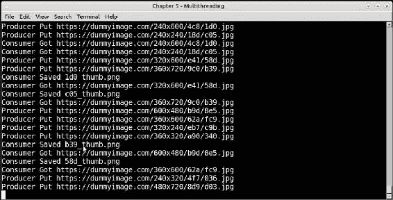
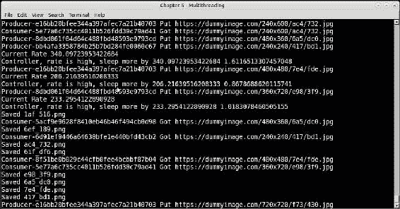
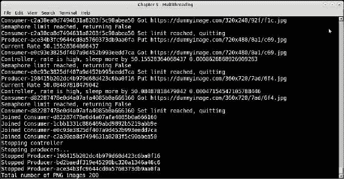
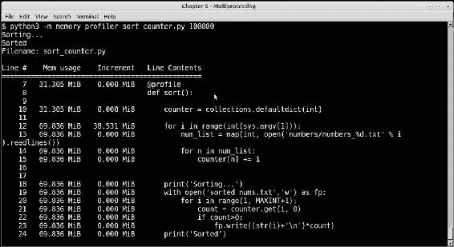
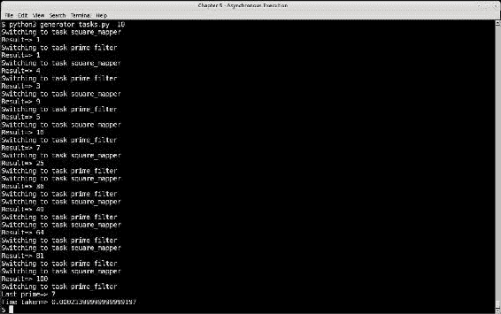
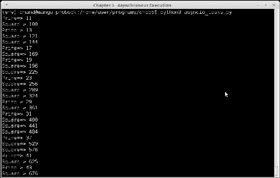
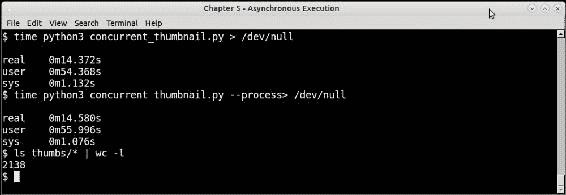
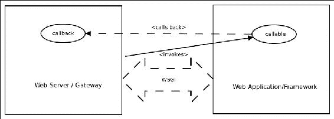

# 五、编写可扩展的应用

想象一下周六晚上超市的收银台，通常是高峰时间。人们排着长队等着结账是很常见的。商店经理可以做些什么来减少拥挤和等待时间？

典型的经理会尝试几种方法，包括告诉收银台的工作人员加快速度，并尝试将人员重新分配到不同的队列中，以便每个队列的等待时间大致相同。换句话说，他将通过*优化现有资源的性能*来使用可用资源管理当前负载。

但是，如果商店现有的柜台未运行，并且手头有足够的人员管理这些柜台，经理可以启用这些柜台，并将人员移动到这些新柜台。换言之，他将为门店增加资源，以实现*规模*的运营。

软件系统也以类似的方式扩展。通过向现有软件应用添加计算资源，可以对其进行扩展。

当系统通过添加或更好地利用计算节点内的资源（如 CPU 或 RAM）进行扩展时，称为*垂直扩展*或*向上扩展*。另一方面，当一个系统通过向其添加更多计算节点来进行扩展时，例如创建一个负载平衡的服务器集群，则称之为*水平扩展*或*向外扩展*。

当增加计算资源时，软件系统能够扩展的程度称为其*可伸缩性*。可伸缩性是根据系统的性能特征（如吞吐量或延迟）相对于增加资源的改善程度来衡量的。例如，如果一个系统通过加倍服务器数量来加倍其容量，那么它是线性扩展的。

增加系统的并发性通常会增加其可伸缩性。在前面给出的超市示例中，经理可以通过打开额外的柜台来扩展其业务。换句话说，他增加了存储中并发处理的数量。并发性是指系统中同时完成的工作量。

在本章中，我们将介绍使用 Python 扩展软件应用的不同技术。

在本章的讨论中，我们将遵循以下主题的大致草图。

*   可扩展性和性能
*   并发性
    *   并行
    *   Concurrency in Python - Multi-threading

        缩略图生成器

        缩略图生成器–生产者/消费者架构

        缩略图生成器–程序结束条件

        缩略图生成器–使用锁的资源约束

        缩略图生成器–使用信号量的资源约束

        资源约束–信号量与锁

        缩略图生成器–url 速率控制器使用条件

        多线程–Python 和 GIL

    *   Concurrency in Python – Multi-processing

        素性检查器

        对磁盘文件进行排序

        排序磁盘文件–使用计数器

        对磁盘文件进行排序–使用多重处理

    *   多线程与多处理
    *   Concurrency in Python – Asynchronous Execution

        先发制人与合作式多任务处理

        Python 中的异步

        等待未来–异步和等待

        并发期货–高级并发处理

    *   并发选项-如何选择？
*   并行处理库
    *   乔布里
    *   PyMP

        分形–Mandelbrot 集

        分形–缩放 Mandelbrot 集实现

*   Web 的缩放
    *   扩展工作流–消息队列和任务队列
    *   Celery – a distributed task queue

        曼德布罗特套餐-用芹菜

    *   Serving Python on the Web – WSGI

        uWSGI–基于类固醇的 WSGI 中间件

        gunicorn–WSGI 的独角兽

        gunicorn vs uWSGI

*   可伸缩性架构
    *   垂直可伸缩性架构
    *   水平可伸缩性架构

# 可扩展性和性能

我们如何衡量系统的可伸缩性？让我们举一个例子，看看这是如何做到的。

假设我们的应用是一个简单的员工报告生成系统。它能够从数据库加载员工数据，并批量生成各种报告，如工资单、税款扣除报告、员工休假报告等。

系统每分钟能够生成 120 个报告这是系统的*吞吐量*或*容量*，表示为给定时间单位内成功完成的操作数。假设在服务器端生成报告所需的时间（延迟）大约为 2 秒。

比如说，架构师决定通过将服务器上的 RAM 增加一倍来扩展系统

完成此操作后，测试表明系统能够将吞吐量提高到每分钟 180 个报告。延迟在 2 秒时保持不变。

因此，在这一点上，系统在增加的内存方面已将*缩放到接近线性*。以吞吐量增加表示的系统可扩展性如下：

可扩展性（吞吐量）=*180/120=1.5X*

作为第二步，架构师决定将后端上具有相同内存的服务器数量增加一倍。经过这一步，他发现系统的性能吞吐量现在已增加到每分钟 350 个报告。此步骤实现的可伸缩性如下所示：

可扩展性（吞吐量）=*350/180=1.9X*

系统现在的响应更好，可伸缩性接近线性增加。

经过进一步分析，架构师发现，通过将服务器上处理报告的代码重写为在多个进程中而不是在单个进程中运行，他能够减少服务器上的处理时间，因此每个请求在峰值时间的延迟约为 1 秒。延迟现在已从 2 秒降至 1 秒。

系统在延迟方面的性能已通过

性能（延迟）：*X=2/1=2X*

这如何提高可伸缩性？由于现在处理每个请求所需的时间较短，因此整个系统将能够以比以前更快的速度响应类似负载。在资源完全相同的情况下，如果其他因素保持不变，系统的吞吐量性能和可伸缩性都会提高。

让我们将到目前为止讨论的内容总结如下：

1.  在第一步中，架构师通过增加额外内存作为资源来扩展单个系统，从而提高了系统的吞吐量，从而提高了系统的整体可伸缩性。换句话说，他通过*放大*来放大单个系统的性能，从而提升了整个系统的整体性能。
2.  在第二步中，他向系统中添加了更多节点，从而提高了系统并发执行工作的能力，并发现系统通过使用近似线性的可伸缩性因子来奖励他，从而做出了良好的响应。换句话说，他通过扩展系统的资源容量来提高系统的吞吐量。因此，他通过*向外扩展*，即通过添加更多计算节点来增加系统的可伸缩性。
3.  在第三步中，他通过在多个进程中运行计算进行了关键修复。换句话说，他通过将计算划分为多个部分来提高单个系统的*并发性*。他发现，这通过减少应用的*延迟*，提高了应用的性能特征，从而有可能使应用在高压力下更好地处理工作负载。

我们发现可伸缩性、性能、并发性和延迟之间存在关系。这可以解释如下：

1.  当系统中某个组件的性能提高时，通常整个系统的性能也会提高。
2.  当一个应用通过增加并发性在一台机器上扩展时，它有可能提高性能，从而提高部署中系统的净可伸缩性。
3.  当系统减少其在服务器上的性能时间或延迟时，它会对可伸缩性做出积极的贡献。

我们在下表中捕获了这些关系：

<colgroup class="calibre18"><col class="calibre19"> <col class="calibre19"> <col class="calibre19"> <col class="calibre19"></colgroup> 
| 

并发性

 | 

延迟

 | 

表演

 | 

可伸缩性

 |
| --- | --- | --- | --- |
| 高的 | 低的 | 高的 | 高的 |
| 高的 | 高的 | 变量 | 变量 |
| 低的 | 高的 | 贫穷的 | 贫穷的 |

理想的系统是具有良好并发性和低延迟的系统；这样的系统具有高性能，并且能够更好地响应放大和/或缩小。

一个具有高并发性和高延迟的系统在其性能上具有可变的特征，因此，可伸缩性可能对其他因素非常敏感，如当前系统负载、网络拥塞、计算资源和请求的地理分布等。

低并发和高延迟的系统是最坏的情况，因为它的性能特征很差，很难扩展这样的系统。在架构师决定水平或垂直扩展系统之前，应该解决延迟和并发问题。

可伸缩性总是根据性能吞吐量的变化来描述的。

# 并发

系统的并发性是指系统能够同时而不是按顺序执行工作的程度。一般来说，编写为并发的应用在给定时间内可以执行比编写为顺序或串行的应用更多的工作单元。

当使串行应用并发时，可以使应用在给定时间更好地利用系统 CPU 和/或 RAM 中的现有计算资源。换句话说，就计算资源的成本而言，并发是在计算机内部实现应用规模的最便宜的方法。

可以使用不同的技术实现并发性。常见的有：

1.  **多线程**：最简单的并发形式是重写应用以在不同线程中执行并行任务。线程是 CPU 可以执行的最简单的编程指令序列。一个程序可以由任意数量的线程组成。通过将任务分配给多个线程，程序可以同时执行更多的工作。所有线程都在同一进程内运行。
2.  **多处理**：同时放大程序的另一种方式是在多个进程中运行程序，而不是在单个进程中运行。在消息传递和共享内存方面，多处理比多线程涉及更多的开销。然而，执行大量 CPU 密集型计算的程序可以从多个进程中获得比多个线程更多的好处。
3.  **异步处理**：在这种技术中，操作是异步执行的，没有特定的任务时间顺序。异步处理通常从任务队列中选取任务，将它们安排在未来时间执行，通常在回调函数或特殊的未来对象中接收结果。异步处理通常发生在单个线程中。

还有其他形式的并行计算，但在本章中，我们将只关注这三种形式。

Python，特别是 Python3，在其标准库中内置了对所有这些类型并发计算技术的支持。例如，通过*线程*模块支持多线程，通过*多处理*模块支持多个进程。异步执行支持通过*异步 IO*模块提供。通过*concurrent.futures*模块提供了一种将异步执行与线程和进程相结合的并发处理形式。

在接下来的几节中，我们将用足够的例子依次介绍其中的每一个。

### 注

注意：asyncio 模块仅在 Python 3 中可用

## 并发与并行

我们将简要介绍并发的概念及其近亲，即并行性。

并发和并行都是同时执行工作，而不是按顺序执行。但是，在并发情况下，这两个任务不需要同时执行；相反，它们只需要被安排同时执行。另一方面，并行性要求两个任务在给定的时刻一起执行。

举一个真实的例子，假设你正在粉刷房子的两面外墙。你只雇佣了一位画家，你发现他花的时间比你想象的要多。您可以通过以下两种方式解决问题：

1.  指示油漆工在一面墙上刷几层漆，然后再换到下一面墙上，并在那里进行同样的操作。假设他工作效率高，他将同时在两堵墙上工作（虽然不是同时），并在给定时间内在两堵墙上达到相同的光洁度。这是一个*并发*解决方案。
2.  再雇一个油漆工。指示第一个油漆工绘制第一面墙，第二个油漆工绘制第二面墙。这是一个*并行*解决方案。

两个线程在单核 CPU 中执行字节码计算，但由于 CPU 一次只能容纳一个线程，因此无法准确执行并行计算。然而，从程序员的角度来看，它们是并发的，因为 CPU 调度程序执行线程的快速切换，因此它们看起来是并行运行的。

然而，在多核 CPU 上，两个线程可以在任何给定时间在其不同的内核中执行并行计算。这是真正的并行。

并行计算要求计算资源相对于其规模至少线性增加。并行计算可以通过使用多任务技术来实现，在多任务技术中，工作被安排并成批执行，从而更好地利用现有资源。

### 注

在本章中，我们将统一使用术语*并发*来表示这两种执行类型。在某些地方，它可能以传统方式表示并发处理，而在另一些地方，它可能表示真正的并行处理。使用上下文来消除歧义。

## Python 中的并发——多线程

我们将从开始讨论 Python 中的多线程并发技术。

Python 通过*线程*模块支持多线程编程。线程模块公开了一个`Thread`类，该类封装了一个执行线程。除此之外，它还公开了以下同步原语：

1.  一个用于同步保护访问共享资源的`Lock`对象及其近亲`RLock`。
2.  一个 Condition 对象，它对于线程在等待任意条件时进行同步非常有用。
3.  一个`Event`对象，提供线程之间的基本信令机制。
4.  一个`Semaphore`对象，允许同步访问有限的资源。
5.  一个`Barrier`对象，它允许一组固定的线程互相等待，同步到特定状态，然后继续。

Python 中的线程对象可以与队列模块中的同步`Queue`类相结合，实现线程安全的生产者/消费者工作流。

# 缩略图生成器

让我们从一个用于生成图像 URL 缩略图的程序示例开始关于 Python 中多线程的讨论。

在本例中，我们使用**Python Imaging Library**（**PIL**的叉子**抱枕**执行此操作：

```py
# thumbnail_converter.py
from PIL import Image
import urllib.request

def thumbnail_image(url, size=(64, 64), format='.png'):
    """ Save thumbnail of an image URL """

    im = Image.open(urllib.request.urlopen(url))
    # filename is last part of the URL minus extension + '.format'
    pieces = url.split('/')
    filename = ''.join((pieces[-2],'_',pieces[-1].split('.')[0],'_thumb',format))
    im.thumbnail(size, Image.ANTIALIAS)
    im.save(filename)  
    print('Saved',filename)
```

前面的代码对于单个 URL 非常有效。

假设我们要将五个图像 URL 转换为它们的缩略图：

```py
img_urls = ['https://dummyimage.com/256x256/000/fff.jpg',
 'https://dummyimage.com/320x240/fff/00.jpg',
 'https://dummyimage.com/640x480/ccc/aaa.jpg',
 'https://dummyimage.com/128x128/ddd/eee.jpg',
 'https://dummyimage.com/720x720/111/222.jpg']
for url in img_urls:
    thumbnail_image(urls)
```

让我们看看这样的函数在以下屏幕截图中是如何执行的：


5 个 URL 的串行缩略图转换器的响应时间

每个 URL 执行此函数大约需要 1.7 秒。

现在让我们将程序扩展到多个线程，以便可以并发执行转换。以下是在其自己的线程中运行每个转换的重写代码：

```py
import threading

for url in img_urls:
    t=threading.Thread(target=thumbnail_image,args=(url,))
    t.start()
```

最后一个程序现在给出的计时显示在此屏幕截图中：


5 个 URL 的线程化缩略图转换器的响应时间

通过这个更改，程序在 1.76 秒内返回，几乎等于之前串行执行单个 URL 所花费的时间。换句话说，程序现在已经根据线程数线性缩放。请注意，我们不需要对函数本身进行任何更改就可以获得这种可伸缩性提升。

## 缩略图生成器-生产者/消费者架构

在前面的示例中，我们看到缩略图生成器函数使用多个线程同时处理一组图像 URL。通过使用多线程，与串行执行相比，我们能够实现近似线性的可伸缩性。

然而，在现实生活中，通常由某种 URL 生产者生成 URL 数据，而不是处理固定的 URL 列表。它可以从一个数据库、一个**逗号分隔值**（**CSV**文件）或一个 TCP 套接字（例如）获取该数据。

在这种情况下，为每个 URL 创建一个线程将是巨大的资源浪费。在系统中创建线程需要一定的开销。我们需要一些方法来重用我们创建的线程。

对于涉及产生数据的某一组线程和消费或处理数据的另一组线程的系统，生产者/消费者模型是理想的选择。这种系统具有以下特点：

1.  生产者是产生数据的一类特殊工作者（线程）。他们可以从特定来源接收数据，或者自己生成数据。
2.  生产者将数据添加到共享的同步队列。在 Python 中，该队列由恰当命名的`queue`模块中的`Queue`类提供。
3.  另一组专门的工作人员，即消费者，在队列上等待获取（消费）数据。一旦他们得到数据，他们就会对其进行处理并产生结果。
4.  当生产商停止生成数据，消费者缺乏数据时，程序就结束了。可以使用超时、轮询或毒药等技术来实现这一点。发生这种情况时，所有线程退出，程序完成。

我们已经将缩略图生成器改写为生产者-消费者架构。下面给出了生成的代码。由于这有点详细，我们将逐一讨论每节课。

首先，让我们看一下这些导入内容，它们是不言自明的：

```py
# thumbnail_pc.py
import threading
import time
import string
import random
import urllib.request
from PIL import Image
from queue import Queue
```

接下来是 producer 类的代码：

```py
class ThumbnailURL_Generator(threading.Thread):
    """ Worker class that generates image URLs """

    def __init__(self, queue, sleep_time=1,):
        self.sleep_time = sleep_time
        self.queue = queue
        # A flag for stopping
        self.flag = True
        # choice of sizes
        self._sizes = (240,320,360,480,600,720)
        # URL scheme
        self.url_template = 'https://dummyimage.com/%s/%s/%s.jpg'
        threading.Thread.__init__(self, name='producer')

    def __str__(self):
        return 'Producer'

    def get_size(self):
        return '%dx%d' % (random.choice(self._sizes),
                          random.choice(self._sizes))

    def get_color(self):
        return ''.join(random.sample(string.hexdigits[:-6], 3))

    def run(self):
        """ Main thread function """

        while self.flag:
            # generate image URLs of random sizes and fg/bg colors
            url = self.url_template % (self.get_size(),
                                       self.get_color(),
                                       self.get_color())
            # Add to queue
            print(self,'Put',url)
            self.queue.put(url)
            time.sleep(self.sleep_time)

    def stop(self):
        """ Stop the thread """

        self.flag = False
```

让我们来分析生产者类别代码：

1.  该类被命名为`ThumbnailURL_Generator`。它生成 URL（通过使用名为[的网站的服务）http://dummyimage.com 不同大小、前景色和背景色的](http://dummyimage.com)。它继承自`threading.Thread`类。
2.  它有一个`run`方法，循环生成一个随机图像 URL，并将其推送到共享队列。每次线程休眠一个固定的时间，由`sleep_time`参数配置。
3.  该类公开了一个`stop`方法，该方法将内部标志设置为`False`，导致循环中断，线程完成其处理。这可以由另一个线程（通常是主线程）在外部调用。

现在，URL消费者类使用缩略图 URL 并创建缩略图：

```py
class ThumbnailURL_Consumer(threading.Thread):
    """ Worker class that consumes URLs and generates thumbnails """

    def __init__(self, queue):
        self.queue = queue
        self.flag = True
        threading.Thread.__init__(self, name='consumer')     

    def __str__(self):
        return 'Consumer'

    def thumbnail_image(self, url, size=(64,64), format='.png'):
        """ Save image thumbnails, given a URL """

        im=Image.open(urllib.request.urlopen(url))
        # filename is last part of URL minus extension + '.format'
        filename = url.split('/')[-1].split('.')[0] + '_thumb' + format
        im.thumbnail(size, Image.ANTIALIAS)
        im.save(filename)
        print(self,'Saved',filename)    

    def run(self):
        """ Main thread function """

        while self.flag:
            url = self.queue.get()
            print(self,'Got',url)
            self.thumbnail_image(url)

    def stop(self):
        """ Stop the thread """

        self.flag = False            
```

以下是对消费者类别的分析：

1.  该类被命名为`ThumbnailURL_Consumer`，因为它使用队列中的 URL，并创建它们的缩略图。
2.  此类的`run`方法进入循环，从队列中获取 URL，并通过将其传递给`thumbnail_image`方法将其转换为缩略图。（请注意，此代码与前面创建的`thumbnail_image`函数完全相同。）
3.  `stop`方法非常类似，每次在循环中检查停止标志，一旦标志被取消设置，结束。

下面是代码的主要部分，分别设置两个生产者和消费者，并运行它们：

```py
    q = Queue(maxsize=200)
    producers, consumers = [], []

    for i in range(2):
        t = ThumbnailURL_Generator(q)
        producers.append(t)
        t.start()

    for i in range(2):
        t = ThumbnailURL_Consumer(q)
        consumers.append(t)
        t.start()
```

以下是正在运行的程序的屏幕截图：



使用 4 个线程运行缩略图生产者/消费者程序，每种类型 2 个

在上面的程序中，由于生产者不断生成无止境的随机数据，消费者将不断无止境地消费这些数据。我们的程序没有合适的结束条件。

因此，该程序将一直运行，直到网络请求被拒绝或超时，或者机器的磁盘空间因缩略图而耗尽。

然而，解决现实世界问题的程序应该以某种可预测的方式结束。

这可能是由于一些外部限制

*   这可能是一个超时，消费者等待数据的时间最长，如果在此期间没有可用数据，则退出。例如，这可以在队列的`get`方法中配置为超时。
*   另一种技术是在消耗或创建一定数量的资源后发出程序结束的信号。例如，在这个程序中，可以对创建的缩略图数量进行固定限制。

在下一节中，我们将看到如何通过使用线程同步原语（如锁和信号量）强制执行此类资源限制。

### 注

您可能已经注意到，我们使用其`start`方法启动了一个线程，尽管 thread 子类中被重写的方法是`run`。这是因为在父`Thread`类中，`start`方法设置了一些状态，然后在内部调用`run`方法。这是调用线程的 run 方法的正确方法。不应该直接调用它。

## 缩略图生成器–使用锁的资源约束

在前面的部分中，我们看到了如何重写生产者/消费者架构中的缩略图生成器程序。然而，我们的程序有一个问题，它将无休止地运行，直到耗尽磁盘空间或网络带宽。

在本节中，我们将看到如何使用`Lock`修改程序，这是一个同步原语，用于实现一个计数器，该计数器将限制作为结束程序的方式创建的图像数量。

Python 中的锁对象允许线程以独占方式访问共享资源。

伪代码如下所示：

```py
try:
  lock.acquire()
  # Do some modification on a shared, mutable resource
  mutable_object.modify()
finally:
  lock.release()
```

但是，锁定对象通过 with 语句支持上下文管理器，因此更常见的编写方式如下：

```py
with lock:
  mutable_object.modify()
```

要实现每次运行固定数量的映像，需要支持我们的代码来添加计数器。但是，由于多个线程将检查并递增此计数器，因此需要通过`Lock`对象对其进行同步。

这是我们第一次使用锁实现资源计数器类。

```py
class ThumbnailImageSaver(object):
    """ Class which saves URLs to thumbnail images and keeps a counter """

    def __init__(self, limit=10):
        self.limit = limit
        self.lock = threading.Lock()
        self.counter = {}

    def thumbnail_image(self, url, size=(64,64), format='.png'):
        """ Save image thumbnails, given a URL """

        im=Image.open(urllib.request.urlopen(url))
        # filename is last two parts of URL minus extension + '.format'
        pieces = url.split('/')
        filename = ''.join((pieces[-2],'_',pieces[-1].split('.')[0],'_thumb',format))
        im.thumbnail(size, Image.ANTIALIAS)
        im.save(filename)
        print('Saved',filename)
        self.counter[filename] = 1      
        return True

    def save(self, url):
        """ Save a URL as thumbnail """

        with self.lock:
            if len(self.counter)>=self.limit:
                return False
            self.thumbnail_image(url)
            print('Count=>',len(self.counter))
            return True
```

因为这个也修改了消费者类别，所以一起讨论这两个变化是有意义的。以下是修改后的 consumer 类，以容纳跟踪图像所需的额外计数器：

```py
class ThumbnailURL_Consumer(threading.Thread):
    """ Worker class that consumes URLs and generates thumbnails """

    def __init__(self, queue, saver):
        self.queue = queue
        self.flag = True
        self.saver = saver
        # Internal id
        self._id = uuid.uuid4().hex
        threading.Thread.__init__(self, name='Consumer-'+ self._id)     

    def __str__(self):
        return 'Consumer-' + self._id

    def run(self):
        """ Main thread function """

        while self.flag:
            url = self.queue.get()
            print(self,'Got',url)
            if not self.saver.save(url):
               # Limit reached, break out
               print(self, 'Set limit reached, quitting')
               break

    def stop(self):
        """ Stop the thread """

        self.flag = False
```

让我们分析一下这两个类。首先是新的类`ThumbnailImageSaver`。

1.  此类派生自`object`。换句话说，它不是一个`Thread`。这不是注定的。
2.  它在其初始化器方法中初始化锁对象和计数器字典。锁用于同步线程对计数器的访问。它还接受一个`limit`参数，该参数等于它应该保存的图像数。
3.  `thumbnail_image`方法从 consumer 类移到这里。它是从`save`方法调用的，该方法使用锁将调用封装在同步上下文中。
4.  `save`方法首先检查计数是否超过配置的限制；发生这种情况时，该方法返回`False`。否则，通过调用`thumbnail_image`保存图像，并将图像文件名添加到计数器，从而有效地增加计数。

接下来是修改后的`ThumbnailURL_Consumer`类。

1.  类的初始值设定项被修改为接受`ThumbnailImageSaver`的实例作为`saver`参数。其余的论点保持不变。
2.  `thumbnail_image`方法在该类中不再存在，因为它被移动到新类中。
3.  `run`方法简化了很多。它调用 saver 实例的`save`方法。如果返回`False`，则表示已达到限制，循环中断，消费线程退出。
4.  我们还修改了`__str__`方法，以返回每个线程的唯一 ID，该 ID 是使用`uuid`模块在初始值设定项中设置的。这有助于在实际示例中调试线程。

调用的代码也有一些变化，因为它需要设置新对象，并用它配置消费线程：

```py
q = Queue(maxsize=2000)
# Create an instance of the saver object
saver = ThumbnailImageSaver(limit=100)

    producers, consumers = [], []
    for i in range(3):
        t = ThumbnailURL_Generator(q)
        producers.append(t)
        t.start()

    for i in range(5):
        t = ThumbnailURL_Consumer(q, saver)     
        consumers.append(t)
        t.start()

    for t in consumers:
        t.join()
        print('Joined', t, flush=True)

    # To make sure producers don't block on a full queue
    while not q.empty():
        item=q.get()

    for t in producers:
        t.stop()
        print('Stopped',t, flush=True)

    print('Total number of PNG images',len(glob.glob('*.png')))
```

以下是需要注意的要点：

1.  我们创建一个新`ThumbnailImageSaver`类的实例，并在创建消费者线程时将其传递给消费者线程。
2.  我们首先等待消费者。注意，主线程不调用`stop`，而是调用它们上的`join`。这是因为当达到限制时，使用者会自动退出，因此主线程应该只等待它们停止。
3.  我们在消费者明确退出后停止生产商，因为他们将永远继续工作，因为生产商没有退出的条件。

由于数据的性质，我们使用字典而不是整数。

由于图像是随机生成的，因此一个图像 URL 与先前创建的另一个图像 URL 很可能相同，从而导致文件名冲突。使用字典会处理这些可能的重复。

下面的屏幕截图显示了程序的运行，限制为 100 张图像。请注意，我们只能显示控制台日志的最后几行，因为它会产生大量输出：


使用锁运行缩略图生成器程序，限制为 100 个图像

您可以对该程序配置任何限制的图像，它将始终获取完全相同的计数，不多或少。

在下一节中，我们将熟悉另一个同步原语，即*信号量*，并学习如何以类似的方式使用信号量实现资源限制类。

## 缩略图生成器–使用信号量的资源约束

锁不是实现同步约束并在其上写入逻辑的唯一方法，例如限制系统使用/生成的资源。

`Semaphore`是计算机科学中最古老的同步原语之一，非常适合此类用例。

使用大于零的值初始化信号量：

1.  当一个线程对一个具有正内部值的信号量调用`acquire`时，该值将递减 1，线程继续前进。
2.  当另一个线程调用信号量上的`release`时，该值增加 1。
3.  一旦值达到零，任何调用`acquire`的线程都会在信号量上阻塞，直到被另一个调用*release*的线程唤醒。

由于这种行为，信号量非常适合实现对共享资源的固定限制。

在下面的代码示例中，我们将为限制缩略图生成器程序的资源实现另一个类，这次使用信号量：

```py
class ThumbnailImageSemaSaver(object):
    """ Class which keeps an exact counter of saved images
    and restricts the total count using a semaphore """

    def __init__(self, limit = 10):
        self.limit = limit
        self.counter = threading.BoundedSemaphore(value=limit)
        self.count = 0

    def acquire(self):
        # Acquire counter, if limit is exhausted, it
        # returns False
        return self.counter.acquire(blocking=False)

    def release(self):
        # Release counter, incrementing count
        return self.counter.release()

    def thumbnail_image(self, url, size=(64,64), format='.png'):
        """ Save image thumbnails, given a URL """

        im=Image.open(urllib.request.urlopen(url))
        # filename is last two parts of URL minus extension + '.format'
        pieces = url.split('/')
        filename = ''.join((pieces[-2],'_',pieces[-1].split('.')[0],format))        
        try:
            im.thumbnail(size, Image.ANTIALIAS)
            im.save(filename)
            print('Saved',filename)
            self.count += 1
        except Exception as e:
            print('Error saving URL',url,e)
            # Image can't be counted, increment semaphore
            self.release()

        return True

    def save(self, url):
        """ Save a URL as thumbnail """

        if self.acquire():
            self.thumbnail_image(url)
            return True
        else:
            print('Semaphore limit reached, returning False')
            return False
```

由于新的基于信号量的类使用 save 方法保持与先前基于锁的类完全相同的接口，因此无需更改使用者上的任何代码！

只需要更改调用代码。

前面初始化`ThumbnailImageSaver`实例的代码中的这一行：

```py
saver = ThumbnailImageSaver(limit=100)
```

前一行需要替换为以下行：

```py
   saver = ThumbnailImageSemaSaver(limit=100)
```

代码的其余部分保持完全相同。

在看到这段代码之前，让我们先快速讨论一下使用信号量的新类：

1.  `acquire`和`release`方法是信号量上相同方法的简单包装。
2.  我们使用等于初始值设定项中图像限制的值初始化信号量。
3.  在 save 方法中，我们称之为`acquire`方法。如果达到信号量的限制，它将返回`False`。否则，线程保存图像并返回`True`。在前一种情况下，调用线程退出。

### 注

此类的内部计数属性仅用于调试。它没有增加任何限制图像的逻辑。

这个类的行为方式与上一个类类似，并且精确地限制了资源。以下是限制为 200 幅图像的示例：


运行缩略图生成器程序，使用信号量限制 200 个图像

## 资源约束-信号量与锁

在前面的两个示例中，我们看到了两个实现固定资源约束的竞争版本，一个使用`Lock`，另一个使用`Semaphore`。

两个版本的区别如下：

1.  在这种情况下，使用 Lock 的版本保护修改资源的所有代码，检查计数器、保存缩略图并增加计数器以确保没有数据不一致。
2.  信号量版本的实现更像是一个门——当计数低于限制时，门是打开的，任何数量的线程都可以通过它，只有达到限制时门才会关闭。换句话说，它并不相互排斥线程调用缩略图保存函数。

因此，其效果是信号量版本比使用锁的版本快。

要快多少？以下 100 幅图像的计时示例给出了一个想法。

此屏幕截图显示锁定版本保存 100 张图像所需的时间：


定时缩略图生成器程序的运行，以锁定 100 幅图像的版本

以下屏幕截图显示了信号灯版本保存类似号码的时间：


对缩略图生成器程序的运行进行计时，使信号量版本为 100 个图像

通过快速计算，您可以看到，对于相同的逻辑，信号量版本大约比锁定版本快 4 倍。换句话说，它的*比*好 4 倍。

## 缩略图生成器–URL 速率控制器使用条件

在本节中，我们将简要介绍另一个重要的同步原语在线程中的应用，即`Condition`对象。

首先，我们将获得一个使用`Condition`对象的真实示例。我们将为缩略图生成器实现一个调节器，以管理 URL 生成的速率。

在现实生活中的生产者/消费者系统中，关于数据生产和消费的速率，可能会出现以下三种情况：

1.  生产者生产数据的速度快于消费者消费数据的速度。这使得消费者总是在追赶生产者。生产者的多余数据可能会在队列中累积，这会导致队列在每个循环中消耗更高的内存和 CPU 使用率，从而导致程序速度减慢。
2.  消费者消费数据的速度比生产者快。这导致使用者总是在队列中等待数据。这本身并不是一个问题，只要生产者不落后太多。在最坏的情况下，这会导致系统的一半（即消费者）闲置，而另一半（生产者）则试图跟上需求。
3.  生产者和消费者都以几乎相同的速度工作，将队列大小保持在限制范围内。这是理想的情况。

有很多方法可以解决这个问题。其中包括：

1.  **具有固定大小**的队列–一旦达到队列大小限制，生产者将被迫等待消费者消费数据。然而，这几乎总是让队列保持满。
2.  **为工人提供超时以及其他责任**：生产商和/或消费者可以使用超时来等待队列，而不是在队列中保持阻塞状态。当他们超时时，他们可以在回来排队之前睡觉或履行一些其他职责。
3.  **动态配置工人数量**：工人池大小根据需要自动增减。如果一类工人领先，系统将只启动另一类工人所需的数量，以保持平衡。
4.  **调整数据生成速率**：在这种方法中，我们静态或动态地调整生产者的数据生成速率。例如，系统可以配置为以固定速率生成数据，例如，一分钟生成 50 个 URL，或者它可以计算消费者的消费速率，并动态调整生产者的数据生成速率以保持平衡。

在下面的示例中，我们将使用`Condition`对象实现最后一种方法，将 URL 的生成速率限制在固定的限制范围内。

`Condition`对象是一个复杂的同步原语，带有一个隐式内置锁。它可以在任意条件下等待，直到它变为真。当线程在该条件下调用`wait`时，内部锁被释放，但线程本身被阻塞：

```py
cond = threading.Condition()
# In thread #1
with cond:
    while not some_condition_is_satisfied():
        # this thread is now blocked
        cond.wait()
```

现在，另一个线程可以通过将条件设置为 True，然后调用 condition 对象上的`notify`或`notify_all`来唤醒前面的线程。此时，前面被阻塞的线程被唤醒，并继续前进：

```py
# In thread #2
with cond:
    # Condition is satisfied
    if some_condition_is_satisfied():
        # Notify all threads waiting on the condition
        cond.notify_all()
```

这里是我们的新类，即`ThumbnailURLController`，它使用条件对象实现 URL 生成的速率控制。

```py
class ThumbnailURLController(threading.Thread):
    """ A rate limiting controller thread for URLs using conditions """

    def __init__(self, rate_limit=0, nthreads=0):
        # Configured rate limit
        self.rate_limit = rate_limit
        # Number of producer threads
        self.nthreads = nthreads
        self.count = 0
        self.start_t = time.time()
        self.flag = True
        self.cond = threading.Condition()
        threading.Thread.__init__(self)

    def increment(self):
        # Increment count of URLs
        self.count += 1

    def calc_rate(self):
        rate = 60.0*self.count/(time.time() - self.start_t)
        return rate

    def run(self):
        while self.flag:
            rate = self.calc_rate()
            if rate<=self.rate_limit:
                with self.cond:
                    # print('Notifying all...')
                    self.cond.notify_all()

    def stop(self):
        self.flag = False

    def throttle(self, thread):
        """ Throttle threads to manage rate """
        # Current total rate
        rate = self.calc_rate()
        print('Current Rate',rate)
        # If rate > limit, add more sleep time to thread
        diff = abs(rate - self.rate_limit)
        sleep_diff = diff/(self.nthreads*60.0)

        if rate>self.rate_limit:
            # Adjust threads sleep_time
            thread.sleep_time += sleep_diff
            # Hold this thread till rate settles down with a 5% error
            with self.cond:
                print('Controller, rate is high, sleep more by',rate,sleep_diff)                
                while self.calc_rate() > self.rate_limit:
                    self.cond.wait()
        elif rate<self.rate_limit:
            print('Controller, rate is low, sleep less by',rate,sleep_diff)                         
            # Decrease sleep time
            sleep_time = thread.sleep_time
            sleep_time -= sleep_diff
            # If this goes off < zero, make it zero
            thread.sleep_time = max(0, sleep_time)
```

在讨论将使用该类的生产者类中的更改之前，让我们先讨论前面的代码：

1.  该类是`Thread`的实例，因此它在自己的执行线程中运行。它还保存一个条件对象。
2.  它有一个`calc_rate`方法，通过保留计数器和使用时间戳来计算 URL 的生成速率。
3.  在`run`方法中，检查速率。如果它低于配置的限制，则 condition 对象通知等待它的所有线程。
4.  最重要的是，它实现了一个`throttle`方法。此方法使用通过`calc_rate`计算的当前速率，并使用它来限制和调整生产者的睡眠时间。它主要做两件事：
    1.  如果速率超过配置的限制，则会导致调用线程在条件对象上等待，直到速率稳定下来。它还计算线程应该在其循环中睡眠的额外睡眠时间，以将速率调整到所需的级别。
    2.  如果速率小于配置的限制，那么线程需要更快地工作并产生更多数据，因此它计算睡眠差异并相应地降低睡眠限制。

以下是制作人类的代码，用于合并更改：

```py
class ThumbnailURL_Generator(threading.Thread):
    """ Worker class that generates image URLs and supports throttling via an external controller """

    def __init__(self, queue, controller=None, sleep_time=1):
        self.sleep_time = sleep_time
        self.queue = queue
        # A flag for stopping
        self.flag = True
        # sizes
        self._sizes = (240,320,360,480,600,720)
        # URL scheme
        self.url_template = 'https://dummyimage.com/%s/%s/%s.jpg'
        # Rate controller
        self.controller = controller
        # Internal id
        self._id = uuid.uuid4().hex
        threading.Thread.__init__(self, name='Producer-'+ self._id)

    def __str__(self):
        return 'Producer-'+self._id

    def get_size(self):
        return '%dx%d' % (random.choice(self._sizes),
                          random.choice(self._sizes))

    def get_color(self):
        return ''.join(random.sample(string.hexdigits[:-6], 3))

    def run(self):
        """ Main thread function """

        while self.flag:
            # generate image URLs of random sizes and fg/bg colors
            url = self.url_template % (self.get_size(),
                                       self.get_color(),
                                       self.get_color())
            # Add to queue
            print(self,'Put',url)
            self.queue.put(url)
            self.controller.increment()
            # Throttle after putting a few images
            if self.controller.count>5:
                self.controller.throttle(self)

            time.sleep(self.sleep_time)

    def stop(self):
        """ Stop the thread """

        self.flag = False
```

让我们看看最后的代码是如何工作的：

1.  该类现在接受其初始值设定项中的附加控制器对象。这是前面给出的控制器类的实例。
2.  放置 URL 后，它会增加控制器上的计数。一旦计数达到最小限制（设置为 5 以避免生产者提前节流），它将调用控制器上的`throttle`，并将自身作为参数传递。

调用代码也需要做很多更改。修改后的代码如下所示：

```py
    q = Queue(maxsize=2000)
    # The controller needs to be configured with exact number of 
    # producers
    controller = ThumbnailURLController(rate_limit=50, nthreads=3)
    saver = ThumbnailImageSemaSaver(limit=200)

    controller.start()

    producers, consumers = [], []
    for i in range(3):
        t = ThumbnailURL_Generator(q, controller)
        producers.append(t)
        t.start()

    for i in range(5):
        t = ThumbnailURL_Consumer(q, saver)     
        consumers.append(t)
        t.start()

    for t in consumers:
        t.join()
        print('Joined', t, flush=True)

    # To make sure producers dont block on a full queue
    while not q.empty():
        item=q.get()
    controller.stop()

    for t in producers:
        t.stop()
        print('Stopped',t, flush=True)

    print('Total number of PNG images',len(glob.glob('*.png')))
```

此处的主要变化如下所示：

1.  控制器对象已创建–具有将创建的生产者的确切数量。这有助于正确计算每个线程的睡眠时间。
2.  生产者线程本身在其初始值设定项中被传递给控制器实例。
3.  控制器在所有其他线程之前作为线程启动。

下面是程序的运行，配置了 200 个图像，速度为每分钟 50 个图像。我们展示了两个运行程序输出的图像，一个在程序的开头，一个在程序的结尾。



使用 URL 速率控制器以每分钟 50 个 URL 启动缩略图程序

你会发现，当程序启动时，它几乎立即变慢，几乎停止，因为原始速率很高。这里发生的事情是生产者调用`throttle`方法，由于速率很高，他们都被条件对象阻塞。

几秒钟后，由于没有生成 URL，速率下降到规定的限制。控制器在其循环中检测到这一点，并对线程调用`notify_all`，唤醒它们。

一段时间后，你会看到，该速率已接近每分钟 50 个 URL 的设定限制。


启动后 5-6 秒，带有 URL 速率控制器的缩略图程序

在项目结束前时，您会看到利率几乎已经稳定到了准确的极限：



最后带有 URL 速率控制器的缩略图程序

我们即将结束关于线程原语的讨论，以及如何使用它们来提高程序的并发性和实现共享资源约束和控制。

在结束之前，我们将了解 Python 线程的一个方面，即 GIL 或全局解释器锁，它阻止多线程程序充分利用 Python 中的 CPU。

# 多线程——Python 和 GIL

在 Python 中有一个全局锁，它防止多个线程同时执行本机字节码。这个锁是必需的，因为 CPython（Python 的本机实现）的内存管理不是线程安全的。

该锁称为**全局解释器锁**或只是**GIL**。

由于 GIL，Python 无法在 CPU 上并发执行字节码操作。因此，Python 几乎不适合以下情况：

*   当程序依赖于大量繁重的字节码操作时，它希望并发运行这些操作
*   当程序使用多线程来利用一台机器上多个 CPU 核的全部能力时

I/O 调用和长时间运行的操作通常发生在 GIL 之外。因此，在 Python 中，多线程只有在涉及到一定数量的 I/O 或类似操作（如图像处理）时才是有效的。

在这种情况下，将程序扩展到同时扩展到单个进程之外成为一种方便的方法。Python 通过其`multiprocessing`模块实现了这一点，这是我们下一个讨论的主题。

## Python 中的并发——多处理

Python 标准库提供了一个多处理模块，允许程序员编写使用多个进程而不是线程并行扩展的程序。

由于多处理跨多个进程扩展计算，它有效地消除了 Python 中 GIL 的任何问题。使用该模块，程序可以有效地利用多个 CPU 核。

该模块公开的主要类是`Process`类，与线程模块中的`Thread`类类似。它还提供了许多同步原语，它们几乎与线程模块中的同类完全相同。

我们将从使用本模块提供的`Pool`对象的示例开始。它允许一个函数使用进程在多个输入上并行执行。

## 素性检查器

以下函数是一个简单的素性校验函数，即输入数是否为素数：

```py
def is_prime(n):
    """ Check for input number primality """

    for i in range(3, int(n**0.5+1), 2):
        if n % i == 0:
            print(n,'is not prime')
            return False

    print(n,'is prime')     
    return True
```

下面是一个线程类，它使用最后一个函数检查队列中的数字是否为素数：

```py
# prime_thread.py
import threading

class PrimeChecker(threading.Thread):
    """ Thread class for primality checking """

    def __init__(self, queue):
        self.queue = queue
        self.flag = True
        threading.Thread.__init__(self)     

    def run(self):

        while self.flag:
            try:
                n = self.queue.get(timeout=1)
                is_prime(n)
            except Empty:
                break
```

我们将用 1000 个大素数来测试它。为了节省此处所示列表的空间，我们所做的是从这些数字中选取 10 个，然后将列表乘以 100：

```py
    numbers = [1297337, 1116281, 104395303, 472882027, 533000389,     
               817504243, 982451653, 112272535095293, 115280095190773,    
               1099726899285419]*100

    q = Queue(1000)

    for n in numbers:
        q.put(n)

    threads = []
    for i in range(4):
        t = PrimeChecker(q)
        threads.append(t)
        t.start()

    for t in threads:
        t.join()
```

我们在这个测试中使用了四个线程。在下面的屏幕截图中，让我们看看程序是如何执行的：


使用 4 个线程池的 1000 个数字的素性检查器

下面是使用多处理`Pool`对象的等效代码：

```py
    numbers = [1297337, 1116281, 104395303, 472882027, 533000389,   
               817504243, 982451653, 112272535095293, 115280095190773,  
               1099726899285419]*100
    pool = multiprocessing.Pool(4)
    pool.map(is_prime, numbers)
```

下面的屏幕截图显示了它在同一组数字上的性能：


使用 4 个进程的多处理池的 1000 个数字的素性检查器

通过比较这些数字，我们了解到以下内容：

1.  实时时间，即进程池版本在 1 分 9.6 秒（69.6 秒）时所花费的挂钟时间，比线程池版本在 2 分 12 秒（132 秒）时所花费的挂钟时间少近 50%。
2.  但是，请注意，用户时间，即 4 分 22 秒（262 秒）时进程池版本的用户代码在 CPU 内花费的时间，几乎是 2 分 12 秒（132 秒）时线程池版本的时间的两倍。
3.  线程池版本的实际 CPU 时间和用户 CPU 时间完全相同，为 2 分 12 秒。这清楚地表明线程版本能够有效地执行，只在一个 CPU 内核中执行。

这意味着进程池版本能够更好地使用所有 CPU 内核，因为对于线程池版本的 50%实时性，它能够两次使用 CPU 时间。

因此，两个程序在 CPU 时间/实时方面的实际性能提升如下：

1.  线程版本→ 132 秒/132 秒=1
2.  过程版本→ 262 秒/69.6 秒=3.76~=4

因此，流程版本与线程版本的实际性能比如下所示：

4/1 = 4

执行程序的机器有一个四核 CPU。这清楚地表明，该代码的多处理器版本能够几乎同等地利用 CPU 的所有四个核心。

这是因为线程版本受到 GIL 的限制，而过程版本没有这种限制，可以自由使用所有内核。

在下一节中，让我们讨论一个更复杂的问题，即对基于磁盘的文件进行排序。

## 整理磁盘文件

假设你在磁盘上有数十万个文件，每个文件在给定范围内包含一定数量的整数。假设我们需要对文件进行排序并合并到单个文件中。

如果我们决定将所有这些数据加载到内存中，它将需要大量的 RAM。让我们快速计算一百万个文件，每个文件包含大约 100 个 1 到 10000 范围内的整数，总数为 100000000 或 1 亿个整数。

让我们假设每个文件都是从磁盘加载的整数列表，我们暂时忽略字符串处理等。

使用`sys.getsizeof`，我们可以得到一个粗略的计算：

```py
>>> sys.getsizeof([100000]*1000)*100000/(1024.0*1024.0)
769.04296875

```

因此，如果一次加载到内存中，整个数据将需要接近 800MB。现在，一开始这看起来可能不像一个大的内存占用，但是列表越大，在内存中将其作为一个大列表进行排序所需的系统资源就越多。

下面是将磁盘文件中的所有整数加载到内存后进行排序的最简单代码：

```py
# sort_in_memory.py
import sys

all_lists = []

for i in range(int(sys.argv[1])):
    num_list = map(int, open('numbers/numbers_%d.txt' % i).readlines())
    all_lists += num_list

print('Length of list',len(all_lists))
print('Sorting...')
all_lists.sort()
open('sorted_nums.txt','w').writelines('\n'.join(map(str, all_lists)) + '\n')
print('Sorted')
```

前面的代码从磁盘加载一定数量的文件，每个文件包含 1 到 10000 范围内的 100 个整数。它读取每个文件，将其映射到整数列表，并将每个列表添加到累积列表。最后，对列表进行排序并写入文件。

下表显示了对一定数量的磁盘文件进行排序所需的时间：

<colgroup class="calibre18"><col class="calibre19"> <col class="calibre19"></colgroup> 
| 

文件数（n）

 | 

分拣所需的时间

 |
| --- | --- |
| 1000 | 17.4 秒 |
| 10000 | 101 秒 |
| 100000 | 138 秒 |
| 1000000 | NA |

正如你所看到的，所花费的时间比*O（n）*小得多。然而，这是一个比时间更重要的问题，即内存和操作方面的空间。

例如，在用于进行测试的机器中，一台 8 GB RAM、4 核 CPU、64 位 Linux 的笔记本电脑，一百万个数字的测试没有完成。相反，它导致系统挂起，因此无法完成。

### 对磁盘文件进行排序–使用计数器

如果你查看数据，你会发现允许我们将问题视为空间而非时间。这是观察到的整数在固定范围内，最大限制为 10000。

因此，可以使用计数器之类的数据结构，而不是将所有数据作为单独的列表加载并合并它们。

以下是这项工作的基本原理：

1.  初始化一个数据结构——一个计数器，其中每个整数从 1…10000 开始，最大条目初始化为零。
2.  加载每个文件并将数据转换为列表。对于列表中找到的任何数字，增加其在步骤 1 中初始化的计数器数据结构中的计数。
3.  最后，循环遍历计数器，将计数大于零的每个数字*多次*输出，并将输出保存到文件中。输出是您合并和排序的单个文件：

    ```py
    # sort_counter.py
    import sys
    import collections

    MAXINT = 100000

    def sort():
        """ Sort files on disk by using a counter """

    counter = collections.defaultdict(int)
    for i in range(int(sys.argv[1])):
    filename = 'numbers/numbers_%d.txt' % i
    for n in open(filename):
    counter[n] += 1
    print('Sorting...')

    with open('sorted_nums.txt','w') as fp:
    for i in range(1, MAXINT+1):
        count = counter.get(str(i) + '\n', 0)
    if count>0:
    fp.write((str(i)+'\n')*count)

    print('Sorted')
    ```

在前面的代码中，我们使用收集模块中的`defaultdict`作为计数器。每当我们遇到一个整数，我们就增加它的计数。最后，计数器循环通过，每个项目的输出次数与找到的次数相同。

排序和合并是由于我们将问题从一个排序整数转换为一个保持计数并按自然排序的顺序输出的方式而发生的。

下表总结了根据输入大小对数字进行排序所需的时间（以磁盘文件的数量为单位）：

<colgroup class="calibre18"><col class="calibre19"> <col class="calibre19"></colgroup> 
| 

文件数（n）

 | 

分拣所需的时间

 |
| --- | --- |
| 1000 | 16.5 秒 |
| 10000 | 83 秒 |
| 100000 | 86 秒 |
| 1000000 | 359 秒 |

尽管对于最小的情况（1000 个文件）的性能与内存排序的性能相似，但随着输入大小的增加，性能会变得更好。这段代码还能够在大约 5 百万 59 秒内完成 100 万个文件或 1 亿个整数的排序。

### 注

在读取文件的进程的计时测量中，内核中总是存在缓冲区缓存的影响。您将发现，连续运行相同的性能测试显示了巨大的改进，因为 Linux 将文件内容缓存在其缓冲区缓存中。因此，相同输入大小的后续测试应在清除缓冲区缓存后进行。在 Linux 中，这可以通过以下命令完成：

```py
$ echo 3 > /proc/sys/vm/drop_caches

```

在我们对连续数字的测试中，我们*没有*如前所示重置缓冲缓存。这意味着，对于更高数量的运行，可以从先前运行期间创建的缓存中获得性能提升。但是，由于每次试验都是统一进行的，因此结果具有可比性。在启动特定算法的测试套件之前，将重置缓存。

该算法还需要更少的内存，因为对于每次运行，内存需求是*相同*，因为我们使用一个整数数组，直到 MAXINT，并且只增加计数。

下面是使用*内存剖析器*对 100000 个文件的内存排序程序的内存使用情况，我们在上一章中已经遇到过。


输入 100000 个文件的内存排序程序的内存使用情况

下面的屏幕截图显示了相同数量文件的排序计数器的内存使用情况：



输入 100000 个文件时计数器排序程序的内存使用情况

465 MB 内存中排序程序的内存使用量是 70 MB 计数器排序程序的六倍多。还要注意，在内存版本中，排序操作本身占用了近 10 MB 的额外内存。

### 对磁盘文件进行排序–使用多处理

在本节中，我们使用多个进程重写计数器排序程序。这种方法是通过将文件路径列表拆分为一个进程池来扩展多个进程的处理输入文件，并计划利用由此产生的数据并行性。

下面是代码的重写：

```py
# sort_counter_mp.py
import sys
import time
import collections
from multiprocessing import Pool

MAXINT = 100000

def sorter(filenames):
    """ Sorter process sorting files using a counter """

    counter = collections.defaultdict(int)

    for filename in filenames:
for i in open(filename):
counter[i] += 1

return counter

def batch_files(pool_size, limit):
""" Create batches of files to process by a multiprocessing Pool """
batch_size = limit // pool_size

filenames = []

for i in range(pool_size):
batch = []
for j in range(i*batch_size, (i+1)*batch_size):
filename = 'numbers/numbers_%d.txt' % j
batch.append(filename)

filenames.append(batch)

return filenames

def sort_files(pool_size, filenames):
""" Sort files by batches using a multiprocessing Pool """

with Pool(pool_size) as pool:
counters = pool.map(sorter, filenames)
with open('sorted_nums.txt','w') as fp:
for i in range(1, MAXINT+1):
count = sum([x.get(str(i)+'\n',0) for x in counters])
if count>0:
fp.write((str(i)+'\n')*count)
print('Sorted')
if __name__ == "__main__":
limit = int(sys.argv[1])
pool_size = 4
filenames = batch_files(pool_size, limit)
sort_files(pool_size,
```

与前面的代码完全相同，但有以下变化：

1.  文件名不是作为单个列表处理所有文件，而是分批放置，分批大小等于池的大小。
2.  我们使用一个 sorter 函数，它接受文件名列表，处理它们，并返回一个包含计数的字典。
3.  计数在 1 到 MAXINT 范围内为每个整数求和，因此许多数字被写入排序文件。

下面的表显示了针对大小分别为 2 和 4 的池处理不同数量的文件的数据：

<colgroup class="calibre18"><col class="calibre19"> <col class="calibre19"> <col class="calibre19"></colgroup> 
| 

文件数（n）

 | 

池大小

 | 

分拣所需的时间

 |
| --- | --- | --- |
| 1,000 | 2. | 18 秒 |
| 4. | 20 秒 |
| 10,000 | 2. | 92 秒 |
| 4. | 77 秒 |
| 100,000 | 2. | 96 秒 |
| 4. | 86 秒 |
| 1,000,000 | 2. | 350 秒 |
| 4. | 329 秒 |

这些数字讲述了一个有趣的故事：

1.  与具有 2 个进程的多进程版本和单进程版本相比，具有 4 个进程的多进程版本（等于机器中的内核数）的总体数量更好。
2.  但是，与单进程版本相比，多进程版本似乎没有提供多少性能优势。性能数字非常相似，任何改进都在误差和变化范围内。例如，对于 100 万个输入，具有 4 个过程的多个过程仅比单个过程提高 8%。
3.  这是因为这里的瓶颈是将文件加载到内存（在文件 I/O 中）所需的处理时间，而不是计算（排序），因为排序只是计数器中的一个增量。因此，单进程版本非常有效，因为它能够在同一地址空间中加载所有文件数据。通过在多个地址空间中加载文件，多进程服务器可以稍微改善这一点，但不会提高很多。

此示例显示，在没有进行太多计算但瓶颈是磁盘或文件 I/O 的情况下，通过多处理进行扩展的影响要小得多。

# 多线程与多处理

既然我们已经结束了对多进程的讨论，现在是比较和对比需要在单个进程中使用线程还是在 Python 中使用多个进程之间进行选择的场景的好时机。

以下是一些指导原则。

在以下情况下使用多线程：

1.  程序需要维护许多共享状态，尤其是可变状态。Python 中的许多标准数据结构（如列表、字典等）都是线程安全的，所以使用线程维护可变共享状态的成本要比通过进程低得多。
2.  该程序需要保持低内存足迹。
3.  程序花费大量时间执行 I/O。由于 GIL 是由执行 I/O 的线程释放的，因此它不会影响线程执行 I/O 所花费的时间。
4.  该程序没有很多可以跨多个进程扩展的数据并行操作

在这些场景中使用多处理：

1.  程序在相当大的输入上执行大量 CPU 限制的繁重计算：字节码操作、数字运算等。
2.  该程序的输入可以被并行化为块，其结果可以在之后合并——换句话说，该程序的输入很好地支持数据并行计算。
3.  该程序对内存使用没有任何限制，而且您使用的是一台具有多核 CPU 和足够大 RAM 的现代机器。
4.  需要同步的进程之间没有太多共享的可变状态，这可能会降低系统的速度，并抵消从多个进程中获得的任何好处。
5.  您的程序并不严重依赖于 I/O 文件、磁盘 I/O 或套接字 I/O。

## Python 中的 Concurrecy-异步执行

我们已经看到了使用多线程和多进程执行并发执行的两种不同方式。我们看到了使用线程及其同步原语的不同示例。我们还看到了几个使用多重处理的示例，结果略有不同。

除了这两种并发编程方法外，另一种常见的技术是异步编程或异步 I/O。

在异步执行模型中，调度器从任务队列中选择要执行的任务，调度器以交错方式执行这些任务。无法保证任务将按任何特定顺序执行。任务的执行顺序取决于一个任务愿意*将*让渡给队列中另一个任务的处理时间。换句话说，异步执行是通过协作多任务来实现的。

异步执行通常发生在单个线程中。这意味着不会发生真正的数据并行或真正的并行执行。相反，该模型只提供了一种并行性的外表。

当执行无序时，异步系统需要一种将函数执行结果返回给调用方的方法。这通常发生在*回调*中，这些回调是在结果准备就绪或使用接收结果的特殊对象时调用的函数，通常称为*期货*。

Python3 通过使用协同路由的*异步 IO*模块为这种执行提供支持。在我们继续讨论这一点之前，我们将花一些时间了解先发制人的多任务与协作多任务，以及如何使用生成器在 Python 中实现一个简单的协作多任务调度器。

# 先发制人与合作多任务

我们之前使用多线程编写的程序就是并发的例子。然而，我们不必担心操作系统如何以及何时选择运行线程，我们只需准备线程（或进程），提供目标函数，并执行它们。调度由操作系统负责。

CPU 时钟每隔几次滴答声，操作系统就会抢占一个正在运行的线程，并用特定内核中的另一个线程替换它。这可能是由于不同的原因造成的，但是程序员不必担心细节。他只是创建线程，用需要处理的数据设置它们，使用正确的同步原语，然后启动它们。操作系统完成其余工作，包括切换和调度。

几乎所有现代操作系统都是这样工作的。它保证在所有其他条件相同的情况下，每个线程公平地分配执行时间。这被称为**先发制人多任务**。

还有另一种调度类型，它与先发制人的多任务处理相反。这称为协作多任务处理，操作系统在决定优先级和竞争线程或进程的执行方面不起作用。相反，一个进程或线程愿意为另一个进程或线程提供运行控制。或者，一个线程可以替换另一个处于空闲（休眠）或等待 I/O 的线程。

这是在使用协同例程的并发执行异步模型中使用的技术。一个函数在等待数据时，比如说网络上尚未返回的调用，可以控制另一个函数或任务的运行。

在讨论使用`asyncio`的实际协作例程之前，让我们使用简单的 Python 生成器编写我们自己的协作多任务调度器。正如你在下面看到的那样，做到这一点并不困难。

```py
# generator_tasks.py
import random
import time
import collections
import threading

def number_generator(n):
    """ A co-routine that generates numbers in range 1..n """

    for i in range(1, n+1):
        yield i

def square_mapper(numbers):
    """ A co-routine task for converting numbers to squares """

    for n in numbers:
        yield n*n

def prime_filter(numbers):
    """ A co-routine which yields prime numbers """

    primes = []
    for n in numbers:
        if n % 2 == 0: continue
        flag = True
        for i in range(3, int(n**0.5+1), 2):
            if n % i == 0:
                flag = False
                break

        if flag:
            yield n

def scheduler(tasks, runs=10000):
    """ Basic task scheduler for co-routines """

    results = collections.defaultdict(list)

    for i in range(runs):
        for t in tasks:
            print('Switching to task',t.__name__)
            try:
                result = t.__next__()
                print('Result=>',result)
                results[t.__name__].append(result)
            except StopIteration:
                break

    return results
```

让我们分析前面的代码：

*   我们有四个函数：三个生成器，因为它们使用`yield`关键字返回数据；一个调度器，运行一组特定的任务
*   `square_mapper`函数接受一个迭代器，该迭代器返回遍历它的整数，并生成成员的平方
*   `prime_filter`函数接受一个类似的迭代器，过滤掉不是素数的数字，只产生素数
*   `number_generator`函数充当这两个函数的输入迭代器，为它们提供整数的输入流

现在让我们看一下将所有四个函数连接在一起的调用代码。

```py
    import sys

    tasks = []
    start = time.clock()

    limit = int(sys.argv[1])

    # Append sqare_mapper tasks to list of tasks 
    tasks.append(square_mapper(number_generator(limit)))
    # Append prime_filter tasks to list of tasks
    tasks.append(prime_filter(number_generator(limit))) 

    results = scheduler(tasks, runs=limit)
    print('Last prime=>',results['prime_filter'][-1])
    end = time.clock()
    print('Time taken=>',end-start)
```

下面是对调用代码的分析：

*   数字生成器使用一个计数初始化，该计数通过命令行参数接收。它被传递给`square_mapper`函数。组合功能作为任务添加到`tasks`列表中。
*   对`prime_filter`功能执行类似的操作。
*   `scheduler`方法通过将任务列表传递给它来运行，它通过迭代`for`循环来运行，一个接一个地运行每个任务。结果将使用函数名作为键附加到字典中，并在执行结束时返回。
*   我们打印最后一个素数的值以验证正确执行，以及调度程序处理所花费的时间。

让我们看看我们的简单协作多任务调度程序的输出，限制为`10`。这允许在单个命令窗口中捕获所有输入，如以下屏幕截图所示：



输入为 10 的简单协作多任务程序示例的输出

让我们分析输出：

1.  `square_mapper`和`prime_filter`功能的输出在控制台上交替进行。这是因为调度器在`for`循环中在它们之间切换。每个函数都是共同例程（生成器），因此它们*产生*执行，即控制从一个函数传递到下一个函数，反之亦然。这允许两个函数同时运行，同时保持状态并生成输出。
2.  由于我们在这里使用了生成器，它们提供了一种自然的方式，使用*yield*关键字一次性生成结果和产量控制。

# Python 中的异步 IO 模块

Python 中的`asyncio`模块支持使用 co 例程编写并发单线程程序。它仅在 Python3 中可用。

使用模块和`asyncio`模块的共同例程使用以下方法之一：

*   使用`async def`语句定义函数
*   正在使用`@asyncio.coroutine`表达式进行装饰

基于生成器的协同例程使用第二种技术，它们从表达式中生成。

使用第一种技术创建的联合例程通常使用`await <future>`表达式等待将来完成。

Co 例程通过`event`循环被安排执行，该循环连接对象并将它们作为任务进行调度。为不同的操作系统提供了不同类型的事件循环。

下面的代码重写了我们前面的简单协作多任务调度器示例，以使用`asyncio`模块：

```py
# asyncio_tasks.py
import asyncio

def number_generator(m, n):
    """ A number generator co-routine in range(m...n+1) """
    yield from range(m, n+1)

async prime_filter(m, n):
    """ Prime number co-routine """

    primes = []
    for i in number_generator(m, n):
        if i % 2 == 0: continue
        flag = True

        for j in range(3, int(i**0.5+1), 2):
            if i % j == 0:
                flag = False
                break

        if flag:
print('Prime=>',i)
primes.append(i)

# At this point the co-routine suspends execution
# so that another co-routine can be scheduled
await asyncio.sleep(1.0)
return tuple(primes)

async def square_mapper(m, n):
""" Square mapper co-routine """
squares = []

for i in number_generator(m, n):
print('Square=>',i*i) 
squares.append(i*i)
# At this point the co-routine suspends execution
# so that another co-routine can be scheduled
await asyncio.sleep(1.0)
return squares

def print_result(future):
print('Result=>',future.result())
```

下面是最后一段代码的工作原理：

1.  `number_generator`函数是从子生成器`range(m, n+1)`（迭代器）生成的共同例程。这允许在其他协同例程中调用此协同例程。
2.  `square_mapper`函数是使用`async def`关键字的第一种类型的共同例程。它使用数字生成器中的数字返回正方形列表。
3.  `prime_filter`功能属于同一类型。它还使用数字生成器，将素数附加到列表并返回。
4.  通过使用*asyncio.sleep*函数休眠并等待，两个 co 例程都会向另一个例程屈服。这允许两个 co 例程以交错方式并发工作。

以下是带有`event`循环和管道其余部分的调用代码：

```py
loop = asyncio.get_event_loop()
future = asyncio.gather(prime_filter(10, 50), square_mapper(10, 50))
future.add_done_callback(print_result)
loop.run_until_complete(future)

loop.close()
```

这是程序的输出。观察每个任务的结果是如何以交错方式打印的。



执行 asyncio 任务计算素数和平方的结果

让我们按照自上而下的方法，逐行分析前面的代码是如何工作的：

1.  我们首先使用`factory`函数`asyncio.get_event_loop`获得一个异步 IO 事件`loop`。这将返回操作系统的默认事件循环实现。
2.  我们使用模块的`gather`方法设置了一个 asyncio`future`对象。此方法用于聚合作为其参数传递的一组共同例程或期货的结果。我们将`prime_filter`和`square_mapper`都传递给它。
3.  回调被添加到`future`对象`print_result`函数中。它将在将来的执行完成后自动调用。
4.  循环将一直运行，直到将来的执行完成。此时调用回调并打印结果。注意输出是如何交错的–当每个任务使用 asyncio 模块的*睡眠*功能让渡给另一个任务时。
5.  循环是闭合的，并终止操作。

# 等待未来–异步和等待

我们讨论了如何使用 wait 在 co 例程中等待来自未来的数据。我们看到了一个示例，它使用wait 将控制权让给其他 co 例程。现在让我们来看一个例子，它在未来的上等待 I/O 完成，从 web 返回数据。

对于本例，您需要`aiohttp`模块，它提供一个 HTTP 客户端和服务器来与 asyncio 模块一起工作，并支持未来。我们还需要`async_timeout`模块，它允许异步 co 例程超时。这两个模块都可以使用 pip 安装。

下面是代码这是一个协同例程，它使用超时获取 URL 并等待未来，即操作的结果：

```py
# async_http.py
import asyncio
import aiohttp
import async_timeout

@asyncio.coroutine
def fetch_page(session, url, timeout=60):
""" Asynchronous URL fetcher """

with async_timeout.timeout(timeout):
response = session.get(url)
return response
```

以下是事件循环的调用代码：

```py
loop = asyncio.get_event_loop()
urls = ('http://www.google.com',
        'http://www.yahoo.com',
        'http://www.facebook.com',
        'http://www.reddit.com',
        'http://www.twitter.com')

session = aiohttp.ClientSession(loop=loop)
tasks = map(lambda x: fetch_page(session, x), urls)
# Wait for tasks
done, pending = loop.run_until_complete(asyncio.wait(tasks, timeout=120))
loop.close()

for future in done:
    response = future.result()
    print(response)
    response.close()
    session.close()

loop.close()
```

在前面的代码中我们在做什么？

1.  我们创建一个事件循环和一个要获取的 URL 列表。我们还创建了一个`aiohttp ClientSession`对象的实例，它是获取 URL 的助手。
2.  我们通过将`fetch_page`函数映射到每个 URL 来创建任务映射。会话对象作为第一个参数传递给*fetch_page*函数。
3.  任务传递给等待方法`asyncio`，超时时间为`120`秒。
4.  循环一直运行到完成。它返回两套期货-`done`和`pending`。
5.  我们迭代已完成的未来，并通过使用`future`的`result`方法获取响应来打印响应。

您可以在以下屏幕截图中看到操作结果（输出的前几行与输出的行数相同）：


异步获取 5 个 URL 的 URL 的程序输出

正如你们所看到的，我们可以用一个简单的摘要来打印回复。如何处理响应以获得更多关于它的详细信息，如实际响应文本、内容长度、状态代码等？

下面的函数解析*完成*期货的列表–通过*响应的*读取*方法上的*等待*等待响应数据。*异步返回每个响应的数据。

```py
async def parse_response(futures):
""" Parse responses of fetch """
for future in futures:
response = future.result()
data = await response.text()
        print('Response for URL',response.url,'=>', response.status, len(data))
        response.close()
```

`response`对象的详细信息—最终 URL、状态代码和数据长度—在关闭响应之前，通过此方法为每个响应输出。

我们只需要在已完成的响应列表上再添加一个处理步骤，就可以使其正常工作。

```py
session = aiohttp.ClientSession(loop=loop)
# Wait for futures
tasks = map(lambda x: fetch_page(session, x), urls)
done, pending = loop.run_until_complete(asyncio.wait(tasks, timeout=300))

# One more processing step to parse responses of futures
loop.run_until_complete(parse_response(done))

session.close()
loop.close()
```

注意我们是如何将 co 例程链接在一起的。链中的最后一个链接是`parse_response`co 例程，它在循环结束之前处理已完成期货的列表。

下面的屏幕截图显示了程序的输出：


异步抓取和响应处理 5 个 URL 的程序输出

使用`asyncio`模块可以完成许多复杂的编程。你可以等待未来，取消它们的执行，并从多个线程运行`asyncio`操作。完整的讨论超出了本章的范围。

我们将继续讨论 Python 中执行并发任务的另一个模型，即`concurrent.futures`模块。

# 并发期货–高级并发处理

`concurrent.futures`模块使用线程或进程提供高级并发处理，同时使用未来对象异步返回数据。

提供执行器接口，主要公开两种方法，如下：

*   `submit`：提交一个要异步执行的可调用对象，返回一个表示该可调用对象执行的`future`对象。
*   `map`：将a 可调用映射到一组 iterables，在`future`对象中异步调度执行。但是，此方法直接返回处理结果，而不是返回一个期货列表。

executor 接口有两种具体实现：`ThreadPoolExecutor`在线程池中执行可调用的，而`ProcessPoolExecutor`在进程池中执行。

下面是一个简单的`future`对象示例，它异步计算一组整数的阶乘：

```py
from concurrent.futures import ThreadPoolExecutor, as_completed
import functools
import operator

def factorial(n):
    return functools.reduce(operator.mul, [i for i in range(1, n+1)])

with ThreadPoolExecutor(max_workers=2) as executor:
    future_map = {executor.submit(factorial, n): n for n in range(10, 21)}
    for future in as_completed(future_map):
        num = future_map[future]
        print('Factorial of',num,'is',future.result())
```

以下是对上述代码的详细解释：

*   `factorial`函数使用`functools.reduce`和乘法运算符迭代计算给定数字的阶乘
*   我们创建了一个包含两个工人的执行者，并通过其`submit`方法将数字（从 10 到 20）提交给它
*   提交是通过字典理解完成的，返回一个字典，其中 future 作为键，number 作为值
*   我们使用`concurrent.futures`模块的`as_completed`方法迭代已计算完成的期货
*   通过`result`方法获取未来的结果来打印结果

执行时，程序按顺序打印其输出，如下一屏幕截图所示：


并行阶乘程序的输出

## 磁盘缩略图生成器

在我们之前对线程的讨论中，我们使用了为来自 Web 的随机图像生成缩略图的示例来演示如何处理线程和处理信息。

在本例中，我们将执行类似的操作。在这里，我们将从磁盘加载图像，并使用`concurrent.futures`函数将其转换为缩略图，而不是处理来自 Web 的随机图像 URL。

我们将重用以前的缩略图创建功能。除此之外，我们还将添加并发处理。

首先，以下是进口：

```py
import os
import sys
import mimetypes
from concurrent.futures import ThreadPoolExecutor, ProcessPoolExecutor, as_completed
```

下面是我们熟悉的缩略图创建功能：

```py
def thumbnail_image(filename, size=(64,64), format='.png'):
    """ Convert image thumbnails, given a filename """

    try:
        im=Image.open(filename)         
        im.thumbnail(size, Image.ANTIALIAS)

        basename = os.path.basename(filename)
        thumb_filename = os.path.join('thumbs',
            basename.rsplit('.')[0] + '_thumb.png')
        im.save(thumb_filename)
        print('Saved',thumb_filename)
        return True

    except Exception as e:
        print('Error converting file',filename)
        return False
```

在本例中，我们将处理特定文件夹中的图像，即`home`文件夹的`Pictures`子目录。为了处理这个问题，我们需要一个迭代器来生成图像文件名。我们在`os.walk`函数的帮助下编写了一个：

```py
def directory_walker(start_dir):
    """ Walk a directory and generate list of valid images """

    for root,dirs,files in os.walk(os.path.expanduser(start_dir)):
        for f in files:
            filename = os.path.join(root,f)
            # Only process if its a type of image
            file_type = mimetypes.guess_type(filename.lower())[0]
            if file_type != None and file_type.startswith('img/'):
                yield filename
```

如您所见，前面的函数是一个生成器。

以下是主要调用代码，用于设置执行器并在文件夹上运行：

```py
    root_dir = os.path.expanduser('~/Pictures/')
    if '--process' in sys.argv:
        executor = ProcessPoolExecutor(max_workers=10)
    else:
        executor = ThreadPoolExecutor(max_workers=10)

    with executor:
        future_map = {executor.submit(thumbnail_image, filename): filename for filename in directory_walker(root_dir)}
        for future in as_completed(future_map):
            num = future_map[future]
            status = future.result()
            if status:
                print('Thumbnail of',future_map[future],'saved')
```

前面的代码使用了相同的技术异步向函数提交参数，将结果期货保存在字典中，然后在期货完成时在循环中处理结果。

要将执行器更改为使用流程，只需将`ThreadPoolExecutor`替换为`ProcessPoolExecutor`；代码的其余部分保持不变。我们提供了一个简单的命令行标志`--process`，使这变得简单。

下面是程序运行示例的一个输出，它使用`~/Pictures`文件夹上的线程池和进程池，大约在同一时间生成 2000 多个图像。



使用线程和进程执行器输出并发磁盘缩略图程序

## 并发选项–如何选择？

关于 Python 中并发技术的讨论到此结束。我们讨论了线程、进程、异步 I/O 和并发未来。自然而然，一个问题出现了：什么时候选择什么？

对于线程和进程之间的选择，这个问题已经得到了回答，其中决策主要受 GIL 的影响。

下面是一些选择并发选项的粗略指南。

*   **Concurrent futures vs Multi-processing:** Concurrent futures provide an elegant way to parallelize your tasks using either a thread or process pool executor. Hence, it is ideal if the underlying application has similar scalability metrics with either threads or processes, since it's very easy to switch from one to the other as we've seen in a previous example. Concurrent futures can be chosen also when the result of the operation needn't be immediately available. Concurrent futures is a good option when the data can be finely parallelized and the operation can be executed asynchronously, and when the operations involve simple callables without requiring complex synchronization techniques.

    如果并发执行更复杂，并且不仅基于数据并行，而且具有同步、共享内存等方面，则应选择多处理。例如，如果程序需要进程、同步原语和 IPC，那么真正扩展的唯一方法就是使用多处理模块提供的原语编写并发程序。

    类似地，当您的多线程逻辑涉及跨多个任务的简单数据并行化时，您可以使用线程池选择并发未来。但是，如果有很多共享状态需要使用复杂的线程同步对象进行管理，那么必须使用线程对象，并使用`threading`模块切换到多个线程，以更好地控制状态。

*   **Asynchronous I/O vs Threaded concurrency:** When your program doesn't need true concurrency (parallelism), but is dependent more on asynchronous processing and callbacks, then `asyncio` is the way to go. Asyncio is a good choice when there are lot of waits or sleep cycles involved in the application, such as waiting for user input, waiting for I/O, and so on, and one needs to take advantage of such wait or sleep times by yielding to other tasks via co-routines. Asyncio is not suitable for CPU-heavy concurrent processing, or for tasks involving true data parallelism.

    AsyncIO 似乎适合于请求-响应循环（在这种循环中会发生大量 I/O），因此它适合于编写不需要实时数据的 web 应用服务器。

在为应用选择正确的并发程序包时，可以使用刚刚列出的这些要点作为粗略的指导原则。

## 并行处理库

除了我们到目前为止讨论的标准库模块之外，Python 还有丰富的第三方库生态系统，支持**对称多处理**（**SMP**或多核系统中的并行处理。

我们将看一看两个这样的包，它们有些不同，并呈现一些有趣的特性。

## Joblib

`joblib`是一个包，它在多处理上提供一个包装器，以并行执行循环中的代码。代码以生成器表达式的形式编写，并解释为在后台使用多处理模块在 CPU 核上并行执行。

例如，使用以下代码计算前 10 个数字的平方根：

```py
>>> [i ** 0.5 for i in range(1, 11)]
[1.0, 1.4142135623730951, 1.7320508075688772, 2.0, 2.23606797749979, 2.449489742783178, 2.6457513110645907, 2.8284271247461903, 3.0, 3.1622776601683795]
```

上述代码可以通过以下方式转换为在两个 CPU 内核上运行：

```py
>>> import math
>>> from joblib import Parallel, delayed
    [1.0, 1.4142135623730951, 1.7320508075688772, 2.0, 2.23606797749979, 2.449489742783178, 2.6457513110645907, 2.8284271247461903, 3.0, 3.1622776601683795]
```

这里是另一个例子：这是我们的素性检查器，我们在前面编写了来运行它，使用多处理重写来使用`joblib`包：

```py
# prime_joblib.py
from joblib import Parallel, delayed

def is_prime(n):
    """ Check for input number primality """

    for i in range(3, int(n**0.5+1), 2):
        if n % i == 0:
            print(n,'is not prime')
            return False

    print(n,'is prime')     
    return True

if __name__ == "__main__":
    numbers = [1297337, 1116281, 104395303, 472882027, 533000389, 817504243, 982451653, 112272535095293, 115280095190773, 1099726899285419]*100
    Parallel(n_jobs=10)(delayed(is_prime)(i) for i in numbers)
```

如果执行前面的代码并计时，您会发现性能指标与使用多重处理的版本非常相似。

## PyMP

`OpenMP`是一个开放 API，支持 C/C++和 Fortran 中的共享内存多处理。它使用特殊的工作共享结构，如pragmas（编译器的特殊指令），指示如何在线程或进程之间分割工作。

例如，下面使用`OpenMP`API 的 C 代码表示应该使用多个线程并行初始化数组：

```py
int parallel(int argc, char **argv)
{
    int array[100000];

    #pragma omp parallel for
    for (int i = 0; i < 100000; i++) {
array[i] = i * i;
	}

return 0;
}
```

`PyMP`受`OpenMP`背后的思想启发，但使用`fork`系统调用并行化在表达式中执行的代码，如跨进程的循环。为此，`PyMP`还提供对列表和字典等共享数据结构的支持，并为`numpy`数组提供包装。

我们将看一个有趣而奇特的例子，即分形，来说明如何使用`PyMP`来并行化代码并获得性能改进。

### 注

注意：PyMP 的 PyPI 包名为 PyMP PyPI，因此请确保在尝试通过 pip 安装它时使用此名称。还要注意的是，它不能很好地提取其依赖项，如 numpy，因此这些依赖项必须单独安装。

## 分形——曼德布罗特集

下面的是一个非常流行的复数类的代码列表，当绘制它时，会产生非常有趣的分形几何：即**Mandelbrot 集**：

```py
# mandelbrot.py
import sys
import argparse
from PIL import Image

def mandelbrot_calc_row(y, w, h, image, max_iteration = 1000):
    """ Calculate one row of the Mandelbrot set with size wxh """

    y0 = y * (2/float(h)) - 1 # rescale to -1 to 1

    for x in range(w):
        x0 = x * (3.5/float(w)) - 2.5 # rescale to -2.5 to 1

        i, z = 0, 0 + 0j
        c = complex(x0, y0)
        while abs(z) < 2 and i < max_iteration:
            z = z**2 + c
            i += 1

        # Color scheme is that of Julia sets
        color = (i % 8 * 32, i % 16 * 16, i % 32 * 8)
        image.putpixel((x, y), color)

def mandelbrot_calc_set(w, h, max_iteration=10000, output='mandelbrot.png'):
    """ Calculate a mandelbrot set given the width, height and
    maximum number of iterations """

    image = Image.new("RGB", (w, h))

    for y in range(h):
        mandelbrot_calc_row(y, w, h, image, max_iteration)

    image.save(output, "PNG")

if __name__ == "__main__":
    parser = argparse.ArgumentParser(prog='mandelbrot', description='Mandelbrot fractal generator')
    parser.add_argument('-W','--width',help='Width of the image',type=int, default=640)
    parser.add_argument('-H','--height',help='Height of the image',type=int, default=480) 
    parser.add_argument('-n','--niter',help='Number of iterations',type=int, default=1000)
    parser.add_argument('-o','--output',help='Name of output image file',default='mandelbrot.png')

    args = parser.parse_args()
    print('Creating Mandelbrot set with size %(width)sx%(height)s, #iterations=%(niter)s' % args.__dict__)
    mandelbrot_calc_set(args.width, args.height, max_iteration=args.niter, output=args.output)  
```

前面的代码使用一定数量的`c`和可变几何体（*宽度 x 高度*计算 Mandelbrot 集。它通过参数解析来生成各种几何图形的分形图像，并支持不同的迭代。

### 注

为了简单起见，为了生成比 Mandelbrot 通常所做的更漂亮的图片，代码采取了一些自由，并使用了相关分形类的颜色方案，即 Julia 集。

它是如何工作的？下面是对代码的解释。

1.  `mandelbrot_calc_row`函数为*y*坐标的特定值计算一行 Mandelbrot 集合，以进行一定数量的最大迭代。计算整行的像素颜色值，从*x*坐标的`0`到`w`宽度。像素值被放入传递给该函数的`Image`对象中。
2.  `mandelbrot_calc_set`函数调用`mandelbrot_calc_row`函数处理*y*坐标从`0`到图像高度`h`的所有值。为给定几何体（*宽 x 高*）创建一个`Image`对象（通过**枕头库**），并填充像素值。最后，我们将这个图像保存到一个文件中，我们得到了分形！

不用多说，让我们看看代码的实际作用。

这是我们的 Mandelbrot 程序为默认迭代次数即 1000 生成的图像。


Mandelbrot 为 1000 次迭代设置分形图像

以下是创建此图像所需的时间。


单进程 Mandelbrot 程序 1000 次迭代的计时

但是，如果增加迭代次数，单进程版本的速度会慢很多。这是我们将迭代次数增加 10 倍（10000 次迭代）时的输出：


单进程 Mandelbrot 程序 10000 次迭代的计时

如果我们看一下代码，我们可以看到在`mandelbrot_calc_set`函数中有一个外部 for 循环，它使事物处于运动状态。它为从`0`到函数高度范围内的图像的每一行调用`mandelbrot_calc_row`，由*y*坐标变化。

由于每次调用`mandelbrot_calc_row`函数都会计算一行图像，因此它自然地适合于数据并行问题，并且可以非常容易地进行并行化。

在下一节中，我们将看到如何使用 PyMP 实现这一点。

### 分形–缩放 Mandelbrot 集实现

我们将使用`PyMP`在重写之前简单的 Mandelbrot 集实现的过程中，跨多个进程并行化外部 for 循环，以利用解决方案中固有的数据并行性。

这是曼德尔布罗特程序两个功能的`PyMP`版本。代码的其余部分保持不变。

```py
# mandelbrot_mp.py
import sys
from PIL import Image
import pymp
import argparse

def mandelbrot_calc_row(y, w, h, image_rows, max_iteration = 1000):
    """ Calculate one row of the mandelbrot set with size wxh """

    y0 = y * (2/float(h)) - 1 # rescale to -1 to 1

    for x in range(w):
        x0 = x * (3.5/float(w)) - 2.5 # rescale to -2.5 to 1

        i, z = 0, 0 + 0j
        c = complex(x0, y0)
        while abs(z) < 2 and i < max_iteration:
            z = z**2 + c
            i += 1

        color = (i % 8 * 32, i % 16 * 16, i % 32 * 8)
        image_rows[y*w + x] = color

def mandelbrot_calc_set(w, h, max_iteration=10000, output='mandelbrot_mp.png'):
    """ Calculate a mandelbrot set given the width, height and
    maximum number of iterations """

    image = Image.new("RGB", (w, h))
    image_rows = pymp.shared.dict()

    with pymp.Parallel(4) as p:
        for y in p.range(0, h):
            mandelbrot_calc_row(y, w, h, image_rows, max_iteration)

    for i in range(w*h):
        x,y = i % w, i // w
        image.putpixel((x,y), image_rows[i])

    image.save(output, "PNG")
    print('Saved to',output)
```

重写主要涉及将代码转换为一行一行地构建 mandelbrot 图像的代码，每一行数据都是单独计算的，并且可以在单独的过程中并行计算。

*   在单处理版本中，我们将像素值直接放入`mandelbrot_calc_row`函数中的图像中。但是，由于新代码在并行进程中执行此函数，因此我们无法直接修改其中的图像数据。相反，新代码将共享字典传递给函数，并使用位置为`key`和像素 RGB 值为`value`设置其中的像素颜色值。
*   一个新的共享数据结构——一个共享字典因此被添加到`mandelbrot_calc_set`函数中，该函数最终被迭代，像素数据填充到`Image`对象中，然后保存到最终输出。
*   我们使用四个`PyMP`并行进程，因为机器有四个 CPU 核，使用一个 with context 并将外部 for 循环封装在其中。这导致代码在四个核心中并行执行，每个核心计算大约 25%的行。最终数据在主进程中写入图像。

以下是代码的`PyMP`版本的结果计时：


使用 PyMP 进行 10000 次迭代的并行进程 mandelbrot 程序计时

该程序的实时速度提高了约 33%。在 CPU 使用率方面，您可以看到`PyMP`版本的用户 CPU 时间与实际 CPU 时间的比率较高，这表明进程对 CPU 的使用率高于单进程版本。

### 注

注意：我们可以通过避免共享数据结构 image_ 行来编写更高效的程序版本，该行用于保存图像的像素值。然而，这个版本使用它来显示 PyMP 的特性。本书的代码档案包含了该程序的另外两个版本——一个使用多处理，另一个使用 PyMP 而不使用共享字典。

这是本次运行程序生成的输出分形图像：


Mandelbrot 使用 PyMP 为 10000 次迭代设置分形图像

您可以观察到颜色不同，由于迭代次数增加，这张图片提供了比前一张更详细和更精细的结构。

# Web 的缩放

到目前为止，我们讨论的所有可伸缩性和并发性技术都是涉及到单个服务器或机器范围内的可伸缩性，换句话说，扩展。在现实世界中，应用也通过向外扩展来扩展，也就是说，通过将计算扩展到多台机器上。这就是目前大多数真实 web 应用的运行和扩展方式。

我们将介绍一些技术，通过扩展通信/工作流、扩展计算和使用不同协议的水平扩展来扩展应用。

# 扩展工作流–消息队列和任务队列

可伸缩性的一个重要方面是减少系统之间的耦合。当两个系统紧密耦合时，它们防止彼此的伸缩超过某个极限。

例如，串行编写的代码，其中数据和计算绑定到同一个函数中，会阻止程序利用现有资源（如多个 CPU 核）。当同一个程序被重写为使用多个线程（或进程）和消息传递系统（如中间的队列）时，我们发现它可以很好地扩展到多个 CPU。在并发性讨论中，我们已经看到了很多这样的例子。

以一种非常相似的方式，Web 上的系统在解耦时可以更好地扩展。典型的例子是 Web 本身的客户机/服务器架构，其中客户机通过众所周知的 RestFUL 协议（如 HTTP）与位于世界各地的服务器进行交互。

消息队列是允许应用通过相互发送消息以解耦方式进行通信的系统。这些应用通常在连接到 Internet 的不同机器或服务器上运行，并通过队列协议进行通信。

我们可以将消息队列视为多线程同步队列的放大版本，不同机器上的应用替换线程，共享、分布式的队列替换简单的进程内队列。

消息队列携带称为消息的数据包，这些数据包从**发送应用**传递到**接收应用**。大多数**消息队列**提供**存储转发**语义，其中消息存储在队列中，直到接收方可以处理消息为止。

下面是一个**消息队列**的简单示意图模型：


分布式消息队列的示意图模型

消息队列或面向消息的中间件（**MoM**）的最流行和标准化实现是**高级消息队列协议**（**AMQP**）。AMQP 提供排队、路由、可靠交付和安全性等功能。AMQP 起源于金融行业，可靠和安全的消息传递语义至关重要。

AMQP（版本 1.0）最流行的实现是 ApacheActiveMQ、RabbitMQ 和 ApacheQpid。

RabbitMQ 是用 Erlang 写的妈妈。它提供了包括 Python 在内的多种语言的库。在 RabbitMQ 中，消息始终通过交换通过路由键传递，路由键指示消息应传递到的队列。

在本节中，我们将不再讨论 RabbitMQ，而是将继续讨论一个相关但略有不同的中间件，其侧重点不同，即芹菜。

# 芹菜——分布式任务队列

芹菜是用 Python 编写的分布式任务队列，它使用分布式消息工作。芹菜中的每个执行单元称为**任务**。使用名为**工作者**的流程，可以在一台或多台服务器上并发执行任务。在默认情况下，芹菜使用`multiprocessing`实现这一点，但它也可以使用其他后端，例如 gevent。

任务可以同步执行，也可以异步执行，其结果将在将来可用，如对象。此外，任务结果可以存储在存储后端，如 Redis、数据库或文件中。

芹菜与消息队列的不同之处在于芹菜中的基本单元是一个可执行任务——在 Python 中是一个可调用的任务，而不仅仅是一条消息。

然而，芹菜可以用来处理消息队列。事实上，在芹菜中传递消息的默认代理是 RabbitMQ，它是 AMQP 的流行实现。芹菜也可以与 Redis 一起作为代理后端。

因为芹菜承担了一项任务，并将其扩展到多个工人身上；在多个服务器上，它适用于涉及数据并行性和计算扩展的问题。例如，芹菜可以接受来自队列的消息，并将其作为实现分布式电子邮件传递系统的任务分发到多台机器上，并实现水平可伸缩性。或者，它可以采用单个函数，通过在多个进程上拆分数据来执行并行数据计算，从而实现并行数据处理。

在下面的示例中，我们将使用 Mandelbrot 分形程序，并将其重写为芹菜。我们将尝试通过执行数据并行来扩展程序，计算多个芹菜工人的 Mandelbrot 集合行，类似于我们使用`PyMP`所做的。

## 用芹菜制作的曼德布罗特套装

为了实施一项利用芹菜的计划，需要将其作为一项任务来实施。这并不像听起来那么难。大多数情况下，它只涉及使用选定的代理后端准备芹菜应用的实例，并装饰我们想要并行化的可调用项—使用特殊的装饰器`@app.task`，其中*应用*是芹菜的实例。

我们将一步一步地看这个程序列表，因为它涉及一些新的东西。本课程的软件要求如下：

*   芹菜
*   AMQP 后端；首选 RabbitMQ
*   Redis 作为存储后端的结果

首先我们将提供 Mandelbrot 任务模块的清单：

```py
# mandelbrot_tasks.py
from celery import Celery

app = Celery('tasks', broker='pyamqp://guest@localhost//',
             backend='redis://localhost')

@app.task
def mandelbrot_calc_row(y, w, h, max_iteration = 1000):
    """ Calculate one row of the mandelbrot set with size w x h """

    y0 = y * (2/float(h)) - 1 # rescale to -1 to 1

    image_rows = {}
    for x in range(w):
        x0 = x * (3.5/float(w)) - 2.5 # rescale to -2.5 to 1

        i, z = 0, 0 + 0j
        c = complex(x0, y0)
        while abs(z) < 2 and i < max_iteration:
            z = z**2 + c
            i += 1

        color = (i % 8 * 32, i % 16 * 16, i % 32 * 8)
        image_rows[y*w + x] = color

    return image_rows
```

让我们分析前面的代码：

*   我们首先进口芹菜。这需要从`celery`模块导入`Celery`类。
*   我们准备了一个`Celery`类的实例作为芹菜应用，使用 AMQP 作为消息代理，Redis 作为结果后端。AMQP 配置将使用系统上可用的任何 AMQP MoM（在本例中，它是 RabbitMQ）。
*   我们有一个`mandelbrot_calc_row`的修改版本。在`PyMP`版本中，`image_rows`字典作为参数传递给函数。在这里，函数在本地计算并返回一个值。我们将在接收端使用此返回值来创建图像。
*   我们使用`@app.task`对函数进行了修饰，其中 app 是`Celery`实例。这使得它可以作为芹菜工人的芹菜任务来执行。

接下来是主程序，它调用任务以获取一系列`y`输入值，并创建图像：

```py
# celery_mandelbrot.py
import argparse
from celery import group
from PIL import Image
from mandelbrot_tasks import mandelbrot_calc_row

def mandelbrot_main(w, h, max_iterations=1000, 
output='mandelbrot_celery.png'):
    """ Main function for mandelbrot program with celery """

    # Create a job – a group of tasks
    job = group([mandelbrot_calc_row.s(y, w, h, max_iterations) for y in range(h)])
    # Call it asynchronously
    result = job.apply_async()

    image = Image.new('RGB', (w, h))

    for image_rows in result.join():
        for k,v in image_rows.items():
            k = int(k)
            v = tuple(map(int, v))
            x,y = k % args.width, k // args.width
            image.putpixel((x,y), v)

    image.save(output, 'PNG')
    print('Saved to',output)
```

参数解析器是相同的，因此此处不再重复。

最后一段代码引入了芹菜中的一些新概念，因此需要进行一些解释。让我们详细分析一下代码：

1.  `mandelbrot_main`函数的参数与前面的`mandelbrot_calc_set`函数类似。
2.  此功能设置一组任务，每个任务在从`0`到图像高度的整个`y`输入范围内对给定`y`输入执行`mandelbrot_calc_row`执行。它使用芹菜的`group`对象来实现这一点。组是一组可以一起执行的任务。
3.  通过调用组上的`apply_async`函数来执行任务。这将在多个工作进程中在后台异步执行任务。我们得到一个异步`result`对象作为回报，任务尚未完成。
4.  然后，我们通过调用`join`来等待这个结果对象，该对象将返回每次执行`mandelbrot_calc_row`任务后图像行作为字典的结果。我们对此进行循环，并对值进行整数转换，因为芹菜以字符串形式返回数据，并将像素值放入图像中。
5.  最后，图像保存在输出文件中。

那么芹菜是如何执行任务的呢？这需要芹菜程序运行，用一定数量的工人处理任务模块。在这种情况下，我们是如何开始的：


芹菜控制台工人以 Mandelbrot 任务为目标启动

命令使用从模块`mandelbrot_tasks.py`加载的任务启动芹菜，其中包含一组 4 个工作进程。因为机器有 4 个 CPU 核，所以我们选择这个作为并发。

### 注

请注意，芹菜将自动默认工人的核心数量，如果没有特别配置。

程序的运行时间不到 15 秒，是单进程版本和`PyMP`的两倍。

如果您观察芹菜控制台，您会发现许多消息得到响应，因为我们使用`INFO`日志级别配置芹菜。所有这些都是包含任务及其结果数据的信息消息：

下面的屏幕截图显示了`10000`迭代的运行结果。此性能比之前的`PyMP`版本的类似运行稍微好一些，大约 20 秒：


芹菜 Mandelbrot 程序的一组 10000 次迭代。

芹菜在许多组织的生产系统中使用。它为一些更流行的 Python web 应用框架提供了插件。例如，芹菜通过一些基本的管道和配置支持 Django 开箱即用。还有一些扩展模块，如`django-celery-results`，允许程序员使用 Django ORM 作为芹菜结果后端。

详细讨论这一点超出了本章和本书的范围，因此建议读者参考芹菜项目网站上提供的文档。

## 在 Web WSGI 上使用 Python

**Web 服务器网关接口**（**WSGI**）是 Python Web 应用框架和 Web 服务器之间的标准接口规范。

在 Python web 应用的早期存在将 web 应用框架连接到 web 服务器的问题，因为没有通用标准。pythonweb 应用被设计为使用 CGI、FastCGI 或`mod_python`（Apache）的现有标准之一。这意味着，为与一台 web 服务器协同工作而编写的应用可能无法与另一台 web 服务器协同工作。换句话说，统一应用和 web 服务器之间缺少互操作性。

WSGI 通过在服务器和 web 应用框架之间指定一个简单但统一的接口来解决这个问题，以支持可移植的 web 应用开发。

WSGI 指定了两个方面：服务器（或网关）方面和应用或框架方面。WSGI 请求的处理方式如下：

*   服务器端执行应用，为其提供环境和回调函数
*   应用处理请求，并使用提供的回调函数将响应返回给服务器

下面是一个示意图，显示了使用 WSGI 的 web 服务器和 web 应用之间的交互：



显示 WSGI 协议交互的示意图

以下是与WSGI 的应用或框架端兼容的最简单功能：

```py
def simple_app(environ, start_response):
    """Simplest possible application object"""

    status = '200 OK'
    response_headers = [('Content-type', 'text/plain')]
    start_response(status, response_headers)
    return ['Hello world!\n']
```

上述功能可解释如下：

1.  `environ`变量是由**公共网关接口**（**CGI**规范定义的从服务器传递到应用的环境变量字典。WSGI 在其规范中强制规定了其中一些环境变量。
2.  `start_response`是一个可调用函数，作为从服务器端到应用端的回调，用于在服务器端启动响应处理。它必须有两个位置参数。第一个应该是带有整数状态代码的状态字符串，第二个是描述 HTTP 响应头的（`header_name`、`header_value`）元组列表。

### 注

有关更多详细信息，读者可以参考 WSGI 规范 v1.0.1，该规范作为 PEP 3333 发布在 Python 语言网站上。

### 注

**Python 增强方案**（**PEP**）是一个 Web 上的设计文档，描述了 Python 的新特性或特性建议，或者向 Python 社区提供了关于现有特性的信息。Python 社区使用 PEP 作为标准流程来描述、讨论和采用 Python 编程语言及其标准库的新特性和增强功能。

WSGI 中间件组件是实现规范双方的软件，因此提供了以下功能：

*   从服务器到应用的多个请求的负载平衡
*   通过网络转发请求和响应来远程处理请求
*   在同一进程中多个服务器和/或应用的多租户或共同托管
*   基于 URL 将请求路由到不同的应用对象

中间件位于服务器和应用之间。它将请求从服务器转发到应用，并将响应从应用转发到服务器。

架构师可以选择许多 WSGI 中间件。我们将简要介绍两种最流行的，即 uWSGI 和 Gunicorn。

## uWSGI–基于类固醇的 WSGI 中间件

uWSGI 是一个开源项目和应用，旨在为托管服务构建一个完整的堆栈。uWSGI 项目的 WSGI 源于一个事实，即用于 Python 的WSGI 接口插件是该项目中开发的第一个插件。

除了 WSGI，uWSGI 项目还支持 Perl web 应用的**Perl web 服务器网关接口**（**PSGI**），以及 Ruby web 应用的 rack web 服务器接口。它还为请求和响应提供网关、负载平衡器和路由器。uWSGI 的 Emperon 插件可跨服务器管理和监控生产系统的多个 uWSGI 部署。

uWSGI 的组件可以在预处理、线程化和异步模式下运行。或绿色线程/协同例程模式。

uWSGI 还附带了一个快速内存缓存框架，该框架允许将 web 应用的响应存储在 uWSGI 服务器上的多个缓存中。缓存还可以使用持久性存储（如文件）进行备份。除了许多其他功能外，uWSGI 还支持 Python 中基于 virtualenv 的部署。

uWSGI 还提供一个本地协议，供 uWSGI 服务器使用。uWSGI 版本 1.9 还添加了对 web 套接字的本机支持。

以下是 uWSGI 配置文件的典型示例：

```py
[uwsgi]

# the base directory (full path)
chdir           = /home/user/my-django-app/
# Django's wsgi file
module          = app.wsgi
# the virtualenv (full path)
home            = /home/user/django-virtualenv/
# process-related settings
master          = true
# maximum number of worker processes
processes       = 10
# the socket 
socket          = /home/user/my-django-app/myapp.sock
# clear environment on exit
vacuum          = true
```

带有 uWSGI 的典型部署架构如下图所示。在本例中，web 服务器是 Nginx，web 应用框架是 Django。uWSGI 采用反向代理配置，使用 Nginx，在 Nginx 和 Django 之间转发请求和响应：


使用 Nginx 和 Django 部署 uWSGI

### 注

自版本 0.8.40 以来，Nginx web 服务器支持 uWSGI 协议的本机实现。Apache 中还有一个名为`mod_proxy_uwsgi`的代理模块支持 uWSGI。

uWSGI是 Python web 应用生产部署的理想选择，在这种部署中需要在定制与高性能和特性之间取得良好的平衡。它是 WSGI web 应用部署组件的瑞士军刀。

## Gunicorn–WSGI 的独角兽

Gunicorn 项目是另一个流行的 WSGI 中间件实现，它是开源的。它使用预加工的模型，是 Ruby 的 unicorn项目的移植版本。Gunicorn 中有不同的工作类型，比如支持同步和异步处理请求的 uWSGI。异步工作者利用建立在 gevent 之上的`Greenlet`库。

Gunicorn 中有一个主进程，它运行一个事件循环，处理和响应各种信号。主机管理工人，工人处理请求并发送响应。

## Gunicorn 对 uWSGI

在选择是否使用 Gunicorn 或 uWSGI 进行 Python web 应用部署时，以下是一些准则：

*   对于不需要大量定制的简单应用部署，gunicorn 是一个不错的选择。与 Gunicorn 相比，uWSGI 的学习曲线更大，需要一段时间才能适应。Gunicorn 中的默认值在大多数部署中都非常有效。
*   如果您的部署是同类 Python，那么 Gunicorn 是一个不错的选择。另一方面，uWSGI 支持其他堆栈（如 PSGI 和 Rack），因此允许您执行异构部署。
*   如果您想要一个功能更全面的 WSGI 中间件，它是高度可定制的，那么 uWSGI 是一个安全的选择。例如，uWSGI 使基于 Python virtualenv 的部署变得简单，而 Gunicorn 本机不支持 virtualenv；相反，Gunicorn 本身必须部署在虚拟环境中。
*   由于 Nginx 本机支持 uWSGI，因此它通常与 Nginx 一起部署在生产系统上。因此，如果您使用 Nginx，并且想要一个功能齐全、高度可定制的带有缓存的 WSGI 中间件，那么 uWSGI 是默认选择。
*   在性能方面，Gunicorn 和 uWSGI 在网上发布的不同基准上的得分相似。

## 可伸缩性架构

如前所述，系统可以垂直缩放，也可以水平缩放，或者两者兼而有之。在本节中，我们将简要介绍一些架构，架构师在将系统部署到生产环境时可以选择这些架构，以利用可伸缩性选项。

### 垂直可扩展架构

垂直可伸缩性技术有以下两种风格：

*   **向现有系统添加更多资源**：这可能意味着向物理或虚拟机添加更多RAM，向虚拟机或 VPS 添加更多 VCPU，等等。但是，这些选项都不是动态的，因为它们需要停止、重新配置和重新启动实例。
*   **更好地利用系统中的现有资源**：我们在一章中花了大量时间讨论这种方法。这是指通过线程、多进程和/或异步处理等并发技术，重写应用以更有效地利用现有资源（如多个 CPU 核）。这种方法可以动态扩展，因为没有向系统添加新资源，因此不需要停止/启动。

### 横向可扩展架构

横向可伸缩性涉及许多技术，架构师可以将这些技术添加到他的工具箱中，并从中进行挑选。它们包括下列各项：

*   **Active redundancy**: This is the simplest technique of scaling out, which involves adding multiple, homogenous processing nodes to a system typically fronted with a load balancer. This is a common practice for scaling out web application server deployments. Multiple nodes make sure that an even if one or a few of the systems fail, the remaining systems continue to carry out request processing, ensuring no downtime for your application.

    在冗余系统中，所有节点都处于活动状态，尽管在特定时间只有一个或几个节点可能响应请求。

*   **热备用**：热备用（热备盘）是一种用于切换到准备好接收服务器请求的系统，但直到主系统停机时才处于活动状态的技术。热备盘在许多方面与为应用提供服务的主节点完全相似。发生严重故障时，负载平衡器配置为切换到热备盘。

热备盘本身可能是一组冗余节点，而不仅仅是单个节点。将冗余系统与热备盘相结合可确保最大的可靠性和故障切换。

### 注

热备用的一种变体是软件备用，它在应用中提供一种模式，将系统切换到最低**服务质量**（**QoS**），而不是在极端负载下提供全部功能。例如，web 应用在高负载下切换到只读模式，为大多数用户提供服务，但不允许写入。

*   **Read replicas**: The response of a system that is dependent on read-heavy operations on a database can be improved by adding read-replicas of the database. Read replicas are essentially database nodes that provide hot backups (online backups), which constantly sync from the main database node. Read replicas, at a given point of time, may not be exactly consistent with the main database node, but they provide eventual consistency with SLA guarantees.

    云服务提供商（如 Amazon）通过选择读取副本来提供其 RDS 数据库服务。这样的副本可以在地理位置上分布在更靠近活动用户位置的位置，以确保在主节点发生故障或不响应的情况下减少响应时间和故障切换。

    读取副本基本上为系统提供了一种数据冗余。

*   **Blue-green deployments**: This is a technique where two separate systems (labeled `blue` and `green` in the literature) are run side by side. At any given moment, only one of the systems is active and is serving requests. For example, blue is *active*, green is *idle*.

    准备新部署时，将在空闲系统上完成。一旦系统准备就绪，负载平衡器将切换到空闲系统（绿色），并远离活动系统（蓝色）。此时，绿色处于活动状态，蓝色处于空闲状态。在下一个开关中，位置将再次反转。

    蓝绿色部署，如果正确执行，可确保生产应用的停机时间为零至最小。

*   **Failure monitoring and/or restart**: A failure monitor is a system that detects failure of critical components—software or hardware—of your deployments, and either notifies you, and/or takes steps to mitigate the downtime.

    例如，您可以在服务器上安装一个监控应用，用于检测关键组件（例如芹菜或 rabbitmq 服务器）何时停机，向 DevOps 联系人发送电子邮件，并尝试重新启动守护进程。

    心跳监测是另一种技术，其中软件主动向监测软件或硬件发送 ping 或心跳，监测软件或硬件可能位于同一台机器或另一台服务器中。如果监控器在某个时间间隔后未能发送心跳信号，监控器将检测系统的停机时间，然后通知和/或尝试重新启动组件。

    Nagios 是常见生产监控服务器的一个示例，通常部署在单独的环境中，并监控您的部署服务器。系统交换机监视器和重启组件的其他示例有**监视器**和**监视器**。

    除了这些技术外，在执行系统部署时还应遵循以下最佳实践，以确保可扩展性、可用性和冗余/故障切换：

*   **Cache it**: Use caches, and if possible, distributed caches, in your system as much as possible. Caches can be of various types. The simplest possible cache is caching static resources on the **content delivery network** (**CDN**) of your application service provider. Such a cache ensures geographic distribution of resources closer to your users, which reduces response, and hence, page-load times.

    第二种缓存是应用的缓存，用于缓存响应和数据库查询结果。Memcached 和 Redis 通常用于这些场景，它们通常以主/从模式提供分布式部署。此类缓存应用于加载和缓存应用中最常请求的内容，并具有适当的过期时间，以确保数据不会太陈旧。

    有效且设计良好的缓存可将系统负载降至最低，并避免可能人为增加系统负载和降低性能的多个冗余操作：

*   **Decouple**: As much as possible, decouple your components to take advantage of the shared geography of your network. For example, a message queue may be used to decouple components in an application that need to publish and subscribe data instead of using a local database or sockets in the same machine. When you decouple, you automatically introduce redundancy and data backup to your system, since the new components you add for decoupling—message queues, task queues, and distributed caches—typically come with their own stateful storage and clustering.

    解耦增加的复杂性是额外系统的配置。然而，在当今时代，大多数系统能够执行自动配置或提供简单的基于 web 的配置，这不是一个问题。

    对于提供有效解耦的应用架构，您可以参考文献，例如观察者模式、中介和其他此类中间件：

*   **Gracefully degrade**: Rather than being unable to answer a request and providing timeouts, arm your systems with graceful degradation behaviors. For example, a write-heavy web application can switch to the read-only mode under heavy load when it finds that the database node is not responding. Another example is when a system which provides heavy, JS-dependent dynamic web pages could switch to a similar static page under heavy loads on the server when the JS middleware is not responding well.

    可以在应用本身、负载平衡器或两者上配置适当的降级。最好准备好应用本身，以提供一种优雅的降级行为，并将负载平衡器配置为在重负载下切换到该路由。

*   **Keep data close to the code:** A golden rule of performance-strong software is to provide data closer to where the computation is. For example, if your application is making 50 SQL queries to load data from a remote database for every request, then you are not doing this correctly.

    提供接近计算的数据可以减少数据访问和传输时间，从而减少处理时间，减少应用中的延迟，并使其更具可扩展性。

    为此有不同的技术：如前所述，缓存是一种受欢迎的技术。另一种方法是将数据库拆分为本地和远程数据库，其中大多数读取发生在本地读取副本上，而写入（可能需要时间）发生在远程写入主机上。请注意，从这个意义上讲，本地可能并不意味着同一台机器，但通常是同一个数据中心，如果可能的话，共享同一个子网。

    此外，可以从磁盘数据库（如 SQLite 或本地 JSON 文件）加载公共配置，从而减少准备应用实例所需的时间。

    另一种技术是不在应用层或前端存储任何事务状态，而是将状态移到更靠近计算所在后端的位置。由于这使得所有应用服务器节点在不具有任何中间状态方面相等，因此它还允许您使用负载平衡器前置它们，并提供一个相等的冗余集群，其中任何一个都可以服务于给定的请求。

*   **根据 SLA**进行设计：对于架构师来说，了解应用为其用户提供的保证，并据此设计部署架构是非常重要的。

CAP 定理确保，如果分布式系统中的网络分区出现故障，系统在给定时间只能保证一个一致性或可用性。这将分布式系统分为两种常见类型，即 CP 和 AP 系统。

当今世界的大多数 web 应用都是 AP。它们确保了可用性，但数据最终是一致的，这意味着如果网络分区中的一个系统（如主数据库节点）出现故障，它们将向用户提供过时的数据。

另一方面。银行、金融和医疗等许多业务需要确保数据的一致性，即使存在网络分区故障。这些是 CP 系统。此类系统中的数据永远不会过时，因此，如果在可用性和一致性数据之间进行选择，他们将选择后者。

软件组件、应用架构和最终部署架构的选择受这些约束的影响。例如，AP 系统可以与 NoSQL 数据库一起工作，从而保证最终的一致性行为。它可以更好地利用缓存。另一方面，CP 系统可能需要**关系数据库系统**（**关系数据库系统**提供的 ACID 保证。

# 总结

在本章中，我们重复使用了您在上一章中学习的关于性能的许多想法和概念。

我们从可伸缩性的定义开始，研究了它与并发性、延迟和性能等其他方面的关系。我们简要地比较了并发性及其近亲并行性。

然后，我们继续讨论 Python 中的各种并发技术，并给出了详细的示例和性能比较。我们使用了一个带有来自 Web 的随机 URL 的缩略图生成器作为示例，以说明在 Python 中使用多线程实现并发的各种技术。您还学习并看到了生产者/消费者模式的一个示例，并通过几个示例了解了如何使用同步原语实现资源约束和限制。

接下来，我们讨论了如何使用多处理来扩展应用，并看到了几个使用`multiprocessing`模块的示例，例如向我们展示`GIL`效果的素性检查器在 Python 中的多线程和一个磁盘文件排序程序上，当涉及到使用大量磁盘 I/O 扩展程序时，显示了多处理的限制。

我们将异步处理视为下一种并发技术。我们看到了一个基于生成器的协作多任务调度程序，它的对应程序也使用了`asyncio`。我们看到了几个使用 asyncio 的示例，并学习了如何使用 aiohttp 模块异步执行 URL 获取。关于并发处理的部分在勾勒出几个示例的同时，将并发未来与 Python 中的其他并发选项进行了比较和对比。

我们以 Mandelbrot fractals 为例，展示了如何实现数据并行程序，并展示了使用`PyMP`跨多个进程和多个核缩放 Mandelbrot 分形程序的示例。

接下来，我们继续讨论如何在 Web 上扩展您的程序。我们简要讨论了消息队列和任务队列的理论方面。我们研究了 celery，Python 任务队列库，重写了 Mandelbrot 程序以使用 celery workers 进行扩展，并进行了性能比较。

WSGI 是 Python 通过 web 服务器为 web 应用提供服务的方式，是下一个讨论的主题。我们讨论了 WSGI 规范，并比较了两种流行的 WSGI 中间件，即 uWSGI 和 Gunicorn。

在本章末尾，我们讨论了可伸缩性架构，并研究了在 Web 上垂直和水平伸缩的不同选项。我们还讨论了架构师在 web 上设计、实现和部署分布式应用以实现高可伸缩性时应遵循的一些最佳实践。

在下一章中，我们将讨论软件架构中的安全方面，并讨论架构师应该注意的安全方面以及使应用安全的策略。