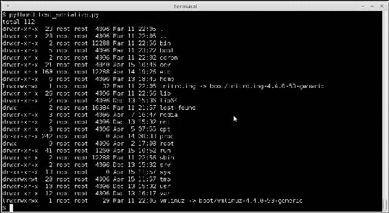

# 第 6 章安全-编写安全代码

在过去的几年里，软件应用程序的安全性（或缺乏安全性）在业界和媒体中已经吸引了大量的关注。看起来每隔一天，我们就会听到一两个恶意黑客的例子，在世界不同地区的软件系统中造成大规模数据泄露，并造成数百万美元的损失。受害者要么是政府部门、金融机构，要么是处理敏感客户数据（如密码、信用卡等）的公司。

软件安全和安全编码比以往任何时候都更加重要，因为在软件和硬件系统之间共享的数据量前所未有。智能个人技术如智能手机、智能手表、智能音乐播放器、，其他智能系统在很大程度上创造并帮助了互联网上的巨大数据流量。随着 IPV6 的出现以及未来几年**物联网**设备（**物联网**的大规模采用，数据量只会呈指数级增长。

正如我们在第一章中讨论的，安全性是软件体系结构的一个重要方面。除了使用安全原则构建系统之外，架构师还应该尝试向他们的团队灌输安全编码原则，以最大限度地减少团队编写的代码中的安全隐患。

在本章中，我们将介绍构建安全系统的原则，以及用 Python 编写安全代码的技巧和技术。

下面列出了我们将要讨论的主题。

*   信息安全体系结构
*   安全编码
*   常见安全漏洞
*   Python 安全吗？
    *   阅读输入
    *   计算任意输入
    *   溢出错误
    *   序列化对象
    *   web 应用程序的安全问题
*   安全策略–Python
*   安全编码策略

# 信息安全架构

安全架构包括创建一个系统，该系统能够向授权人员和系统提供对数据和信息的访问，同时防止任何未经授权的访问。为您的系统创建信息安全体系结构涉及以下方面：

*   **保密性**：限制系统中信息访问范围的一套规则或程序。保密性确保数据不会被未经授权的访问或修改。
*   **完整性**：完整性是系统的属性，确保信息通道可信可靠，系统不受外部操纵。换句话说，完整性确保了数据在系统中通过其组件时可以被信任。
*   **可用性**：系统将根据其服务水平协议（SLA）确保其授权用户的服务水平的属性。可用性确保系统不会拒绝向其授权用户提供服务。

机密性、完整性和可用性这三个方面——通常被称为 CIA 三位一体——构成了为您的系统构建信息安全体系结构的基石。


CIA 三位一体的信息安全架构

这些方面借助于其他特征，例如：

*   **认证**：验证交易参与者的身份，并确保他们实际上就是他们声称的人。例如电子邮件中使用的数字证书、用于登录系统的公钥等。
*   **授权**：授予特定用户/角色执行特定任务或相关任务组的权限。授权可确保特定用户组与特定角色绑定，从而限制其在系统中的访问（读取）和修改（写入）权限。
*   **非信誉**：保证参与交易的用户以后不能否认交易发生的安全技术。例如，一封电子邮件的发件人以后不能否认他们已经发送了该电子邮件；银行转帐的接收者不能否认他们收到了钱，等等。

# 安全编码

安全编码是软件开发的实践，它保护程序免受安全漏洞的攻击，并使其从程序设计到实现都能抵御恶意攻击。它是关于编写本质上安全的代码，而不是将安全性视为稍后添加的层。

安全编码背后的理念包括：

*   安全性是从程序或应用程序的设计和开发中考虑的一个方面；这不是事后的想法。
*   应在开发周期的早期确定安全需求，并将其传播到系统开发的后续阶段，以确保符合性得到维护。
*   使用威胁建模从一开始就预测系统的安全威胁。威胁建模包括以下内容：
    1.  识别重要资产（代码/数据）。
    2.  将应用程序分解为组件。
    3.  识别和分类每个资产或组件的威胁。
    4.  根据已建立的风险模型对威胁进行排序。
    5.  制定减轻威胁的战略。

安全编码的实践或策略包括以下主要任务：

1.  **应用程序感兴趣区域的定义**：识别应用程序代码/数据中关键且需要保护的重要资产。
2.  **软件架构分析**：分析软件架构是否存在明显的安全漏洞。组件之间的安全交互，以确保数据的机密性和完整性。确保通过适当的身份验证和授权技术保护机密数据。确保从一开始就将可用性构建到体系结构中。
3.  **实施细节审核**：使用安全编码技术审核代码。确保进行同行审查，以发现安全漏洞。向开发人员提供反馈，并确保进行了更改。
4.  **逻辑和语法验证**：检查代码逻辑和语法，确保实现中没有明显的循环漏洞。确保按照编程语言/平台的通用安全编码准则进行编程。
5.  **白盒/单元测试**：除了确保功能的测试外，开发人员单元还通过安全测试来测试其代码。模拟数据和/或 API 可用于虚拟化测试所需的第三方数据/API。
6.  **黑盒测试**：该应用程序由经验丰富的 QA 工程师进行测试，该工程师负责查找安全循环漏洞，如未经授权访问数据、意外暴露代码和/或数据的路径等，弱密码或散列等。测试报告将反馈给包括架构师在内的利益相关者，以确保确定的漏洞得到修复。

实际上，安全编码是一种实践和习惯，软件开发组织应该通过精心开发和审查的安全编码策略（如前面提到的）不断灌输。

# 常见安全漏洞

那么什么是常见的安全漏洞，今天的专业程序员应该准备在职业生涯中面对并缓解这些漏洞？通过查阅现有文献，可以将其分为几个特定类别：

*   **Overflow errors**: These include the popular and often abused **buffer overflow** errors, and the lesser known but still vulnerable **arithmetic or integer overflow** errors:
    *   **缓冲区溢出**：缓冲区溢出是由允许应用程序写入超过缓冲区结尾或开头的编程错误造成的。缓冲区溢出允许攻击者通过精心编制的攻击数据访问应用程序堆栈或堆内存，从而控制系统。
    *   **整数或算术溢出**：当对整数进行算术或数学运算产生的结果对于用于存储该结果的类型的最大大小来说太大时，就会发生这些错误。

    整数溢出如果处理不当，会造成安全漏洞。在支持有符号和无符号整数的编程语言中，溢出会导致数据包装并产生负数，从而使攻击者能够以类似缓冲区溢出的结果访问超出程序执行限制的堆或堆栈内存。

*   **Unvalidated/Improperly validated input**: A very common security issue with modern web applications, unvalidated input can cause major vulnerabilities, where attackers can trick a program into accepting malicious input such as code data or system commands, which, when executed, can compromise a system. A system that aims to mitigate this type of attack should have filters to check and remove content that is malicious, and only accept data that is reasonable and safe to the system.

    此类攻击的常见子类型包括 SQL 注入、服务器端模板注入、**跨站点脚本编制**（**XSS**）和 Shell 执行漏洞攻击。

    由于使用混合代码和数据的 HTML 模板，现代 web 应用程序框架容易受到此类攻击，但其中许多框架都有标准的缓解过程，如转义或过滤输入。

*   **不当访问控制**：现代应用程序应该为其类用户（如普通用户）和具有特殊权限的用户（如超级用户或管理员）定义单独的角色。当应用程序未能做到这一点或做得不正确时，它可能会暴露路由（URL）或工作流（由包含攻击向量的特定 URL 指定的一系列操作），这可能会将敏感数据暴露给攻击者，或者在最坏的情况下，允许攻击者破坏并控制系统。
*   **Cryptography issues**: Simply ensuring that access control is in place is not enough for hardening and securing a system. Instead, the level and strength of security should be verified and ascertained, otherwise, your system can still be hacked or compromised. Some examples are as follows:
    *   **HTTP instead of HTTPS**: When implementing RestFUL web services, make sure you favor HTTPS (SSL/TLS) over HTTP. In HTTP, all communication is in plain text between the client and server, and can be easily captured by passive network sniffers or carefully crafted packet capture software or devices installed in routers.

        像 letsencrypt 这样的项目使得系统管理员可以轻松地获取和更新免费的 SSL 证书，因此使用 SSL/TLS 保护您的服务器比以往任何时候都更容易。

    *   **不安全认证**：与不安全的认证技术相比，更喜欢 web 服务器上的安全认证技术。例如，与 web 服务器上的基本身份验证相比，您更喜欢 HTTP 摘要身份验证，因为在后者中，密码以明文形式发送。类似地，在大型共享网络中通过不太安全的替代方案使用**Kerberos**身份验证，例如**轻型目录访问协议**（**LDAP**或**NT LAN Manager**（**NTLM**）。
    *   **弱密码的使用**：容易猜测或默认/琐碎的密码是许多现代 web 应用程序的祸根。
    *   **安全散列/密钥的重用**-安全散列或密钥通常特定于应用程序或项目，不应跨应用程序重用。需要时，生成新的哈希和/或键。
    *   **弱加密技术**：在服务器（SSL 证书）或个人计算机（GPG/PGP 密钥）上加密通信时使用的密码应使用高级安全性–至少 2048 位，并使用同行评审和加密安全算法。
    *   **弱散列技术**：正如在密码中一样，用于保守机密和密码等敏感数据盐的散列技术在选择强算法时应谨慎。例如，如果您正在编写一个需要计算和存储散列的应用程序，那么最好使用 SHA-1 或 SHA-2 算法，而不是较弱的 MD5 算法。
    *   **无效或过期的证书/密钥**：网络管理员经常忘记更新他们的 SSL 证书，这可能会成为一个大问题，危及他们的 Web 服务器的安全，因为无效证书无法提供保护。同样，用于电子邮件通信的个人密钥（如 GPG 或 PGP 公钥/私钥对）也应保持更新。

    启用密码的 SSH-使用明文密码对远程系统进行 SSH 访问是一个安全漏洞。禁用基于密码的访问，并且仅为特定用户启用通过授权 SSH 密钥的访问。禁用远程根 SSH 访问。

*   **信息泄漏**：很多 web 服务器系统（主要是由于开放配置、错误配置或缺乏输入验证）可能会向攻击者泄露大量关于自身的信息。一些例子如下：
    *   **Server meta information**: Many web servers leak information about themselves via their 404 pages, and sometimes, via their landing pages. Here is an example:

        

        404 显示服务器元信息的 web 服务器页面

        通过简单地请求一个不存在的页面，我们知道在前面的屏幕截图中看到的站点在 Debian 服务器上运行 Apache 2.4.10 版。对于狡猾的攻击者来说，这些信息通常足以尝试针对特定 web 服务器/操作系统组合的特定攻击。

    *   **Open index pages**: Many websites don't protect their directory pages, and leave them open for world access. This following image shows an example:

        

        打开 web 服务器的索引页

    *   **Open ports**: It is a common error to provide world-access to application's ports running on remote web servers instead of limiting access to them by specific IP addresses or security groups by using firewalls – such as *iptables*. A similar error is to allow a service to run on 0.0.0.0 (all IP addresses on the server) for a service which is only consumed on the localhost. This makes it easy for attackers to scan for such ports using network reconnaissance tools such as *nmap/hping3*, and the like, and plan their attack.

        开放访问文件/文件夹/数据库-一个非常糟糕的做法是提供对应用程序配置文件、日志文件、进程 ID 文件和其他工件的开放或全局访问，以便任何登录用户都可以访问这些文件并从中获取信息。相反，这些文件应该是安全策略的一部分，以确保只有具有所需权限的特定角色才能访问这些文件。

*   **Race conditions**: A race condition exists when a program has two or more actors trying to access a certain resource, but the output depends on the correct order of access, which cannot be ensured. An example is two threads trying to increment a numerical value in shared memory without proper synchronization.

    狡猾的攻击者可以利用这种情况插入恶意代码、更改文件名，或者有时利用代码处理过程中的小时间间隔来干扰操作序列。

*   **系统时钟漂移**：由于同步不当或丢失，服务器上的系统或本地时钟时间缓慢偏离参考时间的现象。随着时间的推移，时钟漂移可能会导致严重的安全缺陷，例如 SSL 证书验证中的错误，这可能会被高度复杂的技术利用，如*定时攻击*，其中攻击者试图通过分析执行加密算法所用的时间来控制系统。时间同步协议（如 NTP）可用于缓解这一问题。
*   **不安全的文件/文件夹操作**：程序员经常对文件或文件夹的所有权、位置或属性做出假设，但在实践中可能不正确。这可能导致出现安全漏洞，或者我们可能无法检测到对系统的篡改。一些例子如下：
    *   假设写入操作成功，则无法在写入操作后检查结果
    *   假设本地文件路径始终是本地文件（然而，它们可能是指向应用程序可能无权访问的系统文件的符号链接）
    *   在执行系统命令时不正确地使用 sudo，如果操作不正确，可能会导致漏洞，这些漏洞可用于获取系统的根访问权限
    *   慷慨地使用共享文件或文件夹的权限，例如，打开程序的所有执行位，这些执行位应限于任何登录用户都可以读取的组或打开的主文件夹
    *   使用代码或数据对象的不安全序列化和反序列化

访问此列表中的每种类型的漏洞超出了本章的范围。然而，在下一节中，我们将认真地回顾和解释影响 Python 及其一些 web 框架的常见软件漏洞类别。

# Python 安全吗？

Python 是一种可读性很强的语言，语法简单，而且通常是一种明确的做事方式。它附带了一组经过良好测试且紧凑的标准库模块。所有这些似乎都表明 Python 应该是一种非常安全的语言。

但果真如此吗？

让我们看看 Python 中的几个示例，并尝试分析 Python 及其标准库的安全方面。

出于实用目的，我们将使用 Python2.x 和 Python3.x 版本演示本节中显示的代码示例。这是因为 Python2.x 版本中存在的许多安全漏洞在最近的 3.x 版本中已经修复。然而，由于许多 Python 开发人员仍在使用某种形式的 Python 2.x，因此代码示例对他们很有用，并且还说明了迁移到 Python 3.x 的重要性。

所有示例都在运行 Linux（Ubuntu 16.0）x86_64 体系结构的机器上执行：

### 注

注意：这些示例中使用的 Python3.x 版本是 Python3.5.2，使用的 Python2.x 版本是 Python2.7.12。所有示例都在运行 Linux（Ubuntu 16.0）64 位 x86 体系结构的机器上执行

```py
$ python3
Python 3.5.2 (default, Jul  5 2016, 12:43:10) 
[GCC 5.4.0 20160609] on linux
Type "help", "copyright", "credits" or "license" for more information.
>>> import sys
>>> print (sys.version)
3.5.2 (default, Jul  5 2016, 12:43:10) 
[GCC 5.4.0 20160609]
```

```py
$ python2
Python 2.7.12 (default, Jul  1 2016, 15:12:24) 
[GCC 5.4.0 20160609] on linux2
Type "help", "copyright", "credits" or "license" for more information.
>>> import sys
>>> print sys.version
2.7.12 (default, Jul  1 2016, 15:12:24) 
[GCC 5.4.0 20160609]
```

### 注

注意：大多数示例将使用一个版本的代码，它将在 Python2.x 和 Python3.x 中运行。在不可能的情况下，将列出两个版本的代码。

## 读取输入

让我们看看这个程序，它是一个简单的猜谜游戏。它从标准输入中读取一个数字，并将其与随机数进行比较。如果匹配，则用户获胜，否则，用户必须重试：

```py
# guessing.py
import random

# Some global password information which is hard-coded
passwords={"joe": "world123",
          "jane": "hello123"}

def game():
     """A guessing game """

    # Use 'input' to read the standard input
    value=input("Please enter your guess (between 1 and 10): ")
    print("Entered value is",value)
    if value == random.randrange(1, 10):
        print("You won!")
    else:
        print("Try again")

if __name__ == "__main__":
    game()
```

前面的代码很简单，只是它有一些敏感的全局数据，这是系统中一些用户的密码。在一个实际的例子中，这些函数可以由一些其他函数填充，这些函数读取密码并将其缓存在内存中。

让我们用一些标准输入试试这个程序。我们将首先使用 Python 2.7 运行它，如下所示：

```py
$ python2 guessing.py
Please enter your guess (between 1 and 10): 6
('Entered value is', 6)
Try again
$ python2 guessing.py
Please enter your guess (between 1 and 10): 8
('Entered value is', 8)
You won!

```

现在，让我们尝试一种“非标准”输入：

```py
$ python2 guessing.py
Please enter your guess (between 1 and 10): passwords
('Entered value is', {'jane': 'hello123', 'joe': 'world123'})
Try again
```

注意前面的运行是如何公开全局密码数据的！

问题是在 Python2 中，输入值作为表达式计算，而不进行任何检查，并且在打印时，表达式打印其值。在这种情况下，它恰好匹配一个全局变量，所以它的值被打印出来。

现在让我们看看这个：

```py
$ python2 guessing.py
Please enter your guess (between 1 and 10): globals()
('Entered value is', {'passwords': {'jane': 'hello123', 
'joe' : 'world123'}, '__builtins__': <module '__builtin__' (built-in)>,
 '__file__': 'guessing.py', 'random': 
<module 'random' from '/usr/lib/python2.7/random.pyc'>,
 '__package__': None, 'game': 
<function game at 0x7f6ef9c65d70>,
 '__name__': '__main__', '__doc__': None})
Try again
```

现在，它不仅公开了密码，还公开了代码中的完整全局变量，包括密码。即使程序中没有敏感数据，使用这种方法的黑客也可以透露有关程序的重要信息，如变量名、函数名、使用的包等。

这有什么办法？对于 Python 2，一种解决方案是将直接传递给`eval`来评估其内容的输入替换为不评估内容的`raw_input`。由于`raw_input` 不返回数字，所以需要将其转换为目标类型。（这可以通过将返回数据强制转换为一个`int`来实现。）以下代码不仅如此，还为类型转换添加了一个异常处理程序，以提供额外的安全性：

```py
# guessing_fix.py
import random

passwords={"joe": "world123",
                  "jane": "hello123"}

def game():
    value=raw_input("Please enter your guess (between 1 and 10): ")
    try:
        value=int(value)
    except TypeError:
        print ('Wrong type entered, try again',value)
        return

    print("Entered value is",value)
    if value == random.randrange(1, 10):
        print("You won!")
    else:
        print("Try again")

if __name__ == "__main__":
    game()
```

让我们看看这个版本如何修复评估输入时的安全漏洞

```py
$ python2 guessing_fix.py 
Please enter your guess (between 1 and 10): 9
('Entered value is', 9)
Try again
$ python2 guessing_fix.py 
Please enter your guess (between1 and 10): 2
('Entered value is', 2)
You won!

$ python2 guessing_fix.py 
Please enter your guess (between 1 and 10): passwords
(Wrong type entered, try again =>, passwords)

$ python2 guessing_fix.py 
Please enter your guess (between 1 and 10): globals()
(Wrong type entered, try again =>, globals())
```

新程序现在比第一个版本安全得多。

如下图所示，Python3.x 中没有这个问题。（我们正在使用原始版本来运行此操作）。

```py
$ python3 guessing.py 
Please enter your guess (between 1 and 10): passwords
Entered value is passwords
Try again

$ python3 guessing.py 
Please enter your guess (between 1 and 10): globals()
Entered value is globals()
Try again
```

## 评估任意输入

Python 中的`eval`函数非常强大，但也很危险，因为它允许向其传递任意字符串，这可能会评估潜在的危险代码或命令。

让我们把这段相当愚蠢的代码作为一个测试程序来看看`eval`能做什么：

```py
# test_eval.py
import sys
import os

def run_code(string):
    """ Evaluate the passed string as code """

    try:
eval(string, {})
    except Exception as e:
        print(repr(e))

if __name__ == "__main__":
     run_code(sys.argv[1])
```

让我们假设一个场景，攻击者试图利用这段代码找出应用程序正在运行的目录的内容。（目前，您可以假设攻击者可以通过 web 应用程序运行此代码，但无法直接访问机器本身）。

假设攻击者试图列出当前文件夹的内容：

```py
$ python2 test_eval.py "os.system('ls -a')"
NameError("name 'os' is not defined",)
```

前面的攻击不起作用，因为`eval` 接受第二个参数，该参数提供在求值过程中使用的全局值。因为在我们的代码中，我们将第二个参数作为空字典传递，所以我们得到了错误，因为 Python 无法解析`os` 名称。

那么这是否意味着，`eval`是安全的？不，不是。让我们看看原因。

当我们将以下输入传递给代码时会发生什么？

```py
$ python2 test_eval.py "__import__('os').system('ls -a')"
.   guessing_fix.py  test_eval.py    test_input.py
..  guessing.py      test_format.py  test_io.py
```

我们可以看到，我们仍然可以通过使用内置功能`__import__`来引导`eval` 进行我们的投标。

之所以这样做，是因为在默认内置的`__builtins__` 全局文件中可以使用`__import__` 等名称。我们可以通过第二个参数将其作为空字典传递，从而否定`eval`。以下是修改后的版本：

```py
# test_eval.py
import sys
import os

def run_code(string):
    """ Evaluate the passed string as code """

    try:
        # Pass __builtins__ dictionary as empty
        eval(string,  {'__builtins__':{}})
    except Exception as e:
        print(repr(e))

if __name__ == "__main__":
run_code(sys.argv[1])
```

现在攻击者无法通过内置的`__import__`进行攻击：

```py
$ python2 test_eval.py "__import__('os').system('ls -a')"
NameError("name '__import__' is not defined",)
```

然而，这并不能使`eval`变得更安全，因为它可以接受稍长一点但巧妙的攻击。这里有一个这样的攻击：

```py
$ python2 test_eval.py "(lambda f=(lambda x: [c for c in [].__class__.__bases__[0].__subclasses__() if c.__name__ == x][0]): f('function')(f('code')(0,0,0,0,'BOOM',(), (),(),'','',0,''),{})())()"
Segmentation fault (core dumped)
```

我们能够用一段看起来相当模糊的恶意代码来核心转储 Python 解释器。这是怎么发生的？

下面是对这些步骤的一些详细说明。

首先，让我们考虑一下：

```py
>>> [].__class__.__bases__[0]
<type 'object'>
```

这只是基类`object`。因为我们无法访问内置程序，所以这是一种间接的访问方式。

接下来，下面一行代码将加载 Python 解释器中当前加载的`object` 的所有子类：

```py
>>> [c for c in [].__class__.__bases__[0].__subclasses__()]
```

其中，我们想要的是`code` 对象类型。可通过`__name__` 属性检查项目名称来访问：

```py
>>> [c for c in [].__class__.__bases__[0].__subclasses__() if c.__name__ == 'code']
```

以下是使用匿名`lambda`函数实现的相同功能：

```py
>>> (lambda x: [c for c in [].__class__.__bases__[0].__subclasses__() if c.__name__ == x])('code')
[<type 'code'>]
```

接下来，我们要执行这个代码对象。但是，`code`对象不能直接调用。它们需要绑定到函数才能被调用。这是通过将前面的`lambda`函数包装在外部`lambda`函数中实现的：

```py
>>> (lambda f: (lambda x: [c for c in [].__class__.__bases__[0].__subclasses__() if c.__name__ == x])('code'))
<function <lambda> at 0x7f8b16a89668
```

现在我们的内部`lambda`函数可以分两步调用：

```py
>>> (lambda f=(lambda x: [c for c in [].__class__.__bases__[0].__subclasses__() if c.__name__ == x][0]): f('function')(f('code')))
<function <lambda> at 0x7fd35e0db7d0>
```

最后，我们通过传递大部分默认参数，通过这个外部`lambda`函数调用`code`对象。代码字符串作为字符串`BOOM`传递，当然，这是一个伪代码字符串，导致 Python 解释器 segfault，产生核心转储：

```py
>>> (lambda f=(lambda x: 
[c for c in [].__class__.__bases__[0].__subclasses__() if c.__name__ == x][0]): 
f('function')(f('code')(0,0,0,0,'BOOM',(), (),(),'','',0,''),{})())()
Segmentation fault (core dumped)
```

这表明`eval` 在任何上下文中，即使没有内置模块支持，也是不安全的，聪明恶意的黑客可以利用`eval` 使 Python 解释器崩溃，从而可能获得对系统的控制。

请注意，同样的漏洞也适用于 Python 3，但我们需要对`code`对象的参数进行一些修改，就像在 Python 3 中一样，`code`对象需要一个额外的参数。此外，代码字符串和一些参数必须是`byte` 类型。

以下是在 Python3 上运行的漏洞。最终结果是一样的：

```py
$ python3 test_eval.py 
"(lambda f=(lambda x: [c for c in ().__class__.__bases__[0].__subclasses__() 
  if c.__name__ == x][0]): f('function')(f('code')(0,0,0,0,0,b't\x00\x00j\x01\x00d\x01\x00\x83\x01\x00\x01d\x00\x00S',(), (),(),'','',0,b''),{})())()"
Segmentation fault (core dumped)
```

## 溢出错误

在 Python 2 中，`xrange()`函数在范围不能适应 Python 的整数范围时产生溢出错误：

```py
>>> print xrange(2**63)
Traceback (most recent call last):
    File "<stdin>", line 1, in <module>
OverflowError: Python int too large to convert to C long
```

`range()` 功能也溢出，但有一个稍微不同的错误：

```py
>>> print range(2**63)
Traceback (most recent call last):
    File "<stdin>", line 1, in <module>
OverflowError: range() result has too many items
```

问题在于`xrange()` 和`range()` 使用纯整数对象（类型`<int>`），而不是自动转换为`long` 类型，该类型仅受系统内存的限制。

然而，这个问题在 Python 3.x 版本中已经得到了解决，因为类型`int` 和`long` 被统一为一个（`int`类型），并且`range()`对象在内部管理内存。此外，不再存在单独的`xrange()`对象：

```py
>>> range(2**63)
range(0, 9223372036854775808)
```

下面是 Python 中整数溢出错误的另一个例子，这次是针对`len` 函数。

在下面的例子中，我们在两个类 A 和 B 的实例上尝试了`len`函数，它们的神奇方法`__len__`已经被滥用，为`len`函数提供了支持。请注意，A 是一个新样式类，继承自`object` ，B 是一个旧样式类。

```py
# len_overflow.py

class A(object):
    def __len__(self): 
        return 100 ** 100

class B:
    def __len__(self): 
        return 100 ** 100

try:
    len(A())
    print("OK: 'class A(object)' with 'return 100 ** 100' - len calculated")
except Exception as e:
    print("Not OK: 'class A(object)' with 'return 100 ** 100' - len raise Error: " + repr(e))

try:
    len(B())
    print("OK: 'class B' with 'return 100 ** 100' - len calculated")
except Exception as e:
    print("Not OK: 'class B' with 'return 100 ** 100' - len raise Error: " + repr(e))
```

以下是使用 Python2 执行时的代码输出：

```py
$ python2 len_overflow.py 
Not OK: 'class A(object)' with 'return 100 ** 100' - len raise Error: OverflowError('long int too large to convert to int',)
Not OK: 'class B' with 'return 100 ** 100' - len raise Error: TypeError('__len__() should return an int',)

```

在 Python 3 中执行相同的代码，如下所示：

```py
$ python3 len_overflow.py 
Not OK: 'class A(object)' with 'return 100 ** 100' - len raise Error: OverflowError("cannot fit 'int' into an index-sized integer",)
Not OK: 'class B' with 'return 100 ** 100' - len raise Error: OverflowError("cannot fit 'int' into an index-sized integer",)

```

前面代码中的问题是`len`返回`integer` 对象，在这种情况下，实际值太大，无法放入`int`中，因此 Python 会引发溢出错误。然而，在 Python 2 中，对于类不是从`object`派生的情况，执行的代码略有不同，它预期一个`int` 对象，但得到`long`并抛出一个`TypeError`。在 Python3 中，两个示例都返回溢出错误。

像这样的整数溢出错误是否存在安全问题？

实际上，这取决于所使用的应用程序代码和依赖模块代码，以及它们如何处理或捕获/屏蔽溢出错误。

但是，由于 Python 是用 C 编写的，任何未在底层 C 代码中正确处理的溢出错误都可能导致缓冲区溢出异常，攻击者可以写入溢出缓冲区并劫持底层进程/应用程序。

通常，如果模块或数据结构能够处理溢出错误并引发异常以阻止进一步的代码执行，那么代码被利用的机会就会减少。

## 序列化对象

Python 开发人员使用`pickle` 模块及其 C 实现表亲`cPickle`序列化 Python 中的对象是非常常见的。但是，这两个模块都允许未经检查的代码执行，因为它们不会对被序列化的对象强制执行任何类型的类型检查或规则，以验证它是良性 Python 对象还是可以利用系统的潜在命令。

### 注

注意：在 Python3 中，`cPickle` 和`pickle` 模块合并为一个`pickle` 模块。

下面是一个通过 shell 漏洞进行的演示，它列出了 Linux/POSIX 系统中根文件夹（`/`的内容：

```py
# test_serialize.py
import os
import pickle

class ShellExploit(object):
    """ A shell exploit class """

    def __reduce__(self):
        # this will list contents of root / folder.
        return (os.system, ('ls -al /',)

def serialize():
    shellcode = pickle.dumps(ShellExploit())
    return shellcode

def deserialize(exploit_code):
    pickle.loads(exploit_code)

if __name__ == '__main__':
    shellcode = serialize()
    deserialize(shellcode)
```

最后一段代码只是打包了一个`ShellExploit`类，该类在酸洗后通过`os.system()` 方法返回命令，列出根文件系统`/`的内容。因此，`Exploit`类将恶意代码伪装成一个`pickle`对象，该对象在解锁时执行代码，并向攻击者公开机器根文件夹的内容。上述代码的输出如下所示：



用于使用 pickle 序列化的 shell 攻击代码的输出，公开/folder 的内容。

如您所见，输出清楚地列出了根文件夹的内容。

如何防止此类漏洞利用？

首先，不要在应用程序中使用不安全的模块`pickle`进行序列化。相反，依赖于更安全的替代方案，如`json` 或`yaml`。如果您的应用程序由于某种原因确实依赖于使用`pickle` 模块，那么请使用沙盒软件或`codeJail`创建安全的环境，以防止在系统上执行恶意代码。

例如，这里稍微修改了前面的代码，现在使用了一个简单的 chroot jail，它阻止在实际根文件夹上执行代码。它通过上下文管理器挂钩使用本地`safe_root/`子文件夹作为新根。请注意，这是一个简单的示例。真正的监狱要比这复杂得多：

```py
# test_serialize_safe.py
import os
import pickle
from contextlib import contextmanager

class ShellExploit(object):
    def __reduce__(self):
        # this will list contents of root / folder.
        return (os.system, ('ls -al /',))

@contextmanager
def system_jail():
    """ A simple chroot jail """

    os.chroot('safe_root/')
    yield
    os.chroot('/')

def serialize():
    with system_jail():
        shellcode = pickle.dumps(ShellExploit())
        return shellcode

def deserialize(exploit_code):
    with system_jail():
        pickle.loads(exploit_code)

if __name__ == '__main__':
    shellcode = serialize()
    deserialize(shellcode)
```

有了这个监狱，代码执行如下：


使用 pickle 序列化的 shell 漏洞代码的输出，带有一个简单的 chroot 命令。

现在没有生成输出，因为这是一个假监狱，Python 在新根目录中找不到`ls`命令。当然，为了在生产系统中实现这一点，应该建立一个适当的监狱，允许程序执行，但同时防止或限制恶意程序的执行。

其他序列化格式如 JSON 如何？这样的剥削能与他们合作吗？让我们看一个例子。

下面是使用`json` 模块编写的相同序列化代码：

```py
# test_serialize_json.py
import os
import json
import datetime

class ExploitEncoder(json.JSONEncoder):
    def default(self, obj):
        if any(isinstance(obj, x) for x in (datetime.datetime, datetime.date)):
            return str(obj)

        # this will list contents of root / folder.
        return (os.system, ('ls -al /',))

def serialize():
    shellcode = json.dumps([range(10),
                            datetime.datetime.now()],
                           cls=ExploitEncoder)
    print(shellcode)
    return shellcode

def deserialize(exploit_code):
    print(json.loads(exploit_code))

if __name__ == '__main__':
    shellcode = serialize()
    deserialize(shellcode)
```

请注意如何使用名为`ExploitEncoder`的自定义编码器覆盖默认的JSON 编码器。但是，由于 JSON 格式不支持此类序列化，它将返回作为输入传递的列表的正确序列化：

```py
$ python2 test_serialize_json.py 
[[0, 1, 2, 3, 4, 5, 6, 7, 8, 9], "2017-04-15 12:27:09.549154"]
[[0, 1, 2, 3, 4, 5, 6, 7, 8, 9], u'2017-04-15 12:27:09.549154']
```

对于 Python3，由于 Python3 引发异常，因此该漏洞利用失败。


使用 Python3 输出用于使用 json 序列化的 shell 攻击代码

# web 应用程序的安全问题

到目前为止，我们已经看到 Python 存在四种类型的安全问题，即读取输入、计算表达式、溢出错误和序列化问题。到目前为止，我们所有的示例都是在控制台上使用 Python 的。

然而，几乎所有人每天都与 web 应用程序交互，其中许多应用程序是用 PythonWeb 框架编写的，如 Django、Flask、Pyramid 等。因此，我们更有可能在此类应用程序中遇到安全问题。我们将在这里看几个例子。

## 服务器端模板注入

Po.T0:Server 端模板注入 Oracle T1（State T2AsSSTI OUTT3）是使用通用 Web Ty4T4 框架的服务器端模板作为攻击向量的攻击。该攻击利用了用户输入嵌入模板的方式中的弱点。SSTI 攻击可以用来找出 web 应用程序的内部结构，执行 shell命令，甚至完全破坏服务器。

我们将看到一个使用 Python 中非常流行的 web 应用程序框架的示例，即 Flask。

以下是 Flask 中具有内联模板的简单 web 应用程序的示例代码：

```py
# ssti-example.py
from flask import Flask
from flask import request, render_template_string, render_template

app = Flask(__name__)

@app.route('/hello-ssti')
defhello_ssti():
    person = {'name':"world", 'secret': 'jo5gmvlligcZ5YZGenWnGcol8JnwhWZd2lJZYo=='}
    if request.args.get('name'):
        person['name'] = request.args.get('name')

    template = '<h2>Hello %s!</h2>' % person['name']
    return render_template_string(template, person=person)

if __name__ == "__main__":
app.run(debug=True)
```

在控制台上运行，并在浏览器中打开，我们可以在`hello-ssti`路线上玩：

```py
$ python3 ssti_example.py 
 * Running on http://127.0.0.1:5000/ (Press CTRL+C to quit)
 * Restarting with stat
 * Debugger is active!
 * Debugger pin code: 163-936-023
```

首先，让我们尝试一些良性输入：


这里是另一个例子。


接下来，让我们尝试一些攻击者可能使用的狡猾输入。


这里发生了什么？

由于模板使用了不安全的`%s`字符串模板，因此它会对传递给它的任何内容进行计算，并将其转换为 Python 表达式。我们通过了`{{ person.secret }}`，在 Flask 模板语言（Flask 使用 Jinja2 模板）中，对字典`person`中的密钥密钥值进行了评估，有效地暴露了应用的密钥！

我们可以执行更雄心勃勃的攻击，因为代码中的这个漏洞允许攻击者尝试 Jinja 模板的全部功能，包括 for 循环。以下是一个例子：


用于攻击的 URL 如下所示：

```py
http://localhost:5000/hello-ssti?name=<p>{{ item, person[item] }}</p>
```

这将通过一个 for 循环，并尝试打印`person`字典的所有内容。

这还允许攻击者轻松访问敏感的服务器端配置参数。例如，他可以通过传递名称参数`{{ config }}`来打印烧瓶配置。

这是使用此攻击打印服务器配置的浏览器的图像。


## 服务器端模板注入-缓解

我们在前面的部分中看到了一些使用服务器端模板作为攻击向量来公开 Web 应用程序/服务器的敏感信息的例子。在本节中，我们将了解程序员如何保护其代码免受此类攻击。

在这种特定情况下，解决方法是使用我们希望在模板中使用的特定变量，而不是危险的 allow all`%s`字符串。以下是修改后的代码和修复程序：

```py
# ssti-example-fixed.py
from flask import Flask
from flask import request, render_template_string, render_template

app = Flask(__name__)

@app.route('/hello-ssti')
defhello_ssti():
    person = {'name':"world", 'secret': 'jo5gmvlligcZ5YZGenWnGcol8JnwhWZd2lJZYo=='}
    if request.args.get('name'):
        person['name'] = request.args.get('name')

    template = '<h2>Hello {{ person.name }} !</h2>'
    return render_template_string(template, person=person)

if __name__ == "__main__":
app.run(debug=True)
```

现在早些时候的攻击都失败了。

以下是第一次攻击的浏览器图像：


这是下一次攻击的浏览器图像。


## 拒绝服务

现在让我们看看另一种恶意黑客常用的攻击，即**拒绝服务**（**DOS**。

DoS 攻击的目标是 web 应用程序中易受攻击的路由或 URL，并向它们发送狡猾的数据包或 URL，这要么迫使服务器执行无限循环或 CPU 密集型计算，要么迫使服务器从数据库加载大量数据，这会给服务器 CPU 带来大量负载，阻止服务器执行其他请求。

### 注

DDoS 或分布式 DoS 攻击是指使用针对单个域的多个系统以精心设计的方式执行 DoS 攻击。通常使用数千个 IP 地址，通过僵尸网络进行 DDoS 攻击。

我们将看到一个 DoS 攻击的最小示例，它使用了我们前面示例的变体：

```py
# ssti-example-dos.py
from flask import Flask
from flask import request, render_template_string, render_template

app = Flask(__name__)

TEMPLATE = '''
<html>
 <head><title> Hello {{ person.name }} </title></head>
 <body> Hello FOO </body>
</html>
'''

@app.route('/hello-ssti')
defhello_ssti():
    person = {'name':"world", 'secret': 'jo5gmvlligcZ5YZGenWnGcol8JnwhWZd2lJZYo=='} 
    if request.args.get('name'):
        person['name'] = request.args.get('name')

    # Replace FOO with person's name
    template = TEMPLATE.replace("FOO", person['name'])
    return render_template_string(template, person=person)

if __name__ == "__main__":
app.run(debug=True)
```

在前面的代码中，我们使用了一个名为`TEMPLATE`的全局模板变量，并使用`safer {{ person.name }}`模板变量作为 SSTI 补丁使用的模板变量。然而，这里的附加代码是用名称值替换持有名称`FOO`。

此版本具有原始代码的所有漏洞，即使删除了`%s`代码。例如，查看浏览器的下图，它在正文中显示了`{{ person.secret }}`变量值，但在页面标题中没有。


这是由于我们添加了以下代码行，如下所示。

```py
 # Replace FOO with person's name
 template = TEMPLATE.replace("FOO", person['name'])
```

对通过的任何表达式进行求值，包括算术的表达式。例如：


这通过传入服务器无法处理的 CPU 密集型计算打开了简单 DoS 攻击的途径。例如，在以下攻击中，我们传入了一个非常大的数字计算，它占用了系统的 CPU，降低了系统速度，并使应用程序无响应：


使用计算密集型代码演示 DoS 风格攻击的示例。请求从未完成。

用于此攻击的 URL 为`http://localhost:5000/hello-ssti?name=Tom`。

通过传入计算密集型的算术表达式`{{ 100**100000000 }}`，服务器过载，无法处理其他请求。

正如您在前面的图像中所看到的，请求永远不会完成，并且还会阻止服务器响应其他请求；正如您从右侧打开的新选项卡上对同一应用程序的正常请求也会被阻止，从而导致 DoS 风格的攻击。


用攻击向量在标签右侧打开一个新标签，说明应用程序已经变得无响应。

## 跨站点脚本（XSS）

我们在前面的部分中使用的代码演示了一种最低限度的 DOS 攻击，它也容易受到脚本注入的攻击。下面是一个例子：


使用服务器端模板和 JavaScript 注入的 XSS 脚本的简单演示

用于此攻击的 URL 为：

```py
http://localhost:5000/hello-ssti?name=Tom<script>alert("You are under attack!")</script>
```

这些类型的脚本注入漏洞可能导致 XSS，这是一种常见的 web 攻击形式，攻击者能够将恶意脚本注入从其他网站加载的服务器代码中，并控制它。

## 缓解措施——DoS 和 XSS

在上一节中，我们看到了一些 DoS 攻击和简单 XSS 攻击的示例。现在让我们看看程序员如何在代码中采取步骤来减轻此类攻击。

在我们用于说明的上一个具体示例中，修复方法是删除将字符串`FOO`替换为名称值的行，并将其替换为参数模板本身。为了更好地测量，我们还使用 Jinja 2 的逃逸过滤器`|e`确保输出正确逃逸。以下是重写的代码：

```py
# ssti-example-dos-fix.py
from flask import Flask
from flask import request, render_template_string, render_template

app = Flask(__name__)

TEMPLATE = '''
<html>
 <head><title> Hello {{ person.name | e }} </title></head>
 <body> Hello {{ person.name | e }} </body>
</html>
'''

@app.route('/hello-ssti')
defhello_ssti():
    person = {'name':"world", 'secret': 'jo5gmvlligcZ5YZGenWnGcol8JnwhWZd2lJZYo=='} 
    if request.args.get('name'):
        person['name'] = request.args.get('name')
    return render_template_string(TEMPLATE, person=person)

if __name__ == "__main__":
app.run(debug=True)
```

既然这两个漏洞都得到缓解，攻击就没有效果，并且不会造成伤害。

这是一张演示 Dos 攻击的图片。


下面是演示 XSS 攻击的示例。


由于服务器端模板中的错误代码而导致的类似漏洞存在于其他 Python web 框架中，如 Django、Pyramid、Tornado 等。然而，关于每一个问题的逐步讨论超出了本章的范围。感兴趣的读者可以访问 web 上讨论此类问题的安全资源。

# 安全策略——Python

我们已经讨论了核心 Python 编程语言中存在的许多漏洞，并且还研究了一些影响 Python web 应用程序的常见安全问题。

现在时机已经成熟，可以研究安全架构师可以使用的策略、技巧和技术，以便他们的团队能够从程序设计和开发阶段就应用安全编码原则来缓解安全问题：

*   **读取输入**：当读取控制台输入时，优先选择 rawinput 而不是 input，因为前者不计算 Python 表达式，而是以普通字符串的形式返回输入。任何类型转换或验证都应该手动完成，如果类型不匹配，就会抛出异常或返回错误。要读取密码，请使用诸如 getpass 之类的库，并对返回的数据执行验证。一旦验证成功，就可以安全地对数据进行任何评估。
*   **求值表达式**：正如我们在示例中所看到的，eval 总是有漏洞无论使用哪种方法。因此，Python 的最佳策略是避免使用 evaland 及其邪恶的表兄 exec。如果必须使用 eval，请务必不要将其用于用户输入字符串、从第三方库读取的数据或无法控制的 api。仅对输入源使用 eval，并从您可以控制和信任的函数返回值。
*   **序列化**：不要使用`pickle`或`cPickle`进行序列化。喜欢其他模块，如 JASON 或 YAML。如果您必须使用`pickle`/`cPickle`，请使用缓解策略，如 chroot 监狱或沙箱，以避免恶意代码执行的不良影响（如果有）。
*   **溢出错误**：使用异常处理程序防止整数溢出。Python 不会遭受纯粹的缓冲区溢出错误，因为它总是检查其容器的读/写访问权限是否超出边界，并抛出异常。对于类上重写的`__len__`方法，根据需要捕获溢出或`TypeError`异常。
*   **String formatting**: Prefer the newer and safer format method of template strings over the older and unsafe `%s` interpolation.

    例如：

    ```py
    def display_safe(employee):
        """ Display details of the employee instance """

        print("Employee: {name}, Age: {age}, 
                 profession: {job}".format(**employee))

    def display_unsafe(employee):
        """ Display details of employee instance """

        print ("Employee: %s, Age: %d, 
                  profession: %s" % (employee['name'],
                                                 employee['age'],
                                                 employee['job']))

    >>> employee={'age': 25, 'job': 'software engineer', 'name': 'Jack'}
    >>> display_safe(employee)
    Employee: Jack, Age: 25, profession: software engineer
    >>> display_unsafe(employee)
    Employee: Jack, Age: 25, profession: software engineer
    ```

*   **Files**: When working with files, it is a good idea to use the with context managers to make sure that the file descriptors are closed after the operation.

    例如，支持这种方法：

    ```py
    with open('somefile.txt','w') as fp:
     fp.write(buffer)
    ```

    并避免以下情况：

    ```py
    fp = open('somefile.txt','w')
    fp.write(buffer)
    ```

    这还将确保在文件读取或写入期间发生任何异常时关闭文件描述符，而不是在系统中保持打开的文件句柄。

*   **Handling passwords and sensitive information**: When validating sensitive information like passwords, it is a good idea to compare cryptographic hashes rather than comparing the original data in memory:
    *   This way, even if an attacker is able to pry out sensitive data from the program by exploits such as shell execution exploits or due to weaknesses in input data evaluation, the actual sensitive data is protected from immediate breach. Here is a simple approach for this:

        ```py
        # compare_passwords.py - basic
        import hashlib
        import sqlite3
        import getpass

        def read_password(user):
            """ Read password from a password DB """
            # Using an sqlite db for demo purpose

            db = sqlite3.connect('passwd.db')
            cursor = db.cursor()
            try:
                passwd=cursor.execute("select password from passwds where user='%(user)s'" % locals()).fetchone()[0]
                return hashlib.sha1(passwd.encode('utf-8')).hexdigest()
            except TypeError:
                pass

        def verify_password(user):
            """ Verify password for user """

            hash_pass = hashlib.sha1(getpass.getpass("Password: ").encode('utf-8')).hexdigest()
            print(hash_pass)
            if hash_pass==read_password(user):
                print('Password accepted')
            else:
                print('Wrong password, Try again')

        if __name__ == "__main__":
            import sys
            verify_password(sys.argv[1])
        ```

        一种更为加密正确的技术是使用具有内置 salt 和固定数量散列轮的强密码散列库。

        下面是一个使用 Python 中的`passlib`库的示例：

        ```py
        # crypto_password_compare.py
        import sqlite3
        import getpass
        from passlib.hash import bcrypt

        def read_passwords():
            """ Read passwords for all users from a password DB """
            # Using an sqlite db for demo purpose

            db = sqlite3.connect('passwd.db')
            cursor = db.cursor()
            hashes = {}

            for user,passwd in cursor.execute("select user,password from passwds"):
                hashes[user] = bcrypt.encrypt(passwd, rounds=8)

            return hashes

        def verify_password(user):
            """ Verify password for user """

            passwds = read_passwords()
            # get the cipher
            cipher = passwds.get(user)
            if bcrypt.verify(getpass.getpass("Password: "), cipher):
                print('Password accepted')      
            else:
                print('Wrong password, Try again')

        if __name__ == "__main__":
            import sys
            verify_password(sys.argv[1])
        ```

        出于的说明目的，创建了一个`passwd.db`sqlite 数据库，其中包含两个用户及其密码，如以下屏幕截图所示：

    

    以下是正在运行的代码：

    ### 注

    请注意，为了清楚起见，此处显示的是键入的密码，但不会在实际程序中显示，因为它使用`getpass`库。

    以下是正在运行的代码：

    ```py
    $ python3 crytpo_password_compare.py jack
    Password: test
    Wrong password, Try again

    $ python3 crytpo_password_compare.py jack
    Password: reacher123
    Password accepted
    ```

*   **Local data**: As much as possible, avoid storing sensitive data local to functions. Any input validation or evaluation loophole in the functions can be exploited then to gain access to the local stack, and hence, to the local data. Always store sensitive data encrypted or hashed separate modules.

    以下是一个简单的说明：

    ```py
    def func(input):
      secret='e4fe5775c1834cc8bd6abb712e79d058'
      verify_secret(input, secret)
      # Do other things
    ```

    上述函数对于密钥“secret”是不安全的，因为任何访问函数堆栈的攻击者也可以访问该密钥。

    这些秘密最好保存在单独的模块中。如果您使用 secret 进行散列和验证，那么以下代码比第一个代码安全得多，因为它不会公开“secret”的原始值：

    ```py
     # This is the 'secret' encrypted via bcrypt with eight rounds.
     secret_hash=''$2a$08$Q/lrMAMe14vETxJC1kmxp./JtvF4vI7/b/VnddtUIbIzgCwA07Hty'
     def func(input):
      verify_secret(input, secret_hash)
    ```

*   **Race conditions**: Python provides an excellent set of threading primitives. If your program uses multiple threads and shared resources, follow these guidelines to synchronize access to resources to avoid race conditions and deadlocks:
    *   保护可由互斥体并发写入的资源（`threading.Lock`
    *   针对信号量（`threading.BoundedSemaphore`的多个但有限的并发访问，保护需要序列化的资源
    *   使用条件对象唤醒同步等待可编程条件或函数的多个线程（threading.condition）
    *   避免循环睡眠一段时间，醒来后轮询条件或标准。而是使用条件或事件对象（threading.event）进行同步

    对于使用多个进程的程序，应使用`multiprocessing` 库提供的类似副本来管理对资源的并发访问

*   **Keep your system up to date**: Though this may sound cliched, keeping up to date with respect to security updates of packages in your system and with security news in general, especially on packages that impact your application, is a simple way to keep your system and application secure. A number of websites provide constant updates on the state of security of a number of opensource projects including Python and its standard library modules.

    这些报告的名称通常为**常见漏洞和暴露**（**CVEs**），以及 Mitre（[等网站 http://cve.mitre.org](http://cve.mitre.org) 提供持续的更新流。

    在此网站上搜索 Python 将显示 213 个结果：

    

    Mitre CVE 列表上的“python”关键字搜索结果

架构师、devops 工程师和网站管理员也可以调到他们的系统包更新，并在默认情况下始终启用安全更新。对于远程服务器，强烈建议每两到三个月升级一次最新的安全修补程序。

*   类似地，Python**开放式 Web 应用程序安全项目**（**OWASP**项目）也是一个免费的第三方项目，旨在创建一个比标准 Cpython 更能抵御安全威胁的 Python 强化版本。这是更大的 OWASP 计划的一部分。
*   The Python OWASP project makes available its Python bugreports, tools, and other artifacts via the website and associated GitHub projects. The main website for this is, and most of the code is available from the GitHub project page at: [https://github.com/ebranca/owasp-pysec/](https://github.com/ebranca/owasp-pysec/).

    

    OWASP Python 安全项目的主页

利益相关者最好跟踪这个项目，运行他们的测试，阅读他们的报告，以了解 Python 安全方面的最新情况。

# 安全编码策略

我们即将结束关于软件架构的安全方面的讨论。现在正是从安全架构师的角度总结应该尝试并传授给软件开发团队的策略的好时机。下表总结了其中的前 10 项。正如我们以前看到的那样，其中一些可能在我们先前的讨论中重复出现。

<colgroup class="calibre18"><col class="calibre19"> <col class="calibre19"> <col class="calibre19"></colgroup> 
| 

SL

 | 

策略

 | 

它有多大帮助

 |
| --- | --- | --- |
| 1. | 验证输入 | 验证来自所有不受信任数据源的输入。正确的输入验证可以消除绝大多数软件漏洞。 |
| 2. | 保持简单 | 使程序设计尽可能简单。复杂的设计增加了在实现、配置和部署中发生安全错误的可能性。 |
| 3. | 最低特权原则 | 每个进程都应以完成工作所需的最少系统权限集执行。例如，要从/tmp 读取数据，不需要 root 权限，但任何未经授权的用户都可以。 |
| 4. | 清理数据 | 清理从所有第三方系统（如数据库、命令 shell、COTs 组件、第三方中间件等）读取和发送的数据。这减少了 SQL 注入、shell 攻击或其他类似攻击的机会。 |
| 5. | 授权访问 | 按需要通过登录或其他权限进行特定身份验证的角色分隔应用程序的各个部分。不要在需要不同访问级别的同一代码中混合应用程序的不同部分。采用适当的路由，确保没有敏感数据通过未受保护的路由暴露。 |
| 6. | 执行有效的质量保证 | 良好的安全测试技术可以有效地识别和消除漏洞。模糊测试、渗透测试和源代码审计应作为程序的一部分进行。 |
| 7. | 分层防守 | 通过多层安全措施降低风险。例如，将安全编程技术与安全运行时配置相结合将减少在运行时环境中暴露任何剩余代码漏洞的机会。 |
| 8. | 定义安全要求 | 识别并记录系统早期生命周期中的安全约束，并不断更新，确保后续的任何其他功能都能满足这些需求。 |
| 9 | 模型威胁 | 使用威胁建模来预测软件将面临的威胁。 |
| 10 | 安全策略的架构和设计 | 创建并维护一个软件体系结构，该体系结构在您的系统及其子系统中实施一致的安全策略模式。 |

# 总结

在本章中，我们首先了解构建在安全性中的系统体系结构的细节。我们接着定义了安全编码，并研究了安全编码实践背后的理念和原则。

然后，我们研究了软件系统中遇到的不同类型的常见安全漏洞，如缓冲区溢出、输入验证问题、访问控制问题、密码漏洞、信息泄漏、不安全的文件操作等。

然后，我们通过大量示例详细讨论了 Python 安全性问题。我们详细研究了读取和评估输入、溢出错误和序列化问题。然后，我们继续研究 Python web 应用程序框架中的常见漏洞，Flask 是首选。我们了解了如何利用 web 应用程序模板上的弱点，执行 SSTI、XSS 和 DOS 等攻击。我们还看到了如何减轻这些攻击的多个代码示例。

然后，我们继续列出 Python 中用于编写安全代码的特定技术。我们详细研究了如何在代码中管理密码和其他敏感数据的加密散列，并讨论了几种正确方法的示例。还提到了用安全新闻和项目更新自己以及用安全补丁更新系统的重要性。

最后，我们总结了安全架构师可以传授给他们的团队的前 10 种安全编码策略，以创建安全的代码和系统。

在下一章中，我们将研究软件工程和设计中最有趣的方面之一，即设计模式。